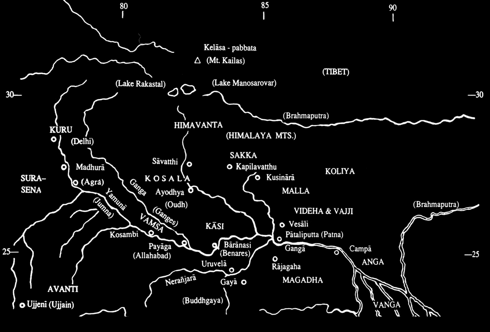
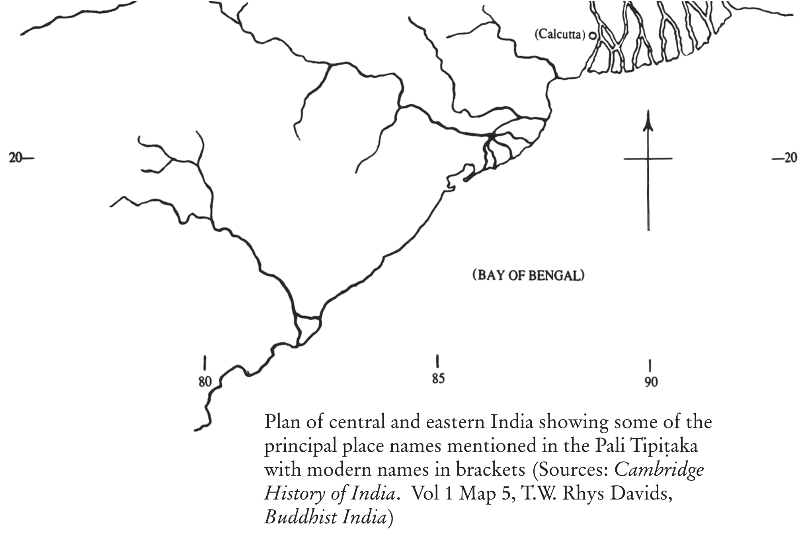

# INTRODUCTION

How little the European public at the end of the 18th century knew of the Buddha and his teaching was underlined by Gibbon in a footnote to Chapter LXIV of the *Decline and Fall*; he says that “the idol Fo” is “The Indian Fo, whose worship prevails among the sects of Hindustan, Siam, Thibet, China and Japan. But this mysterious subject is still lost in a cloud which the researches of our Asiatic Society may gradually dispel.” The fact was that plenty of reliable information had actually come to Europe from the East, but it was not published and remained in manuscript form locked away in libraries. For example, the Jesuit missionary, Filippo Desideri, brought back a long and accurate account both of the Buddha’s life and of his doctrine from Tibet in the first quarter of the eighteenth century: it remained unpublished for two hundred years. Other accounts had fared likewise.

Meanwhile, though, the “cloud” of mystery was dispersed by the researches of the nineteenth century only to be replaced by one of controversial dust raised by scholars’ battles, in which the newly discovered personality of the historical Buddha seemed to vanish again. Nevertheless, this too thinned out, and by the turn of that century the Buddha’s historical existence was no more questioned, documents were assessed and texts established. Of those documents (whose number is enormous) the Pāli Canon, or *Tipitaka* as it is called, was, and is still generally considered to be, the oldest: somewhat older than its Sanskrit counterpart, though some Sanskritists resist this opinion. With that, the Pāli scholar T.W. Rhys Davids was able to write, a little over a century after Gibbon: “When it is recollected that Gotama Buddha did not leave behind him a number of deeply simple sayings, from which his followers subsequently built up a system or systems of their own, but had himself thoroughly elaborated his doctrine, partly as to details, after, but in its fundamental points even before, his mission began; that during his long
career as a teacher, he had ample time to repeat the principles and details of the system over and over again to his disciples, and to test their knowledge of it; and finally that his leading disciples were, like himself, accustomed to the subtlest metaphysical distinctions, and trained in that wonderful command of memory which Indian ascetics then possessed; when these facts are recalled to mind, it will be seen that much more reliance may reasonably be placed upon the doctrinal parts of the Buddhist Scriptures than upon corresponding late records of other religions.”

European literature on the history of Buddhism is now very extensive, and likewise on its literature and on its doctrines. The great measure of agreement achieved in the fields of history and literature, though, is still not reflected in that of doctrine. There have been, and are, numerous and various attempts made to prove that Buddhism teaches annihilation or eternal existence, that it is negativist, positivist, atheist, theist, or inconsistent, that it is a reformed Vedānta, a humanism, pessimism, absolutism, pluralism, monism, that it is a philosophy, a religion, an ethical system, or indeed almost what you will. Nevertheless, the words of the Russian scholar Theodore Stcherbatsky, written in the late 1920s, apply today: “Although a hundred years have elapsed since the scientific study of Buddhism has been initiated in Europe, we are nevertheless still in the dark about the fundamental teachings of this religion and its philosophy. Certainly no other religion has proved so refractory to clear formulation.”

All the books in the Pāli Tipiṭaka that contain historical matter and discourses are composed in the form of anthologies. The Book of Discipline (Vinaya Piṭaka) consists of collections of monastic rules with accounts of incidents, sometimes very long, relating in some way to their pronouncement. The Discourses in the Sutta Piṭaka are grouped together under many and various headings, but never historically (history for history’s sake has not interested India much at any time). Consequently a consecutive chronological account of the Buddha’s life has to be pieced together from material scattered all over the Vinaya and Sutta Piṭakas. That those books do contain a picture complete in itself and strongly contrasting in its simplicity with the ornate and florid later versions (the Sanskrit *Lalita Vistara*, for example, which inspired Sir Edwin Arnold’s *Light of Asia*, or the less known introduction to the Pāli Birth Stories in Ācariya Buddhaghosa’s

Jātaka Commentary). Compared with these, the account it provides of the period up to the Enlightenment seems as lean and polished as a rapier, a candle flame or an uncarved ivory tusk.

In compiling this account all the canonical material (except the Buddhavaṃsa) dealing with the period from the Last Birth down to the second year after the Enlightenment, and that for the last year, which is practically all the chronology the Canon itself provides, has been included. What chronological evidence the Canon itself offers has been given first place. The next most authoritative Pāli source (how reliable, it is difficult to say) is the Commentaries of Ācariya Buddhaghosa (sixth century A.C.), which place a lot more of the canonical stories in order down as far as the twentieth year after the Enlightenment, adding details, and also the Devadatta story. They add as well, a number of non-canonical incidents, which have not been included here. Lastly, there is a late Burmese work, the *Mālānākāravatthu* (fifteenth century? translated into English by Bishop Bigandet under the title *The Story of the Burmese Buddha*), which dates some more canonical incidents; but it has probably no real historical authority at all and has only been followed for want of other guidance. These are the three sources for the arrangement of events, themselves contained in the Tipiṭaka. Other canonical events of special interest, although undatable, have also been included here and there and in the “middle period.” One or two incidents, notably the deaths of King Bimbisāra and King Pasenadi, which are only given in the Commentaries, have also been added (their source being clearly indicated) because they round off certain scenes. The principal aim in compilation has been to include all important events with complete coverage up till the twentieth year after the Enlightenment and the last year. Chapters 9 and 10 are unavoidably episodic. Chapter 11 has been devoted to descriptions of the Buddha’s personality. But “personality” is a subject of central importance in Buddhist doctrine, and so Chapter 12, “The Doctrine,” is necessarily implied by that. In Chapter 12 the main elements of doctrine have been brought together roughly following an order suggested by the Discourses. No interpretation has been attempted (see below, however, paragraph on “translation”), but rather the material has been put together in such a way as to help the reader to make his own. A stereotyped interpretation risks slipping into one of the types of metaphysical wrong view, which the Buddha himself has
described in great detail. If Chapter 12 is found rather forbidding, let the last words of Anāthapiṇḍika (Ch. 6) be pleaded in justification for its inclusion, and those who do not find it to their taste will not read it, or all of it.

Pāli (whose literature is very large) is a language reserved entirely to one subject, namely, the Buddha’s teaching. With that it is unlike Buddhist Sanskrit or Church Latin: a fact that lends it a peculiar clarity of its own without counterpart in Europe. It is one of the Indo-European group and is closely allied to Sanskrit, though of a different flavour. The style in the Suttas (Discourses) has an economic simplicity, coupled with a richness of idioms, that makes it a very polished vehicle hard to do justice to in translation. That is the main problem; but there is also another, the special feature of the repeated verbatim passages, sentences and phrases, which occur again and again. This peculiarity is probably due originally to the fact that these “books” were intended for recitation (we in Europe are used to formal repetitions in symphonic music in the concert hall, and even to refrains in poetry, but in prose we find it strange). To the reader unused to them these repetitions, in the extent to which they appear in the Pāli, seem disagreeable on a printed page. They have therefore for the most part been elided in translation by means of various devices, though always with particular regard to preservation of the original architectural form of the discourses, which is one of the most notable characteristics of the Buddha’s utterances. At the same time, however, some repetitions have been retained, exploiting as they do the valuable technique of “discovery of the familiar.” Such repeats, if verbatim in the Pāli, are verbatim in the English too. In translation two principal aims have been literalness of rendering and idiomaticness of the rendered version: two aims not easy to reconcile. Any translation distorts. Great care, however, has been taken to render technical terms consistently (avoiding “elegant variation”), and the Pāli for these will be found against the English equivalents in the Index. The choice of English equivalents has also been made with great care and with a view to assisting a coherent examination in its English form of material suitable for a study of ontology and a theory of perception and cognition that is embedded in the Discourses (not by accident, it would seem).

There are instances where the Commentaries’ explanation of word-meanings conflicts with those given in the Pāli Text Society’s Dictionary. Preference has then, after consideration, been given to the former. The most important are dealt with in the notes.

The pronunciation of Pāli words and names is quite easy if these simple rules are followed: Pronounce ‘a’ as in countryman, ‘ā’ father, ‘e’ whey, ‘i’ chip, ‘ī’ machine, ‘u’ put, ‘ū’ rude, ‘g’ girl (always), ‘c’ church (always), ‘j’ judge (always), ‘ñ’ onion; t, d, n, l, with tongue on palate; t, d, n, l, with tongue on upper teeth; ‘m’ as in sing; ‘h’ always separately, e.g. ‘ch’ as in which house, ‘th’ as in hot-house, ‘ph’ as in upholstery, etc.; double consonants always separately as in Italian, e.g. ‘dd’ as in mad dog (not madder), ‘gg’ as in big gun (not bigger), etc.; all others as in English. An ‘o’ and an ‘e’ always carry a stress, e.g. Pasenadi of Kosala, otherwise the stress always falls on a long vowel, ā, ī, or ū, or with a doubled consonant or ‘m,’ even if consecutive.

Lastly, a word about the form of this compilation. The form of a “broadcast” (not intended for broadcasting) was suggested by the material itself, which as has been said was originally orally recited. The Vinaya Piṭaka itself suggests the “Voices” (see Ch. 16 and list of Voices preceding Ch. 1), which “rehearsed” the Canon at the Councils. The two “Narrators” are, as it were, two compeers. In contrast to what the “Voices” have to say, the “Narrators” parts have been deliberately flattened in style as well as kept to the minimum length.

BHIKKHU ÑĀÑAMOLI

Plan of central and eastern India showing some of the principal place names mentioned in the Pali Tipiṭaka with modern names in brackets (Sources: *Cambridge History of India*. Vol 1 Map 5, T.W. Rhys Davids, *Buddhist India*)
