# **My Stroke of Insight:** **A Brain Scientist's Personal Journey**

MY STROKE OF INSIGHT: A Brain Scientist's Personal Journey.

Copyright © 2006 by Jill Bolte Taylor.

All rights reserved.

_This book is dedicated to G.G._

_Thank you, Mama, for helping me heal my mind._
_Being your daughter has been my first and greatest blessing._
_And to the memory of Nia._

_There is no love like puppy love._

**CONTENTS**

Introduction

1  Jill s Pre Stroke Life

2  Simple Science

3  Hemispheric Asymmetries

4  Morning of the Stroke

5  Orchestrating My Rescue

6  My Return to the Still

7  Bare to the Bone

8  Neurological Intensive Care

9  Day Two: The Morning After

10  Day Three: GG Comes to Town

11  Healing and Preparing for Surgery

12  Stereotactic Craniotomy

13  What I Needed the Most

14  Milestones for Recovery

15  My Stroke of Insight

16  My Right and Left Minds

17  Own Your Power

18  Cells and Multidimensional Circuitry

19  Finding Your Deep Inner Peace

20  Tending the Garden

Appendix A: Brain Bank Jingle (1 800 BrainBank!)

Appendix B: Recommendations for Recovery

# INTRODUCTION
Every brain has a story and this is mine. Ten years ago, I was at
Harvard Medical School performing research and teaching young
professionals about the human brain. But on December 10, 1996, I was
given a lesson of my own. That morning, I experienced a rare form of
stroke in the left hemisphere of my brain. A major hemorrhage, due to
an undiagnosed congenital malformation of the blood vessels in my
head, erupted unexpectedly. Within four brief hours, through the eyes of
a curious brain anatomist (neuroanatomist), I watched my mind
completely deteriorate in its ability to process information. By the end
of that morning, I could not walk, talk, read, write, or recall any of my
life. Curled up into a little fetal ball, I felt my spirit surrender to my
death, and it certainly never dawned on me that I would ever be capable
of sharing my story with anyone.

_My Stroke Of Insight: A Brain Scientist's Personal Journey_ is a
chronological documentation of the journey I took into the formless
abyss of a silent mind, where the essence of my being became enfolded
in a deep inner peace. This book is a weaving of my academic training
with personal experience and insight. As far as I am aware, this is the
first documented account of a neuroanatomist who has completely
recovered from a severe brain hemorrhage. I am thrilled that
these words will finally go out into the world where they might do the
most good.

More than anything, I am grateful to be alive and celebrative of the
time I have here. Initially, I was motivated to endure the agony of
recovery thanks to the many beautiful people who reached out with
unconditional love. Over the years, I have remained obedient to this
project because of the young woman who contacted me out of
desperation to understand why her mother, who died from stroke, had
not dialed 9-1-1. And because of the elderly gentleman, who was laden
with worry that his wife had suffered enormously while in a coma before
her death. I have remained tethered to my computer (with my faithful
dog Nia on my lap) for the many caregivers who have called in search of
direction and hope. I have persisted with this work for the 700,000
people in our society (and their families) who will experience stroke this
year. If just one person reads "The Morning of the Stroke," recognizes
the symptoms of stroke and calls for help - sooner rather than later, then
my efforts over the last decade will be more than rewarded.

_My Stroke of Insight_ falls into four natural divisions. The first
portion, "Jill's Pre-Stroke Life," introduces you to who I was before my
brain went offline. I describe why I grew up to be a brain scientist, a
little of my academic journey, my advocacy interests, and my personal
quest. I was living large. I was a brain scientist at Harvard, serving on
the national board of NAMI (the National Alliance on Mental Illness)
and traveling the country as the _Singin' Scientist._ I follow this very brief
personal synopsis with a little simple science, which is designed to help
you understand what was going on in my brain biologically on the
morning of the stroke.

If you ever wondered what it might feel like to have a stroke, then
"The Morning of the Stroke" chapters are for you. Here, I take you on a
very unusual journey into the step-by-step deterioration of my cognitive
abilities, as viewed through the eyes of a scientist. As the hemorrhage in
my brain grew larger and larger, I relate the cognitive deficits I
was experiencing to the underlying biology. As a neuroanatomist, I must
say that I learned as much about my brain and how it functions during
that stroke, as I had in all my years of
academia. By the end of that morning, my consciousness shifted into a
perception that I was at _one_ with the universe. Since that time, I have

come to understand how it is that we are capable of having a "mystical"
or "metaphysical" experience - relative to our brain anatomy.

If you know of someone who has had a stroke or some other type
of brain trauma, then the recovery chapters may
prove to be an invaluable resource. Here, I share the chronological
journey of my recovery, including over fifty tips about things I needed
(or didn't need) in order to recover completely. My "Recommendations
for Recovery" are listed in Appendix B for your convenience. I hope you
will share this information with anyone who may benefit.

Finally, "My Stroke of Insight" defines what this stroke has taught
me about my brain. At this point, you will realize that this book is not
really about stroke. More accurately, the stroke was the traumatic event
through which the insight came. This book is about the beauty and
resiliency of our human brain because of its innate ability to
constantly adapt to change and recover function. Ultimately, it's
about my brain's journey into my right hemisphere's
consciousness, where I became enveloped in a deep inner peace. I
have resurrected the consciousness of my left hemisphere in order to
help others achieve that same inner peace - without having to experience
stroke! I hope you enjoy the journey.

# ONE JILL'S PRE-STROKE LIFE
I am a trained and published neuroanatomist. I grew up in Terre
Haute, Indiana. One of my older brothers, who is only 18 months older
than I, is diagnosed with the brain disorder schizophrenia. He was
officially diagnosed at the age of 31, but showed obvious signs of
psychosis for many years prior to that. During our childhood, he was
very different from me in the way he experienced reality and chose to
behave. As a result, I became fascinated with the human brain at an early
age. I wondered how it could be possible that my brother and I could
share the same experience but walk away from the situation with
completely different interpretations about what had just happened. This
difference in perception, information processing, and output motivated
me to become a brain scientist.

My undergraduate academic journey began at Indiana University
in Bloomington, Indiana in the late 1970s. Because of my interactions
with my brother, I was hungry to understand what "normal" was at a
neurological level. At that time, the subject of neuroscience was such a
young field that it was not yet offered on the IU campus as a formal area
of specialization. By studying both physiological psychology and human
biology, I learned as much as I could about the human brain.

My first real job in the world of medical science turned out to be
an enormous blessing in my life. I was hired as a lab technician at the
Terre Haute Center for Medical Education (THCME), which is a branch
of the Indiana University School of Medicine hosted on the campus of

Indiana State University (ISU). My time was evenly divided between the
medical human gross anatomy lab and the neuroanatomy research lab.
For two years, I was immersed in medical education and, while
mentored by Dr. Robert C. Murphy, I fell in love with dissecting the
human body.

Bypassing the master's degree, I spent the next six years officially
enrolled in the ISU Department of Life Science Ph.D. program. My
course load was dominated by the first-year medical school curriculum,
and my research specialty was neuroanatomy under the guidance of Dr.
William J. Anderson. In 1991, I received my doctorate and felt
competent to teach Human Gross Anatomy, Human Neuroanatomy, and
Histology at the medical school level.

In 1988, during my time at the THCME and ISU, my brother was
officially diagnosed with schizophrenia. Biologically, he is the closest
thing to me that exists in the universe. I wanted to understand why I
could take my dreams and connect them to reality and make my dreams
come true. What was different about my brother's brain such that he
could not connect his dreams to a common reality and they instead
became delusions? I was eager to pursue research in schizophrenia.

Following commencement from ISU, I was offered a postdoctoral
research position at Harvard Medical School in the Department of
Neuroscience. I spent two years working with Dr. Roger Tootell on the
localization of Area MT, which is located in the part of the brain's visual
cortex that tracks movement. I was interested in this project because a
high percentage of individuals diagnosed with schizophrenia exhibit
abnormal eye behavior when watching moving objects. After helping
Roger anatomically identify Area MT's
location in the human brain, [1] I followed my heart and transferred into
the Harvard Medical School Department of Psychiatry. It was my goal to
work in the lab of Dr. Francine M. Benes at McLean Hospital. Dr. Benes
is a world-renowned expert in the postmortem investigation of the
human brain as it relates to schizophrenia. I believed this would be how
I could make my contribution to helping people stricken with the same
brain disorder as my brother.

The week before I began my new position at McLean Hospital, my
dad Hal and I flew to Miami to attend the 1993 annual conference of
NAMI, the National Alliance on Mental Illness. [2] Hal, a retired
Episcopalian minister with a Ph.D. in counseling psychology, had
always been an advocate for social justice. We were both motivated to
attend this convention to learn more about NAMI and what we could do
to merge our energy with theirs. NAMI is the largest grassroots
organization dedicated to improving the lives of persons living with
serious mental illness. At that time, NAMI had a membership of
approximately 40,000 families with a loved one who is psychiatricallydiagnosed. Now NAMI has a membership of approximately 220,000 families. The National NAMI organization advocates at the national
level while the State NAMIs advocate at the state level. In addition,
there are over 1100 local NAMI affiliates scattered around the country
providing support, education, and advocacy opportunities for families at
the community level.

That trip to Miami changed my life. A group of around 1,500
people, comprised of parents, siblings, offspring, and individuals
diagnosed with severe mental illness, gathered together for support,
education, advocacy, and research-related issues. Until I met other
siblings of individuals with mental illness, I had not realized what a
profound impact my brother's illness had had on my life. In the course of
those few days, I found a family of people who understood the anguish I
felt at the loss of my brother to his schizophrenia. They understood my
family's struggle to help him access quality treatment. They fought
together as an organized voice against the social injustice and stigma
related to mental illness. They were armed with educational programs
for themselves, as well as for the public, about the biological nature of
these disorders. Equally important, they rallied with the brain
researchers to help find a cure. I felt that I was in the right place at the
right time. I was a sibling, a scientist and passionate about helping
people like my brother. In my soul I felt that I had found not only a
cause worthy of my effort, but also an extended family.

The week after the Miami convention, I arrived at McLean
Hospital stoked and eager to start my new job in the Laboratory for
Structural Neuroscience, the research domain of Dr. Francine Benes. I
was all a-buzz and thrilled to begin my postmortem investigations into
the biological basis of schizophrenia. Francine, whom I affectionately
call the "Queen of Schizophrenia," is an amazing research scientist. Just
watching how she thinks, how she explores and how she pieces together
what she learns from data was a total joy for me. It was a privilege to
witness her creativity in experimental design and her persistence,
precision, and efficiency in running a research lab. This job was a dream
come true. Studying the brains of individuals diagnosed with
schizophrenia brought me a feeling of purpose.

On the first day of my new job, however, Francine threw me for a
loop when she informed me that the infrequency of brain donations from
families of individuals with mental illness had created a long-term
shortage of brain tissue for postmortem investigation. I couldn't believe
what I was hearing. I had just spent the better half of a week at National
NAMI with hundreds of other families with
members diagnosed with severe mental illness. Dr. Lew Judd, a former
director of the National Institute of Mental Health, had moderated the
research plenary, and several leading scientists had presented their
research. NAMI families love sharing and learning about brain research,
so I found it mind-boggling that there could be a lack of donated tissue. I
decided this was merely a public awareness issue. I believed that once
NAMI families knew that there was a research tissue shortage, they
would promote brain donation within the organization and resolve the
problem.

The next year (1994), I was elected to the National NAMI Board
of Directors. It was a thrill for me to be of service to this wonderful
organization, a huge honor and responsibility. Of course, the base of my
platform was the value of brain donation and the shortage of
psychiatrically-diagnosed tissue available for scientists to do their work.
I called it the "Tissue Issue." At the time, the average age of a NAMI
member was 67 years old. I was only 35. I felt proud to be the youngest
person ever elected to this board. I had lots of energy and was raring to
go.

With my new status within the National NAMI organization, I
immediately began keynoting at State NAMI annual conventions all
around the country. Before I began this venture, the Harvard Brain
Tissue Resource Center (Brain Ban ~~k~~ [2] ~~)~~, which was positioned right next
to the Benes Lab, was receiving fewer than three brains a year from
psychiatrically-diagnosed individuals. This was barely enough tissue for
Francine's lab to do its work, much less for the Brain Bank to supply
tissue to the other reputable labs that requested it. Within a few months
of my traveling around and educating our NAMI families about the
"Tissue Issue," the number of brain donations began to increase.
Currently, the number of donations from the psychiatrically-diagnosed
population ranges from 25-35 per year. The scientific community would
make good use of 100 per year.

I realized that early on in my "Tissue Issue" presentations, the
subject of brain donation would make some of my audience members
squirm uncomfortably. There was this predictable moment when my
audience would realize, "Oh my gosh, she wants MY brain!" And I
would say to them, "Well yes, yes I do, but don't worry, I'm in no hurry!"
To combat their obvious apprehension, I wrote the Brain Bank jingle
titled "1-800-BrainBank!" [3] and began traveling with my guitar as the
_Singin' Scientist._ _[4]_ As I neared the subject of brain donation and the
tension in the room began to rise, I'd pull out my guitar and sing for
them. The Brain Bank jingle seems to be just goofy enough to
effectively dampen the tension, open hearts, and make it okay for me to
communicate my message.

My efforts with NAMI brought deep meaning to my life and my
work in the lab flourished. My primary research project in the Benes lab
involved working with Francine to create a protocol where we could
visualize three neurotransmitter systems in the same piece of tissue.
Neurotransmitters are the chemicals with which brain cells
communicate. This was important work since the newer atypical
antipsychotic medications are designed to influence multiple
neurotransmitter systems rather than just one. Our ability to visualize
three different systems in the same piece of tissue increased our ability
to understand the delicate interplay between these systems. It was our
goal to better understand the microcircuitry of the brain - which cells in
which areas of the brain communicate with which chemicals and in what
quantities of those chemicals. The better we
understood what the differences were, at a cellular level, between the
brains of individuals diagnosed with a severe mental illness and normal
control brains, the closer the medical community would be to helping
those in need with appropriate medications. In the spring of 1995, this
work was featured on the cover of _BioTechniques Journal_ and in 1996 it
won me the prestigious Mysell Award from the Harvard Medical School
Department of Psychiatry. I loved working in the lab and I loved sharing
this work with my NAMI family.

And then the unthinkable happened. I was in my mid-thirties and
thriving both professionally and personally. But in one fell swoop, the
rosiness of my life and promising future evaporated. I woke up on
December 10, 1996, to discover that I had a brain disorder of my own. I
was having a stroke. Within four brief hours, I watched my mind
completely deteriorate in its ability to process all stimulation coming in
through my senses. This rare form of hemorrhage rendered me
completely disabled whereby I could not walk, talk, read, write, or recall
any aspects of my life.

I realize you are probably eager to begin reading the personal
account of the morning of the stroke. However, in order for you to more
clearly understand what was going on inside my brain, I have chosen to
present some simple science in Chapters Two and Three. Please don't let
this section scare you away. I have done my best to keep it user-friendly
with lots of simple pictures of the brain so you can understand the

anatomy underlying my cognitive, physical, and spiritual experiences. If
you absolutely must skip these chapters, then rest assured they will be
here for you as a reference. I encourage you to read this section first,
however, as I believe it will profoundly simplify your understanding.

[1]: R.B.H Tootell and J.B. Taylor, "Anatomical Evidence for MT/V5 and Additional Cortical Visual Areas in Man," in
_Cerebral Cortex_ (Jan/Feb 1995) 39-55.

[2]: [www.brainbank.mclean.org](http://www.brainbank.mclean.org/) or 1-800-BrainBank

[3]:See Appendix A for the lyrics to the Brain Bank jingle.

[4]:[www.drjilltaylor.com](http://www.drjilltaylor.com/)

# 2. Simple Science

For any two of us to communicate with one another, we must
share a certain amount of common reality. As a result, our nervous
systems must be virtually identical in their ability to perceive
information from the external world, process and integrate that
information in our brains, and then have similar systems of output
including thought, word, or deed.

The emergence of life was a most remarkable event. With the
advent of the single-celled organism, a new era of information
processing was born at the molecular level. Through the manipulation
of atoms and molecules into DNA and RNA sequences, information
could be entered, coded, and stored for future use. Moments in time no
longer came and went without a record and, by interweaving a
continuum of sequential moments into a common thread, the life of the
cell evolved as _a bridge across time_ . Before long, cells figured out ways
of hanging together and working together, which finally produced you
and me.

According to the _American Heritage Dictionary,_ to evolve
biologically means "to develop by evolutionary processes from a
primitive to a more highly organized form. ~~"~~ [1]

Earth's molecular brain of DNA is a powerful and successful genetic
program - not only because it adapts to constant change, but also
because it expects, appreciates, and takes advantage of opportunities to
transform itself into something even more magnificent. It is perhaps of
interest that our human genetic code is constructed by the exact same
four nucleotides (complex molecules) as every other form of life on the
planet. At the level of our DNA, we are related to the birds, reptiles,
amphibians, other mammals, and even the plant life. From a purely
biological perspective, we human beings are our own species-specific
mutation of earth's genetic possibility.

As much as we would like to think that human life has attained
biological perfection, despite our sophisticated design, we do not
represent a finished and/ or perfect genetic code. The human brain exists
in an ongoing state of change. Even the brains of our ancestors of 2000
or 4000 years ago do not look identical to the brains of man today. The
development of language, for example, has altered our brains'
anatomical structure and cellular networks.

Most of the different types of cells in our body die and are
replaced every few weeks or months. However, neurons, the primary
cell of the nervous system, do not multiply (for the most part) after we
are born. That means that the majority of the neurons in your brain today
are as old as you are. This longevity of the neurons partially accounts for
why we feel pretty much the same on the inside at the age of 10 as we do
at age 30 or 77. The cells in our brain are the same but over time their
connections change based upon their/our experience.

The human nervous system is a wonderfully dynamic entity
composed of an estimated one trillion cells. To give you some
appreciation for how enormous one trillion is, consider this: there are
approximately six billion people on the planet and we would have to
multiply all six billion people 166 times just to make up the number of
cells
combining to create a single nervous system!

Of course, our body is much more than a nervous system. In fact,
the typical adult human body is composed of approximately fifty trillion
cells. That would be 8,333 times all of the six billion people on the
planet! What's amazing is that this huge conglomeration of bone cells,
muscle cells, connective tissue cells, sensory cells, etc. tend to get along
and work together to generate perfect health.

Biological evolution generally occurs from a state of lesser
complexity to a state of greater complexity. Nature ensures her own
efficiency by not reinventing the wheel with every new species she
creates. Generally, once nature identifies a pattern in the genetic code
that works toward the survival of the creature, like a blossom for nectar
transmission, a heart to pump blood, a sweat gland to help regulate body
temperature or an eyeball for vision, she tends to build that feature into
future permutations of that specific code. By adding a new level of
programming on top of an already well-established set of instructions,
each new species contains a strong foundation of time-tested DNA
sequences. This is one of the simple ways through which nature
transmits the experience and wisdom bestowed by ancient life to her
progeny.

Another advantage to this type of build-on-top-of-what-alreadyworks genetic engineering strategy is that very small manipulations of
the genetic sequences can result in major evolutionary transformations.
In our own genetic profile, believe it or not, scientific evidence indicates
that we humans share 99.4% of our total DNA sequences with the
chimpanzee. [2]

This does not mean, of course, that humans are direct descendants
from our tree-swinging friends, but it does emphasize that the genius of
our molecular code is supported by eons of nature's greatest evolutionary
effort. Our human code was not a random act, at least not in its entirety,
but rather is better construed as nature's ever-evolving quest for a body
of genetic perfection.

As members of the same human species, you and I share all but
0.01% (1/100th of 1%) of identical genetic sequences. So biologically, as
a species, you and I are virtually identical to one another at the level of
our genes (99.99%). Looking around at the diversity within our human
race, it is obvious that 0.01% accounts for a significant difference in how
we look, think, and behave.

The portion of our brain that separates us from all other mammals
is the outer undulated and convoluted cerebral cortex. Although other
mammals do have a cerebral cortex, the human cortex has approximately
twice the thickness and is believed to have twice the function. Our
cerebral cortex is divided into two major hemispheres, which
complement one another in function. (Note: All of the pictures in this
book have the front of the brain directed to the left).

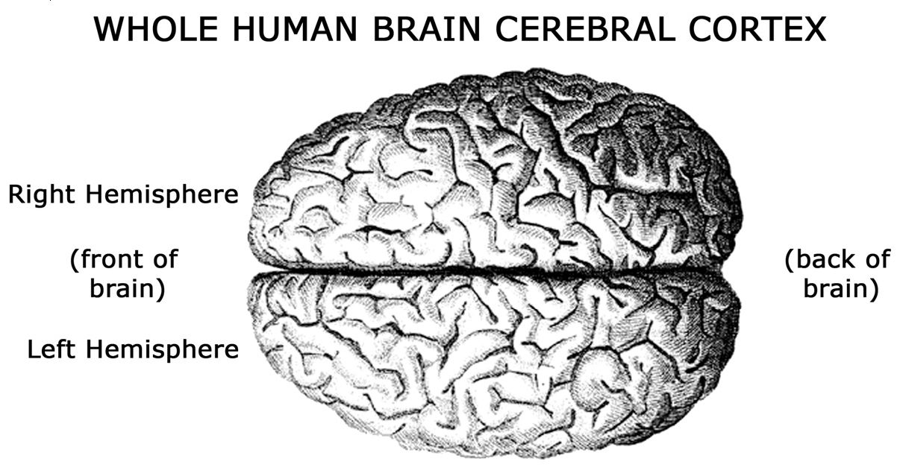

>Right Hemisphere: Chỉ vào nửa trên của bộ não (Bán cầu não phải).
>Left Hemisphere: Chỉ vào nửa dưới của bộ não (Bán cầu não trái).
>(front of brain): Nằm ở phía bên trái của hình ảnh, chỉ mặt trước của não.
>(back of brain): Nằm ở phía bên phải của hình ảnh, chỉ mặt sau của não.

The two hemispheres communicate with one another through the highway
for information transfer, the corpus callosum. Although each hemisphere is
unique in the specific
types of information it processes, when the two hemispheres are
connected to one another, they work together to generate a single
seamless perception of the world.

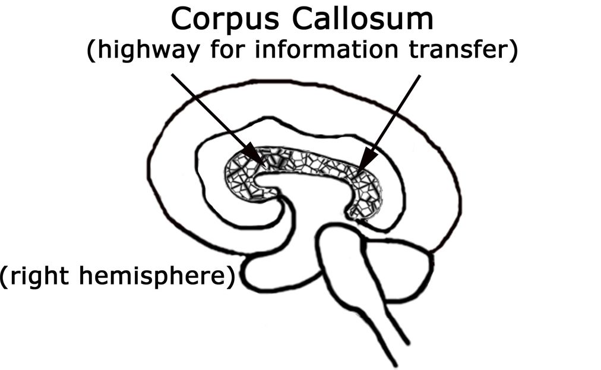
>Corpus Callosum (highway for information transfer) (đường cao tốc truyền tải thông tin)
>right hemisphere: bán cầu não phải

When it comes to the intricate microscopic anatomy of how our
cerebral cortices are finely wired, variation is the rule, not the exception.
This variation contributes to our individual preferences and
personalities. However, the gross (or macroscopic) anatomy of our
brains is quite consistent and your brain looks very similar to mine. The
bumps (gyri) and grooves (sulci) of the cerebral cortex are specifically
organized such that our brains are virtually identical in appearance,
structure, and function. For example, each of our cerebral hemispheres
contain a superior temporal gyrus, pre-and postcentral gyri, a superior
parietal gyrus, along with a lateral occipital gyrus - just to mention a
few. Each of these gyri are made up of very specific groups of cells that
have very specific connections and functions.

For instance, the cells of the postcentral gyrus enable us to be
consciously aware of sensory stimulation, while the cells in the
precentral gyrus control our ability to voluntarily move our body parts.
The major pathways for information transfer between the various
cortical groups of cells (fiber tracts) within each of the two hemispheres
are also consistent between us and, as a result, we are generally capable
of thinking and feeling in comparable ways.

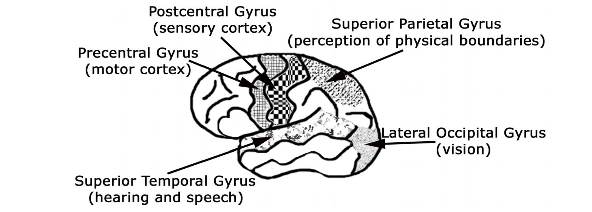

>Postcentral Gyrus (sensory cortex): Vùng não được đánh dấu bằng họa tiết caro đen trắng, có chức năng vỏ não cảm giác.
>Precentral Gyrus (motor cortex): Vùng não được đánh dấu bằng họa tiết sọc ngang, có chức năng vỏ não vận động.
>Superior Parietal Gyrus (perception of physical boundaries): Vùng não được đánh dấu bằng họa tiết chấm nhỏ, có chức năng nhận thức ranh giới vật lý.
>Lateral Occipital Gyrus (vision): Vùng não được đánh dấu bằng họa tiết các đốm lớn nhỏ, có chức năng thị giác.
>Superior Temporal Gyrus (hearing and speech): Vùng não được đánh dấu bằng họa tiết hạt, có chức năng nghe và nói.

The blood vessels supplying nutrients to our cerebral
hemispheres also display a defined pattern. The anterior,
middle, and posterior cerebral arteries supply blood to each
of the two hemispheres. Damage to any specific branch of
one of these major arteries may result in somewhat
predictable symptoms of severe impairment or complete
elimination of our ability to perform specific cognitive
functions. (Of course there are unique differences between
damage to the right and left hemispheres.) The following
illustration shows the territory of the middle cerebral artery
of the left hemisphere, and this includes the location of my
stroke. Damage to any of the middle cerebral artery's
primary branches would result in relatively predictable
symptoms no matter who was having the problem.

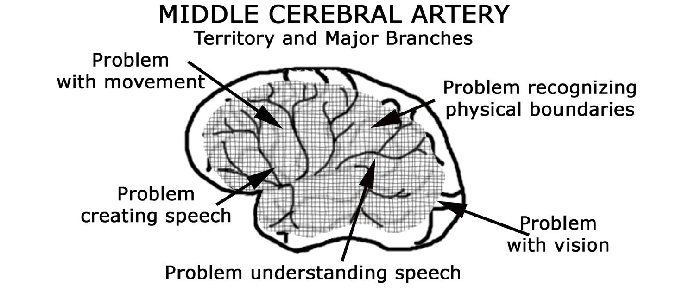

>MIDDLE CEREBRAL ARTERY: ĐỘNG MẠCH NÃO GIỮA
>Territory and Major Branches: Vùng cấp máu và các nhánh chính
>Problem with movement: Vấn đề về cử động (Chỉ vùng não liên quan đến chức năng vận động).
>Problem creating speech: Vấn đề tạo ra lời nói (Chỉ vùng não Broca, liên quan đến sản xuất ngôn ngữ).
>Problem understanding speech: Vấn đề hiểu lời nói (Chỉ vùng não Wernicke, liên quan đến việc hiểu ngôn ngữ).
>Problem recognizing physical boundaries: Vấn đề nhận diện ranh giới vật lý (Chỉ vùng não liên quan đến nhận thức không gian và ranh giới cơ thể).
>Problem with vision: Vấn đề về thị lực (Chỉ vùng não liên quan đến xử lý thông tin thị giác).

The superficial layers of the cortex, which we see when we look at the external
surface of the brain, are filled
with neurons that we believe to be uniquely human. These
most recently "added on" neurons create circuits that
manufacture our ability to think linearly - as in complex
language and the ability to think in abstract, symbolic
systems like mathematics. The deeper layers of the
cerebral cortex make up the cells of the limbic system.
These are the cortical cells we share with other mammals.

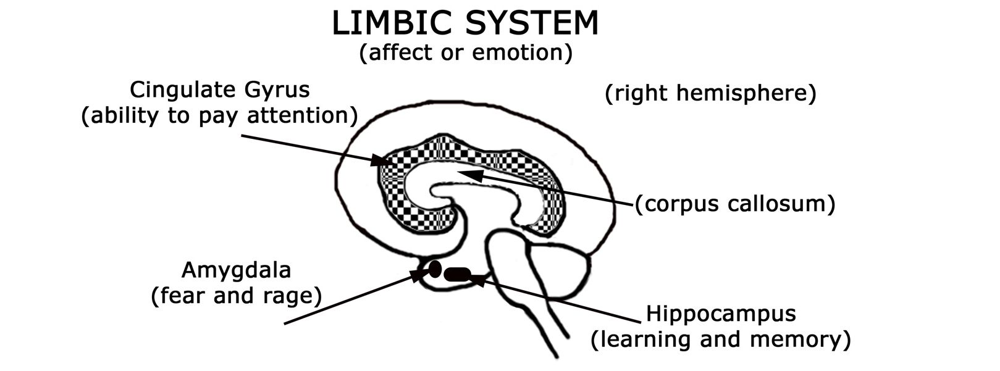

>LIMBIC SYSTEM: HỆ THỐNG LIMBIC
>(affect or emotion): (cảm xúc hoặc tình cảm)
>Cingulate Gyrus: Hồi đai
>(ability to pay attention): (khả năng chú ý)
>(right hemisphere): (bán cầu não phải)
>(corpus callosum): (thể chai) - cấu trúc kết nối hai bán cầu não, giúp truyền thông tin giữa chúng.
>Amygdala: Hạch hạnh nhân
>(fear and rage): (sợ hãi và giận dữ)
>Hippocampus: Hồi hải mã
>(learning and memory): (học tập và trí nhớ)

The limbic system functions by placing an affect, or
emotion, on information streaming in through our senses.
Because we share these structures with other creatures, the
limbic system cells are often referred to as the "reptilian
brain" or the "emotional brain." When we are newborns,
these cells become wired together in response to sensory
stimulation. It is interesting to note that although our
limbic system functions throughout our lifetime, it does
not mature. As a result, when our emotional "buttons" are
pushed, we retain the ability to react to incoming
stimulation as though we were a two year old, even when
we are adults.

As our higher cortical cells mature and become
integrated in complex networks with other neurons, we
gain the ability to take "new pictures" of the present
moment. When we compare the new information of our
thinking mind with the automatic reactivity of our limbic
mind, we can reevaluate the current situation and
purposely choose a more mature response.

It might be of interest to note that all of today's "brain
based learning" techniques used in elementary through high school
capitalize on what neuroscientists understand about the functions of the
limbic system. With these learning techniques, we try to transform our
classrooms into environments that feel safe and familiar. The objective is
to create an environment where the brain's fear/rage response (amygdala)
is not triggered. The primary job of the amygdala is to scan all incoming
stimulation in this immediate moment and determine the level of safety.
One of the jobs of the cingulate gyrus of the limbic system is to focus the
brain's attention.

When incoming stimulation is perceived as familiar, the amygdala
is calm and the adjacently positioned hippocampus is capable of learning
and memorizing new information. However, as soon as the amygdala is
triggered by unfamiliar or perhaps threatening stimulation, it raises the
brain's level of anxiety and focuses the mind's attention on the
immediate situation. Under these circumstances, our attention is shifted
away from the hippocampus and focused toward self-preserving
behavior about the present moment.

Sensory information streams in through our sensory systems and is
immediately processed through our limbic system. By the time a
message reaches our cerebral cortex for higher thinking, we have already
placed a "feeling" upon how we view that stimulation - is this pain or is
this pleasure? Although many of us may think of ourselves as _thinking_
_creatures that feel,_ biologically we are _feeling creatures that think_ .

Because the term "feeling" is broadly used, I'd like to clarify
where different experiences occur in our brain. First, when we
experience _feelings_ of sadness, joy, anger, frustration, or excitement,
these are emotions that are generated by the cells of our limbic system.
Second, to _feel_ something in your hands refers to the tactile or
kinesthetic experience of feeling through the action of palpation. This
type of feeling occurs via the sensory system of touch and involves the
postcentral gyrus of the cerebral cortex. Finally, when someone contrasts
what he or she _feels_ intuitively about something (often expressed as a
"gut feeling") to what they think about it, this insightful awareness is a
higher cognition that is grounded in the right hemisphere of the cerebral
cortex. (In Chapter Three we will discuss more thoroughly the different
ways in which the right and left cerebral hemispheres operate.)

As information processing machines, our ability to process data
about the external world begins at the level of sensory perception.
Although most of us are rarely aware of it, our sensory receptors are
designed to detect information at the energy level. Because everything
around us - the air we breathe, even the materials we use to build with,
are composed of spinning and vibrating atomic particles, you and I are
literally swimming in a turbulent sea of electromagnetic fields. We are
part of it. We are enveloped within it, and through our sensory apparatus
we experience _what is._

Each of our sensory systems is made up of a complex cascade of
neurons that process the incoming neural code from the level of the
receptor to specific areas within the brain. Each group of cells along the
cascade alters or enhances the code, and passes it on to the next set of
cells in the system, which further defines and refines the message. By
the time the code reaches the outermost portion of our brain, the higher
levels of the cerebral cortex, we become conscious of the stimulation.
However, if any of the cells along the pathway fail in their ability to
function normally, then the final perception is skewed away from normal
reality.

Our visual field, the entire view of what we can see when we look
out into the world, is divided into billions of tiny spots or pixels. Each
pixel is filled with atoms and molecules that are in vibration. The retinal
cells in the back of our eyes detect the movement of those atomic
particles. Atoms vibrating at different frequencies emit different

wavelengths of energy, and this information is eventu coded as
different colors by the visual cortex in the occi region of our
brain. A visual image is built by our br ability to package
groups of pixels together in the form edges. Different edges
with different orientations - vert horizontal, and oblique,
combine to form complex ima Different groups of cells in our
brain add depth, color, motion to what we see. Dyslexia,
whereby some wr letters are perceived in reverse from normal,
is a g example of a functional abnormality that can occur when
normal cascade of sensory input is altered.

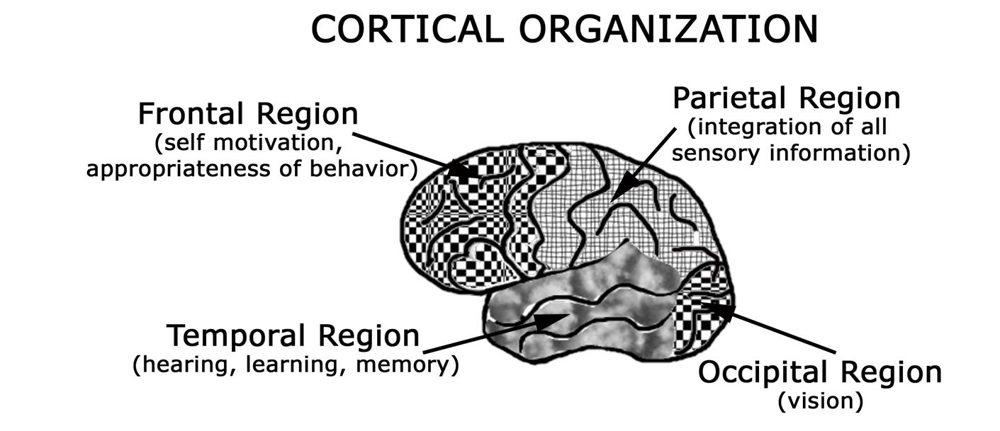

>CORTICAL ORGANIZATION: TỔ CHỨC VỎ NÃO
>Frontal Region: Vùng trán
>(self motivation, appropriateness of behavior): (động lực bản thân, sự phù hợp của hành vi)
>Parietal Region: Vùng đỉnh
>(integration of all sensory information): (tích hợp tất cả thông tin cảm giác)
>Temporal Region: Vùng thái dương
>(hearing, learning, memory): (nghe, học tập, trí nhớ)
>Occipital Region: Vùng chẩm (vision): (thị giác)

Similar to vision, our ability to hear sound also depends
upon our detection of energy traveling at different wavelengths.

Sound is the product of atomic particles in space colliding with
one another and emitting patterns of energy. The energy
wavelengths, created by the bombarding particles, beat upon the
tympanic membrane in our ear. Different wavelengths of sound
vibrate our eardrum with unique properties. Similar to our retinal
cells, the hair cells of our auditory Organ of Corti translate this
energy vibration in our ear into a neural code. This eventually
reaches the auditory cortex (in the temporal region of our brain)
and we hear sound.

Our most obvious abilities to sense atomic/molecular
information occur through our chemical senses of smell and
taste. Although these receptors are sensitive to individual
electromagnetic particles as they waft past our nose or titillate our taste
buds, we are all unique in how much stimulation is required before we
can smell or taste something. Each of these sensory systems is also made
up of a complex cascade of cells, and damage to any portion of the
system may result in an abnormal ability to perceive.

Finally, our skin is our largest sensory organ, and it is stippled with
very specific sensory receptors designed to experience pressure,
vibration, light touch, pain, or temperature. These receptors are precise
in the type of stimulation they perceive such that only cold stimulation
can be perceived by cold sensory receptors and only vibration can be
detected by vibration receptors. Because of this specificity, our skin is a
finely mapped surface of sensory reception.

The innate differences we each experience in terms of how
sensitive we are to different types of stimulation contribute greatly to
how we perceive the world. If we have problems hearing when people
speak, then we will hear only bits and pieces of conversation and make
decisions and judgments based upon minimal information. If our
eyesight is poor, then we will focus on fewer details and our interaction
with the world will be affected. If our sense of smell is deficient, then we
may not be able to discriminate between a safe environment and a health
hazard, rendering us more vulnerable. At the opposite extreme, if we are
oversensitive to stimulation, we may avoid interacting with our
environment and miss out on life's simple pleasures.

Pathology and disease of the mammalian nervous system generally
involves the brain tissue that distinguishes that specific species from
other species. Consequently, in the case of the human system, the outer
layers of our cerebral cortex are often vulnerable to disease. Stroke is the
number one disabler in our society and the number three killer.

Because neurological disease often involves the higher cognition
layers of our cerebral cortex, and because stroke occurs four times
more frequently in the left cerebral hemisphere, our ability to create or
understand language is often compromised. The term stroke refers to a
problem with the blood vessels carrying oxygen to the cells of the
brain, and there are basically two types: ischemic (ih-skee-mik) and
hemorrhagic (hem-o-radg-ik).

According to the American Stroke Association, the ischemic
stroke accounts for approximately 83% of all strokes. Arteries carry
blood into the brain and their shape tapers smaller and smaller as they
travel farther away from the heart. These arteries carry life-supporting
oxygen necessary for cells, including neurons, to survive. With
ischemic stroke, a blood clot travels into the artery until the tapered
diameter of the artery becomes too small for the clot to pass any
farther. The blood clot blocks the flow of oxygen-rich blood to the
cells beyond the point of obstruction. Consequently, brain cells
become traumatized and often die. Since neurons generally do not
regenerate, the dead neurons are not replaced. The function of the
deceased cells may be lost permanently, unless other neurons adapt
over time to carry out their function. Because every brain is unique in
its neurological wiring, every brain is unique in its ability to recover
from trauma.

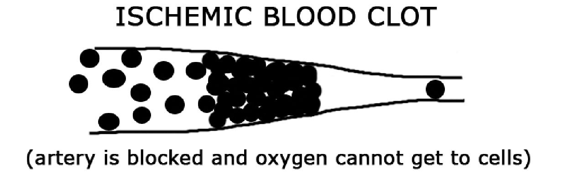

>ISCHEMIC BLOOD CLOT: CỤC MÁU ĐÔNG GÂY THIẾU MÁU CỤC BỘ (hay Huyết khối tắc mạch thiếu máu cục bộ)
>(artery is blocked and oxygen cannot get to cells): (động mạch bị tắc nghẽn và oxy không thể đến được các tế bào)

The hemorrhagic stroke occurs when blood escapes from the
arteries and floods into the brain. Seventeen percent of all strokes are
hemorrhagic. Blood is toxic to neurons when it comes in direct contact
with them, so any leak or

vascular blowout can have devastating effects on the brain. One form
of stroke, the aneurysm (an-yu-rism), forms when there is a weakening
in the wall of a blood vessel that consequently balloons out. The
weakened area fills with blood and can readily rupture, spewing large
volumes of blood into the skull. Any type of hemorrhage is often life
threatening.

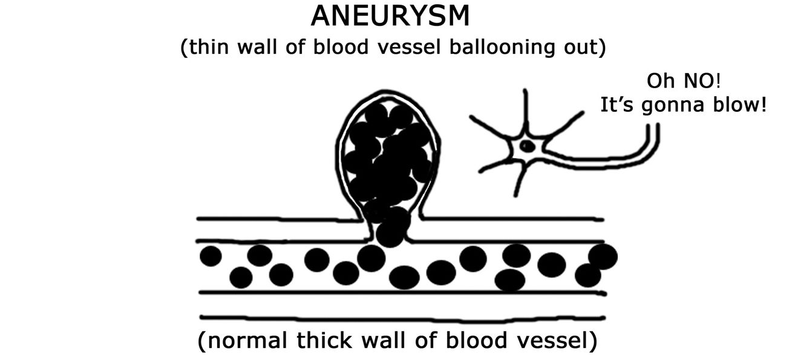

>ANEURYSM: PHÌNH MẠCH
>(thin wall of blood vessel ballooning out): (thành mạch máu mỏng bị phình ra)
>Oh NO! It's gonna blow!: Ối KHÔNG! Nó sắp vỡ rồi! (Lời cảnh báo về nguy cơ vỡ phình mạch).
>(normal thick wall of blood vessel): (thành mạch máu dày bình thường)

An arteriovenous malformation (AVM) is a rare form of
hemorrhagic stroke. It is a congenital disorder whereby an individual
is born with an abnormal arterial configuration. Normally, the heart
pumps blood through arteries with high pressure while blood is
retrieved through veins, which are low pressure. A capillary bed acts
as a buffering system or neutral zone between the high-pressure
arteries and the low-pressure veins.

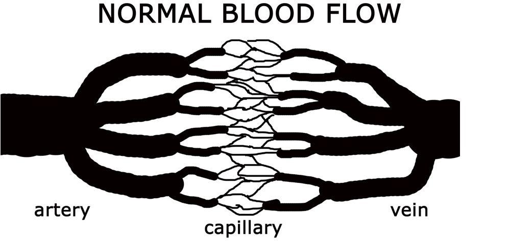

>NORMAL BLOOD FLOW: LƯU LƯỢNG MÁU BÌNH THƯỜNG
>artery: động mạch (Mạch máu mang máu giàu oxy từ tim đi nuôi cơ thể)
>capillary: mao mạch (Các mạch máu nhỏ nhất, nơi diễn ra sự trao đổi chất giữa máu và tế bào)
>vein: tĩnh mạch (Mạch máu mang máu đã khử oxy trở về tim)

In the case of the AVM, an artery is directly connected to a vein
with no buffering capillary bed in between. Over time, the vein can no
longer handle the high pressure from

the artery and the connection between the artery and vein is broken spilling blood into the brain. Although the AVM accounts for only 2% of
all hemorrhagic strokes, [3] it is the most common form of stroke that
strikes people during their prime years of life (ages 25-45). I was 37
when my AVM blew.

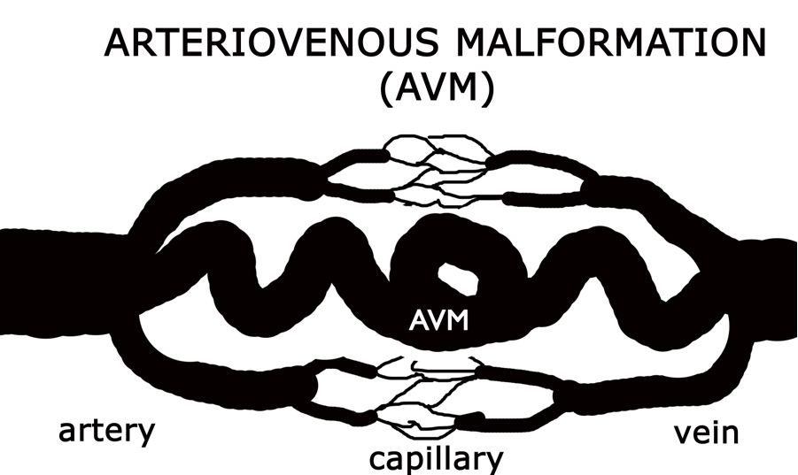
>ARTERIOVENOUS MALFORMATION (AVM): DỊ DẠNG ĐỘNG TĨNH MẠCH (AVM)
>Giải thích: Đây là một tình trạng bẩm sinh trong đó có một kết nối bất thường giữa động mạch và tĩnh mạch, bỏ qua mạng lưới mao mạch thông thường.
>AVM: Dị dạng động tĩnh mạch (viết tắt của Arteriovenous Malformation), chỉ phần dị dạng trong hình.
>artery: động mạch
>capillary: mao mạch
>vein: tĩnh mạch

Regardless of the mechanical nature of the vascular problem, be it
a blood clot or a hemorrhage, no two strokes are identical in their
symptoms because no two brains are absolutely identical in their
structure, connections or ability to recover. At the same time, it is
impossible to talk about the symptoms resulting from stroke without
having a conversation about the innate differences between the right and
left cerebral hemispheres. Although the anatomical structure of the two
hemispheres is relatively symmetrical, they are quite diverse in not only
how they process information, but also in the types of information they
process.

The better we understand the functional organization of the two
cerebral hemispheres, the easier it is to predict what deficits might occur
when specific areas are damaged. Perhaps more important, we might
gain some insight into what we can do to help stroke survivors recover
lost function.

**WARNING SIGNS OF STROKE**

**S = SPEECH, or any problems with language T =** **TINGLING, or any numbness in the body R = REMEMBER,** **or any problems with memory O = OFF BALANCE,** **problems with coordination K = KILLER HEADACHE E =**
**EYES, or any problems with vision**

**STROKE is a medical emergency. Call 9-1-1**

[1]: Second College Edition (Boston: Houghton Mifflin Company, 1985)

[2]: Derek E. Wildman, et.al., Center for Molecular Medicine and Genetics Department of Anatomy and Cell Biology, Wayne
[State University School of Medicine (Accessed September 10, 2006), <http://www.pnas.org/cgi/content/full/100/12/7181>](http://www.pnas.org/cgi/content/full/100/12/7181)

[3]: [National Institute of Neurological Disorders and Stroke (Accessed September 10, 2006), <http://www.ninds.nih.gov>](http://www.ninds.nih.gov/)

# 3. Hemispheres Asymmetries

Scientists have been studying the functional asymmetries of the
human cerebral cortices for over 200 years. To my knowledge, the
first person on record to suggest that each hemisphere actually had its
own mind was Meinard Simon Du Pui. In 1780, Du Pui claimed that
mankind was _Homo Duplex_ - meaning that he had a double brain with
a double mind. [10] Nearly a century later, in the late 1800s, Arthur
Ladbroke Wigan witnessed the autopsy of a man who could walk,
talk, read, write, and function like a normal man. Upon examination
of his brain, however, Wigan discovered that this man had only one
cerebral hemisphere. Wigan concluded that since this man, who had
only "half" a brain, had a whole mind and could function like a whole
man, then those of us who have two hemispheres must have two
minds. Wigan enthusiastically championed this "Duality of the Mind"
theory. [11]

Over the centuries, various conclusions have been drawn about
the differences and similarities in how the two hemispheres process
information and learn new material. This subject gained tremendous
popularity in the United States in the 1970s, following a series of
split-brain experiments where Dr. Roger W. Sperry surgically cut the
fibers of the corpus callosum of people experiencing severe epileptic
seizures. In his 1981 Nobel lecture, Sperry commented:

Under the conditions of commissurotomy where background
factors are equalized and where close left-right comparisons

become possible within the same subject working the same
problem, even slight lateral differences become significant.
The same individual can be observed to employ consistently
one or the other of two distinct forms of mental approach and
strategy, much like two different people, depending on whether
the left or right hemisphere is in use. [1]

Since those early studies of split-brain patients, neuroscientists
have learned that the two hemispheres perform differently when they are
connected to one another than when they are surgically separated. [2] When
normally connected, the two hemispheres complement and enhance one
another's abilities. When surgically separated, the two hemispheres
function as two independent brains with unique personalities, often
described as the Dr. Jekyll and Mr. Hyde phenomenon.

Using noninvasive modern techniques including functional
imaging (fMRI), scientists are now capable of visualizing which specific
neurons are engaged in performing a designated function in real time.
Because our two hemispheres are so neuronally integrated via the corpus
callosum, virtually every cognitive behavior we exhibit involves activity
in both hemispheres - they simply do it differently. As a result, the world
of science supports the idea that the relationship between the two
cerebral hemispheres is more appropriately viewed as two
complementary halves of a whole rather than as two individual entities
or identities.

It makes sense that having two cerebral hemispheres that process
information in uniquely different ways would increase our brain's
capacity to experience the world around us and increase our chances of
survival as a species. Because our two hemispheres are so adept at
weaving together a single seamless perception of the world, it is
virtually impossible for us to consciously distinguish between what is
going on in our left hemisphere versus our right hemisphere.

To begin, it is important to understand that hemispheric dominance
is not to be confused with hand dominance. Dominance in the brain is
determined by which hemisphere houses the ability to create and
understand verbal language. Although the statistics vary depending upon
whom you ask, virtually everyone who is right handed (over 85% of the
U.S. population) is left hemisphere dominant. At the same time, over
60% of left handed people are also classified as left hemisphere
dominant. Let's take a closer look at the asymmetries of the two
hemispheres.

Our right hemisphere (which controls the left half of our body)
functions like a parallel processor. Independent streams of information
simultaneously burst into our brain via each of our sensory systems.
Moment by moment, our right mind creates a master collage of what this
moment in time looks like, sounds like, tastes like, smells like, and feels
like. Moments don't come and go in a rush, but rather are rich with
sensations, thoughts, emotions, and often, physiological responses.
Information processed in this way allows us to take an immediate
inventory about the space around us and our relationship to that space.

Thanks to the skills of our right mind, we are capable of
remembering isolated moments with uncanny clarity and accuracy. Most
of us can remember where we were and how we felt when we first heard
about the assassination of President Kennedy or saw the collapse of the
World Trade Center. Do you remember the moment you spoke the words
"I do," or first saw your newborn smile? Our right hemisphere is
designed to remember things as they relate to one another. Borders
between specific entities are softened, and complex mental collages can
be recalled in their entirety as combinations of images, kinesthetics, and
physiology.

To the right mind, no time exists other than the present moment,
and each moment is vibrant with sensation. Life or death occurs in the

present moment. The experience of joy happens in the present moment.
Our perception and experience of connection with something that is
greater than ourselves occurs in the present moment. To our right mind,
the moment of _now_ is timeless and abundant.

In the absence of all the rules and regulations that have already
been defined as the correct way of doing something, our right mind is
free to think intuitively outside the box, and it creatively explores the
possibilities that each new moment brings. By its design, our right mind
is spontaneous, carefree, and imaginative. It allows our artistic juices to
flow free without inhibition or judgment.

The present moment is a time when everything and everyone are
_one_ connected together as . As a result, our right mind perceives each of
us as equal members of the human family. It identifies our similarities
and recognizes our relationship with this marvelous planet, which
sustains our life. It perceives the big picture, how everything is related,
and how we all join together to make up the whole. Our ability to be
empathic, to walk in the shoes of another and feel their feelings, is a
product of our right frontal cortex.

In contrast, our left hemisphere is completely different in the way
it processes information. It takes each of those rich and complex
moments created by the right hemisphere and strings them together in
timely succession. It then sequentially compares the details making up
this moment with the details making up the last moment. By organizing
details in a linear and methodical configuration, our left brain manifests
the concept of time whereby our moments are divided into the past,
present, and future. Within the structure of this predictable temporal
cadence, we can appreciate that this must occur before that can happen. I
look at my shoes and socks and it is my left hemisphere that
comprehends that I must put my socks on before my shoes. It can look at
all the details of a puzzle and use the clues of color, shape, and size to
recognize patterns for arrangement. It builds an understanding of
everything using deductive reasoning such that if A is greater than B,
and B is greater than C, then A must be greater than C.

Just opposite to how our right hemisphere thinks in pictures and
perceives the big picture of the present moment, our left mind thrives on
details, details, and more details about those details. Our left hemisphere
language centers use words to describe, define, categorize, and
communicate about everything. They break the big picture perception of
the present moment into manageable and comparable bits of data that
they can talk about. Our left hemisphere looks at a flower and names the
different parts making up the whole -the petal, stem, stamen, and pollen.
It dissects the image of a rainbow into the language of red, orange,
yellow, green, blue, indigo, and violet. It describes our body as arms,
legs, a torso, and every anatomical, physiological, and biochemical
detail one can imagine. It thrives on weaving facts and details into a
story. It excels in academics, and by doing so, it
manifests a sense of authority over the details it masters.

Via our left hemisphere language centers, our mind speaks to us
constantly, a phenomenon I refer to as "brain chatter." It is that voice
reminding you to pick up bananas on your way home and that
calculating intelligence that knows when you have to do your laundry.
There is vast individual variation in the speed at which our minds
function. For some, our dialogue of brain chatter runs so fast that we can
barely keep up with what we are thinking. Others of us think in language
so slowly that it takes a long time for us to comprehend. Still others of
us have a problem retaining our focus and concentration long enough to
act on our thoughts. These variations in normal processing stem back to
our brain cells and how each brain is intrinsically wired.

One of the jobs of our left hemisphere language centers is to
define our _self_ by saying "I am." Through the use of brain chatter, your
brain repeats over and over again the details of your life so you can
remember them. It is the home of your ego center, which provides you
with an internal awareness of what your name is, what your credentials
are, and where you live. Without these cells performing their job, you
would forget who you are and lose track of your life and your identity.

Along with thinking in language, our left hemisphere thinks in
patterned responses to incoming stimulation. It establishes neurological
circuits that run relatively automatically to sensory information. These
circuits allow us to process large volumes of information without having
to spend much time focusing on the individual bits of data. From a
neurological standpoint, every time a circuit of neurons is stimulated, it
takes less external stimulation for that particular circuit to run. As a
result of this type of reverberating circuitry, our left hemisphere creates
what I call "loops of thought patterns" that it uses to rapidly interpret
large volumes of incoming stimulation with minimal attention and
calculation.

Because our left brain is filled with these ingrained programs of
pattern recognition, it is superb at predicting what we will think, how we
will act, or what we will feel in the future - based upon our past
experience. I, personally, love the color red and am inclined to collect a
bunch of red things - I drive a red car and wear red clothes. I like red
because there's a circuit in my brain that gets very excited and runs
relatively automatically when anything red comes my way. From a
purely neurological perspective, I like red because the cells in my left
brain tell me I like red.

Among other things, our left hemisphere categorizes information
into hierarchies including things that attract us (our likes) or repel us
(our dislikes). It places the judgment of good on those things we like and
bad on those things we dislike. Through the action of critical judgment
and analysis, our left brain constantly compares us with everyone else. It
keeps us abreast of where we stand on the financial scale, academic
scale, honesty scale, generosity-of-spirit scale, and every other scale you
can imagine. Our ego mind revels in our individuality, honors our
uniqueness, and strives for independence.

Although each of our cerebral hemispheres process information in
uniquely different ways, the two work intimately with one another when
it comes to just about every action we undertake. With language, for
example, our left hemisphere understands the details making up the
structure and semantics of the sentence - and the meaning of the words.
It is our left mind that understands what letters are and how they fit
together to create a sound (word) that has a concept (meaning) attached
to it. It then strings words together in a linear fashion to create sentences
and paragraphs capable of conveying very complex messages.

Our right hemisphere complements the action of our left
hemisphere language centers by interpreting non-verbal communication.

Our right mind evaluates the more subtle cues of language including
tone of voice, facial expression, and body language. Our right
hemisphere looks at the big picture of communication and assesses the
congruity of the overall expression. Any inconsistencies between how
someone holds their body, versus their facial expression, versus their
tone of voice, versus the message they are communicating, might
indicate either a neurological abnormality in how someone expresses
himself or it may prove to be a telltale sign that the person is not telling
the truth.

People who have damage in their left hemisphere often cannot
create or understand speech because the cells in their language centers
have been injured. However, they are often genius at being able to
determine if someone is telling the truth, thanks to the cells in their right
hemisphere. On the other hand, if someone has damage to their right
hemisphere, they may not appropriately assess the emotional content of
a message. For example, if I am playing blackjack at a party and I say,
"hit me!" a person with a damaged right hemisphere may think I am
asking him to physically strike me rather than understand that I am
simply asking for another card. Without the right hemisphere's ability to
evaluate communication in the context of the bigger picture, the left
hemisphere tends to interpret everything literally.

Music is another great example of how our two hemispheres
complement one another in function. When we methodically and
meticulously drill our scales over and over again, when we learn to read
the language of staff notation, and when we memorize which fingering
on an instrument will create which named note, we are tapping primarily
into the skills of our left brain. Our right brain kicks into high gear when
we are doing things in the present moment - like performing,
improvising or playing by ear.

Did you ever stop to consider how it is that your brain knows how
to define the dimensions of your body in space?

Amazingly, there are cells in our left hemisphere's orientation
association area that define the boundaries of our body -where we begin
and where we end relative to the space around us. At the same time,
there are cells in our right hemisphere's orientation association area that
orient our body in space. As a result, our left hemisphere teaches us
where our body begins and ends, and our right hemisphere helps us place
it where we want it to go. [3]

I enthusiastically encourage you to explore the myriad of current
literature about teaching and the brain, learning and the brain, and the
asymmetries of our two cortical hemispheres. I believe that the more we
understand about how our hemispheres work together to create our
perception of reality, then the more successful we will be in
understanding the natural gifts of our own brains, as well as more
effectively help people recover from neurological trauma.

The type of stroke I experienced was a severe hemorrhage in the
left hemisphere of my brain due to an undiagnosed AVM. On the
morning of the stroke, this massive hemorrhage rendered me so
completely disabled that I describe myself as an infant in a woman's
body. Two and a half weeks after the stroke, I underwent major surgery
to remove a golf ball-sized blood clot that was obstructing my brain's
ability to transmit information.

Following surgery, it took eight years for me to completely recover
all physical and mental functions. I believe I have recovered completely
because I had an advantage. As a trained neuroanatomist, I believed in
the plasticity of my brain - its ability to repair, replace, and retrain its
neural circuitry. In addition, thanks to my academics, I had a "roadmap"
to understanding how my brain cells needed to be treated in order for
them to recover.

The story that follows is my stroke of insight into the beauty and
resiliency of the human brain. It's a personal account, as seen through the
eyes of a neuroscientist, about what it felt like to experience the
deterioration of my left brain and then recover it. It is my hope that this
book will offer insight into how the brain works in both wellness and in
illness. Although this book is written for the general public, I hope you

will share it with people you want to help recover from brain trauma and
their caregivers.

[1]: Roger W. Sperry's December 8, 1981 lecture (Accessed on September 10, 2006),
[<http://nobelprize.org/nobel_prizes/medicine/laureates/1981/sperry-lecture.html>](http://nobelprize.org/nobel_prizes/medicine/laureates/1981/sperry-%e2%80%a8lecture.html)

[2]: Sperry, M.S. Gazzaniga, and J.E. Bogen, "Interhemispheric Relationships: The Neurocortical Commissures; Syndromes
of Hemisphere Disconnection" in _Handbook of Clinical Neurology_, P.J. Vinken and G.W. Bruyn, eds. (Amsterdam: North Holland Publishing, 1969), 177-184.

[3]: Andrew Newberg, Eugene D'Aquili, and Vince Rause, _Why God Won't Go Away_ (NY: Ballantine, 2001), 28.

# 4. Morning of the Stroke

It was 7:00 am on December 10, 1996. I awoke to the familiar
tick-tick-tick of my compact disc player as it began winding up to play.
Sleepily, I hit the snooze button just in time to catch the next mental
wave back into dreamland. Here, in this magic land I call "Thetaville" a surreal place of altered consciousness somewhere between dreams and
stark reality - my spirit beamed beautiful, fluid, and free from the
confines of normal reality.

Six minutes later, as the tick-tick-tick of the CD alerted my
memory that I was a land mammal, I sluggishly awoke to a sharp pain
piercing my brain directly behind my left eye. Squinting into the early
morning light, I clicked off the impending alarm with my right hand and
instinctively pressed the palm of my left hand firmly against the side of
my face. Rarely ill, I thought how queer it was for me to awaken to such
a striking pain. As my left eye pulsed with a slow and deliberate rhythm,
I felt bewildered and irritated. The throbbing pain behind my eye was
sharp, like the caustic sensation that sometimes accompanies biting into
ice cream.

As I rolled out of my warm waterbed, I stumbled into the world
with the ambivalence of a wounded soldier. I closed the bedroom
window blind to block the incoming stream of light from stinging my
eyes. I decided that exercise might get my blood flowing and perhaps
help dissipate the pain. Within moments, I hopped on to my "cardioglider" (a full body exercise machine) and began jamming away to

Shania Twain singing the lyrics, "Whose bed have your boots been
under?". Immediately, I felt a powerful and unusual sense of
dissociation roll over me. I felt so peculiar that I questioned my wellbeing. Even though my thoughts seemed lucid, my body felt irregular.
As I watched my hands and arms rocking forward and back, forward
and back, in opposing synchrony with my torso, I felt strangely
detached from my normal cognitive functions. It was as if the integrity
of my mind/body connection had somehow become compromised.

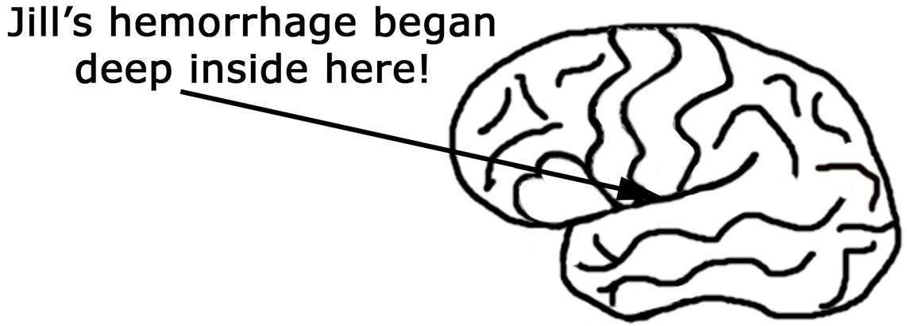

>Jill's hemorrhage began deep inside here!: Xuất huyết của Jill bắt đầu sâu bên trong đây! (Mũi tên chỉ vào một vùng sâu bên trong bộ não, ám chỉ vị trí xuất huyết).

Feeling detached from normal reality, I seemed to be witnessing
my activity as opposed to feeling like the active participant performing
the action. I felt as though I was observing myself in motion, as in the
playback of a memory. My fingers, as they grasped onto the handrail,
looked like primitive claws. For a few seconds I rocked and watched,
with riveting wonder, as my body oscillated rhythmically and
mechanically. My torso moved up and down in perfect cadence with the
music and my head continued to ache.

I felt bizarre, as if my conscious mind was suspended somewhere
between my normal reality and some esoteric space. Although this
experience was somewhat reminiscent of my morning time in Thetaville,
I was sure that this time I was awake. Yet, I felt as if I was trapped inside
the perception of a meditation that I could neither stop nor
escape. Feeling dazed, the frequency of shooting pangs escalated inside
my brain, and I realized that this exercise regime was probably not a
good idea.

Feeling a little nervous about my physical condition, I climbed off
the machine and bumbled through my living room on the way to the
bath. As I walked, I noticed that my movements were no longer fluid.
Instead they felt deliberate and almost jerky. In the absence of my
normal muscular coordination, there was no grace to my pace and my
balance was so impaired that my mind seemed completely preoccupied
with just keeping me upright.

As I lifted my leg to step into the tub, I held on to the wall for
support. It seemed odd that I could sense the inner activities of my brain
as it adjusted and readjusted all of the opposing muscle groups in my
lower extremities to prevent me from falling over. My perception of
these automatic body responses was no longer an exercise in intellectual
conceptualization. Instead, I was momentarily privy to a precise and
experiential understanding of how hard the fifty trillion cells in my brain
and body were working in perfect unison to maintain the flexibility and
integrity of my physical form. Through the eyes of an avid enthusiast of
the magnificence of the human design, I witnessed with awe the
autonomic functioning of my nervous system as it calculated and
recalculated every joint angle.

Ignorant to the degree of danger my body was in, I balanced my
weight against the shower wall. As I leaned forward to turn on the
faucet, I was startled by an abrupt and exaggerated clamor as water
surged into the tub. This unexpected amplification of sound was both
enlightening and disturbing. It brought me to the realization that, in
addition to having problems with coordination and equilibrium, my
ability to process incoming sound (auditory information) was erratic.

I understood neuroanatomically that coordination, equilibrium,
audition and the action of inspirational
breathing were processed through the pons of my brainstem. For
the first time, I considered the possibility that I was perhaps
having a major neurological malfunction that was life
threatening.

Fibers Passing Through the Pons of the Brainstem

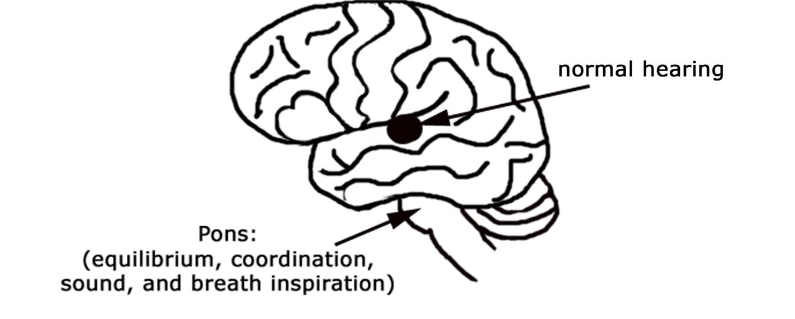
>normal hearing: thính giác bình thường.
>Pons: Cầu não
>(equilibrium, coordination, sound, and breath inspiration): (thăng bằng, phối hợp, âm thanh và hít thở)

As my cognitive mind searched for an explanation about
what was happening anatomically inside my brain, I reeled
backward in response to the augmented roar of the water as the
unexpected noise pierced my delicate and aching brain. In that
instant, I suddenly felt vulnerable, and I noticed that the constant
brain chatter that routinely familiarized me with my
surroundings was no longer a predictable and constant flow of
conversation. Instead, my verbal thoughts were now inconsistent,
fragmented, and interrupted by an intermittent silence.

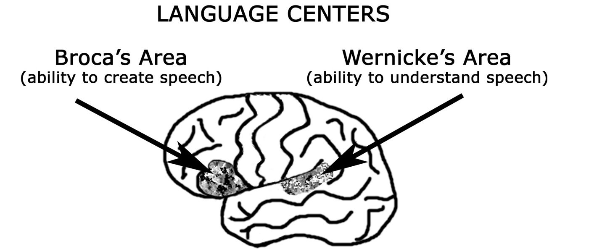
>LANGUAGE CENTERS: Trung tâm ngôn ngữ
>Broca's Area: Vùng Broca
>(ability to create speech): (khả năng sản xuất lời nói)
>Wernicke's Area: Vùng Wernicke
>(ability to understand speech): (khả năng hiểu lời nói)

When I realized that the sensations outside of me, including the
remote sounds of a bustling city beyond my apartment window, had
faded away, I could tell that the broad range of my natural observation
had become constricted. As my brain chatter began to disintegrate, I felt
an odd sense of isolation. My blood pressure must have been dropping
as a result of the bleeding in my brain because I felt as if all of my
systems, including my mind's ability to instigate movement, were
moving into a slow mode of operation. Yet, even though my thoughts
were no longer a constant stream of chatter about the external world and
my relationship to it, I was conscious and constantly present within my
mind.

Confused, I searched the memory banks of both my body and
brain, questioning and analyzing anything I could remember having
experienced in the past that was remotely similar to this situation. _What_
_is going on?_ I wondered. _Have I ever experienced anything like this_
_before? Have I ever felt like this before? This feels like a migraine. What_
_is happening in my brain?_

The harder I tried to concentrate, the more fleeting my ideas
seemed to be. Instead of finding answers and information, I met a
growing sense of peace. In place of that constant chatter that had
attached me to the details of my life, I felt enfolded by a blanket of
tranquil euphoria. How fortunate I was that the portion of my brain that
registered fear, my amygdala, had not reacted with alarm to these
unusual circumstances and shifted me into a state of panic. As the
language centers in my left hemisphere grew increasingly silent and I
became detached from the memories of my life, I was comforted by an
expanding sense of grace. In this void of higher cognition and details
pertaining to my normal life, my consciousness soared into an all
_one_
knowingness, a "being at " with the universe, if you will. In a
compelling sort of way, it felt like the good road home and I liked it.

By this point I had lost touch with much of the

physical three-dimensional reality that surrounded me. My body
was propped up against the shower wall and I found it odd that I
was aware that I could no longer clearly discern the physical
boundaries of where I began and where I ended. I sensed the

composition of my being as that of a fluid rather than that of a
solid. I no longer perceived myself as a whole object separate
from everything. Instead, I now blended in with the space and
flow around me. Beholding a growing sense of detachment
between my cognitive mind and my ability to control and finely
manipulate my fingers, the mass of my body felt heavy and my
energy waned.

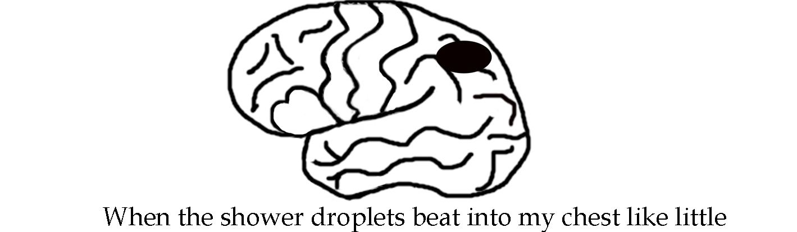
>When the shower droplets beat into my chest like little: Khi những giọt nước vòi sen đập vào ngực tôi như những hạt nhỏ

bullets, I was harshly startled back into this reality. As I held my
hands up in front of my face and wiggled my fingers, I was
simultaneously perplexed and intrigued. _Wow, what a strange and_
_amazing thing I am. What a bizarre living being I am. Life! I am_
_life! I am a sea of water bound inside this membranous pouch._
_Here, in this form, I am a conscious mind and this body is the_
_vehicle through which I am ALIVE! I am trillions of cells sharing_
_a common mind. I am here, now, thriving as life. Wow! What an_
_unfathomable concept! I am cellular life, no - I am molecular life_
_with manual dexterity and a cognitive mind!_

In this altered state of being, my mind was no longer
preoccupied with the billions of details that my brain routinely
used to define and conduct my life in the external world. Those
little voices, that brain chatter that customarily kept me abreast of
myself in relation to the world outside of me, were delightfully
silent. And in their absence, my memories of the past and my dreams of the future evaporated. I was
alone. In the moment, I was alone with nothing but the rhythmic pulse of
my beating heart.

I must admit that the growing void in my traumatized brain was
entirely seductive. I welcomed the reprieve that the silence brought from
the constant chatter that related me to what I now perceived as the
insignificant affairs of society. I eagerly turned my focus inward to the
steadfast drumming of the trillions of brilliant cells that worked
diligently and synchronously to maintain my body's steady state of
homeostasis. As the blood poured in over my brain, my consciousness
slowed to a soothing and satisfying awareness that embraced the vast
and wondrous world within. I was both fascinated and humbled by how
hard my little cells worked, moment by moment, just to maintain the
integrity of my existence in this physical form.

For the first time, I felt truly at one with my body as a complex
construction of living, thriving organisms. I was proud to see that I was
this swarming conglomeration of cellular life that had stemmed from the
intelligence of a single molecular genius! I welcomed the opportunity to
pass beyond my normal perceptions, away from the persevering pain that
relentlessly pulsed in my head. As my consciousness slipped into a state
of peaceful grace, I felt ethereal. Although the pulse of pain in my brain
was inescapable, it was not debilitating.

Standing there with the water pounding onto my breasts, a tingling
sensation surged through my chest and forcefully radiated upward into
my throat. Startled, I became instantly aware that I was in grave danger.
Shocked back into this external reality, I immediately reassessed the
abnormalities of my physical systems. Determined to understand what
was going on, I actively scanned my reservoir of education in demand of
a self-diagnosis. _What is going on with my body? What is wrong with my_
_brain?_

Although the sporadically discontinuous flow of

normal cognition was virtually incapacitating, somehow I managed to
keep my body on task. Stepping out of the shower, my brain felt
inebriated. My body was unsteady, felt heavy, and exerted itself in very
slow motion. _What is it I'm trying to do ? Dress, dress for work. I'm_
_dressing for work._ I labored mechanically to choose my clothes and by
8:15 am, I was ready for my commute. Pacing my apartment, I thought,
_Okay, I'm going to work. I'm going to work. Do I know how to get to_
_work? Can I drive?_ As I visualized the road to McLean Hospital, I was
literally thrown off balance when my right arm dropped completely
paralyzed against my side. In that moment I knew. _Oh my gosh, I'm_
_having a stroke! I'm having a stroke!_ And in the next instant, the thought
flashed through my mind, _Wow, this is so cool!_

I felt as though I was suspended in a peculiar euphoric stupor, and
I was strangely elated when I understood that this unexpected
pilgrimage into the intricate functions of my brain actually had a
physiological basis and explanation. I kept thinking, _Wow, how many_
_scientists have the opportunity to study their own brain function and_
_mental deterioration from the inside out?_ My entire life had been
dedicated to my own understanding of how the human brain creates our
perception of reality. And now I was experiencing this most remarkable
stroke of insight!

When my right arm became paralyzed, I felt the life force inside
the limb explode. When it dropped dead against my body, it clubbed my
torso. It was the strangest sensation. I felt as if my arm had been
guillotined off!

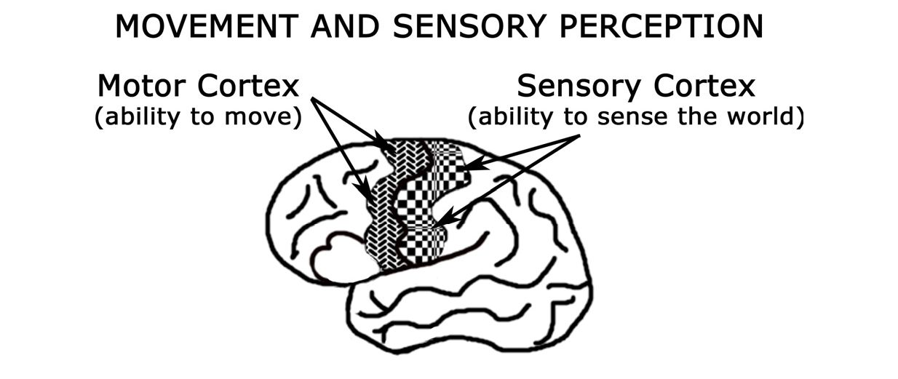
>MOVEMENT AND SENSORY PERCEPTION: Vận động và Cảm nhận giác quan
>Motor Cortex: Vỏ não vận động
>(ability to move): (khả năng di chuyển)
>Sensory Cortex: Vỏ não cảm giác
>(ability to sense the world): (khả năng cảm nhận thế giới)

I understood neuroanatomically that my motor cortex had been
affected and I was fortunate that within a few minutes, the deadness of
my right arm subtly abated. As the limb began to reclaim its life, it
throbbed with a formidable tingling pain. I felt weak and wounded. My
arm felt completely depleted of its intrinsic strength, yet I could wield it
like a stub. I wondered if it would ever be normal again. Catching sight
of my warm and cradling waterbed, I seemed to be beckoned by it on
this cold winter morning in New England. _Oh, I am so tired. I feel so_
_tired. I just want to rest. I just want to lie down and relax for a little_
_while._ But resounding like thunder from deep within my being, a
commanding voice spoke clearly to me: _If you lie down now you will_
_never get up!_

Startled by this ominous illumination, I fathomed the gravity of
my immediate situation. Although I was compelled by a sense of
urgency to orchestrate my rescue, another part of me delighted in the
euphoria of my irrationality. I stepped across the threshold of my
bedroom, and as I gazed into the eyes of my reflected image, I paused
for a moment, in search of some guidance or profound insight. In the
wisdom of my dementia, I understood that my body was, by the
magnificence of its biological design, a precious and fragile gift. It was
clear to me that this body functioned like a portal through which the
energy of who I am can be beamed into a three-dimensional external
space.

This cellular mass of my body had provided me with a marvelous
temporary home. This amazing brain had been capable of integrating
literally billions of trillions of bits of data, in every instant, to create for
me a three-dimensional perception of this environment that actually
appeared to be not only seamless and real, but also safe. Here in this
delusion, I was mesmerized by the efficiency of this biological matrix as
it created my form, and I was awed by the simplicity of its design. I saw
myself as a complex composite of dynamic systems, a collection of
interlacing cells capable of
integrating a medley of sensory modalities streaming in from the
external world. And when the systems functioned properly, they
naturally manifested a consciousness capable of perceiving a
normal reality. I wondered how I could have spent so many years
in this body, in this form of life, and never really understood that
I was just visiting here.

Even in this condition, the egotistical mind of my left
hemisphere arrogantly retained the belief that although I was
experiencing a dramatic mental incapacity, my life was
invincible. Optimistically, I believed that I would recover
completely from this morning's events. Feeling a little irritated
by this impromptu disruption of my work schedule, I bantered,
_Okay, well, I'm having a stroke. Yep, I'm having a stroke...but I'm_
_a very busy woman! All right, since I can't stop this stroke from_
_happening, then, okay, I'll do this for a week! I'll learn what I_
_need to know about how my brain creates my perception of_
_reality and then I'll meet my schedule, next week. Now, what am_
_I doing? Getting help. I must stay focused and get help._

To my counterpart in the looking glass I pleaded,

_Remember, please remember everything you are experiencing!_
_Let this be my stroke of insight into the disintegration of my own_
_cognitive mind._

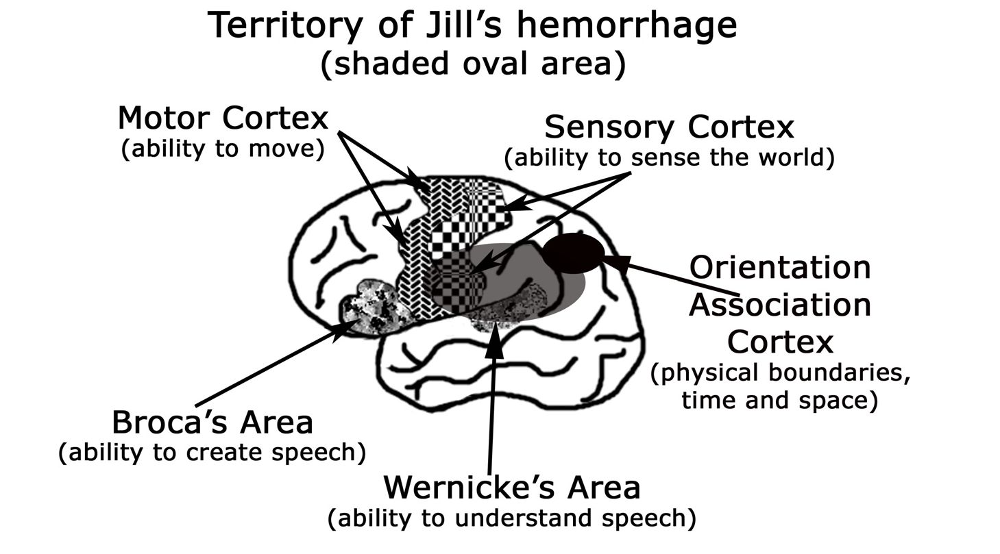
>Territory of Jill's hemorrhage: Vùng xuất huyết của Jill
>(shaded oval area): (vùng hình bầu dục được tô bóng)
>Motor Cortex: Vỏ não vận động
>(ability to move): (khả năng di chuyển)
>Sensory Cortex: Vỏ não cảm giác
>(ability to sense the world): (khả năng cảm nhận thế giới)
>Orientation Association Cortex: Vỏ não liên hợp định hướng
>(physical boundaries, time and space): (ranh giới vật lý, thời gian và không gian)
>Broca's Area: Vùng Broca
>(ability to create speech): (khả năng sản xuất lời nói)
>Wernicke's Area: Vùng Wernicke
>(ability to understand speech): (khả năng hiểu lời nói)

# 5. Orchestrating My Rescue

I didn't know exactly what type of stroke I was experiencing, but
the congenital arteriovenous malformation (AVM) that burst in my head
was spewing a large volume of blood over the left hemisphere of my
brain. As blood swept over the higher thinking centers of my left
cerebral cortex, I began losing my skills of higher cognition - one
precious ability at a time. It was fortunate that I could remember that the
best prognosis for someone having a stroke was to get him or her to the
hospital as quickly as possible. But getting help was challenging because
I found it almost impossible to concentrate or keep my mind on task. I
caught myself chasing random thoughts as they danced in and out of my
brain, and sadly, I was fully aware that I was inept at holding a plan in
my mind long enough to execute it.

The two cerebral hemispheres of my brain had worked
meticulously well together for my entire life, as they enabled me to
function in the world. But now, because of the normal differences and
asymmetry of function between my right and left hemispheres, I felt
disjoined from the linguistic and calculating skills of my left brain.
Where were my numbers? Where was my language.. .what had become
of the brain chatter, which was now replaced by a pervasive and enticing
inner peace?

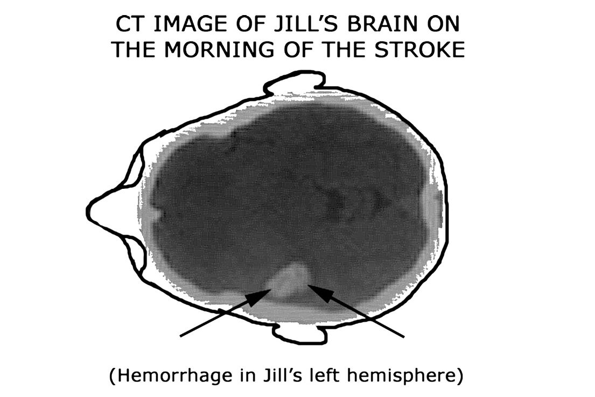
>CT IMAGE OF JILL'S BRAIN ON THE MORNING OF THE STROKE: Hình ảnh CT não của Jill vào buổi sáng bị đột quỵ
>(Hemorrhage in Jill's left hemisphere): (Xuất huyết ở bán cầu não trái của Jill)

Without the linearity associated with the constant brain directives
of my left brain, I struggled to maintain a cognitive connection to my
external reality. Instead of a continuous flow of experience that could be
divided into past, present, and future, every moment seemed to exist in
perfect isolation. In this emptiness of verbal cues, I felt devoid of my
worldly wisdom and I was desperate to maintain a cognitive link
between my moments. Repetitively, I obsessed the only message my
brain could sustain: _What am I trying to do? Get help. I'm trying to make a plan and get help. What am I doing? I have to come up with a plan to get help. Okay. I have to get help._

My information processing for normal access to my brain's
information, prior to this morning's episode, went something like this: I
visualize myself sitting in the middle of my brain, which is completely
lined with filing cabinets. When I am looking for a thought or an idea or
a memory, I scan the cabinets and identify the correct drawer. Once I
find the appropriate file, I then have access to all of the information in
that file. If I don't immediately find what I'm looking for, then I put my
brain back on scan and eventually I access the right data.

But this morning, my information processing was completely
aberrant. Even though my brain remained lined with filing cabinets, it
was as if all the drawers had been slammed shut and the cabinets pushed
just beyond my reach. I was aware that I knew all this stuff, that my
brain held a wealth of information. But where was it? If the information
was still there, I could no longer retrieve it. I wondered if I would ever
reconnect with linguistic thought or retrieve the mental images of my
life. I was saddened that perhaps those portions of my mind were now
lost forever.

Devoid of language and linear processing, I felt disconnected from
the life I had lived, and in the absence of my cognitive pictures and
expansive ideas, time escaped me. The memories from my past were no
longer available for recollection, leaving me cloaked from the bigger
picture of who I was and what I was doing here as a life form. Focused
completely in the present moment, my pulsing brain felt like it was
gripped in a vice. And here, deep within the absence of earthly
temporality, the boundaries of my earthly body dissolved and I melted
into the universe.

As the hemorrhaging blood interrupted the normal functioning of
my left mind, my perception was released from its attachment to
categorization and detail. As the dominating fibers of my left
hemisphere shut down, they no longer inhibited my right hemisphere,
and my perception was free to shift such that my consciousness could
embody the tranquility of my right mind. Swathed in an enfolding sense
of liberation and transformation, the essence of my consciousness
shifted into a state that felt amazingly similar to my experience in
Thetaville. I'm no authority, but I think the Buddhists would say I
entered the mode of existence they call Nirvana.

In the absence of my left hemisphere's analytical judgment, I was
completely entranced by the feelings of tranquility, safety, blessedness,
euphoria, and omniscience. A piece of me yearned to be released
completely from the captivity of this physical form, which throbbed with
pain. But providentially, in spite of the attraction of this unremitting
temptation, something inside of me remained committed to the task of
orchestrating my rescue, and it persevered to ultimately save my life.

Stumbling into my office space, I turned the lights down low
because the light stimulation burned my brain like wildfire. The harder I
tried to stay focused and concentrate on what I was doing in the here and
now, the more intense the throbbing in my head reverberated. It took
great effort just to stay attentive and my mind groped to hold on, to
remember, _What is it I'm doing? What am I doing? Call for help, I'm trying to call for help!_ I vacillated between moments of being able to
think clearly (I call these "waves of clarity"), and the lack of ability to
think at all.

Feeling cast out of synchrony with the life I had known, I was
concurrently disturbed and fascinated by what I was witnessing as the
systematic breakdown of my cognitive mind. Time stood still because
that clock that would sit and tick in the back of my left brain, that clock
that helped me establish linearity between my thoughts, was now silent.
Without the internal concept of relativity or the complementary brain
activity that helped me navigate myself linearly, I found myself floating
from isolated moment to isolated moment. "A" no longer had any
relationship to "B" and "one" was no longer relative to "two." These
types of sequences required an intellectual connection that my mind
could no longer perform. Even the simplest of calculations, by
definition, requires recognition of the relationship between different
entities, and my mind was no longer capable of creating combinations.
So again, I sat befuddled, waiting for the next intermittent thought or
wave of clarity. In anticipation of the eventual arrival of an idea that
would connect me to something in objective reality, my mind kept
repeating, _What is it I'm trying to do?_

Why didn't I just call 9-1-1? The hemorrhage growing in my
cranium was positioned directly over the portion of my left brain that
understood what a number was. The neurons that coded 9-1-1 were now
swimming in a pool of blood, so the concept simply didn't exist for me
anymore. Why didn't I just skip downstairs and ask my landlady for
help? She was home on maternity leave and would have been happy to
give me a lift. But her file, again, a detail in the big picture of my life in
relation to those around me, didn't exist anymore. Why didn't I walk out
into the street and flag down a stranger for help? It never crossed my
mind. In this incapacitation, the only option I had was the one I was
desperate to remember - which was how to call for help!

All I could do was sit and wait; sit patiently with the phone by my
side and wait in the silence. So there I sat, home alone with these
transient thoughts that evaded me, almost teasing me as they flitted in
and out of my mind. I sat waiting for a wave of clarity that would permit
my mind to connect two thoughts and give me a chance at forming an
idea, a chance to execute a plan. I sat silently intoning, _What am I doing? Call for help. Call for help. I'm trying to call for help_

In the hope that I might consciously evoke another wave of clarity,
I placed the phone on the desk in front of me and stared at its keypad.
Searching for some recollection of a number to dial, my wandering brain
felt empty and sore as I forced it to concentrate and pay attention.
Pulsing, pulsing, pulsing. Gosh my brain hurt. In an instant a number
flashed through my mind's eye. It was my mother's number. How
thrilling that I could remember! How wonderful that I could not only
recall a number but that I knew whose number it was! And how

remarkable, though unfortunate, that even in this precarious condition, I
realized that my mother lived over a thousand miles away and how
inappropriate it would be to call her now. I thought to myself, _No way, I can't call Mama and tell her I'm having a stroke! That would be horrible. She would freak out! I've got to come up with a plan._

In a moment of clarity, I knew that if I called work, my colleagues
at the Harvard Brain Tissue Resource Center would get me help. _If only I could remember the number at work._ And how ironic it was that I had

spent the previous two years singing the Brain Bank jingle to audiences
all around the country, including the lyrics, "Just dial 1-800-BrainBank
for information please!" But on this morning, with all those memories
set beyond my reach, I retained only a vague idea of who I was and what
I was trying to accomplish. Posed at my desk in a bizarre mental fog, I
continued to coax my mind by obsessing, _What is the number at work? Where do I work? The Brain Bank. I work at the Brain Bank. What is the number at the Brain Bank? What am I doing? I'm calling for help. I'm calling work. Okay, what is the number at work?_

My normal perception of this external world had been successfully
established by the constant exchange of information between my right
and left hemispheres. Because of cortical laterality, each half of my brain
specialized in slightly varied functions, and when put together, my brain
could precisely manufacture a realistic perception of the external world.
Although I had been a very bright child with tremendous potential for
learning, my two hemispheres had never been equal in their natural
abilities. My right hemisphere excelled at understanding the big picture
of ideas and concepts, but my left hemisphere had to work extremely
hard to memorize random facts and details. As a result, I was one of
those people who rarely chose to cognitively code a phone number as a
random sequence of numbers. Instead, my mind automatically created
some sort of pattern, most often a visual pattern, to which I attached the
sequence. In the case of phone numbers, I generally memorized the
pattern as it dialed on a touch-tone keypad. Privately, I always wondered
how I would have survived in a world of rotary telephones where such
schematic ploys would have been much more challenging!

Throughout my youth, my mind had been much more interested in
how things were intuitively related (right hemisphere) than how they
were categorically different (left hemisphere). My mind preferred
thinking in pictures (right hemisphere), as opposed to language (left
hemisphere). It wasn't until my graduate school years and fascination
with anatomy that my mind excelled in detail memorization and
retrieval. After a childhood of information processing through sensory,
visual, and pattern association strategies, the tapestry of my knowledge
was all intimately inter-linked.

The downfall to this type of a learning system, of course, is that it
only works when all the pieces of the network are functioning and
interacting properly. On this morning, as I sat and contemplated the
phone number for work, I remembered that there was something unique
about the patterning of our office codes. Something like, my number
ended in 1-0; which was the exact opposite of my boss's number which
ended in 0-1; and my colleague's number fell right in the middle. But
because my left hemisphere was drowning in a puddle of blood, I could
not access the specifics of my mental inquiry, and the linearity of
mathematics befuddled me. I kept thinking, _What's in the middle between 01 and 10?_ I decided that looking at the phone keypad might be
helpful.

Sitting at my desk, I placed the phone directly in front of me and
sat patiently for a few moments awaiting the next wave of clarity. Again
I intoned, _What is the number at work? What is the number at work?_
After several minutes of holding the phone and drawing a blank, a list of

four digits suddenly appeared in my mind...2405! 2405! I repeated it
over and over to myself. _2405!_ In order to not forget it, I picked up a pen
and with my non-dominant left hand, I quickly jotted down the image I
saw in my mind. A "2" was no longer a "2" but rather a squiggle that
looked like a "2." Fortunately, the "2" on the phone pad looked just like
the "2" in my mind's eye, so I drew the squiggles that represented what I
saw. .2405. Somehow I understood that this was only part of the number,
what was the rest? There was a prefix -something came first. So, again, I
started intoning, _What is the prefix? What is the prefix at work?_

Faced with this dilemma, it occurred to me that it was not
necessarily an advantage that, when we are at work, we merely have to
dial extension numbers. Because of this lack of routine use, the pattern
for my prefix recognition was not coded in the exact same file in my
brain as the rest of the extension numbers. So back I went on a mission
to retrieve information and I questioned, _What is the prefix? What is theprefix at work?_

For my entire life, I had been exposed to phone numbers with very
low prefixes: 232, 234, 332, 335, etc. But grasping at anything flitting
through my mind, any possibility at all, the code 855 flashed as a visual.
Initially, I thought that this was the most absurd prefix I had ever heard,
because the numbers seemed so high. But at this point, anything was
worth a try. In anticipation of the next wave of clarity, I cleared the desk
in front of me. Because it was only 9:15 am, and I was only 15 minutes
late for work, no one would really be missing me yet. With a plan in
mind, I plodded on.

I felt tired. I felt vulnerable and completely fragmented as I sat
there waiting. Although I was consistently distracted by an enveloping
sense of being at _one_ with the universe, I was desperate to carry out my
plan to get help. Within my mind, I rehearsed over and over again what I
needed to do, and what I would say. But keeping my mind tuned in to
what I was trying to do was like struggling to hang on to a slippery fish.
Task one, hold the thought in mind; task two, execute the internal
perception in the external world. Pay attention. Hold on to the fish. Hold
on to the understanding that this is a phone. Hold on. Hold on for the
next functional moment of clarity! I kept rehearsing in my mind, _This is Jill. I need help! This is Jill. I need help!_

This process had already taken 45 minutes for me to figure out
who and how to call for help. During the next wave of clarity, I dialed
the number by matching the squiggles on the paper to the squiggles on
the phone pad. To my great fortune, my colleague and good friend, Dr.
Stephen Vincent, was sitting at his desk. As he picked up the receiver, I could
hear him speak, but my mind could not decipher his words. I thought,
_Oh my gosh, he sounds like a golden retriever!_ I realized that my left
hemisphere was so garbled that I could no longer understand speech.
Yet, I was so relieved to be connected to another human being that I
blurted out, "This is Jill. I need help!" Well, at least that's what I tried
to say. What exactly came out of my mouth was more akin to grunts
and groans, but fortunately Steve recognized my voice. It was clear to
him that I was in some sort of trouble. (Apparently all those years of
hollering up and down the halls at work had earned me a recognizable
squawk!)

I was shocked, however, when I did realize that I could not
speak intelligibly. Even though I could hear myself speak clearly
within my mind, _This is Jill, I need help!,_ the sounds coming out of
my throat did not match the words in my brain. I was disturbed to
comprehend that my left hemisphere was even more disabled than I
had realized. Although my left hemisphere could not decipher the
meaning of the words he spoke, my right hemisphere interpreted the
soft tones in his voice to mean that he would get me help.

Finally, in that moment, I could relax. I didn't need to understand
the details of what he would do. I knew that I had done all that I could
do; all that anyone could have hoped that I would do, to save myself.

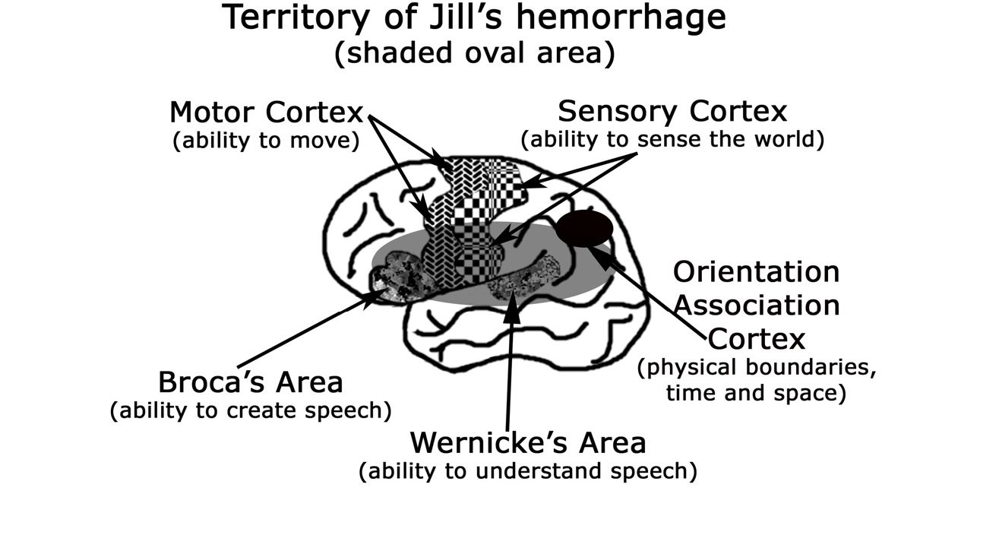
>Territory of Jill's hemorrhage: Vùng xuất huyết của Jill
>(shaded oval area): (vùng hình bầu dục được tô bóng)
>Motor Cortex: Vỏ não vận động
>(ability to move): (khả năng di chuyển)
>Sensory Cortex: Vỏ não cảm giác
>(ability to sense the world): (khả năng cảm nhận thế giới)
>Orientation Association Cortex: Vỏ não liên hợp định hướng
>(physical boundaries, time and space): (ranh giới vật lý, thời gian và không gian)
>Broca's Area: Vùng Broca
>(ability to create speech): (khả năng sản xuất lời nói)
>Wernicke's Area: Vùng Wernicke
>(ability to understand speech): (khả năng hiểu lời nói)

# 6. My Return to the Still

As I sat there in the silence of my mind, satisfied that Steve would
get me help, I felt relieved that I had successfully orchestrated my
rescue. My paralyzed arm was partially recovered and although it hurt, I
felt hopeful that it would recover completely. Yet even in this
discombobulated state, I felt a nagging obligation to contact my doctor.
It was obvious that I would need emergency treatment that would
probably be very expensive, and what a sad commentary that even in this
disjointed mentality, I knew enough to be worried that my HMO might
health center for
not cover my costs in the event that I went to the _wrong_ care.

Still sitting at my desk, with my good left arm I reached for the
three-inch stack of business cards I had collected over the past few years.
I had only visited my current doctor once, about 6 months earlier, but I
remembered that there was something Irish about her name -St.
something, St. something, so I began searching for associations. In my
mind's eye, I could recall perfectly the symbol of the Harvard crest
located in the top central position of her business card. Pleased with my
ability to remember exactly what the card looked like, I thought to
myself, _Fine, this will be just fine; all I have to do is find the card and make the call._

To my astonishment, however, as I looked at the top card, I
realized that although I retained a clear image in my mind of what I was
looking for, I could not discriminate any of the information on the card
in front of me. My brain could no longer distinguish writing as writing,
or symbols as symbols, or even background as background. Instead, the
card looked like an abstract tapestry of pixels. The entire picture was a
uniform blend of all its constituent pieces. The dots that formed the
symbols of language blended in smoothly with the dots of the
background. The distinctions of color and edge no longer registered to
my brain.

Dismayed, I realized that my ability to interact with the external
world had deteriorated far more than I could ever have imagined. My
grip on normal reality had been all but peeled away. I was no longer
capable of perceiving the mental cues I had depended on to visually
discriminate between objects. On top of my inability to identify my own
physical boundaries, and in the absence of my internal clock, I perceived
myself as fluid. Coupled with my loss of long-term and short-term
memories, I no longer felt grounded or safe in the external world.

What a daunting task it was to simply sit there in the center of my
silent mind, holding that stack of cards and trying to remember, _Who am I? What am I doing?_ Searching for any connection with my external
reality, I had lost all sense of urgency. Yet amazingly, my frontal lobe
fought hard to hang on to the task and I still embraced the occasional
wave of clarity that routed me back into this earthly realm via my
physical pain. During these moments of clarity, I could see, I could
identify, I could remember what I was doing, and I could discriminate
again between the varied incoming stimuli. So faithfully I plodded
forward. _That's not the card, that's not the card, that's not the card._ It
took over 35 minutes for me to navigate my way a mere inch down into
that stack where I finally recognized the Harvard crest.

By this point, however, the entire concept of a telephone was a
very interesting and bizarre kind of thing. I felt oddly removed from my
ability to have any comprehension about what it was I was supposed to
do with it. Somehow I understood that this "thing" in my space was
going to connect me through a wire to a completely different space. And
at the other end of the wire, there would be a person to whom I could
speak and she would understand me. Wow, imagine that!

Because I was afraid that I would lose my focus and the doctor's
card would get confused with the others, I cleared the desk space in front
of me and placed her card directly in front. I picked up the phone and
placed the number keypad on the desk right next to the business card.
Because my brain had been on a steady rate of disintegration, the
appearance of the number pad now looked completely strange and
foreign. As I sat there drifting in and out of my insubordinate left mind, I
remained calm. Periodically, I was able to match the number squiggle on
the card to the number squiggle on the telephone keypad. To keep track
of the numbers that I had already dialed, I covered the number on the
business card with my left index finger as soon as I pushed the number
on the phone using my stumpy right index finger. I had to do this
because I could not remember from moment to moment which numbers

I had already pressed. I repeated this strategy until all the numbers were
dialed and then I placed the phone to my ear and listened.

Feeling drained and disoriented, I was afraid that I would forget
what I was doing, so I continued to repeat in my mind, _This is Jill Taylor. I'm having a stroke. This is Jill Taylor. I'm having a stroke._ But
when the phone was answered and I tried to speak, I was blown away to
discover that although I could hear myself speaking clearly, within my
mind, no sound came out of my throat. Not even the grunts that I was
able to produce earlier. I was flabbergasted. _Oh my gosh! I can't talk, I can't talk!_ And it wasn't until this moment when I tried to speak out loud
that I had any idea that I couldn't. My vocal cords were inoperative and
nothing, no sound at all, would come forth.

Like priming a pump, I pushed air forcefully out of my chest and
inhaled deeply, over and over again, trying to make some sound, trying
to make any sound come out. Realizing what I was doing, I thought,
_They're going to think this is an obscene phone call! Don't hang up! Please don't hang up!_ But just like priming a pump, repeatedly pushing
the air in and out, forcing my chest and my throat to vibrate, "Uhhhhhh,
uhhhhhh,  thhhhhh,  thhhhhhe, thhhhhiiiiiiizzzxzzaaaaaaa" finally came out. The call was immediately
forwarded from the receptionist to my doctor, who miraculously just
happened to be sitting in for office hours! With the patience of a gentle
soul, she sat and she listened as I struggled to enunciate, "This is Jill
Taylor. I'm having a stroke."

Eventually my doctor understood enough of my message to
comprehend who I was and what I needed. She directed me, "Get to
Mount Auburn Hospital." As she spoke, although I could hear her
words, I could not grasp their meaning. Feeling despondent, I thought to
myself, _If only she would speak more slowly and enunciate more clearly, perhaps I could get it, perhaps I could understand._ With hope in my
heart, I pleaded in a semi-intelligible way, "Again?" With concern, she
slowly repeated her directive, "Get to Mount Auburn Hospital." Yet
again, I could not comprehend. With patience and genuine compassion
for my obvious neurological breakdown, she repeated her directive.
Repeatedly, I could not connect meaning to the sounds and make sense
of what she said. Feeling exasperated by my own inability to understand
her simple language, I primed my vocal pump again and somehow
communicated that help was on its way and we would call her back.

At this point, it didn't take a brain scientist to understand what was
going on in my brain. The longer the blood from the hemorrhage
continued to spill into my cortex, the more massive the tissue damage
would become and the more cognitively inept I would be. Although the
AVM originally burst near the middle to posterior portion of my cerebral
cortex in my left hemisphere, by this point, the cells in my left frontal
lobe - responsible for my ability to generate language, were also
compromised. It was predictable that as the blood interrupted the flow of
information transmission between my two language centers (Broca's
anteriorly and Wernicke's posteriorly, p. 40), I could neither
create/express language nor understand it. At this point in time,
however, my greatest concern was that my vocal cords were not
responding to my mental cues. I still feared that the centers in the pons
of my brainstem, including my center for inspiration, were possibly at
risk.

Feeling defeated and tired, I hung up the phone. Rising from my
seat, I wrapped a scarf around my head to block the streaming light from
my eyes. Picturing the deadbolt on my front door, I slowly navigated my
body, step by step, down the front flight of stairs by sliding on my butt.

Ready for company and no longer preoccupied with what I felt
compelled to do, I crawled back up the stairs to my living room, where I
crouched on my couch to quiet my weary mind.

Despondent and alone, I felt discomfort in my pulsating head, and
I communed with my wound as I acknowledged the degeneration of my
connection to this life. With every moment that passed, I felt my
connection with my body becoming weaker. I sensed that my energy was
leaking out of this fragile container - deadening the distal tips of my
fingers and toes. I could hear the machinery of my body grinding its
wheels as my cells systematically manufactured my life, and I feared
that my cognitive mind was becoming so disabled, so detached from its
normal ability to function, that I would be rendered permanently
disabled. For the first time in my life, I understood that I was not
invincible. Unlike a computer that could be turned off and then rebooted,
the richness of my life was completely dependent on not only the health
of my cellular structure, but on the integrity of my brain's ability to
electrically transmit and communicate its directives.

Humbled by the direness of my situation, I grieved for the loss of
my life as I anticipated the death and degeneration of my cellular matrix.
Despite the overwhelming presence of the engulfing bliss of my right
mind, I fought desperately to hold on to whatever conscious connections
I still retained in my left mind. By now, I understood clearly that I was
no longer a normal human being. My consciousness no longer retained
the discriminatory functions of my dominant analytical left brain.
Without those inhibiting thoughts, I had stepped beyond my perception
of myself as an individual. Without my left brain available to help me
identify myself as a complex organism made up of multiple
interdependent systems or to define me as a distinct collection of
fragmented functions, my consciousness ventured unfettered into the
peaceful bliss of my divine right mind.

As I sat in the silence and pondered my new perceptions, I
wondered how disabled I could become before the loss would be
permanent. I contemplated how many circuits I could lose and how
detached from my higher cognitive abilities I could tread and still have
any hope of ever regaining normal function. I hadn't come this far to just
die or become mentally vegetative! So I held my head in my hands and
wept. Amidst my tears, I clenched my fists and prayed. I prayed for
peace in my heart. I prayed for peace in my mind and I prayed, _Please Great Spirit, don't shut down my life._ And into the silence my mind
implored, _Hold on. Be still. Be quiet. Hold on._

I sat there in the middle of my living room for what seemed to be
an eternity. When Steve appeared in the doorway, no words were
exchanged. I handed him my doctor's card and he immediately called for
instructions.

Promptly, he escorted me down the stairs and out the door. Gently, he
guided me to his car, strapped me in, and reclined the seat. He wrapped
my head with a scarf to shade my eyes from the light. He spoke softly,
encouragingly patted my knee, and proceeded to drive to Mount Auburn
Hospital.

By the time we arrived, I was still conscious but obviously
delirious. They placed me in a wheelchair and led us into the waiting
room. Steve was clearly distressed with their indifference to the severity
of my condition, but he obediently filled out my paperwork and helped
me sign my name. Waiting for our turn, I felt the energy in my body
shift and like a balloon I deflated into my own lap, shifting into a semiconscious condition. Steve insisted that I receive immediate attention!

I was taken to have a CT scan of my brain. They lifted me out of
the wheelchair and placed me on the CT gurney. Despite the throbbing
pain in my brain that was echoed by the thumping sounds of the
machine's motor, I was conscious enough to find some satisfaction in
learning that my selfdiagnosis had been correct. I was experiencing a
rare form of stroke. I had a massive hemorrhage flooding the left
hemisphere of my brain. Although I don't recall it, my medical records
indicate that I was given an initial dose of steroids to slow the
inflammation.

The agenda was to ship me immediately to Massachusetts General
Hospital. My gurney was lifted and bolted into position in an ambulance
for the ride across Boston. I remember that a kind-hearted paramedic
accompanied me along my journey. With compassion, he wrapped me in
a blanket and arranged a jacket over my face to protect my eyes. His
touch upon my back was comforting; his gentle kindness, priceless.

I was finally free from worry. I curled up into a fetal ball and lay
waiting. I understood that, on this morning, I had witnessed the step-bystep deterioration of my intricate neurological circuitry. I had always
celebrated my life as a magnificent physical manifestation of my DNA,
and oh, what a colorful genetic pool from which I had been spawned!
For 37 years, I had been blessed with an agile mosaic of electrified
biochemistry. And, like many folks, I had fantasized that I wanted to be
awake when I died because I wanted to witness that remarkable final
transition.

Just before noon, on December 10, 1996, the electrical vitality of
my molecular mass grew dim, and when I felt my energy lift, my
cognitive mind surrendered its connection to, and command over, my
body's physical mechanics. Sanctioned deep within a sacred cocoon with
a silent mind and a tranquil heart, I felt the enormousness of my energy
lift. My body fell limp, and my consciousness rose to a slower vibration.
I clearly understood that I was no longer the choreographer of this life.
In the absence of sight, sound, touch, smell, taste, and fear, I felt my
spirit surrender its attachment to this body and I was released from the
pain.

# 7. Bare to the Bone

Upon my arrival at the Massachusetts General Hospital
emergency ward, I landed in the center of an energy spin that I could
only describe as a bustling beehive. My limp body felt heavy and
terribly weak. It was drained of all its energy -- like a balloon that had
been slowly and thoroughly deflated. Medical personnel swarmed
about my gurney. The sharp lights and intense sounds beat upon my
brain like a mob, demanding more attention than I could possibly
muster to appease them.

"Answer this, squeeze that, sign here!" they demanded of my
semi-consciousness, and I thought, _How absurd! Can't you see I've got a problem here? What's the matter with you people? Slow down! I can't understand you! Be patient! Hold still! That hurts! What is this chaos?_ The more tenaciously they tried to draw me out, the greater
was my ache to reach inside for my personal source of sustenance. I
felt besieged by their touching, probing, and piercing; like a slug
sprinkled with salt, I writhed in response. I wanted to scream, _Leave me alone!_ but my voice had fallen silent. They couldn't hear me
because they couldn't read my mind. I passed out like a wounded
animal, desperate to escape their manipulations.

When I first awoke later that afternoon, I was shocked to discover
that I was still alive. (Heart felt thanks to the medical professionals who
stabilized my body and gave me another chance at life - even though no
one had any idea what or how much I would ever recover.) My body was
draped in the customary hospital gown and I was resting in a private
cubicle. The bed was partially raised with my aching head slightly
elevated on a pillow. Devoid of my usual well of energy, my body sank
deep into the bed like a lump of heavy metal that I couldn't begin to
budge. I could not determine how my body was positioned, where it
began or where it ended. Without the traditional sense of my physical
boundaries, I felt that I was at _one_ with the vastness of the universe.

My head pulsed with a tormenting pain that pounded like thunder
while a white lightning storm raged theatrically upon the inside of my
eyelids. Every little shift in position that I tried to make required more
energy than my reserves held. Simply inhaling hurt my ribs, and the
light that flooded in through my eyes burned my brain like fire. Not able
to speak, I begged for the lights to be dimmed by burying my face into a
sheet.

I couldn't hear anything beyond the pounding rhythm of my heart,
which pulsed so loudly that my bones vibrated with ache and my
muscles twitched with anguish. My keen scientific mind was no longer
available to record, relate, detail, and categorize information about the
surrounding external three-dimensional space. I wanted to wail like a
colicky newborn that had been suddenly plunged into a realm of chaotic
stimulation. With my mind stripped of its ability to recall the memories
and details of my previous life, it was clear to me that I was now like an
infant - born into an adult woman's body. And oh yes, the brain wasn't
working!

Here in this emergency cubby, I could sense, over my left
shoulder, the presence of two familiar associates as they peered at a CT
scan mounted on a wall light-box. The picture on display contained
serial sections of my brain, and although

I could not decipher the words my colleagues softly shared, their body
language communicated the gravity of the situation. It didn't take
someone with a Ph.D. in neuroanatomy to figure out that the huge white
hole in the middle of the brain scan didn't belong there! My left
hemisphere was swimming in a pool of blood and my entire brain was
swollen in response to the trauma.

In silent prayer, I reflected, _I am not supposed to be here anymore! I let go! My energy shifted and the essence of my being escaped. This is not right. I don't belong here anymore! Great Spirit,_ I mused, _I am now at one with the universe. I have blended into the eternal flow and am beyond returning to this plane of life -yet I remain tethered here. The fragile mind of this organic container has shut down and is no longer amenable for intelligent occupancy! I don't belong here anymore!_
Unencumbered by any emotional connection to anyone or anything
outside of myself, my spirit was free to catch a wave in the river of
blissful flow. _Let me out!_ I hollered within my mind, _I let go! I let go!_ I
wanted to escape this vessel of physical form, which radiated chaos and
pain. In those brief moments, I felt tremendous despair that I had
survived.

My body felt cold, weighty, and ached with pain. The signals
between my brain and body were so defective that I couldn't recognize
my physical form. I felt as if I was an electrical being; an apparition of
energy smoldering around an organic lump. I had become a pile of
waste, leftovers, but I still retained a consciousness. A consciousness
that was different from the one I had known before, however, because
my left hemisphere had been packed with details about how to make
sense of the external world. These details had been organized and
ingrained as neuronal circuits in my brain. Here, in the absence of that
circuitry, I felt inanimate and awkward. My consciousness had shifted. I
was still in here -I was still me, but without the richness of the emotional
and cognitive connections my life had known. So, was I really still me?
How could I still be Dr. Jill Bolte Taylor, when I no longer shared her
life experiences, thoughts, and emotional attachments?

I remember that first day of the stroke with terrific bittersweetness. In the absence of the normal functioning of my left
orientation association area, my perception of my physical boundaries
was no longer limited to where my skin met air. I felt like a genie
liberated from its bottle. The energy of my spirit seemed to flow like a
great whale gliding through a sea of silent euphoria. Finer than the finest
of pleasures we can experience as physical beings, this absence of
physical boundary was one of glorious bliss. As my consciousness
dwelled in a flow of sweet tranquility, it was obvious to me that I would
never be able to squeeze the enormousness of my spirit back inside this
tiny cellular matrix.

My escape into bliss was a magnificent alternative to the daunting
sense of mourning and devastation I felt every time I was coaxed back
into some type of interaction with the percolating world outside of me. I
existed in some remote space that seemed to be far away from my
normal information processing, and it was clear that the "I" whom I had
grown up to be had not survived this neurological catastrophe. I
understood that that Dr. Jill Bolte Taylor died that morning, and yet, with
that said, who was left? Or, with my left hemisphere destroyed, perhaps
I should now say, who was _right_ ?

Without a language center telling me: "I am Dr. Jill Bolte Taylor. I
am a neuroanatomist. I live at this address and can be reached at this
phone number," I felt no obligation to being her anymore. It was truly a
bizarre shift in perception, but without her emotional circuitry reminding
me of her likes and dislikes, or her ego center reminding me about her
patterns of critical judgment, I didn't think like her anymore. From a
practical perspective, considering the amount of biological damage,
being her again wasn't even an option! In my mind, in my new
perspective, that Dr. Jill Bolte Taylor died that morning and no longer
existed. Now that I didn't know her life - her relationships, successes and
mistakes, I was no longer bound to her decisions or self-induced
limitations.

Although I experienced enormous grief for the death of my left
hemisphere consciousness - and the woman I had been, I concurrently
felt tremendous relief. That Dr. Jill Bolte Taylor had grown up with lots
of anger and a lifetime of emotional baggage that must have required a
lot of energy to sustain. She was passionate about her work and her
advocacy. She was intensely committed to living a dynamic life. But
despite her likable and perhaps even admirable characteristics, in my
present form I had not inherited her fundamental hostility. I had
forgotten about my brother and his illness. I had forgotten about my
parents and their divorce. I had forgotten about my job and all the things
in my life that brought me stress - and with this obliteration of
memories, I felt both relief and joy. I had spent a lifetime of 37 years
being enthusiastically committed to "do-do-doing" lots of stuff at a very
fast pace. On this special day, I learned the meaning of simply "being."

When I lost my left hemisphere and its language centers, I also
lost the clock that would break my moments into consecutive brief
instances. Instead of having my moments prematurely stunted, they
became open-ended, and I felt no rush to do anything. Like walking
along the beach, or just hanging out in the beauty of nature, I shifted
from the doing-consciousness of my left brain to the beingconsciousness
of my right brain. I morphed from feeling small and isolated to feeling
enormous and expansive. I stopped thinking in language and shifted to
taking new pictures of what was going on in the present moment. I was
not capable of deliberating about past or future-related ideas because
those cells were incapacitated. All I could perceive
was right here, right now, and it was beautiful.

My entire self-concept shifted as I no longer perceived myself as a
single, a solid, an entity with boundaries that separated me from the
entities around me. I understood that at the most elementary level, I am a
fluid. Of course I am a fluid! Everything around us, about us, among us,
within us, and between us is made up of atoms and molecules vibrating
in space. Although the ego center of our language center prefers defining
our _self_ as individual and solid, most of us are aware that we are made
up of trillions of cells, gallons of water, and ultimately everything about
us exists in a constant and dynamic state of activity. My left hemisphere
had been trained to perceive myself as a solid, separate from others.
Now, released from that restrictive circuitry, my right hemisphere
relished in its attachment to the eternal flow. I was no longer isolated
and alone. My soul was as big as the universe and frolicked with glee in
a boundless sea.

For many of us, thinking about ourselves as fluid, or with souls as
big as the universe, connected to the energy flow of all that is, slips us
out just beyond our comfort zone. But without the judgment of my left
brain saying that I am a solid, my perception of myself returned to this
natural state of fluidity. Clearly, we are each trillions upon trillions of
particles in soft vibration. We exist as fluid-filled sacs in a fluid world
where everything exists in motion. Different entities are composed of
different densities of molecules but ultimately every pixel is made up of
electrons, protons, and neutrons performing a delicate dance. Every
pixel, including every iota of you and me, and every pixel of space
seemingly in between, is atomic matter and energy. My eyes could no
longer perceive things as things that were separate from one another.
Instead, the energy of everything blended together. My visual processing
was no longer normal. (I compare this pixilated perspective to
Impressionist pointillism paintings.)

I was consciously alert and my perception was that I was in the
flow. Everything in my visual world blended together, and with every
pixel radiating energy we all flowed _en masse,_ together as _one._ It was
impossible for me to distinguish the physical boundaries between objects
because everything radiated with similar energy. It's probably
comparable to when people take off their glasses or put eye drops into
their eyes - the edges become softer.

In this state of mind, I could not perceive three-dimensionally.
Nothing stood out as being closer or farther away. If there was a person
standing in a doorway, I could not distinguish their presence until they
moved. It took activity for me to know that I should pay special attention
to any particular patch of molecules. In addition, color did not register to
my brain as color. I simply couldn't distinguish it.

Prior to this morning when I had experienced myself as a solid, I
had possessed the ability to experience loss -either physical loss via
death or injury, or emotional loss through heartache. But in this shifted
perception, it was impossible for me to perceive either physical or
emotional loss because I was not capable of experiencing separation or
individuality. Despite my neurological trauma, an unforgettable sense of
peace pervaded my entire being and I felt calm.

Although I rejoiced in my perception of connection to all that is, I
shuddered at the awareness that I was no longer a normal human being.
How on earth would I exist as a member of the human race with this
heightened perception that we are each a part of it all, and that the life
force energy within each of us contains the power of the universe? How
could I fit in with our society when I walk the earth with no fear? I was,
by anyone's standard, no longer normal. In my own unique way, I had
become severely mentally ill. And I must say, there was both freedom
and challenge for me in recognizing that our perception of the external
world, and our relationship to it, is a product of our neurological
circuitry. For all those years of my life, I really had been a figment of my
own imagination!

When the time keeper in my left hemisphere shut down, the
natural temporal cadence of my life s-l-o-w-e-d to the pace of a snail. As
my perception of time shifted, I fell out of sync with the beehive that
bustled around me. My consciousness drifted into a time warp, rendering
me incapable of communicating or functioning at either the accustomed
or acceptable pace of social exchange. I now existed in a world between
worlds. I could no longer relate to people outside of me, and yet my life
had not been extinguished. I was not only an oddity to those around me,
but on the inside, I was an oddity to myself.

I felt so detached from my ability to move my body with any
oomph that I truly believed I would never be able to get this collection
of cells to perform again. Wasn't it interesting that although I could not
walk or talk, understand language, read or write, or even roll my body
over, I knew that I was okay? The now off-line intellectual mind of my
left hemisphere no longer inhibited my innate awareness that I was the
miraculous power of life. I knew I was different now
- but never once did my right mind indicate that I was "less than" what I
had been before. I was simply a being of light radiating life into the
world. Regardless of whether or not I had a body or brain that could
connect me to the world of others, I saw myself as a cellular
masterpiece. In the absence of my left hemisphere's negative judgment, I
perceived myself as perfect, whole, and beautiful just the way I was.

You may be wondering how it is that I still remember everything
that happened. I remind you that although I was mentally disabled, I was
not unconscious. Our consciousness is created by numerous programs
that are running at the same time. Each program adds a new dimension
to our ability to perceive things in the three-dimensional world.
Although I had lost my left hemisphere consciousness containing my
ego center and ability to see my _self_ as a single and solid entity separate
from you, I retained both the consciousness of my right mind and the
consciousness of the cells making up my body. Although one set of
programs was no longer functioning - the one that reminded me moment
by moment of who I was and where I lived, etc., the other parts of me
remained alert and continued processing instantaneous information. In
the absence of my traditional left hemispheric domination over my right
mind, other parts of my brain emerged. Programs that had been inhibited
were now free to run and I was no longer fettered to my previous
interpretation of perception. With this shift away from my left
hemisphere consciousness and the character I had been, my right
hemisphere character emerged with new insight.

To hear others tell the story, however, I was quite a mess that day. I
was like a newborn unable to make sense of the sensory stimulation in
the physical space around me. It was obvious that I perceived incoming
stimulation as painful. Sound streaming in through my ears blasted my
brain senseless so that when people spoke, I could not distinguish their
voices from the underlying clatter of the environment. From my
perspective, everyone clamored en masse and resonated like a
discordant pack of restless animals. Inside my head, I felt as though my
ears were no longer tightly connected to my brain, and I sensed that
important information was seeping out between the cracks.

I wanted to communicate: _Yelling louder does not help me understand you any better! Don't be afraid of me. Come closer to me. Bring me your gentle spirit. Speak more slowly. Enunciate more clearly. Again! Please, try again! S-l-o-w down. Be kind to me. Be a safe place for me. See that I am a wounded animal, not a stupid animal. I am vulnerable and confused. Whatever my age, whatever my credentials, reach for me. Respect me. I am in here. Come find me._

Earlier that morning, I never entertained the possibility that I was
orchestrating my rescue so that I would live out the rest of my days
completely disabled. Yet, at the core of my being, my conscious mind
felt so detached from my physical body that I sincerely believed I would
never be able to fit the energy of me back inside this skin, nor ever be
able to reengage the intricate networks of my body's cellular and
molecular tapestry. I felt suspended between two worlds, caught between
two perfectly opposite planes of reality. For me, hell existed inside the
pain of this wounded body as it failed miserably in any attempt to
interact with the external world, while heaven existed in a consciousness
that soared in eternal bliss. And yet, somewhere deep within me, there
was a jubilant being, thrilled that I had survived!

# 8. Neurological Intensive Care

Once my physicians were satisfied that I was no longer a medical
emergency, they moved me up to the Neurological Intensive Care Unit.
All I knew was that I had a roommate to my right, my feet faced the
door, and my left side was close to a wall. Past that, I didn't have much
awareness except for my head and right arm, which both continued to
ache.

I experienced people as concentrated packages of energy. Doctors
and nurses were massive conglomerations of powerful beams of energy
that came and went. I felt rushed by an outer world that did not
understand how to communicate with me. Because I could not speak or
understand language, I sat silently on the sideline of life. I wish I had a
dollar for every time I was given a neurological exam in that first 48
hours. Folks buzzed in, probed, prodded, and repeatedly sought
neurological information. My energy was drained by these ongoing
activities. I would have appreciated it if they would have consolidated
their efforts and shared the information.

With this shift into my right hemisphere, I became empathic to
what others felt. Although I could not understand the words they spoke,
I could read volumes from their facial expression and body language. I
paid very close attention to how energy dynamics affected me. I realized
that some people brought me energy while others took it away. One
nurse was very attentive to my needs: Was I warm enough? Did I need
water? Was I in pain? Naturally, I felt safe in her care. She made eye
contact and was clearly providing me with a healing space. A different
nurse, who never made eye contact, shuffled her feet as though she were
in pain. This woman brought me a tray with milk and jello, but
neglected to realize that my hands and fingers could not open the
containers. I desperately wanted to consume something, but she was
oblivious to my needs. She raised her voice when she spoke to me, not
realizing that I wasn't deaf. Under the circumstances, her lack of
willingness to connect with me scared me. I did not feel safe in her care.

Dr. David Greer was a kind and gentle young man. He was
genuinely sympathetic to my situation and took the time to pause during
his busy routine to lean down near my face and speak softly to me. He
touched my arm to reassure me that I would be okay. Although I could
not understand his words, it was clear to me that Dr. Greer was watching
over me. He understood that I was not stupid but that I was impaired. He
treated me with respect. I'll always be grateful for his kindness.

On that first day, my condition progressed and improved rapidly in
some areas, but not at all in others. Although recovery would take years,
certain parts of my brain were still intact and eagerly engaged in trying
to decipher the billions of bits of data making up the present moment.
The most notable difference between my pre- and post-stroke cognitive
experience was the dramatic silence that had taken up residency inside
my head. It wasn't that I could not think anymore, I just didn't think in
the same way. Communication with the external world was out.
Language with linear processing was out. But thinking in pictures was
in. Gathering glimpses of information, moment by moment, and then
taking time to ponder the experience, was in.

One of my doctors asked me the question, "Who is the President of
the United States?" In order for me to process this question and come up
with an answer, I had to first realize that a question was being asked of
me. Once I realized someone wanted my attention, I needed them to
repeat the question so I could focus on the sounds being spoken, and
then I had to pay really close attention to the movement of their lips.

Because it was very difficult for my ears to distinguish a single voice
from background noise, I needed the question to be repeated slowly and
enunciated clearly. I needed calm, clear communication. I may have had
a dense expression on my face and appeared ignorant, but my mind was
very busy concentrating on the acquisition of new information. My
responses came slowly. Much too slowly for the real world.

Paying attention to what someone was saying took an enormous
amount of effort, and I found it to be tiring. First, I had to pay attention
with my eyes and ears, neither of which were working normally. My
brain had to capture the sound and then match that sound up with a
specific lip movement. Then, it had to search and see if there was any
meaning for those combinations of sounds stored anywhere in my
wounded brain. Once I got one word figured out then I had to search for
combinations of words, and with an impaired mind, that took hours!

The effort it took for me to pay attention to what someone was
saying was like the effort it takes to pay attention to someone who is
speaking on a cell phone with a bad connection. You have to work so
hard to hear what the person is saying that you may become impatient,
frustrated, and hang up the phone. That's the kind of effort it took for me
to hear a voice in a noisy background. It took a tremendous amount of
willingness and determination on my part, and infinite patience on the
part of the speaker.

For my information processing, I took the sounds of the key words
and repeated them over and over again in my brain so that I would not
forget what they sounded like. Then I would go on a process of
exploration to identify a meaning that matched the sound of those words.
_President, President, what is a President? What does that mean?_ Once I
had a concept (picture) of what a President was then I moved on to the
sound United States. _United States, United States, what is a United_

_States? What does that mean?_ Once I found the file for United States,
again, it was a picture in my mind. Then I had to put together the two
images - that of a President and that of the United States. But my doctor
was not asking me anything that was really about the United States or
about a President. He was asking me to identify a specific man, and that
was a completely different file. Because my brain could not get from

"President" and "United States" to "Bill Clinton," I gave up - but only
after hours of probing and exhausting mental gymnastics.

My ability to cognate was erroneously assessed by how quickly I
could recall information, rather than by how my mind strategized to
recover the information it held. After all the effort I had put into the task
of trying to find the answer to the initial question, it ended up that there
were too many associations for me to pick through. Since I was thinking
in pictures, I had to start with a single image and then expand upon it. I
could not start with the general and find the more specific without
exploring the billions of possibilities - which was draining. Perhaps if
they had asked me a question about Bill Clinton specifically, then I
would have found an image of Bill and then been able to expand from
there. If they had asked me, "Who is Bill Clinton married to?," then I
would have found an image of Bill Clinton, an image of matrimony and
then hopefully an image of Hillary standing by her man. When using
pictures to navigate my way back into language, it was impossible to go
from a general file to a specific detail.

To someone looking on, I may have been judged as less than what
I had been before because I could not process information like a normal
person. I was saddened by the inability of the medical community to
know how to communicate with someone in my condition. Stroke is the
number one disabler in our society and four times more strokes occur in
the left hemisphere, impairing language. I think it is vitally important
that stroke survivors share and communicate about how each of their
brains strategized recovery. In doing so, our medical professionals could
be more effective during those initial hours of treatment and assessment.
I wanted my doctors to focus on how my brain was working rather than
on whether it worked according to their criteria or timetable. I still knew
volumes of information and I was simply going to have to figure out
how to access it again.

It really was fascinating for me to watch and experience myself
during those earliest stages of recovery. Because of my academics, I
intellectually conceptualized my body as a compilation of various
neurological programs, but it wasn't until this experience with stroke that
I really understood that we all have the ability to lose pieces of ourselves
one program at a time. I never really pondered what it would be like to
lose my mind, more specifically, my left mind. I wish there were a safe
way to induce this awareness in people. It might prove to be
enlightening.

Imagine, if you will, what it would feel like to have each of your
natural faculties systematically peeled away from your consciousness.
First, imagine you lose your ability to make sense of sound coming in
through your ears. You are not deaf, you simply hear all sound as chaos
and noise. Second, remove your ability to see the defined forms of any
objects in your space. You are not blind, you simply cannot see threedimensionally, or identify color. You have no ability to track an object in
motion or distinguish clear boundaries between objects. In addition,
common smells become so amplified that they overwhelm you, making
it difficult for you to catch your breath.

No longer capable of perceiving temperature, vibration, pain, or
proprioception (position of your limbs), your awareness of your physical
boundaries shift. The essence of your energy expands as it blends with
the energy around you, and you sense that you are as big as the universe.
Those little voices inside your head, reminding you of who you are and
where you live, become silent. You lose memory connection to your old
emotional _self_ and the richness of this moment, right here, right now,
captivates your perception. Everything, including the life force you are,
radiates pure energy. With childlike curiosity, your heart soars in peace
and your mind explores new ways of swimming in a sea of euphoria.
Then ask yourself, how motivated would you be to come back to a
highly structured routine?

I did a lot of sleeping that afternoon of the stroke -well - as much
sleeping as one can do in a hospital! When I was asleep, I could block
out the steady stream of energy that bombarded my senses. By closing
my eyes, I could close much of my mind. Light was uncomfortable and
my brain throbbed in agony when they shined that bright pen-light to
check my papillary reflex. The IV in the back of my hand hurt like salt
in an open wound, and I craved being unconscious to their physical
manipulations. So I escaped by delving back into the sanctuary of my
own silent mind.. .well, at least until the next neurological exam.

Behind the scenes, Steve called my mom G.G. (G.G. is my
mother's nickname stemming from her maiden name -Gladys Gillman)
to tell her about the day's events. G.G. and Steve had known one another
for many years from attending the National NAMI annual conventions.
They were quite fond of each another. I'm sure that this was a very
difficult phone call for both of them. To hear Steve tell the story, he
called her and asked her to sit down. He explained that I had
experienced a major cerebral hemorrhage in the left hemisphere of my
brain, and that I was currently at Massachusetts General Hospital. He
assured her that the physicians had stabilized my body and that I was
receiving the best care possible.

Later in the day, my boss Francine called G.G. and encouraged her
to take a couple of days to get her affairs in order so she could come to
Boston for an extended visit. It was clear to Francine that I would
probably need surgery. She hoped G.G. would be able to come and give
me long-term care in the Boston area. G.G. never hesitated. She spent
ten years of her life trying to help my brother heal his mind, to no avail.
However, she felt that she could help this child recover from her
neurological trauma. G.G. turned all those years of frustration for not
being able to heal my brother's schizophrenia into a plan for helping me
recover my mind.

# 9. Day Two: The Morning After

I awoke early the next morning to a medical student who
came rushing in to take a medical history. I thought it curious that
she had not been informed that I was a stroke survivor who could
not speak or understand language. I realized that morning that a
hospital's number one responsibility should be protecting its
patients' energy levels. This young girl was an energy vampire.
She wanted to take something from me despite my fragile
condition, and she had nothing to give me in return. She was
rushing against a clock and obviously losing the race. In her haste,
she was rough in the way she handled me and I felt like a detail
that had fallen through someone's crack. She spoke a million
miles a minute and hollered at me as if I were deaf. I sat and
observed her absurdity and ignorance. She was in a hurry and I
was a stroke survivor - not a natural match! She might have gotten
something more from me had she come to me gently with
patience and kindness, but because she insisted that I come to her
in her time and at her pace, it was not satisfying for either of us.
Her demands were annoying and I felt weary from the encounter.
I realized that I would have to protect my precious energy with
keen caution.

The biggest lesson I learned that morning was that when it
came to my rehabilitation, I was ultimately the one in control of
the success or failure of those caring for me. It was my decision to
show up or not. I chose to show up for those professionals who
brought me energy by connecting with me, touching me gently
and appropriately, making direct eye contact with me, and
speaking to me calmly. I responded positively to positive
treatment. The professionals who did not connect with me sapped
my energy, so I protected myself by ignoring their requests.

Making the decision to recover was a difficult, complicated, and
cognitive choice for me. On the one hand, I loved the bliss of drifting in
the current of the eternal flow. Who wouldn't? It was beautiful there. My
spirit beamed free, enormous, and peaceful. In the rapture of an
engulfing bliss, I had to question what recovery really meant. Clearly,
there were some advantages to having a functional left hemisphere. It
would allow me the skills of interacting with the external world again. In
this state of disability, however, attending to what I perceived as chaos
was pure pain, and the effort it would take for me to recover, well, was
that my priority?

Honestly, there were certain aspects of my new existence that I
preferred over the way I had been before. I was not willing to
compromise my new insights in the name of recovery. I liked knowing I
was a fluid. I loved knowing my spirit was at _one_ with the universe and
in the flow with everything around me. I found it fascinating to be so
tuned in to energy dynamics and body language. But most of all, I loved
the feeling of deep inner peace that flooded the core of my very being.

I yearned to be in a place where people were calm and valued my
experience of inner peace. Because of my heightened empathy, I found
that I was overly sensitive to feeling other people's stress. If recovery
meant that I had to feel like they felt all the time, I wasn't interested. It
was easy for me to separate my "stuff" and emotions from other people's
"stuff" and emotions by choosing to observe but not engage. As
Marianne Williamson puts it, "Could I rejoin the rat race without
becoming a rat again?"

Andrew, another medical student, came by that same morning to
give me yet another neurological exam. I was wobbly, incredibly weak,
and not capable of sitting up by myself, much less capable of standing
up on my feet. But because he was gentle yet firm in his touch, I felt safe
with him. He spoke calmly, looked me directly in the eyes, and repeated
himself as needed. He was respectful of me as a person - even in this
condition. I was confident he would grow up to be a fine doctor. I hope
that he has.

Dr. Anne Young, who was, at that time, the chairperson of the
Massachusetts General Hospital Department of Neurology (I call her the
Queen of Neurology), was my neurologist. I had heard about the famous
Anne Young for years while working at the Harvard Brain Bank. She
served on the Advisory Committee for the Harvard Brain Bank and just
two weeks earlier, it was my privilege to sit next to her at an Advisory
Counsel luncheon held at the annual Neuroscience Meetings in New
Orleans. At the luncheon, I presented the outreach efforts I was engaged
in to increase the number of brains donated for research by the
psychiatrically-diagnosed population. Dr. Young had met the
"professional me" that day, so by the time she found me on her morning
roster, we had already established a special rapport.

Among the many circuits in my brain that had gone off-line, it was
my good fortune that my circuitry for embarrassment had also gone
awry. Very much like a mother duck followed by her long row of
ducklings, Dr. Young and her entourage of medical students arrived at
my doorway for morning rounds. To my retrospective horror, I was
buck-naked with my derriere in the air and in the middle of a sponge
bath, when the Queen of Neurology and her party arrived!

Dr. Young's eyes were soft and kind, and she smiled as she looked
me straight in the eye. When she approached, she immediately reached
for my foot - much like a good horse handler will touch a horse on their
backside as they pass behind it. Dr. Young helped me into a comfortable
position. She then stood by my shoulder, gently resting her hands on my
arm, and spoke softly to me - not to her students, but to me. She leaned
over the edge of my bed and got close enough to my face that I could
hear her. Although I could not completely understand her words, I
completely understood her intention. This woman understood that I was
not stupid but that I was wounded, and it was clear that she knew that it
was her job to figure out which circuits of mine were still active and
which parts needed healing.

Dr. Young respectfully asked me if it was okay that she teach her
students about the neurological exam, and I agreed. As it turned out, I
was the brain scientist who failed every task on cue and Dr. Young did
not leave my bedside until she was confident that I had no more need of
her. On her way out the door, she squeezed my hand and then my toe. I
felt a huge sense of relief that she was my physician. I felt that she
understood me.

Later that morning, it was time for me to have an angiogram that
would outline the blood vessels in my brain. We needed a really good
picture of exactly what type of hemorrhage I had had, and the angiogram
was the test of choice. Although I thought it absolutely absurd that
anyone would ask me to sign a form of consent while in this condition, I
realized that policy is policy! How do we define "of sound mind and
body" anyway?

Bad news certainly travels fast. Word of my stroke surged through
the networks of both McLean Hospital and the membership of NAMI.
Here I was, the youngest national board member they had ever elected,
having a stroke at 37.

Two of my colleagues from the Brain Bank came to visit while I
was in the Neurology ICU that afternoon. Mark and Pam brought a little
stuffed bear for me to cuddle, and I was grateful for their kindness.
Although I could sense their initial trepidation, they brought me positive
energy and told me, "You're Jill, you're going to be just fine." This
confidence in my complete recovery was priceless to me.

By the end of day two, I had accumulated enough oomph inside
my body to roll myself over, sit up on the edge of the bed with assistance
and then stand upright while leaning on someone for support. Although I
found this activity to take every ounce of energy I had, I was making
terrific physical progress. My right arm was very weak and continued to
ache, but I could wield it around using my shoulder muscles.

On and off throughout the day, the energy in my body waxed and
waned from a little bit of energy to a completely empty tank. With sleep,
my reservoir filled a little and then I spent that energy trying to _do_ or
_think_ something. Once my reserve was used up, I had to go back to
sleep. I learned immediately that I had no staying power and once my
energy was shot, I fell limp. I realized I had to pay very close attention
to my energy gauge. I would have to learn how to conserve it and be
willing to sleep to restore it.

Day two ended with a visit from Steve bearing news that G.G.
would be arriving in Boston early the next morning. Initially, I didn't
understand the significance of G.G. - as I had lost the concept of what a
mother was. I spent the rest of my waking moments that evening trying
to piece together _Mother, Mother, Mother. G.G., G.G., G.G._ I kept
repeating the words to find those files, open them and remember.
Eventually, I kind of understood what a mother was and what G.G.
represented...enough so that I felt excited that she would be here
tomorrow.

# 10. Day Three: G.G. Comes to Town

On the morning of day three, I was moved out of Neurology
ICU and ended up sharing a room with a very interesting character.
This woman had been suffering from epileptic seizures so the
doctors had her head all wrapped up in a large white towel, with
numerous electrodes and wires protruding from her head in all
directions. The wires were attached to a variety of recording devices
that lined her side of the room and, although she was free to move
about between her bed, chair, and bathroom, she was quite the sight!
I'm sure all of my visitors thought she resembled Medusa. Out of
boredom, she routinely struck up a conversation with everyone who
looked in on me. I, on the other hand, was desperate for silence and
minimal sensory stimulation. The TV noise from her half of the
room was a painful suction of my energy. I considered it totally
counterintuitive to my idea of what I found to be conducive for
healing.

There was a lot of excitement floating in the air that morning.
My colleagues, Francine and Steve, had already arrived and several
doctors were milling about the immediate area. The results were in
from the angiogram and it was time to get down to the business of
setting my treatment plan. I remember clearly the moment G.G.
came around the corner into my room. She looked me straight in the
eye and came right to my bedside. She was gracious and calm, said
her hellos to those in the room, and then lifted my sheet and
proceeded to crawl into bed with me. She immediately wrapped me

up in her arms and I melted into the familiarity of her snuggle. It
was an amazing moment in my life. Somehow she understood that I
was no longer her Harvard doctor daughter, but instead I was now
her infant again. She says she did what any mother would have
done. But I'm not so sure. Having been born to my mother was truly
my first and greatest blessing. Being born to her a second time has
been my greatest fortune.

I felt perfectly content all wrapped up in my mother's love. She
was kind and soft and obviously freaking out a little, but overall, I
thought she was nice and I liked her. It was a perfect moment for me,
and who could ask for anything more? I was catheterized so I never had
to get out of bed and this very nice woman walked right into my life and
surrounded me with love!

And then the conference began. Introductions were made, reports
were in, and all the key players were present. Dr. Young set the tone and
spoke directly to me as though I could understand. I appreciated that she
did not simply speak to the others about me. First, she introduced Dr.
Christopher Ogilvy, a neurosurgeon who specialized in arteriovenous
malformations (AVMs). Dr. Ogilvy explained that the angiogram
confirmed that my brain contained an AVM, and this congenital
malformation was responsible for my hemorrhage. I had a history of
migraine headaches which never responded to medication. As it turns
out, my physicians predicted that I was not having migraines at all, but
was experiencing small bleeds over the years.

Although I could not understand much of what was being said
during this pow-wow around my bedside, I was focused on what was
being conveyed nonverbally. The expressions on people's faces, the
tones of their voices, how they held their bodies as they exchanged
information - were fascinating to me. In a funny sort of way, I was
comforted to know that the gravity of my situation did actually warrant
all of this fuss. No one wants to create this much commotion only to
learn that, no, it was not really a heart attack - just gas!

The atmosphere in the room was tense as Dr. Ogilvy described the
problems with the blood vessels in my brain. When he suggested that I
have a craniotomy to remove the remnants of the AVM and a clot the
size of a golf ball, G.G. became unglued and her nervousness was
obvious. Dr. Ogilvy further explained that if the AVM were not
surgically removed, I stood the likely chance of hemorrhaging again and
next time, I might not be so lucky getting help.

Honestly, I didn't really understand all of the details about what
they were proposing to do - partly because the cells in my brain that
understood language were swimming in a pool of blood and partly
because of the sheer speed of their conversation. In my condition, I
thought I understood that they were planning on passing a suction
instrument up through my femoral artery into my brain to suck out the
excess blood and threatening tangle of vessels. I was aghast when I
realized it was their plan to cut my head open! Any self-respecting

neuroanatomist would _never_
allow anyone to cut their head open!
Intuitively, if not academically, I understood that the pressure dynamics
between the thoracic, abdominal and cranial cavities are so delicately
balanced that any major invasion like a craniotomy would certainly
throw all of my energy dynamics completely out of whack. I feared that
if they opened my head while I was already energetically compromised,
I would never be able to recover my body or any of my cognition.

I made it perfectly clear to everyone that under no circumstances
would I ever agree to permit them to open my head. No one seemed to
understand that my body was already thoroughly deflated and I would
not be able to survive another severe blow - even if it was a highly
calculated one. Nevertheless, I knew I was vulnerable and at the mercy
of the people in this room.

The meeting ended with the craniotomy option temporarily tabled,
even though it was clear to everyone (except me) that it was now G.G.'s
job to convince me to have the surgery. With tremendous compassion,
G.G. intuited my fears and tried to comfort me, "That's okay sweetie,
you don't have to have the surgery. No matter what, I'll take care of you.
But if you don't have that AVM removed, there will always be the
possibility that your brain will spit blood again. In that case, you can
move in with me and I'll be attached to your hip for the rest of your life!"
While my mom is a wonderful woman, living my life with her attached
to my hip was not what I had in mind. Within a couple of days, I agreed

to have the surgery to remove the AVM. It then became my job to get
my body strong enough, over the next few weeks, to survive the pending
blow.

For the next few days following the stroke, my stamina waxed and
waned proportionately with my napping and exerted effort. I learned
early that every effort I put forth was the only effort that was important.
On day one, for example, I had to rock and rock and rock some more
before I had enough oomph to roll upward. While in this stage of
rocking, I had to recognize that rocking was the only activity that
mattered. Focusing my success on the final goal of sitting up was not
wise because it was far beyond my current ability. If I had decided that
sitting-up was the goal, and then tried and failed repeatedly on every
trial, I would have been disappointed with my inability and stopped
trying. By breaking the effort of sitting-up into the smaller steps of
rocking and then rolling upward, I found regular success along the way and celebrated accordingly - with sleep. So it was my strategy to rock
and then rock some more. Once I mastered rocking frequently, then I
strove to rock with enthusiasm. By the time I could rock with ease, my
body flowed into the next natural movement of rolling upward. And then
again, my efforts were all about rolling upward, frequently, and then
with enthusiastic vigor. Rolling upward with enthusiasm led me right
into sitting up and I enjoyed the ongoing satisfaction of success.

Essentially, I had to completely inhabit the level of ability that I
could achieve before it was time to take the next step. In order to attain a
new ability, I had to be able to repeat that effort with grace and control
before taking the next step. Every little _try_ took time and energy, and
every effort was echoed by a need for more sleep.

By day four, I was still spending most of my time sleeping as my
brain craved minimal stimulation. It was not that I was depressed, but
my brain was on sensory overload and could not process the barrage of
incoming information. G.G. and I agreed that my brain knew best what it
needed to do in order to recover. Unfortunately, it is not common for
stroke survivors to be permitted to sleep as much as they would like. But
for me, we felt that sleep was my brain's way of taking a "time-out" from
new stimulation. We acknowledged that my brain was still physically
traumatized and it was obviously totally confused concerning the
information coming in through my sensory systems. We agreed that my
brain needed quiet time to make sense out of what it had just
experienced. For me, sleep was filing time. You know how chaotic an
office can become if you don't take time to file? It was the same for my
brain - it needed time to organize, process and file its hourly load.

I had to choose between physical and cognitive efforts because
they both wore me out. On the physical front, I was making terrific
progress regaining my basic stability. I could sit up with some ease now,
stand and even walk a little down the hall with lots of assistance. My
voice, on the other hand, was weak since I had no strength to expel air.
As a result, I spoke in a soft whisper and my speech was broken and
labored. I struggled with finding the right word and frequently confused
meanings. I remember thinking water but saying milk.

Cognitively, I struggled to comprehend my existence. I still
couldn't think in terms of past or future so I burned a lot of mental
energy trying to piece together my present moment. Although thinking
was very difficult for me, I was making cognitive improvement. I had
grown accustomed to my doctor telling me to remember three things,
and then at the end of our time together, asking me what those three
things had been. G.G. says that she knew I was going to be all right the
day he asked me to remember: firefighter, apple, and 33 Whippoorwill
Drive. I had failed this task miserably up to this point, but I decided that
today I was going to pay attention to nothing else that he said and just
repeat the words over and over again in my mind, holding them in
memory until it was time to blurt them out. At the end of our visit, he
asked me to recall the three items. With confidence I uttered,
"Firefighter, apple, something Whippoorwill Drive." Then I added that
although I couldn't recall the exact address, I'd go up and down the street
knocking on every door until I found the right house! G.G. breathed a
huge sigh of relief when she heard this. To her it indicated that my
resourceful brain was back on track, and she was reassured that I would
once again be able to find my way in the world.

On that same day, Andrew came for his daily visit and one of the
games he would play with me to assess my cognitive aptitude was to ask
me to count backwards from 100 by sevens. This task was particularly
difficult for me because the cells in my brain that understood
mathematics had been permanently destroyed. I asked someone for the
first few answers to that question and the next time Andrew asked me, I
spewed three or four of the correct responses! I immediately confessed
that I had cheated and really had no clue how to begin this task. But it
was important to me that Andrew understand that although certain
portions of my mind could not function, other parts of my brain, in this
case my scheming mind, would compensate for lost abilities.

On day five, it was time for me to go home to get strong enough to
endure surgery. A physical therapist taught me how to climb a stair, with
support, and then I was released to G.G.'s care. I felt physically in peril
as my mother drove like a Hoosier provincial in downtown Boston
traffic! We draped my face to block out the sunlight. I prayed the whole
way home.

# 11. Healing and Preparing for Surgery

On December 15, 1996 I returned to my Winchester apartment
where I now had less than two weeks to prepare for surgery. I lived on
the second floor of a two-family home so I had to sit on my butt and
bop myself up the stairs (No, that's not the way the physical therapist
taught me to do it!). By the time I made it up that last step, I was
drained and my brain craved sleep. I was home. Finally. Home, where
I could crawl into a hole and hibernate without extraneous
interruptions. All of me longed for healing quietude. I collapsed on my
waterbed and passed out.

I was totally blessed to have G.G. as my caregiver. If you ask
her, she will tell you that she had no idea what she needed to do - she
just let things unfold naturally, step by step. She intuitively understood
that to get from A to C, I had to learn A, then B, and then C. It was as
if I had an infant brain again and had to learn virtually everything from
scratch. I was back to the basics. How to walk. How to talk. How to
read. How to write. How to put a puzzle together. The process of
physical recovery was just like stages of normal development. I had to
go through each stage, master that level of ability, and then the next
step unfolded naturally. Methodically, I had to learn to rock and then
roll over before I could sit up. I had to sit up and rock forward before I
could stand. I had to stand before I could take that first step, and I had
to be relatively stable on my feet before I could climb a stair by
myself.

Most important, I had to be willing to _try._ The _try_ is everything.
The _try_ is me saying to my brain, _hey, I value this connection and I want_
_it to happen._ I may have to try, try, and try again with no results for a
thousand times before I get even an inkling of a result, but if I don't _try_,
it may never happen.

G.G. started the process of walking me by taking me back and
forth between my bed and the bathroom. That was enough exercise for
the day! Then it was back to sleep for another six hours! The first few
days were like that. Lots of sleep, lots of energy expended to get to the
bathroom or be fed, maybe a brief time for snuggling. Then it was back
to sleep until the next go around. Once I mastered the trek to the
bathroom, I headed for the living room couch where I could sit up and
eat some food. Learning to use a spoon with grace took some serious
effort.

One of the keys to my successful recovery was that both G.G. and
I were extremely patient with me. Neither of us bemoaned what I could
not do; instead we always marveled at what I could do. My mother's
favorite saying during moments of trauma had always been, "It could be
worse!" And we both agreed, as bleak as my situation appeared on the
surface, it could have been a lot worse. I have to say, G.G. was really
wonderful during this process. I was the youngest of three and my
mother had been a very busy woman during my toddler years. It was
really sweet for me to get the chance to be mothered by her again at this
level of dependence. G.G. was persistent and kind. She never raised her
voice or criticized me. I was wounded and she understood that. She was
warm and loving and whether I "got it" or not didn't matter. We were
caught up in the process of recovery and every moment brought new
hope and new possibilities.

To celebrate, Mama and I would talk about my abilities. She was
superb at reminding me about what I could not accomplish yesterday and
how far I had come today. She had an eagle eye for understanding what I
could do and what obstacle was in my way for attaining the next level
toward my goal. We celebrated all my accomplishments. She helped me
clearly define what was next and helped me understand what I needed to
do to get there. She kept me on track by paying attention to my details. A
lot of stroke survivors complain that they are no longer recovering. I
often wonder if the real problem is that no one is paying attention to the
little accomplishments that are being made. If the boundary between
what you can do and what you cannot do is not clearly defined, then you
don't know what to try next. Recovery can be derailed by hopelessness.

I had a blow-up mattress that Mama filled with air and she built a
little bedroom for herself on the floor of my living room. She took care
of everything - the grocery list, the phone calls, even the bills. She was
considerate and let me sleep and sleep and sleep some more. Again, we
both trusted that my brain knew what it needed in order for it to mend
itself. As long as I was not sleeping due to depression, we respected the
healing power of sleep.

Once home, we let my brain set its own routine. I would sleep for
about six hours and then be awake for about 20 minutes. Generally, the
average length of time for a complete sleep cycle is 90-110 minutes. If I
was awakened prematurely by external forces, I had to go back to sleep
and start that cycle over. Otherwise, I would wake with a severe
headache, an irritable attitude, and not be able to either sort through
stimulation or focus my attention. To protect my sleep, I slept with
earplugs and G.G. turned the TV and phone down low.

After a few days of intense sleeping, my energy reservoirs enabled
me to remain awake for longer periods of time. Mama was a real
taskmaster, and there was no wasted time or energy. When I was awake,
I was a sponge for learning and she either put something in my hands for
me to do or exercised my body. Yet, when I was ready to sleep, we
honored that my brain had reached its maximum level of input and we
put it to bed so it could rest and integrate.

Exploring life and recovering files with G.G. was fabulous fun.
She learned quickly that there was no point in asking me Yes/No
questions if she really wanted to know what I was thinking. It was way
too easy for me to zone out about something that I didn't really care
about and just B.S. her. To make sure she had my attention and I was
actually working my mind, she asked me multiple-choice questions.
"For lunch," she would say, "you can have minestrone soup," and then I
would go on a search in my brain to figure out what minestrone soup
was. Once I understood what that option was, then she would proceed
with another choice. "Or, you can have a grilled cheese sandwich."
Again, I would explore my brain for what a grilled cheese sandwich
was. Once the image and understanding came to me, she went on. "Or,
you can have tuna salad." I remember pondering _Tuna, tuna, tuna_ and no
image or understanding came into my mind. So I queried, "Tuna?"
Mama countered, "Tuna fish from the ocean, a white meat mixed with
mayonnaise, onion, and celery." Since I could not find the file for tuna
salad, that's what we chose for lunch. That was our strategy if I couldn't
find the old file; we made it a point to make a new one.

The telephone rang all the time and G.G. was a real trooper at
keeping everyone abreast of our daily successes. It was important that
she had people to talk to about how well things were going, and it was
helpful to me to have her positive attitude cheering me on. Day after day
she shared stories that would remind me about how far we had come.

Occasionally friends came to visit, but G.G. recognized that social
exchange used up my energy reserve and left me totally drained and not
interested in working. She made the executive decision that getting my
mind back was more important than visitation, so she stood as the guard
at my door and strictly limited my social time. TV was also a terrible
energy drain, and I couldn't speak on the phone because I was
completely dependent on the visual cues of lip reading. We were both
respectful of what I needed to do, or not do, to recover.

Somehow we innately understood that I needed to heal my brain
and challenge my neurological systems as quickly as possible. Although
my neurons were stunned, technically very few of them had actually
died. I would not have any official speech, occupational or physical
therapy until a couple of weeks after my surgery and in the meantime,
my neurons were hungry to learn. Neurons either thrive when connected
in circuit with other neurons, or they die when they sit in isolation
without stimulation. G.G. and I were both highly motivated to get my
brain back, so we took advantage of every moment and every precious
ounce of energy.

My friend Steve had two little girls, so he brought me a collection
of their books and toys. Included in the bag were children's puzzles and
games. G.G. was now armed with a repertoire of age-appropriate things
for me to do, and it was her policy that if I was awake and had any
energy at all, she worked me.

My energy reserve did not discriminate between cognitive versus
physical activity. Energy use was energy use so we had to create a
balanced strategy for recovering everything. As soon as I was able to
walk around my apartment with some assistance, G.G. took me on a tour
of my life. We began in the art space as I had an entire room set up for
cutting stained glass. As I looked around the room, I was amazed. All of
this gloriously beautiful glass! How delightful! I was an artist. And then
she took me into my music room. When I strummed the strings on my
guitar and then my cello, I marveled at the magic in my life. I wanted to
recover.

Opening old files in my mind was a delicate process. I wondered
what it would take to recall all those filing cabinets lining my brain,
which contained the details of my previous life. I knew that I knew all of
this stuff; I just had to figure out how to access the information again. It
had been over a week since my brain had experienced the severe trauma
of the hemorrhage, but the cells in my brain were still not capable of
functioning correctly because of the golf ball-sized blood clot. From my
perspective, I felt that every present moment was rich with experience
and existed in absolute isolation. Once my back was turned, however, I
was in a new rich moment and the details of the past lingered in an
image or a feeling but quickly disappeared.

One morning, G.G. decided I was ready to tackle a children's
puzzle so she put the puzzle box into my hands and had me look at the
picture on the cover. She then helped me open the box by pulling up the
lid and placed a little tray on my lap so I could dump out all the pieces.
My fingers were weak and my dexterity poor, so this task would be an
excellent challenge. I was very good at monkey-see, monkey-do.

G.G. explained to me that these pieces of the puzzle would fit
together to create the whole picture on the box cover. She directed me to
turn all of the pieces right side up. I asked her, "What is right side up?"
and she took a piece of the puzzle and showed me how to distinguish
between the front and back. Once I understood the difference, I spent a
little time inspecting every piece of the puzzle and eventually all 12
pieces of the puzzle were right side up. Wowie! What a sense of
accomplishment! Just performing that simple mental and physical task
was extremely difficult, and although I felt exhausted to have endured
that level of concentration and focus, I was excited and eager to
continue.

For the next task G.G. said, "Now pick out all the pieces that have
an edge." I asked, "What's an edge?" Again, she patiently picked up a
couple of pieces with an edge and showed me the straight cut. I then
proceeded to separate out all of the edges. And once again, I felt totally
accomplished and mentally fatigued.

G.G. then said to me, "I want you to take these 'outsy' pieces and
hook them together with these 'insy' pieces. Also, notice that some of
these insy and outsy pieces are different sizes." My right hand was
extremely weak so just holding the pieces and making comparisons took
a lot of effort. Mama watched me very closely and realized that I was
trying to fit pieces together that obviously did not belong together based
upon the image on their front side. In an effort to help me, G.G. noted,
"Jill, you can use color as a clue." I thought to myself _color, color,_ and
like a light bulb going off in my head, I could suddenly see color! I
thought, _Oh my goodness, that would certainly make it much easier!_ I
was so worn out that I had to go to sleep. But the next day, I went
straight back to the puzzle and put all the pieces together using color as a
clue. Every day we rejoiced what I could do that I could not do the day
before.

It still blows my mind (so to speak) that I could not see color until
I was told that color was a tool I could use. Who would have guessed
that my left hemisphere needed to be told about color in order for it to
register? I found the same to be true for seeing in three dimensions. G.G.
had to teach me that I could see things in different planes. She pointed
out to me how some objects were closer or farther away, and that some
things could be positioned in front of others. I had to be taught that
items, which are positioned behind other items, may have some of their
parts hidden, and that I could make assumptions about the shapes of
things that I could not see in their entirety.

By the end of my first week at home, I was ambulating around my
apartment pretty well and was highly motivated to find ways to exercise
my body to make it stronger. One of my favorite chores, even before the
stroke, was washing dishes. However, in this condition, it proved to be
one of my greatest teachers. Balancing myself in front of the sink and
handling delicate plates and dangerous knives was pretty challenging in
and of itself, but who would guess that organizing a clean dish rack
required the ability to calculate? As it turns out, the only neurons in my
brain that actually died on the morning of the stroke were the ones
capable of understanding mathematics. (How ironic it was that my
mother had spent her entire life teaching mathematics!) I could handle
washing dishes, but calculating how to get all those clean dishes to fit in
that tiny little rack, well, that totally dumbfounded me! It took almost a
year for me to figure it out.

I loved collecting the mail from my front box. Every day for six
weeks, I received 5-15 cards from people who were cheering me on.
Although I could not read what they wrote, I would sit on G.G.'s
mattress and look at the pictures, touch the cards and literally feel the
love radiating from every message. G.G. would read the cards to me
every afternoon. We hung them up all over the apartment so I was
surrounded by all this love - on the doors, on the walls, in the bathroom,
everywhere! It was really wonderful to receive these cards with the
fundamental message being something like, "Dr. Jill, you don't know
who I am, but I met you when you keynoted in Phoenix. Please come
back to us. We love you and your work is so important to us." Every day
I received this touching reinforcement of who I had been before the
stroke. There is no question in my mind that it was the power of this
unconditional support and love that gave me the courage to face the
challenges of recovery. I will always be grateful for my friends and
NAMI family who reached out to me and believed in me.

Learning to read again was by far the hardest thing I had to do. I
don't know if those cells in my brain had died or what, but I had no
recollection that reading was something I had ever done before, and I
thought the concept was ridiculous. Reading was such an abstract idea
that I couldn't believe anyone had ever thought of it, much less put forth
the effort to figure out how to do it. Although G.G. was a kind
taskmaster, she was insistent about my learning and placed a book titled
_The Puppy Who Wanted a Boy_ in my hands. Together we embarked upon
the most arduous task I could imagine: teaching me to make sense of the
written word. It befuddled me how she could think these squiggles were
significant. I remember her showing me an "S" and saying, "This is an
'S,'" and I would say, "No Mama, that's a squiggle." And she would say,
"This squiggle is an 'S' and it sounds like 'SSSSSS'." I thought the
woman had lost her mind. A squiggle was just a squiggle and it made no
sound.

My brain remained in pain over the task of learning to read for
quite some time. I had a real problem concentrating on something that
complicated. Thinking literally was hard enough for my brain at this
early stage, but jumping to something abstract was beyond me. Learning
to read took a long time and a lot of coaxing. First, I had to understand
that every squiggle had a name, and that every squiggle had an
associated sound. Then, combinations of squiggles - er -letters, fit
together to represent special combinations of sounds (sh, th, sq, etc).
When we string all of those combinations of sounds together, they make
a single sound (word) that has a meaning attached to it! Geez! Have you
ever stopped to think about how many tiny little tasks your brain is
performing this instant just so you can read this book?

Although I struggled and struggled with learning how to read
again, my brain showed obvious progress each day. We celebrated when
I could finally read the sounds (words) out loud, even though I displayed
no comprehension. As the days went by, my recall about the overall
content of the story improved and G.G. and I were both motivated to
keep plodding along.

The next step, of course, was to associate a meaning to the sound.
This was particularly difficult since I was already having a hard time
recalling my verbal vocabulary. The blood clot was pushing against the
fibers running between my two language centers, so neither of them was
working properly. Broca's area in the front of my brain was having
problems creating sounds while Wernicke's in the back of my brain was
confusing my nouns. There seemed to be a serious gap in my
information processing and often I could not articulate what I was
thinking. Although I would think that I wanted a glass of water, and
picture a glass of water in my mind, the word "milk" would still come
out of my mouth. Although it was helpful for people to correct me, it
was vitally important that no one either finish my sentences or constantly
prompt me. If I were to ever regain these abilities, then I needed to find
that circuitry within my mind, in my own time, and exercise it.

Day by day, I became stronger and more capable of physical
exertion. The first time G.G. took me out into the yard was a fascinating
learning experience. As I stood on the front walk, I needed to be taught
that the lines in the cement on the sidewalk were not significant and that
it was okay for me to step on those. I needed to be told that, because
otherwise I didn't know. Then I needed to be taught that the line on the
edge of the sidewalk was important because there was a dip there into
the grass and if I was not careful, I could twist my ankle. Again, I didn't
know that and I needed to be told. And then there was the grass. I needed
to be shown that the texture of the grass was different from the texture of
the pavement and that sinking down into the grass was okay

- I just needed to pay attention and adjust my balance. G.G.

let me feel what it was like to walk on snow, and she held me while my
foot slipped on ice. If she was going to exercise me outside, I had to
relearn that each of these textures had different features, characteristics,
and their unique hazards. She kept reminding me, "What's the first thing
a baby does with anything you give it?" The answer, of course, is that it
puts it in its mouth to feel it. G.G. knew I needed to have direct physical
contact with the world to learn kinesthetically. She was a brilliant
teacher.

The upcoming surgery was going to be a huge hit to my energy,
and I was committed to being physically capable of enduring it. I felt
that I had lost my "brightness" when the hemorrhage occurred, and my
body felt dull and weary. It seemed as if there were a veil separating me
from the world outside. Dr. Young assured us that surgically removing
the blood clot from my brain could potentially shift my perception and I
might feel "bright" again. I figured that if I could get the brightness of
my spirit back, then it didn't really matter how much I recovered, and I
could be happy with whatever came my way.

My apartment was located on a busy street in Winchester,
Massachusetts and my backyard abutted a complex of apartments for the
elderly. The driveway through the complex made a loop and G.G. would
walk me around this natural track for exercise. I couldn't make it far in
the early days, but with perseverance we eventually made it all the way
around the loop. Sometimes we would loop twice if the weather
permitted.

On the really cold days and the days of fresh snow, G.G. took me
to the local grocery store for my daily exercise. She would go in and do
her shopping and I would start walking up and down the aisles. This was
a painful environment for me for several reasons. First, the intensity of
the fluorescent lights was so powerful I had to constantly look down.
G.G. encouraged me to wear sunglasses to block out the glare but this
did little for the overpowering enormity of the room. Second, there was
so much written information coming at me from all of the food items
that I felt totally bombarded with stimuli. Third, the exposure to
strangers was difficult for me emotionally. It was easy for others to see
that I was a woman with some sort of problem. My face had that glazed
over look, and my movements were very deliberate and in slow motion
when compared to the normal shopper. Many people rushed their baskets
past me. Some even snarled and grumbled at me with what I interpreted
as contempt. It was hard to shield myself from the negative vibrations in
the environment. Occasionally, a kind spirit offered me assistance or a
smile. I found facing the busy world to be intimidating and frightening.

I was introduced to the mechanics of everyday life by
accompanying G.G. when she needed to do things. I became her baby
duck in training, and when I had enough energy, I followed her
everywhere. Who would guess that a trip to the laundromat was
excellent rehabilitation? After spending time in my apartment separating
the light colored clothing from the darks, we bagged them with care.
Upon arrival at the laundromat, we dumped the bags into the washers.
G.G. put a quarter into my hand and then a nickel and dime. I didn't
know anything about money so this was her chance to teach me. Again,
the cells in my brain that understood mathematics were no longer
functioning, and my attempt to deal with something so abstract as
money was pitiful. When G.G. queried, "What's one plus one?" I paused
for a moment, explored the contents of my mind and responded, "What's
a one?" I didn't understand numbers, much less money. It felt as though I
was in a foreign country with a currency I didn't understand.

Repeatedly, G.G. and I engaged in monkey-see, monkey-do
behavior. The washers all ended their cycle so close to one another that I
suddenly went from having nothing to do to having an overwhelming
quantity to do. First we had to empty the washers. Then before loading
the dryers we had to separate out the heavier items from the lighter ones.
G.G. explained our strategy to me along the way. With my energy level,
the washers were bearable, but frankly, the grand finale of the dryers
was more demanding than I could cognitively manage! It was
impossible for me to perform the "dryer dance" of pulling dry items out
along the way and slamming the door closed quickly enough to keep the
dryer spinning. I felt confused and desperate and wanted to crawl in a
hole, hide my head, and lick my wounds. Who knew that laundry could
evoke such panic in someone?

Christmas was rapidly approaching and G.G. invited my friend,
Kelly, to spend the holiday with us. Together, the three of us decorated
my apartment. On Christmas Eve, we found a small Christmas tree and
on Christmas Day we celebrated by going out to dinner at the local
Denny's. It was the simplest yet richest Christmas G.G. and I ever spent
together. I was alive and recovering, and that was all that mattered.

Christmas was a day for rejoicing, but in two days I would walk
into Massachusetts General Hospital to have my head cut open. From
my perspective, there were two things I still needed to accomplish before
surgery. One was mental and the other physical. My language was
slowly coming back and it was important to me that I thank the hundreds
of people who had sent me cards, letters, and flowers. I felt an intense
desire to let them know I was okay, thank them for their love, and rally
their continued prayers for what would come next. Folks from all over
the country had signed me up for prayer lists and prayer circles ranging
from local churches to the Pope's list. I felt incredible love coming my
way and I wanted to share my gratitude while I still had some linguistic
ability.

The greatest threat surgery posed was not only the loss of the
language I had recovered, but also the loss of all future ability to ever
become linguistically fluent. Since the golf ball-sized blood clot abutted
the fibers running between the two language centers in my left
hemisphere, it was possible that language might be excised during the
surgical process. If the surgeons had to remove some of my healthy brain
tissue while resecting the AVM, the consequence could be permanent
loss of speech. I had come so far in my recovery that the mere possibility
of this setback was chilling, but in my heart I knew that whatever the
outcome, language or no language, I would still be me and we would
begin again.

Although I failed miserably at reading and writing with a pen (left
hemisphere/right hand), I could sit at my computer and type a simple
letter (both hemispheres/both hands) that followed my stream of thought.
It took me a very long time as I hunt-and-pecked at the keyboard, but
somehow my body/mind connection made it happen. The most
interesting thing about this experience was that after I finished typing the
letter, I was not capable of reading what I had just written (left
hemisphere)! G.G. edited the letter and sent it out the night following my
surgery, along with a handwritten note. Since my recovery, I have heard
of many stroke survivors who, although they could not speak (left
hemisphere), they were capable of singing their messages (both
hemispheres). I'm amazed at the resiliency and resourcefulness of this
beautiful brain to find a way to communicate!

I worked day-in and day-out to get my body strong enough to
endure the very calculated hit of surgery. Yet, there was one more task I
wanted to achieve before my head met the saw. Five minutes up the
street from my apartment was the Fellsway, a magnificent wooded
acreage encompassing a couple of small mountain-like lakes. The
Fellsway had been a magic-land for me. Most days after work, I
unwound by wandering the trails among the pines, and rarely did I see
another soul. I would sing and dance and prance and pray there. For me,
it was a sacred place where I could commune with nature and rejuvenate.

I desperately wanted to climb that steep slippery hill up into the
Fellsway before surgery. I ached to stand on top of the gigantic boulders,
spread my arms in the breeze and feel the replenishment of my life-force
power. On the day before surgery, with Kelly by my side, I slowly
climbed the hill and made my dream come true. There atop the boulders
overlooking the lights of Boston, I rocked in the breeze and breathed in
long, strong, empowering breaths. No matter what the next day's surgery
held, this body of mine was the life force power of trillions of healthy
cells. For the first time since the stroke, I felt my body was strong
enough to endure the upcoming craniotomy.

# 12. Stereotactic Craniotomy

At 6:00 am on the morning of December 27, 1996, flanked on
either side by G.G. and Kelly, I marched into Massachusetts General
Hospital to have my head cut open. When I think about courage, I
think about that morning.

I have had long blonde hair since I was a little girl. The last
thing I remember saying to Dr. Ogilvy before he injected me with
some meds was, "Hey doc, I'm 37 and single; please don't leave me
totally bald!" On that note, he knocked me out.

G.G. and Kelly were quite upset with how long surgery lasted. It
was late in the afternoon before word finally got to them that I was in
the recovery room. Upon awakening, I realized that I felt different
now. There was brightness in my spirit again and I felt happy. Up to
this point, my emotions had been relatively flat. I had been observing
the world, but not really engaging with it emotionally. I had missed my
childlike enthusiasm since the hemorrhage and was relieved to feel
like "me" again. I knew that whatever the future now held, I could face
it with joy in my heart and I would be all right.

Shortly after awakening from surgery, I discovered that the left
third of my head had been shaved. A nine inch upside down "U"
shaped scar - running three inches up in front of my ear, three inches
horizontally over my ear and three inches down behind my ear, was
covered with an enormous patch of gauze. How nice of the good
doctor to leave the right half of my head covered with hair. The
moment G.G. arrived at my bedside she blurted, "Say something!" Her
greatest fear, of course, was whether or not the surgeons had to take
some of my language center neurons rendering me mute. I was able to
speak to her softly. We both welled up in tears. The surgery had been
an absolute success.

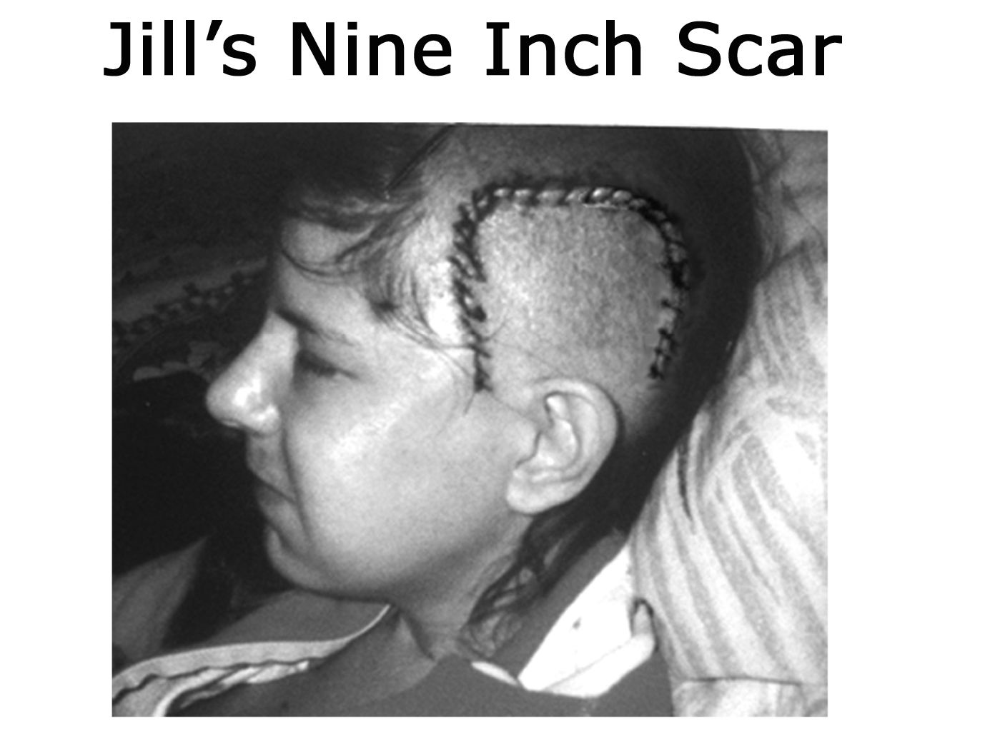

After the surgery, I stayed in the hospital for the next five days.
For the first 48 hours, I begged to have bags of ice applied to my head. I
don't know why, but my brain felt as though it were on fire and the cold
ice relieved the intense heat so I could sleep.

My last night in the hospital was New Year's Eve. In the middle of
the night, I sat up in the window, all alone, watching the lights of
downtown Boston. I wondered what the new year would bring. I
pondered the irony of my experience - a brain scientist having a stroke. I
celebrated the joy I felt and the lessons I had learned. I was touched by
the daunting reality: I was a stroke survivor.

_Please note that I have created a list of "Recommendations for Recovery” as a synopsis of this chapter's comments and recommendations for how I needed to be assessed and what I needed the most to recover. This list is located in Appendix B and is available for your personal use._

Recovery was a decision I had to make a million times a day. Was
I willing to put forth the effort to _try_ ? Was I willing to momentarily
leave my newly found ecstatic bliss to try to understand or reengage
with something in the external world? Bottom line, was I willing to
endure the agony of recovery? At this level of information processing, I
was well aware of the difference between that which gave me pain
versus that which gave me pleasure. Being out in the la-la land of my
right hemisphere was enticing and wonderful. Trying to engage my
analytical left mind was painful. Because it was a conscious decision
for me to _try_, it was critically important that I be surrounded by
competent and attentive caregivers. Otherwise, frankly, I probably
would not have bothered to make the effort.

In order for me to choose the chaos of recovery over the peaceful
tranquility of the divine bliss that I had found in the absence of the
judgment of my left mind, I had to reframe my perspective from "Why
do I have to go back?" to "Why did I get to come to this place of
silence?" I realized that the blessing I had received from this experience
was the knowledge that deep internal peace is accessible to anyone at
any time. I believe the experience of Nirvana exists in the
consciousness of our right hemisphere, and that at any moment, we can
choose to hook into that part of our brain. With this awareness, I
became excited about what a difference my recovery could make in the
lives of others - not just those who were recovering from a brain
trauma, but everyone with a brain! I imagined the world filled with
happy and peaceful people and I became motivated to endure the agony
I would have to face in the name of recovery. My stroke of insight
would be: _peace is only a thought away, and all we have to do to access it is silence the voice of our dominating left mind._

Recovery, however you define it, is not something you do alone,
and my recovery was completely influenced by everyone around me. **I desperately needed people to treat me as though I would recover completely.** Regardless of whether it would take three months, two
years, 20 years, or a lifetime, I needed people to have faith in my
continued ability to learn, heal, and grow. The brain is a marvelously
dynamic and ever-changing organ. My brain was thrilled with new
stimulation, and when balanced with an adequate amount of sleep, it was
capable of miraculous healing.

I have heard doctors say, "If you don't have your abilities back by
six months after your stroke, then you won't get them back!" Believe me,
this is not true. I noticed significant improvement in my brain's ability to
learn and function for eight full years post-stroke, at which point I
decided my mind and body were totally recovered. Scientists are well
aware that the brain has tremendous ability to change its connections
based upon its incoming stimulation. This "plasticity" of the brain
underlies its ability to recover lost function.

I think of the brain as a playground filled with lots of little
children. All of these children are eager to please you and make you
happy. (What? You think I'm confusing children with puppies?) You
look at the playground and note a group of kids playing kickball, another
group acting like monkeys on the jungle gym, and another group
hanging out by the sand box. Each of these groups of children are doing
different yet similar things, very much like the different sets of cells in
the brain. If you remove the jungle gym, then those kids are not going to
just go away, they are going to mingle with other kids and start doing
whatever else is available to be done. The same is true for neurons. If
you wipe out a neuron's genetically programmed function, then those
cells will either die from lack of stimulation or they will find something
new to do. For example, in the case of vision, if you put a patch over one
eye, blocking visual stimulation coming into the cells of the visual
cortex, then those cells will reach out to the adjacent cells to see if they
can contribute their efforts toward a new function. **I needed the people around me to believe in the plasticity of my brain and its ability to  grow, learn, and recover.**

When it comes to the physical healing of cells, I cannot stress
enough the value of getting plenty of sleep. I truly believe that the brain
is the ultimate authority on what it needs to heal itself. As I mentioned
earlier, for my brain, sleep was "filing time." While awake, energy
stimulation poured into my sensory systems and I was rapidly burned
out by photons stimulating my retinal cells and sound waves beating
chaotically on my tympanic membrane. My neurons could not keep up
with the demand and quickly became incapable of making sense of any
incoming information. At the most elementary level of information
processing, stimulation is energy, and **my brain needed to be protected, and isolated from obnoxious sensory stimulation, which it perceived as noise.**

Over the course of several years, if I didn't respect my brain's need
for sleep, my sensory systems experienced agonizing pain and I became
psychologically and physically depleted. I firmly believe that if I had
been placed in a conventional rehabilitation center where I was forced to
stay awake with a TV in my face, alert on Ritalin, and subjected to rehab
on someone else's schedule, I would have chosen to zone out more and
_try_ less. For my recovery, it was critical that we **honor the healing power of sleep** . I know various methodologies are practiced at
rehabilitation facilities around the country, yet I remain a very loud
advocate for the benefits of sleep, sleep, sleep, and more sleep
interspersed with periods of learning and cognitive challenge.

From the beginning, it was vitally important that my caregivers
permit me the freedom to let go of my past accomplishments so I could
identify new areas of interest. **I needed people to love me - not for the person I had been, but for who I might now become.** When my old
familiar left hemisphere released its inhibitions over my more artistic
and musically creative right hemisphere, everything shifted and I needed
my family, friends, and colleagues to support my efforts at re-inventing
myself. At the essence of my soul, I was the same spirit they loved. But
because of the trauma, my brain circuitry was different now, and with
that came a shifted perception of the world. Although I looked the same
and would eventually walk and talk the same as I did before the stroke,
my brain wiring was different now, as were many of my interests, likes,
and dislikes.

My mind was so impaired. I remember thinking, _Can they take away my Ph.D. ? I don't remember any anatomy!_ I knew that I would
have to find a new career that was amenable to my newly found right
hemisphere gifts. Since I had always loved gardening and lawn care, I
considered this a viable future option. I desperately needed people to
accept me as the person I was at that moment, and permit me the
freedom to evolve as a right hemisphere dominant personality. **I needed those around me to be encouraging. I needed to know that I still had value. I needed to have dreams to work toward.**

As I stated earlier, G.G. and I inherently understood that **it was essential that we challenge my brain systems immediately.**
Connections in my brain had been broken and it was crucial that we restimulate them before they either died or completely forgot how to do
what they were designed to do. For recovery, our success was
completely dependent upon our striking a healthy balance between my
awake effort and sleep downtime. For several months after surgery, I was
banned from the TV, telephone, and talk radio. They did not count as
legitimate relaxation time because they sapped my energy, leaving me
lethargic and not interested in learning. Again, G.G. realized early to
**offer me only multiple-choice questions and never ask me Yes/No questions** . Forced choice demanded that I open old files or create new
ones. Yes/No questions demanded no real thought and G.G. rarely
passed by a good opportunity to activate a neuron.

Because my brain had lost its ability to think linearly, I had to
relearn basic personal care, including how to dress myself. I needed to
be taught to put my socks on before my shoes and why. Although I
couldn't remember the real function for routine household items, I was
very creative in what I chose to use for what purpose. This process of
exploration was exciting. Who knew a fork made a fabulous back
scratcher!

My energy was limited so we had to pick and choose, very
carefully every day, how I would spend my effort. **I had to define my priorities for what I wanted to get back the most and not waste energy on other things.** Although I never thought I would regain
enough of my intellect to become a scientist/teacher again, I realized that
I had an amazing story to tell about the beauty and resiliency of the brain - provided I could reactivate mine. I chose to focus my rehabilitation on
an art project that would help recover my physical stamina, manual
dexterity, and cognitive processing. For this, I decided to create an
anatomically correct stained glass brain! (See book cover.) Step one
required that I come up with a design. Having lost all recollection of
academics, I dug out my neuroanatomy books, spread them on the floor,
and pieced together an image of what I thought would make a relatively
accurate (and attractive) brain. The project exercised my gross motor
skills, balance and equilibrium, as well as fine motor skills for cutting
and manipulating the glass. It took eight full months for me to create that
first stained glass brain. When it was done, it was candy to the eye and I
was motivated to make another one, which now hangs at the Harvard
Brain Bank.

Several months prior to the stroke, I had booked a public
presentation at Fitchburg State College. It was scheduled for April 10,
which marked the four-month anniversary of my stroke. Needing a goal
to work toward, I decided that this would be my first post-stroke public
presentation since it was my top priority to regain fluency with
language. I made the decision that I would attend the Fitchburg gig and
speak for 20 minutes. It was my goal to present in such a manner that the
audience would not realize that I was a stroke survivor. Although this
was an ambitious undertaking, I thought it was reasonable. I embarked
upon multiple strategies to accomplish this feat.

First, I had to do something about my hair! For the first few
months following surgery, I was setting a new fad for hairstyle. Because
the surgeons had shaved only the left third of my head, I looked quite
skewed. However, if I "combed-over" what remained on the right, I
could hide the nine-inch scar. The fun part was trying to figure out how
to disguise the new little hairs peeking out through the comb-over. It was
pretty obvious that I was partially buzzed, but by April, I was sporting
quite a cute little coif. I don't know if my hair gave me away that
afternoon or not, nor whether anyone wondered about those two
Frankenstein-like stereotactic dents in my forehead. (The stereotactic
apparatus is the large halo device physicians use to hold the head
perfectly still during surgery.)

I worked very hard to prepare for that Fitchburg presentation. My
first challenge was to speak clearly and intelligently to an audience, and
my second challenge was to be an expert about the brain. To my good
fortune, I had given a major presentation that had been professionally
videotaped at the National NAMI convention just a few months prior to
the hemorrhage. My primary strategy for recovering my speaking skills
was to watch that video over and over again. I studied how that woman
(me) on the stage worked with the microphone. I watched how she held
her head and body and how she walked across the stage. I listened to her
voice, the melody of how she strung words together, and how altering
her volume moved her audience. I learned how to do what she did by
watching her. I learned how to be me again, how to act like me and walk
and talk like me again, by watching that video.

As for the content and brain expert part, I learned a lot about the
brain from that presentation, but I was no expert! The videotaped
presentation itself was way too much information and way over my
head. I had to wonder if that's what folks in my audience thought too! I
did learn, however, how to pronounce those scientific words, and after
repeated viewings, I understood the story she was telling. I really
enjoyed learning about brain donation, and silently wondered if G.G.
would have donated my brain to science had I died on the morning of the
stroke. I laughed out loud every time I heard the Brain Bank jingle and
felt pangs of grief that that woman no longer existed.

In the best style I could, I put together a 20 minute gig that I
practiced day in and day out for over a month. As long as no one
interrupted me or asked any questions about the brain, I thought I could
get by without anyone detecting signs of my recent stroke. Although I
was rather robotic in my movements, I didn't miss a beat with my slides
and I walked
away from Fitchburg feeling triumphant.

Although I did not qualify for occupational or physical therapy, I
spent significant time in speech therapy for four months following
surgery. Speaking was less of a problem for me than reading. G.G. had
already taught me the letters of the alphabet and the sounds that go with
each of those squiggles, but stringing them together as words, and then
adding meaning, was really more than my brain wanted to handle.
Reading for comprehension was a disaster. On my first meeting with my
speech therapist, Amy Rader, I was to read a story that had 23 facts in it.
She had me read the story out loud and then answer her questions. Out
of 23 questions I scored two right!

When I first started working with Amy, I could read the words out
loud but not attach any meaning to the sounds that came out of my
mouth. Eventually, I could read one word at a time, attach a meaning to
that sound, and then go on to the next word. I think a lot of the problem
was that I could not attach one moment to the next or think linearly. As
long as every moment existed in isolation, then I could not string ideas
or words together. From the inside, I felt as though the reading part of
my brain was all but dead and was not interested in learning again. With
the guidance of Amy and G.G., week by week, I took the steps I needed
in order to achieve my goals. It was very exciting because regaining
vocabulary meant regaining some of the lost files in my brain. Just
trying exhausted me, but slowly, word by hard-fought word, files were
opened and I was re-introduced to the life of the woman I had been.
With G.G. patiently steering from the helm, I found my way back into
the veiled crevices of my gray matter.

**For a successful recovery, it was important that we focus on my ability, not my disability** . By celebrating my achievements every
day, I stayed focused on how well I was doing. I made the choice that it
didn't matter if I could walk or talk or even know my name. If all I was
doing was breathing, then we celebrated that I was alive - and we
breathed deeper together. If I stumbled, then we could celebrate when I
was upright. If I was drooling, we could celebrate swallowing! It was
way too easy to focus on my disabilities because they were vast. **I needed people to celebrate the triumphs I made everyday because my successes, no matter how small, inspired me.**

By the middle of January, a few weeks after surgery, my left brain
language center started to come back online and talk to me again.
Although I really loved the bliss of a silent mind, I was relieved to know
that my left brain had the potential to recover its internal dialogue. Up to
this point, I had struggled desperately to link my thoughts together and
think across time. The linearity of internal dialogue helped build a
foundation and structure for my thoughts.

One of the fundamental secrets to my success was that

**I made the cognitive choice to stay out of my own way during the process of recovery.** An attitude of gratitude goes a long way when it
comes to physical and emotional healing. I enjoyed a lot of my recovery
experience as one process flowed naturally into another. I found that as
my abilities increased, so did my perception of the world. Eventually I
was like a toddler wanting to go out and explore - as long as my mommy
wasn't too far away. I tried a lot of new things, had a lot of successes,
and tried some things that I wasn't ready for yet. But I made the choice
to stay out of my own way emotionally and that meant being very
careful about my self-talk. It would have been really easy, a thousand
times a day, to feel as though I was less than who I was before. I had,
after all, lost my mind and therefore had legitimate reason to feel sorry
for myself. But fortunately, my right mind's joy and celebration were so

strong that they didn't want to be displaced by the feeling that went
along with selfdeprecation, self-pity, or depression.

Part of getting out of my own way meant that **I needed to welcome support, love, and help from others** .

Recovery is a long-term process and it would be years before we would
have any idea what I would get back. I needed to let my brain heal and
part of that meant allowing myself to graciously receive help. Prior to
the stroke, I had been extremely independent. I worked during the week
as a research scientist, traveled on the weekends as the _Singin' Scientist_
and managed my home and personal affairs completely on my own. I
was not comfortable accepting help, but in this state of mental
incapacitation, I needed to let people do things for me. In many ways, I
was fortunate that my left hemisphere was injured, for without that ego
portion of my language center, I welcomed the help of others.

**My successful recovery was completely dependent on my ability to break every task down into smaller and simpler steps of action.** G.G. was a wizard at knowing what I needed to be able to do in
order to proceed to the next level of complexity. Whether I was rocking
and rolling-over with enthusiasm before I could sit up, or learning that it
was okay to step on cracks while walking on the sidewalk, each of these
little stages determined my ultimate success.

Because I could not think linearly, **I needed everyone to assume that I knew nothing so that I could relearn everything from the beginning.**
Pieces of information no longer fit together in my brain. For instance, I
might not know how to use a fork and may need to be shown on several
different occasions. **I needed my caregivers to teach me with patience.**
Sometimes I needed them to show me something over and over again,
until my body and brain could figure out what I was learning. If I didn't
"get it" then it was because that part of my brain had a hole in it and
could not understand or absorb the information. When people raised
their voices while teaching me, I tended to shut down. Like an innocent
puppy that is being yelled at, I would become afraid of that person,
repelled by their energy, and tend to not trust them. It was essential that
my caregivers remember that I was not deaf; my brain was simply
wounded. Most important, I needed my caregivers to teach me the 20 [th]
time with the same patience they had the first time.

**I needed people to come close and not be afraid of me.** I
desperately needed their kindness. I needed to be touched - stroke my
arm, hold my hand, or gently wipe my face if I'm drooling. Just about
everyone knows someone who has had a stroke. If their language center
has been disrupted, the stroke survivor can probably not carry on a
conversation with visitors. I know it can be very uncomfortable for a
healthy person to try to communicate with someone who has had a
stroke, but **I needed my visitors to bring me their positive energy.**
Since conversation is obviously out of the question, I appreciated when
people came in for just a few minutes, took my hands in theirs, and
shared softly and slowly how they were doing, what they were thinking,
and how they believed in my ability to recover. It was very difficult for
me to cope with people who came in with high anxious energy. I really
needed people to take responsibility for the kind of energy they brought
me. We encouraged everyone to soften their brow, open their heart, and
bring me their love. Extremely nervous, anxious or angry people were
counter-productive to my healing.

One of the greatest lessons I learned was how to feel the physical
component of emotion. Joy was a feeling in my body. Peace was a
feeling in my body. I thought it was interesting that I could feel when a
new emotion was triggered. I could feel new emotions flood through me
and then release me. I had to learn new words to label these "feeling"
experiences, and most remarkably, I learned that I had the power to
choose whether to hook into a feeling and prolong its presence in my
body, or just let it quickly flow right out of me.

I made my decisions based upon how things felt inside. There
were certain emotions like anger, frustration or fear that felt
uncomfortable when they surged through my body. So I told my brain
that I didn't like that feeling and didn't want to hook into those neural
loops. I learned that I could use my left mind, through language, to talk
directly to my brain and tell it what I wanted and what I didn't want.
Upon this realization, I knew I would never return to the personality I
had been before. I suddenly had much more say about how I felt and for
how long, and I was adamantly opposed to reactivating old painful
emotional circuits.

Paying attention to what emotions feel like in my body has
completely shaped my recovery. I spent eight years watching my mind
analyze everything that was going on in my brain. Each new day brought
new challenges and insights. The more I recovered my old files, the
more my old emotional baggage surfaced, and the more I needed to
evaluate the usefulness of preserving its underlying neural circuitry.

Emotional healing was a tediously slow process but well worth the
effort. As my left brain became stronger, it seemed natural for me to
want to "blame" other people or external events for my feelings or
circumstances. But realistically, I knew that no one had the power to
make me feel anything, except for me and my brain. Nothing external to
me had the power to take away my peace of heart and mind. That was
completely up to me. I may not be in total control of what happens to my
life, but I certainly am in charge of how I choose to perceive my
experience.

# 14. Milestones for Recovery

The number one question that I am most frequently asked is, "How
long did it take you to recover?" My standard response, and I don't mean
to be trite, is, "Recover what?" If we define recovery as regaining access
to old programs, then I am only partially recovered. I have been very
fussy this time around about which emotional programs I am interested
in retaining and which ones I have no interest in giving voice to again
(impatience, criticism, unkindness). What a wonderful gift this stroke
has been in permitting me to pick and choose who and how I want to be
in the world. Before the stroke, I believed I was a product of this brain
and that I had minimal say about how I felt or what I thought. Since the
hemorrhage, my eyes have been opened to how much choice I actually
have about what goes on between my ears.

Physical recovery from the brain surgery was minimal when
compared to the task of rebuilding my mind and recovering awareness of
my body. Following surgery, G.G. kept my head wound clean and the 35
stitches healed beautifully. The greatest challenge I faced was a problem
with the left temporal mandibular joint (TMJ) of my jaw due to surgery,
but with the use of a healing system called the Feldenkrais technique, it
mended quickly. The scar, however, was numb for five years and I
believe the three drill holes in
my skull completely reknitted by year six.

My mother was a very wise caregiver, and although she was
protective, she did not stand in the way of progress. In the middle of
February, two months after the stroke, I took my first solo adventure into
the world. My verbal language was good enough to keep me out of
trouble (we hoped) and I spent minimal time out and about alone. G.G.
drove me to the airport and escorted me to my seat on the plane. A
friend picked me up at the other end, so I didn't have to navigate life in
the big world for very long by myself. I relished this first leap out of the
nest as a huge step in my pursuit of independence. Based on this success,
I was encouraged to take even bigger risks.

At the three-month mark, G.G. taught me how to drive again.
Operating an enormous metal box on wheels at remarkably fast speeds
with a bunch of other busy people doing the same thing while they eat,
drink, smoke, and, oh yes, talk on their cell phones, reminded me that I
was a fragile living being and life is a precious gift. My brain was still
struggling with reading, and the hardest part of learning to drive a car
again was to remember to look for written signs. Obviously this was a
problem. And even when I did see the sign, my comprehension was
painfully slow. _So, what's that big green sign up there saying? Oh s#*?! I just passed my exit!_

By mid-March, G.G. decided I was ready to try living on my own
again. Although I was far from really being back in the game, she felt
that with the support of my friends, I was ready to try my wings. She
reassured me that if I needed her, all I had to do was call and she would
be on the first flight out. A part of me was thrilled about my increased
independence. A bigger part of me was terrified.

Within a few weeks, the first major test of my readiness to resume
my life was the gig in Fitchburg. That gave me something to concentrate
on while I began fending for myself. My friend Julie drove me to the
presentation and it went so well that I was heady with success (pun
intended).

Somehow I managed to not just survive, but to thrive again. I started
spending time on Brain Bank responsibilities on the computer from my
home. In the beginning, just a couple of hours every few days was all I
could handle. Eventually I started commuting back and forth to McLean
Hospital, a day or two a week. In actual fact, the commuting was more
difficult than the work.

To complicate matters, following surgery my doctors insisted that I
take Dilantin as a prophylactic to prevent my brain from having seizures.
I had never had a seizure, but prescribing medication is a common
practice when the temporal region of the brain has been surgically
violated. Like a typical patient, I hated my medication because it made
me feel tired and lethargic. My biggest complaint, however, was that the
medicine masked my ability to know what it felt like to be me anymore.
I was already a stranger to myself because of the stroke, but mix in some
medication and I was even more disoriented. Because of this experience,
I find that I am much more sensitive to why some people would choose
insanity over the side effects of their antipsychotic medications. I was
fortunate that my doctors agreed that I could take my entire dose at night
before I went to bed, so by morning my mind felt much clearer. I took
Dilantin for almost 2 full years following surgery.

At the six-month mark, I flew back home to Indiana to attend my
20th high school reunion. This was a perfect opportunity for me to open
files about my past. Two of my best friends escorted me around, sharing
stories about our time at Terre Haute South Vigo. The timing for this
reunion was ideal. My brain had healed enough to absorb new
information as well as open old files. Attending the reunion helped me
piece together memories of my youth. But again, in this situation,
because I was a stroke survivor, it was critical that I not see myself as
less than I had been before. Friends from my past were very kind to me
and I ended up having a great time retrieving memories.

Shortly after the reunion in June, I attended the annual NAMI
convention in July. It was the end of my three-year term on the National
Board of Directors and I was officially stepping down. I had prepared a
five minute speech to present to an audience of over 2,000 NAMI
members. With guitar in hand, tears in my eyes, and gratitude in my
heart, I thanked those wonderful people for giving me the courage to
come back. I will always cherish that box of cards they sent me,
cheering me on. I know I wouldn't be here today, in this condition, if it
hadn't been for my NAMI family.

Walking became a very important part of my routine. When you
feel like a fluid it's impossible to know where your physical boundaries
begin and end. Walking helped me become strong again, and within the
course of that first year I managed to average three miles a day several
times a week. I walked with small weights in my hands, swinging my
arms here and there, flailing them about like a wild child - but in rhythm.
I made sure I exercised all of my muscle groups -performing shoulder
girdle, shoulder, elbow, and wrist activities. Lots of people looked at me
as if I was odd, but having lost my left hemisphere ego center, I wasn't
concerned with their approval or disapproval. Walking with weights
helped me regain strength, balance, and posture. In addition, I worked
with a friend who, through the use of massage and acupuncture, helped
me identify my physical boundaries.

By the eighth month, I was back to work full time but still not
completely competent either mentally or physically. There was a
sluggishness about my brain that I could not shake. Unfortunately, my
job description involved some complex computer database
responsibilities that I knew my mind was not capable of performing.
Moreover, due to the stroke, I became acutely aware of how precious
little time I have here on the planet. I wanted to move back home to
Indiana. Spending time with my mom and dad, while I still have them
around, became a priority in my life. Fortunately, my boss agreed that I
could travel for the Brain Bank as their National Spokesperson for the
Mentally Ill from anywhere, and she gave me her blessing to return to
Indiana.

One year after the stroke, I moved back home to the Midwest. My
favorite place on earth is Bloomington, Indiana. It's the perfect-sized
college town filled with interesting and creative people - and, oh yes, it's
the home of Indiana University. Coming home to Indiana felt grounding
to me and I knew I was exactly where I was supposed to be when my
new home phone number turned out to be the exact date of my birth day,
month, and year! It was one of those synchronicities in life that let me
know that I was in the right place at the right time.

Post-stroke year two was spent reconstructing, as best I could
recall, the morning of the stroke. I worked with a _Gestalt_ therapist who
helped me verbalize my right hemisphere experience of that morning. I
believed that helping people understand what it felt like to experience
the neurological deterioration of my mind might help caregivers better
relate to stroke survivors. I also hoped that if someone read that account
and then experienced any of those symptoms, they would call for help
immediately. I worked with Jane Nevins and Sandra Ackerman of the
The Dana Foundation on a book proposal for this story. Although our
efforts were premature, I will always be grateful for their interest and
assistance in helping me outline what I valued.

Eventually, when my mind was capable of learning large volumes
of information again, it was time to reengage with academia. In my
second post-stroke year, I was hired by Rose Hulman Institute of
Technology in Terre Haute, Indiana to teach courses in
Anatomy/Physiology and Neuroscience. As I saw it, they were paying
me to relearn the details of my profession. I found that although I had
lost my academic terminology (left hemisphere), I still remembered
what everything looked like and their relationships to one another (right
hemisphere). I ended up pushing my learning ability to the limit on a
daily basis and for the entire quarter, I felt like my brain would explode
from over use. I truly believe that challenging my brain in this way was
exactly what it needed. Staying one lecture ahead of the students was
demanding. For 12 weeks, I balanced work with appropriate sleep, and
my brain performed beautifully. I will always be grateful to the Rose
Hulman Department of Applied Biology and Biomechanical
Engineering for their confidence in my ability to teach again.

To give you some idea of the chronology of my recovery, here is a
brief summary of the highlights of my progress year by year. Prior to the
stroke, I had been an avid Free Cell player (solitaire) but it was three
years before I could wrap my mind around this card game again. On the
physical plane, it took four years of walking with my hand weights,
three miles a day, several times a week, before I could walk with a
smooth rhythm. During the fourth year, my mind became capable of
multitasking - even simple things like talking on the phone while boiling
pasta. Up to that point, I had to do just one thing at a time, which meant
everything required my full attention. And along the journey, it wasn't
my style to complain. I always remembered what I had been like
immediately following the stroke, and I counted my blessings and
thanked my brain a thousand times a day for responding so well to my
attempts to revive it. Having had a taste of the alternative, I spend a
good bit of time feeling grateful for my life.

The one thing I thought I had lost forever was the ability to
understand anything mathematical. To my amazement, however, by the
fourth post-stroke year, my brain was ready to tackle addition again.
Subtraction and multiplication came online around post-stroke year four
and a half, but division eluded me until well into year five.

Working with flash cards helped me drill basic math back into my brain.
Now I work with the Nintendo™ Brain Training and Big Brain
Academy programs. I think everyone over the age of forty, as well as
every stroke survivor, would benefit from using this sort of brain
training tool.

By the end of the fifth year, I could jump from rock to rock along
the beaches in Cancun without looking at where my feet were landing.
This was a significant accomplishment, because up to this point, I had to
keep my eyes looking at the ground. The highlight of my sixth poststroke year was the fulfillment of my dream of having enough oomph in
my body to climb steps two at a time. Imagery has been an effective tool
for regaining physical functions. I am convinced that focusing on how it
feels to perform specific tasks has helped me recover them more quickly.
I had dreamed of skipping up steps every day since the stroke. I held the
memory of what it felt like to race up the steps with abandon. By
replaying this scene over and over in my mind, I kept that circuitry alive
until I could get my body and mind coordinated enough to make it
reality.

Over the years, people in my professional world have been very
generous and kind to me. Initially, I was afraid my colleagues might see
the post-stroke me as having less value and treat me patronizingly, or
perhaps even discriminate against me. Happily this has not been the
case. This stroke has not only opened my eyes to the beauty and
resiliency of the human brain, but also to the generosity of the human
spirit. Many beautiful people have nurtured my heart, and I am grateful
for all the kindnesses I have received.

Although I had been traveling part time as the _Singin' Scientist_ for
the Harvard Brain Bank since post-stroke year two, during my seventh
year, I accepted an adjunct teaching position in the Indiana University
Department of Kinesiology. In addition, teaching Gross Anatomy has
always been my greatest joy, and I began volunteering in the local IU
School of Medicine's Gross Anatomy lab. Revisiting the body and
teaching future physicians about its miraculous design has been a
thrilling privilege for me.

Also in that seventh post-stroke year, my need for sleep at night
had cut back from 11 hours to nine and a half. Up until this point, in
addition to a full night's sleep, I was a happy napper. For the first seven
years, my dreams had been a bizarre reflection of what was going on in
my brain. Instead of having dreams with people and a storyline, my
mind scrolled tiny unrelated bits of data. I presume this reflected how
my brain pieced pixilated information together to form a complete
image. It was shocking when my dreams started featuring people and a
storyline again. In the beginning, the scenes were broken and
nonsensical. By the end of that seventh year, however, my mind was so
busy during the night that I felt little refreshment upon waking.

During the eighth year of recovery, my perception of myself
finally shifted from that of being a fluid back to that of being a solid. I
began slalom water skiing regularly and I believe that pushing my body
as hard as I could helped solidify my brain/body connections. I confess
that although I celebrate being a solid again, I really miss perceiving
myself as a fluid. I miss the constant reminder that we are all _one_.

I now live what I would describe as the perfect life. I still travel for
the Harvard Brain Bank as the _Singin' Scientist._ I teach what I love Neuroanatomy and Gross Anatomy to medical students at the IU School
of Medicine. I regularly spend time as the consulting neuroanatomist at
the Midwest Proton Radiotherapy Institute (MPRI), housed at the IU
Cyclotron, where we use a precisely guided proton beam to battle
cancer. To help other stroke survivors, I'm working on the creation of a
virtual reality system whereby individuals can neurologically rehabilitate
themselves through what I call "visually directed intention."

On the physical front, I love skiing across Lake Monroe early in
the morning, and I faithfully walk around my neighborhood in the
evenings. For creativity, I play in my art space creating stained glass
wonders (mostly brains) and my guitar is a continual source of pleasure.
I still talk to my mom every day, and as the president of the local Greater
Bloomington Area NAMI affiliate, I remain active in advocacy for the
mentally ill. Helping people liberate their own inner peace, joy, and
magnificent beauty has become my personal agenda.

Over the years, I have had the opportunity to share my story with
audiences ranging from readers of _Discover Magazine,_ and Oprah
Winfrey's _O Magazine,_ to the _Stroke Connection Magazine_ of the
American Stroke Association (ASA), as well as the _Stroke Smart_
_Magazine_ of the National Stroke Association (NSA). My recovery story
has been featured on PBS's _The Infinite Mind_ and can still be heard on
the WFIU _Profiles_ program. [1] In addition, there is a wonderful PBS
program titled _Understanding: The Amazing Brain,_ which airs
internationally. I encourage you to tune in as they did a superb job
teaching about the plasticity of the brain.

[1]: [www.indiana.edu](http://www.indiana.edu/) / ~wfiu / profiles.htm

# 15. My Stroke Of Insight
Having taken this unexpected journey into the depths of my brain,
I am grateful and amazed that I have completely recovered physically,
cognitively, emotionally, and spiritually. Over the years, the recovery of
my left hemisphere skills has been tremendously challenging for many
different reasons. When I lost the function of my left brain's
neurological networks, I lost not only function but also a variety of
personality characteristics that were apparently associated with those
circuits of aptitude. Recovering cells of function that were anatomically
linked to a lifetime of emotional reactivity and negative thinking has
been a mind-opening experience. Although I wanted to regain my left
hemisphere skills, I must say that there were personality traits that tried
to rise from the ashes of my left mind that, quite frankly, were no longer
acceptable to my right hemispheric sense of who I now wanted to be.
From both a neuroanatomical and psychological perspective, I have had
a fascinating few years.

The question I faced over and over again was, _Do I have to regain the affect, emotion or personality trait that was neurologically linked to the memory or ability that I wanted to recover?_ For instance, would it
be possible for me to recover my perception of my _self_, where I exist as
a single, solid, separate from the whole, without recovering the cells
associated with my egotism, intense desire to be argumentative, need to
be right, or fear of separation and death? Could I value money without
hooking into the neurological loops of lack, greed, or selfishness?

Could I regain my personal power in the world, play the game of
hierarchy, and yet not lose my sense of compassion or perception of
equality among all people? Could I reengage with my family and not
hook into my issues related to being a little sister? Most important,
could I retain my newfound sense of connection with the universe in the
presence of my left hemisphere's individuality?

I wondered how much of my newly found right hemisphere
consciousness, set of values, and resultant personality I would have to
sacrifice in order to recover the skills of my left mind. I didn't want to
lose my connection to the universe. I didn't want to experience myself as
a solid separate from everything. I didn't want my mind to spin so fast
that I was no longer in touch with my authentic _self._ Frankly, I didn't
want to give up Nirvana. What price would my right hemisphere
consciousness have to pay so I could once again be judged as _normal_ ?

Modern neuroscientists seem satisfied intellectualizing about the
functional asymmetries of our two hemispheres from a neurological
perspective, but there has been minimal conversation pertaining to the
psychological or personality differences contained within these two
structures. Most commonly, the character of our right mind has been
ridiculed and portrayed in an extremely unflattering light, simply
because it does not understand verbal language or comprehend linear
thought. In the case of the Dr. Jekyll and Mr. Hyde analogy, our right
hemisphere personality is depicted as an uncontrollable, potentially
violent, moronic, rather despicable ignoramus, which is not even
conscious, and without whom we would probably be better off! In vast
contrast, our left mind has routinely been touted as linguistic, sequential,
methodical, rational, smart, and the seat of our consciousness.

Prior to this experience with stroke, the cells in my left hemisphere
had been capable of dominating the cells in my right hemisphere. The
judging and analytical character in my left mind dominated my
personality. When I experienced the hemorrhage and lost my left
hemisphere language center cells that defined my _self_, those cells could
no longer inhibit the cells in my right mind. As a result, I have gained a
clear delineation of the two very distinct characters cohabiting my
cranium. The two halves of my brain don't just perceive and think in
different ways at a neurological level, but they demonstrate very
different values based upon the types of information they perceive, and
thus exhibit very different personalities. My stroke of insight is that at
the core of my right hemisphere consciousness is a character that is
directly connected to my feeling of deep inner peace. It is completely
committed to the expression of peace, love, joy, and compassion in the
world.

This is not to say, of course, that I believe I exhibit multiple
personality disorder. That is much more complicated than what I have
observed. Traditionally, it has been difficult, if not impossible, for us to
distinguish between our right and left mind characters simply because
we experience ourselves as a single person with a single consciousness.
However, with very little guidance, most people find it easy to identify
these same two characters within if not themselves, then at least their
parents or significant other. It is my goal to help you find a hemispheric
home for each of your characters so that we can honor their identities
and perhaps have more say in how we want to be in the world. By
recognizing who is who inside our cranium, we can take a more
_balanced-brain_ approach to how we lead our lives.

It appears that many of us struggle regularly with polar opposite
characters holding court inside our heads. In fact, just about everyone I
speak with is keenly aware that they have conflicting parts of their
personality. Many of us speak about how our head (left hemisphere) is
telling us to do one thing while our heart (right hemisphere) is telling us
to do the exact opposite. Some of us distinguish between what we think
(left hemisphere) and what we feel (right hemisphere). Others
communicate about our mind consciousness (left hemisphere) versus our
body's instinctive consciousness (right hemisphere). Some of us talk
about our small ego mind (left hemisphere) compared with our capital
ego mind (right hemisphere), or our small self (left hemisphere) versus
our inner or authentic self (right hemisphere). Some of us delineate
between our work mind (left hemisphere) and our vacation mind (right
hemisphere), while others refer to their researcher mind (left
hemisphere) versus their diplomatic mind (right hemisphere). And of
course there is our masculine mind (left hemisphere) versus our feminine
mind (right hemisphere), and our yang consciousness (left hemisphere)
countered by our yin consciousness (right hemisphere). And if you are a
Carl Jung fan, then there's our sensing mind (left hemisphere) versus our
intuitive mind (right hemisphere), and our judging mind (left
hemisphere) versus our perceiving mind (right hemisphere). Whatever
language you use to describe your two parts, based upon my experience,
I believe they stem anatomically from the two very distinct hemispheres
inside your head.

My goal during this process of recovery has been not only to find
a healthy balance between the functional abilities of my two
hemispheres, but also to have more say about which character dominates
my perspective at any given moment. I find this to be important because
the most fundamental traits of my right hemisphere personality are deep
inner peace and loving compassion. I believe the more time we spend
running our inner peace/compassion circuitry, then the more
peace/compassion we will project into the world, and ultimately the
more peace/compassion we will have on the planet. As a result, the
clearer we are about which side of our brain is processing what types of
information, the more choice we have in how we think, feel, and behave
not just as individuals, but as collaborating members of the human
family.

From a neuroanatomical perspective, I gained access to the
experience of deep inner peace in the consciousness of my right mind
when the language and orientation association areas in the left
hemisphere of my brain became nonfunctional. The brain research
performed by Drs. Andrew Newberg and the late Eugene D'Aquil [1]
earlier this decade have helped me understand exactly what was going
on in my brain. Using SPECT technology (single photon emission
computed tomography), these scientists identified the neuroanatomy
underlying our ability to have a religious or spiritual (mystical)
experience.  They wanted to understand which regions of the brain were
involved in our capacity to undergo a shift in consciousness - away from
being an individual to feeling that we are at _one_ with the universe (God,
Nirvana, euphoria).

Tibetan meditators and Franciscan nuns were invited to meditate
or pray inside the SPECT machine. They were instructed to tug on a
cotton twine when they reached either their meditative climax or felt
united with God. These experiments identified shifts in neurological
activity in very specific regions in the brain. First, there was a decrease
in the activity of the left hemisphere language centers resulting in a
silencing of their brain chatter. Second, there was a decrease in activity
in the orientation association area, located in the posterior parietal gyrus
of the left hemisphere. This region of our left brain helps us identify our
personal physical boundaries. When this area is inhibited or displays
decreased

input from our sensory systems, we lose sight of where we begin and
where we end relative to the space around us.

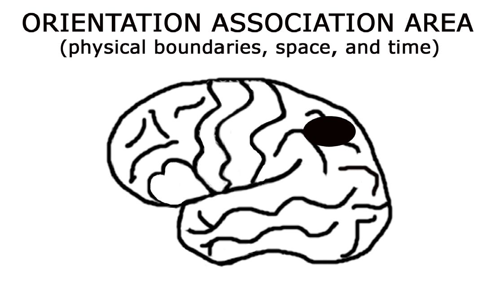
>ORIENTATION ASSOCIATION AREA: Vùng liên hợp định hướng
>(physical boundaries, space, and time): (ranh giới vật lý, không gian và thời gian)

Thanks to this recent research, it makes good neurological sense
that when my left language centers were silenced and my left orientation
association area was interrupted from its normal sensory input, my
consciousness shifted away from feeling like a solid, to a perception of
myself as a fluid - at _one_ with the universe.

[1]: _Why God Won't Go Away_ (NY: Ballantine, 2001).

# 16. My Right And Left Mind

I understand that no matter what information is being processed
(or not being processed) in my two hemispheres, I still experience the
collective of myself as a single entity with a single mind. I do believe
that the consciousness we exhibit is the collective consciousness of
whatever cells are functioning, and that both of our hemispheres
complement one another as they create a single seamless perception of
the world. If the cells and circuitry that recognize faces are functioning
correctly, then I am capable of recognizing you by your face. If not,
then I use other information to identify you, like your voice,
mannerisms, or the gait of your walk. If the cellular circuitry that
understands language is intact, then I can understand you when you
speak. If the cells and circuitry that continually remind me of who I am
and where I live are destroyed, then my concept of myself will be
permanently altered. That is, unless other cells in my brain learn to take
over those particular functions. Much like a computer, if I don't have a
program for word processing, then I can't perform that function.

When we evaluate the unique characteristics of the two cerebral
hemispheres and how they process information differently, it seems
obvious that they would manifest unique value systems that would
consequently result in very different personalities. Some of us have
nurtured both of our characters and are really good at utilizing the skills
and personalities of both sides of our brain, allowing them to support,
influence, and temper one another as we live our lives. Others of us,
however, are quite unilateral in our thinking - either exhibiting
extremely rigid thinking patterns that are analytically critical (extreme
left brain), or we seldom connect to a common reality and spend most
of our time "with our head in the clouds" (extreme right brain).
Creating a healthy balance between our two characters enables us the
ability to remain cognitively flexible enough to welcome change (right
hemisphere), and yet remain concrete enough to stay a path (left
hemisphere). Learning to value and utilize all of our cognitive gifts
opens our lives up to the masterpiece of life we truly are. Imagine the
compassionate world we could create if we set our minds to it.

Sadly, the expression of compassion is often a rarity in our society.
Many of us spend an inordinate amount of time and energy degrading,
insulting, and criticizing ourselves (and others) for having made a
"wrong" or "bad" decision. When you berate yourself, have you ever
questioned: who inside of you is doing the yelling, and at whom are you
yelling? Have you ever noticed how these negative internal thought
patterns have the tendency to generate increased levels of inner hostility
and/ or raised levels of anxiety? And to complicate matters even more,
have you noticed how negative internal dialogue can negatively
influence how you treat others and, thus, what you attract?

As biological creatures, we are profoundly powerful people.
Because our neural networks are made up of neurons communicating
with other neurons in circuits, their behavior becomes quite predictable.
The more conscious attention we pay to any particular circuit, or the
more time we spend thinking specific thoughts, the more impetus those
circuits or thought patterns have to run again with minimal external
stimulation.

In addition, our minds are highly sophisticated "seek and ye shall
find" instruments. We are designed to focus in on whatever we are
looking for. If I seek red in the world then I will find it everywhere.
Perhaps just a little in the beginning, but the longer I stay focused on
looking for red, then before you know it, I will see red everywhere.

My two hemispheric personalities not only think about things
differently, but they process emotions and carry my body in easily
distinguishable ways. At this point, even my friends are capable of
recognizing who's walking into the room by how I'm holding my
shoulders and what's going on with that furrow in my brow. My right
hemisphere is all about _right here, right now._ It bounces around with
unbridled enthusiasm and does not have a care in the world. It smiles a
lot and is extremely friendly. In contrast, my left hemisphere is
preoccupied with details and runs my life on a tight schedule. It is my
more serious side. It clenches my jaw and makes decisions based upon
what it learned in the past. It defines boundaries and judges everything
as right/wrong or good/bad. And oh yes, it does that thing with my brow.

My right mind is all about the richness of this present moment. It
is filled with gratitude for my life and everyone and everything in it. It is
content, compassionate, nurturing, and eternally optimistic. To my right
mind character, there is no judgment of good/bad or right/wrong, so
everything exists on a continuum of relativity. It takes things as they are
and acknowledges what is in the present. The temperature is cooler
today than yesterday. It doesn't care. Today it will rain. It makes no
difference. It may observe that one person is taller than another person,
or this person has more money than that person, but these observations
are made without judgment. To my right mind, we are all equal members
of the human family. My right mind does not perceive or give heed to
territories or artificial boundaries like race or religion.

One of the greatest blessings I received as a result of this
hemorrhage is that I had the chance to rejuvenate and strengthen my
neurocircuits of innocence and inner joy. Thanks to this stroke, I have
become free to explore the world again with childlike curiosity. In the
absence of obvious and immediate danger, I feel safe in the world and
walk the earth as though it is my backyard. In the consciousness of my
right mind, we are laced together as the universal tapestry of human
potential, and life is good and we are all beautiful -just the way we are.

My right mind character is adventurous, celebrative of abundance,
and socially adept. It is sensitive to nonverbal communication, empathic,
and accurately decodes emotion. My right mind is open to the eternal
flow whereby I exist at _one_ with the universe. It is the seat of my divine
mind, the knower, the wise woman, and the observer. It is my intuition
and higher consciousness. My right mind is ever present and gets lost in
time.

One of the natural functions of my right mind is to bring me new
insight in this moment so I can update old files that contain outdated
information. For example, throughout my childhood I would not eat
squash. Thanks to my right hemisphere, I was willing to give squash a
second chance and now I love it. Many of us make judgments with our
left hemisphere and then are not willing to _step to the right_ (that is, into
the consciousness of our right hemisphere) for a file update. For many of
us, once we have made a decision, then we are attached to that decision
forever. I have found that often the last thing a really dominating left
hemisphere wants is to share its limited cranial space with an openminded right counterpart!

My right mind is open to new possibilities and thinks out of the
box. It is not limited by the rules and regulations established by my left
mind that created that box. Consequently, my right mind is highly
creative in its willingness to try something new. It appreciates that chaos
is the first step in the creative process. It is kinesthetic, agile, and loves
my body's ability to move fluidly into the world. It is tuned in to the
subtle messages my cells communicate via gut feelings, and it learns
through touch and experience.

My right mind celebrates its freedom in the universe and is not
bogged down by my past or fearful of what the future may or may not
bring. It honors my life and the health of all my cells. And it doesn't just
care about my body; it cares about the fitness of your body, our mental
health as a society, and our relationship with Mother Earth.

The consciousness of our right mind appreciates that every cell in
our bodies (except for the red blood cells) contains the exact same
molecular genius as the original zygote cell that was created when our
mother's egg cell combined with our father's sperm cell. My right mind
understands that I am the life force power of the fifty trillion molecular
geniuses crafting my form! (And it bursts into song about that on a
regular basis!) It understands that we are all connected to one another in
an intricate fabric of the cosmos, and it enthusiastically marches to the
beat of its own drum.

Freed from all perception of boundaries, my right mind proclaims,
"I am a part of it all. We are brothers and sisters on this planet. We are
here to help make this world a more peaceful and kinder place." My
right mind sees unity among all living entities, and I am hopeful that you
are intimately aware of this character within yourself.

As much as I obviously adore the attitude, openness, and
enthusiasm with which my right mind embraces life, my left mind is
equally amazing. Please remember that this is the character I just spent
the better part of a decade resurrecting. My left mind is responsible for
taking all of that energy, all of that information about the present
moment, and all of those magnificent possibilities perceived by my right
mind, and shaping them into something manageable.

My left mind is the tool I use to communicate with the external
world. Just as my right mind thinks in collages of images, my left mind
thinks in language and speaks to me constantly. Through the use of brain
chatter, it not only keeps me abreast of my life, but also manifests my
identity. Via my left brain language center's ability to say, "I am," I
become an independent entity separate from the eternal flow. As such, I
become a single, a solid, separate from the whole.

Our left brain truly is one of the finest tools in the universe when it
comes to organizing information. My left hemisphere personality takes
pride in its ability to categorize, organize, describe, judge, and critically
analyze absolutely everything. It thrives in its constant contemplation
and calculation. Regardless of whether or not my mouth is running, my
left mind stays busy theorizing, rationalizing, and memorizing. It is a
perfectionist and an amazing housekeeper of corporation or home. It
constantly says, "Everything has a place and everything belongs in its
place." Our right mind character values humanity, while our left mind
character concerns itself with finances and economy.

On the scale of _doing,_ my left mind is a magnificent multi-tasker
and loves performing as many functions as it can at the same time. It is a
true busy bee and partially measures its value by how many things it
crosses off my daily to-do list. Because it thinks sequentially, it is great
at mechanical manipulation. Its ability to focus on differences and
distinguishing characteristics makes it a natural builder.

My left brain is particularly gifted at identifying patterns. As a
result, it is adept at processing large volumes of information quickly. To
keep up with life's experiences in the external world, my left mind
processes information remarkably fast - much faster than my right
hemisphere, which in comparison tends to hoe-de-doe along. At times
my left mind may become manic, while my right mind has the potential
to become lazy.

This difference in speed of thought, information processing, and
output as thought, word or deed, between our two hemispheres, is in part
linked to their unique abilities to process different types of sensory
information. Our right brain perceives the longer wavelengths of light.
As a result, the visual perception of our right mind is somewhat blended
or softened. This lack of edge perception enables it to focus on the
bigger picture of how things relate to one another. Similarly, our right
mind tunes in to the lower frequencies of sound that are readily
generated by our body gurgles and other natural tones. Consequently, our
right mind is biologically designed to readily tune in to our physiology.

In contrast, our left brain perceives the shorter wavelengths of
light, increasing its ability to clearly delineate sharp boundaries. As a
result, our left mind is biologically adept at identifying separation lines
between adjacent entities. At the same time, our left hemisphere
language centers tune in to the higher frequencies of sound, which help
them detect, discriminate, and interpret tones commonly associated with
verbal language.

One of the most prominent characteristics of our left brain is its
ability to weave stories. This story-teller portion of our left mind's
language center is specifically designed to make sense of the world
outside of us, based upon minimal amounts of information. It functions
by taking whatever details it has to work with, and then weaves them
together in the form of a story. Most impressively, our left brain is
brilliant in its ability to make stuff up, and fill in the blanks when there
are gaps in its factual data. In addition, during its process of generating a
story line, our left mind is quite the genius in its ability to manufacture
alternative scenarios. And if it's a subject you really feel passionate
about, either good or awful, it's particularly effective at hooking into
those circuits of emotion and exhausting all the "what if" possibilities.

As my left brain language centers recovered and became
functional again, I spent a lot of time observing how my story-teller
would draw conclusions based upon minimal information. For the
longest time I found these antics of my story-teller to be rather comical.
At least until I realized that my left mind full-heartedly expected the rest
of my brain to believe the stories it was making up! Throughout this
resurrection of my left mind's character and skills, it has been extremely
important that I retain the understanding that my left brain is doing the
best job it can with the information it has to work with. I need to
remember, however, that there are enormous gaps between what I know
and what I think I know. I learned that I need to be very wary of my
storyteller's potential for stirring up drama and trauma.

In the same vein, as my left brain enthusiastically manufactured
stories that it promoted as the truth, it had a tendency to be redundant manifesting loops of thought patterns that reverberated through my
mind, over and over again. For many of us, these loops of thought run
rampant and we find ourselves habitually imagining devastating
possibilities. Unfortunately, as a society, we do not teach our children
that they need to _tend carefully the garden of their minds._ Without
structure, censorship, or discipline, our thoughts run rampant on
automatic. Because we have not learned how to more carefully manage
what goes on inside our brains, we remain vulnerable to not only what
other people think about us, but also to advertising and/or political
manipulation.

The portion of my left mind that I chose not to recover was the
part of my left hemisphere character that had the potential to be mean,
worry incessantly, or be verbally abusive to either myself or others.
Frankly, I just didn't like the way these attitudes felt physiologically
inside my body. My chest felt tight, I could feel my blood pressure rise,
and the tension in my brow would give me a headache. In addition, I
wanted to leave behind any of my old emotional circuits that
automatically stimulated the instant replay of painful memories. I have
found life to be too short to be preoccupied with pain from the past.

During the process of recovery, I found that the portion of my
character that was stubborn, arrogant, sarcastic, and/or jealous resided
within the ego center of that wounded left brain. This portion of my ego
mind held the capacity for me to be a sore loser, hold a grudge, tell lies,
and even seek revenge. Reawakening these personality traits was very
disturbing to the newly found innocence of my right mind. With lots of
effort, I have consciously chosen to recover my left mind's ego center
without giving renewed life to some of those old circuits.

# 17. Own Your Power

I define responsibility (response-ability) as the ability to choose
how we respond to stimulation coming in through our sensory
systems at any moment in time. Although there are certain limbic
system (emotional) programs that can be triggered automatically, it
takes less than 90 seconds for one of these programs to be triggered,
surge through our body, and then be completely flushed out of our
blood stream. My anger response, for example, is a programmed
response that can be set off automatically. Once triggered, the
chemical released by my brain surges through my body and I have a
physiological experience. Within 90 seconds from the initial trigger,
the chemical component of my anger has completely dissipated from
my blood and my automatic response is over. If, however, I remain
angry after those 90 seconds have passed, then it is because I have
_chosen_ to let that circuit continue to run. Moment by moment, I make
the choice to either hook into my neurocircuitry or move back into the
present moment, allowing that reaction to melt away as fleeting
physiology.

The really exciting news about acknowledging my right and left
characters is that I always have an alternative way of looking at any
situation - is my glass half full or half empty? If you approach me
with anger and frustration, then I make the choice to either reflect
your anger and engage in argument (left brain), or be empathic and
approach you with a compassionate heart (right brain). What most of
us don't realize is that we are unconsciously making choices about
how we respond all the time. It is so easy to get caught up in the
wiring of our pre-programmed reactivity (limbic system) that we live
our lives cruising along on automatic pilot. I have learned that the
more attention my higher cortical cells pay to what's going on inside
my limbic system, the more say I have about what I am thinking and
feeling. By paying attention to the choices my automatic circuitry is
making, I own my power and make more choices consciously. In the
long run, I take responsibility for what I attract into my life.

Nowadays, I spend a whole lot of time thinking about thinking just
because I find my brain so fascinating. As Socrates said, "The
unexamined life is not worth living." There has been nothing more
empowering than the realization that I don't have to think thoughts that
bring me pain. Of course there is nothing wrong with thinking about
things that bring me pain as long as I am aware that I am choosing to
engage in that emotional circuitry. At the same time, it is freeing to know
that I have the conscious power to stop thinking those thoughts when I
am satiated. It is liberating to know that I have the ability to choose a
peaceful and loving mind (my right mind), whatever my physical or
mental circumstances, by deciding to _step to the right_ and bring my
thoughts back to the present moment.

More often than not, I choose to observe my environment through
the nonjudgmental eyes of my right mind, allowing me to retain my
inner joy and remain detached from emotionally charged circuitry. I
alone decide if something will have a positive or negative influence on
my psyche. Recently, I was driving down the road singing at the top of
my lungs with my favorite Ginger Curr[1] CD, "I got JOOOOOY in my heart!" To my chagrin, I was pulled over for speeding
(apparently there was way too much enthusiasm going on behind the
wheel!). Since receiving that ticket, I have had to make the decision at
least 100 times to not feel down about it. This little voice of negativity
kept trying to raise its ugly head and bum me out. It wanted to mull the
drama over and over again in my mind, from every angle, but regardless
of my contemplation, the situation would have the same outcome.
Frankly, I find this sort of mental obsessing by my left hemisphere story
teller to be a waste of time and emotionally draining. Thanks to my
stroke, I have learned that I can own my power and stop thinking about
events that have occurred in the past by consciously realigning myself
with the present.

With that said, however, there are some occasions when I will
choose to step into the world as a single, solid, ego center separate from
you. Sometimes it is just pure satisfaction for me to bump my left
hemisphere stuff and attitudes up against your left hemisphere stuff and
attitudes, in argument or passionate debate. More often than not, I don't
like how aggression feels inside my body so I shy away from hostile
confrontation and choose compassion.

For me, it's really easy to be kind to others when I remember that
none of us came into this world with a manual about how to get it all
right. We are ultimately a product of our biology and environment.
Consequently, I choose to be compassionate with others when I consider
how much painful emotional baggage we are biologically programmed
to carry around. I recognize that mistakes will be made, but this does not
mean that I need to either victimize myself or take your actions and
mistakes personally. Your stuff is your stuff, and my stuff is my stuff.
Feeling deep inner peace and sharing kindness is always a choice for
either of us. Forgiving others and forgiving myself is always a choice.
Seeing this moment as a perfect moment is always a choice.

[1] :[www.gingercurry.com](http://www.gingercurry.com/)

# 18. Cells And Multidimensional Circuitry

My good friend Dr. Jerry Jesseph lives his life by the
philosophy "Peacefulness should be the place we begin rather than
the place we try to achieve." I interpret this to mean that we should
stem from the peaceful consciousness of our right mind and use the
skills of our left mind to interact with the external world. He has
also coined the phrase "dual interpenetrating awarenesses" to
describe the relationship between the two halves of our brain. I
think this is a profound and accurate perspective. Thanks to our
corpus callosum, our two hemispheres are so intricately interwoven
that we perceive ourselves as a single individual. However, through
our understanding that we have two very distinct ways of being in
the world, we can deliberately choose to have much more power
over what's going on inside our brains than we ever imagined!

My left brain became competent again when it regained the
ability to process information at fast rates of speed. Now that it is
completely back online, it tends to reengage with life at what feels
like a million miles an hour. Needless to say, the natural
competition between my left hemisphere language centers and my
right hemisphere's experience of inner peace has grounded me back
in the normal human condition. A part of me is thrilled to be so
functional again. A bigger part of me is terrified.

This experience of losing my left brain has opened my mind to
look more positively at people who have experienced various forms of
brain trauma. I often wonder, in the absence of language or the ability to
communicate with others in a normal way, what insights or abilities has
that person gained? I don't feel sorry for people who are different from
me or perceived as not normal anymore. I realize that pity is not an
appropriate response. Instead of feeling repelled by someone who is
different, I am drawn toward them with kindness and curiosity. I am
fascinated by their uniqueness and compelled to establish a meaningful
connection, even if it is merely direct eye contact, a kind smile, or
appropriate touch.

When I take responsibility for the circumstances of my life, I put
myself in the driver's seat and own my power. In an attempt to maintain
my sanity (peaceful heart) in a world that often feels like it spins
dangerously fast, I continue to work very hard to maintain a healthy
relationship between what is going on in my right and left minds. I love
knowing that I am simultaneously (depending on which hemisphere you
ask) as big as the universe and yet merely a heap of star dust.

Everyone's brain is different but let me share with you some of the
simple things I have found to be true for mine. It seems that the more
aware I am about how I am influencing the energies around me, the
more say I have in what comes my way. To monitor how things are
going in my life, I pay very close attention to how things are flowing, or
not flowing in the world around me. Depending on what I am attracting,
I take responsibility for how things are going and consciously make
adjustments along the way. This does not mean that I am in complete
control of everything that happens to me. However, I am in control of
how I choose to think and feel about those things. Even negative events
can be perceived as valuable life lessons, if I am willing to _step to the right_ and experience the situation with compassion.

Now that my left mind's language centers and storyteller are back
to functioning normally, I find my mind not only spins a wild tale but
has a tendency to hook into negative patterns of thought. I have found
that the first step to getting out of these reverberating loops of negative
thought or emotion is to recognize when I am hooked into those loops.
For some of us, paying attention to what our brain is saying to us comes
naturally. Many of my college students, however, complain vehemently
that it takes way too much mental effort for them to simply observe what
their brain is telling them. Learning to listen to your brain from the
position of a nonjudgmental witness may take some practice and
patience, but once you master this awareness, you become free to step
beyond the worrisome drama and trauma of your story-teller.

When I become conscious of what cognitive loops my brain is
running, I then focus on how these loops feel physiologically inside my
body. Do I feel alert? Are my eyes dilated? Is my breath deep or
shallow? Do I feel tightness in my chest? Do I feel lightness in my head?
Is my stomach upset? Do I feel antsy or anxious? Are my legs jiggling?
Neuronal loops (circuits) of fear, anxiety or anger, can be triggered by all
sorts of different stimulation. But once triggered, these different
emotions produce a predictable physiological response that you can train
yourself to consciously observe.

When my brain runs loops that feel harshly judgmental, counterproductive, or out of control, I wait 90 seconds for the
emotional/physiological response to dissipate and then I speak to my
brain as though it is a group of children. I say with sincerity, "I
appreciate your ability to think thoughts and feel emotions, but I am
really not interested in thinking these thoughts or feeling these emotions
anymore. Please stop bringing this stuff up."

Essentially, I am consciously asking my brain to stop hooking into
specific thought patterns. Different people do it differently of course.
Some folks just use the phrase, "Cancel! Cancel!" or they exclaim to
their brain, "Busy! I'm too busy!" Or they say "Enough, enough, enough
already! Knock it off!"

Simply thinking these thoughts with my inner authentic voice,
however, is often not enough for me to get the message across to my
story-teller, who is invested in performing its normal function. I have
found that when I attach an appropriate feeling to these phrases, and
think them with genuine affect, my story-teller is more amenable to this
type of communication. If I'm really having trouble getting my brain to
listen, I add a kinesthetic component to my message like waggling my
pointed finger in the air, or standing firm with my hands on my hips. A
scolding mother is more effective when she says what she means with
passion and communicates her message multidimensionally.

I whole-heartedly believe that 99.999 percent of the cells in my
brain and body want me to be happy, healthy, and successful. A tiny
portion of the story-teller, however, does not seem to be unconditionally
attached to my joy, and is excellent at exploring thought patterns that
have the potential to really derail my feeling of inner peace. This group
of cells has been called many things; some of my favorites include the
Peanut Gallery, the Board of Directors, and the Itty Bitty S#*?!y
Committee. These are the cells in our verbal mind that are totally
resourceful in their ability to run our loops of doom and gloom. These
cells tap into our negative attributes of jealousy, fear, and rage. They
thrive when they are whining, complaining, and sharing with everyone
about how awful everything is.

In extreme situations of cellular disregard, I use my authentic
voice to put my language center's Peanut Gallery on a strict time
schedule. I give my story-teller full permission to whine rampantly
between 9-9:30am and then again between 9-9:30pm. If it accidentally
misses _whine time,_ it is not allowed to reengage in that behavior until its
next allotted appointment. My cells quickly get the message that I am
serious about not hooking into those negative loops of thought - but only
if I am persistent and determined enough to pay attention to what
circuits are running in my brain.

I'm a devout believer that paying attention to our selftalk is vitally
important for our mental health. In my opinion, making the decision that
internal verbal abuse is not acceptable behavior, is the first step toward
finding deep inner peace. It has been extremely empowering for me to
realize that the negative story-teller portion of my brain is only about the
size of a peanut! Just imagine how sweet life was when those cranky
cells were silent. Recovering my left mind has meant that I have had to
give voice to all of my cells again. However, I have learned that in order
to protect my overall mental health, it is necessary for me to tend the
garden of my mind and keep these cells in check. I have found that my
story-teller simply needs a little disciplining directive from my
conscious mind about what I want versus what I find unacceptable.
Thanks to our open line of communication, my authentic self has much
more say over what is going on with this particular group of cells; and I
spend very little time hooked into unwanted or inappropriate thought
patterns.

Having said that, however, I am often humored by the scheming
antics of my story-teller in response to this type of directive. I have
found that just like little children, these cells may challenge the authority
of my authentic voice and test my conviction. Once asked to be silent,
they tend to pause for a moment and then immediately reengage those
forbidden loops. If I am not persistent with my desire to think about
other things, and consciously initiate new circuits of thought, then those
uninvited loops can generate new strength and begin monopolizing my
mind again. To counter their activities, I keep a handy list of three things
available for me to turn my consciousness toward when I am in a state of
need: 1) I remember something I find fascinating that I would like to
ponder more deeply, 2) I think about something that brings me terrific
joy, or 3) I think about something I would like to do. When I am
desperate to change my mind, I use such tools.

I have also found that when I am least expecting it -feeling either
physically tired or emotionally vulnerable -those negative circuits have a
tendency to raise their hurtful heads. The more aware I remain about
what my brain is saying and how those thoughts feel inside my body, the
more I own my power in choosing what I want to spend my time
thinking about and how I want to feel. If I want to retain my inner peace,
I must be willing to consistently and persistently _tend the garden of my mind_ moment by moment, and be willing to make the decision a
thousand times a day.

Our patterns of thought are grounded in rich multidimensional
circuitry that we can learn to scrutinize. First, each thought pattern has a
subject - something that I am cognitively thinking about. For example,
let's say I am thinking about my little dog Nia, who spent a good share
of her last eight years sitting on my lap, helping me write this book.
Thinking about Nia is a specific circuit in my brain. Second, each
thought pattern may or may not be accompanied by an adjoining
emotional circuit of which I am cognizant. In the case of Nia, I generally
experience great joy when I think of her because she was a marvelously
loving creature. In my brain, the subject circuitry of Nia and the
emotional circuitry of joy are intimately linked. Finally, these specific
circuits of thought and emotion may also be linked with some of my
more complex physiological circuitry, which upon stimulation would
result in predictable behavior.

For example: when I think about Nia (thought circuitry) I
experience the feeling of joy (emotional circuitry) and more often than
not, I experience great excitement (physiological circuitry) and engage
in puppy-like behavior (multidimensional circuitry). I instantly revert to
a childlike voice and my eyes dilate. My joy becomes palpable, and I
spontaneously waggle my body as if I were wagging my tail! Yet, in
addition to this circuitry of excitement and animation, on other occasions
I am also inclined to respond to the thought of Nia with consuming
sadness - as I mourn the loss of my beloved four-legged friend. In the
instant of a shifted thought, and its underlying emotional and
physiological circuitry, my eyes might well up with tears. Caught in the
loop of deep grief, my chest tightens, my breathing becomes shallow,
and emotionally I feel depressed. Feeling weak in the knees, my energy
wanes and I succumb to loops of darkness.

These passionate thoughts and feelings have the potential to jump
instantly into my mind, but again, after their 90 seconds have come and
gone, I have the power to consciously choose which emotional and
physiological loops I want to hook into. I believe it is vital to our health
that we pay very close attention to how much time we spend hooked into
the circuitry of anger, or the depths of despair. Getting caught up in these
emotionally charged loops for long periods of time can have devastating
consequences on our physical and mental well-being because of the
power they have over our emotional and physiological circuitry.
However, with that said, it is equally important that we honor these
emotions when they surge through us. When I am moved by my
automatic circuitry, I thank my cells for their capacity to experience that
emotion, and then I make the choice to return my thoughts to the present
moment.

Finding the balance between _observing_ our circuitry and _engaging_
with our circuitry is essential for our healing. Although I celebrate my
brain's ability to experience all of my emotions, I am cautious about how
long I remain hooked into running any particular loop. The healthiest
way I know how to move through an emotion effectively is to surrender
completely to that emotion when its loop of physiology comes over me.
I simply resign to the loop and let it run its course for 90 seconds. Just
like children, emotions heal when they are heard and validated. Over
time, the intensity and frequency of these circuits usually abate.

Really powerful thoughts are perceived as powerful because they
simultaneously run multiple circuits of emotion and physiology.
Thoughts that we would define as neutral are perceived as neutral
because they are not stimulating complex circuitry. Paying attention to
which array of circuits we are concurrently running provides us with
tremendous insight into how our minds are fundamentally wired, and
consequentially, how we can more effectively tend our garden.

In addition to spending a lot of time conversing with my brain
cells, I'm having a big love-fest with the fifty trillion molecular geniuses
making up my body. I am so grateful that they are alive and working
together in perfect harmony that I implicitly trust them to bring me
health. The first thing every morning and the last thing every night, I
faithfully hug my pillow, wrap one hand in the other, and consciously
thank my cells for another great day. I care enough to say it out loud.
"Thank you girls. Thanks for another great day!," and I say it with an
intense feeling of gratitude in my heart. I then implore my cells, _Please, heal me,_ and I visualize my immune cells responding.

I unconditionally love my cells with an open heart and grateful
mind. Spontaneously throughout the day, I acknowledge their existence
and enthusiastically cheer them on. I am a wonderful living being
capable of beaming my energy into the world, only because of them.
When my bowels move, I cheer my cells for clearing that waste out of
my body. When my urine flows, I admire the volume my bladder cells
are capable of storing. When I'm having hunger pangs and can't get to
food, I remind my cells that I have fuel (fat) stored on my hips. When I
feel threatened, I thank my cells for their ability to fight, flee, or play
dead.

At the same time, I listen to my body when it speaks to me. If I
feel tired, I give my cells sleep. When I'm feeling sloth-like, I give my
cells movement. When I'm in pain, I become quiet, coddle the wound,
and consciously surrender into the pain, which helps it dissipate. Pain is
the tool our cells use to communicate to our brain that there is trauma
somewhere in our body. Our cells stimulate our pain receptors in order
to get our brain to focus and pay attention. Once my brain acknowledges
the existence of the pain, then it has served its purpose and either
lightens up in intensity, or goes away.

From my perspective, the focused human mind is the most
powerful instrument in the universe, and through the use of language,
our left brain is capable of directing (or impeding) our physical healing
and recovery. My verbal left ego mind functions as the head-cheerleader
of my fifty trillion molecular geniuses, and when I periodically
encourage my cells with _You go girls!,_ I can't help but think this induces
some sort of vibration within my body that promotes a healing
environment. I'm a believer that when my cells are healthy and happy, I
am healthy and happy.

None of this is to say that people with true mental illness have the
capacity to choose completely what is going on inside their brains.
However, I do believe that all symptoms of severe mental illness stem
from a biological basis: which cells are communicating with which cells,
with which chemicals and in what quantities of those chemicals. Brain
research is on the cutting edge of understanding the neurocircuitry
underlying mental illness, and as our knowledge grows, there will be a
greater understanding about how we can help people more effectively
monitor and tend to the health of their minds.

For treatment options, we have the capacity to influence our brain
cells chemically through the use of medication, electrically via electrical
stimulation, and cognitively through psychotherapy. In my opinion, the
purpose of medical treatment is to increase our ability to share a
common reality. I am in favor of people exploring what resources might
help them more readily connect with others. Unfortunately, 60% of
people diagnosed with schizophrenia do not recognize that they are ill.
As a result, they do not seek or value treatment and often engage in
selfmedication through the abuse of drugs or alcohol. Even the
recreational use of these substances (by anyone) decreases our ability to
share a common reality, and can thus be counterproductive to one's
health.

Although some individuals advocate for the right to be insane, I
am of the opinion that it is everyone's civil right to experience sanity and
share in a common reality - whatever the cause of their brain illness or
trauma.

# 19. Finding Your Deep Inner Peace

This stroke of insight has given me the priceless gift of knowing
that deep inner peace is just a thought/feeling away. To experience peace
does not mean that your life is always blissful. It means that you are
capable of tapping into a blissful state of mind amidst the normal chaos
of a hectic life. I realize that for many of us, the distance between our
thinking mind and our compassionate heart sometimes feels miles apart.
Some of us traverse this distance on command. Others of us are so
committed to our hopelessness, anger, and misery that the mere concept
of a peaceful heart feels foreign and unsafe.

Based upon my experience with losing my left mind, I wholeheartedly believe that the feeling of deep inner peace is neurological
circuitry located in our right brain. This circuitry is constantly running
and always available for us to hook into. The feeling of peace is
something that happens in the present moment. It's not something that
we bring with us from the past or project into the future. Step one to
experiencing inner peace is the willingness to be present in the right
here, right now.

The more aware we are of when we run our loop of deep inner
peace, the easier it is for us to purposely choose to hook into that
circuitry. Some of us struggle in our attempts to recognize when we are
running this circuitry only because our minds are distracted by other
thoughts. This makes sense since our western society honors and
rewards the skills of our "doing" left brain much more than our "being"
right brain. Thus, if you are having difficulty accessing the
consciousness of your right mind circuitry, then it is probably because
you have done a stupendous job learning exactly what you were taught
while growing up. Congratulate your cells for their successes, and as my
good friend Dr. Kat Domingo proclaims, "Enlightenment is not a process
of learning, it is a process of unlearning."

Since both of our hemispheres work together to generate our
perception of reality on a moment-by-moment basis, we are exercising
our right mind all the time. Once you learn to recognize the subtle
feelings (and physiology) running through your body when you are
connected to the circuitry of the present moment, you can then train
yourself to reactivate that circuitry on demand. I'm going to share with
you a variety of ways I _re-mind_ myself back into the consciousness and
personality of my right here, right now, peaceful right brain.

The first thing I do to experience my inner peace is to remember
that I am part of a greater structure - an eternal flow of energy and
molecules from which I cannot be separated (see Chapter Two).
Knowing that I am a part of the cosmic flow makes me feel innately safe
and experience my life as heaven on earth. How can I feel vulnerable
when I cannot be separated from the greater whole? My left mind thinks
of me as a fragile individual capable of losing my life. My right mind
realizes that the essence of my being has eternal life. Although I may
lose these cells and my ability to perceive this three-dimensional world,
my energy will merely absorb back into the tranquil sea of euphoria.
Knowing this leaves me grateful for the time I have here as well as
enthusiastically committed to the well-being of the cells that constitute
my life.

In order to come back to the present moment, we must consciously
slow down our minds. To do this, first decide you are not in a hurry.
Your left mind may be rushing, thinking, deliberating, and analyzing, but
your right mind is very m-e-l-l-o-w.

Right now, besides reading this book, what are you doing? Are
you running any cognitive loops in addition to your reading? Are you
watching the clock or sitting in a busy place? Become aware of your
extraneous thoughts, thank them for their service, and ask them to be
silent for a little while. We're not asking them to go away, just to push
the _pause button_ for a few minutes. Rest assured, they're not going
anywhere. When you are ready to reengage with your story-teller again,
it will jump right back online.

When we are hooked into cognitive thoughts and running mental
loops, technically we are not in the present moment. We can be thinking
about something that has already occurred or about something that has
not yet happened, and although our body is right here, right now, our
mind is somewhere else. In order to come back to the experience of the
present moment, allow your consciousness to shift away from those
cognitive loops that distract you away from what is happening right now.

If you will, think about your breathing. Since you are reading this
book, then you are probably sitting in a relaxed state. Draw in a big deep
breath. Go ahead, it's okay. Pull air deep into your chest and watch your
belly swell. What's going on inside your body? Is it in a comfortable
position? Is your stomach feeling calm or queasy? Are you hungry?
How full is your bladder? Do you have a dry mouth? Do your cells feel
tired or refreshed? How is your neck? Just take a pause from any
distracting thoughts and observe your life for a moment. Where are you
sitting? How's the lighting? How do you feel about where you are
sitting? Take another deep breath, and now another. Relax into your
body - soften your jaw and that furrow in your brow. Revel in the fact
that in this moment, you are a living, thriving human being! Let that
feeling of celebration and gratitude flood your consciousness.

To help me find my way back into my peaceful right mind, I look
at how my body organizes information into systems and capitalize on
those already established circuits. I find that paying attention to sensory
information as it streams into my body is a very helpful tool. However, I
don't just focus on the sensory information, I consciously hook into the
physiological experience underlying that sensory circuitry. I ask myself
repeatedly, _how does it feel to be here doing this?_

Eating, drinking, and being merry, is something that happens in the
present moment. Our mouths contain various types of sensory receptors
permitting us the ability to not only taste different flavors but to perceive
unique textures and varied temperatures. Try observing more closely
how different foods taste. Pay attention to the textures of different foods
and how they feel in your mouth. What foods would you classify as fun
food and why? I love chasing around those little individual gelatin balls
in tapioca pudding. Spaghetti is a great texture to play with too. The
most fun I have with food, however, is squishing the guts out of half
frozen peas, or smooshing mashed potatoes between my teeth! I realize
your mother probably expunged these behaviors out of your dining
repertoire when you were young, but in the privacy of your own home,
I'm thinking it's probably okay. It's really hard to entertain stressinducing thoughts when you're having fun with food!

Besides the physical attributes of food consumption, it is vitally
important that we consider the physiological impact food has on our
body and mind. Beyond the traditional focus on nutritional value, try
paying attention to how select foods make your body feel. Both sugar
and caffeine have me crawling out of my skin within minutes after I
consume them. It's a feeling I don't like and thus try to avoid. Eating
foods that contain the chemical tryptophan (milk, bananas, and turkey)
rapidly increase the levels of the neurotransmitter serotonin in my brain
and cause me to feel mellow. I purposely choose these foods when I
want to concentrate and feel calm.

In general, carbohydrates turn immediately into sugar and make
my body feel lethargic and my brain spastic. Also, I don't like the way
carbs spike my sugar/insulin response and then leave me craving. I like
the way proteins charge me up and give me energy without stimulating
emotional highs and lows. You may have a different response to these
foods, and that's okay. A balanced diet is important, but paying attention
to how you burn energy and how foods make you feel inside your skin
should be a top priority.

One of the easiest ways to shift just about anyone's mood (for
better or for worse) is through stimulation of their nose. If you are overly
sensitive, life in the real world can be unbearable. Capitalizing on our
noses to shift ourselves back into the present moment is easy. Light a
scented candle and let vanilla, rose or almond lift you up beyond your
recollections of stress. When random smells waft past you, hook into
that cognitive loop and spend quality time trying to identify the scent.
Score it on a scale of one to ten for pleasure or yuck. Remember to feel
the physiology that underlies different scents. Let them move you into
the here and now.

If you are having a problem with your ability to smell, then I'm a
true believer that unless the circuits have been permanently severed, it is
possible to increase your sensitivity. When you purposely pay attention
to the smells around you, you're sending a message to your brain saying
you value that connection. If you want to improve your sense of smell,
spend more time sniffing different scents and talk to your cells! Let them
know you want them to improve their ability. If you are willing to
change your behavior such that you spend more time consciously
thinking about what you are smelling, and you're willing to focus your
mind on the act of smelling, then the neuronal connections will get
reinforced and potentially become stronger.

When it comes to vision, there are basically two ways you can use
your eyes. Take a moment right now to look at the view in front of you.
What do you see? Your right mind takes in the big picture. It sees the
view as a whole where everything is relative. It observes the entire
expanse and does not focus on any of the details. Your left mind
immediately focuses in on the contour of individual objects and
delineates the specific entities making up the view.

When I stand on a mountaintop and let my eyes relax, my right
mind takes in the magnificence of the open vista. Physiologically, I feel
the majesty of the overall view deep inside my being, and I am humbled
by how beautiful our planet is. I can recall this moment by either
reconstructing the vision or by recalling the feeling it elicits. My left
mind is completely different. It eagerly focuses my attention on the
specific types of trees, the colors in the sky, and analyzes the sounds of
specific birds. It discriminates the types of clouds, delineates the tree
line, and registers the temperature of the air.

Right now, take a pause from your reading. Close your eyes and
identify three sounds you hear. Go ahead. Relax your mind and expand
your perception. What do you hear? Listen close and listen far. As I sit
here in Dipper Cabin at the Rocky Ridge Music Center in the Rocky
Mountains near Estes Park, my ears are privy to the gurgling sounds of a
creek as it passes right outside my picture window. When I focus my
mind on distant sounds, I hear bits and pieces of classical music as
children practice their instruments. Focusing my ears up close, I hear the
hum of the heater, right here in the cabin, as it warms me.

Listening to music that you love, in the absence of cognitive
analysis or judgment, is another great way to come back to the here and
now. Let sound move you not just emotionally but physically. Allow
your body to rock and sway or dance and play in accordance with the
rhythm. Surrender your inhibitions and let your body get caught in the
flow.

Of course, the absence of sound can be equally as beautiful. I love
putting my ears under water in the tub to create a space of sound
deprivation. I also focus on my body's gurgles when they occur and send
my cells praise for their ongoing efforts. I have found that my mind is
easily distracted by too much auditory stimulation, so I often work, or
travel, with earplugs. I believe that preventing stimulation overload in
my brain is my responsibility, and earplugs have been a true sanity saver
on many occasions.

Our largest and most diverse sensory organ is our skin. Just as our
brain runs various circuits that think, experience emotion or involve
specific combinations of physiological reactivity, our skin is stippled
with very specific receptors capable of detecting very specific forms of
stimulation. As with our other senses, we are all unique in how sensitive
we are to light touch, pressure, heat and cold, vibration, and pain. Some
of us adapt more quickly than others. Although most of us don't spend
much time thinking about our clothes after we put them on, some of us
remain so sensitive that our minds obsess over their texture or weight. I
thank my cells regularly for their ability to adapt to incoming
stimulation. Imagine how preoccupied our minds would be all the time if
we couldn't.

Humor me again, if you will, and take another pause from your
reading. This time, close your eyes and think about the information you
are currently detecting from your skin. How is the temperature of the
air? What is the texture of your clothing - soft or scratchy, light or
heavy? Is anything pushing up against you - maybe a pet or a pillow?
Just think about your skin for a moment. Can you feel your watch, or
those glasses on your nose? How about your hair draping on your
shoulder?

From a therapeutic perspective, there is perhaps nothing more
intimate than touch, be it physical connection with another human, a
furry friend or even your household plants. The physical benefits of
nurturing and being nurtured are priceless. Simply taking a shower and
feeling the water splashing upon your body is a great way to jolt yourself
back into the present moment. Feeling the pressure of water against your
skin, by taking a bath or playing in a pool, is excellent light pressure and
temperature stimulation. Allow these forms of activity the power to lull
you back into the here and now. Train yourself to pay closer attention to
when your different circuits are stimulated. As you do, you encourage
them to function.

Deep body massage is also great for a number of reasons. Not only
does it help relieve tension in your muscles, but it also increases the
movement of the fluids in your cellular environment. The internal world
of your body is how your cells obtain nutrition and clear their waste. I
enthusiastically support any type of stimulation that increases their
standard of living.

One of my most favorite ways of using touch to come back to the
here and now is through raindrops. Walking in the rain is a
multidimensional experience that moves me deeply. Drops of water
spattering on my face instantly shift me into the beauty and innocence of
my right mind as I feel enveloped by a deep sense of purification.
Feeling the warmth of sunshine upon my face or the kiss of a breeze on
my cheek also connects me directly with a part of myself that feels at
_one_ with all that is. I absolutely love standing on the ocean's edge with
my arms spread wide, flying in the breeze. By remembering the smells,
sounds, tastes, and how I felt deep inside, I can transport myself back to
Nirvana in an instant.

The more attention we pay to the details of how things look,
sound, taste, smell, feel against our skin and feel physiologically inside
our body, the easier it is for our brain to recreate any moment. Replacing
unwanted thought patterns with vivid imagery can help us shift our
consciousness back toward our deep inner peace. Although it is great to
use our senses to rebuild an experience, I believe the real power in
experiential recreation is located in our ability to remember what the
underlying physiology feels like.

It's impossible for me to end this section on the use of sensory
stimulation to bring one into the present moment, and not touch on the
subjects of energy dynamics and intuition. For those of you who have
very sensitive right hemispheres, I know you understand what I am
talking about. At the same time, I appreciate that for many of us, if our
left mind cannot smell it, taste it, hear it, see it or touch it, then we are
skeptical as to whether or not it exists. Our right brain is capable of
detecting energy beyond the limitations of our left mind because of the
way it is designed. I hope your level of discomfort about such things as
energy dynamics and intuition has decreased as you have increased your
understanding about the fundamental differences in the way our two
hemispheres collaborate to create our single perception of reality.

Remembering that we are energy beings designed to perceive and
translate energy into neural code may help you become more aware of
your own energy dynamics and intuition. Can you sense the mood of a
room when you first walk in? Ever wonder why you seem to be content
one minute and then fraught with fear the next? Our right hemisphere is
designed to perceive and decipher the subtle energy dynamics we
perceive intuitively.

Since the stroke, I steer my life almost entirely by paying attention
to how people, places, and things feel to me energetically. In order to
hear the intuitive wisdom of my right mind, however, I must consciously
slow my left mind down so I am not simply carried along on the current
of my chatty story-teller. Intuitively, I don't question why I am
subconsciously attracted to some people and situations, and yet repelled
by others. I simply listen to my body and implicitly trust my instincts.

At the same time, my right mind completely honors the
phenomenon of cause and effect. In a world of energy, where everything
influences everything, it seems naive for me to disregard the insights of
my right mind. If I am shooting a bow and arrow, for example, I don't
just focus on the target's bulls-eye, but I trace the path between the arrow
tip and the center of the target. I visualize the perfect amount of force
exerted by my muscles as they pull back the arrow, and focus my mind
on the fluidity of the process rather than the finality of the end product. I
find that when my perception is expanded and I imagine the experience,
my accuracy is increased. If you are involved in sports, you have the
power to choose how you want to perceive yourself in relationship to
your target or goal. You can see yourself as separate - you positioned at
spot A and your target at spot Z, or you can see yourself at _one_ with the
target and in the flow with all the atoms and molecules in the space
between.

Our right brain perceives the big picture and recognizes that
everything around us, about us, among us and within us is made up of
energy particles that are woven together into a universal tapestry. Since
everything is connected, there is an intimate relationship between the
atomic space around and within me, and the atomic space around and
within you - regardless of where we are. On an energetic level, if I think
about you, send good vibrations your way, hold you in the light, or pray
for you, then I am consciously sending my energy to you with a healing
intention. If I meditate over you or lay my hands upon your wound, then
I am purposely directing the energy of my being to help you heal. How
the arts of Reiki, Feng Shui, acupuncture, and prayer (to mention only a
few) work remain pretty much medical mysteries. This is mostly
because our left brains and science have not yet successfully caught up
with what we understand to be true about how our right hemisphere
functions. However, I believe our right minds are perfectly clear about
how they intuitively perceive and interpret energy dynamics.

Shifting away from the subject of sensory systems, we can also use
the skills of our motor output systems to shift our perspective into the
here and now. Purposely relaxing muscles you routinely hold tense can
help you release pent up energy and feel better. I'm constantly checking
in with the tension in my forehead and inevitably, if I can't fall asleep at
night, I consciously loosen my jaw and then proceed to pass right out.
Thinking about what is going on with your muscles is a great way to pull
your mind back into the present. Systematically squeezing and relaxing
them may help you come back to the here and now.

Lots of people use movement and exercise to shift their minds.
Yoga, Feldenkrais, and Tai Chi are awesome tools for personal
development, relaxation, and growth. Noncompetitive sports are also a
great way to get you back into your body and out of your left brain.
Walking in nature, singing, creating, and playing music, or getting lost in
the arts can easily shift your perspective back to the present moment.

Another avenue for shifting one's focus away from the churning
loops of our left cognitive mind is through purposely using our voice to
interrupt those looping patterns of thought that we find distressful or
distracting. I find that using repetitious sound patterns such as mantra
(which literally means "place to rest the mind") is very helpful. By
breathing deeply and repeating the phrase _In this moment I reclaim my JOY_ or _In this moment I am perfect, whole and beautiful,_ or _I am an innocent and peaceful child of the universe,_ I shift back into the
consciousness of my right mind.

Listening to a verbal meditation that guides me into a thought
pattern with emotion and physiology is another great way to shift my
mind away from unwanted loops. Prayer, whereby we use our mind to
intentionally replace unwanted thought patterns with a chosen set of
thought patterns, is another way to consciously guide one's mind away
from the incessant squirrel cage of verbal repetition into a more peaceful
place.

I absolutely love vocal tuning with sounding bowls. These are
large bowls made of exquisite quartz crystal. When stroked, the bowls
resonate so powerfully that I can feel the vibration right down to my
bones. My worries don't stand a chance at hanging on to my mind when
the sounding bowls are in play.

I also draw Angel Card [1] several times a day to help me stay
focused on what I believe is important in life. The original Angel Cards
come in sets of assorted sizes with each card having a single word
written on them. Every morning when I first get up, I ritualistically
invite an angel into my life and draw a card. I then focus my attention on
that particular angel throughout my day. If I am feeling stressed or have
an important phone call to make, I will often draw another angel to help
me shift my mind. I am always in quest of being open to what the
universe will bring me. I use the Angel Cards to shift me back into a
state of being generous of spirit, as I really like what I attract when I am
open. Some of the angels include: enthusiasm, abundance, education,
clarity, integrity, play, freedom, responsibility, harmony, grace, and birth.
Drawing angels is one of the simplest and most effective tools I have
found to help me shift my mind out of my left hemisphere's judgment.

If I had to pick one output (action) word for my right mind, I
would have to choose _compassion_ . I encourage you to ask yourself, what
does it mean to you to be compassionate? Under what circumstances are
you inclined to be compassionate and what does compassion feel like
inside your body?

Generally, most of us are compassionate with those we see as our
equals. The less attached we are to our ego's inclination for superiority,
the more generous of spirit we can be with others. When we are being
compassionate, we consider another's circumstance with love rather than
judgment. We see a homeless person or a psychotic person and approach
them with an open heart, rather than fear, disgust, or aggression. Think
about the last time you reached out to someone or something with
genuine compassion. How did it feel inside your body? To be
compassionate is to move into the right here, right now with an open
heart consciousness and a willingness to be supportive.

If I had to choose one word to describe the feeling I feel at the core
of my right mind, I would have to say _joy_. My right mind is thrilled to be
alive! I experience a feeling of awe when I consider that I am
simultaneously capable of being at _one_ with the universe, while having
an individual identity whereby I move into the world and manifest
positive change.

If you have lost your ability to experience joy, rest assured the
circuitry is still there. It is simply being inhibited by more anxious
and/or fearful circuitry. How I wish you could lose your emotional
baggage, just like I did, and shift back into your natural state of joy! The
secret to hooking into any of these peaceful states is the willingness to
stop the cognitive loops of thought, worry, and any ideas that distract us
from the kinesthetic and sensory experience of being in the here and
now. Most important, however, our desire for peace must be stronger
than our attachment to our misery, our ego, or our need to be right. I love
that old saying, "Do you want to be right, or do you want to be happy?"

Personally, I really like the way happy feels inside my body and
therefore choose to hook into that circuitry on a regular basis. I've often
wondered, _If it's a choice, then why would anyone choose anything other than happiness?_ I can only speculate, but my guess is that many of us
simply do not realize that we have a choice and therefore don't exercise
our ability to choose. Before my stroke, I thought I was a product of my
brain and had no idea that I had some say about how I responded to the
emotions surging through me. On an intellectual level, I realized that I
could monitor and shift my cognitive thoughts, but it never dawned on
me that I had some say in how I perceived my emotions. No one told me
that it only took 90 seconds for my biochemistry to capture, and then
release me. What an enormous difference this awareness has made in
how I live my life.

Another reason many of us may not choose happiness is because
when we feel intense negative emotions like anger, jealousy, or
frustration, we are actively running complex circuitry in our brain that
feels so familiar that we feel strong and powerful. I have known people
who consciously choose to exercise their anger circuitry on a regular
basis simply because it helps them remember what it feels like to be
themselves.

It is just as easy for me to habitually run the happiness circuit as it
is for me to run the anger circuit. In fact, from a biological perspective,
happiness is the natural state of being for my right mind. As such, this
circuitry is constantly running and is always available for me to tap into.
My anger circuit, on the other hand, does not always run, but can be
triggered when I experience some sort of threat. As soon as the
physiological response has passed out of my blood stream, I can resume
my joy.

Ultimately, everything we experience is a product of our cells and
their circuitry. Once you have tuned in to how different circuits feel
inside your body, then you can pick and choose how you want to be in
the world. I, personally, feel allergic to how fear and/or anxiety feel in
my body. When these emotions surge through me, I feel so
uncomfortable that I want to crawl out of my skin. Because I don't like
the way these emotions feel physiologically, I'm not inclined to hook
into that circuitry on a regular basis.

My favorite definition of fear is "False Expectations Appearing
Real," and when I allow myself to remember that all of my thoughts are
merely fleeting physiology, I feel less moved when my story-teller goes
haywire and my circuitry is triggered. At the same time, when I
remember that I am at _one_ with the universe, then the concept of fear
loses its power. To help protect myself from having a trigger-happy
anger or fear response, I take responsibility for what circuitry I
purposely exercise and stimulate. In an attempt to diminish the power of
my fear/anger response, I intentionally choose not to watch scary movies
or hang out with people whose anger circuitry is easily set off. I
consciously make choices that directly impact my circuitry. Since I like
being joyful, I hang out with people who value my joy.

As I mentioned earlier, physical pain is a physiological
phenomenon that is specifically designed to alert our brain that tissue
damage has occurred somewhere in our body. It's important we realize
that we are capable of feeling physical pain without hooking into the

emotional loop of suffering. I am reminded of how courageous little
children can be when they become extremely ill. Their parents may hook
into the emotional circuitry of suffering and fear, while the child seems
to be adapting to his illness without the same negative emotional drama.
To experience pain may not be a choice, but to suffer is a cognitive
decision. When children are ill, it is often more difficult for the child to
handle parental grief than it is for the child to endure the illness.

The same can be true for anyone who is ill. Please be very careful
what circuits you stimulate when you visit someone who is not well.
Death is a natural process we all must experience. Just realize that deep
inside your right mind (deep within your heart's consciousness) rests
eternal peace. The easiest way I have found to humble myself back into
a state of peaceful grace is through the act of gratitude. When I am
simply grateful, life is simply great!

[1]: [www.innerlinks.com](http://www.innerlinks.com/)

# 20. Tending the Garden

I have learned so much from this experience with stroke, that I
actually feel fortunate to have taken this journey. Thanks to this trauma, I
have had the chance to witness firsthand a few things about my brain
that otherwise I would never have imagined to be true. For these simple
insights, I will always be grateful - not just for myself but for the hope
these possibilities may bring to how we, as a people, choose to view and
nurture our brains and consequently behave on this planet.

I am grateful for your willingness to join me on this intense
journey. I sincerely hope that whatever circumstances brought you to this
book, you move forward having gleaned some insight into your brain or
the brain of another. I trust with my right hemisphere's heart
consciousness that this book will now flow from your hands into the
hands of someone who may benefit from it.

I always end my e-mails with a tag-line quote from Einstein. I
believe he got it right when he said, "I must be willing to give up what I
am in order to become what I will be." I learned the hard way that my
ability to be in the world is completely dependent on the integrity of my
neurocircuitry. Cell by beautiful cell, circuit by neurocircuit, the
consciousness I experience within my brain is the
collective awareness established by those marvelous little entities as they
weave together the web I call my mind. Thanks to their neural plasticity,
their ability to shift and change their connections with other cells, you
and I walk the earth with the ability to be flexible in our thinking,
adaptable to our environment, and capable of choosing who and how we
want to be in the world. Fortunately, how we choose to be today is not
predetermined by how we were yesterday.

I view the garden in my mind as a sacred patch of cosmic real
estate that the universe has entrusted me to tend over the years of my
lifetime. As an independent agent, I and I alone, in conjunction with the
molecular genius of my DNA and the environmental factors I am
exposed to, will decorate this space within my cranium. In the early
years, I may have minimal input into what circuits grow inside my brain
because I am the product of the dirt and seeds I have inherited. But to
our good fortune, the genius of our DNA is not a dictator, and thanks to
our neurons' plasticity, the power of thought, and the wonders of modern
medicine, very few outcomes are absolute.

Regardless of the garden I have inherited, once I consciously take
over the responsibility of tending my mind, I choose to nurture those
circuits that I want to grow, and consciously prune back those circuits I
prefer to live without. Although it is easier for me to nip a weed when it
is just a sprouting bud, with determination and perseverance, even the
gnarliest of vines, when deprived of fuel, will eventually lose its strength
and fall to the side.

The mental health of our society is established by the mental
health of the brains making up our society, and I must admit that western
civilization is a pretty challenging environment for my loving and
peaceful right hemisphere character to live in. Obviously, I'm not alone
in feeling this way, as I look at the millions of beautiful people in our
society who have chosen to escape our common reality by selfmedicating themselves with illicit drugs and alcohol.

I think Ghandi was right when he said, "We must be the change we
want to see in the world." I find that my right hemisphere consciousness
is eager for us to take that next giant leap for mankind and _step to the right_ so we can evolve this planet into the peaceful and loving place we
yearn for it to be.

Your body is the life force power of some fifty trillion molecular
geniuses. You and you alone choose moment by moment who and how
you want to be in the world. I encourage you to pay attention to what is
going on in your brain. Own your power and show up for your life.
Beam bright!

And when your life force wanes, I hope you will give the gift of
hope and donate your beautiful brain to Harvard.

# Appendix A

1-800-BrainBank!

Oh, I am a brain banker,

Banking brains is what I do.

I am a brain banker,

Asking for a deposit from you!

Don't worry, I'm in no hurry!

Have you considered the contribution you can make When you are
heaven bound, your brain can hang around, To help humanity, find the

key to Unlock this thing we call insanity.

Just dial 1-800-BrainBank for information please, Educate then donate,

it's free!

Oh, I am a brain banker,

Banking brains is what I do.

I am a brain banker,

Asking for a deposit from you!

# Appendix B

**Recommendations for Recovery by Jill Bolte Taylor, Ph.D.**

_**My Stroke of Insight**_

**Ten Assessment Questions:**

1.  Have you had my eyes and ears checked to make sure you
know what I can see and hear?

2.  Can I discriminate color?

3.  Do I perceive three dimensions?

4.  Do I have any sense of time?

5.  Can I identify all of my body parts as mine?

6.  Can I discriminate a voice from background noise?

7.  Can I access my food? Can my hands open the containers? Do
I have the strength and dexterity to feed myself?

8.  Am I comfortable? Am I warm enough? Or thirsty? Or in
pain?

9.  Am I oversensitive to sensory stimulation (light or sound)? If
so, bring me earplugs so I can sleep, and sunglasses so I can keep

my eyes open.

10.  Can I think linearly? Do I know what socks and shoes are?
Do I know that my socks go on before my shoes?

**Forty Things I Needed the Most**

1.  I am not stupid, I am wounded. Please respect me.

2.  Come close, speak slowly, and enunciate clearly.

3.  Repeat yourself - assume I know nothing and start from the
beginning, over and over.

4.  Be as patient with me the 20 [th] time you teach me something,
as you were the first.

5.  Approach me with an open heart and slow your energy down.
Take your time.

6.  Be aware of what your body language and facial expressions
are communicating to me.

7.  Make eye contact with me. I am in here - come find me.
Encourage me.

8.  Please don't raise your voice - I'm not deaf, I'm wounded.

9.  Touch me appropriately and connect with me.

10.  Honor the healing power of sleep.

11.  Protect my energy. No talk radio, TV, or nervous visitors! Keep
visitation brief (five minutes).

12.  Stimulate my brain when I have any energy to learn something
new, but know that a small amount may wear me out quickly.

13.  Use age-appropriate (toddler) educational toys and books to
teach me.

14.  Introduce me to the world kinesthetically. Let me feel
everything. (I am an infant again.)

15.  Teach me with monkey-see, monkey-do behavior.

16.  Trust that I am trying - just not with your skill level or on your
schedule.

17.  Ask me multiple-choice questions. Avoid Yes/No questions.

18.  Ask me questions with specific answers. Allow me time to hunt
for an answer.

19.  Do not assess my cognitive ability by how fast I can think.

20.  Handle me gently, as you would handle a newborn.

21.  Speak to me directly, not about me to others.

22.  Cheer me on. Expect me to recover completely, even if it takes
twenty years!

23.  Trust that my brain can always continue to learn.

24.  Break all actions down into smaller steps of action.

25.  Look for what obstacles prevent me from succeeding on a task.

26.  Clarify for me what the next level or step is so I know what I am
working toward.

27.  Remember that I have to be proficient at one level of function
before I can move on to the next level.

28.  Celebrate all of my little successes. They inspire me.

29.  Please don't finish my sentences for me or fill in words I can't
find. I need to work my brain.

30.  If I can't find an old file, make it a point to create a new one.

31.  I may want you to think I understand more than I really do.

32.  Focus on what I can do rather than bemoan what I cannot do.

33.  Introduce me to my old life. Don't assume that because I cannot
play like I used to play that I won't continue to enjoy music or an
instrument, etc.

34.  Remember that in the absence of some functions, I have gained
other abilities.

35.  Keep me familiar with my family, friends, and loving support.
Build a collage wall of cards and photos that I can see. Label them so
I can review them.

36.  Call in the troops! Create a healing team for me. Send word out
to everyone so they can send me love. Keep them abreast of my
condition and ask them to do specific things to support me - like
visualize me being able to swallow with ease or rocking my body up
into a sitting position.

37.  Love me for who I am today. Don't hold me to being the person
I was before. I have a different brain now.

38.  Be protective of me but do not stand in the way of my progress.

39.  Show me old video footage of me doing things to remind me
about how I spoke, walked, and gestured.

40.  Remember that my medications probably make me feel tired, as
well as mask my ability to know what it feels like to be me.

