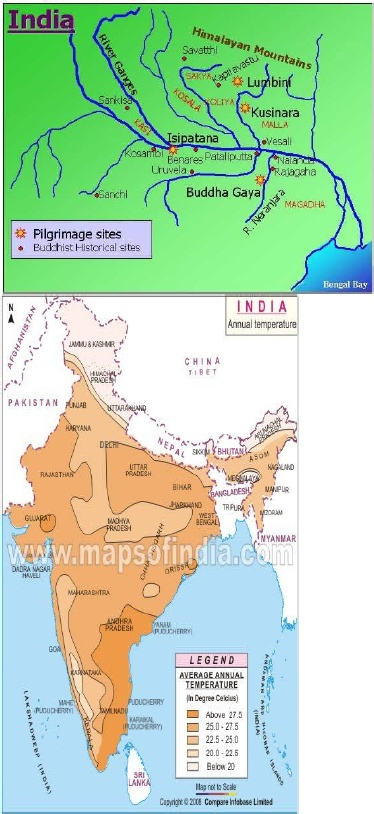
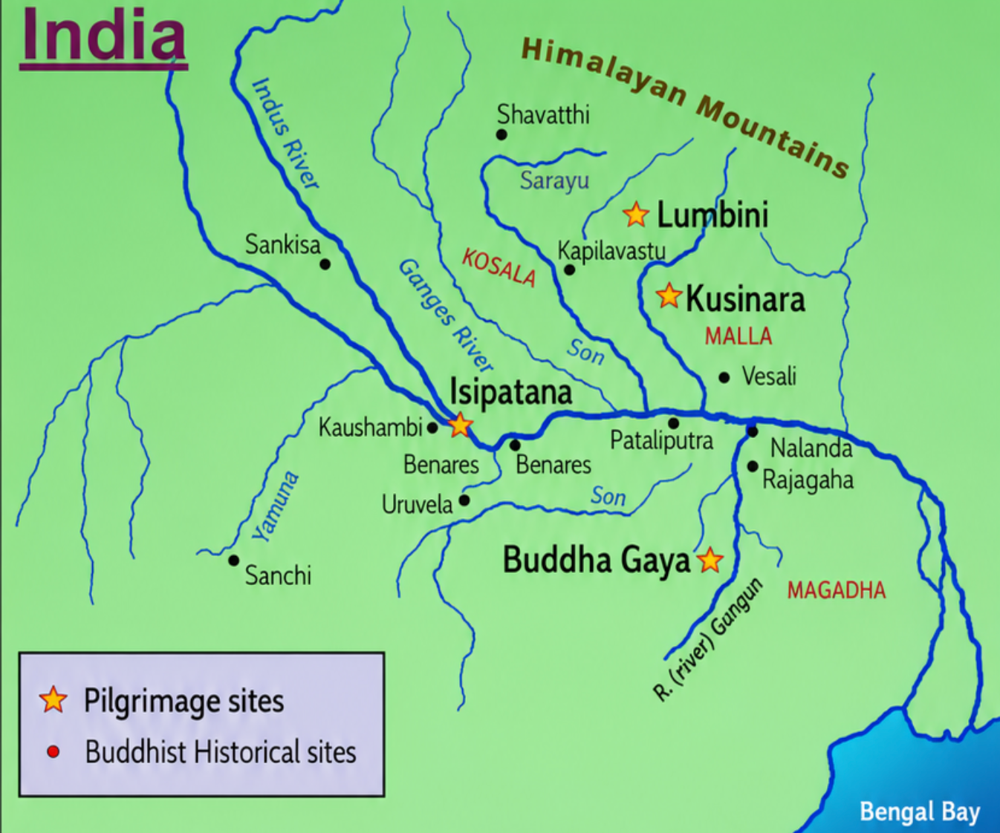
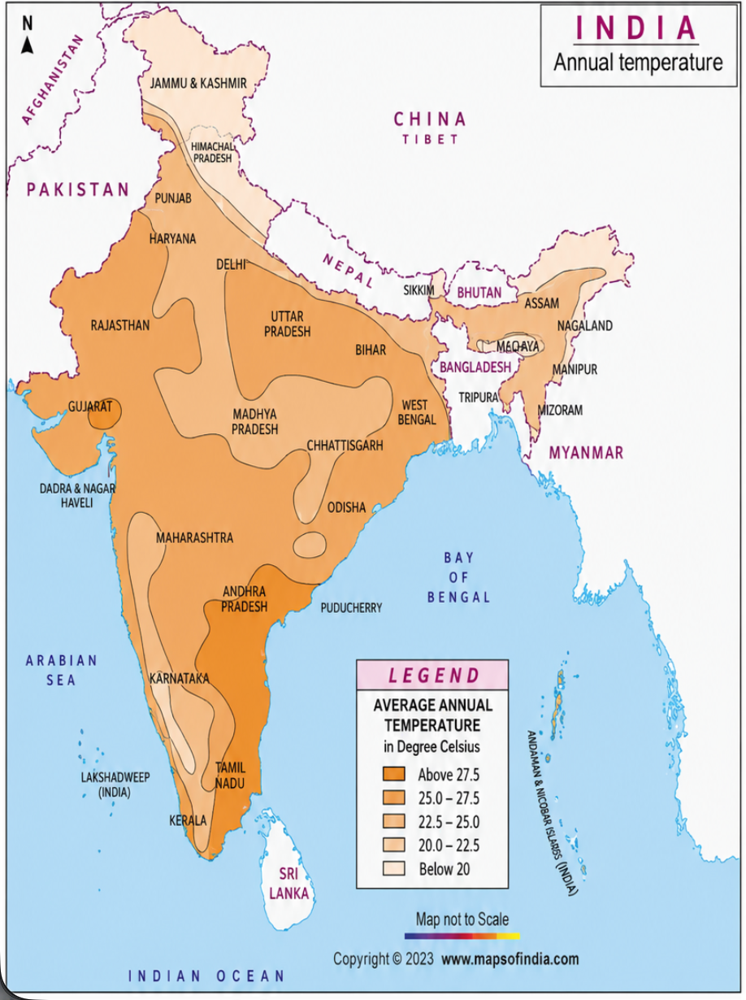
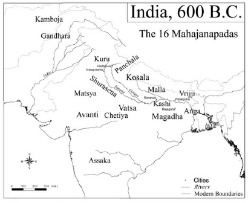
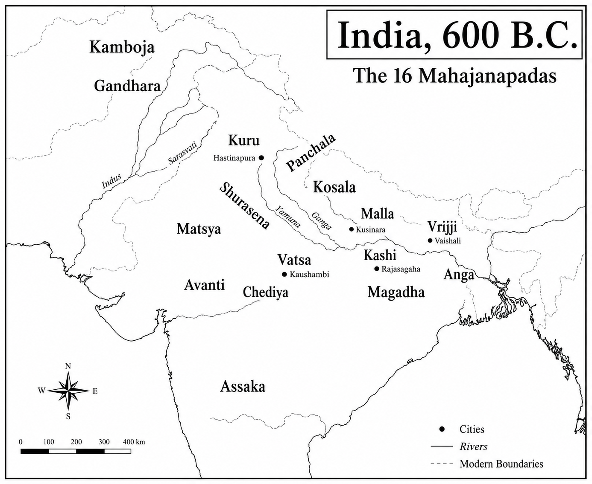
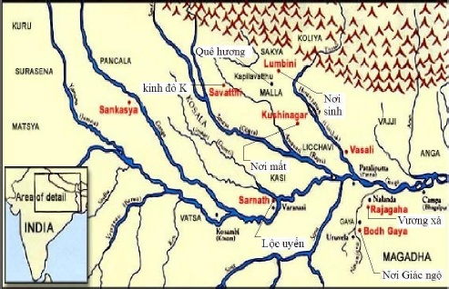
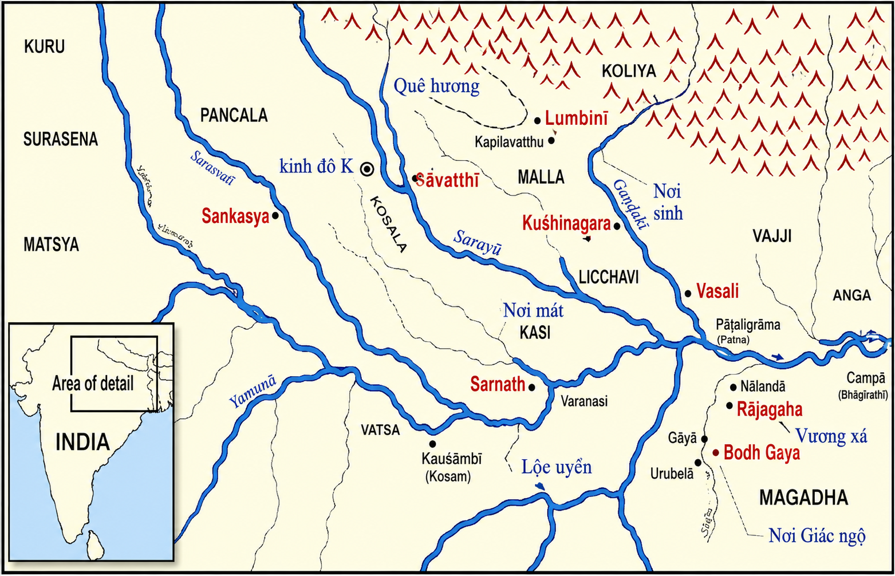
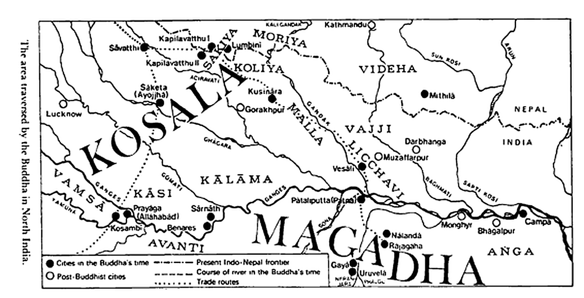
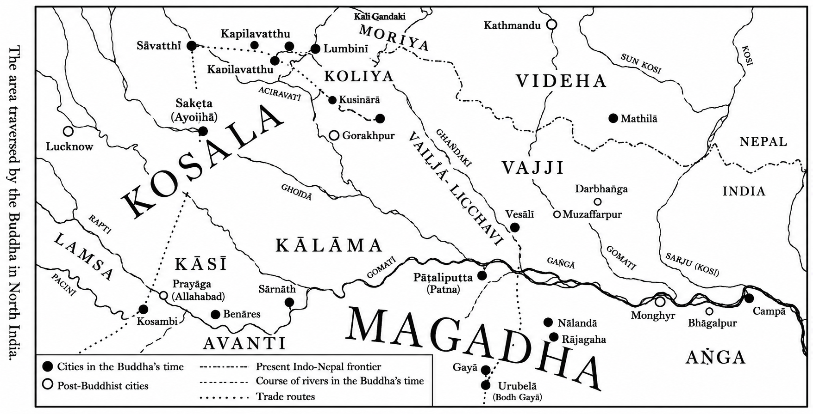

Chương I
# Thời Niên Thiếu - Cuộc Tầm Cầu - Giác Ngộ
*563 - 528 trước CN*

## BỐI CẢNH VÀ NỀN CHÍNH TRỊ Ở BẮC ẤN THẾ KỶ THỨ SÁU TRƯỚC CN

Trên sân ga thành phố Ðại Học Bắc Ấn ở Gorakhpur, ta có thể thấy ngoài số du khách Ấn Ðộ, còn có du khách từ Nhật Bản, Srilanka, Thái Lan, Miến Ðiện cũng như đám người Tây Tạng tha hương và du khách Tây phương nữa. Họ là những người chiêm bái, trên đường đi viếng nơi đức Phật đản sanh tại Lumbini (Lâm-tì-ni) và nơi Ngài diệt độ tại Kusinàrà (Câu-thi-na). Vì bình nguyên Bắc Ấn này nằm giữa vùng đồi núi Himalayas (Tuyết Sơn) và lưu vực sông Gangà (Hằng Hà) là thánh địa Phật giáo, chính tại đây đức Phật tuyên bố các Thắng Trí của Ngài, khoảng giữa năm 528 và năm 483 trước Công Nguyên, và cũng là nơi khai sinh Giáo hội Tăng già đầu tiên. Từ đây, lời dạy của bậc Ðạo Sư bắt đầu bước đường chinh phục nhiều vùng châu Á một cách hòa bình êm đẹp.

Phong cảnh này vào thời đức Phật là vùng rừng rậm, trải dài từ cao nguyên Tarai trên triền dãy Tuyết Sơn khoảng 300km xuống dần về phía nam thành một bình nguyên mang đủ hình dáng ruộng đồng và lác đác vài ngôi làng ẩn nấp dưới những đám cây mọc rải rác trong ánh mặt trời gay gắt, một vài chỗ bị gián đoạn bởi các sông ngòi chảy chầm chậm đưa những chiếc thuyền gỗ buồm xám dong ruỗi nhàn nhã. Các khu thành thị chính ở đây là Allàhabàd, Vàranasì (Benares) và Patna.

*Bản đồ 4 thánh tích và nhiệt độ trong năm ở Ấn Độ*

*Bản đồ 4 thánh tích và các địa điểm lịch sử quan trọng liên quan đến cuộc đời Đức Phật và Tăng đoàn (làm rõ bởi AI)*

| English                 | Nghĩa                           | Giải thích                                                                                                                                                              |
| ----------------------- | ------------------------------- | ----------------------------------------------------------------------------------------------------------------------------------------------------------------------- |
| *Isipatana               | Isipatana (Lộc Uyển, Sarnath)   | Nơi Đức Phật thuyết bài pháp đầu tiên **Dhammacakkappavattana Sutta**, khai mở Tăng đoàn. Gần thành Benares.                                                            |
| *Kusinara                | Câu-thi-na                      | Nơi Đức Phật nhập Niết-bàn. Là một trong bốn thánh tích lớn.                                                                                                            |
| *Lumbini                 | Lâm-tỳ-ni                       | Nơi Thái tử Siddhattha Gautama đản sinh. Là một trong bốn thánh tích lớn.                                                                                               |
| *Buddha Gaya (Bodh Gaya) | Bồ-đề Đạo Tràng                 | Nơi Đức Phật thành đạo dưới cội Bồ-đề tại Uruvelā. Một trong bốn thánh tích lớn.                                                                                        |
| Kosala                  | Vương quốc Kosala (Kiều-tát-la) | Một trong những cường quốc thời Đức Phật. Vua Pasenadi (Ba-tư-nặc) cai trị. Đức Phật cư trú tại đây rất nhiều năm.                                                      |
| Magadha                 | Vương quốc Magadha (Ma-kiệt-đà) | Cường quốc lớn nhất thời Đức Phật. Vua Bimbisāra và Ajātasattu đều trị vì tại đây. Đây là trung tâm của Phật giáo thời kỳ đầu.                                          |
| Malla                   | Bộ tộc Malla                    | Một nước cộng hòa nhỏ. Kusinara thuộc Malla, là nơi Đức Phật nhập Niết-bàn.                                                                                             |
| Shravatthi (Sāvatthī)   | Xá-vệ                           | Thủ đô Kosala. Đức Phật an cư nhiều nhất tại Kỳ Viên (Jetavana) ở đây.                                                                                                  |
| Kapilavastu             | Ca-tỳ-la-vệ                     | Kinh đô của dòng họ Thích-ca. Nơi Thái tử Siddhattha lớn lên.                                                                                                           |
| Vesali                  | Vesālī (Tỳ-xá-ly)               | Thủ đô nước Licchavi. Đức Phật đến đây nhiều lần; nơi thành lập Ni đoàn và cũng là nơi Ngài tuyên bố ba tháng nữa sẽ nhập Niết-bàn.                                     |
| Pataliputra             | Pāṭaliputta (Hoa Thị Thành)     | Sau thời Đức Phật trở thành kinh đô đế quốc Maurya của vua A Dục. Cuối đời Đức Phật nơi đây mới chỉ là một đô thị đang xây dựng.                                        |
| Nalanda                 | Nālandā                         | Trung tâm học thuật nổi tiếng sau này. Trong kinh Nikāya, Đức Phật cũng từng đến Nālandā trước khi đại học Nālandā được xây dựng nhiều thế kỷ sau.                      |
| Rajagaha                | Rājagaha (Vương Xá)             | Kinh đô đầu tiên của Magadha. Đức Phật sống nhiều năm tại Trúc Lâm (Veḷuvana) và núi Linh Thứu (Gijjhakūṭa).                                                            |
| Uruvela                 | Uruvelā                         | Khu rừng nơi Bồ-tát tu khổ hạnh và sau đó chứng ngộ dưới cội Bồ-đề. Ngày nay thuộc khu vực Bodh Gaya.                                                                   |
| Benares                 | Benares (Varanasi)              | Thành Ba-la-nại. Thành phố cổ nổi tiếng bên sông Hằng.                                                                                                                  |
| Kaushambi               | Kosambī                         | Một thành phố lớn nơi Đức Phật thường lưu trú; nổi tiếng với câu chuyện chư Tăng bất hòa ở Kosambī.                                                                     |
| Sankisa                 | Sankassa (Sankisa)              | Theo truyền thống Phật giáo, nơi Đức Phật từ cõi trời Đao-lợi trở về sau khi thuyết pháp cho mẹ. Sự kiện này không xuất hiện trong Nikāya mà thuộc truyền thống về sau. |
| Sanchi                  | Sanchi                          | Nổi tiếng với các bảo tháp thời vua A Dục (thế kỷ III TCN). Không phải nơi Đức Phật từng đến theo kinh Nikāya.                                                          |

*Bản đồ nhiệt độ trong năm ở Ấn Độ (làm rõ bởi AI)*

Ðó là cách sinh hoạt thông thường giữa tháng năm và tháng sáu, lúc khí hậu lên cao 40 độ C, nhưng phong cảnh và các thị trấn lại hoàn toàn đổi khác khi gió mùa chợt bùng ra giữa tháng sáu, trước đó đã ùa đến từ vùng đông nam theo những khối mây khổng lồ đùn lên dày đặc. Rồi những trận mưa ào ào như thác dữ dội đổ xuống đất hằng giờ khiến mặt đất trở thành một cánh đầm lầy, những dòng sông trước đây hiền hòa nay tràn bờ cuồn cuộn chảy xiết.

Chẳng bao lâu sức nóng trở nên oi bức lạ thường, da con người phát nóng khô nứt nẻ và ngứa ngáy rất khó chịu. Nhưng dần dần nhiệt độ hạ xuống làm không khí từ tháng mười đến tháng ba (khoảng 15 độ C) thật ôn hòa dễ chịu. Tháng giêng trời có thể trở rất lạnh khoảng 30 độ C ban đêm và những thương nhân tạp hóa có dịp đem mền bông ra bán. Dần dần cột thủy ngân  lại lên cao và từ tháng tư một thời kỳ nóng bức lại bắt đầu. Ánh sáng chói lọi của đám cây rừng bừng ra từ những chùm hoa đỏ như khối hồng ngọc rực rỡ. Trời càng nóng dần, các loài chim cu gáy lại càng cất tiếng hót lanh lảnh, do đó làm cho làn không khí oi bức thêm khiến con người mỏi mệt không sao ngủ được.

Môi trường và khí hậu chi phối cách sống của dân chúng như vậy, hoàn cảnh xã hội chính trị cũng không kém. Trong khi lịch sử Ấn Ðộ trước thời đức Phật bị một màn sương mù của dĩ vãng xa xưa bao phủ, thì vào thế kỷ thứ sáu, bức màn ấy được vén lên để lộ cho ta nhận ra bối cảnh chính trị trong vùng tiểu lục địa này. Các sự kiện quan trọng và các nhân vật trở nên rõ nét với những khả năng, đặc tính, ước vọng chẳng khác gì các nhân vật thời đại chúng ta xuất hiện. Và chính Kinh Ðiển Phật giáo đã truyền đạt tất cả những điều ấy cho chúng ta.

Tuy nhiên việc đó không phải nhằm mục đích ghi chép lịch sử, vì người Ấn Ðộ thời ấy không xem các biến cố chính trị là chuyện xứng đáng cho ta gìn giữ trong tâm trí. Ðối tượng của các nhà biên niên sử đạo Phật là truyền bá Chánh Pháp (Dhamma) do đức Thế Tôn tuyên thuyết trong các bài kinh của Ngài và công bố đây là con đường độc nhất dành cho những người đi tìm sự cứu độ trong tương lai.

*Ấn độ 600 BC*

*Ấn độ 600 BC (làm rõ bởi AI)*

Sau khi được truyền khẩu qua hàng thế kỷ, Kinh Ðiển ấy được ghi chép không bao lâu trước Công nguyên. Từ những lời phát biểu về nơi chốn, cơ hội, hoàn cảnh của các bài kinh Phật, và từ các Bộ Luận giải chúng, thời đại của đức Phật trở nên thật sống động đối với chúng ta.

Nếu Vệ-đà, các tác phẩm văn học tối cổ của Ấn Ðộ phản ảnh nếp sống thôn quê, thì trong Kinh Ðiển Phật giáo ta thấy cả bức tranh văn hóa thành thị. Ta cũng nghe nói đến làng mạc nông dân, nhưng đặc biệt là các thành phố tạo nên bối cảnh cho đức Phật hoằng Pháp, chúng là các tụ điểm của đời sống chính trị và thương mại phồn vinh. Nhân vật trung tâm của xã hội ấy là một vua cai trị địa phương (ràja) mà các quyết định của vị này còn tuỳ thuộc vào hội đồng và thường cũng cần phải tuỳ theo lòng trung thành đối với vị đại vương (mahàràja).

Theo Kinh Ðiển Phật giáo, toàn cảnh chính trị của vùng đồng bằng trung tâm sông Hằng trong thế kỷ thứ 6 trước CN do bốn vương quốc, một số nước cộng hòa theo chế độ tập quyền và các nhóm bộ tộc quyết định.

Phía bắc sông Hằng là vương quốc Kosala (Kiều-tát-la) hùng cường với thủ đô Sàvatthi (Xá-vệ) vào thời đức Phật, nước này được các Ðại vương liên tục trị vì, đó là Mahàkosala, Pasenadi và Vidùdabha. Ngoài Sàvatthi, các thành phố quan trọng khác của Kosala là Sàketa (hay Ayojjha), cố đô, và Varanasi (Benares, Ba-la-nại), thánh địa để chiêm bái. Ðại vương Kosala, ngoài lãnh thổ trung ương, còn ngự trị thêm hai nước cộng hòa và ba bộ tộc khác nữa.

Phía Tây nam Kosala, nằm trong góc giữa sông Hằng và sông Yamunà (Diệm-mâu-na) là tiểu quốc Vamsà (hay Vaccha) với thủ đô Kosambì (Kiều-thưởng-di) và trung tâm chiêm bái Payàga (nay là Allàhabàd). Quốc vương Vamsà là Udena, con vua Parantapa.

Tiểu quốc Avanti (sát Magadha) trải dài dưới quốc độ Vamsà và Kosala đến phía nam sông Hằng. Quốc vương Pajjota ngự trị tại thành Ujjenì, nhưng ở miền nam nước này lại có một thủ đô thứ hai là Màhissati. Xứ Avanti nằm phía ngoài khu vực được đức Phật du hành nhưng lại được đệ tử ngài là tôn giả Mahàkaccàna (Ðại-Ca-chiên-diên) giáo hóa theo đạo Phật.

*Bản đồ thánh tích Budda*

*Bản đồ thánh tích Budda (làm rõ bởi AI)*

Cuối cùng là vương quốc Magadha (Ma-kiệt-đà) trải dài, giáp Avanti về phía đông và sông Hằng về phía bắc. Sự phồn thịnh của xứ này phần lớn dựa vào các quặng sắt do việc khai thác mỏ không xa kinh đô Ràjagàha (Vương Xá), vừa phục vụ thương mại xuất khẩu vừa sản xuất vũ khí trong nước. Các Ðại vương Bhàti (hay Bhàtiya) và Bimbisàra (Tần-bà-sa-la kết hôn với chị của vua Pasenadi nước Kosala) liên tục ngự trị tại thành Vương Xá, còn vua Ajàtasattu (A-xà-thế) dời kinh đô từ Vương Xá đến Pàlaliputta (nay là Patna). Vương tử kế vị vua Ajàtasattu là Udàyibhadda, cũng như phụ vương mình, đã giết cha để chiếm ngai vàng và sau đó cũng cùng chung số phận ấy dưới tay con trai là Anuruddhaka.

Ngoài bốn quốc độ này, vùng Trung Nguyên còn có nhiều xứ cộng hòa, tất cả đều ở về phía đông Kosala và bắc Magadha. Các xứ này có tính cách quý tộc tập quyền, mỗi xứ đều do một vua thống trị (ràja) vừa chủ tọa hội đồng quốc gia vừa tự cầm quyền nhiếp chính những lúc hội đồng không có kỳ họp. Chỉ các thành phần giai cấp Khattiya (Sát-đế-lỵ _ quý tộc) được bầu làm quốc vương, nghĩa là các vương tước hay các chức vị trong hội đồng lãnh đạo đều dành cho người ở giai cấp này. Tuy nhiên, các giai cấp khác cũng được nghe các buổi hội nghị vì phòng hội đồng chỉ gồm một mái che trên các cột trụ mà thôi.

Các xứ cộng hòa được gọi tên theo  nhóm quý tộc lãnh đạo, nhóm này chỉ là một thiểu số trong toàn dân, mà cho đến nay không lưu lại các con số rõ ràng nào cả.

Xứ cộng hòa của bộ tộc Sakiyas (hay Sakya, Sakka, Thích-ca) thủ đô là Kapilavatthu (Ca-tỳ-la-vệ) và vùng lãnh thổ cổ sơ hiện nay bị ranh giới Ấn Ðộ _ Nepal chia cắt, thời ấy tiếp giáp quốc độ Kosala về đông bắc và là một nước chư hầu của đế quốc này. Ðức Phật là một người trong giới quý tộc Thích-ca.

Cộng hòa Malla rất rộng có đến hai vua thống trị ở Pàvà và Kusinàrà. Kusinàrà được mô tả như một nơi chốn không quan trọng, nhưng chính nơi đây bậc Ðạo Sư đã viên tịch trong Niết-bàn Tối hậu (Parinibbàna).

Cộng hòa Licchavrì với thủ đô Vesàli (Tỳ-xá-ly) và Cộng hòa Videha (Vi-đề-ha) với thủ đô Mitthilà (Mi-thi-la) đã gia nhập vào liên bang Vajji (Bạt-kỳ), có một thời lại liên kết thêm vài bộ tộc khác nữa.

Ngoài các nước quân chủ và cộng hòa còn có các bộ tộc. Chúng ta biết rất ít về chế độ chính trị của họ, nhưng sự khác biệt giữa các cộng hòa và bộ tộc hình như là ở điểm vị cai trị bộ tộc không do dân bầu lên mà do các vị bô lão trong bộ tộc chỉ định, và vị cai trị bộ tộc ấy cũng như các bô lão đều không cần phải ở giới quý tộc Sát-đế-lỵ. Các bộ tộc quan trọng là Koliyas (Câu-ly) ở phía đông nam cộng hòa Sakiya, ranh giới của hai nước là con sông nhỏ bé Rohinì (nay là Rowai). Xưa có nhiều liên hệ hôn nhân giữa hai dòng họ Sakiyas và Koliyas này. Thủ đô của Koliyas là Ràmagàma (hay Koliyanagara).

*Bản đồ di chuyển của Phật*

*Bản đồ di chuyển của Phật (làm rõ bởi AI)*

Xa hơn nữa lại có bộ tộc Moriyas, thủ đô là Pipphalivana, vùng đất này tiếp giáp vùng đất của bộ tộc Koliya, đến mãi tận phía đông. Cuối cùng phải nói đến dòng họ Kàlamas, thủ đô là Kesaputta. Xứ sở này nằm trong góc hướng về phía tây giữa sông Ghàgra và sông Hằng.

Ðôi khi có ý kiến khác nhau giữa các vương quốc, cộng hòa, bộ tộc ấy phần lớn về quyền dẫn thủy nhập điền và đồng cỏ, nhưng thái độ chung là cùng sống hòa bình. Bất cứ ai cũng có thể tự do vượt qua biên giới chung giữa các chính thể khác nhau ấy. Ðây là toàn cảnh địa lý, khí hậu và chính trị thời đức Phật Siddhattha Gotama (Sĩ-đạt-ta Cồ-đàm) giáng sinh năm 563 trước CN.

## NGUỒN GỐC THÁI TỬ SIDDHATTHA VÀ SỰ ÐẢN SANH CỦA NGÀI

Kapilavatthu, quê hương đức Phật, nơi ngài sống hai mươi chín năm đầu tiên trong đời, ở sát biên giới ngày nay ngăn chia nước Nepal và cộng hòa Ấn Ðộ. Phụ vương đức Phật mệnh danh Suddhodana (Tịnh Phạn)*thuộc bộ tộc Sakiya. Bộ tộc Sakiya gồm toàn các vị Sát-đế-lỵ quý tộc vào thời ấy là thành phần giai cấp cao sang, giai cấp võ tướng hay hơn nữa là đại thần lãnh trách nhiệm cai trị và xử án tại cộng hòa Sakiya. Từ các chức vụ này, vị tân vương thống trị nước cộng hòa và đại diện toàn dân được bầu lên khi có nhu cầu. Vào khoảng giữa thế kỷ thứ sáu trước CN, vua Tịnh Phạn giữ ngôi vị Quốc trưởng.

Vua Tịnh Phạn kết hôn với hai chị em ruột từ xứ Devadaha, bà chánh hậu Màyà (Ma-gia) sau này thành mẫu thân Thái tử Siddhattha. Thứ phi ngài là Pajàpati (hay Mahàpajàpati: Ma-ha ba-xà-ba-đề) sinh hai con: hoàng nam là vương tử Nanda, chỉ sinh sau thái tử Siddhattha, anh khác mẹ vài ngày, và công chúa Nandà hay Sundarìnandà. Cả hai bà Màyà và Pajàpati đều thuộc về bộ tộc Sakiya. Kết hôn trong cùng một bộ tộc phù hợp với quy luật hôn nhân nội tộc thịnh hành thời ấy, mặc dù việc này cũng có thể bị coi thường trong trường hợp có chuyện ái tình hay món hồi môn đủ sức lôi cuốn.

Ðáng chú ý hơn, đặc biệt ở giai cấp Bà-la-môn là nguyên tắc kết hôn ngoại tộc chống việc kết hôn nội tộc, theo đó những người cùng một họ (tộc tánh) không được phép kết hôn. Tộc tánh của vua Tịnh Phạn là Gotama vì thế ngài không được phép kết hôn với một phụ nữ cùng họ. Hẳn ngài đã tuân theo tục lệ ấy và đã kết hôn với nhiều người ngoại tộc nhưng việc này không có gì chắc chắn vì tộc tánh Devadahasakka hoặc Anjana đều không được ghi trong sử. Tuy nhiên ta chỉ nhìn vào bản gia phả là thấy rõ mối liên hệ huyết thống mật thiết giữa vua Tịnh Phạn và hai bà hoàng hậu chị em này: Mẫu thân của Ngài và phụ thân của hai bà là anh em ruột, và phụ thân ngài cùng mẫu thân hai bà cũng vậy. Nói cách khác, hai hoàng hậu là hai em họ ngài.

Kapilavatthu là kinh thành quê hương của Thái tử Siddhattha, nhưng không phải nơi ngài ra đời.

Như trong Nidànakatthà (Duyên Khởi Luận), phần giới thiệu truyện Tiền Thân hay Bổn Sanh (Jàtakas) kể câu chuyện thần thoại về hoàng hậu Màyà đã bốn mươi tuổi, ngay trước thời kỳ lâm sản đã lên đường trở về quê song thân ở  Devadaha để sinh con và nhờ mẫu thân Yasodharà bảo dưỡng. Cuộc hành trình bằng xe ngựa hay xe bò cọc cạch lắc lư trên những con đường đất bụi nóng bức khiến cho việc lâm sản xảy ra sớm trước khi về đến Devadaha. Gần làng Lumbini (Lâm-tỳ-ni, nay là Rumindai) giữa trời không có nhà cửa che chở, chỉ có được tàng cây sàla (tên khoa học Shorea Robusta) và cũng không có thầy thuốc nào lo việc hộ sản, hoàng tử ấu nhi Siddhattha sinh ra đời khoảng tháng năm, năm 563 trước CN.

Lumbini được các nhà khảo cổ khai quật năm 1896. Di chỉ quan trọng nhất được tìm thấy nơi ấy là một thạch trụ cao 6m5 do hoàng đế Asoka (A-dục) dựng năm 245 trước CN với lời ghi:

“Hai mươi lăm năm sau khi lên ngôi, quốc vương Devànampiya Piyadasi (Thiên Ái Thiện Kiến, tức A-dục) ngự đến đây chiêm bái, vì đức Phật Thích-ca Mâu Ni, bậc Hiền Nhân của bộ tộc Thích-Ca, đã đản sinh tại đây. Nhà vua ban lệnh khắc một tượng bằng đá và dựng một thạch trụ. Ngài miễn thuế đất ở làng Lumbini và giảm thuế hoa lợi từ 1/4 theo lệ thường xuống 1/8”.

Hơn nữa, một phiến đá có lẽ xuất hiện vào khoảng thế kỷ thứ hai sau CN được tìm ra ở Lumbini và được lưu trữ tại một ngôi chùa nhỏ địa .1pt"> phương. Phiến đá cho thấy hoàng hậu Màyà sinh hoàng tử trong lúc đang đứng vịn cành cây sàla. Hình như sinh con lúc đứng là một phong tục thời ấy.

Sau những cơn đau đớn của sản phụ, hoàng hậu Màyà không thể tiếp tục cuộc hành trình đến Devadaha nên đoàn tuỳ tùng ít ỏi của bà đưa bà trở về Kapilavatthu, cả người mệt lã. Niềm hân hoan vì hoàng tử ấu nhi của hoàng gia Gotama ra đời chẳng bao lâu lại bị lu mờ vì nỗi lo âu trước sức khỏe suy nhược dần của mẫu hậu. Bà trở nên yếu đuối vì cảm sốt đành phải nằm trên giường nhìn mọi việc chuẩn bị cho ngày lễ đặt tên thái tử.

Một vị hiền triết được triệu vào cung để tiên đoán vận mệnh của thái tử, đó là lão trượng Asita (A-tư-đà) một thân hữu rất được hoàng tộc Gotama quý trọng, tên vị này có nghĩa là “Bất Bạch” vừa chỉ làn da của vị ấy vừa nói lên nguồn gốc sinh trưởng từ đám dân cư ngụ ở Ấn Ðộ trước thời kỳ có dân chúng gốc Aryan. Vị hiền nhân Asita vốn là tế sư của hoàng tộc Gotama suốt bao năm qua. Trước tiên là dưới thời tiên vương Sìhahanu, phụ thân của vua Suddhodana, sau đó đến chính thời vua Suddhodana trước khi ngài lui về ẩn dật. Ngài xem xét vị hài nhi mới ra đời ba ngày và tiên đoán căn cứ vào một số thân tướng rằng đây quả là một vương tử phi thường sẽ trở thành một vị Phật và sẽ chuyển Pháp Luân (S. Nip 693). Ngài ứa nước mắt vì chính ngài sẽ không sống lâu nữa để nhìn thấy thái tử Siddhattha thành Phật, và ngài căn dặn cháu trai mình là Nàlaka nhớ rằng về sau phải làm đệ tử của đức Phật tương lai này.

Hai hôm sau, tám vị Bà-la-môn cử hành lễ đặt tên thái tử Siddhattha* . Các vị này cũng tiên đoán nhiều việc trọng đại trong đời thái tử, hoặc sẽ thành bậc Giác Ngộ trên đường đạo giáo, hoặc làm một đại vương trong đời thế tục đầy vinh quang danh vọng. Vị trẻ nhất trong các vị Bà-la-môn này là Kondañña( Kiều-trần-như), người mà chúng ta sẽ gặp lại ba mươi năm sau.

Còn đối với hoàng hậu Màyà, lễ đặt tên hoàng tử hài nhi là phần kết thúc của đời bà. Bảy ngày sau khi sinh con, cũng như nhiều sản phụ khác trong các xứ nhiệt đới, bà lặng lẽ qua đời không than vãn.

Tuy nhiên, hoàng tử ấu nhi Siddhattha không lớn lên trong cảnh thiếu mẹ. Bà di mẫu Pajàpati của thái tử, thứ phi của vua Suddhodana, là kế mẫu thương yêu chăm sóc thái tử trong lúc chính bà cũng vừa sinh hoàng tử Nanda, em khác mẹ của thái tử Siddhattha. Chuyện còn kể rằng bà giao con mình cho một nhũ mẫu và chính bà dành hết thì giờ tận tụy săn sóc hài nhi của cố hoàng hậu, chị ruột bà.

## VẤN ÐỀ XÁC ÐỊNH NIÊN ÐẠI

Ða số sử gia Âu châu nghiên cứu Ấn Ðộ cho rằng năm 563 trước CN là năm sinh của đức Phật và cũng là niên đại sớm nhất được xác nhận. Niên đại ấy được tính toán cách nào và khả năng sai lạc lớn đến mức nào?

a) Vì sử sách cổ Ấn Ðộ chỉ ghi các khoảng cách giữa các sự kiện mà không ghi niên đại của các sự kiện ấy như các sử sách về sau, cho nên muốn xác định niên đại trong sử Ấn Ðộ cần phải thỉnh cầu đến các sử gia Hy lạp. Các quan hệ Ấn - Hy phát triển là do kết quả chiến dịch Ấn Ðộ của Ðại Ðế Alexander (327 trước CN). Vào khoảng năm 303 trước CN, Hoàng đế Ấn Ðộ Candragupta Maurya (hay Candagutta Moriya, triều Khổng Tước) đạt được một thỏa hiệp về lãnh thổ và mở màn quan hệ ngoại giao với vị cựu đại tướng của vua Alexander là Seleukos Nikator hiện thời cai trị thành Babylonia. Qua các báo cáo của sứ thần Hy lạp là Megasthenes được bổ nhiệm đến thủ đô Pàtaliputta (Patna ngày nay), vua Candragupta dần dần được các sử gia Hy Lạp biết rõ qua danh hiệu Sandrokottos trong tiếng Hy lạp, và nhờ các sử gia này, chúng ta có thể tính niên đại ngài lên ngôi vào năm 321 trước CN.

-Niên đại này còn cho chúng ta xác định các niên đại của chuỗi sự kiện liên tục được liệt kê trong sách sử ký tiếng Singhala là Dìpavamsa (Ðảo Sử) và Mahavamsa (Ðại Sử) khoảng thế kỷ thứ tư đến thứ sáu CN. Theo các sách này, (Dv5.100; Mhv 5.18), vua Candragupta trị vì hai mươi bốn năm (đến 297), hoàng nam kế vị ngài là Bindusàra (Tần-đầu-sa-la) trị vì hai mươi tám năm (đến 269), tiếp đó là khoảng bốn năm trước khi Asoka, con vua Bindusàra, lên ngôi bằng cách tiêu diệt tất cả hoàng gia huynh đệ và tự làm lễ quán đảnh phong vương (Dv 6.21; Mhv. 5.22). Như vậy biến cố này có lẽ đã xảy ra vào năm 265 trước CN.

Ta có thể nhìn lui về ngày đức Phật đản sanh dựa vào lời xác nhận trong cả hai sách sử ký này (Dv 6.1; Mhv 5.21) rằng vua Asoka lên ngôi hai trăm mười tám (218) năm sau khi đức Phật diệt độ (Bát Niết-bàn). Sự kiện này do vậy được ghi vào năm 483 trước CN. Và vì Bậc Ðạo Sư sống đến tám mươi tuổi, năm đản sinh của ngài nhằm vào năm 563 trước CN.

Mặc dù con số hai trăm mười tám năm giữa thời đức Phật diệt độ và vua Asoka tức vị được xem là đáng tin cậy, cách tính toán này cũng có nhiều nhược điểm. Về một phương diện, các năm trị vì của vua chúa thường được làm tròn cho chẵn số, và một phương diện khác, ta không nên bỏ qua sự kiện là trong sách Purànas (Chuyện Cổ Nhân) cho rằng vua Bindusàra chỉ trị vì khoảng hai mươi lăm năm. Như vậy cách tính toán dựa trên các sử ký cần được kiểm tra lại từ nhiều nguồn khác nữa.

b) -Một nguồn thông tin khác do các sắc dụ của hoàng đế Asoka cung cấp, các sắc dụ này được hoàng đế Devànampiya Piyadasi (Thiên Ái Thiện Kiến, tức A-dục) truyền khắc lên đá và đặc biệt truyền dựng thạch trụ khắp đế quốc vĩ đại của ngài. Sắc dụ trên thạch trụ số XIII, ghi ngày chinh phục đẫm máu nước Kalinga (Orissa) của vua Asoka tám năm sau khi ngài đăng quang, và trụ này có lẽ được xây dựng mười hai năm sau biến cố ấy, nêu danh tánh năm vị vua không phải người Ấn Ðộ mà hoàng đế Asoka đã tiếp kiến, đó là: Antiochus II của nước Syria, Ptolemy II của Ai Cập, Antigonus của Macedonia, Magas của Cyrene và Alexander của Epirus. Niên đại của các vua này đều được biết rõ, và năm gần nhất các vua này vẫn còn sống là 258, như vậy đó cũng có thể là năm gần nhất của sắc dụ này. Tính lùi lại mười hai năm sau ngày vua Asoka lên ngôi, cọng thêm 218 năm được nêu trong các sử ký, ta đạt con số 488 trước CN dành cho năm đức Phật tịch diệt và năm 568 dành cho năm đản sanh của đức Phật.

Một điểm sai lạc có thể thấy ở đây nằm trong khoảng thời gian giữa năm đăng quang của hoàng đế Asoka và năm ban hành sắc dụ, khoảng ấy có thể hơi ít hơn mười hai năm.

c) Các sử gia Trung Hoa cũng hỗ trợ một phần qua sách “Ðiểm Sử Ký” của Quảng Châu, sách này trình bày rõ mỗi điểm tượng trưng một năm sau thời đức Phật diệt độ. Xuống đến năm 489 CN, sách này nêu ra 975 điểm, tức là đặt thời đức Phật diệt độ vào năm 486, và đản sanh vào năm 566 trước CN. Dầu tính cách chính xác trong sử sách của người Trung Hoa đáng tin cậy đến đâu chăng nữa, thì cũng không phải là không có sai lầm, nhất là vì đạo Phật đến Trung Quốc khá trễ và các sử gia Trung Hoa đã không khởi công viết sử ký ngay khi bậc Ðạo Sư Ấn Ðộ tịch diệt.

d) Ta cũng có thể xem xét truyền thống Kỳ-na giáo. Vị tổ sáng lập đạo này là Jina (Thắng giả) hay Mahàvira (Ðại Hùng), người đồng thời với đức Phật, sống đến bảy mươi hai tuổi và được Kinh Ðiển Phật giáo nhắc đến qua danh hiệu Nigantha Nàtaputta( Ni-kiền-đà Nhã-đề-tử).

Các học giả AÂu Châu thường ghi đạo sư Mahàvira mất năm 476 trước CN theo lời tuyên bố của Hema Candra, một tu sĩ Kỳ-na (thế kỷ 12 sau CN) rằng sự kiện vua Candragupta Maurya lên ngôi (năm 321 trước CN) xảy ra cách 155 năm sau khi tổ sư Mahàvira tịch diệt (Nirvàna). Nhưng các học giả đạo Kỳ-na lại tranh luận sự chính xác của con số này và nêu ra điểm sai lầm đã được thừa nhận của Hema Candra và nhiều đoạn trong kinh điển Kỳ-na đã đặt con số 215 năm giữa cuộc chinh phục vương quốc Avanti của vua Candragupta (312 trước CN) và sự từ trần của tổ sư Mahàvira. Cách tính này sẽ đặt sự kiện tổ Mahàvira tịch vào năm 527 trước CN. Năm này được xem là khởi điểm của biên niên sử đạo Kỳ-na (sử này chỉ mới được khai sinh sau CN) .

-Việc cố tìm cách suy diễn năm tịch diệt của đức Phật từ năm tạ thế của tổ Mahàvira càng gặp khó khăn hơn vì ta không có những lời minh xác nào về biên niên sử nêu mối liên hệ giữa hai sự kiện này cả. Mặc dù có một câu kinh Kỳ-na tuyên bố rằng tổ Mahàvìra sống lâu hơn đức Phật bảy năm, (như vậy nếu ta ghi tổ Mahàvìra tịch năm 476 thì phải xác nhận đức Phật diệt độ năm 483 trước CN), nhiều đệ tử đạo Kỳ-na đồng ý với các môn đồ Phật giáo rằng tổ Mahàvìra từ trần trước đức Phật. Ba lần trong kinh tạng Pàli ([DN 29.2*](/kinhtruongbo/c-pali-tmc-vi/dnc-029-kinh-thanh-tinh), [DN 33.1**](/kinhtruongbo/c-pali-tmc-vi/dnc-033-kinh-phung-tung), [MN 104.1***](/kinhtrungbo/c-nm-tmc-vi/mnc-104-kinh-lang-sama)) miêu tả quang cảnh đức Phật nghe nói tổ Mahàvìra đã tịch, và các kinh điển ấy thường chứng tỏ rằng đức Phật Gotama là vị đạo sư trẻ tuổi nhất trong các đạo sư thời ấy.

Những người Tây phương viết lịch sử đức Phật giả thiết rằng bậc Ðạo Sư tịch diệt hai năm sau Tổ Mahàvìra, song chứng cớ việc này rất ít. Nếu chúng ta phải chấp nhận hai năm là một giả thiết có giá trị, ta phải đi đến chấp nhận hoặc năm 474 (theo các học giả Tây phương), hoặc năm 525 trước CN (theo truyền thống Kỳ-na giáo) là năm đức Phật tịch diệt, và năm ngài đản sinh là trước đó tám mươi năm trong cả hai trường hợp trên.

-e) Biên niên sử thường được chấp nhận hiện nay ở khắp Á châu lại càng ít được tín nhiệm hơn nữa, theo đó đức Phật diệt độ năm 544 và đản sinh năm 624 trước CN. Nhưng Phật lịch (B.E) chỉ mới xuất hiện vào thế kỷ 11 CN. Do đó về sau hoặc là niên đại ghi thời bậc Ðạo Sư tịch diệt đã bị nhầm lẫn với niên đại đản sanh, hoặc có lẽ các Tăng sĩ đã dùng chu kỳ 60 năm trong cách tính toán, nên đã tính lầm cả một chu kỳ. Cách này đặt các niên đại của đức Phật vào 564 - 484 trước CN. Song giả thiết về sự nhầm lẫn như thế dĩ nhiên không có bằng cớ.

Vậy con số nào trong các niên đại tính theo các phương pháp trên được xem là có lẽ đúng nhất về mặt lịch sử? Ta có thể loại bỏ các niên đại dựa trên truyền thống đạo Kỳ-na hoặc đạo Phật _ chúng chỉ mới được tính toán rất lâu về sau, nên không đủ sức chống đỡ sự phê bình theo quan điểm lịch sử.

Về phương diện khác, các niên đại suy diễn từ sử ký Trung Hoa hay Singhala, và các sắc dụ Asoka đều có căn bản vững chắc và chỉ khác nhau ở mức tối thiểu, vì thế theo chúng, năm đản sinh đức Phật chỉ xê xích từ 568 đến 544 trước CN. Niên đại 563 được sử ký Tích Lan yểm trợ, cũng có giá trị không chỉ vì nó đứng giữa mà còn được hai cách tính toán  khá phức tạp hơn nữa yểm trợ, dựa trên các bản liệt kê danh sách quốc vương Nam Ấn Ðộ và Singhala, cùng niên đại nước Tích Lan được cải hóa theo đạo Phật, mà còn dựa vào các bảng tham khảo lẻ tẻ về một hệ thống niên đại tối cổ đã bị thất lạc chỉ còn lưu lại vài phần, hệ thống này căn cứ vào năm 483 là năm đức Phật diệt độ.

Như vậy ta được biện minh về cách đặt niên đại đức Phật đản sanh vào năm 563 theo sử ký, tuy thế, lại chấp nhận trên căn bản các chứng cứ lịch sử khác, có thể nhầm lẫn từ cọng năm đến trừ chín năm. Xác suất về một niên đại sớm hơn lại cao hơn một chút vì có được cả hai phương pháp (b) và (c) hỗ trợ, trong khi một niên đại muộn hơn chỉ được một phương pháp (d)  hỗ trợ mà thôi.

---

*Tịnh Phạn: Người trồng lúa sạch.

*Siddhattha: Người tọai nguyện (d.g)

*Trường Bộ số 29: Kinh Thanh Tịnh

**Trường Bộ số 33: Kinh Phúng Tụng

***Trung Bộ số 104: Kinh Làng Sama (dg).

-ooOoo-

