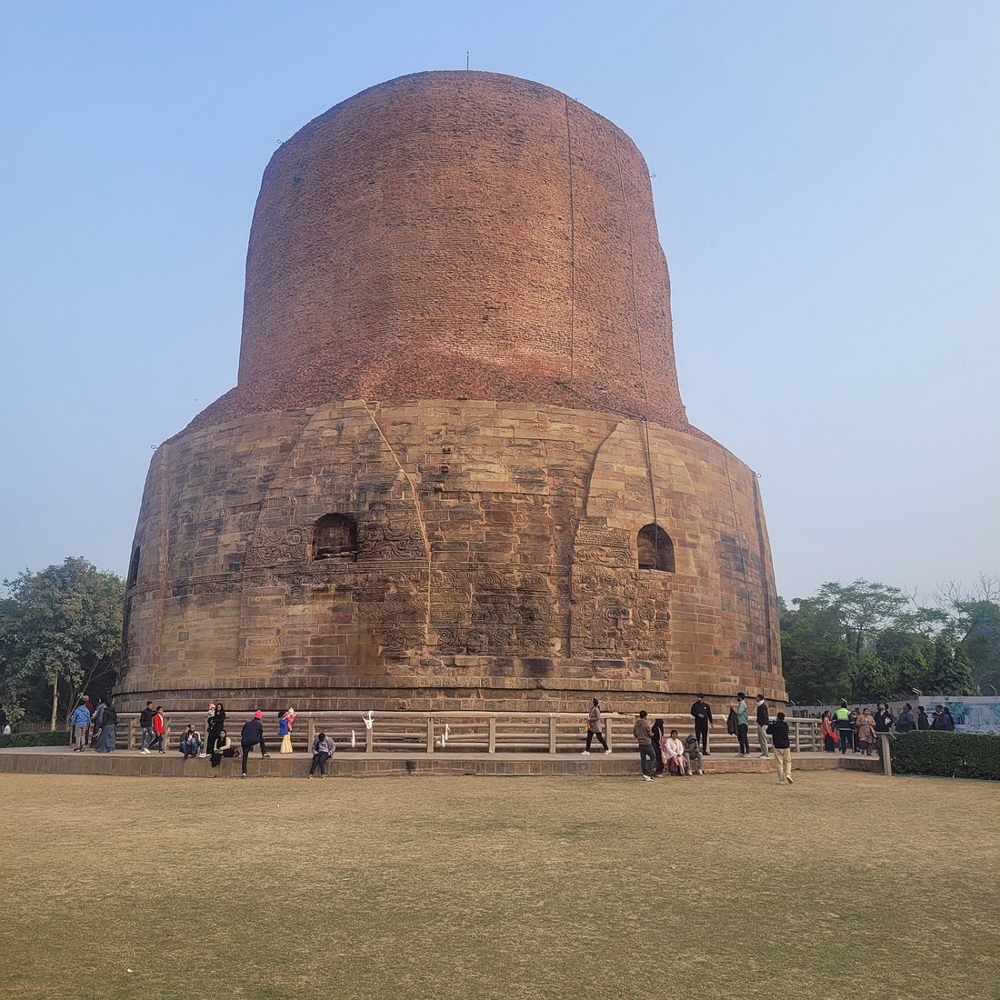
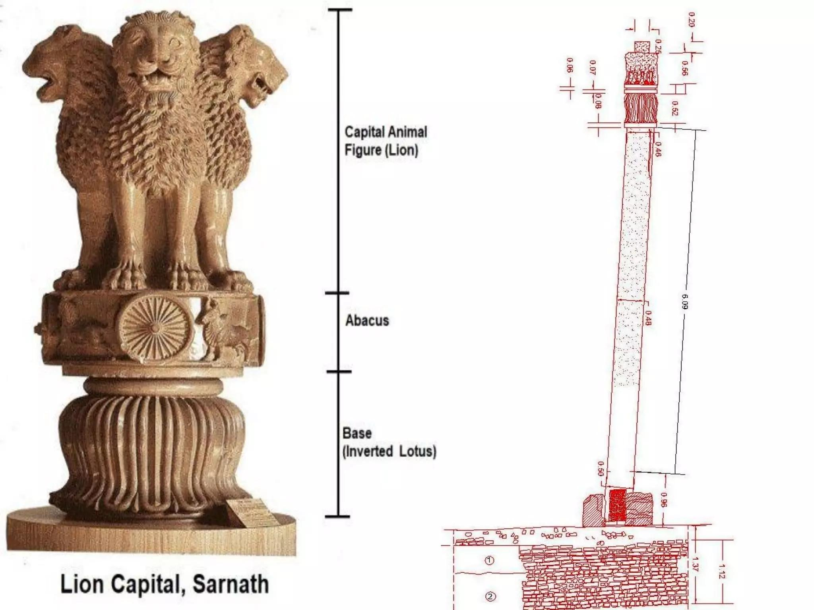
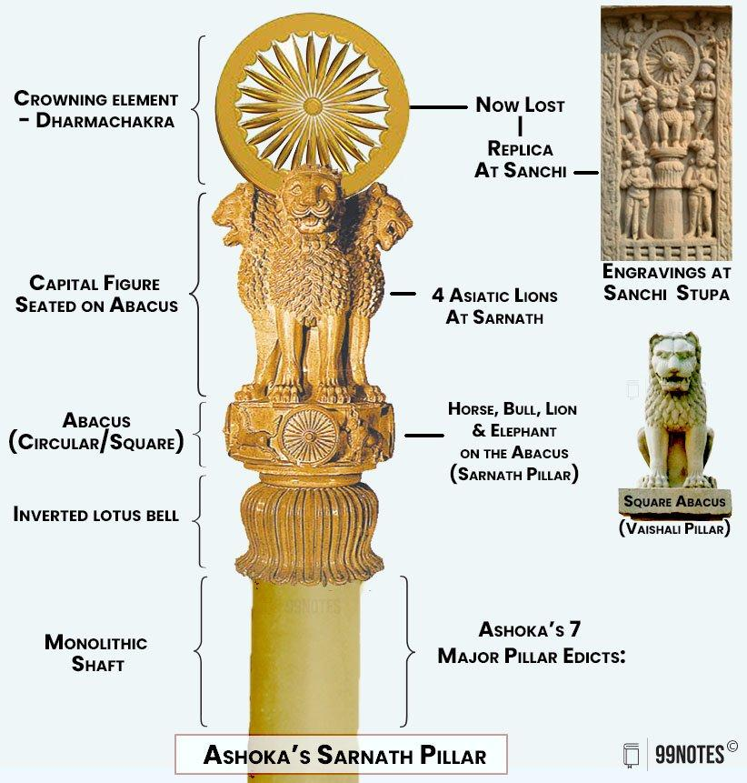
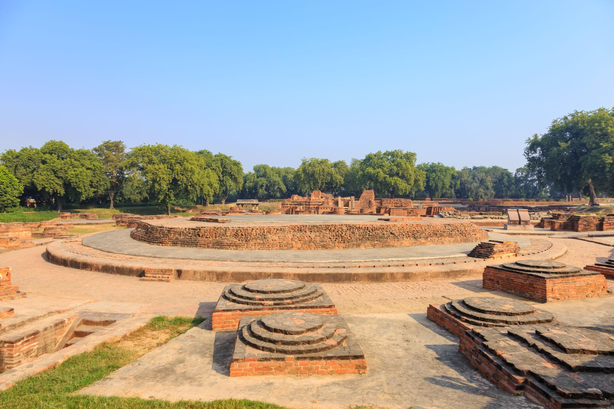

Chương II
# Thành lập Giáo Hội và khởi đầu Hoằng Pháp
*528 trước CN*

## NHỮNG BÀI THUYẾT PHÁP ÐẦU TIÊN

Theo truyền thống, đấng Giác Ngộ trẻ tuổi sống bảy ngày đầu tiên sau khi thành đạo dưới cội bồ-đề để hưởng "giải thoát lạc" (Mv1.1.1). Ta có thể nhận điều này đúng sự thực, vì nền tảng giáo lý đang cần bổ sung nhiều đặc điểm chi tiết, đồng thời một tâm trạng vừa hân hoan, vừa lưu luyến thân tình có lẽ đã giữ bậc Giác Ngộ ở nán lại địa điểm đầy ý nghĩa như vậy đối với ngài. Ta ít tin hơn vào câu nói rằng sau bảy ngày dưới cội bồ đề, ngài lại sống thêm bảy ngày nữa dưới một số gốc cây khác ở Uruvelà. Dưới gốc Ða Mục Tử (Ficus Indica) ngài giải thích cho một Bà-la-môn hỏi ngài về bản chất thực sự của đạo Bà-la-môn, giáo lý bao gồm trong một đời sống đạo đức thanh tịnh và tinh thông kinh Vệ-đà (Mv1.2).

Càng có vẻ huyền thoại hơn nữa là sự kiện được xem như đã xảy ra vào tuần thứ ba sau khi Giác Ngộ, dưới gốc cây mucalinda (Barringtonia acutangula). Theo Ðại Phẩm (Mv 1. 3), khi một cơn bão báo hiệu gió mùa nổi lên, con rắn hổ mang sống dưới gốc cây cuộn mình quấn quanh ngài và che ngài khỏi bị mưa bằng chiếc mào mở rộng. Nguồn gốc chuyện này có thể là con rắn ấy bị nước mưa tràn vào lỗ phải bò ra nằm sát trước vị Sa-môn này, nhưng không làm hại ngài.

Từ cây mucalinda đức Phật đi đến cây ràjàyatana (Buchanania latifolia) và cũng ở lại dưới gốc cây ấy một tuần. Chính tại đây, hai thương nhân Tapussa và Bhallika đang du hành từ Ukkalà (thuộc Orissa?) có lẽ đến Ràjagaha, cúng dường ngài cháo mạch và mật ong để "tạo thêm an lạc và phước đức". Ngài dùng thực phẩm cúng dường ấy và hai vị thương nhân kia "quy y bậc Giác Ngộ cùng Giáo Pháp của ngài" - Giáo Pháp mà lúc ấy ngài chưa tuyên bố - và như vậy đã trở thành các đệ tử tại gia đầu tiên của ngài (Mv. 1.4).

Tuần thứ năm sau khi Giác Ngộ, ngài lại đến ở một lần nữa dưới bóng mát cây Ða Mục Tử. Có thể do lời thỉnh cầu giáo hóa của Tapussa và Bhallika gợi ý, ngài suy xét xem có nên giữ giáo lý cho riêng ngài hay tuyên thuyết cho người đời vì "giáo lý ấy thật thâm áo, khó thấy, khó hiểu, dựa trên thực nghiệm, tuyệt diệu, không phải do lý luận, tế nhị, chỉ người có trí thấu triệt được mà thôi".

Kinh Ðiển Pàli (Mv1.5 và MN 26) ghi lại các mối hoài nghi này theo hình thức một cuộc đối thoại với Phạm Thiên Sahampati (Tự Tại Thiên, Ta-bà Chủ). Rõ ràng đức Phật muốn làm cho sự xung đột giữa các tư tưởng nội tâm ngài trở thành dễ hiểu, nên đã sử dụng hình ảnh vị Phạm Thiên lừng danh này để trình bày những tranh luận đối lập nhau khi ngài do dự thuyết Pháp. Dĩ nhiên, ngài cũng như đa số các người đương thời, vẫn tin có các thần linh (các vị này cũng phải chịu sanh tử luân hồi theo luật tự nhiên của mọi loài). Song việc chính ngài thấy rõ tận mắt vị Phạm Thiên ấy một cách linh động như các kinh điển tuyên bố, có lẽ do sự diễn giải của chư Tỳ-kheo về sau.

Trong cuộc "đối thoại" tiếp theo đây được rút gọn vào các điểm chính yếu, các lý luận thiên về đời sống an tịnh cá nhân đối lập với lý luận vị tha quên mình, và các lý luận sau đã thắng các lý luận trước.

Ðức Phật bảo: "Thế giới này thích thú dục lạc, song Giáo Pháp (Dhamma) của ta hướng đến viễn ly, ly tham, ái diệt. Giả sử ta thuyết giảng Giáo Pháp này, tức phải đi ngược dòng, và người đời không hiểu được ta, điều ấy sẽ gây nhọc lòng cho ta".

Phạm Thiên đáp: "Thế giới sẽ hủy diệt nếu đấng Toàn Giác không quyết định thuyết Pháp. Do vậy, cầu xin đức Thế Tôn hãy thuyết Pháp. Có những người ít nhiễm bụi trong mắt, nếu không được nghe Pháp, chúng sẽ sa đọa. Song nếu chúng nghe Pháp, chúng sẽ đạt giải thoát".

Lý luận của Phạm Thiên gợi lên lòng bi mẫn của đức Phật đối với chúng sanh và cùng với tiếng gọi lớn: "Các cửa Bất tử đều rộng mở cho những ai muốn nghe", ngài đồng ý thuyết Pháp. Vị Phạm Thiên hân hoan đảnh lễ đức Phật, đi vòng quanh ngài với thân hướng về phía hữu theo nghi thức Ấn Ðộ, rồi biến mất. Như thế các Thiên thần cũng biết cách giữ lễ độ đối với một bậc Giác Ngộ.

Khi đang suy xét xem ngài nên giảng Pháp đầu tiên cho người nào, đức Phật nghĩ ngay đến những vị có thời từng là Ðạo Sư của ngài: Àlàra Kàlàma và Uddaka Ràmaputta. Khi biết rằng cả hai đều từ trần, ngài liền nghĩ đến năm vị đồng tu khổ hạnh với ngài thuở trước, mà ngài biết bấy giờ chư vị đang trú tại Lộc Uyển (Vườn Nai) ở Isipatana (Chư Tiên Ðọa Xứ) gần Benares (Ba-la-nại) hay Vàrànasi. Ngài biết chư vị ấy sẽ nhanh chóng thông hiểu giáo lý. Trong niềm hân hoan chiến thắng vì đã có sẵn phương tiện độ sanh trong tay, cùng quyết định dâng trọn đời mình cho sứ mạng cao cả này, ngài khởi hành đến Benares. Nếu ta xét rằng ngài phải khất thực mỗi buổi sáng và cái nắng gắt buổi trưa thật bất tiện cho việc đi bộ, thì ta phỏng đoán ngài phải cần ít nhất là mười bốn ngày cho cuộc hành trình dài 210 km này (theo đường chim bay).

Khoảng giữa Uruvelà và Gayà, ngay sau khi ngài khởi hành, ngài gặp một du sĩ lõa thể tên Upaka nào đó thuộc phái Àjivika, là người chủ trương thuyết định mệnh cực đoan. Vẻ hân hoan nội tâm tỏa ra trên khuôn mặt sáng chói của ngài khiến vị này chú ý và hỏi ai là Ðạo Sư của ngài và Giáo Pháp ngài như thế nào. Ðức Phật đầy tự tin tuyên bố ngài đã được giải thoát nhờ ái diệt, ngài là vị thắng giả chiến trường, vì vậy ngài không có Ðạo Sư, mà chính ngài là bậc Ðạo Sư. Nghe điều này, Upaka cũng không cảm phục và nói: "Có thể là như vậy, thưa hiền giả" rồi lắc đầu rẽ vào một con đường khác bên cạnh. (Mv1.6; MN 26, MN 85). Các nhà kiết tập Kinh Tạng Pàli đã có thể dễ dàng cắt bỏ tiểu đoạn này vì nó làm hỏng phần nào hình ảnh của đức Phật. Song chư vị đã không làm như vậy chứng tỏ lòng tôn trọng sự thật lịch sử.

Còn các vị Kondañña, Bhaddiya, Vappa, Mahànàma và Assaji thật bất mãn khi thấy Sa-môn Gotama, người bạn đồng tu cũ trước kia đã rời bỏ chư vị, nay lại đi đến gần Vườn Nai ở Isipatana. Quả thật chư vị đã đồng lòng không chào hỏi cũng không đứng lên đảnh lễ ngài. Song khi ngài đến gần, chư vị đã bị chinh phục trước vẻ cao quý của một bậc giải thoát khiến chư vị đều cư xử với ngài vô cùng kính cẩn. Chư vị cầm lấy bình bát và thượng y của ngài, sửa soạn chỗ ngồi cho ngài, rửa chân ngài và xưng hô "Hiền giả" (Àvuso) với ngài theo thói quen. Song đức Phật bác bỏ cách xưng hô này:

"Này các Tỳ-kheo, đừng gọi Như Lai (Tathàgata: Bậc Ðến Như Vậy) là "Hiền giả" (như một trong các vị). Này các Tỳ-kheo, Như Lai là bậc A-la-hán, Chánh Ðẳng Giác".

Một bậc Giác Ngộ tượng trưng một hạng người độc nhất, trên thực tế vẫn có hình dáng bề ngoài như mọi người, cũng phải chịu biến hoại về thể chất (do kết quả của tiền nghiệp chưa tiêu trừ), song vị ấy không còn bị trói buộc vào vòng luân hồi sanh tử. Bao lâu ngài chưa đắc Niết-bàn vô dư y tối hậu (đại diệt độ), ngài vẫn sống như một bậc giải thoát ở đời, song nội tâm không còn tham luyến đời, buông xả đối với đời. Mọi kiết sử ràng buộc từ gia đình đến xã hội, đều bị ngài cắt đứt.

Lời tuyên bố đã khám phá con đường đưa đến Bất Tử tức con đường Giải thoát, đã Giác Ngộ Chân Lý và chứng đắc Pháp (Dhamma) của ngài lúc ấy được năm nhà tu khổ hạnh, bạn đồng tu cũ, đáp lại với vẻ hoài nghi. Chư vị hỏi, làm thế nào một người đã từ bỏ khổ hạnh để chọn đời sống sung túc lại có thể chứng đắc Chân Lý? Ðức Phật giải thích rằng ngài chẳng hề tham đắm đời sống sung túc, và để làm sáng tỏ mọi việc, ngài thuyết giảng một bài kinh (sutta) cho chư vị, bài kinh danh tiếng Chuyển Pháp Luân, khởi đầu sự nghiệp hoằng Pháp của ngài. Bài kinh trình bày Pháp (Dhamma) là Trung Ðạo, và nêu lên hệ thống Bốn Chân Lý: đó là một căn bản hợp lý chứa đựng đầy đủ các lời dạy tinh vi:

"Có hai cực đoan, này các Tỳ-kheo, mà người xuất gia không nên hành trì. Ðó là hai cực đoan nào? (Một mặt) đắm mình vào dục lạc, thấp kém, tầm thường, hạ liệt, không xứng đáng bậc Thánh, không ích lợi. (Mặt khác) chuyên tâm khổ hạnh ép xác, gây khổ đau, không xứng đáng bậc Thánh, và cũng không ích lợi.

Này các Tỳ-kheo, Như Lai đã tránh xa hai cực đoan này, và tìm ra Trung Ðạo chính là con đường khiến cho ta thấy và biết (tác thành nhãn và trí), con đường đưa đến an tịnh, thắng trí, Giác Ngộ, Niết-bàn.

* Này các Tỳ-kheo, đây là Thánh đế về Khổ (Dukkha): sanh là khổ, già là khổ, bệnh là khổ, chết là khổ, sầu, bi, khổ, ưu, não là khổ; thân cận những gì ta không thích là khổ, xa lìa những gì ta thích là khổ, cầu không được là khổ; tóm lại, ngũ thủ uẩn (tạo thành một cá nhân sống thực) là khổ.
* Này các Tỳ-kheo, đây là Thánh đế về Nguồn gốc của Khổ (Samudaya): Ðó chính là khát ái (tanhà) đưa đến tái sanh, câu hữu với hỷ và tham, tìm thấy lạc thú chỗ này chỗ kia: đó là Dục ái (Kàmatanhà), Hữu ái (bhavatanhà) và Phi hữu ái (Vibhavatanhà).
* Này các Tỳ-kheo, đây là Thánh đế về Khổ Diệt (Nirodha) chính là sự đoạn trừ, diệt tận hoàn toàn khát ái đó, quăng bỏ nó, chấm dứt nó, xả ly nó, không chấp thủ nó.
* Này các Tỳ-kheo, đây là Thánh đế về Con Ðường đưa đến Khổ Diệt (Magga). Ðó là Thánh Ðạo Tám Ngành tức là:

> Chánh Kiến (Sammà-Ditthi) Chánh Tư duy (Sammà-Sankappa) Chánh Ngữ (Sammà-Vàcà) Chánh Nghiệp (Sammà-Kammanta) Chánh Mạng (Sammà-Àjìva) Chánh Tinh tấn (Sammà-Vàyàma) Chánh Niệm (Sammà-Sati) Chánh Ðịnh (Sammà-Samàdhi)

(Mv1.6.17, 19, 22; [SN 56.11.5-8](/kinhtuongung/c-sujato-tmc-vi/snc-56-tuong-ung-su-that#chuong-ve-chuyen-phap-luan) )

Năm vị tôn giả hết sức chú tâm lắng nghe lời ngài, và ngay khi ngài thuyết giảng, tôn giả Kondañña đã quán triệt Giáo Pháp: "những gì chịu qui luật sinh khởi đều phải chịu qui luật hoại diệt". (Mv. 1. 6. 29) Sau đó, tôn giả liền xin đức Phật nhận làm đệ tử và đức Phật lấy phương ngôn: "Ðến đây, này Tỳ-kheo, Giáo Pháp đã được khéo giảng, hãy sống đời Phạm hạnh (thanh tịnh) để đoạn tận khổ đau" để nhận tôn giả làm một Tỳ-kheo (Bhikkhu) (Mv 1. 6 . 32). Như vậy tôn giả Kondañña là vị Tỳ-kheo đầu tiên trong lịch sử Phật giáo, và sự thọ giới của tôn giả đánh dấu khởi điểm của Tăng đoàn (Sangha) tồn tại cho đến ngày nay.

Trong các nước Châu Á theo đạo Phật, lễ "Chuyển Pháp Luân" được cử hành hằng năm vào ngày rằm tháng Àsàlhà (tháng 5-6) như vậy khoảng hai tháng âm lịch (56 ngày) được xem là đã trôi qua giữa thời đức Phật Thành Ðạo tháng Vesàkha và thời thuyết Pháp tại Isipatana.

Chẳng bao lâu lời dạy của đức Phật đã khiến cho tôn giả Vappa và Bhaddiya hiểu Pháp (Dhamma) và hai vị cũng được nhận làm Tỳ-kheo. Trong lúc chư Tỳ-kheo (nghĩa đen là Khất sĩ) Kondañña, Vappa và Bhaddiya đi khất thực để cung cấp thức ăn cho cả nhóm, bậc Ðạo Sư thuyết giảng riêng cho tôn giả Mahànàma và Assaji. Trong chốc lát, chư vị cũng đắc tri kiến cần thiết (của bậc Nhập lưu) và xin thọ giới (Mv1. 6.33-7). như vậy đã có sáu Tỳ-kheo trên thế gian - đức Phật và năm đệ tử của ngài.

Vài ngày sau lễ thọ giới của năm vị đệ tử, đức Phật dạy chư vị bài Pháp về Vô Ngã (Mv1.6.38-46; [SN 22.59](/kinhtuongung/c-sujato-tmc-vi/snc-22-tuong-ung-uan#sn-22-59-dac-tinh-vo-nga-anattalakkhanasutta) ). Ðiều đáng chú ý là bài Pháp này nêu lên một ý tưởng chưa hề được gợi lên vào thời Giác Ngộ hoặc thời Pháp ở Isipatana, và ý tưởng này thực sự gây kinh ngạc trong một hệ thống giáo lý hướng về tinh thần: phủ nhận sự hiện hữu của linh hồn. Ðiều này chứng tỏ đức Phật đã phát triển phương diện triết lý trong Pháp của ngài từ khi Thành Ðạo.

Kinh Vô Ngã Tướng bắt đầu từ sự thừa nhận rằng mỗi cá thể thực sự gồm có năm uẩn - chỉ có năm - (khandha) thành tố, tức là sắc, thọ, tưởng, hành (sankhàra) và thức. Vì ở Ấn Ðộ, bản ngã, linh hồn (atta hay àtman) luôn ám chỉ một cái gì thường hằng, vĩnh cửu tồn tại sau khi chết, còn ngũ uẩn thì không có gì thường hằng vĩnh cửu cho nên phải kết luận là không có uẩn nào chứa đựng một linh hồn cả. Trong ngũ uẩn kết hợp thành một cá nhân toàn vẹn có đời sống tâm lý hay tinh thần, song không có một linh hồn theo nghĩa một thực thể trường cửu: cá nhân là vô ngã (anatta), không có linh hồn.

Một lý luận thứ hai hỗ trợ lý luận đầu tiên. Tính chất biến đổi và hoại diệt của ngũ uẩn khiến chúng gây khổ đau (dukkha) và một vật gây khổ đau, (và không làm thỏa mãn) không thể là một linh hồn trường cửu.

Khi năm Tỳ-kheo nghe lời thuyết giảng này của đức Phật, tâm của chư vị thoát khỏi mọi lậu hoặc (àsava) đưa đến tái sanh, và do vậy, chư vị trở thành các bậc Thánh (A-la-hán) (Mv1.6.47). Tri kiến của chư vị về Giáo Pháp cứu khổ bấy giờ cũng trở thành mênh mông, sâu thẳm như tri kiến đức Phật, chỉ khác ngài ở điểm nguồn gốc tri kiến ấy mà thôi. Về phương diện giáo lý, một đức Phật được định nghĩa là vị tự tìm ra con đường giải thoát cho mình, trong khi một bậc A-la-hán được giải thoát nhờ nghe Pháp thuyết giảng. ([SN 22.58](/kinhtuongung/c-sujato-tmc-vi/snc-22-tuong-ung-uan#sn-22-58-bac-chanh-dang-chanh-giac-sammasambuddhasutta))

Sự đắc quả tương đối dễ dàng của năm vị đầu tiên cũng như nhiều vị Tỳ-kheo và cư sĩ về sau đã khiến cho nhiều người đọc Kinh Ðiển nghĩ rằng quần chúng thời đức Phật có sẵn căn cơ hướng đến tuệ giác nhiều hơn chúng ta thời nay. Ðiều này cũng có thể xảy ra, vì trong lịch sử thế giới có thể thấy nhiều thời kỳ tinh thần thăng tiến hay suy giảm.

Một lý do khác để giải thích sự kiện thường tuyên bố đắc quả A-la-hán là người Ấn Ðộ cổ đại vẫn có niềm tin chắc rằng nhận thức và chứng đắc là một: Bất cứ ai quán triệt Tứ Thánh Ðế và theo Thánh Ðế thứ hai, ai nhận thức chính tham ái (tanhà) là nguyên nhân tái sanh và đau khổ, liền đoạn tận tham ái nhờ tri kiến ấy và như vậy là trở thành một bậc A-la-hán. Ngày nay, chúng ta ít lạc quan hơn về hiệu năng của nhận thức ấy.

### SÀRNÀTH, ÐỊA ÐIỂM KHẢO CỔ

Sarnàth giống như một ốc đảo thanh bình nằm kế cận tiếng còi xe điện ồn ào và tiếng chuông xe kéo leng keng ở Benares. Thành phố tấp nập này của Ấn giáo chỉ cách 8km với cảnh yên tĩnh của Lộc Uyển (Migadàya) ở Isipatana, nay tên là Sàrnàth (Sanskrit: Sàranganàtha: Lộc Vương), song ở đây, phong cảnh trông thật khác hẳn - trật tự và trang nghiêm. Ðoạn cuối con đường nhựa được viền với những hàng cây xoài rậm rạp và cây me hùng vĩ. Khuôn viên có tường đá bao quanh được Ban Khảo Cổ Ấn Ðộ chăm sóc cẩn thận. Giữa các quần thể di tích là các sân cỏ điểm lấm tấm những chùm hoa giấy tím đỏ khắp nơi.

*Ðại Tháp Dhamekh*

Ngôi đền nổi bật nhất ở Sàrnàth là Ðại Tháp Dhamekh cao 44m, một tháp tròn, đường kính 27m dựng trên một bệ đá, xây bằng gạch với nhiều nơi có hình đá chạm trổ trang hoàng, khoảng giữa hẹp dần lên đến 2/3 đường kính đáy. Tất cả tháp này gồm nhiều mái che và hình thẳng mở rộng ra từ một tháp nhỏ bằng gạch và đất sét thời vua Asoka (thế kỷ thứ ba trước CN).

Nguồn gốc danh từ Dhamekh được tranh luận mãi cho đến khi khám phá ra một tấm bia ký bằng gạch nung của người mộ đạo mới ổn định vấn đề này. Chữ khắc trên bia ghi tên tháp là Dhamàka (Skt: dhammacakra), nghĩa là nó đánh dấu nơi đức Phật thuyết giảng cho năm Tỳ-kheo đầu tiên: Chuyển Pháp Luân (Pàli: Dhamma-cakka). Những người hành hương chiêm bái tháp này, cũng như mọi tháp khác đều được xây đặc bên trong, vì vậy không vào được, chỉ còn cách đi vòng quanh về phía hữu, một phong tục Ấn Ðộ bày tỏ lòng tôn kính các bậc cao trọng.

Vượt qua các di tích đền tháp cổ, khách hành hương đi từ Ðại Tháp Dhamekh đến ngôi đền chính ở Sàrnàth, có các tường gạch dày 2m, cao 5m. Nhận xét theo vẻ xây dựng kiên cố và lời tường thuật của Pháp sư Huyền Trang, ngôi cổ tháp hẳn đã cao chừng 60m. Di tích các bức tường bao quanh một vùng rộng 13m x 13m. Ðây là nền trong của chánh điện mà theo lời ngài Huyền Trang miêu tả vào thế kỷ thứ bảy, đã bài trí một tượng Phật bằng kim loại. Có lẽ ngôi đền xuất hiện khoảng thế kỷ thứ hai hay thế kỷ thứ ba (sau CN) ngay trên vị trí ngày xưa. Năm vị Tỳ-kheo dựng một am thất bằng lá dành cho bậc Ðạo Sư, nơi ấy ngài an cư mùa mưa năm 528 trước CN. Ðịa điểm này là nơi hành thiền thuận lợi đối với các khách chiêm bái từ Sri Lanka, Miến Ðiện, Thái Lan. Thường các sư Tây-Tạng mang y đỏ tía cũng đến đây hành lễ Pùja hoặc tưởng niệm bậc Ðạo Sư với 108 lần khấu đầu đảnh lễ và thắp đèn dầu cúng Phật.

Về phía tây chánh điện, du khách thấy một trụ đá thẳng ghi sắc dụ của Ðại đế Asoka (thế kỷ thứ ba trước CN). Trụ đá có đáy dày 70cm và phần trên dày 55cm, xưa cao 16m, nay đã vỡ thành nhiều mảnh vì hậu quả cuộc tàn phá Benares và Sàrnàth của tướng Qutb-ud-Din năm 1194. Phần đầu trụ đá này ở trong bảo tàng địa phương, là một cổ vật danh tiếng, có hình tượng bốn con sư tử điêu khắc tinh xảo ngồi đối lưng nhau, vì cũng như sư tử có tiếng rống lớn nhất giữa muôn loài, vang dậy tứ phương, đức Phật là bậc Ðạo Sư vang danh đệ nhất trong thời ngài và ngài hoằng Pháp khắp mọi hướng.

*Trụ đá Sarnath (mô hình) và phần đầu sư tử viện bảo tàng Sarnath.*

*Phần đầu sư tử viện bảo tàng Sarnath.*

Ðầu trụ đá hình sư tử ngày nay là quốc huy của Cộng hòa Ấn Ðộ, và bánh xe 24 nan hoa hiện diện bốn phía ở đế của đầu trụ đá - là biểu tượng của Phật Pháp và của nền cai trị công chính - ngày nay hiện diện trên quốc kỳ Ấn Ðộ.

Sắc dụ của hoàng đế ghi bằng chữ Bràhmì trên một phần trụ đá còn tồn tại thật ra không thích hợp với vẻ tôn nghiêm của thánh địa này. Sắc dụ ấy cảnh báo Tăng chúng và Ni chúng đề phòng sự chia rẽ Giáo hội cùng ra lệnh cho những kẻ gây bất hòa phải mặc bạch y thay vì hoàng y của Giáo hội và phải rời Giáo hội. Ðệ tử cư sĩ phải tuân giới luật vào các ngày trai giới (Bố-tát: Uposatha) tức các ngày mồng một, mồng tám (trăng non), ngày rằm trăng tròn và ngày hai mươi ba ở giữa nửa tháng sau (23).

Vì sắc dụ không đề cập các sự kiện thuyết pháp đầu tiên ở Isipatana, nên người ta đã kết luận rằng cột đá được mang đến Sarnàth từ một nơi nào đó. Nội dung sắc dụ phù hợp với việc thời xưa nó đã được đem đến từ Kosambì.

Cách phía nam ngôi đền và trụ đá Asoka độ vài mét, du khách thấy một nền cao hình tròn. Ðây là nền Bảo Tháp Dharmaràjika, xưa cao 30m với một lan can bằng đá. Bảo tháp này cũng do vua Asoka dựng lên, nay chỉ còn sót một vài lớp gạch. Phần kia đã bị Jagat Singh, đại thần của tiểu vương Chet Singh ở Benares phá hủy để lấy gạch năm 1794. Trong lúc triệt hạ ngôi tháp, họ tìm được một bình đá tròn ở khoảng 9m dưới đỉnh tháp, đựng một hộp thánh tích bằng cẩm thạch, hộp này giữ một phần tro xá-lợi Phật mà vua Asoka đã rước về từ nơi hỏa táng nguyên thủy đến Sàrnàth với mục đích là nơi đức Phật Sơ Chuyển Pháp Luân và thành lập Tăng đoàn cũng hưởng phần xá-lợi. Còn đại thần Jagat Singh lại giải quyết phần xá-lợi theo kiểu Ấn Ðộ giáo: Ông truyền lệnh làm lễ rải tro trên sông Hằng.

*Bảo Tháp Dharmaràjika*

Tuy nhiên việc phá hủy Bảo Tháp Dharma-ràjika và khám phá xá-lợi Phật cũng có mặt thuận lợi. Bản tường thuật về Bảo Tháp của Anh kiều tại địa phương này đã khiến công chúng quan tâm vùng Sàrnàth đưa đến việc điều tra di tích khảo cổ ở đây.

### PHÁT TRIỂN GIÁO HỘI

Từ Lộc Uyển ở Isipatana (Sàrnàth ngày nay), đức Phật ít thích đến viếng thành phố Benares. Ngoài khoảng cách chừng một giờ rưỡi đi bộ, còn phải băng qua sông Varunà, (nay là Barnà) và phải di chuyển bằng phà có trả tiền là thứ mà một khất sĩ không cất giữ! Nhất là dân Benares thường chống đối đám du sĩ hành khất nên khó kiếm được thực phẩm bố thí ở đó.

*khu di tích khảo cổ Sarnath (Lộc Uyển, Isipatana) ở bang Uttar Pradesh, Ấn Độ.*

Tuy nhiên, mối liên lạc với Benares đã được thiết lập sẵn dành cho đức Phật mà không cần ngài phải làm gì cả. Việc đó là do thanh niên Yasa (Da-xá), nam tử của một thương nhân hào phú, chủ tịch một nghiệp đoàn ở Benares, có lẽ là chủ ngân khố hoặc thương nhân tơ lụa bán sỉ. Yasa là một thanh niên được nuông chìu mọi mặt quá thỏa mãn với cuộc sống truy hoan đã làm cho nội tâm chàng trống rỗng. Kinh Ðiển Pàli (Mv1.7) nhắc đến ba ngôi nhà chàng ở theo từng mùa, đám nữ vũ công bao vây chàng, song chàng vẫn hờ hững dửng dưng, cùng đôi hài bằng vàng - có lẽ được thêu chỉ bằng vàng - mà chàng mang thuở đó.

Do vậy chàng Yasa chán ngán đời sống gia đình đầy xa hoa, với tâm trạng bất mãn, một sáng sớm kia đến viếng Vườn Nai ở Isipatana, đảnh lễ đức Phật và kính cẩn ngồi xuống cách ngài một khoảng. Ðức Phật nhận ra vẻ chán chường cuộc sống thế tục ở thanh niên này, bèn thuyết giảng cho chàng một bài Pháp "thuận thứ". Phương pháp này chứng tỏ tài năng giảng dạy của ngài, lần đầu tiên ngài ứng dụng với Yasa, gồm cách trình bày trước hết các vấn đề dễ hiểu như bố thí, trì giới, cõi Thiên và sự bất lợi của dục lạc.

Nếu người nghe có khả năng thọ giáo thêm, ngài sẽ tiếp tục thuyết giảng Tứ Thánh Ðế, đó là chân lý về khổ, khổ tập, khổ diệt và con đường chấm dứt khổ. Phương pháp sư phạm này chứng tỏ hiệu quả tức thời đối với Yasa. Chàng đắc "Pháp nhãn vô trần ly cấu" tức là thấy "bất cứ vật gì chịu quy luật sanh khởi đều phải chịu quy luật hoại diệt". (Mv1.7.6)

Trong lúc ấy, mẫu thân chàng Yasa đang lo âu về con trai bà nên xin chồng bà đi tìm con. Vì thế phụ thân chàng cũng đến Vườn Nai và hỏi đức Phật về con trai mình. Thay vì đáp thẳng, đức Phật bảo ông ngồi xuống, rồi cũng thuyết giảng "bài Pháp thuận thứ" của ngài vừa chứng tỏ thành công với chàng Yasa. Song vì phụ thân chàng Yasa quá lo âu nên không thể thọ giáo thêm nữa, ngài chỉ giảng cho ông nghe phần đầu dễ hiểu trong Giáo Pháp. Lập tức phụ thân chàng Yasa xin quy y Phật, Pháp, Tăng và xưng mình là cận sự nam cư sĩ (Upàsaka). Như vậy, sau Tapussa và Bhallika, ông là đệ tam cư sĩ tại gia của Giáo hội Phật giáo, mặc dù ông là người đầu tiên được giáo hóa với phương thức Tam Quy Phật, Pháp, Tăng vẫn còn tồn tại đến ngày nay.

Cuối cùng, thân phụ chàng Yasa mới nhận thấy con trai ông đang ngồi trong hội chúng vây quanh đức Phật, và ông van xin chàng trở lại nhà vì mẹ già đang ưu phiền về chàng. Song chàng Yasa nhìn đức Phật với vẻ khẩn cầu tha thiết khiến ngài bảo rằng một người đã khinh chê cuộc sống thế gian như Yasa không thể tiếp tục sống đời cũ nữa.

Thân phụ Yasa đành chấp nhận lý luận của ngài, song ông thỉnh Phật đến thọ thực ngày hôm sau có Yasa theo hầu. Ðức Phật im lặng nhận lời, đó là cách bày tỏ đồng ý thông thường trong đạo Phật - có lẽ đi kèm với một dấu hiệu chấp nhận vẫn thịnh hành đến nay, là vẽ hình số 8 nằm ngang với chiếc cằm.

Ngay sau khi phụ thân ra về, thanh niên Yasa xin thọ giới Tỳ-kheo. Ðức Phật nhận lời thỉnh cầu của chàng và chẳng bao lâu Tỳ-kheo Yasa đắc Thánh quả A-la-hán, "Giờ đây có bảy vị A-la-hán trên thế gian". (Mv1.7)

Mặc dù chuyện này mang tính khích lệ đạo đức, đó cũng là một truyền thuyết cảm động của thời ấy. Không những nó nêu rõ ước vọng tâm linh tha thiết xâm chiếm tâm hồn dân Ấn ở thế kỷ thứ sáu trước CN đã khiến cho vô số người rời bỏ nhà cửa trang trại để phiêu lưu trên đường đời khất sĩ vô định, nó còn cho ta thấy nỗi đau lòng mà cha mẹ, đôi khi cả vợ con nữa, phải chịu đựng trước cảnh chia ly với con, chồng, cha họ.

Buổi cơm cúng dường mà thân phụ chàng Yasa thỉnh mời đức Phật, Ðạo Sư của ông và chính cả con trai ông nữa, diễn ra sáng hôm sau. "Ðược tôn giả Tỳ-kheo Yasa theo hầu", bậc Ðạo Sư lên đường tiến về nhà song thân tôn giả , và được mẫu thân và "nguyên hiền phụ" của tôn giả nghênh tiếp. Sau khi hai bà này thọ giáo bài Pháp thuận thứ với đầy đủ chi tiết của đức Phật, hai bà liền quy y Tam bảo, như vậy đã trở thành các nữ đệ tử cư sĩ đầu tiên, các cận sự nữ (Upàsikà) của đức Phật. Kế đó, cùng với phụ thân tôn giả, hai bà phục vụ chư Tăng suốt buổi thọ thực (Mv1.8)

Việc tôn giả Yasa xuất gia đầu Phật đã gây nhiều tiếng vang lớn. Sự kiện một giáo lý hướng nội thúc giục một chàng thanh niên chán hưởng thụ rời bỏ đời sống đầy lạc thú để trở thành một Sa-môn khất sĩ là bằng cớ hùng hồn cho thân hữu chàng thấy giáo lý này hẳn phải phi thường xuất chúng, khiến thêm bốn người trong đám ấy cũng làm theo chàng: Vimala, Subàhu, Punnaji và Gavampati, tất cả cũng như tôn giả Yasa, đều là nam tử của các thương nhân thuộc giai cấp Vệ-xá, đã được nhận làm Tỳ-kheo theo lời tiến cử của tôn giả, và sau đó đều trở thành A-la-hán (Mv1.9)

Chẳng bao lâu sau, thêm 50 thân hữu của tôn giả từ các vùng lân cận Benares cũng gia nhập Giáo đoàn và đều đắc quả A-la-hán. Như vậy, chư vị A-la-hán đã lên đến số 61 người (Mv1.10)

-ooOoo-

