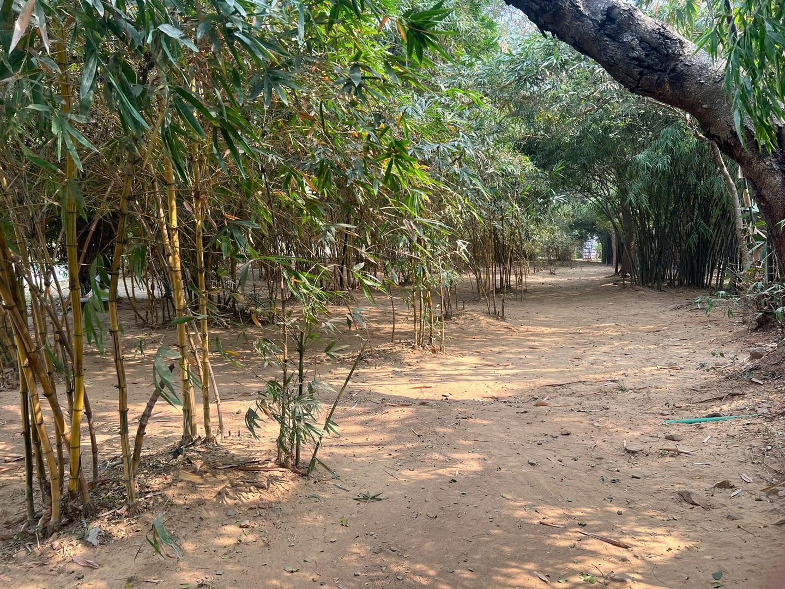
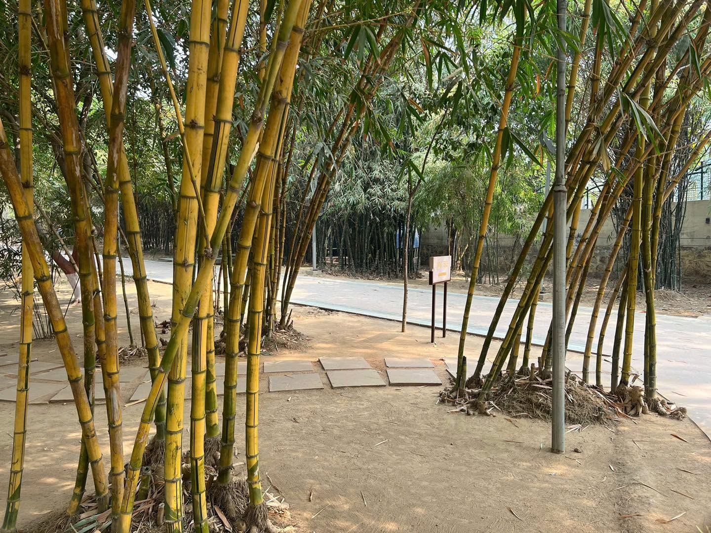

Chương III
# Hai mươi năm đầu tiên
*528 - 508 trước CN*

## CÔNG CUỘC GIÁO HÓA VUA BIMBISÀRA

Ðức Phật nhận thức rất rõ rằng thái độ của vua chúa đối với ngài sẽ đóng vai trò quan trọng quyết định trong việc truyền bá Ðạo Pháp của ngài. Vì thế ngài chọn Ràjagaha (Vương Xá), kinh đô vừa là hoàng cung của vua Bimbisàra nước Magadha, nơi ngài vừa đến, làm mục tiêu kế tiếp của cuộc du hành.

Có một số vấn đề quan trọng trong việc tiếp xúc. Ngài không chỉ suy xét lại cuộc gặp gỡ đầu tiên chưa nồng nhiệt mấy với nhà vua ngay khi ngài mới khởi hành cuộc tầm cầu chân lý (năm 536 trước CN), ngài còn quan tâm đến sự kiện vua Bimbisàra sẽ xem vị lãnh đạo một giáo phái như một người sáng lập một số quan điểm và vì vậy đó là một người có tiềm năng gây ảnh hưởng đến việc trị quốc mà nhà vua biết được sẽ có nhiều lợi ích về sau.

Ràjagaha cách Patna 70km về phía tây nam gần một thị trấn nhỏ hiện nay ở Ràjgir, xưa kia là kinh đô hùng mạnh nhất ở bắc Ấn sau Sàvatthi, kinh đô của nước Kosala. Tầm quan trọng của nó chỉ mới nổi bật lên vào thời đó chính là nhờ vua Bimbisàra đã mở rộng cổ thành Giribbaja (Ða Sơn) và nâng nó lên vị trí kinh đô Ràjagaha (Vương Xá).

Hai điều đã là yếu tố quyết định trong việc lựa chọn địa điểm này làm thủ đô nước Magadha dù vị trí ấy không thuận lợi về phương diện giao thông. Ở phía nam Ràjagaha có một quặng sắt được khai thác theo dạng oxýt sắt nhờ cách đào bới gần mặt đất, mà phần lớn được làm thành vũ khí và dụng cụ trong thủ đô. Còn về hướng đông nam cũng có một mỏ đồng. Tất cả sự phú cường của đất nước Magadha đều tùy thuộc vào các nguồn lợi khoáng sản này cùng các tiểu công nghiệp liên quan đến việc chế tạo chúng.

Yếu tố thứ hai là về mặt chiến lược. Thủ đô này nằm giữa hai dãy núi dài tạo thành một thung lũng hình chữ Z có khả năng bảo vệ vững mạnh. Giá trị phòng thủ của địa thế này càng được tăng cường nhờ một bức thành khổng lồ chạy dọc theo các rặng núi, đang được xây dựng vào thời ấy và khi hoàn tất, bức thành dài đến 40km. Trung tâm kinh đô Ràjagaha là cổ thành Giribbaja lại được thêm một cổ lũy bao bọc. Các rặng núi bao quanh chắn gió từ mọi phía thành, nên mùa hạ khí trời bên trong thung lũng vô cùng oi bức. Có bốn đường giao thông dẫn ra ngoại thành, mỗi đường thuở ban đầu được một cổng phòng vệ, cổng này đóng về ban đêm.

Vùng trung tâm thủ đô Ràjagaha không chiếm toàn bộ thung lũng, mà chỉ nằm trên thanh ngang của hình chữ Z ấy, đây là khu cổ thành Giribbaja, ở bên trong cổ lũy ấy. Ðây chính là hoàng cung vua Bimbisàra, và đây cũng là dinh cơ của giai cấp quý tộc võ tướng và đám thị dân giàu có cùng các tiệm tạp hóa và các xưởng rèn đúc của hoàng gia. Cung vua được xây trên các nền đá trần (các nền đá này đã được nhiều nhà khảo cổ phát hiện và trưng bày ngày nay), song chính tòa nhà lại được làm bằng gỗ.

Vùng thung lũng trải rộng giữa nội thành và ngoại thành gồm nhiều nhà bằng đất sét nằm rải rác giữa các đám ruộng lúa, vườn xoài, và đồng cỏ.

Ngay khi đức Phật và Tăng chúng của ngài, trong ấy có ba anh em tôn giả Kassapa cùng các vị khổ hạnh bện tóc trước kia là môn đồ chư vị, vừa đến Ràjagaha và nghỉ ngơi tại Latthivana (Trượng Lâm) ở phía tây nam kinh thành, vua Bimbisàra được trình tấu: "Sa-môn Gotama, nam tử của dòng Thích-ca" đã đến, liền lập tức khởi hành cùng đại chúng quần thần, Bà-la-môn, gia chủ, tùy tùng và vệ binh về phía khu rừng để chào mừng vị quốc khách. Ở cổ Ấn Ðộ, có phong tục là vua chúa cũng như thường dân thường đi tham kiến các bậc tu hành chứ không mời chư vị đến yết kiến. Bằng cách này vua chúa tỏ lòng kính trọng đối với chư vị đã giã từ thế tục và cố tránh xâm phạm tự do của chư vị ấy.

Ðám quần thần của nhà vua không biết chắc ai là Ðạo Sư của đoàn, Sa-môn Gotama hay Uruvela Kassapa, nên đức Phật đặt ra một cách vấn đáp với tôn giả Kassapa. Có lẽ cuộc đối thoại giữa hai vị đã được dự trù trước; song dẫu sao đi nữa, nó cũng gây ấn tượng mạnh đem lợi ích cho nhà vua và đã được đặt vào Kinh Tạng Pàli theo thể thi kệ:

Ðức Phật:

> Mới đây hiền giả Kassapa Thờ lửa tại rừng Ưu-tần-loa, Vì lý do gì từ bỏ lửa, Xin hiền giả nói rõ cho ta?

Tôn giả Kassapa:

> Phần thưởng được do các tế đàn Ðều là dục lạc với giai nhân, Thế gian pháp thấy nào thanh tịnh, Con bỏ lòng ham thích tế đàn.

Ðức Phật:

> Nếu tâm hiền giả chẳng còn ham Tìm thú vui trong lễ tế đàn, Giờ đây lạc thú tìm đâu tá Hiền giả nói ra thật rõ ràng.

Tôn giả Kassapa:

> Con đã đạt an lạc Niết-bàn, Không gì chấp thủ giữa trần gian, Mỗi người tự chứng trong tâm trí, Vì thế con nay bỏ tế đàn.

Sau khi nói xong những lời này, tôn giả Uruvelà Kassapa liền quỳ xuống đảnh lễ đức Phật và tuyên bố: "Ðức Thế Tôn là Ðạo Sư của con! Con là đệ tử của ngài! Ðức Thế Tôn là Ðạo Sư của con! Con là đệ tử của ngài!". (Mv 1.22.6)

Sự đảnh lễ quy ngưỡng của đại trưởng lão Kassapa đối với vị trí lãnh đạo tinh thần của Sa-môn Gotama ở thời điểm ấy vẫn chưa được nổi danh mấy hẳn đã gây nhiều ấn tượng mạnh đối với nhà vua. Âm hưởng của việc này càng tăng thêm vì tôn giả Kassapa đã công bố các lời ấy hai lần, làm cho chúng có hiệu lực của một lời tuyên thệ.

Ðức Phật nắm ngay cơ hội thuận lợi để giáo hóa vì giờ đây mọi sự chú ý đều đổ dồn về phía ngài. Ngài thuyết bài Pháp thuận thứ cho cả hội chúng, sau đó tất cả những người hiện diện gồm luôn nhà vua đều tự nguyện làm đệ tử tại gia của ngài (Mv 1. 22. 8).

Bản văn còn ghi lại một đoạn khác nữa nói riêng về việc giáo hóa nhà vua. Chuyện kể rằng, khi Seniya Bimbisàra, vua nước Magadha, đã thông hiểu Giáo Pháp, thể nhập Giáo Pháp và có lòng tin đối với Giáo Pháp, nhà vua liền nói với đức Phật Gotama:

"Trước làm một vương tử, đệ tử có năm điều nguyện ước nay tất cả đều thành tựu. Ðệ tử đã ước được lên làm vua, và được một bậc Chánh Ðẳng Giác đến viếng thăm trong chính quốc độ mình. Ðệ tử cũng nguyện cầu tự thân hành tiếp kiến bậc Chánh Ðẳng Giác với tất cả lòng tôn kính quy ngưỡng, rồi bậc Chánh Giác ấy sẽ thuyết Pháp cho đệ tử và đệ tử có thể thông hiểu Giáo Pháp. Nay tất cả mọi nguyện ước kia đều thành tựu. Ví như một người dựng lên một vật đã bị quăng ngã xuống hay chỉ đường cho kẻ đã lạc lối, hay đem đèn vào nơi tối tăm để những ai có mắt có thể trông thấy hình sắc mọi vật; cũng vậy, đức Thế Tôn đã thuyết giảng Chánh Pháp với nhiều phương tiện, ảnh dụ. Bạch Thế Tôn, nay đệ tử xin quy y Thế Tôn, quy y Pháp, quy y Tăng. Ước mong Thế Tôn nhận đệ tử làm cư sĩ tại gia từ nay cho đến trọn đời".

Sau đó nhà vua thỉnh cầu đức Phật cùng chúng Tăng thọ trai ngày hôm sau và bậc Ðạo Sư chứng tỏ ngài nhận lời bằng cách im lặng.

Sáng hôm sau, vua Bimbisàra tự thân phục vụ đức Phật và Tăng chúng - một vinh dự lớn lao hiếm khi được dành cho ai. Song nhà vua còn để dành một ngạc nhiên đầy kỳ thú hơn nữa: nhà vua tuyên bố cúng dường một tặng vật lên "Tăng chúng với đức Phật là bậc thượng thủ", đó là ngự viên Veluvana (Trúc Lâm), nằm ngay trước Bắc môn thành Ràjagaha, để bậc Ðạo Sư có thể an cư tại đó cũng gần kinh thành, nhưng lại ở trong một vùng yên tĩnh, dễ ra vào cho khách vãng lai, mà cũng tiện ẩn dật.

*Tinh xá Trúc Lâm, thuộc Ma-kiệt-đà, do vua Tần-bà-sa-la (Bimbisāra) hiến cúng cho Phật. Trong Kinh tạng Pāli, địa danh này thường gắn với khu Kalandakanivāpa (thường dịch: 'chỗ cho sóc ăn')*

Sự cúng dường được công bố có hiệu lực pháp lý theo nghi lễ thông thường: thí chủ đổ nước trên tay người nhận vào trong một bình bát (dĩ nhiên trong trường hợp này là bát vàng). Ðức Phật không phát biểu lời tạ ơn long trọng nào cả, vì việc này sẽ có giá trị ngang bằng việc cúng dường kia, như vậy sẽ tiêu hủy phước đức mà phần thí chủ đã nhận được cho mình. Thay vào đó, ngài bày tỏ niềm hoan hỷ bằng cách thuyết một bài Pháp cho vua Bimbisàra. (Mv 1.22.15-18)

Việc giáo hóa quốc vương Magadha có thể đã diễn ra vào tháng cuối năm 528 hay hai tháng đầu năm 527 trước CN. Niên đại sau có lẽ đúng hơn. Vua Bimbisàra trẻ hơn đức Phật năm tuổi và vào năm ba mươi mốt tuổi đã lên ngôi trị vì mười sáu năm rồi.

Thời ấy không có vấn đề vua Bimbisàra quy y Phật Pháp gây nên lòng ganh tỵ của những ngoại đạo sư. Ngày xưa cũng như nay, người Ấn đã giữ tinh thần khoan dung nhận làm tín đồ một trường phái mà vẫn không bài bác các trường phái khác. Không có một giáo lý Ấn Ðộ nào đòi hỏi địa vị độc tôn cả. Trước kia vẫn có tranh chấp giữa các giáo phái nhưng không có giao chiến và Phật Giáo cũng đặt nền tảng trên sự sống chung hòa bình. Nhiều lần chúng ta đã nghe cách đức Phật Gotama dạy các tân tín đồ tiếp tục cúng dường đạo sĩ các giáo phái mà chư vị ấy vừa rời bỏ. (Mv 6. 31. 10 f)

Có nhiều dấu hiệu và không kém phần quan trọng là lòng tín thành của nhà vua đối với đức Phật trong hàng chục năm cho đến ngày nhà vua bị mưu sát, chứng tỏ Ðại Vương Bimbisàra đã được cảm hóa sâu sắc nhờ Giáo Pháp đức Thích-ca. Tính cách kỳ diệu của đức Phật, niềm tin vững chắc do sự diện kiến ngài đem lại, dáng quý tộc và tài hùng biện của ngài cũng như bản chất trung dung trong các quan điểm của ngài được biểu lộ qua "Trung Ðạo", đức độ cao thượng và đặc biệt là sức hấp dẫn huyền bí của mục đích giải thoát ngài đề xướng _ tất cả những điều này đã làm nhà vua nồng nhiệt mộ đạo: nhà vua cảm nhận một sức thiêng liêng khiến cho con người tràn đầy hỷ lạc và bên trong nhà vua bừng lên một tia sáng nội tâm rọi vào cuộc sống. Ở độ tuổi ba mươi mốt, vua Bimbisàra vẫn còn đủ trẻ trung để được đạo Phật gây niềm hứng thú, tuy nhiên cũng đủ già dặn để không mất tự chủ hợp lý đối với nhiệt tình.

Tầm quan trọng của việc cảm hóa vua Bimbisàra đối với sự nghiệp hoằng Pháp thành công của đức Phật không cần phải phóng đại chút nào. Hàng ngàn thị dân Magadha noi gương nhà vua và công nhận Phật Pháp làm thầy dẫn đường. Một số người thời ấy có lẽ đã làm thế để được vua Bimbisàra ân sủng, nhưng phần lớn là vì tín thành mộ đạo. Thật vậy, giáo lý mới xuất hiện này đem lại điều mới lạ cho mọi người ở mọi giai cấp. Ðạo Pháp thu hút giới quý tộc võ tướng vì tính cách cao thượng và thích hợp với các phận sự phục vụ quốc gia; lại cũng thu hút giới Bà-la-môn vì tính cách hợp lý và minh bạch chính xác về nội dung tư tưởng triết học. Ðạo Pháp cũng gây ảnh hưởng mạnh đối với giai cấp thương nhân (Vệ-xá) bằng cách bài bác những tế lễ tốn kém trước kia vẫn được cho là nhằm đem lại tài lợi trong thương mãi, và cũng bằng sự cảm thông cách suy tư của giới kinh doanh nữa. Ðối với giai cấp thợ thuyền và vô loại cùng đinh, Ðạo Pháp hấp dẫn họ vì sự đánh giá thấp mọi đặc quyền ưu đãi về huyết thống của các giai cấp trên.

Mặc dù có phần phán xét tiêu cực về cuộc đời thế gian, đạo Phật vẫn được cảm nhận là một tín ngưỡng của hy vọng, trình bày rõ cho mọi người biết cách sử dụng quy luật Nghiệp Báo (Nhân Quả) để nỗ lực tiến lên trong cái tôn ti trật tự của xã hội và sau cùng sẽ đạt giải thoát. Nhờ việc cải hóa Ðại Vương Bimbisàra, đạo Phật đã được xã hội công nhận và trở thành đề tài bình luận trên cửa miệng mọi người. Con đường đã mở rộng dành cho đạo Phật truyền bá khắp nước Ấn.

## TÔN GIẢ SÀRIPUTTA VÀ MOGGALLÀNA TRỞ THÀNH CÁC ÐỆ TỬ

Dĩ nhiên đức Phật Gotama không phải là vị Ðạo Sư phi truyền thống duy nhất ở thành Ràjagaha. Một vị lãnh đạo giáo phái lừng danh khác ở kinh đô của vua Bimbisàra là Sañ jaya. Giữa đám môn đệ của vị này, tương truyền đã lên đến hai trăm năm mươi vị (Mv 1. 23.1), có hai vị cao đồ đặc biệt tài giỏi là đôi thân hữu [Sàriputta](/tags?tag=Sāriputta) (Xá-lợi-phất), và Moggallàna (Mục-kiền-liên).

Nhà tôn giả Sàriputta ở làng Nàlaka (nay là Sarichak) gần Ràjagaha, thuộc gia tộc Bà-la-môn Upatissa. Ngài có ba anh em trai Cunda, Upasena và Revata và ba chị em gái. Thân phụ ngài là Vanganta và thân mẫu là Rùpasàrì. Ngài được gọi theo tên mẹ, Sàriputta (Xá-lợi Tử).

Còn tôn giả Moggallàna thường được gọi là Kolita vì ngài sinh trưởng ở làng Kolitagàma (nay là Kul?) cạnh làng Nàlaka, lại đồng tuổi với tôn giả Sàriputta nên hai vị vẫn chơi chung với nhau từ thuở thơ ấu. Thân mẫu ngài là Moggallànì nên ngài được đặt tên theo mẹ, thuộc giai cấp Bà-la-môn, trong khi thân phụ ngài là lý trưởng làng Kolitagàma thuộc giai cấp võ tướng (Sát-đế-lỵ) vào thời ấy được xem là giới thượng lưu. Truyện kể rằng đôi bạn này đã quyết định đến dự đại lễ hội hằng năm trên đỉnh núi - có lẽ là một loại hội chợ - để trở thành các Sa-môn khất sĩ theo đạo sư Sañ jaya và sau đó hai vị liền thực hiện ngay việc này. Hai vị hứa hẹn rằng nếu ai trong hai vị đạt tuệ giác trước thì sẽ dạy cho người kia.

Chính trong thời gian làm đồ đệ của đạo sư Sañ jaya, tôn giả Sàriputta đi khất thực ở thành Ràjagaha, gặp gỡ Tỳ-kheo Assaji (Mã Thắng). Vị này trước kia từng là bạn đồng tu của đạo sĩ Gotama trong thời còn hành trì khổ hạnh và sau đó đã được thọ giới tại Vườn Nai ở Isipatana làm một trong năm vị Tỳ-kheo đầu tiên ở đời này. Tôn giả Sàriputta chú ý ngay dáng điệu cao quý và an tịnh của vị Tỳ-kheo lạ mặt này, nên tôn giả đợi cho đến khi Tỳ-kheo Assaji đi khất thực xong rồi mới thăm hỏi ai là bậc Ðạo Sư của vị ấy. Vị Tỳ-kheo đáp mình chính là môn đồ của vị Sa-môn thuộc bộ tộc Sakiya, và tôn giả Sàriputta lại hỏi về Giáo Pháp của bậc Ðạo Sư. Mặc dù đã đắc A-la-hán (theo Mv 1. 6. 47), Tỳ-kheo Assaji vẫn không thể trình bày đầy đủ Giáo Pháp. Tôn giả bảo mình mới thọ giới, chỉ vừa tuân hành Giáo Pháp đức Phật một thời gian ngắn, nhưng cũng có thể trình bày sơ lược nội dung. Rồi tôn giả phát biểu vần thi kệ lừng danh từ đấy về sau, đã được mọi tông phái Phật giáo công nhận làm giáo lý căn bản:

> Các pháp sinh ra tự một nhân,\
> Ðức Như Lai đã giảng nguồn căn,\ 
> Cách nào các pháp dần tiêu diệt,\ 
> Bậc Ðại Sa-môn cũng giải phân.(Mv 1.23.5)

Tôn giả Sàriputta, với tài trí thông minh phân tích và lý luận triết học vẫn thường được tán dương từ lâu nay, lập tức thấu hiểu ý nghĩa câu nói này: "Bất cứ vật gì chịu quy luật sinh khởi (ví dụ: con người hiện hữu với nỗi khổ đau) đều phải chịu quy luật đoạn diệt". Ðiều này có nghĩa là nếu không tạo nguyên nhân để tái sanh đời sau, thì người ấy có thể thăng tiến đến trạng thái đoạn diệt, tức Niết-bàn. Tâm bừng ngộ nhờ tuệ giác này, tôn giả vội vàng đi đến thân hữu Moggallàna để truyền cho bạn chân lý mới này (Mv 1. 23. 5-6).

Tôn giả Moggallàna, một thiền giả đặc biệt có tài năng, cũng quán triệt ý nghĩa tinh nhanh không kém bạn, nên tôn giả đề nghị cả hai nên đi ngay đến gặp đức Phật và xin làm đệ tử ngài. Tuy nhiên, tôn giả Sàriputta từ chối vì trước tiên hai vị phải cùng đi hỏi ý kiến đạo sư Sañ jaya và các Sa-môn đồng bạn. Thế rồi hai vị đều làm như dự định và các vị Sa-môn đồng tu liền tuyên bố sẵn sàng đi đến yết kiến đức Phật. Mặt khác, đạo sư Sañ jaya, cam kết là nếu hai vị ở lại đó, hai vị sẽ được phân quyền lãnh đạo giáo phái ấy.

Khi hai vị Sàriputta và Moggallàna từ chối lời đề nghị trên và ra đi cùng tất cả hai trăm năm mươi môn đệ đến Trúc Lâm Tinh xá thỉnh cầu đức Phật nhận vào Tăng đoàn, đạo sư Sañ jaya thất vọng đến độ hộc máu mồm. Trong thời gian này đôi thân hữu được đức Phật truyền giới Tỳ-kheo (Mv 1. 24) và chẳng bao lâu đều đắc quả A-la-hán: tôn giả Moggallàna chỉ trong một tuần và tôn giả Sàriputta vào tuần sau. Cả hai vị đều trở thành hai đại đệ tử của đức Phật Gotama, và vẫn giữ địa vị ấy suốt hơn bốn mươi năm.

Không lâu sau khi hai tôn giả này trở thành Tỳ-kheo trong Tăng chúng, đức Phật tiếp một người khách từ quê nhà Kapilavatthu. Ðây là tôn giả Kàludàyin, tức Hắc Nhân Udàyin (Ưu-đà-di), như vẫn thường được gọi vì màu da đen của vị ấy. Tôn giả là bạn từ thời thanh niên của đức Phật, được quốc vương Suddhodana phái đi tìm vương tử của ngài và thuyết phục đức Phật về thăm kinh thành Kapilavatthu.

Kàludàyin thi hành sứ mạng với tài khéo léo đặc biệt. Tôn giả gia nhập Tăng chúng và do vậy dễ tiếp cận đức Phật bất cứ lúc nào. Sau đó dùng nhiều lời lẽ miêu tả linh động, tôn giả cố gợi lên trong lòng đức Phật nỗi nhớ quê hương của bộ tộc Thích-ca. Bằng một giọng nói nồng nhiệt chứa chan tình cảm, tôn giả minh họa vẻ diễm lệ của ngàn cây đang rộ nở hoa, như một kẻ lữ hành dừng lại bên vệ đường ngắm cảnh sắc của vạn vật:

> Bạch Thế Tôn, nay hàng cây lấp lánh Ðỏ thắm và tàng cổ thụ buông thòng Ði tìm trái, còn hoa đỏ bao chòm Treo lủng lẳng, màu máu đào rực rỡ. Ðây là lúc xin Thế Tôn về đó Vì muôn hoa rộ nở khiến tâm hoan. Khắp cả vùng hương ngát tuyệt trần gian, Hoa rụng cánh báo tin lành kết trái, Nay đúng thời xin Thế Tôn trở lại, Mùa này ôi bao hỷ lạc ngập tràn: Khí trời không nắng gắt, chẳng đông hàn. Tộc Thích-ca, Câu-ly cùng chiêm bái Khi Thế Tôn hướng về tây đi tới Vượt qua dòng sông biếc Lỗ - hi - ni. [Thag 527-9](/kinhtieubo/thichminhchau/kn-046-tap-8-chuong-10-pham-muoi-ke)

Quả thật đức Phật đã đồng ý để cho tôn giả thuyết phục. Ngài hứa với tôn giả rằng ngài sẽ viếng kinh thành Kapilavatthu, không phải ngay lúc ấy, mà sau mùa mưa kế đó là thời gian ngài đã dự định an cư tại Ràjagaha. Tôn giả Kàludàyin vô cùng hoan hỉ, vội vàng trở về Kapilavatthu mang tin lành trình Quốc vương Suddhodana. Có lẽ tôn giả cũng dùng ngôn từ văn hoa bóng bẩy miêu tả mọi việc, vì tôn giả vốn là người tinh thông nghệ thuật tán tụng, điều này được chứng tỏ qua các vần thơ trong Trưởng Lão Tăng Kệ [Thag 533-5](/kinhtieubo/thichminhchau/kn-046-tap-8-chuong-10-pham-muoi-ke), khi tôn giả ca ngợi Quốc vương Suddhodana là thân phụ của đức Phật Thế Tôn, và làm vinh danh cả cố mẫu thân của ngài nữa:

> Bậc anh hùng quả là người đại tuệ Làm bảy đời gia hệ được vinh quang, Thích-ca, ngài là Thiên Chủ trần gian Vì sinh được bậc Thánh hiền đích thật. Tịnh Phạn Vương, phụ thân ngài Ðại Giác, Mẫu thân ngài là chánh hậu Ma-gia Dưỡng thai nhi, Bồ-tát, trọn tâm bà. Lúc thân hoại tái sanh trời Ðâu-suất, Ðức bà hưởng tràn đầy năm Thiên lạc Ðược từng đoàn thiên nữ đứng vây quanh.

## MÙA MƯA TẠI RÀJAGAHA

Theo dự định, đức Phật an cư mùa mưa 527 trước CN tại Ràjagaha (Vương Xá) đồng thời các thảo am dành cho Tăng chúng đã được dựng lên ở Trúc Lâm, đó là bước đầu của một tinh xá. Ðây là mùa mưa thứ hai kể từ khi ngài bắt đầu truyền bá Giáo Pháp và không phải là không gặp vấn đề rắc rối. Sự phát triển Tăng đoàn ngày càng đông gây nên nhiều khó khăn bất ngờ cho bậc giáo chủ.

Việc tập hợp quá nhiều Sa-môn khất sĩ du hành quanh nội thành Ràjagaha mỗi buổi sáng sớm và đứng yên lặng trước cửa nhà dân chúng với những bình bát lớn - chứ không phải chỉ là chén nhỏ - chờ đợi thực phẩm của thí chủ đưa đến kết quả là nhiều người trong số khoảng 60.000 thị dân trở thành chán ngán về cảnh tượng Sa-môn khất thực và xem các "khất sĩ đầu trọc" là mối phiền nhiễu quấy rầy họ, dù chư vị ấy thuộc giáo phái nào đi nữa.

Ngoài ra, lại còn có hậu quả tiêu cực về mặt xã hội của việc du hành khất thực. Nhiều người trước kia đã kiếm nghề nghiệp và sống đời bình thường với vợ con bỗng nhiên nay đâm ra thích đời Sa-môn, gia nhập Giáo đoàn để mặc gia đình bơ vơ túng thiếu. Dân chúng kêu ca: "Sa-môn Gotama đang sống bằng cách làm cho người ta tuyệt tự, vợ góa con côi, gia đình ly tán. Vị này đã cải hóa cả ngàn đạo sĩ khổ hạnh bện tóc và hai trăm năm mươi đồ đệ của đạo sư Sañ jaya, thậm chí các thiện gia nam tử cao sang đệ nhất trong nước Magadha cũng theo đời Phạm hạnh dưới sự hướng dẫn của Sa-môn này".

Vì thế các Tỳ-kheo thường bị trêu ghẹo, nhất là bởi đám trẻ con học lóm được mấy câu thơ từ người lớn:

> Ngài đến từ Ða Sơn Bậc Ðạo Sư trên đường Dẫn theo đoàn khất sĩ Của Sañ -jay đạo nhơn, Sẽ còn ai thọ giới Quy phục lực Sa-môn?

Ðức Phật nghe được câu thơ phỉ báng này từ các Tỳ-kheo nhưng ngài không hề bận lòng nao núng. Ngài bảo lời ong tiếng ve không kéo dài lâu được, nhưng ngài là một nhà thao lược đại tài, tinh thông bản chất con người, ngài liền tìm biện pháp đối phó. Ngài đáp lại bằng một vần thi kệ được chư Tỳ-kheo nhanh chóng truyền ra ngoài đời rất hữu hiệu:

> Các bậc đại anh hùng, Ðấng hiển lộ Thật Chân, Chỉ đường theo Chánh Pháp, Chân thật quả vô cùng. Lẽ nào ai ganh tỵ Các khất sĩ hiền nhân Dẫn đưa người tiến bước Bằng Giáo Pháp Như Chân?

Ðúng như bậc Ðạo Sư đã tiên đoán, sau vài ngày lời chỉ trích không còn nữa (Mv 1. 24. 5-7). Có thể chính vua Bimbisàra cũng đã dùng vài biện pháp ngăn chận sự bất mãn của công chúng đối với các Sa-môn khoát y vàng.

Song song với những nỗ lực làm cho quần chúng tôn trọng Tăng đoàn là những nỗ lực của đức Phật hướng về nội bộ để rèn luyện các Tỳ-kheo giữ đúng giới luật. Rõ ràng là qua việc giáo hóa tập thể đạo sĩ khổ hạnh bện tóc của ba tôn giả Kassapa và các môn đồ của đạo sĩ Sañ jaya, một số người gia nhập Tăng chúng thiếu trình độ giáo dục sơ đẳng, với tư cách xử sự khiếm nhã và đòi hỏi khất thực thô bạo đã vi phạm giới luật gây niềm bất mãn. Bậc Ðạo Sư đưa ra một loạt huấn thị để dạy chư vị ấy biết giữ phép xã giao nhã nhặn. Ngài truyền chư Tỳ-kheo phải đắp y đúng luật Sa-môn, cư xử khiêm tốn trước các thí chủ và thọ thực trong im lặng (Mv 1. 25. 5).

Những trường hợp bất kính đối với các vị thầy giáo huấn lớp tân Tỳ-kheo cũng khiến ngài ban hành các giới luật về vấn đề này nữa. Ngài truyền lệnh các Tỳ-kheo phải vâng lời dạy của vị giáo thọ (Mv 1. 25. 8), phải chăm sóc y phục của thầy giáo (Mv 1. 25. 10 + 23), phải rửa sạch bình bát (Mv 1. 25. 11) và lau chùi sàng tọa của thầy nữa (Mv 1. 25. 19).

Như chúng ta biết được qua phần duyên khởi của nhiều kinh, đức Phật cũng muốn được đệ tử phục vụ ngài như vậy. Hầu như lúc nào ngài cũng được một thị giả (upatthàka) theo hầu cận, phận sự của vị này là, ngoài mọi việc khác, còn phải quạt hầu bậc Ðạo Sư trong lúc ngài thuyết Pháp dưới trời nóng nực (MN 12. 1). Nếu không có Tỳ-kheo trẻ nào hiện diện thì các đại đệ tử xuất chúng như tôn giả Sàriputta cũng không ngần ngại làm việc này. Các thị giả hầu cận vẫn thường thay đổi luôn cho đến năm thứ hai mươi trong quãng đời hoằng Pháp của đức Phật, tôn giả Ànanda, em họ ngài, mới giữ chức vụ này và tận tụy hết lòng hầu hạ bậc Ðạo Sư cho đến lúc ngài mệnh chung.

## ÐỨC PHẬT VỀ THĂM QUÊ HƯƠNG

Giữ đúng lời hứa với tôn giả Kàludàyin, đức Phật khởi hành trở về Kapilavatthu ngay khi mùa mưa gió chấm dứt. Ngài không du hành một mình: tôn giả Sàriputta và một số Tỳ-kheo khác theo hầu ngài. Lộ trình dài 60 do-tuần. Một do-tuần (yojana): là một đoạn đường mà một con bò kéo cày có thể đi được, độ chừng 10 km. Ðức Phật Gotama phải dành sáu mươi ngày để đi khoảng đường 600 km giữa Ràjagaha và Kapilavatthu. Sau khi đi được một phần tư lộ trình lên phía tây bắc, ngài phải vượt qua sông Hằng.

Ngày nay ta có thể tìm ra vài khái niệm về các cuộc hành trình ấy như thế nào nếu ta nghĩ đến những cuộc trường chinh do nhà lãnh tụ vĩ đại Gàndhi và Vinobha Bhàve thực hiện. Theo lệ thường bậc Ðạo Sư cứ tiếp tục độc hành hoặc thỉnh thoảng đàm đạo với một vài đệ tử. Cách ngài năm bảy bước phía trước là một số môn đồ trung kiên tiên phong mở đường và bảo vệ ngài khỏi bị đám người bàng quan quấy nhiễu, và phía sau ngài là đám Tỳ-kheo còn lại, một số với dáng điệu chuyên chú giữ chánh niệm và tâm thiền định, một số khác mệt mỏi bèn rút lui bỏ cuộc. Chỉ có ba dấu hiệu bên ngoài phân biệt đức Phật với bậc Ðại Hiền Trí (Mahàtma: danh hiệu của Gàndhi) và Vinobha: y phục của ngài không phải màu trắng mà là màu vàng nâu pha đất sét đỏ (kàsàya), ngài đi chân trần và không chống gậy. Ở cổ Ấn Ðộ, gậy được xem là khí giới nên đức Phật không dùng chúng.

Các diễn biến tiếp theo sau thời gian ngài đến thành Kapilavatthu chỉ được ghi lại từng đoạn rời rạc trong Kinh Tạng Pàli theo thứ tự niên đại và nhiều chỗ thiếu đồng nhất, tuy thế, chúng ta cũng có thể hình dung được những chuyện đã xảy ra.

Theo phong tục, đức Phật nay đã là một Sa-môn khất sĩ nên không thể đến viếng Quốc Vương Suddhodana nếu chưa được thỉnh cầu. Ngài liền tạm trú tại Nigrodhàràma (Ni-câu-luật Viên: Rừng Cây Ða), một nơi ở phía trước kinh thành thường được các Sa-môn khổ hạnh vãng lai, vốn có nhiều gốc đa cổ thụ (nigrodha: Ficus Bengalensis) với những chòm rễ dài lủng lẳng trên không tạo thành một khu rừng nhiều cây cao bóng mát đón mời du khách. Ngay lúc ấy quốc vương chưa được tâu trình việc hoàng tử của ngài vừa đến nơi. Chỉ vừa tảng sáng hôm sau, khi dân chúng đã thấy vị thái tử Siddattha trước kia mang bình bát đi khất thực trên các đường phố trong kinh thành, Quốc Vương Tịnh Phạn mới được cấp báo việc này.

Cuộc nói chuyện đầu tiên giữa hai cha con không diễn ra êm thắm mấy. Vua Suddhodana khiển trách con mình đã tự làm mất danh giá khi đi khất thực trong quê hương mình trước mắt mọi người. Vương tử Siddhattha nay đã là bậc Giác Ngộ, lại bị quở mắng như một trẻ thơ, liền tự biện hộ bằng cách bảo rằng truyền thống Sa-môn là sống nhờ khất thực và chư Phật quá khứ cũng đã làm như vậy. Phần Bhaddakaccànà tức Yasodharà, bà vợ trước kia của đức Phật, người đã sống đời "sương phụ của Tỳ-kheo" suốt tám năm ròng, vẫn còn đau xót về việc này nên tìm cách bày tỏ nỗi hờn giận của bà. Khi đức Phật đến thăm hoàng cung của vua cha lần thứ hai, bà truyền đưa con trai của hai vị là Ràhula (La-hầu-la) bấy giờ đã lên tám, đến và dặn: "Này Ràhula, ngài là cha của con đấy. Con hãy đến xin ngài cho con phần tài sản của con". Cậu bé Ràhula làm theo lời mẹ dạy. Cậu đến cung kính đảnh lễ đức Phật và đợi cho đến khi ngài rời cung. Rồi cậu đi theo ngài và thưa: "Bạch Sa-môn, xin cho con phần tài sản của con". Phản ứng của đức Phật vừa uy nghiêm cao thượng vừa công hiệu biết bao. Ngài ra lệnh cho tôn giả Sàriputta nhận cậu bé làm Sa-di ngay lập tức tại chỗ. Như vậy tôn giả Sàriputta trở thành vị giáo thọ của vương tôn Ràhula.

Quốc Vương Suddhodana không thể nào nguôi lòng khi nghe tin nay vương tôn của ngài cũng đã bị đưa ra khỏi gia đình, vội van xin bậc Ðạo Sư đừng bao giờ truyền cho ai giới xuất gia làm Sa-di (pabbajà) mà không được cha mẹ chấp thuận. Ví thử lúc ấy quốc vương hy vọng đức Phật sẽ hủy bỏ giới Sa-di của vương tôn Ràhula thì ngài chuốc lấy thất vọng mà thôi. Bậc Ðạo Sư chỉ hứa làm theo lời thỉnh cầu ấy trong các trường hợp về sau! (Mv 1. 54)

Mặc dù Kinh Ðiển nỗ lực trình bày cuộc viếng thăm thành Kapilavatthu lần đầu của đức Phật như một chuyến hoằng Pháp thành công, rõ ràng sự thành công ấy cũng là hạn hẹp. Chỉ một số ít người tin theo Giáo Pháp ngài. Dân chúng thành Kapilavatthu vẫn còn ghi trong trí những hình ảnh quá sinh động của vị vương tử được nuông chiều thuở trước nên không thể nào tin tưởng vào vị trí của đức Phật, một bậc "Giác Ngộ" ngày nay. Họ lại cần có một sự thận trọng về chính trị đối ngoại nữa. Lúc ấy họ vẫn chưa biết chắc Ðại Vương Pasenadi nước Kosala ngự tại thành Sàvatthi vừa là chúa tể tối cao của cộng hòa Sakiya, sẽ nhìn giáo phái mới này ra sao.

Một vị trong dòng Sakiya được thọ giới Tỳ-kheo có lẽ còn trước cả việc vương tôn Ràhula thọ Sa-di giới, là Nanda Gotama (Nan-đà), em khác mẹ của thái tử Siddhattha, tức con trai vua Suddhodana và bà kế mẫu Mahàpajàpatì. Theo Kinh Ðiển, thái tử đã thuyết phục hoàng đệ Nanda trở thành Tỳ-kheo và vị này miễn cưỡng nhận lời do lòng kính trọng vị hoàng huynh chỉ lớn hơn mình chừng vài ngày!

Hiển nhiên (theo Jataka 182) vương tử Nanda, ít ra là thời gian đầu, không hoàn toàn phù hợp với đời khất sĩ. Có lẽ để đối trị với những mối hoài nghi do các vị đồng Phạm hạnh thường bày tỏ về quyết tâm sống đời độc cư của tôn giả Nanda, nên khi đức Phật đã ca ngợi các đức tính của tôn giả, nhưng lại theo một phương thức ngoại giao khéo léo là trong lúc vừa tán thán, ngài vừa vạch ra một đường lối tu tập cho tôn giả Nanda: như phòng hộ các căn (giác quan), tiết độ trong ẩm thực, chú tâm cảnh giác đối với thân tâm và từ bỏ mọi xúc động trong tâm tư tình cảm (A.N 8.9). Sự giáo giới ấy thật cần thiết vì tôn giả Nanda có diện mạo khôi ngô tuấn tú, lại thường mang nặng những mơ tưởng ái tình và còn toan tính chuyện cởi bỏ y vàng rồi hoàn tục nữa. Mãi đến khi bậc Ðạo Sư chỉ rõ cho tôn giả thấy dung sắc xoàng xĩnh của cô vợ cũ yêu quý là Janapadakalyànì, tôn giả mới bắt đầu nghiêm chỉnh tu tập bản thân theo luật Sa-môn. Ngay cả vị này về sau cũng đắc quả A-la-hán. (Ud 3.2)

Ðức Phật còn truyền giới thêm bảy vị Thích-ca nữa, không phải ở quê nhà Kapilavatthu mà ở Anupiyà, một nơi trong cộng hòa Malla, đất nước ngài ghé ngang qua trên đường về từ Kapilavatthu. Bảy vị này trước kia đã rời kinh đô của bộ tộc Thích-ca để trở thành nhóm Sa-môn khất sĩ sống riêng lẻ. Nhưng khi chư vị gặp đức Phật ở Anupiyà, chư vị cảm thấy chấp nhận sự hướng dẫn của ngài thì hợp lý hơn là tự mình đi tìm chân lý cho mình.

Người đầu tiên trong nhóm này được đức Phật thu nhận là Upàli (Ưu-ba-li), trước đây làm nghề cắt tóc (Cv.7.1.1-4), một người tầm thường ở địa vị thấp kém mà không ai ngờ lại có thể trở thành một chuyên gia xuất sắc về giới luật và qui tắc xử sự trong Tăng chúng. Hai vị nữa là Anuruddha (A-na-luật) và Ànanda (A-nan), em họ của đức Phật, các nam tử cùng cha khác mẹ của hoàng thân Amitodana, em trai phụ vương ngài. Cả hai vị đều nổi tiếng về lòng tận tụy trung thành đặc biệt đối với đức Phật. Các vị còn lại là Bhagu (Bạt-cù), Kimbila (Kim-tỳ-la) và Devadatta (Ðề-bà-đạt-đa). Vị sau cùng cũng là em họ của đức Phật, hoàng tử của vua Suppabuddha (Thiện Giác), em trai mẫu hậu ngài và là anh của công chúa Bhaddakaccànà tức bà vợ cũ của ngài.

Nhân vật danh tiếng nhất trong bảy vị này là Bhaddiya, con trai của bà Kàligodhà, "Hắc nữ Godhà", vị nữ tộc trưởng của các phu nhân dòng Thích-ca giữ địa vị quả phụ thừa kế. Có lẽ bà là quả phụ của một quốc vương đã một thời cai trị cộng hòa Sakiya trước vua Suddhodana, hoặc làm vị nhiếp chính của ngài. Ðiều này giải thích lý do tôn giả Bhaddhiya được miêu tả là quốc vương cai trị dòng Thích-ca (Cv 7.1.3) do nhầm lẫn với thân phụ tôn giả.

Từ Anupiyà, chuyện kể rằng cuộc hành trình tiếp tục đến Kosambì, thủ đô nước Vamsà (Cv 7.2.1), nơi đó bậc Ðạo Sư cùng chư vị hộ tống cư trú tại vườn của triệu phú thương Ghosita (Cù-sư-la). Khu vườn này mở rộng đón các du sĩ của mọi tông phái. Một thời gian sau, vị này cung tặng ngài khu vườn ấy, vào dịp đến thành Sàvatthi để buôn bán cùng nghe đức Phật thuyết Pháp và trở thành đệ tử ngài.

-ooOoo-

