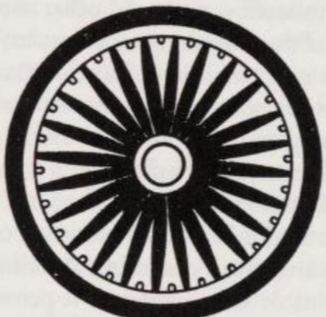

# Lời tựa

*Biểu tượng bánh xe của bậc minh quân (Chuyển luân thánh vương - cakkavattin). Bánh xe có 24 nan hoa này thuộc về đầu cột hình sư tử của trụ đá do Hoàng đế Asoka (A-dục) dựng tại Sārnāth (Lộc Uyển) vào thế kỷ thứ 3 trước Công nguyên. Chiếu chỉ khắc trên trụ đá cảnh báo về sự chia rẽ trong tăng đoàn. Đầu cột hình sư tử ngày nay là quốc huy của Ấn Độ; còn bánh xe được đưa vào quốc kỳ của quốc gia này. Là một biểu tượng của Phật giáo, 'bánh xe pháp' có thể có từ 8 đến 36 nan hoa.*

Năm trăm năm trước khi Cơ Đốc giáo trỗi dậy, tại Ấn Độ đã khởi nguồn một học thuyết tôn giáo không lấy một vị thần hay các vị thần làm chủ thể tư duy, mà tập trung vào chính con người trong mối liên kết chặt chẽ với chu kỳ của vũ trụ. Vì người sáng lập, Siddhattha Gotama (Tất-đạt-đa Cồ-đàm), tức 'Đức Phật', tin chắc rằng Ngài đã vạch ra một quy luật tự nhiên trong giáo lý này, nên Ngài gọi đó là 'Đạo luật' (tiếng Pāli: *dhamma*, tiếng Phạn: *dharma* - tức là *Pháp*), qua đó đồng thời xác định nó là quy tắc cho hành vi của con người. Thật khéo léo, các môn đệ của Ngài đã chọn bánh xe (Pāli: *cakka*, Phạn: *cakra*) làm biểu tượng cho *Pháp*: biểu tượng của sự thống nhất về chức năng, của điểm tựa tĩnh tại giữa sự chuyển động và, ở Ấn Độ cổ đại, là biểu tượng của vương quyền chân chính.

Đức Phật đòi hỏi ở các môn đệ sự tự kỷ luật và lòng từ bi. Những lý tưởng này được đúc kết từ những suy nghiệm triết học mà chúng ta có thể tái hiện lại qua các bài thuyết pháp của Ngài được lưu truyền bằng tiếng Pāli. Trình bày hệ thống những tư tưởng này chính là nhiệm vụ của cuốn sách hiện tại.

Ngay sau khi Đức Phật viên tịch, các triết gia trong tăng đoàn đã phát triển các ý tưởng của Ngài và tạo ra những hệ thống mà cho đến tận ngày nay vẫn đang cạnh tranh với Phật giáo nguyên thủy để thu hút tín đồ. Chừng nào các nguồn tài liệu của những hệ thống này còn được lưu giữ bằng tiếng Phạn (Sanskrit), chúng cũng sẽ được mô tả trong những trang tiếp theo. Nói cách khác: Cuốn sách này là một bản tóm lược các giáo lý của Phật giáo Tiểu thừa (Hīnayāna)[^1] và Đại thừa (Mahāyāna) bắt nguồn từ Ấn Độ; riêng Mật thừa (Tantrayāna) được đề cập dựa trên các nguồn tài liệu thứ cấp. Sách không đi sâu vào lịch sử truyền bá Phật giáo, các hình thức tín ngưỡng dân gian đa dạng ở từng địa phương, hay ảnh hưởng của nó đối với hành vi xã hội của các tín đồ. Chủ đề chính của sách là cấu trúc hệ thống giáo lý, và tôi tin rằng tất cả những tư tưởng quan trọng của Phật giáo đều được đề cập đến. Mặt khác, tôi cũng tránh đi sâu vào triết học kinh viện Phật giáo. Triết học chỉ có giá trị khi nó cung cấp một điểm tựa và mang lại ý nghĩa thiết thực cho cách sống của con người.

Các nguyên tắc làm việc của tôi là: ngắn gọn, khách quan, đồng thời không đưa ra các phán xét giá trị hay so sánh với các hệ thống tư tưởng phương Tây. Việc trình bày tách biệt giữa Tiểu thừa và Đại thừa sẽ cho thấy nhiều thuật ngữ chuyên môn dùng chung trong cả hai tông phái lại mang những ý nghĩa khác nhau.

Ngoại trừ chương về Mật tông, nghiên cứu này được thực hiện dựa trên các văn bản gốc của Ấn Độ: dùng tiếng Pāli cho phần Tiểu thừa và tiếng Phạn cho phần Đại thừa. Theo đó, các tên gọi và thuật ngữ Ấn Độ được trình bày một phần bằng tiếng Pāli và một phần bằng tiếng Phạn. Nguồn trích dẫn được đánh dấu bằng số chương và số đoạn theo cách của Ấn Độ, cùng với số tập (bằng chữ số La Mã) và số trang của bản in.

Tôi xin hân hạnh ghi nhận sự giúp đỡ từ Cục Khảo cổ học của Liên bang Miến Điện (Burma) trong việc tạo ra các bức vẽ nét minh họa cho cuốn sách. Tôi cũng muốn bày tỏ lòng biết ơn tới Tỳ-kheo U Kassapa (ở Rangoon) vì những buổi đàm đạo về Phật pháp, giúp tôi thu nhận được nhiều thông tin giá trị và nguồn cảm hứng lớn lao. Tỳ-kheo Pāsādika (Thạc sĩ, Nālandā), Tỳ-kheo Vimalo (Chaiya) và Lạt-ma Anagārika Govinda (Almora) đã rất tốt bụng đọc bản thảo và đưa ra những lời khuyên quý báu. Qua những bình luận chi tiết, Lạt-ma Govinda đã làm phong phú thêm rất nhiều góc nhìn của tôi về Đại thừa và Mật thừa. Việc tôi không thể đồng thuận hoàn toàn mọi chi tiết với quan điểm giáo lý của các vị sư đáng kính này xuất phát từ thái độ duy lý và phương pháp phân tích - mô tả của tác phẩm, vốn tập trung vào việc thấu hiểu và hệ thống hóa giáo lý của Đức Phật chứ không nhằm mục đích hộ giáo hay truyền đạo. Xin chân thành cảm ơn tất cả những người đã hỗ trợ hoàn thành cuốn sách này, và cuối cùng nhưng không kém phần quan trọng, xin cảm ơn ông Gerald Yorke vì sự giúp đỡ của ông trong việc chuẩn bị ấn bản tiếng Anh.

H.W.S.

***

### 📝 Ghi chú của người dịch (Translator's Notes):
*   **Hīnayāna (Tiểu thừa):** Trong văn bản gốc, tác giả dùng từ "Hīnayāna" (Tiểu thừa) để đối lập với "Mahāyāna" (Đại thừa). Trong bối cảnh Phật học hiện đại, thuật ngữ này đôi khi được coi là mang sắc thái hạ thấp và thường được thay thế bằng từ **Theravāda (Phật giáo Nam truyền / Phật giáo Nguyên thủy)**. Tuy nhiên, để tôn trọng tính nguyên bản của văn bản học thuật này (có thể tác giả có giải thích riêng ở chú thích `[^1]`), người dịch vẫn giữ nguyên sát nghĩa là "Tiểu thừa (Hīnayāna)".
*   **Apologetics (Hộ giáo):** Là một thuật ngữ thần học/tôn giáo chỉ việc biện luận, bảo vệ giáo lý của một tôn giáo trước các quan điểm trái chiều. Tác giả muốn nhấn mạnh cuốn sách này mang tính học thuật, phân tích khách quan chứ không phải để bảo vệ hay tuyên truyền tôn giáo.
*   **Scholasticism (Triết học kinh viện):** Chỉ các hệ thống triết lý phức tạp, mang tính lý luận hàn lâm và sách vở của các học giả tôn giáo. Tác giả cho biết ông bỏ qua phần này để tập trung vào những giáo lý có tính ứng dụng thực tiễn cho cuộc sống.