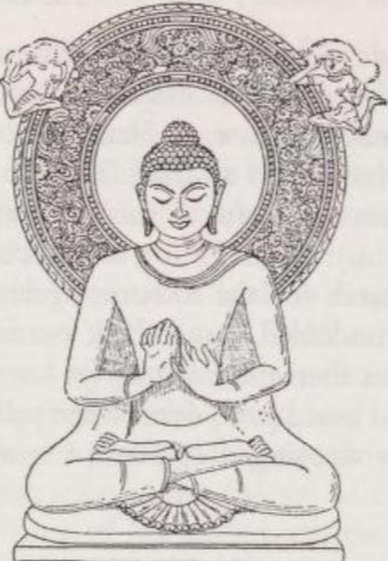
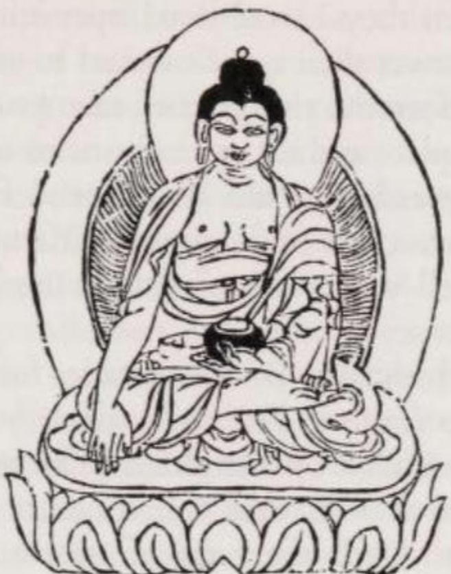
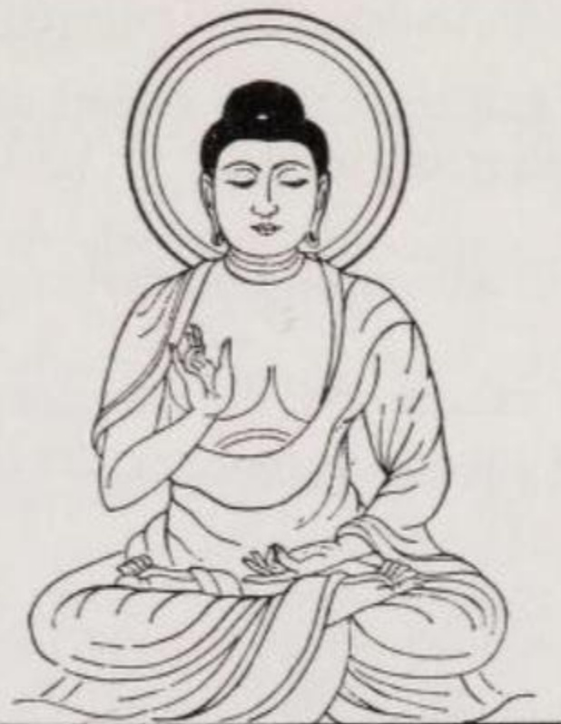
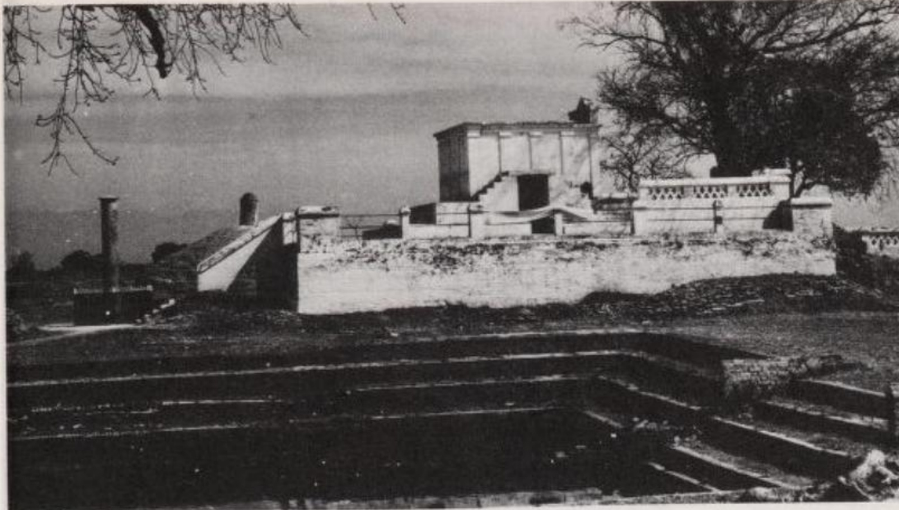
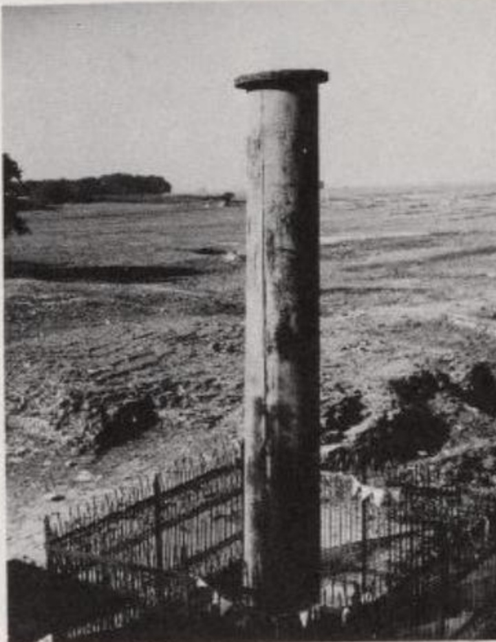
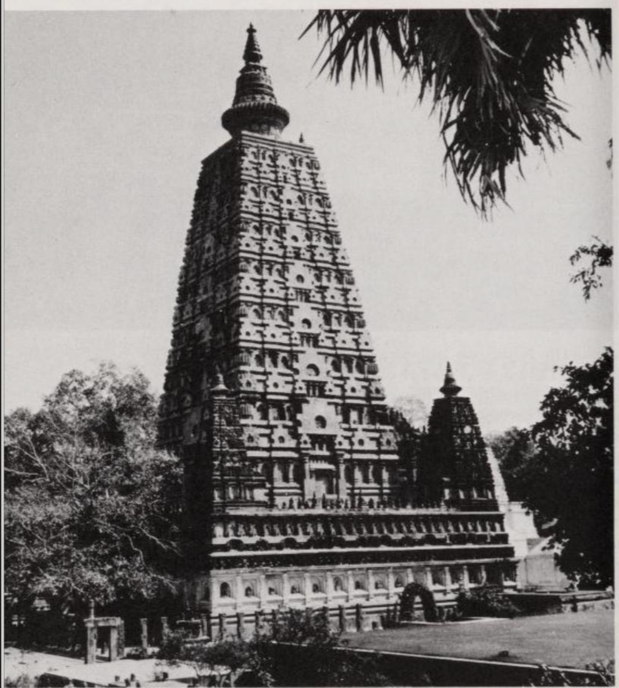

# I. CUỘC ĐỜI CỦA ĐỨC PHẬT

Năm 1882, một học giả người Pháp xuất bản một cuốn sách, trong đó ông cố gắng chứng minh rằng người mang danh hiệu tôn kính "Phật" chưa từng tồn tại. Theo quan điểm của ông, những ghi chép gắn liền với "Bậc Giác Ngộ" hay "Bậc Tỉnh Thức" là không có cơ sở lịch sử và chẳng qua chỉ là một sự pha trộn mới của huyền thoại tự nhiên cổ đại về một vị anh hùng mặt trời.

Giả thuyết này lại càng đáng ngạc nhiên hơn vì vào năm trước đó, 1881, một cuốn sách đã được xuất bản đặt tính lịch sử của Đức Phật ra ngoài mọi sự hoài nghi: tác phẩm *Buddha—sein Leben, seine Lehre, seine Gemeinde* (Đức Phật - Cuộc đời, Giáo lý và Tăng đoàn) của Giáo sư Hermann Oldenberg (1854–1920) tại Đại học Goettingen. Những bằng chứng từ văn bản và khảo cổ học được đưa ra ánh sáng kể từ đó đã xác nhận hoàn toàn và bổ sung trọn vẹn cho bức tranh mà Oldenberg phác họa về cuộc đời của vĩ nhân người Ấn Độ này.

Siddhattha Gotama (Tất-đạt-đa Cồ-đàm), tức "Đức Phật", sinh ra cùng thời với Thales, Anaximander, Pythagoras và Lão Tử, có lẽ vào năm 563 trước Công nguyên (TCN). Niên đại này được tính ngược lại từ những dữ liệu khá chắc chắn về cuộc đời của hoàng đế Ấn Độ Asoka (A-dục vương) (độc tôn trị vì năm 269 TCN, đăng quang năm 265, mất năm 232), người mà theo một biên niên sử của Tích Lan ghi lại, đã lên ngôi 218 năm sau khi Đức Phật thọ 80 tuổi qua đời; tuy nhiên, cũng cần chấp nhận một sai số khoảng cộng trừ 10 năm. Tất cả các nhà nghiên cứu châu Âu đều bác bỏ truyền thống phổ biến ở các quốc gia theo Phật giáo Nguyên thủy (Theravāda), cho rằng Gotama sinh năm 624 TCN và mất năm 544 TCN.

Các kinh điển Pāli cung cấp thông tin đáng tin cậy về những năm tháng sau này trong cuộc đời của Gotama. Tuy nhiên, những gì chúng ta biết về thời trẻ của ngài lại bắt nguồn từ các văn bản và chú giải ra đời muộn hơn; từ mớ truyền thuyết đan xen chằng chịt này, chúng ta phải tách lọc ra những hạt nhân lịch sử cốt lõi.

Theo truyền thống ra đời muộn hơn này, bà Māyā (Ma-da), mẹ của Siddhattha, được cho là đã rời nhà chồng ở Kapilavatthu (Ca-tỳ-la-vệ) để về sinh con tại nhà cha mẹ đẻ ở Devadaha (Thiên Tý). Nhưng trên đường đi, tại một khu rừng cây Sāla gần làng Lumbinī (Lâm-tỳ-ni) (cách Benares 230 km về phía Bắc, thuộc Nepal ngày nay), cậu bé đã chào đời; một số người phương Đông cho rằng bà đã sinh mổ.[^2]

Hai mẹ con được đưa trở lại Kapilavatthu, nơi người mẹ qua đời một tuần sau đó. Người cha, Suddhodana (Tịnh Phạn), sau đó đã giao phó con trai mình cho em gái của người vợ quá cố, cũng là người vợ thứ hai của ông, bà Mahāpajāpatī (Ma-ha-ba-xà-ba-đề), người đã nuôi dưỡng cậu bé với muôn vàn tình yêu thương.

Gia tộc của vị Phật tương lai mang họ Gotama và thuộc bộ tộc *Sakiya* (Thích-ca)[^3] thuộc giai cấp chiến binh (*khattiya* - Sát-đế-lỵ). Vào thời điểm con trai ra đời, vị điền chủ Suddhodana đang là thống đốc (*rāja*) của một tỉnh thuộc vương quốc Kosala — một chức vụ được bầu chọn định kỳ trong giới quý tộc. Danh hiệu '*Rāja*' (Vua/Lãnh chúa) dành cho người giữ vị trí này đã khiến truyền thống Phật giáo coi Đức Phật như một vị thái tử. Các đoạn văn bản nhắc đến việc Suddhodana cày cấy ruộng đồng đã được giải thích bằng giả định về một lễ hội nông nghiệp, trong đó nhà vua phải thực hiện nghi lễ cày những luống đất đầu tiên.

Thời trẻ của Siddhattha không phải bận tâm về vật chất. Vùng đất quanh Kapilavatthu rất màu mỡ, đặc biệt thích hợp trồng lúa nước, mang lại cho cư dân một cuộc sống sung túc. Cảnh sắc nơi đây cũng vô cùng quyến rũ. Vào những ngày trời trong, sườn phía nam của dãy Himalaya nổi bật trên nền trời, trong khi những tán cây rải rác in bóng râm xuống vùng đồng bằng ngập tràn ruộng đồng.

Nền giáo dục mà Siddhattha nhận được, dường như không bao gồm việc đọc và viết, hoàn toàn phù hợp với truyền thống của giới quý tộc Ấn Độ cổ đại. Ngài kết hôn năm mười sáu tuổi và đến năm hai mươi chín tuổi thì có một người con trai, được ngài đặt tên là Rāhula (La-hầu-la). Cùng năm đó, ngài trải qua một sự thay đổi bước ngoặt trong tư tưởng, điều mà sau này ngài đã kể lại cho các nhà sư của mình như sau:

> "Ta cũng vậy, . . . trước kia . . . , bản thân ta vốn phải chịu cảnh sinh ra, lại đi tìm cầu những gì phải chịu cảnh sinh ra, chịu cảnh già yếu, bệnh tật, chết chóc, sầu muộn và ô nhiễm, ta đã tìm kiếm chính xác những gì phải chịu (tất cả những điều đó). Rồi . . . ta nhận ra: Tại sao ta . . . một kẻ phải chịu (tất cả những điều này), lại đi tìm kiếm chính xác những gì cũng phải chịu (những điều này)? Chẳng lẽ ta không nên, sau khi nhận ra sự khốn khổ trong việc sinh ra (v.v.), đi tìm kiếm sự diệt tận không sinh, không già, không bệnh, không chết, không sầu muộn, không ô nhiễm, vô thượng và thoát khỏi mọi gánh nặng (nibbāna - Niết-bàn) hay sao? Ngay sau đó, dù còn trẻ tuổi, ta đã cạo bỏ râu tóc, khoác lên mình chiếc y vàng, bất chấp mong muốn của cha mẹ đang khóc lóc . . . ta đã rời bỏ gia đình để sống cảnh không nhà." (M 26 I p. 163)

Ngài kể tiếp rằng mình đã trở thành đệ tử của một đạo sư tên là Āḷāra Kālāma. Không lâu sau, ngài đã thấu hiểu giáo lý của Āḷāra nhưng nhận ra rằng nó không dẫn đến sự giải thoát. Với người thầy thứ hai, Uddaka Rāmaputta, ngài cũng trải qua điều tương tự. Vì vậy, ngài cũng rời bỏ vị thầy này và bắt đầu con đường du hành của riêng mình.

Ở vùng lân cận làng Uruvelā (Ưu-lâu-tần-loa), nay là Bodh-Gayā (Bồ-đề Đạo-tràng) (cách Benares 210 km về phía Đông Nam), Siddhattha đã tìm thấy một địa điểm thuận lợi cho việc thực hành tâm linh. Tại đó, bên dòng sông Nerañjarā (Ni-liên-thiền) (ngày nay là sông Nīlājanā), một nhánh của sông Phalgu, ngài đã an tọa để thực hành lối tu khổ hạnh khắc nghiệt nhất. Trong suốt sáu năm dài, ngài đã tự hành xác, thực hành các bài tập hít thở khó khăn và nhịn ăn đến mức tiều tụy. Năm vị đạo sĩ khổ hạnh đã tụ tập quanh ngài với hy vọng rằng "chân lý (dhamma - pháp) mà sa-môn Gotama có thể tìm ra, ngài sẽ giảng giải lại cho chúng ta" (M 36 I p. 247). Nhưng khi Siddhattha nhận ra rằng tự hành xác không phải là con đường dẫn đến sự giải thoát, ngài đã từ bỏ lối tu khổ hạnh và bắt đầu ăn uống đầy đủ trở lại. Năm người bạn đồng tu ngay lập tức coi ngài là kẻ phản đạo và bỏ ngài mà đi.

*Trong suốt năm thế kỷ, các nghệ nhân Ấn Độ đã tránh việc khắc họa hình ảnh Đức Phật; sự hiện diện của ngài chỉ được biểu thị qua các biểu tượng. Chỉ đến thế kỷ thứ 1 sau Công nguyên — đồng thời tại Mathurā và vùng Gandhāra chịu ảnh hưởng của văn hóa Hy Lạp — những e ngại này mới được gỡ bỏ và bậc đạo sư trở thành một chủ đề được yêu thích trong nghệ thuật tạo hình.*

*Theo thời gian, các tư thế của bàn tay và cơ thể đã được chuẩn hóa. Một bức điêu khắc nổi tiếng thời Gupta (thế kỷ thứ 5), được tìm thấy ở Sārnāth (Lộc Uyển), mô tả bậc đạo sư trong tư thế chuyển pháp luân (quay bánh xe giáo pháp); hai chân ngài bắt chéo trong tư thế hoa sen (kiết già). Dái tai ngài dài ra do từng đeo đồ trang sức nặng, những thứ mà Gotama đã vứt bỏ khi bước vào cuộc sống không nhà. Vì vậy, chúng tượng trưng cho sự từ bỏ.*

Chỉ còn lại một mình, ngài chợt nhớ lại một trải nghiệm thời thơ ấu:

> "Ta nhớ lại rằng, khi đang ngồi dưới bóng cây Jambu (cây trâm) trong lúc phụ thân Sakka đang cày những luống đất, ta đã an trú trong trạng thái không còn ham muốn, không còn những cảm xúc bất thiện, sau khi ta đạt được trạng thái hỷ lạc của tầng thiền thứ nhất gắn liền với tư duy và quán sát (tầm và tứ), sinh ra từ sự viễn ly. (Ta tự hỏi): Phải chăng đây chính là con đường dẫn đến giác ngộ?" (M 36 I p. 246)

Ngồi dưới gốc cây Assattha (hoặc Pippala) - một loài cây bồ đề, ngài bắt đầu thiền định một cách có phương pháp, và với con mắt tâm linh, ngài đã nhìn thấu từng tầng từng lớp bản chất của sự tồn tại. Ngài nhớ lại các kiếp sống trước đây của mình, nhìn thấu quy luật tái sinh như một hệ quả của các hành động (kamma - nghiệp) và nhận ra: Đây là khổ, đây là nguyên nhân của khổ, đây là sự diệt khổ và đây là con đường dẫn đến sự diệt khổ. Ngài đạt được tuệ giác:

> "Sự giải thoát (khỏi đau khổ) của ta là không thể lay chuyển; đây là lần sinh ra cuối cùng, sẽ không còn sự tái sinh nào nữa (đối với ta)." (M 26 I p. 167)

Vào khoảnh khắc đó của năm 528 TCN — theo truyền thống là vào đêm trăng tròn đầu tiên của tháng Vesākha (tháng 4 - tháng 5) — Siddhattha Gotama đã đạt được sự giác ngộ (bodhi) và trở thành một vị Phật. Khi đó ngài ba mươi lăm tuổi.

Đôi khi người ta nói rằng sự giác ngộ của Đức Phật chỉ là một sự hư cấu văn học, bởi vì nhiều đặc điểm trong giáo lý của ngài đã có thể được tìm thấy trong các tư tưởng thời tiền Phật giáo, đặc biệt là trong các kinh văn Upaniṣad (Áo nghĩa thư). Mặc dù điều này là đúng, nhưng thực tế đó không phải là bằng chứng. Sự giác ngộ (bodhi) của Gotama là một trải nghiệm trong đó các yếu tố tư tưởng được tiếp thu và những niềm tin đi ngược lại với các triết lý đương thời (như học thuyết vô ngã - anatta) đột nhiên hòa quyện thành một 'hệ thống' hữu cơ thống nhất. Những kiến thức học được và tự khám phá đã kết tinh trong ngài, hé lộ cho ngài những bí mật của nhân sinh. Xét về những hệ quả mà nó mang lại, sự giác ngộ của Đức Phật đánh dấu một trong những thời khắc vĩ đại nhất trong lịch sử nhân loại.

Quyết định về việc nên giữ lại tuệ giác cho riêng mình hay truyền bá nó cho thế gian dường như đã khiến vị Phật trẻ tuổi phải trải qua một cuộc đấu tranh nội tâm đáng kể. Cuối cùng, "lòng từ bi đối với những chúng sinh đang chịu đau khổ, chưa được giải thoát" của ngài đã chiến thắng, và ngài quyết định bắt đầu con đường hoằng pháp.

Vì trong lúc đó, hai vị thầy cũ của ngài đã qua đời, ngài bèn đi đến Vườn Lộc Uyển ở Isipatana (Sārnāth) gần Benares để mở ra "cánh cửa giải thoát" cho những người bạn cũ, năm vị đạo sĩ đồng tu. Khi thấy người mà họ cho là kẻ phản đạo đang tiến đến, họ đã đồng lòng từ chối chào hỏi ngài theo lẽ thường. Tuy nhiên, bị áp đảo bởi phong thái tỏa sáng của một người đã chắc chắn đạt được giải thoát, họ không thể làm ngơ được. Họ đã chào đón ngài, và Gotama đã thuyết bài pháp đầu tiên cho họ (= S 56, 11), mang tên 'Chuyển Pháp Luân'. Lần đầu tiên, ngài truyền đạt cho người nghe sự chứng ngộ của mình về chân lý của sự khổ và về sự tự khép mình vào kỷ luật, thoát khỏi các thái cực như một phương tiện để giải thoát. "Trung Đạo" mà ngài giảng giải đã nhanh chóng được thấu hiểu. Rất nhanh sau đó, năm vị đạo sĩ đã chấp nhận giáo pháp (dhamma) và trở thành những đệ tử nhà sư (tỳ-kheo) đầu tiên của Gotama. Không lâu sau, họ đều trở thành những bậc thánh (A-la-hán).

Các thuật ngữ ‘nhà sư’ và ‘tăng đoàn’ (*saṅgha*) không nên được hiểu theo mô hình của Cơ Đốc giáo. Mặc dù các nhà sư Phật giáo (*bhikkhu* - tỳ-kheo) khác với người phàm ở cái đầu cạo trọc, chiếc y vàng và việc tuân thủ các quy tắc đạo đức đặc biệt, họ không cam kết phải sống cuộc đời tu hành trọn đời. Có những nghi thức nhất định để thọ giới cũng như một thời gian dài làm sa-di (tập sự), nhưng để hoàn tục, họ chỉ cần cởi bỏ áo cà sa. Hơn nữa, việc thọ giới hoàn toàn không phải là điều kiện tiên quyết để đạt được mục tiêu tối hậu; nó chỉ tạo điều kiện thuận lợi hơn cho con đường đi đến giải thoát. Kinh điển Pāli có nhắc đến hai mươi cư sĩ tại gia (*upāsaka*) đã trở thành thánh mà chưa từng khoác áo tu hành.

Vài tháng sau khi thành lập, tăng đoàn đã có tổng cộng sáu mươi thành viên. Lúc này, Đức Phật triệu tập các tỳ-kheo của mình và khuyên họ hãy lên đường đi giảng pháp, khuyến khích mọi người sống một cuộc đời thanh tịnh:

> "Này các tỳ-kheo, hãy lên đường vì sự tốt lành của số đông, vì lợi ích của số đông, vì lòng từ bi đối với thế gian, vì sự an lạc, vì sự tốt lành, vì lợi ích của chư thiên và loài người. Đừng đi hai người cùng một hướng! Này các tỳ-kheo, hãy giảng dạy giáo pháp toàn thiện ở phần đầu, toàn thiện ở phần giữa, toàn thiện ở phần cuối, cả về ý nghĩa (lẫn) văn tự. Hãy phô diễn một đời sống phạm hạnh viên mãn và thanh tịnh. Có những chúng sinh sinh ra với ít bụi trần trong mắt; nếu họ không được nghe giáo pháp, họ sẽ bị đọa đày. Họ sẽ thấu hiểu được giáo pháp." (Mv 11, 1 Vin I p. 21)

Đó là cách mà hoạt động truyền giáo của Phật giáo bắt đầu.

Giống như các tỳ-kheo của mình, Đức Phật cũng lên đường để truyền đạt chân lý mà ngài đã chứng ngộ cho một vòng kết nối rộng lớn hơn. Ngài đã dành bốn mươi lăm năm tiếp theo để du hành và thuyết pháp khắp miền Bắc Ấn Độ. Chỉ trong mùa mưa (từ tháng 6 đến tháng 9), thời gian ngài thường lui về ở ẩn trong một tu viện (an cư kiết hạ), ngài mới cho phép mình được nghỉ ngơi.

Chỉ riêng giáo lý thì không thể giải thích được thành công truyền giáo phi thường của Phật giáo. Bản thân Gotama cũng coi đó là "sâu sắc, khó nắm bắt, khó thấu triệt, thực tế, tối thượng, không thể tiếp cận bằng logic (đơn thuần), tinh tế, và chỉ những người có học thức mới có thể hiểu được" (M 26 I p. 167). Cách tiếp cận thực tế và hợp lý nhằm tránh mọi thái cực, tính chất không tôn thờ sùng bái giúp giải phóng con người khỏi sự bạo ngược của các nghi lễ vốn là lãnh địa và nguồn thu nhập của tầng lớp tăng lữ Bà-la-môn tự phụ; hơn nữa, việc Đức Phật chỉ thị cho các tỳ-kheo không giảng dạy giáo lý bằng tiếng Phạn (Sanskrit) mà bằng ngôn ngữ bản địa (Cv 5, 33, 1 Vin II p. 139), tức là có thể là phương ngữ Māgadhī - ngôn ngữ của vùng ngài sinh sống — tất cả những điều này đã đóng góp nhiều hơn vào sự lan tỏa của giáo pháp so với nội dung giáo lý phức tạp của nó. Một vai trò quan trọng nữa là việc các tỳ-kheo của ngài phần lớn đều sống một cuộc đời tự khắc kỷ và tiết độ. Cuối cùng, chính nhân cách của Đức Phật là thỏi nam châm thu hút các tín đồ. Ngài là một người có nhân cách hài hòa, tự tại với sức hút to lớn. Sự uy nghiêm trong diện mạo, sự nhã nhặn của ngài ngay cả với những người có địa vị thấp kém và phong thái cao quý của ngài đã gây ấn tượng ngay cả với những người từ chối giáo lý của ngài.

Các nguồn tài liệu Pāli khắc họa tính cách của Đức Phật rất rõ nét. Cách hành xử của ngài được định hình bởi sự tự tin tuyệt đối về việc đã được giải thoát, tính khí trầm mặc và lòng nhân hậu đối với toàn nhân loại.

Sự tự tin của Đức Phật nhờ sự giải thoát trở nên rõ ràng vào khoảnh khắc sau khi ngài giác ngộ, khi ngài gặp lại năm vị đạo sĩ khổ hạnh và giảng giải cho họ những tuệ giác của mình. Vì không thể từ chối chào hỏi ngài, họ đã gọi tên ngài và gọi ngài là "hiền giả" (người bạn). Nhưng Gotama đã phản đối cách xưng hô này:

> "Này các tỳ-kheo, đừng gọi Đấng Như Lai (tathāgata)[^4] bằng tên và bằng danh xưng 'hiền giả'! Này các tỳ-kheo, Đấng Như Lai là một bậc thánh (arahant - A-la-hán), một Bậc Giác Ngộ Hoàn Toàn (sammāsambuddha - Chánh Đẳng Chánh Giác)." (M 26 I p. 171)

Đã giác ngộ và giải thoát, Gotama cảm thấy mình hoàn toàn khác biệt với những chúng sinh chưa được giải thoát. Có lần (A 4, 36, 2 II p. 38), một vị Bà-la-môn hỏi ngài liệu ngài có phải là một vị thần, một chúng sinh cõi trời, một linh hồn hay một con người hay không. Với tất cả những khả năng này, ngài đều trả lời là không. Những sự không hoàn hảo, thứ xếp một cá nhân vào bất kỳ thể loại nào trong số đó, đã bị tiêu diệt hoàn toàn trong ngài; ngài là một vị *Phật*.

Với sự thấu hiểu bản thân như vậy, điều đáng khâm phục là ngài không truyền đạt một cách giáo điều thứ giáo lý có thể biến đổi một con người đến mức độ như vậy. Trái lại, ngài nhấn mạnh rằng không một giáo lý nào nên được chấp nhận chỉ dựa trên sức mạnh của truyền thống, của việc được truyền lại trong kinh điển, của việc phù hợp với quan điểm của riêng mình hay vì tin tưởng vào một cơ quan thẩm quyền. Nó chỉ nên được chấp nhận khi chính bản thân người đó nhận ra nó là thiện lành và mang lại lợi ích (A 3, 65, 3 I p. 189).

Không những Gotama tránh việc ép buộc bất cứ ai theo giáo lý của mình, ngài thậm chí còn cảnh báo chống lại sự cải đạo quá vội vàng. Khi Tướng quân Siha, một người theo đạo Jain (Kỳ-na giáo), sau một cuộc trò chuyện với ngài đã muốn trở thành tín đồ của ngài, bậc đạo sư đã khuyên ông nên suy nghĩ kỹ. Khi Siha lặp lại yêu cầu cải đạo, ngài bảo ông hãy tiếp tục bố thí cho các tu sĩ đạo Jain (Mv 6, 31, 10 f. Vin I p. 236).

Khả năng lay động lòng người bằng lời nói của Gotama dường như rất phi thường. Với những người có tâm trí đơn giản, ngài nói một cách dễ hiểu về những việc làm thiện lành sẽ dẫn đến việc được tái sinh trên cõi trời. Biện pháp tu từ thường xuyên nhất trong các bài thuyết pháp như vậy là sự đối chiếu: Giữa sự không hoàn hảo với Đấng Hoàn Hảo, giữa cái ác với đức hạnh, giữa sự bất hòa trần tục với sự bình an của giải thoát, v.v.

Việc các quy tắc đạo đức mà ngài thuyết giảng thực chất là những kết luận được rút ra từ những tuệ giác triết học là điều ngài chỉ cho thấy ở những thính giả mà ngài đánh giá là có tư duy cởi mở và thông minh. Về điểm này, ngài không bận tâm người nghe là một cư sĩ tại gia, một nhà sư hay một tín đồ của tôn giáo khác. Ngài không có thái độ giấu giếm kiểu "bàn tay nắm chặt của các đạo sư", những người thường phân biệt giữa khía cạnh bên trong và bên ngoài, tức là khía cạnh bí truyền (mật giáo) và công truyền (hiển giáo) trong giáo lý của họ (D 16, 2, 25 II p. 100).

Các phương pháp logic được áp dụng trong các bài thuyết pháp của Đức Phật cũng như trong tất cả các văn bản Phật giáo sơ kỳ khác không quá nhiều. Thế kỷ thứ sáu TCN chưa biết đến logic học lý thuyết. Các giáo lý đối lập hầu hết bị bác bỏ bằng cách vạch trần những hệ quả vô lý của chúng; học thuyết hoặc ý tưởng cơ bản qua đó bị chứng minh là không thể đứng vững. Để hỗ trợ cho giáo lý của mình, các văn bản Phật giáo sử dụng các phương pháp: ví von (so sánh), tăng tiến, khoanh vùng và suy luận có điều kiện (duyên khởi).

(1) Phương pháp đầu tiên không mang nặng tính logic, nhưng lại hiệu quả nhờ sức mạnh tạo hình của các phép so sánh ví von. Chúng được lấy từ mọi lĩnh vực của tự nhiên và đời sống hàng ngày của người Ấn Độ, chứng tỏ rằng Gotama đã quan sát môi trường xung quanh bằng đôi mắt tinh tường. Danh tiếng của ngài như một nhà hùng biện phần lớn là kết quả của sự sống động trong các phép ẩn dụ của ngài.

(2) Phương pháp chứng minh bằng sự tăng tiến liệt kê các sự vật hoặc các phương thức hành xử theo cách thức mà điều sau vượt trội hơn điều trước, và điều cuối cùng, được hoàn thiện trong giáo lý của Đức Phật, được công nhận là vượt qua tất cả: A là xấu; B tốt hơn A; C tốt hơn B; . . . Z, điều mà Đức Phật nắm giữ hoặc giảng dạy, là tốt nhất và vượt trội hơn tất cả những điều khác.

(3) Phương pháp chứng minh bằng cách khoanh vùng đặt tiền đề cho cuộc đối thoại như một hình thức văn học, trong đó, dĩ nhiên, vai trò duy nhất của người thứ hai là người chỉ biết đáp "có" và "không". Bằng các câu hỏi về những thái cực có thể nghĩ ra, phạm vi của các ý kiến hợp lý được vạch rõ ở cả hai hướng, và quan điểm giáo lý của Đức Phật sau đó được xác định là nằm ở giữa: '(Thái cực) A có đúng không, thưa Tôn giả?' — 'Không, thưa ngài.' — '(Thái cực) Z có đúng không?' — 'Không, thưa ngài.' — 'Vậy thì (theo giáo lý của ta) chấp nhận (giá trị trung đạo) M là đúng đắn?' — 'Vâng, thưa ngài.'

(4) Suy luận có điều kiện không xuất hiện quá thường xuyên trong các văn bản Phật giáo; nhưng ở đâu chúng xuất hiện, chúng mang một sức nặng đáng kể. Điều đáng chú ý là mỗi mắt xích trong chuỗi chỉ được coi là một điều kiện tiên quyết một phần — chính xác là một điều kiện (*conditio*) — của mắt xích tiếp theo tương ứng, chứ không phải là yếu tố tạo ra duy nhất (*causa*). Hình thức logic của những suy luận như vậy là: Khi A (và các yếu tố cần thiết khác) tồn tại, thì B sinh ra; khi B (và các yếu tố cần thiết khác) tồn tại, thì C sinh ra; và cứ thế. Đôi khi phương pháp tương tự được sử dụng ngược lại, theo cách phân tích: Nơi nào có Z, nơi đó phải có (cùng với những thứ khác) Y làm điều kiện tiên quyết; nơi nào có Y, nơi đó phải có (cùng với những thứ khác) X làm điều kiện tiên quyết; và cứ thế.

Một điểm đặc biệt hấp dẫn về mặt trí tuệ là những cuộc trò chuyện mà bậc đạo sư đã có với các tu sĩ Bà-la-môn và đạo Jain. Chúng làm chứng cho sự linh hoạt trong trí tuệ của cả hai bên và về phía Đức Phật là sự châm biếm đôi khi xuất hiện. Kinh *Majjhimanikāya* (Trung Bộ Kinh) kể lại việc ngài đã nói với các tỳ-kheo của mình về một cuộc thảo luận mà ngài đã có với một số tu sĩ đạo Jain về việc sử dụng khổ hạnh. Ngài mỉm cười chỉ ra rằng những tu sĩ đạo Jain ngày nay đang phải chịu đựng những sự tự hành xác, trong kiếp trước hẳn phải là những kẻ lưu manh nên mới đáng phải chịu những sự dằn vặt này theo luật nhân quả. Tuy nhiên, nếu người ta giả định rằng thế giới được tạo ra bởi một đấng sáng tạo hay nó phát sinh một cách ngẫu nhiên, thì chính những người theo đạo Jain phải được coi là tác phẩm của một đấng sáng tạo độc ác hoặc là sản phẩm của một sự tình cờ bất hạnh (M 101 II p. 222).

Là một người tham gia vào một cuộc thảo luận, Đức Phật trở nên nổi bật nhờ sự điềm tĩnh và thái độ khách quan. Tu sĩ đạo Jain Saccaka Aggivessana, người được biết đến là một nhà tranh luận sắc sảo, đã ca ngợi ngài ở cuối một cuộc tranh luận vì "sắc mặt của ngài vẫn giữ được sự bình thản, sáng sủa". Các đạo sư tôn giáo khác có lẽ đã trở nên tức giận trong một cuộc nói chuyện như vậy và cố gắng lảng tránh hoặc đánh trống lảng khỏi chủ đề (M 36 I p. 250). Do đó, Gotama được mô tả là một người có khí chất tự chủ, không bao giờ đỏ mặt tía tai vì tức giận.

Tuy nhiên, trong một vấn đề, sự kiên nhẫn của ngài có giới hạn: Đó là khi nói đến việc chú giải giáo lý của ngài. Ngài chấp nhận việc người ta từ chối giáo lý của mình với sự điềm tĩnh, nhưng lại phản đối gay gắt việc hiểu sai và diễn giải sai lệch nó. Ví dụ, tỳ-kheo Sāti (Sa-đề) nghĩ rằng ông có thể hiểu nó theo cách là thức (*viññāna*) sau khi người mang nó chết đi sẽ di chuyển sang hiện thân tiếp theo. Bậc đạo sư đã quở trách ông ta: 'Kẻ ngu si kia, ông nghe từ ai rằng giáo lý này được ta giảng giải theo cách như vậy? Kẻ ngu si kia, chẳng phải ta đã tuyên bố bằng nhiều cách rằng thức phát sinh do duyên (và, do đó, diệt đi khi chết) hay sao?' (M 38 I p. 258). Đây là hành vi quyết liệt nhất của Gotama được ghi nhận trong các nguồn tài liệu Pāli.

*Một truyền thuyết có lẽ gần với sự thật kể lại rằng trong một lần đi khất thực buổi sáng hàng ngày, Đức Phật đã từng bị từ chối dâng thức ăn với lý do rằng chỉ những ai cày bừa đất đai mới có quyền đòi hỏi thức ăn. Bậc đạo sư ngay sau đó đã dùng tay phải chạm xuống đất để kêu gọi Đất mẹ làm chứng rằng một bậc đạo sư tâm linh cũng có quyền được sống. Tuy nhiên, ngài đã không nhận phần cúng dường được dâng lên sau đó. (Bản khắc gỗ Tây Tạng.)*

Tất cả sự nhã nhặn của ngài với mọi người, tất cả tài hùng biện, tất cả sự chân thành và nền tảng giáo dục của ngài sẽ không đủ để khiến Gotama trở nên nổi tiếng với những người cùng thời, nếu họ không cảm nhận được lòng nhân hậu thực sự trong những lời nói của ngài. Đó không phải là kiểu thân thiện suồng sã — mà đúng hơn, đó là lòng nhân hậu bắt nguồn từ khoảng cách của một tâm trí siêu việt và từ cảm giác hỷ lạc của sự giải thoát. Đó là lòng nhân hậu xuất phát từ lòng từ bi sâu sắc đối với những chúng sinh đang chịu đau khổ trên thế gian.

Cuộc sống hàng ngày của Gotama diễn ra như thế nào? — Ngài là một trong những nhà sư du hành rất đông đảo ở Ấn Độ, không có tài sản nào khác ngoài tám vật dụng thiết yếu được phép mang theo: Ba tấm y, bình bát, dao cạo, kim khâu, dây thắt lưng và một màng lọc nước. Đi bách bộ trong im lặng từ nhà này sang nhà khác vào sáng sớm, ngài thu thập khẩu phần ăn cho ngày hôm đó; sau đó, sau một bữa ăn sáng ngắn, ngài và các tỳ-kheo đi cùng sẽ tiếp tục chuyến du hành. Khi gặp những người có tư duy cởi mở, ngài sẽ dừng lại để trả lời các câu hỏi của họ và giảng giải giáo pháp cho họ. Trước khi mặt trời lên đến đỉnh đầu, họ sẽ nghỉ ngơi tại một nơi dễ chịu và ăn nốt phần thức ăn khất thực còn lại. Buổi chiều và buổi tối sẽ được dành cho việc thiền định yên tĩnh và hướng dẫn các tỳ-kheo. Ngài cũng thường nhận lời mời của một người thiện tâm để dùng bữa trưa hoặc nghỉ qua đêm tại nhà của người đó.

Một sự hy sinh mà Đức Phật đã thực hiện để truyền bá Giáo pháp (Dhamma) là từ bỏ sự tĩnh tại cô độc mà ngài yêu thích. Ngài luôn được bao quanh bởi các đệ tử, và những chuyến du hành của ngài được lên kế hoạch sao cho hành trình đi qua những nơi đông dân cư. Với sự trợ giúp của các ghi chép trong văn bản Pāli, các tuyến đường này có thể được dựng lại một cách tương đối.

Có bốn thành phố ở khu vực trung tâm miền Bắc Ấn Độ — Kosambi (Kiều-thưởng-di) (cách Allahabad 50 km về phía Tây Nam), Sāvatthi (Xá-vệ) (cách Allahabad 225 km về phía Bắc), Vesālī (Tỳ-xá-ly) (nay là Basarh, cách Patna 40 km về phía Bắc), và Rājagaha (Vương Xá) (gần Rājgir ngày nay, cách Patna 80 km về phía Nam) mà ngài đến thăm thường xuyên nhất và lưu lại lâu nhất. Hầu hết các địa điểm nhỏ hơn nơi ngài thuyết pháp đều nằm trên hoặc rất gần với các tuyến đường kết nối bốn thành phố này. Vào thời điểm đó, khu vực này thuộc về các vương quốc Kosala và Magadha (Ma-kiệt-đà); ngày nay nó là một phần của các bang Uttar Pradesh và Bihar của Ấn Độ.

Thành công trong việc truyền giáo của Đức Phật không dừng lại ở gia đình ngài. Con trai ngài là Rāhula, người em trai cùng cha khác mẹ Nanda (Nan-đà), cháu trai Ānanda (A-nan), và những người họ hàng xa hơn như Anuruddha (A-nậu-lâu-đà), Bhaddiya (Bạt-đề) và Devadatta (Đề-bà-đạt-đa) đã quyết định xuất gia làm tỳ-kheo, trong khi cha ngài và người vợ cũ trở thành những cư sĩ tại gia. Sau một thời gian dài do dự, ngài đã chấp thuận cho mẹ kế đồng thời là dưỡng mẫu Mahāpajāpati, người đã nhiều lần thỉnh cầu, được phép trở thành tỳ-kheo-ni và thành lập ni đoàn, tuy nhiên ni đoàn này đã mai một vào thế kỷ thứ mười sau Công nguyên. Ngoại trừ Devadatta, kẻ thậm chí đã có những âm mưu sát hại Đức Phật, chỉ có những điều tốt đẹp được ghi nhận về tất cả những người theo Giáo pháp thuộc gia tộc Sakiya.

Đối với độc giả của kinh điển Pāli, một số nhân vật trong đoàn tùy tùng của Gotama hiện lên rất sống động và đầy màu sắc. Các đại đệ tử của ngài là Sāriputta (Xá-lợi-phất) — một người có trí tuệ xuất chúng — và Moggallāna (Mục-kiền-liên), người được cho là sở hữu thần thông. Cả hai đều viên tịch trước Đức Phật và xá-lợi của họ được tôn trí tại Sāñci. Subhūti (Tu-bồ-đề) là một bậc thầy về thiền định, trong khi Mahākassapa (Ma-ha-ca-diếp) nổi bật trong việc tuân thủ các hạnh tu khổ hạnh. Chính ông là người đã triệu tập Đại hội Kết tập Kinh điển lần thứ nhất sau khi Gotama qua đời.

Trong số các cư sĩ tại gia cũng có một số người nổi bật giữa đám đông. Thương gia giàu có Sudatta 'Anāthapiṇḍika' (Cấp Cô Độc - Người nuôi dưỡng kẻ nghèo) đã hiến cúng tu viện Jetavana (Kỳ Viên tịnh xá) ở Sāvatthi, nữ hộ pháp Visākhā (Tỳ-xá-khư) hiến cúng tu viện Pubbārāma (Đông Viên tịnh xá) cũng tại thị trấn này. Đức Phật được cho là đã trải qua tổng cộng hai mươi bảy mùa an cư kiết hạ tại các Vihāra (tịnh xá) này. Ở Rājagaha, Vua Bimbisāra (Tần-bà-sa-la) của Magadha đã ra lệnh xây dựng tu viện Veḷuvana (Trúc Lâm tịnh xá), nơi Đức Phật đã lưu trú trong năm hoặc sáu mùa mưa. Ở Vesālī, phải kể đến kỹ nữ Ambapālī nổi tiếng với nhan sắc kiều diễm, người đã dâng cúng một tu viện cho Đức Phật không lâu trước khi ngài nhập diệt. Những cư sĩ tại gia không kém phần nhiệt thành nhưng ít khá giả hơn đành phải bằng lòng với việc thỉnh thoảng dâng cúng thức ăn cho bậc đạo sư và các đệ tử của ngài.

Một tăng đoàn gồm những nhà sư du hành thu hút tín đồ từ mọi tầng lớp dân chúng, dễ hiểu là sẽ được nhà cai trị của đất nước coi như một yếu tố chính trị tiềm tàng. Các nhà cai trị của Kosala và Magadha, vua Pasenadi (Ba-tư-nặc) và Bimbisāra (những người có quan hệ thông gia), đã có cái nhìn thiện cảm về Đức Phật, chắc chắn không kém phần quan trọng là vì họ đã nhận ra sự vô hại về mặt chính trị trong giáo lý của ngài. Bậc đạo sư có quan hệ hữu hảo với cả hai vị vua và đã hơn một lần họ đến tìm kiếm lời khuyên hoặc sự hướng dẫn của ngài về Giáo pháp. Như đã đề cập trước đó, tăng đoàn sở hữu các tu viện ở Sāvatthi, thủ đô của Kosala, và ở Rājagaha, thủ đô của Magadha. Việc sự sùng mộ của hai vị quân vương này đã thúc đẩy sự lan truyền của Phật giáo là điều không thể bàn cãi. Ngoài ra, các thương nhân Ấn Độ, những người hoan nghênh một tôn giáo khoan dung không màng đến những hạn chế về đẳng cấp, cũng đã đóng góp rất nhiều vào sự phổ biến của Giáo pháp. Tuy nhiên, Phật giáo chỉ trở thành một tôn giáo thế giới 250 năm sau đó, khi hoàng đế Asoka của vương triều Maurya, người cai trị Ấn Độ vào khoảng giữa thế kỷ thứ ba TCN, gửi các nhà truyền giáo không chỉ đến mọi miền đất nước của ông, mà còn đến các quốc gia láng giềng.

Vào năm 492 hoặc 491 TCN, Đức Phật suýt trở thành nạn nhân của một âm mưu ám sát. Tỳ-kheo Devadatta, người vừa là em họ vừa là em rể của ngài, đã đề nghị ngài giao phó quyền lãnh đạo tăng đoàn cho ông ta, Devadatta, trong khi ngài, Đức Phật, nên nghỉ ngơi vì tuổi đã cao. Khi bậc đạo sư từ chối điều này, Devadatta đã tiếp cận thái tử Ajātasattu (A-xà-thế), con trai của vua Magadha Bimbisāra, người mà các kế hoạch chinh phạt của ông ta đang bị cản trở bởi tình bạn giữa cha mình và vị Phật yêu chuộng hòa bình. Devadatta đã xoay sở thuyết phục Ajātasattu ám sát Đức Phật. Một người lính được cử đi để giết ngài, nhưng khi đối mặt với bậc đạo sư, anh ta không thể thi hành mệnh lệnh. Anh ta phủ phục dưới chân Gotama, tiết lộ nhiệm vụ của mình và, theo như câu chuyện kể lại, đã đi theo giáo pháp của Đức Phật (Cv 7, 3, 6-7).

Nỗ lực ám sát lần thứ hai, lần này bằng cách ném đá, cũng thất bại; Gotama chỉ bị thương ở bàn chân (Cv 7, 3, 9). Trong nỗ lực lần thứ ba, một con voi điên đã được thả ra để tấn công Đức Phật. Bằng cách tỏa ra tâm từ (mettā) đối với con vật, Gotama đã xoa dịu nó và thoát nạn mà không hề hấn gì (Cv 7, 3, 11-12).

Vì Devadatta không thể nắm quyền chỉ huy Tăng đoàn (Saṅgha), ông ta đã thành lập tăng đoàn của riêng mình với các quy tắc khắt khe hơn. Đức Phật đã cố gắng khuyên can ông ta từ bỏ ý định này một cách vô ích bằng cách chỉ ra rằng các thực hành khổ hạnh là vô dụng đối với sự giải thoát. Tăng đoàn của Devadatta ngay sau đó đã suy tàn.

*Đức Phật đang thuyết giảng Giáo pháp. Ngón cái và ngón áp út của bàn tay phải ngài tạo thành hình bánh xe giáo pháp. (Dựa theo một bức tranh cuộn treo tường của Nhật Bản thế kỷ 12.)*

Đức Phật viên tịch ở tuổi tám mươi. Trong khi trải qua mùa mưa ở ngôi làng Beluva (Trúc Lâm), ngài lâm bệnh, nhưng đã kìm nén cơn đau bằng ý chí. Khi tỳ-kheo Ānanda, người đã là thị giả riêng của ngài trong hai mươi lăm năm, nhận xét rằng ngài có lẽ không muốn ra đi trước khi chỉ định người kế vị, vị đạo sư cao niên đã trả lời:

> "Này Ānanda, tăng đoàn còn mong đợi gì ở ta nữa? Này Ānanda, ta đã giảng dạy giáo pháp mà không hề phân biệt bên trong hay bên ngoài (không có sự giấu giếm) . . . Do đó, này Ānanda, hãy tự mình là hòn đảo cho chính mình, là nơi nương tựa cho chính mình; hãy lấy giáo pháp làm hòn đảo, lấy giáo pháp làm nơi nương tựa, đừng nương tựa vào một nơi nào khác!" (D 16, 2, 25-26 II p. 100)

Giáo pháp (dhamma) chứ không phải là một vị đạo sư mới là thẩm quyền tối cao trong Phật giáo.

Cùng với một nhóm tỳ-kheo, Gotama du hành đến Pāvā, nơi ngài nghỉ ngơi trong vườn xoài của thợ rèn Cunda (Thuần-đà). Sau bữa ăn, ngài mắc bệnh kiết lỵ, nhưng bất chấp tình trạng suy yếu, ngài vẫn tiếp tục hành trình đến Kusināra (Câu-thi-na) (ngày nay là Kasia, cách Gorakhpur 55 km về phía Đông), nơi Ānanda chuẩn bị một chỗ nằm cho ngài dưới bóng những cây Sāla. Khi Ānanda bật khóc nức nở vì cái chết sắp xảy đến của bậc đạo sư, ngài đã an ủi ông như sau:

> "Thôi đủ rồi, Ānanda, đừng sầu muộn, cũng đừng than khóc. Chẳng phải ta đã luôn nói với ông rằng mọi thứ thân yêu và dễ chịu đều phải chịu sự thay đổi, mất mát và vô thường hay sao? Làm sao có thể (khác) được ở đây? Rằng những gì đã được sinh ra, đã hình thành, đã được tạo tác (saṅkhata — bởi những hành động của các kiếp trước như một hình thức tồn tại mới) và phải chịu sự hoại diệt — mà lại không bị diệt vong là điều không thể." (D 16, 5, 14 II p. 144)

Lần cuối cùng, ngài khuyên răn các tỳ-kheo của mình:

> "Này các tỳ-kheo, nay ta khuyên các vị: các pháp hữu vi cấu thành nên cá nhân (saṅkhāra)[^5] đều phải chịu sự hoại diệt; hãy tinh tấn nỗ lực không ngừng!" (D 16, 6, 7 II p. 156)

Đó là những lời cuối cùng của Đức Phật. Ngay sau đó, ngài rơi vào trạng thái hôn mê — được Kinh điển mô tả là một trạng thái thiền định — và từ đó tiến vào parinibbāna (Bát-niết-bàn), trạng thái giải thoát khỏi đau khổ sau khi trút bỏ nhục thân.

Năm Gotama qua đời là 483 TCN. Hy Lạp vào thời điểm đó đang chiến đấu trong các cuộc chiến tranh với Ba Tư (điều mà ba năm sau đó được định đoạt bởi chiến thắng trên biển của Themistokles tại Salamis), trong khi Heraclitus, Parmenides, Aeschylus, và ở Trung Quốc là Khổng Tử, vẫn còn sống.

Thi hài của Gotama được hỏa táng một tuần sau khi ngài viên tịch. Tro cốt được chia ra và trao cho bảy gia đình quý tộc Ấn Độ, cũng như cho một vị Bà-la-môn để an táng. Một gia đình quý tộc khác nhận được tro từ giàn thiêu, và vị Bà-la-môn Doṇa, người đã cử hành nghi lễ hỏa táng, đã lấy chiếc bình dùng để thu thập tro cốt của người quá cố. Tất cả những người nhận được xá-lợi đều tôn trí phần của mình trong các gò chôn cất (thūpa, tiếng Phạn: stūpa - tháp).

Ngôi tháp (thūpa), có lẽ do gia đình Đức Phật dựng lên trên phần xá-lợi của họ, đã được phát hiện và mở ra vào năm 1898 tại Piprāvā gần Kapilavatthu, quê hương của Gotama. Nằm dưới đỉnh tháp ba mét, người ta tìm thấy một chiếc bình nhỏ chứa các lễ vật, và sâu hơn năm mét rưỡi là một hộp đá chứa năm chiếc bình.[^6] Một trong số này, một chiếc bình làm bằng đá steatite, có khắc một dòng chữ bằng chữ Brāhmī và ngôn ngữ Māgadhī:

> "Chiếc bình chứa xá-lợi của Đức Phật tôn kính thuộc (gia tộc) Sakiya này là vật hiến cúng của Sukiti và các anh em trai của ông cùng với các chị em gái, con trai và thê thiếp."

Nhiều xá-lợi của Đức Phật đã được tìm thấy vào năm 1958 trong khu vực của thành phố Vesālī cũ, nơi trong một ngôi tháp, người ta phát hiện ra một chiếc bát nhỏ có nắp, chứa những mảnh xương còn sót lại, tro cốt và các đồ tùy táng.[^7] Có lẽ đây là phần xá-lợi mà gia đình quý tộc Licchavi, với thủ phủ là Vesālī, đã nhận được sau khi hỏa táng Gotama.

*Lumbini (ở Nepal), nơi sinh của Đức Phật. Ngôi đền được dựng trên những nền móng cũ vào thế kỷ 19, trong một căn phòng chính ở tầng hầm có chứa một bức phù điêu bằng đá đã mòn có lẽ từ thời Asoka, mô tả Siddhattha được sinh ra từ hông phải của mẹ ngài, người đang bám chặt vào cành của một cây (Sāla). Sau khi sinh, hai mẹ con được cho là đã tắm trong hồ nước ở phía trước. Cột trụ bên trái được hoàng đế Asoka dựng lên vào năm 245 TCN; nhờ nó mà Lumbini đã được tái phát hiện vào năm 1896. Cột trụ có khắc dòng chữ:*

*"Hai mươi năm sau khi đăng quang, vua Devānapiya Piyadasi (= Asoka) đã đến nơi này và bày tỏ lòng thành kính vì Đức Phật, Bậc hiền triết của gia tộc Sakya, đã giáng sinh tại đây. Ngài ra lệnh dựng một bức phù điêu bằng đá và một cột đá để chứng tỏ rằng Đấng Thế Tôn đã sinh ra tại đây. Ngài miễn thuế cho làng Lumbini và (giảm) mức nộp tô (từ một phần tư như thường lệ) xuống còn một phần tám."*

*Bất chấp việc được miễn thuế, Lumbini (nay là Rummindei) không thể phát triển vì khu vực đầm lầy ở phía Bắc của ngôi làng. Làng chỉ gồm mười lăm túp lều tre và là bến cuối của một tuyến xe buýt từ Naugarh (Ấn Độ).*

*Bên trên: Trụ đá Asoka ở Lumbini, cao 6,50 m. Vết nứt dọc có lẽ do một tia sét gây ra. Nhà hành hương người Trung Quốc Hsuan-tsang (Huyền Trang), người đã đến thăm Lumbini vào thế kỷ thứ 7, nhận thấy phần trên của cột trụ cùng với phần đỉnh có hình con ngựa đã bị gãy và ngôi làng bị bỏ hoang.*

*Đền Mahābodhi (Đại Giác Ngộ) và cây Bồ đề ở Bodh-Gayā (Bồ-đề Đạo-tràng). Ngôi đền cao 48 m, được dựng trên một số đền thờ nhỏ hơn. Nó được xây dựng vào thế kỷ thứ 2 sau Công nguyên, mở rộng vào thế kỷ thứ 8, bổ sung thêm các tháp góc vào thế kỷ 14 và được trùng tu vào thế kỷ 19.*

*Cây Assattha (bên trái), được các tín đồ hành hương sùng đạo tôn thờ như cái cây mà dưới đó Đức Phật đã đạt được sự giác ngộ (bodhi), là "cháu" của cây Bồ đề nguyên thủy đã bị phá hủy vào đầu thế kỷ thứ 7 bởi vua Śaśāṅka của xứ Bengal, một người theo đạo Shiva. Cây bồ đề tiếp theo đã trở thành nạn nhân của một cơn bão vào năm 1876. Cây hiện tại là một chồi non từ hậu duệ của cây nguyên thủy mà hoàng đế Asoka vào thế kỷ thứ 3 TCN đã tặng cho vua Tích Lan và hiện vẫn đang đâm chồi nảy lộc tại cố đô Anurādhapura.*

---
**Ghi chú của người dịch:** 
*   *Bản dịch đã bổ sung các thuật ngữ Hán-Việt phổ biến trong Phật giáo Nam truyền và Bắc truyền (ví dụ: Tỳ-kheo, Niết-bàn, Sát-đế-lỵ, v.v.) vào trong ngoặc đơn bên cạnh các từ dịch nghĩa tiếng Việt nhằm giúp những độc giả đã quen thuộc với kinh điển dễ dàng đối chiếu, đồng thời vẫn giữ được sự trong sáng, dễ hiểu cho người mới tiếp cận.*
*   *Trong văn bản gốc, chú thích số 7 bị thiếu dấu mũ (ghi là "discovered.7"), bản dịch đã tự động chuẩn hóa thành `[^7]` để đồng bộ với các chú thích khác.*