# II HĪNAYĀNA (Tiểu thừa) — PHẬT GIÁO CỦA SỰ GIẢI THOÁT THÔNG QUA NỖ LỰC TỰ THÂN

*(Ghi chú: "Hīnayāna" hay "Tiểu thừa" là một thuật ngữ mang tính lịch sử được tác giả sử dụng trong sách. Ngày nay, truyền thống này thường được biết đến với tên gọi chính thức là "Theravāda" hay "Phật giáo Nguyên thủy / Phật giáo Nam truyền".)*

## *Các kỳ Kết tập và Nguồn tài liệu (Councils and Sources)*

Kinh điển bằng tiếng Pāli (canon in Pāli) — nền tảng chính cho những hiểu biết của chúng ta về Phật giáo nguyên thủy — đã được biên soạn và chỉnh lý thông qua ba kỳ kết tập của giới tăng lữ (monastic councils). Kỳ Kết tập thứ nhất diễn ra chỉ vài tháng sau khi Đức Phật qua đời (năm 483 TCN) tại Rājagaha (Vương Xá). Kỳ Kết tập thứ hai diễn ra khoảng một trăm năm sau đó (khoảng năm 383 TCN) tại Vesālī (Tỳ-xá-ly), và kỳ thứ ba vào năm 225 TCN tại Pāṭaliputta (Hoa Cận, ngày nay là Patna).

Một số học giả phương Tây đã đặt nghi vấn về tính xác thực lịch sử của Kỳ Kết tập thứ nhất, nhưng có lẽ họ đã nhầm. Bởi vì, còn gì tự nhiên hơn việc các đệ tử của một nhà tiên phong tôn giáo tụ họp lại sau khi thầy mình qua đời để bàn bạc xem nay phải làm gì tiếp theo? Và vì Đức Phật đã chỉ định giáo pháp (the teaching) — chứ không phải một người thầy nào khác — làm cơ quan thẩm quyền tối cao, nên việc hiển nhiên cần làm là ôn lại các bài giảng của Ngài và tập hợp chúng thành một 'bộ kinh chuẩn' (canon). Người ta cho rằng Tạng Kinh (*Suttapiṭaka*) đã được tụng lại bởi Ānanda, vị thị giả thân cận trước đây của Đức Phật; còn Tạng Luật (*Vinayapiṭaka*) được tụng bởi sư Upāli, người từng là thợ cạo của tộc Sakiya nay đã trở thành chuyên gia về các quy tắc tu viện. Chúng ta không biết chính xác bộ kinh gốc sử dụng từ ngữ ra sao, vì ở Ấn Độ cổ đại, các lời dạy không được viết ra mà chỉ được truyền miệng.

Kỳ Kết tập thứ hai chịu trách nhiệm đưa thêm các bài giảng và thi kệ của các Tăng và Ni vào bộ kinh, đồng thời sàng lọc lại toàn bộ tài liệu. Những lời dạy có vẻ khác biệt nhau của Gotama (Cồ-đàm) trong suốt bốn thập kỷ rưỡi giảng pháp đã được điều chỉnh cho thống nhất. Lý do là vì giới tăng lữ thời đó (và cả bây giờ) hoàn toàn bác bỏ ý nghĩ cho rằng tư duy và hiểu biết của Đức Phật có sự phát triển theo thời gian: Theo quan điểm chính thống của họ, ngay trong khoảnh khắc giác ngộ để trở thành một vị Phật, Ngài đã thấu triệt toàn bộ giáo lý ở dạng hoàn thiện và cuối cùng. Ngoài ra, trong các văn bản, nếu có một từ khóa xuất hiện mà ở chỗ khác được trình bày chi tiết hơn, thì phần dài hơn sẽ được gộp vào phần ngắn hơn — một quy trình giải thích cho độ dài hiện tại của kinh điển và vô số sự lặp lại của nó. 
*(Ghi chú: Một đoạn ngắn ban đầu, khi được truyền tụng ở những bối cảnh khác nhau, dần dần được bổ sung và mở rộng bằng các chất liệu từ những đoạn tương tự ở nơi khác. Kết quả là đoạn ngắn ban đầu trở thành đoạn dài, chứ không phải hai đoạn cùng tồn tại song song ở một vị trí. Điều này giải thích tại sao kinh điển lại dài và lặp đi lặp lại nhiều đến vậy.)*

Cuối cùng, Kỳ Kết tập thứ ba đã rà soát lại toàn bộ văn bản một lần nữa. Họ cũng bổ sung vào hai Tạng (*Piṭaka*) cũ các tác phẩm mang tính học thuật (scholastic works). Số lượng các tác phẩm học thuật này tiếp tục tăng lên trong suốt hai thế kỷ tiếp theo, Tạng Vi Diệu Pháp (Vi diệu pháp/ *Abhidhammapiṭaka*) chính thức hình thành ở thời kỳ này.

Ngay sau Kỳ Kết tập thứ hai — thời điểm mà tăng đoàn Phật giáo đã phân liệt thành nhiều trường phái khác nhau — đã xuất hiện nhiều bộ kinh điển khác biệt nhau cả về ngôn ngữ lẫn cách phân chia chủ đề. Bộ kinh tiếng Pāli thuộc về trường phái Theravāda (Phật giáo Nam truyền/Trưởng lão bộ) trong một thời gian dài chỉ được lưu truyền bằng miệng. Mãi đến cuối thế kỷ thứ nhất TCN, nó mới được ghi chép lại thành văn bản tại Tích Lan (Ceylon, Sri-lanka ngày nay). Ngày nay, chỉ duy nhất bộ kinh Pāli là còn được bảo tồn trọn vẹn. Đối với tất cả các bộ sưu tập văn bản cổ xưa ngang hàng khác, chúng ta chỉ còn giữ lại được những mảnh vỡ vụn vặt, nếu không muốn nói là chẳng còn gì.

Mặc dù kinh điển Pāli chỉ là kinh sách của riêng một trường phái Phật giáo nên thẩm quyền của nó không mang tính toàn diện, nhưng đây vẫn là một nguồn tài liệu đáng tin cậy để nghiên cứu hệ thống Phật giáo nguyên thủy. Các so sánh với những mảnh vỡ còn sót lại của các bộ kinh khác cho thấy các giáo lý cốt lõi của chúng giống nhau. Đồng thời, Tạng Luật và Tạng Kinh chủ yếu chứa đựng những tư liệu cổ, trong đó chắc chắn bao gồm cả những lời dạy của chính Đức Phật. Tất nhiên, đây chỉ là những bản dịch, vì ngôn ngữ mẹ đẻ của Đức Phật dường như là tiếng Māgadhī chứ không phải tiếng Pāli. Một số câu thơ trong kinh điển bằng tiếng Pāli nghe có vẻ khó hiểu và sai nhịp điệu, nhưng lại trở nên rõ ràng và nhịp nhàng khi được dịch ngược lại sang tiếng Māgadhī. Cả hai ngôn ngữ này đều thuộc nhóm phương ngữ Trung Ấn và có họ hàng với tiếng Phạn (Sanskrit) ở một dạng tiền cổ điển được gọi là tiếng Vệ-đà (Vedic) [^ND-1].

Một câu hỏi thường được đặt ra là: những tư tưởng trong hai tạng Pāli cổ có bao nhiêu phần xuất phát từ Đức Phật, và bao nhiêu phần là từ các nhà sư đệ tử của Ngài? Ta tuyệt đối không nên "vì thấy hệ thống kinh điển quá hoàn thiện" đi đến kết luận rằng: "nên nó phải là sản phẩm được phát triển thêm từ 'giáo lý gốc'". Với một người đã dành trọn bốn mươi lăm năm cuộc đời để đi rao giảng, thì có đủ thời gian để tự hoàn thiện hệ thống triết lý của mình, nhận ra và loại bỏ các mâu thuẫn, bình tâm xem xét lại những góc nhìn trực tiếp và suy ngẫm về các ý kiến phản bác. Thực tế, trong các văn bản, ta vẫn có thể chỉ ra được một số sự điều chỉnh trong tư duy và những bước nhảy vọt về nhận thức, bất chấp những nỗ lực làm cho chúng đồng nhất của các kỳ kết tập về sau. Tại sao chúng ta lại có nghi ngờ Đức Phật — người mà sự vượt trội về đạo đức và trí tuệ đã được chính những người cùng thời ca ngợi — không phải là người đích thân thiết kế và xây dựng nên cấu trúc tư tưởng mang tên Ngài? Các nhà sư chỉ là những người biên soạn, chỉnh lý, và sau này là rà soát, bổ sung cho bộ kinh Pāli. Việc gán cho họ công lao tạo ra những yếu tố cốt lõi của hệ thống này — và suy diễn rằng Phật giáo thời tiền kinh điển (trước khi được ghi chép) khác biệt hoàn toàn so với Phật giáo Pāli — chỉ là sự suy đoán vô căn cứ.

Bộ kinh Pāli được chia thành ba bộ sưu tập gọi là các 'tạng' (baskets / *piṭaka*). Thuật ngữ này xuất phát từ việc các văn bản xưa kia được khắc hoặc viết trên lá cọ khô và được cất giữ trong các giỏ đan bằng mây tre, mỗi giỏ chứa những cuốn sách có cùng chủ đề.

Tạng thứ nhất, Tạng Luật (*Vinayapiṭaka*), chứa các quy tắc kỷ luật của tu viện (*vinaya*). Tạng thứ hai, Tạng Kinh (*Suttapiṭaka*), chứa các bài giảng (*sutta*) của Đức Phật và các đệ tử. Tạng này lại được chia nhỏ thành năm bộ (collections / *nikāya*):

| Tên |  |
| --- | --- |
| Dīghanikāya (Trường Bộ Kinh) | Tập hợp các bài kinh dài; |
| Majjhimanikāya (Trung Bộ Kinh) | Tập hợp các bài kinh có độ dài trung bình; |
| Saṃyuttanikāya (Tương Ưng Bộ Kinh) | Tập hợp các bài kinh được phân nhóm theo chủ đề; |
| Aṅguttaranikāya (Tăng Chi Bộ Kinh) | Tập hợp các bài kinh theo thứ tự tăng dần (dựa trên số lượng chủ đề được đề cập); |
| Khuddakanikāya (Tiểu Bộ Kinh) | Tập hợp các văn bản nhỏ hơn. |

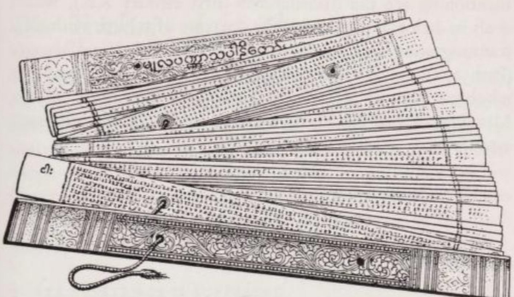

*Bản thảo trên lá cọ của một văn bản Pāli (Trung Bộ Kinh - Majjhimanikāya) từ Miến Điện, kích thước trang 520 × 55 mm. Bìa được mạ vàng. Hai sợi dây (sợi bên phải đã được tháo ra) được luồn qua bìa và các trang để giữ cuốn sách lại với nhau.*

Tiểu Bộ Kinh (*Khuddakanikāya*) bao gồm mười lăm tác phẩm riêng lẻ. Trong đó, *Udāna* (Kinh Phật Tự Thuyết) và *Itivuttaka* (Kinh Phật Thuyết Như Vậy) chứa những lời dạy của chính Đức Phật; trong khi lời của các đệ tử thì nằm trong *Dhammapada* (Kinh Pháp Cú), *Suttanipāta* (Kinh Tập), *Theragāthā* (Trưởng Lão Tăng Kệ) và *Therīgāthā* (Trưởng Lão Ni Kệ). Chín tác phẩm còn lại ít quan trọng hơn. Để nghiên cứu triết học Theravāda, Tạng Kinh (*Suttapiṭaka*) là nguồn tài liệu quan trọng nhất.

Tạng Vi Diệu Pháp (Tạng Luận /*Abhidhammapiṭaka* / Basket of Scholasticism) bao gồm bảy cuốn sách riêng lẻ, cuốn cổ nhất dường như có niên đại từ thế kỷ thứ ba TCN, cuốn mới nhất từ thế kỷ thứ nhất TCN. Tạng này chứa đựng hệ thống hóa các giáo lý và phân tích mọi thuật ngữ cốt lõi thành vô số các thuật ngữ phụ dưới dạng danh sách và biểu đồ. Nếu Tạng Luật và Tạng Kinh sử dụng ngôn ngữ thông thường (conventional language), thì Tạng Vi Diệu Pháp lại dùng một thứ ngôn ngữ mang tính 'khoa học' và 'tâm lý học' (của thế kỷ thứ ba TCN). Nó không còn nói về các 'sự vật' (things) một cách chung chung nữa mà đi sâu vào các yếu tố cấu thành nên chúng. *(Ghi chú: Nếu Tạng Vi Diệu Pháp biết đến hóa học hiện đại, nó sẽ gọi nước là H₂O thay vì gọi là nước).* Liệu Tạng Vi Diệu Pháp có thực sự đại diện cho trí tuệ giải thoát mà Đức Phật yêu cầu hay không vẫn là một câu hỏi gây tranh cãi, nhất là khi nó đã khoác những cái tên mới để đưa trở lại một số quan điểm mà trước đây Phật Cồ-đàm đã bác bỏ.[^ND-2]

Trong số vô vàn các tác phẩm Pāli ngoài kinh điển, có một số cuốn đáng chú ý như: *Milindapañha* (Kinh Mi Tiên Vấn Đáp - thế kỷ thứ nhất SCN), được viết dưới dạng đối thoại bàn về giáo lý tái sinh mà không có linh hồn chuyển thế; cuốn cẩm nang hệ thống *Visuddhimagga* (Thanh Tịnh Đạo) của Buddhaghosa (thế kỷ thứ năm); và cuốn sách giáo khoa mang tính học thuật *Abhidhammatthasaṅgaha* (Thắng Pháp Tập Yếu Luận) của Anuruddha (khoảng thế kỷ thứ mười một).

## *Giáo lý của trường phái Theravāda (The Teachings of the Theravāda)*

Triết học Phật giáo khởi nguồn từ một động lực duy nhất: nỗi đau khổ (suffering) trên thế gian. Kinh nghiệm về sự đau khổ chính là lực đẩy cho tư duy Phật giáo; phân tích sự đau khổ và tìm kiếm con đường giải thoát khỏi nó chính là nội dung cốt lõi của tư duy này. Những cuộc nghiên cứu hay tranh luận nào không mang lại lợi ích cho việc giải thoát đều bị coi là vô giá trị: Cồ-đàm Đức Phật là một nhà thực tế (pragmatist), không phải một nhà siêu hình học (metaphysician). Do đó, cấu trúc của hệ thống Phật giáo, nội dung cũng như các giới hạn của nó đã được định hình rõ ràng ngay từ đầu.

### 1. MỌI SỰ TỒN TẠI ĐỀU LÀ KHỔ (ALL EXISTENCE IS SUFFERING)

Trong bài giảng đầu tiên của mình, được thuyết vào năm 528 TCN trước năm vị tỳ kheo tại Vườn Lộc Uyển (Sārnāth) gần Benares, Phật Cồ-đàm đã giải thích những gì Ngài hiểu về sự đau khổ:

> Này các tỳ kheo, đây là Chân lý Cao quý về Khổ (*dukkha* / Noble Truth of Suffering): Sinh là khổ, già là khổ, bệnh là khổ, chết là khổ; sầu, bi, khổ, ưu, não là khổ; phải chung đụng với những gì mình không ưa thích là khổ, phải chia lìa với những gì mình yêu thương là khổ; không đạt được những gì mình mong cầu là khổ; tóm lại, Năm Nhóm Bám Víu (*Năm Uẩn Thủ* / Five Groups of Grasping) là khổ. ([(Mv 1, 6, 19 Vin I p. 10](/link?q=vin.mv-1.6) = [S 56, 11, 5 V p. 421](/link?q=SN-56.11))

Là kết quả của những suy ngẫm về triết học sâu xa, câu nói này bao hàm nhiều ý nghĩa xa hơn vẻ bề ngoài của nó. Hơn nữa, vì tất cả các thuật ngữ trong đó đều liên kết với những ý tưởng vượt ra ngoài nghĩa đen thông thường, chúng ta cần lần lượt xem xét: thứ nhất là các hiện tượng sinh, già, sầu não, v.v.; thứ hai là bản thân thuật ngữ 'khổ' (suffering); và thứ ba là giáo lý về Năm Uẩn — thứ mà theo niềm tin Phật giáo, cấu thành nên một con người thực nghiệm (empirical personality).

(1) Sinh, già, chết, sầu não và tuyệt vọng, chia lìa bạn bè, phải ở cùng những kẻ mình ghét, những mong muốn không được thỏa mãn — tất cả những thuộc tính này của sự tồn tại đều là khổ. Chừng nào chúng chưa bị tận diệt, thì cuộc đời không thể được coi là thực sự hạnh phúc. Nhưng vì chúng là một phần không thể tách rời của cuộc sống, nên cuộc sống phải được nhìn nhận là đầy rẫy khổ đau.

Ở đây, có người có thể phản bác rằng: mặc dù sự tồn tại không phải chỉ toàn niềm vui, nhưng nó vẫn chứa đựng đủ những niềm vui để ta có một đánh giá tích cực hơn. Thực tế, Đức Phật không hề phủ nhận những thú vui và những trải nghiệm dễ chịu. Ngược lại, Ngài coi chúng là một phần cố định của cuộc sống — nếu không có chúng, cuộc sống sẽ chẳng có vẻ hấp dẫn như ta thấy ([S 22, 60 III p. 69 f.](/link?q=SN-22.60)). Tuy nhiên, tiêu chuẩn đánh giá của Ngài sâu sắc hơn nhiều: Ngài lấy *sự [không khổ đau] vĩnh cửu (permanence)* làm thước đo cho hạnh phúc đích thực. Mọi thứ vui vẻ và thân thương rồi cũng kết thúc trong đau khổ bởi vì chúng mang tính *biến hoại (vô thường / transitory)*. Đó là thứ hạnh phúc giả tạo, vì ta sẽ phải trả giá bằng nỗi buồn và những giọt nước mắt để bù đắp lại. Khi đang lưu lại Sāvatthi (Xá-vệ), nữ thí chủ của 'Đông Viên Tự' là phu nhân Visākhā đã đến gặp Phật Cồ-đàm vào một giờ không phù hợp, tóc và quần áo vẫn còn ướt (do vừa tắm nghi lễ), để báo tin về cái chết của đứa cháu gái yêu quý. Ngài đã an ủi người phụ nữ đang than khóc bằng những lời này:

> Này Visākhā, ai có một trăm điều yêu thương, người đó có một trăm nỗi khổ; ai có chín mươi..., mười..., năm..., hai điều yêu thương, người đó có chín mươi..., mười..., năm..., hai nỗi khổ. Đối với người không có điều gì để yêu thương, người đó không có nỗi khổ. Những người như vậy, Ta tuyên bố, là những người không có sầu não, không có đam mê (và) thoát khỏi sự tuyệt vọng.
> 
> Bất kể có bao nhiêu sầu, bi và khổ trên thế gian này: Chúng đều phát sinh dựa trên những điều ta yêu thương; chúng sẽ không phát sinh khi không có gì để yêu thương. ([Ud 8, 8 p. 92](/link?q=ud-8.8))

Mọi sự bám víu (attachment) về mặt tâm lý vào một điều gì đó dễ chịu đều dẫn đến đau khổ. Chắc chắn rằng, dục vọng (*kāma* / lust) và đau khổ về bản chất là một. Như vị tỳ kheo đã giác ngộ Eraka từng nói:

> Dục vọng là đau khổ, không phải niềm vui;
> Kẻ mong cầu dục vọng là đang chuốc lấy đau khổ.
> Người không còn mong cầu dục vọng,
> Sẽ chẳng bao giờ vướng bận khổ đau. ([Thag 93](/link?q=thag-93))

(2) Bản thân thuật ngữ 'khổ' (*dukkha*) cũng mang một lớp nghĩa khó hiểu khác trong 'chân lý về khổ' của Phật Cồ-đàm.

Một định nghĩa ra đời sau khi Đức Phật qua đời ([SN 38, 14 IV p. 259](/link?q=SN-38.14)) đã phân loại khổ thành ba dạng: *Khổ do cảm giác đau đớn mang lại* (khổ khổ / *dukkha-dukkha*), *khổ do sự thay đổi hoặc biến hoại (vô thường)* (hoại khổ / *vipariṇāma-dukkha*), và *khổ phát sinh từ các yếu tố cấu thành nên nhân cách* (hành khổ / *saṅkhāra-dukkha*). Dạng thứ ba này ám chỉ sự thật rằng khi ta tồn tại dưới dạng sinh vật, ta sẽ phải phơi mình và dễ bị tổn thương trước hàng ngàn tai ương. Dạng khổ thứ hai — khổ vì sự biến hoại (vô thường) — bao gồm cả những sự vật và cảm xúc dễ chịu (*sukha*) [khi chúng biến mất]; dạng khổ thứ ba bao gồm cả những cảnh chưa thực sự xảy ra, nhưng nỗi sợ đến từ dự đoán của lý trí hay trái với mong muốn.

Cách định nghĩa gồm ba phần này phân tích sự đau khổ dựa trên các nguyên nhân của nó, nhưng chưa thực sự bao quát hết toàn bộ ý nghĩa của thuật ngữ này. Nếu 'chân lý về khổ' của Đức Phật chỉ đơn giản là một câu nói sáo rỗng, thì đau khổ chỉ là một danh từ chung để gọi tên những muộn phiền quen thuộc trong cuộc sống. Chẳng cần đến một bậc thánh nhân để nói cho thế giới biết rằng sầu não, bi kịch, đau đớn, v.v. là 'khổ' theo cách hiểu thông thường. Thực chất, *dukkha* trong Phật giáo là một thuật ngữ triết học: tổng quát và rộng lớn. Bất cứ thứ gì nằm trong vòng luân hồi (*saṃsāra*) có sự hình thành và hoại diệt, thứ đó là khổ; nói cách khác, mọi thứ chưa được giải thoát đều là khổ. Khi được dùng như một tính từ, *dukkha* ('đầy đau khổ') ám chỉ rằng đối tượng đó thuộc về cảnh giới chưa được giải thoát, thuộc về luân hồi. Câu nói: "Sinh, chết, v.v. là *dukkha*" không phải là một mệnh đề phân tích (analytic) mà là một mệnh đề tổng hợp (synthetic). *(Ghi chú: Mệnh đề tổng hợp nghĩa là nó không chỉ phân tích ý nghĩa từ ngữ, mà gắn các hiện tượng đó với một bản chất chung)*. Hiểu một cách chính xác, nó có nghĩa là: Tất cả các hiện tượng gắn liền với cuộc sống như sinh, chết, sự gặp gỡ hay sự chia ly đều mang bản chất luân hồi (*saṃsāric nature*), và do đó không thể nào xóa bỏ được chừng nào con người vẫn còn kẹt trong trạng thái chưa giải thoát.

(3) Theo Phật giáo, khi mọi sự tồn tại trong luân hồi đều là khổ, thì rõ ràng con người trải nghiệm (empirical person) — vốn là tâm điểm trải nghiệm sự khổ đó — cũng không thể được đánh giá khác đi. Thực vậy, câu nói: "Tóm lại: Năm Nhóm Bám Víu (Năm Uẩn Thủ) là khổ" chính là đang ám chỉ đến con người hay nhân cách (personality). *('5 Thủ Uẩn' khác với '5 Uẩn', Kinh có phân biệt ở đây [SN 22.48](/link?q=22.48) )*

### 2. CHỦ THỂ CỦA SỰ KHỔ VÀ BA DẤU ẤN (THE SUBJECT OF SUFFERING AND THE THREE MARKS)

Trong Phật giáo, câu hỏi "Con người là gì?" luôn được trả lời bằng cách liệt kê Năm Nhóm Bám Víu (*Năm Uẩn Thủ* / *upādāna-khandha*)[^8]:

*(ND: Theo chúng tôi, câu đúng nên là "Con người không là gì?" luôn được trả lời bằng cách liệt kê Năm Uẩn, có lẽ thời Đức Phật, các giáo phái có khái niệm kiểu con người được tạo thành từ 5 Uẩn . [SN 22.82](/link?q=22.82) )*

> Này các tỳ kheo, tóm lại Năm Uẩn Thủ mang lại đau khổ là gì?:
> - Nhóm bám víu vào 'sắc' (thân thể / *rūpa*),
> - Nhóm bám víu vào 'thọ' (cảm giác / *vedanā*),
> - Nhóm bám víu vào 'tưởng' (nhận thức / *saññā*),
> - Nhóm bám víu vào 'hành' (các hiện tượng tâm lý / *saṅkhāra*),
> - Nhóm bám víu vào 'thức' (ý thức / *viññāna*). 
([MN 141, III p. 250](/link?q=MN-141))

'Sắc' (nghĩa đen là 'hình thể') ám chỉ khung vật lý của con người, khoảng không gian được lấp đầy bởi xương, cơ bắp, thịt và da ([MN 28, I p. 190](/link?q=MN-28)). Các đoạn kinh khác (ví dụ [S 12, 2, 12](/link?q=SN-22.2)) định nghĩa thân thể là một cơ thể sống được hình thành từ bốn yếu tố (tứ đại): đất, nước, lửa và gió. Bốn yếu tố này vừa được hiểu là vật chất hữu hình, vừa mang các đặc tính vô hình như sự mở rộng, sự gắn kết, nhiệt độ và sự chuyển động.

Bốn nhóm phi vật chất còn lại (các thành phần tâm lý của con người) được gọi chung là 'danh' (*nāma* / name).

'Thọ' (cảm giác) là những ấn tượng của giác quan, là sự tiếp xúc giữa các cơ quan cảm giác với các đối tượng của thế giới bên ngoài. Khi những tiếp xúc này được não bộ tiếp nhận và trở thành những phản ánh trong đầu người quan sát, chúng được gọi là 'tưởng' (nhận thức / perceptions). Chúng tạo ra những phản ứng trong con người mà Đức Phật gọi chung là 'hành' (các hiện tượng tâm lý / mental phenomena): bao gồm các khái niệm, lý tưởng, khao khát, tâm trạng, v.v. Đặc điểm chung của chúng là đều hướng tới và thúc ép sự hiện thực hóa. Do đó, cụm từ 'hiện tượng tâm lý' cũng bao hàm nghĩa là 'ý định' (intention), cụ thể là ý định biến những khao khát và khái niệm này thành hiện thực.

Cuối cùng, 'thức' (ý thức / consciousness) — nhóm thứ năm — là yếu tố tích lũy, có nhiệm vụ thu thập các hiện tượng tâm lý và bị ảnh hưởng, thậm chí được tạo ra, bởi chính các hiện tượng đó. Nó liên tục được hiểu là ý thức giác quan (sense-consciousness), tức là nhận thức về một điều gì đó, và kết thúc khi cái chết xảy ra. Tuy nhiên, nó lại tạo thành mắt xích kết nối với sự tồn tại của lần tái sinh tiếp theo. Các văn bản ra đời muộn hơn đồng nhất 'thức' với 'tâm' (*citta* / mind or thought), vì vậy 'thức' cũng là một tên gọi chỉ hoạt động chủ động và có chủ đích của não bộ.

Một vấn đề nảy sinh: Liệu Năm Uẩn đã bao quát toàn bộ con người, hay còn có điều gì đó thuộc về con người nhưng nằm ngoài Năm Uẩn? Các sách Pāli không đặt câu hỏi này một cách chính xác như vậy, và do đó không trả lời khẳng định cũng không phủ định. Tuy nhiên, có một điều chắc chắn là: trong Phật giáo, con người luôn được phân tích thành Năm Uẩn và chỉ Năm Uẩn mà thôi, và việc con người đồng nhất tâm trí của mình với Năm Uẩn này chính là nguyên nhân dẫn đến đau khổ cho họ.

Tại sao Năm Uẩn lại là khổ?

Vì hai lý do. Thứ nhất, vì sự tồn tại của chúng gắn liền không thể tách rời với các hiện tượng sinh, bệnh, khao khát và chán ghét, v.v., mà bản thân những thứ này vốn dĩ đã là khổ. Thứ hai, vì chúng mang tính tạm thời (biến hoại). Khi một vị tỳ kheo hỏi liệu có Uẩn nào là vĩnh cửu hay không, Đức Phật trả lời:

> Này tỳ kheo, không có bất kỳ sắc nào là vĩnh cửu, cố định, bền vững, không chịu sự chi phối của quy luật hoại diệt (và) mãi mãi không thay đổi.
> 
> Này tỳ kheo, không có bất kỳ thọ nào..., không có bất kỳ tưởng nào..., không có bất kỳ hành nào..., không có bất kỳ thức nào là vĩnh cửu, cố định, bền vững, không chịu sự chi phối của quy luật hoại diệt (và) mãi mãi không thay đổi. ([SN 22, 97, 9–13 III p. 147](/link?q=SN-22.97))

Sự biến hoại (vô thường / impermanence) của Năm Uẩn, tức là của con người, cũng giống như tính biến đổi của vạn vật, là một chủ đề trọng tâm trong văn học Phật giáo.

Từ thực tế về sự biến hoại (vô thường) của Năm Uẩn, Đức Phật rút ra hai kết luận quan trọng. Kết luận thứ nhất, như đã đề cập, là không có thứ gì biến đổi (*anicca* / vô thường) có thể mang lại hạnh phúc đích thực, và do đó mọi sự tồn tại dưới tư cách một cá thể đều phải được coi là sầu não hay đau khổ (*dukkha*). Kết luận thứ hai xuất phát từ tính nhất thời của các Uẩn: không có gì trong con người có thể sống sót sau cái chết. Khi cả Năm Uẩn đều phải tuân theo sự hoại diệt, không một Uẩn nào có thể là một Cái Tôi (Self), một Bản ngã (Ego), hay một Linh hồn (Soul). Bởi vì theo niềm tin của người Ấn Độ, linh hồn là thứ bất diệt, không thay đổi và về bản chất là hoàn toàn thoát khỏi đau khổ. Con người hay nhân cách là vô ngã (*anatta* / non-self), chỉ đơn thuần là một con người thực nghiệm, không có gì là thực chất cốt lõi.

> Này các tỳ kheo, các ông nghĩ sao, sắc là vĩnh cửu hay biến hoại (vô thường)?
> 
> Thưa Thế Tôn, là biến hoại.
> 
> Thọ..., tưởng..., hành..., thức là vĩnh cửu hay biến hoại?
> 
> Thưa Thế Tôn, là biến hoại.
> 
> Vậy thứ gì biến hoại, nó mang lại đau khổ hay niềm vui?
> 
> Thưa Thế Tôn, là đau khổ.
> 
> Vậy có đúng đắn không khi nhìn nhận một thứ biến hoại, đau khổ, chịu sự chi phối của quy luật hoại diệt rằng: 'Cái này là của tôi, cái này là tôi, cái này là Bản ngã của tôi'?
> 
> Chắc chắn là không, thưa Thế Tôn.
([MN 22, I p. 138](/link?q=MN-22))

Tính Vô thường, tính khổ và tính vô ngã — đây chính là Ba Dấu Ấn (Tam pháp ấn - Vô thường, khổ và vô ngã  / Three Marks) của một cá thể. Tất nhiên, những đặc điểm tương tự cũng được tìm thấy ở mọi vật vô tri vô giác.

Việc không thể tìm thấy một Bản ngã, một Linh hồn trường tồn nào trong Năm Uẩn (tức là con người) là một sự thật không dễ dàng được những người bình thường chấp nhận, bởi họ luôn có một niềm tin mang tính cảm tính vào sự liên tục của Bản ngã, do đó họ cần bằng chứng. Bằng chứng đầu tiên của Phật Cồ-đàm thiết lập tính vô ngã bằng cách chỉ ra sự tồn tại của những đặc tính hoàn toàn trái ngược với một Bản ngã:

> Này các tỳ kheo, sắc không phải là một Bản ngã. Bởi vì, này các tỳ kheo, nếu sắc này là một Bản ngã, (thì) sắc này sẽ không hướng đến bệnh tật và người ta có thể ra lệnh cho sắc: 'Sắc của ta phải như thế này!', 'Sắc của ta không được như thế kia!'. ([SN 22, 59, 3-4 III p. 66](/link?q=SN-22.59))

Điều tương tự cũng được nói về các Uẩn khác.

Chỉ phần đầu của câu *(sắc này sẽ không hướng đến bệnh tật)* — phần suy ra tính vô ngã của thân v.v. từ chỗ nó dễ bị bệnh/khổ — là đúng về mặt logic. Vế thứ hai *(người ta có thể ra lệnh cho sắc: 'Sắc của ta phải như thế này!', 'Sắc của ta không được như thế kia!')* chứa suy luận sai, vì nếu Năm Uẩn chịu sự chi phối của ý chí, điều đó sẽ không chứng minh cho, mà chống lại, tính Ngã của chúng. Một Ngã có thể bị ảnh hưởng/tác động được bị xem là bất khả tư nghì ở Ấn Độ. [^ND-3]

Bằng chứng thứ hai dựa trên nguồn gốc hình thành của các Uẩn:

> Này các tỳ kheo, sắc không phải là một Bản ngã. Bất cứ thứ gì là nguyên nhân, là điều kiện tiên quyết cho sự hình thành của sắc, thứ đó cũng không có Bản ngã. Này các tỳ kheo, làm sao sắc, vốn bắt nguồn từ một thứ không phải là Bản ngã, lại có thể là một Bản ngã được?
> 
> ([SN 22, 20, 3–7 III p. 24](/link?q=SN-22.20))

Các lập luận tương tự cũng được áp dụng cho bốn Uẩn còn lại.

Đoạn kinh này không sử dụng lập luận mạnh mẽ nhất: rằng Năm Uẩn không thể là một Bản ngã vì một lý do đơn giản là chúng *có phát sinh (do arise)*, trong khi một Bản ngã không thể phát sinh, bởi vì theo định nghĩa, nó là phi thời gian và vĩnh cửu.

Bài kinh số 28 của Trung Bộ Kinh (Majjhimanikāya I p. 185 ff.) đưa ra một bằng chứng bổ sung về tính vô ngã của cơ thể (sắc). Nó phân tích cơ thể thành Bốn Yếu Tố Lớn (Tứ Đại): đất, nước, lửa và gió, và tuyên bố những yếu tố này đồng nhất với các yếu tố trong tự nhiên. Từ đó suy ra, cơ thể chỉ là một phần của thế giới vật chất, chịu sự thay đổi và do đó không có bản ngã.

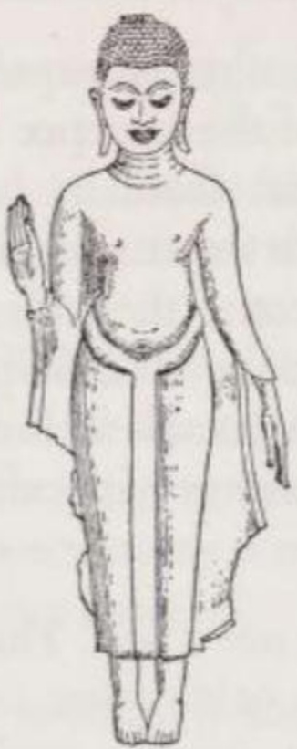
*Đức Phật trong tư thế ban sự an ủi và xoa dịu những phiền não. (Dựa theo một bức tượng đồng Thái Lan chưa rõ niên đại, có lẽ thuộc thế kỷ 15.)*

Giống như việc giáo lý Năm Uẩn giải thích con người là sự kết hợp của các yếu tố vô hồn (không có linh hồn), một giáo lý tương tự cũng giải thích quá trình nhận thức (perception) là một tiến trình không đòi hỏi phải có một Bản ngã đóng vai trò làm chủ thể nhận thức. Khi vị tỳ kheo Moliya-Phagguna đặt câu hỏi về chủ thể nhận thức: "Ai thực hiện sự tiếp xúc? Ai cảm nhận?", ông đã nhận được câu trả lời sau từ Đức Phật:

> Câu hỏi này không hợp lệ... Ta không nói: 'Người đó thực hiện sự tiếp xúc'. Nếu Ta nói (như vậy), câu hỏi phù hợp sẽ là: 'Thưa Thế Tôn, ai thực hiện sự tiếp xúc?' (Nhưng) Ta không nói như vậy. Tuy nhiên, nếu một người hỏi Ta (người không nói câu trên) rằng: 'Thưa Thế Tôn, từ điều kiện tiên quyết nào mà sự tiếp xúc (phát sinh)?', (thì) câu hỏi này là hợp lệ. Câu trả lời đúng ở đây là: 'Từ Sáu Xứ (các giác quan / Sixfold Sphere of sense-Contact) làm điều kiện tiên quyết, sự tiếp xúc (của giác quan) phát sinh; từ sự tiếp xúc (giác quan) làm điều kiện tiên quyết, cảm giác (thọ) phát sinh. ([SN 12, 12, 4 II p. 13](/link?q=SN-12.12))

Các hành vi nhận thức — mà tư duy thiếu tính triết học thường cho rằng phải có một linh hồn đứng sau làm chủ thể — trong Phật giáo được phân giải thành một chuỗi các quá trình phi cá nhân (impersonal processes). Người ta không nên nghĩ: 'Tôi nhận thức', mà nên nghĩ: 'Một quá trình nhận thức đang diễn ra trong Năm Uẩn'. Việc suy diễn từ quá trình nhận thức ra sự tồn tại của một Linh hồn là một sự ngụy biện.

Việc thấu hiểu sâu sắc tính biến hoại (vô thường), tính khổ và tính vô ngã của con người (được cấu thành từ Năm Uẩn) sẽ dễ dàng hơn nếu ta có thể giữ một thái độ khách quan với chính mình. Tuy nhiên, điều này rất khó vì có quá nhiều niềm vui phù du gắn liền với các Uẩn, làm lu mờ đi bản chất khó chịu căn bản của mọi sự tồn tại trong luân hồi. Thế nhưng, khi niềm tin về sự vô ngã bén rễ trong một người, nó sẽ dẫn họ đến sự bình thản và trạng thái tĩnh tâm tuyệt đối. Chỉ những thứ mà một người đồng nhất với bản thân mình mới có khả năng làm xáo trộn tâm trí họ — chỉ những gì liên quan đến 'chính tôi' mới có thể mang lại cho 'tôi' nỗi buồn. Nếu Năm Uẩn, thứ mà ta gọi là con người 'của mình', thực chất không phải là một Bản ngã, thì mọi đau khổ giáng xuống chúng cũng chẳng liên quan gì đến 'tôi'. Tất nhiên, thái độ này không làm dịu cơn đau thể xác, nhưng nó giúp người ta chịu đựng và vượt qua nó về mặt tinh thần. Phật giáo tin chắc rằng sự an lạc của một người không được quyết định bởi hoàn cảnh mà họ đang sống, mà bởi sự làm chủ của họ đối với hoàn cảnh đó.

Tiên đề của Phật Cồ-đàm cho rằng con người thực nghiệm không phải là một Bản ngã và cũng không chứa đựng một Bản ngã, đã khiến một số Phật tử phương Tây giả định rằng Ngài ủng hộ quan điểm về một Bản ngã hoặc Linh hồn nằm ngoài Năm Uẩn: *Nếu Linh hồn không nằm trong các Uẩn thì nó phải ở một nơi nào khác, tức là mang tính siêu việt (transcendent).* Quan điểm này là kết quả của những suy đoán[^9] mà Phật Cồ-đàm sẽ không bao giờ chấp thuận. Ngài luôn răn dạy các đệ tử rằng Năm Uẩn không có bản ngã; Ngài không nói thêm bất cứ điều gì về chủ đề này.

Thái độ của Ngài đối với vấn đề này được thể hiện rõ qua một đoạn trong Tương Ưng Bộ Kinh (Saṃyuttanikāya 44, 10, 3 ff. IV p. 400 f.), khi tu sĩ du phương Vacchagotta hỏi Ngài liệu Bản ngã có tồn tại hay không. Đức Phật từ chối trả lời. Vì ở Ấn Độ, Bản ngã luôn được hình dung là một thứ gì đó vĩnh cửu, nên nếu trả lời "có", điều đó đồng nghĩa với việc không có khả năng dập tắt cá tính trong trạng thái giải thoát. Mặt khác, nếu trả lời "không", người hỏi sẽ phỏng đoán rằng không có sự tái sinh. Cả hai lựa chọn này đều mâu thuẫn với giáo lý Phật giáo và không câu trả lời nào giúp người hỏi hiểu được rằng con người thực nghiệm chỉ là một mớ các hiện tượng mà không có bất kỳ cốt lõi nào trường tồn.

Đối với Đức Phật, câu hỏi về Bản ngã là không quan trọng. Tư duy của Ngài không vận hành dựa trên các khái niệm về 'hữu thể' (being) và 'thực thể' (substance), mà dựa trên các quá trình 'trở thành' (becoming) và các mối quan hệ phụ thuộc có điều kiện (conditional dependencies). Ngay cả giáo lý về sự tái sinh cũng không đòi hỏi phải có một Bản ngã, như sẽ được trình bày trong phần tiếp theo.

### 3. (PHỤ LỤC): SỰ TỒN TẠI KHÁCH QUAN VÀ CHỦ QUAN (EXCURSUS: OBJECTIVE AND SUBJECTIVE EXISTENCE)

Phật giáo nguyên thủy coi thế giới là có thực và hiểu rằng thế giới đồng nhất với các hiện tượng của nó. Khi các hiện tượng này biến mất, thế giới cũng ngừng tồn tại. Khái niệm về một "vật tự thân" (thing in itself) nằm đằng sau các hiện tượng hoặc một "Cái Tuyệt Đối" (Absolute) đều bị bác bỏ.

Tuy nhiên, Phật giáo phân biệt rõ ràng giữa thực tại khách quan và thực tại chủ quan của thế giới. Qua việc sinh ra, con người bị ném vào thế giới khách quan — nơi cung cấp nền tảng cho sự tồn tại vật lý của họ. Nhưng chỉ sau khi con người nắm bắt thế giới bằng các giác quan và nhận thức được nó, thì thế giới mới trở thành một thực tại tâm lý, và do đó là thực tại chủ quan đối với họ:

> Này các tỳ kheo, Vũ trụ là gì?: Là mắt và sắc (hình ảnh), tai và âm thanh, mũi và mùi, lưỡi và vị, thân và đối tượng xúc giác, ý (tâm trí) và pháp (đối tượng của tâm trí). ([SN 35, 23, 3 IV p. 15](/link?q=SN-35.23))

Theo bản đã làm rõ, cơ thể con người không chỉ có năm như thông thường quan niệm mà có tới sáu cơ quan nhận thức (lục căn); cụ thể, bên cạnh mắt, tai, mũi, lưỡi và xúc giác, còn có 'ý' (*manas* / mind) đóng vai trò là cơ quan tư duy. Nó là công cụ để sản sinh ra các ý tưởng, nhận thức các sự thật phi vật chất, và để hiểu các mối quan hệ giữa sự vật, khái niệm, lý tưởng và/hoặc ký ức. Những dữ kiện thu thập được bởi tâm trí sau đó cấu thành nên nội dung của suy nghĩ, tức là các 'pháp' (*dhamma* / mental objects).

Đức Phật tiếp tục giải thích cơ chế, phải có ba yếu tố hiện diện thì hình thành thế giới nhận thức: (1) sáu cơ quan nhận thức (lục căn) đã đề cập ở trên, (2) các đối tượng tương ứng với chúng (lục trần), và (3) thức (*viññāna*) (là sự nhận biết(3) về các đối tượng(2) của giác quan(1) ). Sự kết hợp của ba yếu tố này chính là nguồn gốc (chủ quan) của thế giới ([SN 12, 44, 3–9 II p. 73](/link?q=SN-12.44)). Trung Bộ Kinh phác thảo lý thuyết này một cách rõ ràng hơn:

> Khi... có mắt và sắc (đối tượng nhìn), thì nhãn thức (ý thức thị giác) phát sinh. Sự gặp gỡ của ba (yếu tố này) là sự tiếp xúc (xúc); từ điều kiện tiếp xúc (phát sinh) cảm giác (thọ); những gì được cảm nhận sẽ được nhận thức (tưởng); những gì được nhận thức sẽ được suy ngẫm; những gì được suy ngẫm sẽ được phóng chiếu (phân biệt / *papañceti*) (thành thế giới bên ngoài)... ([MN 18, I p. III f.](/link?q=MN-18))

Điều tương tự cũng áp dụng cho các cơ quan cảm giác khác.

Đoạn kinh này giải thích quan điểm rằng chúng ta không nắm bắt thế giới như nó vốn là, mà nhận thức thế giới theo cách chúng ta tưởng tượng về nó, dựa trên những ấn tượng mà ta nhận được từ các giác quan. Việc liệu các giác quan có cung cấp một bức tranh chính xác về thế giới hay không không thấy trong kinh, bởi vì chủ đề chính của Phật giáo không phải là thế giới là gì, mà là sinh thể đang cảm nhận trong thế giới đó.

Việc nhận ra rằng thế giới cùng với những đau khổ của nó chỉ trở thành một thực tại cá nhân khi được phản chiếu qua tấm gương ý thức — tự thân nó đã là một sự hiểu biết chứa đựng chìa khóa dẫn đến sự giải thoát. Nó cho phép ta suy luận rằng: sự chấm dứt đau khổ (trong chừng mực đau khổ phát sinh từ những va chạm với thế giới) có thể được thực hiện *bởi* con người và *từ bên trong* con người. Đây chính là ý nghĩa lời dạy của Đức Phật dành cho Rohitassa (Xích-mã):

> Này Hiền giả, Ta tuyên bố rằng ngay trong chính cái thân thể dài một sải này, cùng với nhận thức và suy nghĩ của nó, (chứa đựng) thế giới, nguồn gốc của thế giới, sự chấm dứt của thế giới và con đường dẫn đến sự chấm dứt của thế giới. ([AN 4, 45, 3 II p. 48](/link?q=AN-4.45))

Lý thuyết này còn tiến xa hơn một bước nữa. Bởi vì trong tâm trí mình, con người không chỉ tạo ra thế giới của mình, mà còn tạo ra chính bản thân mình. Một người chỉ thực sự sống khi phản chiếu sự tồn tại của chính mình trong ý thức. Khi ý thức tiêu tan, thì 'danh và sắc' (*nāma-rūpa*), tức là Năm Uẩn (*khandha*), cũng bị loại bỏ về mặt chủ quan:

> Ý thức là vô song, vô tận (và) tỏa sáng khắp nơi; ở đây, nước (và) đất, lửa và gió đều không có chỗ bám; dài và ngắn, tinh tế và thô thiển, đẹp và xấu, 'Danh và Sắc' — tất cả những thứ này đều bị triệt tiêu hoàn toàn: Thông qua sự hủy diệt của ý thức, (tất cả) mọi thứ ở đây sẽ đi đến hồi kết. ([DN 11, 85 I p. 223](/link?q=DN-11.85))

### 4. VÒNG LUÂN HỒI (THE CYCLE OF REBIRTH)

Theo quan điểm của Phật giáo, một kiếp sống đã quá nhiều đau khổ; huống hồ là vô số kiếp sống mà mỗi sinh thể phải trải qua. Bởi vì, như Đức Phật tuyên bố, cái chết hoàn toàn không phải là sự kết thúc của sự tồn tại. Cái chết của một người chưa được giải thoát tất yếu sẽ dẫn đến sự tái sinh của người đó, và trong kiếp sống mới, vòng lặp đau khổ của việc sống và chết lại tiếp diễn. Sinh ra, chết đi, rồi lại sinh ra — đây chính là vòng luân hồi (*saṃsāra*).

Nguyên do khởi thủy của vòng luân hồi này nằm ngoài sự quan tâm của Phật Cồ-đàm, bởi mọi sự suy đoán về nó đều không mang lại lợi ích gì cho việc giải thoát. Ngài dạy rằng chuỗi các kiếp sống trước đây là vô thủy (không có điểm bắt đầu), và thật đáng buồn khi nhìn lại những nỗi khổ luân hồi mà mỗi sinh thể đã phải gánh chịu:

> Này các tỳ kheo, sự lang thang (của các sinh thể trong vòng luân hồi) là bắt nguồn từ vô thủy. Không thể thấy được điểm bắt đầu mà từ đó, các sinh thể, bị mắc kẹt trong sự vô minh (*avijjā*), bị trói buộc bởi sự khao khát (*taṇhā*), cứ mãi lang thang và trôi dạt (trong luân hồi).
> 
> Này các tỳ kheo, các ông nghĩ sao, nước trong Bốn Đại Dương lớn nhiều hơn, hay là nước mắt mà các ông đã tuôn rơi khi lang thang, trôi dạt, than khóc và xót xa trên chặng đường dài này, vì các ông phải nhận những gì mình ghét và không nhận được những gì mình yêu thương?
> ([SN 15, 1, 7 II p. 179](/link?q=SN-15.1))

Nhìn về tương lai cũng ngột ngạt không kém. Những cái chết mới, những lần sinh ra mới, những nỗi khổ mới — đó là tất cả những gì đang chờ đợi phía trước. Tuy nhiên, Giáo pháp (*Dhamma*) của Phật Cồ-đàm không hề bi quan. Vì Ngài chỉ ra khả năng có thể giải thoát khỏi đau khổ, nên giáo pháp này mang một nét lạc quan rất rõ ràng.

### 5. GIÁO LÝ VỀ NGHIỆP (THE DOCTRINE OF KAMMA)

Kinh điển khẳng định rằng người chưa giải thoát, chắc chắn sẽ tái sinh, và không chắc chắn sẽ tái sinh làm người. Và, được sinh ra làm người được coi là một điều hiếm hoi và khó đạt được. Vũ trụ học Phật giáo liệt kê năm, đôi khi là sáu, cõi mà một người có thể tái sinh vào: cõi trời (các vị thần), cõi người, cõi ngạ quỷ (*peta* / spirits), cõi súc sinh, và địa ngục ([MN 12, I p. 73 ff.](/link?q=MN-12)). Một số văn bản còn nhắc đến cõi A-tu-la (*asura* / demons).

Mặc dù tuổi thọ của các sinh thể ở những cõi khác nhau là rất khác nhau — nhưng không ai có thể thoát khỏi cái chết. Sự tồn tại trong địa ngục cũng không phải là vĩnh viễn vô thời hạn, bởi vì không có hành động nào tồi tệ đến mức phải chịu hình phạt đời đời kiếp kiếp. Ở cõi trời cũng vậy. Các vị thần sống lâu hơn và trong hoàn cảnh hạnh phúc hơn con người, nhưng giống như mọi sinh thể khác, họ phải biến hoại ngay khi phước báu từ những việc thiện (nhờ đó mà họ được làm thần) đã cạn kiệt. Ngay cả Phạm Thiên (Brahman Sahampati) — vị thần tối cao trong điện thờ Ấn Độ giáo thời kỳ Phật giáo sơ khai — cũng phải chịu quy luật chung của sự hình thành và hoại diệt ([AN 10, 29, 2 V p. 60](/link?q=AN-10.29)) và không được miễn trừ khỏi cái chết và sự tái sinh.

Tồn tại dưới hình hài con người chắc chắn không phải là cảnh giới cao nhất, nhưng theo quan điểm của Phật giáo, đây lại là cảnh giới thuận lợi nhất cho việc giải thoát. Các sinh thể ở địa ngục, súc sinh, ngạ quỷ và a-tu-la thì quá tăm tối, còn các vị thần trong sự sung sướng của mình lại quá sao nhãng để nhận ra sự cần thiết phải giải thoát. Chỉ khi được tái sinh làm người, họ mới cân bằng và có khả năng được lĩnh hội giáo lý của Đức Phật và đi theo con đường giải thoát. Hơn nữa, việc được gia nhập vào tăng đoàn Phật giáo chỉ dành riêng cho con người. Do đó, hiện thân làm người là đáng khao khát.

Hình thức mà một sinh thể tái sinh sau khi chết hoàn toàn không phải là chuyện ngẫu nhiên. Quy luật nhân quả chi phối điều này giống hệt như các quy luật vật lý, nơi mọi kết quả đều có nguyên nhân của nó và tương ứng với nguyên nhân đó. Khi áp dụng vào lĩnh vực đạo đức và sự tái sinh, triết học Ấn Độ gọi quy luật này là 'Nghiệp' (*kamma* / hành động/việc làm) *(Có lẽ tác giả đã nhầm lẫn giữa Nghiệp(kamma) với Nghiệp quả(vipāka), Nghiệp là việc mình làm, Nghiệp Quả là kết quả của việc mình làm gây ra )*: Sự tái sinh vào hoàn cảnh thuận lợi là do những việc làm tốt (thiện nghiệp), và tái sinh vào hoàn cảnh bất lợi là do những việc làm xấu (ác nghiệp). Phật giáo không có khái niệm 'tội lỗi' (sin), tức là sự vi phạm các điều răn của Chúa hay của một vị thần nào đó. Phật giáo chỉ phân biệt giữa những việc làm thiện/có ích (*kusala* hoặc *puñña*) và những việc làm ác/không có ích (*akusala* hoặc *apuñña*) — tức là những việc làm dẫn đến sự giải thoát và những việc đẩy ta ra xa khỏi sự giải thoát. Cán cân giữa những hành động thiện và ác của một người vào thời điểm cuối đời sẽ quyết định loại hình và chất lượng của những kiếp sống tiếp theo của họ. Khi được hỏi tại sao một số người sinh ra trong hoàn cảnh bất hạnh, còn số khác lại sinh ra trong hoàn cảnh tốt đẹp, bậc đạo sư trả lời:

> Bởi vì hành vi độc ác, hành vi bất chính của họ... một số sinh thể khi thân xác rã rời, sau cái chết... đi vào con đường xấu, đến những nơi đau đớn, vào địa ngục... Nhờ hành vi phù hợp với giáo pháp, hành vi biết suy nghĩ của họ, một số sinh thể khi thân xác rã rời, sau cái chết, đi vào con đường tốt, đến thế giới cõi trời. ([AN 2, 2, 6 I p. 55 f.](/link?q=AN-2.2))

> Nghiệp (Hành động) chia rẽ các sinh thể thành kẻ thấp hèn và người cao quý. ([MN 135, III p. 203](/link?q=MN-135))

Sự tồn tại hiện tại của chúng ta là kết quả của những việc làm do chính chúng ta thực hiện trong các kiếp trước. Cơ thể này là một 'nghiệp cũ' ([SN 12, 37, 3 II p. 65](/link?q=SN-12.37)), và chịu đựng đau khổ có nghĩa là đang gánh chịu hậu quả của nghiệp, tức là "gieo nhân nào gặt quả nấy". Những hình thức tồn tại trong tương lai của chúng ta được quyết định bởi những hành động của chúng ta ngày hôm nay; chúng ta hiện đang đặt nền móng cho 'số phận' tương lai của chính mình. Theo quan điểm của phái Tiểu thừa (Hīnayāna), Nghiệp (*kamma*) là một quy luật tự nhiên mang tính trung lập, không có ngoại lệ và không ai có thể can thiệp. Tuy nhiên, bằng cách hành động thuận theo quy luật đó, con người có thể tận dụng nó để đạt được sự tái sinh mà mình mong muốn. Tất nhiên, không cần phải nói thêm rằng ngay cả sự tái sinh hạnh phúc nhất cũng chưa phải là sự giải thoát.

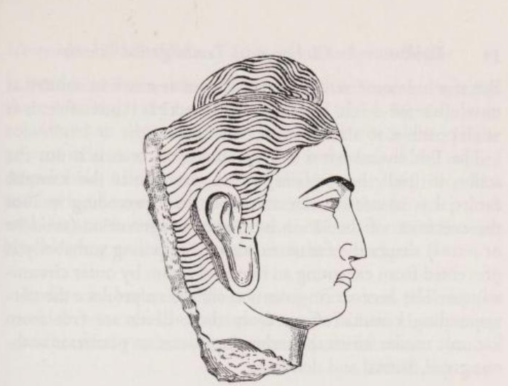

*Đức Phật, phong cách Gandhāra (dựa theo một tác phẩm điêu khắc từ thế kỷ 2-4). Các đường nét khuôn mặt và mái tóc gợn sóng cho thấy nguồn gốc Hy Lạp hóa của nghệ thuật Gandhāra. Búi tóc kiểu Hy Lạp đã được du nhập vào nghệ thuật Ấn Độ và sau này được các nghệ nhân tạo hình bản địa diễn giải thành một phần nhô lên của hộp sọ (nhục kế / uṣṇīṣa).*

Sẽ hoàn toàn sai lầm nếu giải thích giáo lý về Nghiệp giống thuyết định mệnh (determinism/ không thay đổi số phận). Những việc làm trong kiếp trước chỉ ấn định "chất" của một người — ví như môi trường xã hội, ngoại hình và khả năng trí tuệ của họ — chứ hoàn toàn không ấn định những hành động hiện tại của họ. Dù không coi "ý chí tự do" (free will) là một vấn đề cần tranh luận triết học, Phật Cồ-đàm hiển nhiên mặc định rằng bản tính bẩm sinh của mỗi sinh thể luôn cho phép họ có quyền tự do quyết định những hành động sẽ định hình tương lai của chính mình.

Những việc làm thiện giúp con người đạt được sự tái sinh tốt đẹp hơn và nhờ đó đưa họ đến gần hơn với sự cứu rỗi; tuy nhiên, chúng không dẫn thẳng đến sự giải thoát, tức là sự chấm dứt hoàn toàn việc tái sinh. Hành động/Việc làm là thứ hữu hạn nên không thể đơm hoa kết trái vượt ra ngoài ranh giới của sự hữu hạn. Ngay cả hình thức tồn tại tốt đẹp nhất có thể đạt được thì vẫn nằm trong vòng luân hồi. Phật Cồ-đàm về hành động:

> Ta dạy về hành động... cũng như sự không hành động... Ta dạy việc không thực hiện những việc làm xấu bằng thân... khẩu và ý, không làm nhiều điều xấu xa, bất thiện... Ta dạy việc thực hiện những việc làm tốt bằng thân... khẩu và ý, làm nhiều điều thiện. ([AN 2, 4, 3 I p. 62](/link?q=AN-2.4))

Nhưng nếu những hành động thiện cũng trói buộc con người vào luân hồi (*saṃsāra*) giống hệt như những hành động ác, vậy thì người ta nên hành động như thế nào? Liệu có nên, hay liệu có khả thi không, khi ta kiêng khem mọi hành động?

Câu trả lời của Đức Phật mang tính tâm lý học. Ngài giải thích rằng, bản thân hành động không là yếu tô quyết định lớn trong tương lai của Nghiệp, mà động cơ - tức thái độ tâm lý diễn ra trước hành động đó mới là yếu tố quyết định chính yếu: Không phải việc *thực hiện* hành động, mà chính *ý định* hành động (tâm hành / *saṅkhāra* hoặc *cetanā*) mới chính yếu định hình tương lai. Giả sử ai đó bị hoàn cảnh bên ngoài ngăn cản không thực hiện được hành động đã định: Chỉ riêng ý định hành động đó thôi cũng đủ để khắc ghi ra quả báo tương ứng. Chỉ những việc làm mà người tìm kiếm sự giải thoát thực hiện khi không có tham, sân, si mới không bị vướng vào quả báo của nghiệp.

> Bất kỳ hành động nào phát sinh từ sự không tham—sinh ra, có nguồn gốc, và bắt nguồn từ sự không tham—sẽ bị từ bỏ khi tham lam được đoạn trừ. Nó bị cắt đứt tận gốc, làm như gốc cây cọ, bị xóa sạch, và không thể phát sinh trong tương lai. ([AN 3, 34, 2 I p. 135](/link?q=AN-3.34))

Đây chính là con đường dẫn đến sự giải thoát của Phật giáo: hành động không phát sinh từ sự tham lam thành công, không phát sinh từ ý muốn làm hại bất cứ ai và hành động trong lý trí. Nếu không có cách nào để làm việc thiện mà không bị trói buộc bởi Nghiệp, thì sự xiềng xích của con người với luân hồi sẽ không thể nào tháo gỡ được, và con người sẽ chẳng bao giờ có cơ hội thoát khỏi đau khổ.

Việc sự tồn tại của kiếp sau được quyết định mạnh mẽ bởi thái độ tâm lý của người thực hiện nhiều hơn là bởi hành động thực tế cũng dẫn đến một hệ quả: cùng một hành động có thể mang lại những hậu quả khác nhau đối với những người khác nhau. Một hành động có thể gây ảnh hưởng tiêu cực lâu dài đối với một người có đạo đức không vững vàng, nhưng với một người có nền tảng đạo đức tốt, hậu quả của nó có thể chỉ ở mức tối thiểu. Một nắm muối bỏ vào một cái cốc sẽ làm cho nước trong cốc không thể uống được, nhưng cũng lượng muối đó bỏ vào sông Hằng thì nước sông vẫn y nguyên như cũ.
([AN 3, 99 I p. 249 ff.](/link?q=AN-3.99))

Bên cạnh những hành động dẫn đến sự tái sinh, Phật giáo phân biệt những hành động đơm hoa kết trái (trả nghiệp) ngay trong kiếp sống này. Việc một hành động xấu được chuộc lỗi ngay trong kiếp hiện tại thậm chí còn được coi là một lợi thế. Một ví dụ điển hình là trường hợp của tướng cướp Aṅgulimāla. Nhận ra sự sai lầm trong hành vi của mình và khoác áo cà sa tu hành, một ngày nọ ông bị ném đá khi đang đi khất thực. Khi Đức Phật thấy ông chảy máu và áo y rách nát, Ngài đã nói:

> Hãy nhẫn nhục, này Bà-la-môn! Quả báo của một việc làm (nghiệp) mà lẽ ra ông phải chịu sự thiêu đốt nhiều năm... trong địa ngục, nay ông đang trả nghiệp đó ngay trong kiếp sống này. ([MN 86, II p. 104](/link?q=MN-86))

### 6. NGUYÊN NHÂN CỦA SỰ TÁI SINH (THE CAUSE OF REBIRTH)

Đức Phật đã tuyên bố về lực đẩy của vòng luân hồi trong 'Chân lý về Nguồn gốc của Khổ' (Tập đế):

> Này các tỳ kheo, đây là Chân lý Cao quý về Nguồn gốc của Khổ: chính sự khao khát (ái dục / *taṇhā*) dẫn đến tái sinh, nó đi kèm với sự khoái lạc, gắn liền với đam mê (và) tìm kiếm niềm vui ở chỗ này chỗ kia, cụ thể là: khao khát dục vọng, khao khát sự trở thành (tồn tại), khao khát sự hủy diệt. ([(Mv 1, 6, 20 Vin I p. 10](/link?q=vin.mv-1.6) = [S 56, 11, 6 V p. 421](/link?q=SN-56.11))

Sự khao khát (*taṇhā*) — trong các sách Phật giáo đôi khi được dịch là 'sự khát khao' hoặc 'dục vọng' — trói buộc các sinh thể vào luân hồi và đẩy họ từ kiếp này sang kiếp khác:

> Này các tỳ kheo, Ta không thấy có bất kỳ sợi dây trói buộc nào khác khiến các sinh thể phải lao đi, hối hả chạy qua đêm dài (của những lần tái sinh không ngừng nghỉ), ngoài... sợi dây trói buộc của sự khao khát. (Itiv 15)

Sự khao khát, chủ nghĩa vị kỷ của cái "tôi" và "của tôi", có mối liên hệ chặt chẽ với niềm tin sai lầm vào một Bản ngã, một Linh hồn.

'Chân lý về Nguồn gốc của Khổ' phân biệt ba loại khao khát: khao khát dục vọng (dục ái), khao khát sự trở thành (hữu ái) và khao khát sự hủy diệt (phi hữu ái). Quan trọng nhất trong số đó là khao khát dục vọng (*kāma*), đặc biệt vì nó bao gồm cả ham muốn tình dục và mong muốn được hưởng thụ, sở hữu. Bất kể nó có được thỏa mãn hay không, nó đều dẫn đến đau khổ. Trong trường hợp không được thỏa mãn, con người cư xử giống như một cậu bé khóc lóc vì không thể lấy mặt trăng bạc làm đồ chơi. Mặt trăng không làm cậu bé buồn, chính lòng tham của cậu mới là nguyên nhân. Tuy nhiên, nếu sự khao khát được thỏa mãn, thì cảm giác hạnh phúc cũng chỉ tồn tại trong chốc lát. Ngay cả khi đối tượng đạt được không lập tức gây thất vọng, thì việc sở hữu nó cũng nhanh chóng trở thành một thói quen, từ đó người ta lại muốn có nhiều hơn; hơn nữa, đối tượng đó mang tính biến hoại (vô thường) và sẽ dẫn đến nỗi khổ do sự mất mát. Đau khổ là bản chất vốn có của mọi sự khao khát.

Khao khát sự trở thành (hữu ái) là mong muốn có được những hình thức tồn tại mới. Nó tạo ra đau khổ vì nó trói buộc người ta vào vòng luân hồi — nơi mà một người khôn ngoan hơn sẽ cố gắng thoát ra. Khi sự khao khát hướng tới mục tiêu là một cuộc sống không có đau khổ, nó đang nhắm đến một điều bất khả thi, bởi vì mọi sự tái sinh đều mang tính biến hoại (vô thường) và đầy sầu não.

Khao khát sự hủy diệt (phi hữu ái) là mong muốn một điều gì đó khó chịu không xảy ra — một thái độ khiến cho sự việc bị sợ hãi đó kiểm soát tâm trí người ta ngay cả trước khi nó trở thành hiện thực. Theo một nghĩa hẹp hơn, khao khát sự hủy diệt là sự đảo ngược của khao khát tồn tại, cụ thể là sự thôi thúc muốn tự hủy hoại bản thân (tự sát). Tuy nhiên, tự sát không dẫn đến sự giải thoát [^11] vì nó chỉ tiêu diệt cơ thể chứ không tiêu diệt được nghiệp (*kamma*); nó đơn thuần chỉ gây ra sự thay đổi về hình thức tồn tại. Người chưa được giải thoát mà tự sát, sau khi tái sinh sẽ lại phải đối mặt với nghiệp cũ của mình cho đến khi họ thực sự sống vượt qua nó và làm cạn kiệt hoàn toàn quả báo của nó. Việc giải thoát khỏi chuỗi luân hồi tái sinh chỉ có thể thực hiện được thông qua sự dập tắt hoàn toàn, tức là Niết-bàn (*nibbāna*). Nhưng không thể đạt được Niết-bàn thông qua khao khát: ngược lại, Niết-bàn là kết quả của việc tiêu diệt sự khao khát.

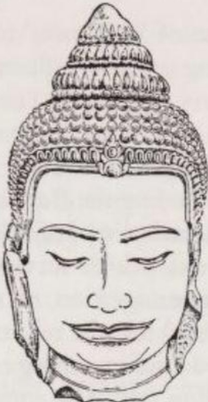
*Đầu của một bức tượng Phật đang thiền định, phong cách Khmer, từ Thái Lan. Chưa rõ niên đại, có lẽ thuộc thế kỷ 12.*

Giống như mọi thứ khác trên thế giới, sự khao khát cũng có nguyên nhân của nó, đó chính là những tiếp xúc về mặt giác quan và tâm lý với các đối tượng. Những trải nghiệm giác quan và ý tưởng dễ chịu sẽ sinh ra khao khát dục vọng và khao khát sự trở thành; những điều khó chịu sẽ sinh ra khao khát sự hủy diệt. Do đó, có thể hiểu tại sao Đức Phật coi việc "phòng hộ các căn" (kiểm soát các cửa ngõ giác quan) là một kỷ luật quan trọng để đạt được giải thoát.

Chắc chắn rằng niềm tin ban đầu của Phật Cồ-đàm là: chỉ riêng sự khao khát (*taṇhā*) là thứ duy trì sự chuyển động của vòng luân hồi sinh tử. Về sau, Ngài bổ sung thêm rằng sự vô minh (*avijjā*) cũng tham gia vào chức năng này. Nếu sự giác ngộ (enlightenment) là thứ giải thoát một người và biến người đó thành một vị Phật hay một bậc thánh, thì hoàn toàn hợp lý khi cho rằng sinh thể chưa được giải thoát đang bị trói buộc bởi chính sự vô minh của mình. Theo nghĩa hẹp, vô minh được hiểu là không nhận thức được sự khổ (theo ý nghĩa triết học Phật giáo) và sự không hiểu biết về giáo lý của Đức Phật; theo nghĩa rộng, nó là sự mù lòa về mặt tâm linh. Nhiều bài Kinh đặt sự khao khát và vô minh cạnh nhau như là những nguyên nhân của đau khổ và nhắc đến chúng cùng nhau.

Các sách Pāli đề cập đến cặp khao khát và vô minh thường xuyên như khi họ nói về bộ ba nguyên nhân gây ra đau khổ (tam độc): tham (*lobha*), sân (*dosa*) và si (*moha*). Sân là mặt trái của khao khát, còn si có ý nghĩa gần với vô minh. Ngay cả khi bộ ba này không đơn thuần chỉ là sự diễn giải chi tiết hơn của cặp đôi kia, thì trên cơ sở thực tế, ta hoàn toàn có thể coi hai công thức này là tương đương nhau.

Một cách sử dụng thuật ngữ dường như xuất hiện muộn hơn đã gọi chung các nguyên nhân của đau khổ bằng cái tên 'lậu hoặc' (*āsava* / influences) hoặc 'phiền não' (*kilesa* / defilements). Việc nhổ tận gốc những lậu hoặc này dẫn thẳng đến sự giải thoát. ([MN 51, I p. 348](/link?q=MN-51))

### 7. DUYÊN KHỞI (CONDITIONED ORIGINATION)

*(ND: có 2 từ pali đều dịch là duyên: 1. paccaya(điều kiện/condition). ví dụ:"hetu yo ca paccayo -> đâu là nhân đâu là duyên -> đâu là gốc nguyên nhân và điều kiện môi trường"  và 2. paṭicca(sự phụ thuộc/dependent), paṭiccasamuppāda -> duyên khởi -> sự sinh từ quan hệ Phụ thuộc*

Những khó khăn trong việc lĩnh hội giáo lý tái sinh của Phật giáo chủ yếu bắt nguồn từ việc Phật Cồ-đàm phủ nhận sự tồn tại của một Bản ngã. Với chúng ta, nếu không có một Bản ngã, hay Linh hồn hay thứ khác tồn tại sau cái chết để nhập vào cơ thể mới và không có sự chuyển kiếp (transmigration), thì theo logic không thể có sự tái sinh nào diễn ra, bởi vì nếu vậy thì cái gì sẽ đi tái sinh?

Theo lời của Đức Phật, sự tái sinh thực sự vận hành mà không cần đến một linh hồn chuyển thế. Sự liên tục của chuỗi tái sinh không nằm ở một nền tảng vật chất bất diệt nào đó, mà nằm ở *sự sinh từ quan hệ Phụ thuộc* (duyên khởi/conditionism) của các hình thức tồn tại: sự sinh này làm điều kiện (duyên) cho sự sinh cái khác. Mặc dù phép so sánh này có phần khập khiễng, nhưng ta có thể minh họa quá trình này bằng các quả bóng bi-da. Việc gõ vào một quả bóng sẽ khiến nó lăn một đoạn và làm cho quả bóng tiếp theo chuyển động. Quả bóng thứ hai này đến lượt nó lại truyền lực đẩy cho quả bóng thứ ba. Không có bất kỳ vật chất nào truyền từ quả bóng thứ nhất sang quả bóng thứ hai và thứ ba, nhưng thông qua sự va chạm, mỗi quả bóng truyền cho quả bóng tiếp theo một chuyển động và một hướng đi nhất định, hoàn toàn không phải ngẫu nhiên. Trong Phật giáo, tư duy dựa trên các thực thể (substances) được thay thế bằng tư duy dựa trên các điều kiện phụ thuộc lẫn nhau (duyên khởi / conditionalities). Trong *chuỗi của sự sinh từ quan hệ Phụ thuộc* (*paṭiccasamuppāda* /Chuỗi Duyên Khởi/ Nexus of Conditioned Origination), các văn bản đã cung cấp nền tảng lý thuyết cho lối tư duy này.

Kinh điển Pāli có nhắc đến vài phiên bản khác nhau của Chuỗi Duyên Khởi, khác biệt nhau ở số lượng các mắt xích. Xét về mặt nội dung, chúng đều song song với nhau, nhưng chỉ có chuỗi hoàn chỉnh với mười hai mắt xích (Thập nhị nhân duyên) mới có thể được dùng làm đối tượng phân tích:
 Từ =điều kiện tiên quyết (1) vô minh (phát sinh) hành;

> Vì có (1) vô minh (nên sinh ra) hành; (Câu thường đọc trong kinh: Vô minh duyên hành))
> 
> vì có (2) hành (nên sinh ra) thức;
> 
> vì có (3) thức: danh và sắc;
> 
> vì có (4) danh và sắc: lục nhập (sáu vùng tiếp xúc giác quan);
> 
> vì có (5) lục nhập: xúc (sự tiếp xúc);
> 
> vì có (6) xúc: thọ (cảm giác);
> 
> vì có (7) thọ: ái (sự khao khát);
> 
> vì có (8) ái: thủ (sự bám víu);
> 
> vì có (9) thủ: hữu (sự trở thành);
> 
> vì có (10) hữu: sinh (sự ra đời);
> 
> vì có (11) sinh phát sinh ra (12) già và chết, sầu, bi, khổ, ưu, não. Đây là nguồn gốc của toàn bộ khối đau khổ này. ([MN 38, I p. 261](/link?q=MN-38)).

Tên tiếng Pāli của công thức này — *paṭiccasamuppāda*, 'sự phát sinh có điều kiện' (duyên khởi) — chỉ ra cách chúng ta nên hiểu về mối quan hệ giữa các mắt xích trong Chuỗi. Đây không phải là sự phụ thuộc nhân quả (causal dependence), bởi vì *causa* (nguyên nhân) là thuật ngữ kỹ thuật chỉ một nguyên nhân duy nhất, không cần bất kỳ yếu tố hỗ trợ nào mà vẫn tự tạo ra kết quả. Sự phụ thuộc của các mắt xích đúng hơn là một 'thuyết điều kiện' (conditionism), vì mỗi mắt xích là một *condition* (điều kiện), tức là một trong số các điều kiện cùng góp phần làm cho mắt xích tiếp theo ra đời. [^ND-4]

Chuỗi Duyên Khởi sẽ dễ hiểu hơn nếu được đặt song song với chuỗi Năm Uẩn (*khandha*) — sắc, thọ, tưởng, hành và thức — những yếu tố kết hợp lại tạo thành con người thực nghiệm. Một số mắt xích xuất hiện trong cả hai chuỗi (cả hai đều được coi là các chuỗi yếu tố có điều kiện). Nhưng làm sao để giải thích việc hai chuỗi này liệt kê các mắt xích giống hệt nhau nhưng lại theo thứ tự khác nhau: chuỗi Năm Uẩn đặt 'hành' (*saṅkhāra*) và 'thức' (consciousness) sau 'sắc' (cơ thể), trong khi Chuỗi Duyên Khởi lại đặt chúng trước 'sắc' (danh và sắc)?

Câu trả lời nằm ở mục đích của cả hai chuỗi. Năm Uẩn liệt kê các thành phần cấu tạo nên một con người; ngược lại, Chuỗi Duyên Khởi nhằm làm sáng tỏ chuỗi các lần tái sinh vượt ra ngoài phạm vi của một cá nhân đơn lẻ. Vì mười hai mắt xích của nó bao trùm tới ba kiếp sống tái sinh, nên nó bao gồm chuỗi Năm Uẩn tới ba lần.[^12]

Trong bảng dưới đây, hai chuỗi được kết hợp theo cách đặt các mắt xích chung của cả hai nằm cạnh nhau, và các mắt xích còn lại được xếp cái này dưới cái kia theo tính duyên khởi của chúng.

#### Năm Uẩn (The Five Groups)
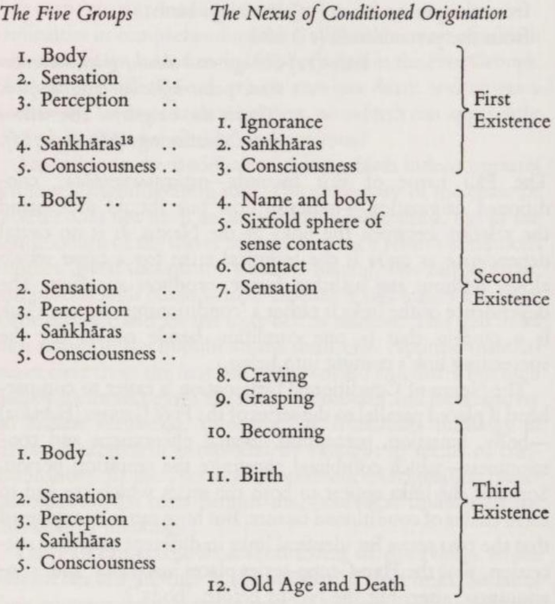

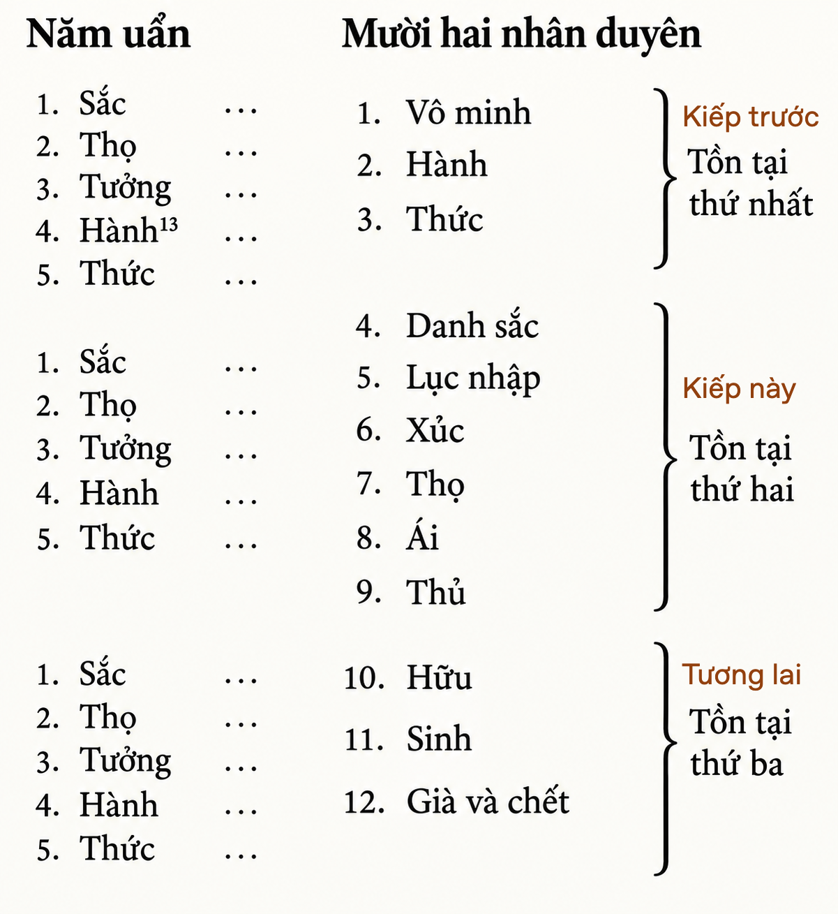

Sự đối chiếu này bộc lộ hai điểm yếu của Chuỗi Duyên Khởi: 
1. Tại sao mỗi kiếp sống trong ba kiếp tái sinh lại được phác thảo bằng những từ ngữ khác nhau? 
2. Tại sao Kiếp Thứ Nhất chỉ nhắc đến vô minh, còn Kiếp Thứ Hai chỉ nhắc đến khao khát (ái) như là nguyên nhân của lần tái sinh tiếp theo? Đáng lẽ ra, nguyên nhân của sự tái sinh phải luôn giống nhau: hoặc là vô minh, hoặc là khao khát, hoặc là cả hai kết hợp lại.

Chỉ có một cuộc kiểm chứng lịch sử mới có thể trả lời những câu hỏi này. Chuỗi Duyên Khởi thực chất được hình thành thông qua việc liên kết ba chuỗi điều kiện vốn tách biệt nhau (có thể bao gồm các mắt xích 1 đến 4; 4 đến 8; và 8 đến 12) mà Phật Cồ-đàm đã sử dụng trong các bài giảng của mình suốt sự nghiệp giảng pháp lâu dài. Rõ ràng, các nhà sư thời kỳ đầu tin rằng bằng cách kết hợp chúng lại và từ đó tạo ra Chuỗi Duyên Khởi (Thập nhị nhân duyên), họ đã tạo ra một bước tiến lớn. Nếu không, họ đã chẳng dành nhiều không gian đến thế cho Chuỗi này trong kinh điển, cũng như không mạo hiểm gán cho nó là lời dạy của sư phụ mình.
[^ND-5](/giao-ly-va-truong-phai-phat-giao/notes-nd#5){.note}

### 8. CHI TIẾT VỀ CHUỖI DUYÊN KHỞI (THE NEXUS OF CONDITIONED ORIGINATION IN DETAIL)

VÔ MINH (*avijjā*), mắt xích mở đầu cho công thức, được định nghĩa trong các nguồn tài liệu Pāli như sau:

> Không biết về khổ, về nguồn gốc của khổ, về sự chấm dứt của khổ (và) về con đường dẫn đến sự chấm dứt của khổ — đây... được gọi là vô minh. ([MN 9, I p. 54](/link?q=MN-9))

Theo đó, vô minh - không hiểu biết, không được hiểu là sự thiếu kiến thức thông thường, mà cụ thể là sự không hiểu về với Tứ Diệu Đế — cách mà Đức Phật sắp xếp giáo lý của mình. Người nào không biết đến giáo pháp và chìm trong sự mù lòa tâm linh, không nhận ra được nỗi khổ bao trùm của mọi sự tồn tại luân hồi — người đó từ sự vô minh của mình sẽ phát sinh ra các 'hành' (*saṅkhāras* / ý định hành động). Và chính những 'hành' này sẽ quyết định loại hình tái sinh tiếp theo của họ.

'HÀNH' (*saṅkhāra*) có nhiều nghĩa trong kinh điển Phật giáo. Trong Chuỗi Duyên Khởi cũng như trong giáo lý về Nghiệp, nó mang ý nghĩa là các ý định (*cetanā*), đặc biệt là các *ý định hành động* diễn ra trước khi hành động được thực hiện. Vì hành động hay việc làm có thể thuộc về thân, khẩu và ý, nên người ta cũng phân biệt giữa ý định của thân (thân hành), ngôn ngữ (khẩu hành) và suy nghĩ (ý hành). ([SN 12, 2, 14 II p. 4](/link?q=SN-12.2))

Các ý định hành động — hơn cả bản thân hành động thực tế — mang tính quyết định đối với sự tái sinh:

> Này các tỳ kheo, Ta sẽ chỉ cho các ông thấy sự tái sinh theo các ý định hành động... Có... một vị tỳ kheo có niềm tin kiên định (*saddhā*)... Trong vị ấy nảy sinh (suy nghĩ): 'Ôi, giá như sau khi thân xác rã rời, sau khi chết, ta được tái sinh vào một cộng đồng những chiến binh giàu có!' Vị ấy duy trì suy nghĩ này, bám giữ suy nghĩ này, nuôi dưỡng suy nghĩ này. Các ý định hành động của vị ấy và việc vị ấy cứ đắm chìm (vào chúng) sẽ dẫn vị ấy tái sinh ở đó (trong cộng đồng đó). ([MN 120, III p. 99 f.](/link?q=MN-120))

Đoạn kinh này chỉ ra rằng các ý định hành động không chỉ gây ra sự tái sinh, mà còn quyết định loại hình và chất lượng của sự tái sinh đó.

Cách chúng làm điều này được giải thích vô cùng chi tiết trong các tài liệu Pāli. Ý định hành động có thể có ba tính chất: thiện, ác và trung tính. Tính chất của THỨC (*viññāna* / ý thức) phát sinh dựa trên các ý định hành động sẽ hoàn toàn khớp với tính chất của chính những ý định đó:

> Này các tỳ kheo, khi một kẻ vô minh nảy sinh một ý định hành động thiện (*saṅkhāra*), ý thức của hắn (*viññāna*) sẽ hướng về cái thiện. Khi hắn nảy sinh một ý định hành động ác, ... một ý định hành động trung tính, ý thức của hắn sẽ hướng về cái ác, ... hướng về cái trung tính. ([SN 12, 51, 12 II p. 82](/link?q=SN-12.51))

Sau khi một sinh thể chết đi, ý thức thiện, ác hoặc trung tính của người đó sẽ đi vào một tử cung thiện, ác hoặc trung tính tương ứng, và tạo ra tại đó sự khởi nguồn của DANH VÀ SẮC (*nāma-rūpa*), tức là một con người thực nghiệm mới (thiện, ác hoặc trung tính):

> Từ điều kiện tiên quyết là thức (phát sinh ra) Danh và Sắc, Ta đã tuyên bố như vậy. Điều này... phải được hiểu như sau...: Nếu... thức (của một sinh thể đã chết) không đi vào tử cung của một người mẹ, thì Danh và Sắc có thể phát sinh trong tử cung này không? — Chắc chắn là không, thưa Thế Tôn! (vị tỳ kheo được hỏi trả lời). ([DN 15, 21 II p. 62 f.](/link?q=DN-15.21))

Ý thức của người đầu thai đi vào tử cung của người mẹ tương lai; nó không là 'con người với kinh nghiệm' đi tái sinh hình thành trong tử cung. Cái 'ý thức' đi vào đó không phải là một Linh hồn hay Bản ngã (*attan*) chuyển sang hình thức tồn tại mới. Có thể hình dung nó hoạt động giống như một chất xúc tác kích hoạt một phản ứng hóa học, nhưng không còn hiện diện trong sản phẩm cuối cùng của phản ứng đó.

Trong Trung Bộ Kinh ([Majjhimanikāya 38 I p. 258](/link?q=MN-38.26)), Phật Cồ-đàm bác bỏ quan điểm cho rằng ý thức là một thực thể vĩnh cửu di cư qua chuỗi tái sinh. Quan điểm đúng đắn là: 'Ý thức này quay trở lại (*paccudāvattati*), (trong Chuỗi Duyên Khởi) nó không đi xa hơn Danh và Sắc' ([DN 14, 2, 19 II p. 32](/link?q=DN-14.2)). Người được tái sinh sẽ phát triển ý thức của riêng mình, và ý thức này không đồng nhất với ý thức trong kiếp trước của họ. *(ND: tôi đọc tài liệu [DN 14, 2] nhưng không tìm thấy thông tin như tác giả nói)*

Xin nhắc lại: Việc ý thức đi vào tử cung nào phụ thuộc vào khuynh hướng nghiệp của chính ý thức đó. Một ý thức nảy sinh từ những ý định hành động thiện (do đó mang tính chất tốt đẹp), sau khi 'chủ nhân' hiện tại của nó qua đời, sẽ tìm kiếm một tử cung tốt đẹp tương ứng với những tố chất di truyền thuận lợi. Miễn là các điều kiện sinh học được đáp ứng,[^14] nó sẽ kích thích sự phát triển của một sinh thể mới trong tử cung này mà không cần bản thân nó phải biến đổi thành sinh thể đó. Sau khi sinh thể mới ra đời, chất lượng tồn tại của người đó sẽ hoàn toàn phù hợp với chất lượng của những ý định hành động vốn là nguyên nhân (nghiệp) tạo ra người đó. Giáo lý về nghiệp (*kamma*) theo đó đã được mô tả chi tiết về cách thức hoạt động.

Các mắt xích từ 5 đến 12 của Chuỗi Duyên Khởi không quá khó hiểu. Thuật ngữ LỤC NHẬP (*saḷāyatana* / sáu vùng tiếp xúc giác quan) ám chỉ các trường đối tượng hiện diện trước sáu giác quan — thị giác, thính giác, khứu giác, vị giác, xúc giác và ý nghĩ — của sinh thể mới sau khi chào đời. Giữa sáu vùng giác quan (tức là thế giới đối tượng) và các cơ quan cảm giác, sự XÚC (*phassa* / tiếp xúc) diễn ra và tạo ra THỌ (*vedanā* / cảm giác), thứ sẽ nhanh chóng phát triển thành ÁI (*taṇhā* / khao khát). Sự khao khát lại tiếp tục dẫn dắt ý thức của sinh thể đó sau khi chết đi đến một sự THỦ (*upādāna* / bám víu) mới vào một tử cung. Tại đây, ý thức gây ra sự HỮU (*bhava* / trở thành) của một sinh thể mới, dẫn đến sự SINH (*jāti* / ra đời) vào một kiếp sống đầy đau khổ. Và kết cục lại là GIÀ và CHẾT (*jarā-maraṇa*).

### 9. NGUỒN GỐC DO DUYÊN SINH LÀ NỀN TẢNG CỦA SỰ TỒN TẠI CÁ NHÂN

Trong kinh điển Pāli, một vị tì kheo đặt câu hỏi về chủ thể gánh vác chuỗi sự kiện duyên sinh này: Các hiện tượng được nhắc đến trong Chuỗi Duyên khởi (Nexus of Conditioned Origination) thuộc về ai, và xảy ra cho ai? Đức Phật đáp:

> Câu hỏi (này) là không hợp lệ... Nếu một vị tì kheo hỏi: 'Những (hiện tượng được nhắc đến trong Chuỗi Duyên khởi) là gì... và chúng thuộc về ai...?', (thì câu trả lời nên là:) 'Cả hai điều này là một, chỉ khác nhau ở cách diễn đạt'... Bậc Chân nhân (The Perfect One / Như Lai) thuyết giảng giáo lý chân thật (nằm) ở khoảng giữa: Từ (mắt xích đi trước trong Chuỗi Duyên khởi)... làm điều kiện tiền đề, (mắt xích tiếp theo) phát sinh... ([SN 12, 35, 3 ff. II p. 61 ff.](/link?q=SN-12.35))

Chuỗi Duyên khởi này không có 'chủ thể gánh vác' (bearer), và cũng không tựa vào một thực thể cốt lõi (substance) nào. Thay vào đó, chính từ sự tiếp nối của các yếu tố tồn tại ngắn ngủi trong chuỗi này, một cá nhân thực nghiệm (empirical individual / con người bằng xương bằng thịt) và chuỗi luân hồi của người đó được hình thành. Tồn tại là một quá trình liên tục biến đổi (fluctuation), chứ không phải là một trạng thái tĩnh tại (being). Giống như các âm thanh được sắp xếp lại tạo thành một giai điệu, các hiện tượng ngắn ngủi sinh ra do duyên cũng tạo nên chuỗi các kiếp sống như vậy. Chuỗi Duyên khởi = con người thực nghiệm = sự khổ — đây chính là công thức nền tảng cho quan niệm của Phật giáo về con người.

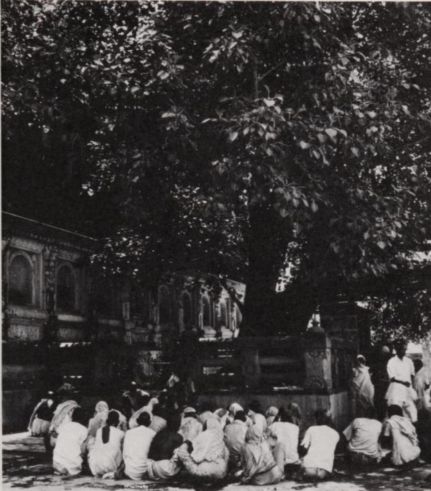

*Bodh-Gayā (Bồ Đề Đạo Tràng) không chỉ là nơi linh thiêng đối với Phật tử mà cả với tín đồ Ấn Độ giáo. Vào thế kỷ thứ 8, những người theo Ấn Độ giáo đã tuyên bố Đức Phật là Hóa thân thứ chín của Thần Visnu. Đền Mahābodhi và cây Bồ đề hiện nay được đặt dưới sự quản lý chung của cả Ấn Độ giáo và Phật giáo. Tín đồ Ấn Độ giáo và Phật tử hòa hợp gặp gỡ nhau dưới bóng cây hậu duệ của cây Bồ đề để tôn vinh vị đạo sư vĩ đại.*

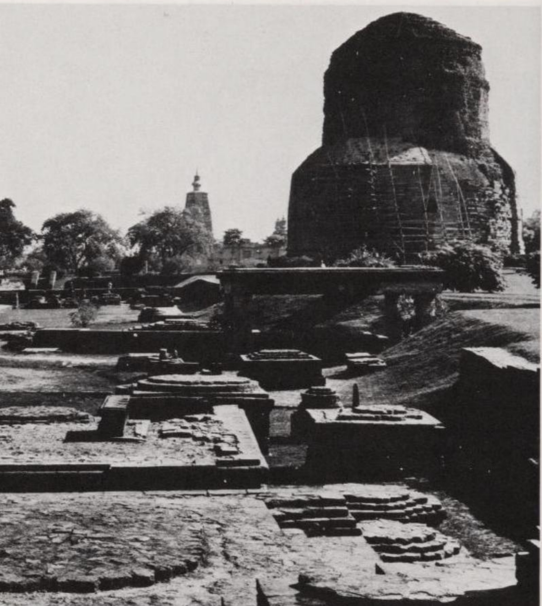

*Sārnāth (Lộc Uyển) gần Benares, nơi Đức Phật thuyết bài pháp đầu tiên và thành lập tăng đoàn. Tháp Dhamekh với hình dáng hiện tại (cao 44 m) được hoàn thành vào khoảng từ thế kỷ thứ 4 đến thứ 6 sau Công nguyên. Cốt lõi bên trong tháp là một tháp gạch nhỏ từ thời vua Asoka (A-dục). Nơi đây đánh dấu vị trí Gotama (Cồ-đàm) thuyết pháp cho năm vị đạo sĩ khổ hạnh, những người sau này trở thành các đệ tử đầu tiên của ngài. Một tháp thứ hai của thời Asoka, vốn được bọc thêm nhiều lớp trong các thời kỳ sau, đã bị phá hủy vào năm 1794 để lấy gạch; những xá lợi của Đức Phật tìm thấy trong đó đã bị ném chìm xuống sông Hằng.*

*Về ngôi đền Mūlagandhakūṭī (Hương thất), vốn cao 60 m, đánh dấu nơi Đức Phật thiền định và từng được Huyền Trang mô tả vào thế kỷ thứ 7, nay chỉ còn lại các bức tường nền móng. Bảy tu viện khác cũng chịu chung số phận, trong đó tu viện cổ nhất có từ thế kỷ thứ 2 trước Công nguyên, và tu viện mới nhất từ thế kỷ thứ 12. Từ thế kỷ thứ 13 trở đi, Sārnāth rơi vào cảnh hoang tàn.*

Gắn liền với hình ảnh này về cá nhân là vấn đề về sự đồng nhất (identity) giữa các sinh thể qua một chuỗi các kiếp tái sinh. Vị đạo sĩ khổ hạnh lõa thể Kassapa đã hỏi Đức Phật rằng theo giáo lý của ngài, người phải chịu hậu quả của những hành động (kamma / nghiệp) trong quá khứ dưới hình thức tái sinh là chính người đó hay là một người khác. Gotama đáp:

> Khi nói: 'Người đó hành động, (chính) người đó thọ hưởng (quả của hành động)',... người ta đi đến (nhận định về con người) là vĩnh cửu. Khi nói: 'Một người hành động, một người khác thọ hưởng (quả của hành động)',... người ta đi đến (nhận định về con người) là có thể bị tiêu diệt. Không rơi vào thái cực nào, Bậc Chân nhân đã chỉ ra giáo lý (nằm) ở khoảng giữa: Từ sự vô minh (ignorance) làm điều kiện tiền đề, (phát sinh) các ý định hành động (action-intentions / hành)... (v.v.). ([SN 12, 17, 14 ff. II p. 20](/link?q=SN-12.17))

Vì không có một Bản ngã (Self / Ngã) bất tử nào chạy xuyên qua các kiếp sống khác nhau giống như một sợi chỉ lụa xâu chuỗi các hạt ngọc trai, nên không thể nói người gặt hái quả từ những hạt giống hành động (kammic seeds / nghiệp nhân) của các kiếp trước trong lần tái sinh là cùng một người. Mặt khác, người được tái sinh cũng không hoàn toàn khác biệt, bởi vì mỗi hình thức tồn tại đều bị gây ra bởi, và tiếp nối từ, kiếp sống trước đó của nó, giống như một ngọn lửa được thắp lên từ một ngọn lửa khác. Sự thật nằm ở giữa sự đồng nhất (identity) và sự tách biệt hoàn toàn (isolation): Đó là sự phụ thuộc lẫn nhau theo điều kiện (conditional dependence / duyên sinh).

Mặc dù không có một nền tảng cốt lõi (substratum) nào nối kết các sinh thể trong chuỗi tái sinh, người ta vẫn cho rằng việc nhớ lại các tiền kiếp của mình là điều có thể, tất nhiên chỉ ở một mức độ hoàn thiện cao. Khi mô tả trải nghiệm giác ngộ của mình, Gotama kể:

> Ta nhớ lại nhiều kiếp sống trước đây, cụ thể là một kiếp, hai..., ba..., bốn..., năm..., mười..., hai mươi..., năm mươi..., một trăm kiếp: ... Ở đó ta đã hiện hữu, mang tên đó, thuộc gia đình đó, giai cấp đó là của ta, sinh kế đó là của ta, ta đã trải qua những hạnh phúc và đau khổ như vậy, đó là kết cục của ta; sau khi qua đời, ta lại tái sinh ở nơi kia: ở đó ta đã hiện hữu, mang tên đó... ([MN 36, I p. 248](/link?q=MN-36))

### 10. SỰ CHẤM DỨT KHỔ ĐAU

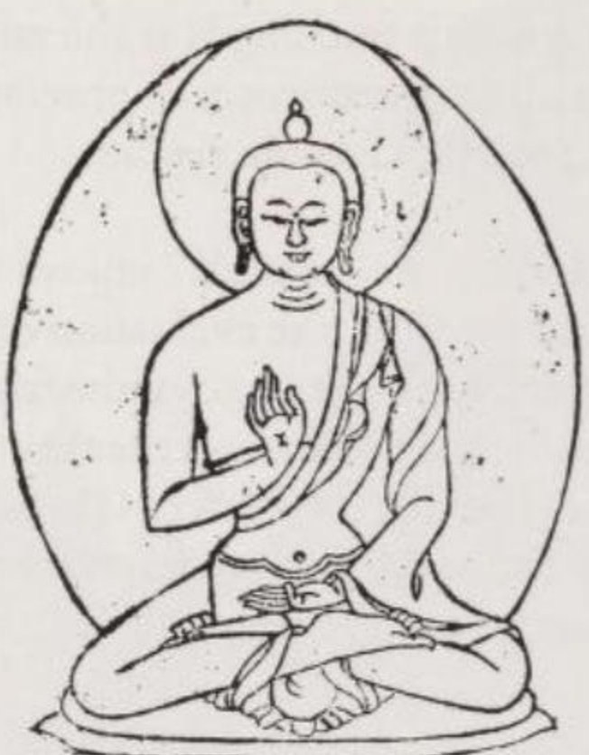

*Gotama đang giảng giải giáo pháp. Bàn tay phải giơ lên với lòng bàn tay hướng ra ngoài thể hiện việc không giấu giếm bất kỳ kiến thức nào có thể dẫn đến sự giải thoát. Bàn tay trái đặt ở tư thế thiền định. (Bản khắc gỗ Tây Tạng.)*

Theo 'Sự thật về Nguồn gốc của Khổ đau' (Tập đế), vì sự khao khát (craving / taṇhā / ái) là nguyên nhân gây ra khổ đau, nên việc chấm dứt khổ đau là điều có thể thực hiện được thông qua việc tiêu diệt sự khao khát:

> Này các tì kheo, đây là Sự thật Cao quý về sự chấm dứt khổ đau; đó là sự dập tắt hoàn toàn, sự phá hủy, sự từ bỏ, sự chối bỏ, sự rời xa (và) rũ bỏ chính sự khao khát này. (Mv 1, 6, 21 Vin I p. 10 = S 56, 11, 7 V p. 421) 

Cùng với việc nhổ tận gốc sự khao khát, vòng luân hồi đau khổ sẽ đi đến hồi kết đối với sinh thể đó.

Các văn bản khác chỉ ra rằng vô minh (ignorance / avijjā), bên cạnh sự khao khát, cũng là nguyên nhân gây ra nỗi khổ luân hồi, có nghĩa là sự thiếu hiểu biết về Bốn Sự thật Cao quý (Tứ Diệu Đế) của Phật giáo. Như có câu nói:

> Những ai cứ mãi bước vào\
> vòng quay của sự sinh và tử:\
> Từ kiếp sống này sang kiếp sống tới\
> họ bước đi bởi chính sự vô minh của mình.
(Snip 729)

Do đó, vô minh cũng phải được nhổ bỏ tận gốc nếu muốn tìm kiếm sự giải thoát. Mục tiêu này không bao giờ có thể đạt được nếu không có sự giác ngộ (enlightenment / bodhi), nghĩa là không nhận ra bản chất đau khổ của mọi sự tồn tại và không nắm bắt được khả năng có thể tiêu diệt khổ đau.

Việc tiêu diệt sự khao khát và vô minh mang lại sự giải thoát bằng cách nào?

Bằng cách chấm dứt quá trình tạo hành động (kamma process / quá trình tạo nghiệp). Theo học thuyết về Hành động (Kamma), mọi hành động đều mang lại những hệ quả tương ứng về mặt tính chất, ngoại trừ những hành động được thực hiện mà không có sự tham lam, thù hận và ảo tưởng — nói cách khác: không có khao khát và vô minh. Người nào không còn bị trói buộc vào vòng luân hồi bởi các hành động hoặc ý định hành động của mình thì người đó đã tiến gần đến sự dập tắt hoàn toàn (extinction / nibbāna / niết-bàn).

### 11. CON ĐƯỜNG TÁM NHÁNH ĐỂ CHẤM DỨT KHỔ ĐAU

Nếu cho rằng trong kiếp sống hiện tại, có nhiều hơn một số ít những người tìm kiếm bậc cao có thể chiến thắng được sự khao khát và vô minh, thì đó là đánh giá quá cao con người. Hầu hết mọi người sẽ cần một thời gian dài, một chuỗi dài các kiếp tái sinh, trong đó thông qua những việc làm tốt, họ dần dần vươn lên những hình thức tồn tại tốt đẹp hơn. Tuy nhiên, cuối cùng, mọi người đều sẽ có được một thân thế với những tiềm năng đạo đức to lớn đến mức họ có thể tự mình tiêu diệt sự khao khát và vô minh, từ đó thoát khỏi sự bắt buộc phải tái sinh. Người ta tin chắc rằng tất cả những ai phấn đấu vì sự giải thoát thì sớm muộn gì cũng sẽ đạt được nó.

Đức Phật không nói về mục tiêu cao nhất này với mọi thính giả để tránh làm họ nản lòng ngay từ đầu. Ngài thường nhắc nhở những người không phải là Phật tử và những người giản dị trong số các cư sĩ tại gia về bổn phận của họ đối với gia đình và xã hội, đồng thời khuyên họ làm những việc thiện để nhận được quả báo tái sinh lên cõi trời. Tuy nhiên, ngài nói rõ với những cư sĩ thông tuệ hơn và các tì kheo rằng việc tái sinh lên cõi trời chỉ là một mục tiêu tạm thời vì nó vẫn nằm trong cõi luân hồi (saṃsāra). Mục tiêu cuối cùng phải là sự giải thoát khỏi luân hồi: Nibbāna (Niết-bàn), điều chỉ có thể đạt được bằng cách nhổ tận gốc rễ các nguyên nhân của khổ đau, cụ thể là sự khao khát và vô minh.

Sự thật thứ tư của Gotama trình bày cách thức để đạt được sự tự do hoàn toàn khỏi khổ đau. Vì cần phải nhổ bỏ cả sự khao khát lẫn vô minh, nên nó bao gồm các quy tắc tự kỉ luật giúp tiêu diệt sự khao khát, đồng thời đòi hỏi về mặt trí tuệ để có được Cái nhìn Đúng đắn (Right View / Chánh kiến = chấm dứt vô minh).

> Này các tì kheo, đây là Sự thật Cao quý về Con đường dẫn đến Sự chấm dứt Khổ đau, bao gồm:

> (1) Cái nhìn Đúng đắn (Right View / Chánh kiến),\
> (2) Quyết tâm Đúng đắn (Right Resolve / Chánh tư duy),\
> (3) Lời nói Đúng đắn (Right Speech / Chánh ngữ),\
> (4) Hành vi Đúng đắn (Right Conduct / Chánh nghiệp),\
> (5) Kế sinh nhai Đúng đắn (Right Livelihood / Chánh mạng),\
> (6) Nỗ lực Đúng đắn (Right Effort / Chánh tinh tấn),\
> (7) Sự tỉnh giác Đúng đắn (Right Awareness / Chánh niệm),\
> (8) Sự thiền định Đúng đắn (Right Meditation / Chánh định). (Mv 1, 6, 22 Vin I p. 10 = S 56, 11, 8 V p. 421)

Những quy tắc này không phải là từng chặng đường mà người tìm kiếm phải vượt qua lần lượt, mà là những phẩm chất cần được phát triển đồng thời. Mối liên hệ chặt chẽ giữa chúng khiến cho việc bỏ qua một quy tắc sẽ cản trở việc thực hiện những quy tắc còn lại. 

*(Ghi chú: Tác giả nhấn mạnh Bát Chánh Đạo là một hệ thống đồng bộ, không phải là các bước tuần tự từ 1 đến 8).*

Một số văn bản chia Con đường Tám nhánh này thành ba nhóm, cụ thể là:

- trí tuệ (wisdom / paññā) — gồm nhánh 1 và 2
- đạo đức (morality / sīla) — gồm nhánh 3 đến 5, và
- thiền định (meditation / samādhi) — gồm nhánh 6 đến 8.

Giống như bản thân Con đường Tám nhánh, sự phân chia làm ba phần này không nên được xem như một chuỗi các giai đoạn nối tiếp nhau. Nếu không, nó sẽ mâu thuẫn với các tuyên bố khác trong các nguồn tài liệu Pāli, vốn coi trí tuệ là phẩm chất cao nhất ngay trước khi đạt được sự giải thoát.

Dưới đây là chi tiết các quy tắc của Con đường Tám nhánh.

(1) Cái nhìn Đúng đắn (Right View / sammā-diṭṭhi / Chánh kiến) là sự hiểu biết về Bốn Sự thật của Phật giáo ([DN 22, 21 II p. 312](/link?q=DN-22.21)) và sự nhận thức rằng 'không có một Bản ngã nào là của ta (và) những gì sinh ra... (rồi) biến hoại (vô thường / perishes) chỉ là sự khổ' ([SN 12, 15, 6 II p. 17](/link?q=SN-12.15)). Người nào tin chắc vào tính vô ngã (non-selfness) thì đã tiến một bước dài tới việc tiêu diệt khổ đau, bởi vì điều gì có thể làm lay chuyển một người khi họ biết rằng không có sự kiện nào liên quan đến 'họ' (cái tôi của họ)?

Cái nhìn Đúng đắn còn bao gồm việc vứt bỏ Bốn Quan điểm Sai lệch (Four Perverse Views / vipallāsa / Tứ điên đảo), đó là: tìm kiếm một cái gì đó thường hằng trong cái biến hoại (vô thường), tìm kiếm hạnh phúc trong sự khổ, tìm kiếm một Bản ngã trong cái vô ngã và tìm kiếm vẻ đẹp trong những thứ xấu xí ([AN 4, 49, 1 II p. 52](/link?q=AN-4.49)).

(2) Quyết tâm Đúng đắn (Right Resolve / sammā-saṅkappa / Chánh tư duy) được chia làm ba phần: quyết tâm từ bỏ (dục vọng), quyết tâm hướng thiện (từ tâm) và quyết tâm không làm hại các sinh thể sống ([DN 22, 21 II p. 312](/link?q=DN-22.21)).

Nhóm 'đạo đức' bao gồm ba quy tắc tiếp theo (3, 4 và 5). Chúng chủ yếu nhằm mục đích tích lũy công đức từ hành động (kammic merit / puñña) để tạo nền tảng cho sự tái sinh tốt đẹp hơn. Nhưng vì chúng hướng cả vào bên trong lẫn ra bên ngoài, nên chúng cũng mang lại lợi ích cho các sinh thể khác.

(3) Lời nói Đúng đắn (Right Speech / sammā-vāca / Chánh ngữ) là lời nói không bao gồm sự dối trá, chuyện ngồi lê đôi mách, sự lăng mạ và những lời nói nhảm nhí ([DN 22, 21 II p. 312](/link?q=DN-22.21)). Không nên phung phí lời nói vào mọi chủ đề:

> Những điều được thấy..., mà qua đó các hiện tượng tinh thần xấu xa (unwholesome mental phenomena / dhamma / ác pháp) của người nói gia tăng và các hiện tượng tinh thần tốt đẹp (wholesome mental phenomena / thiện pháp) giảm đi, những điều đó không nên nói ra, ta dạy như vậy. Tuy nhiên, những điều được thấy..., mà qua đó các hiện tượng tinh thần xấu xa của người nói suy giảm và các hiện tượng tinh thần tốt đẹp gia tăng, những điều đó nên được nói ra, ta dạy như vậy. ([AN 4, 183, 3 II p. 173](/link?q=AN-4.183))

(4) Hành vi Đúng đắn (Right Conduct / sammā-kammanta / Chánh nghiệp) có nghĩa là tránh tước đoạt sinh mạng, tránh lấy những thứ không được cho và tránh sự trụy lạc ([DN 22, 21 II p. 312](/link?q=DN-22.21)). Việc những lệnh cấm này được coi trọng đến mức nào thể hiện qua bộ luật của tu viện, trong đó việc coi thường chúng sẽ phải chịu hình phạt kỉ luật nghiêm khắc nhất (chỉ áp dụng cho bốn tội), đó là bị trục xuất khỏi tăng đoàn.

Trong trường hợp giết người, việc bị tước y áo sẽ đặt vị tì kheo dưới quyền xét xử của thế tục, nơi người đó bị đưa ra tòa xét xử như bất kì người thường nào khác.

Tuy nhiên, việc một tì kheo cố ý giết một con vật lại bị trừng phạt nhẹ nhàng và không có sự phân biệt xem nạn nhân là một con bò hay một con muỗi. Hình phạt vi tế hơn được nhường lại cho kamma (quy luật hành động/nghiệp), quy luật này sẽ phân biệt sự khác nhau trong ý định hành động của hai trường hợp. *(Ghi chú: Giết bò hay muỗi đều phạm giới nhẹ trong luật tu viện, nhưng quả báo theo quy luật tự nhiên sẽ nặng nhẹ khác nhau tùy tâm ý).*

Hành vi trộm cắp do một vị tì kheo thực hiện được coi là lí do để trục xuất, trong khi cùng hành vi đó do một người thường thực hiện sẽ dẫn đến việc bị kết án. Những vi phạm nhỏ hơn liên quan đến tài sản sẽ bị xử lí bằng các biện pháp kỉ luật.

Hình phạt khắc nghiệt nhất một lần nữa đe dọa một vị tì kheo nếu có hành vi không trong sạch (unchastity / dâm dục) thực tế hoặc có ý định thực hiện. Mặt khác, đối với cư sĩ tại gia, họ chỉ được yêu cầu không thỏa mãn dục vọng của mình — nếu họ phải nhượng bộ nó — với những cô gái đang dưới sự bảo hộ của cha mẹ và người thân, với phụ nữ đã có gia đình hoặc với gái mại dâm ([MN 41, I p. 286](/link?q=MN-41)).

(5) Kế sinh nhai Đúng đắn (Right Livelihood / sammā-ājīva / Chánh mạng) ngụ ý việc theo đuổi một công việc kiếm sống vô hại, không gây đau khổ cho người khác:

> Này các tì kheo, năm nghề buôn bán này không nên được người cư sĩ tại gia theo đuổi. Năm nghề đó là gì?—: Buôn bán vũ khí, buôn bán sinh vật sống, buôn bán thịt, buôn bán rượu, và buôn bán chất độc. ([AN 5, 177 III p. 208](/link?q=AN-5.177))

Các nghề nghiệp không tương thích với Kế sinh nhai Đúng đắn là: người mổ cừu hoặc lợn, người bẫy chim, người bẫy thú, thợ săn, ngư dân, kẻ cướp, đao phủ và cai ngục ([MN 51, I p. 343](/link?q=MN-51)).

Mặc dù nghề đồ tể và buôn bán thịt không được phép, nhưng nếu từ đó kết luận rằng điều này đòi hỏi tất cả những người theo Đạo pháp (Dhamma) phải ăn chay là không chính xác. Đương nhiên, một người tìm kiếm con đường tâm linh nghiêm túc sẽ giảm hoặc ngừng ăn thịt vì lòng trắc ẩn đối với động vật, nhưng khi làm như vậy, họ không thể vin vào một mệnh lệnh của Đức Phật. Ngay cả vị tì kheo được cúng dường thịt trong bát khất thực cũng không bị cấm ăn nó, trừ khi vị đó biết rằng con vật bị giết đặc biệt dành riêng cho mình.

Những phát biểu của Gotama về tư cách đạo đức đúng đắn trong đời sống nghề nghiệp rất đáng chú ý. Ngài cho rằng sự nghèo đói cùng cực là nguyên nhân gây ra trộm cắp, bạo lực và giết người ([DN 26, 14 III p. 68](/link?q=DN-26.14)). Ngài giải thích cho một người đàn ông có biệt danh là 'Đầu gối dài' rằng có bốn điều dẫn đến sự sung túc ở thế gian: sự thành thạo trong nghề nghiệp, việc bảo vệ tài sản khỏi bị mất mát, có những người bạn tốt và một mức sống phù hợp với thu nhập của mình ([AN 8, 54 IV p. 281 f.](/link?q=AN-8.54)). Về việc lập ngân sách, ngài khuyên rằng một phần tư thu nhập nên dùng để sinh hoạt, một nửa dành cho các giao dịch kinh doanh và một phần tư cuối cùng để tiết kiệm ([DN 31, 26 III p. 188](/link?q=DN-31.26)).

Ba hạng mục cuối cùng của Con đường Tám nhánh được gộp chung dưới tiêu đề 'thiền định'. Ở đây, 'thiền định' nên được hiểu theo nghĩa rộng là một phương pháp rèn luyện kỉ luật tinh thần.

(6) Nỗ lực Đúng đắn (Right Effort / sammā-vāyāma / Chánh tinh tấn) được định nghĩa là sự nỗ lực ngăn chặn các hiện tượng tinh thần xấu xa và tạo ra các hiện tượng tinh thần tốt đẹp ([DN 22, 21 II p. 312](/link?q=DN-22.21)). Bài tập quan trọng nhất của nó là 'canh giữ các cửa ngõ giác quan' (guarding of the sense-gates) nhằm rèn luyện sự quan sát thuần túy, tức là quan sát khách quan:

> Khi... một vị tì kheo nhìn thấy một hình sắc bằng mắt, vị ấy không bám víu vào toàn bộ diện mạo cũng như các chi tiết. Vì sự ham muốn hay ác cảm, những hiện tượng tinh thần xấu xa và bất thiện sẽ áp đảo người sống mà không kiểm soát được ý thức của con mắt, nên vị ấy cố gắng kiểm soát nó. Vị ấy canh giữ ý thức của con mắt (và cuối cùng) mang lại (sự) kiểm soát nó...

> Khi vị ấy nghe một âm thanh bằng tai..., ngửi một mùi bằng mũi..., nếm một vị bằng lưỡi..., cảm nhận một vật xúc chạm bằng thân..., nhận thức một đối tượng tinh thần bằng ý nghĩ, vị ấy không bám víu vào toàn bộ diện mạo cũng như các chi tiết... ([DN 2, 64 I p. 70](/link?q=DN-2.64))

Ý nghĩa của lời chỉ dẫn này không hiển nhiên ngay lập tức.

Với bất kì nhận thức giác quan nào, có hai yếu tố cần được tách bạch: tác nhân kích thích (stimulus) và phản ứng cảm xúc đối với nó. Bất kì nỗ lực nào nhằm loại bỏ các tác nhân kích thích bằng cách tắt các giác quan đều vô vọng, vì mọi sinh thể đều cần các cơ quan giác quan hoạt động để duy trì sự sống. Tuy nhiên, phản ứng đối với những kích thích này là thứ có thể kiểm soát được. Thay vì để chúng phát triển thành sự đồng cảm và ác cảm, ham muốn và thù hận, người tìm kiếm phải biến chúng thành đối tượng của sự phân tích tinh thần và qua đó làm chúng phai nhạt dần.

Đồng thời, người đó cố gắng chỉ áp dụng các thuật ngữ mang tính mô tả và không đánh giá cho đối tượng được nhận thức; ví dụ, phán đoán mang tính cảm xúc 'đáng khao khát' được thay thế bằng nhận định trung lập 'cao, tóc sẫm màu, ngực nở'. Sau một thời gian thực hành, người đó có thể nhận thức sự vật mà không để 'vẻ đẹp' hay 'sự xấu xí' của chúng tạo ra trong mình cảm giác tham lam hay chán ghét. Người nào làm chủ được kỉ luật này, nhận định sự vật bằng sự bình thản, khách quan và không liên hệ đến bản thân, và biến nó thành thói quen, thì người đó đã hoàn thành một trong hai khía cạnh của trí tuệ; bởi vì trí tuệ bao gồm cả kiến thức lẫn sự vượt lên trên các tác nhân kích thích của thế giới. Lòng từ bi mà người Phật tử được yêu cầu thể hiện đối với mọi sinh thể cũng không được là một cảm xúc nảy sinh từ nhận thức giác quan, mà phải là một phẩm chất mà người đó phát triển từ quyết tâm tự do của mình.

(7) Sự tỉnh giác Đúng đắn (Right Awareness / sammā-sati / Chánh niệm) hay Sự chú tâm có nghĩa là chánh niệm về thân thể, cảm thọ, tâm trí và các đối tượng tâm trí. Nó là phương thuốc chữa trị các trạng thái kích động. Một người đang trong cơn thịnh nộ mà ý thức được sự bùng nổ của mình thì đã đi trên con đường hướng tới sự cân bằng nội tâm.

Sự chú tâm đóng một vai trò đặc biệt trong 'Sự đánh thức Tỉnh giác' (Awakening of Awareness / satipaṭṭhāna / Tứ niệm xứ), một bài tập thiền được mô tả trong hai bài kinh của giáo lí Pāli (D 22 và M 10) và được đặc biệt coi trọng ở các quốc gia theo Phật giáo Nguyên thủy (Theravāda). Mục đích của nó là đưa các hành động thường là vô thức hoặc bán ý thức như thở, đi, đứng, ngồi, nằm, v.v. ra ánh sáng của sự tỉnh giác hoàn toàn. Sau khi đã nhận thức được thân thể theo cách này, người ta tiến hành tương tự với các cảm giác, suy nghĩ và hiện tượng tinh thần. Mục đích là đạt được sự tập trung và đưa tâm trí hay thay đổi vào tầm kiểm soát.

Trong hai bài kinh này, kĩ thuật chánh niệm (sati) không xuất hiện dưới dạng thuần túy. Nó được pha trộn với các kĩ thuật khác thuộc về nhánh cuối cùng của Con đường Tám nhánh, đó là:

(8) Sự thiền định Đúng đắn (Right Meditation / sammā-samādhi / Chánh định). Sẽ dễ hiểu hơn nếu ta phân biệt giữa các *kĩ thuật* thiền định (mà kinh điển Pāli sử dụng các thuật ngữ đặc biệt để gọi) và các *bài tập* thiền định (được cấu thành từ các kĩ thuật này).

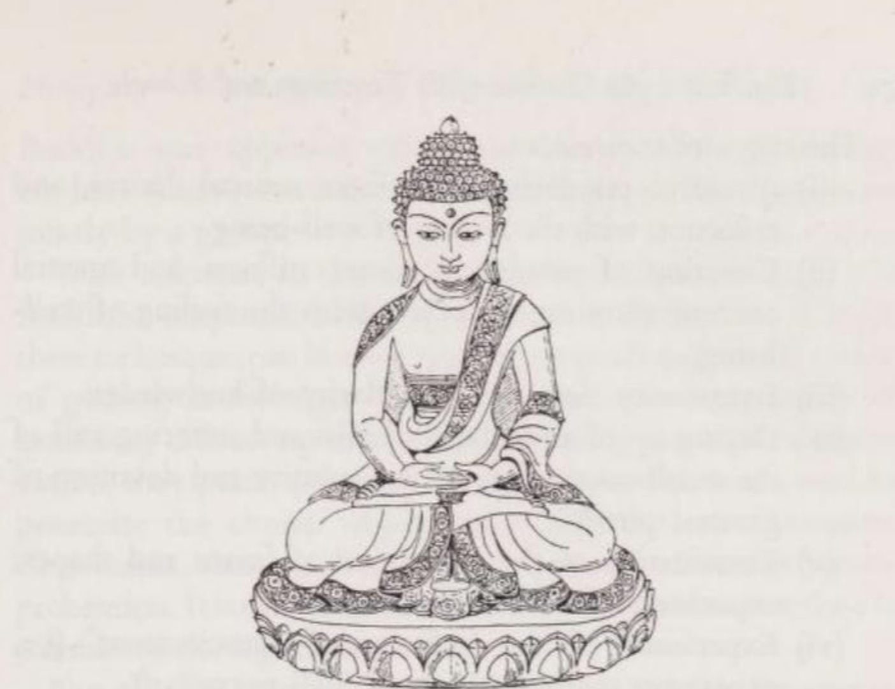
*Gotama đang thiền định. (Dựa theo một bức tượng đồng Tây Tạng, có lẽ từ thế kỷ 17.)*

Các kĩ thuật (a) 'canh giữ các cửa ngõ giác quan' (= nhánh thứ sáu của Con đường Tám nhánh) và (b) 'Sự đánh thức Tỉnh giác' (= nhánh thứ bảy) đã được đề cập. Bốn kĩ thuật còn lại là (c) quan sát tập trung, (d) nhập định, (e) quán chiếu và (f) an trú.

(c) Quan sát tập trung (focused observation / bhāvanā / tu tập) là phương pháp ghim chặt tâm trí vào một đối tượng được chọn lọc của thế giới bên ngoài. Các đối tượng phù hợp, chẳng hạn như một cục đất, một đĩa màu hoặc một xác chết trong các giai đoạn phân hủy khác nhau.

(d) Nhập định (trance / samādhi theo nghĩa hẹp hoặc jhāna / thiền na) được chia thành tám cấp độ. Hai trong số này, cấp độ thứ sáu và thứ bảy, Gotama đã tiếp thu từ các vị thầy cũ của mình là Ālāra Kālāma và Uddaka Rāmaputta—nếu như ngài không chỉ dạy bốn cấp độ đầu tiên. Rất có thể bốn cấp độ kia đã được những người biên soạn văn bản Pāli đưa vào Phật giáo bằng cách mượn từ các hệ thống khác, đặc biệt là từ Yoga mà hai vị thầy của Đức Phật cũng là những người theo đuổi.

Các giai đoạn nhập định là:

(i) Suy ngẫm chú tâm, thoát khỏi những ham muốn nhục dục, và phản tỉnh với cảm giác an lạc.

(ii) Chấm dứt sự suy ngẫm; tĩnh lặng nội tâm và tập trung tinh thần vào một đối tượng với cảm giác an lạc.

(iii) Sự bình thản, sự chuyên tâm, và sự sáng suốt của tri thức.

(iv) Khô cạn mọi cảm giác hạnh phúc, đau khổ và kí ức về chúng; sự bình thản và sự chuyên tâm ở mức độ thuần khiết nhất.

(v) Chấm dứt nhận thức về hình tướng và hình dạng; trải nghiệm sự vô biên của không gian.

(vi) Trải nghiệm sự 'vô biên của ý thức' (tức là trải nghiệm rằng ý thức lan tỏa khắp nơi).

(vii) Nhận ra bản chất không-là-gì-cả (no-thing-ness) cốt yếu của tất cả các sự vật thực nghiệm.

(viii) Trạng thái 'phi tưởng phi phi tưởng' (= nhập định sâu).

Đôi khi một giai đoạn thứ chín được nhắc đến, có thể kéo dài tới bảy ngày. Bằng cách rút tâm trí và các giác quan khỏi thế giới hoặc thậm chí tạm thời tắt chúng đi, người hành thiền sẽ nếm trải được hương vị của sự giải thoát trong sự tĩnh lặng nội tâm của mình.

(e) Quán chiếu (contemplations / anupassanā) luôn lấy quan niệm của Phật giáo về vạn vật làm chủ đề, dù đó là thế giới (ví dụ: các dấu hiệu luân hồi của sự biến hoại (vô thường), sự khổ và tính vô ngã), con người (ví dụ: các thành phần và sự đáng tởm của thân thể), hay Đạo pháp (ví dụ: Duyên khởi, sự chín muồi của kamma, con đường dẫn đến giải thoát, v.v.). Chúng đòi hỏi sự am hiểu về các văn bản Phật giáo, vì chúng nhằm mục đích biến kiến thức đã học thành hiện thực được trải nghiệm.

(f) Bốn Sự an trú Thần thánh (Four Divine Abidings / brahma-vihāra / Tứ vô lượng tâm) có nghĩa là người hành thiền lần lượt tạo ra trong mình lòng từ ái, sự bi mẫn, niềm vui và sự bình thản, rồi phát tỏa những cảm xúc này đến mọi sinh thể ở sáu hướng (bao gồm cả trên và dưới). Ý tưởng ở đây là những sự phát tỏa này có tác động hữu hình đến các sinh thể; người ta kể lại rằng ngay cả một con voi đang tấn công Đức Phật cũng bị khuất phục khi ngài phát tỏa lòng từ ái (mettā) hướng về nó. Các sự an trú này thường được thực hành chung bởi một nhóm.

Liên quan đến các kĩ thuật thiền từ 'b' đến 'e', kinh điển Phật giáo đưa ra một sự phân biệt đáng chú ý. Bởi vì tất cả các kĩ thuật này có thể được sử dụng như những công cụ tâm lí và như phương tiện để đạt được kiến thức. Khi được thực hành với mục đích loại trừ các tác nhân kích thích gây phân tâm bằng cách thu hẹp phạm vi quan sát, chúng làm tĩnh lặng (samatha / chỉ) tâm trí. Tuy nhiên, khi được sử dụng để thâm nhập phân tích đối tượng đã chọn bằng sự quan sát tập trung cao độ nhất, kết quả của chúng là Sự thấu thị (Insight / vipassanā / quán) hay sự hiểu biết trực giác. Thật dễ hiểu tại sao phương pháp thấu thị (vipassanā) lại được coi là phương pháp cao hơn.

Không phải tất cả vô số các phương pháp thiền định đều phù hợp với tất cả mọi người, và hơn nữa, có những người hoàn toàn không có năng khiếu về thiền. Trong trường hợp một người có năng khiếu thiền định, cần quan sát xem trong ba sức mạnh luân hồi chính, sức mạnh nào chiếm ưu thế ở người đó. Đối với một người tham lam, vị thiền sư có thể khuyên Quán chiếu về tính Vô ngã; đối với một người đầy thù hận, khuyên An trú trong Lòng Từ ái; đối với một người đầy ảo tưởng vô minh, khuyên Đánh thức Tỉnh giác qua Hơi thở. Cách điều trị luôn mang tính đối chứng liệu pháp (allopathical - dùng phương pháp đối nghịch để chữa trị). *(Ghi chú: Lấy độc trị độc, dùng pháp môn ngược lại với tâm bệnh để trị tâm bệnh).*

Các tác giả Phật giáo thường nhấn mạnh tầm quan trọng của Con đường Tám nhánh đối với sự giải thoát khỏi đau khổ. Chắc chắn điều này là phù hợp với đa số những người đang mỏi bước trên con đường hướng tới sự giải thoát. Tuy nhiên, kinh điển Phật giáo cũng nhắc đến những người khác, những người không hề đi theo Con đường Tám nhánh một cách có ý thức, nhưng đã đạt được mục tiêu chỉ sau một lần được nghe giảng về Đạo pháp. Họ được trang bị đặc biệt tốt bởi hành động (kamma) từ trước và có năng lực tinh thần cao đến mức chỉ bằng sự thấu thị (insight), họ đã có thể tiêu diệt các thế lực gây ra sự tái sinh. Yếu tố quyết định cho sự giải thoát là việc nhổ tận gốc vô minh, khao khát, thù hận và ảo tưởng, chứ không phải bản thân Con đường Tám nhánh, vốn chỉ là một phương tiện để đạt được điều đó.

Như có thể thấy, Con đường Tám nhánh chỉ liệt kê các giới luật, tức là các quy tắc ứng xử đưa con người đến gần hơn với sự giải thoát. Tuy nhiên, ngay từ giai đoạn đầu trong lịch sử Phật giáo, đã nảy sinh nhu cầu về một danh sách các hành động (kamma) cần tránh, vì chúng dẫn đến những hình thức tái sinh thấp kém hơn. Danh mục này bao gồm Mười Lệnh Cấm (Ten Prohibitions / Thập giới), trong đó năm lệnh đầu tiên bắt buộc đối với tất cả các Phật tử, cả cư sĩ tại gia cũng như tì kheo. Các lệnh cấm từ 6 đến 10 mang tính chất kỉ luật hơn là đạo đức và chỉ áp dụng cho những người khoác áo cà sa (tu sĩ).

(1) Tránh tước đoạt sinh mạng,

(2) tránh lấy những gì không được cho,

(3) tránh sự không trong sạch (dâm dục),

(4) tránh nói dối,

(5) tránh dùng đồ uống gây say,

(6) tránh ăn sau buổi trưa,

(7) tránh xa khiêu vũ, ca hát, âm nhạc và sân khấu,

(8) tránh đeo vòng hoa, nước hoa, mĩ phẩm và đồ trang sức,

(9) không sử dụng giường nệm cao và sang trọng,

(10) không nhận vàng và bạc.

Mặc dù gán tầm quan trọng lớn cho đạo đức (sīla / giới), Gotama còn đánh giá cao hơn lòng từ ái (loving-kindness / mettā) đối với mọi sinh thể. Nó được hiểu là một bài tập thanh lọc thúc đẩy sự giải thoát chứ không phải là sự từ bỏ bản thân:

> Bất kể có bao nhiêu kho báu của những việc làm công đức làm nền tảng (cho tương lai của hành động/kamma), cộng lại tất cả chúng cũng không đáng giá bằng một phần mười sáu của lòng từ ái, (vốn là) sự giải phóng của tâm trí. Lòng từ ái vượt lên trên tất cả; nó tỏa sáng, rực rỡ và phát quang...

> Nếu với một tâm trí thiện chí, ai đó thể hiện lòng từ ái đối với chỉ một sinh thể thôi, người đó cũng nhận được hạnh phúc. Người nào với tâm bi mẫn (thể hiện lòng từ ái) đối với mọi sinh thể, con người cao quý ấy tạo ra (cho chính mình) vô lượng công đức. (Itiv 27 pp. 19 + 21)

Tài liệu Phật giáo nổi tiếng nhất về lòng từ ái là bài kinh Mettāsutta, được hàng triệu người ở Đông Nam Á tụng niệm mỗi ngày. Mặc dù nhắm đến các tì kheo, bài kinh này cũng có tầm quan trọng không kém đối với các cư sĩ tại gia.

#### Mettāsutta (Kinh Từ Bi)

1. Đây là cách mà Một người phấn đấu vì hạnh phúc\
và muốn đạt đến nơi tịch tĩnh đó,[^15] nên hành động:\
Người ấy phải có năng lực, ngay thẳng, không kiêu ngạo\
và chín chắn; lời nói của người ấy cũng vậy.

2. (Người ấy) biết đủ, dễ nuôi dưỡng,[^16]\
không bận rộn, khiêm tốn, và thông tuệ;\
người ấy kiềm chế các giác quan, và đối với các gia đình (đàn việt)\
không đòi hỏi, dễ dàng hài lòng.

3. Người ấy (tuyệt đối không) theo đuổi một mục tiêu tầm thường\
mà những người khác, những bậc trí giả, phải chê trách:\
Mong mọi sinh thể đều đạt được hạnh phúc và bình an,\
mong tất cả họ đều trưởng thành (và) hạnh phúc (hết mức có thể)!

4. Bất kể sinh thể nào đang sống ở đây (trên thế giới này),\
dù mạnh hay yếu,\
bò sát hay (có cơ thể) đứng thẳng,\
(vóc dáng) nhỏ, vừa, vạm vỡ hay ốm yếu,

5. Sống ẩn nấp hay ở nơi rộng mở,\
cư ngụ gần hay (cư ngụ) xa,\
đã sinh ra hay vẫn còn trong bụng mẹ chờ tương lai—:\
Mong tất cả (những) sinh thể (này) đều đạt được hạnh phúc!

6. Không bao giờ được lăng mạ ai cũng như\
không được khinh thường (bằng bất cứ cách nào) bất kì ai ở bất cứ đâu;\
vì sự tức giận và hận thù, người ta không được\
ước cho người khác (chịu sự tổn hại hay) tai ương.

7. Giống như một người mẹ bất chấp tính mạng\
(cố gắng) bảo vệ con trai mình, đứa con duy nhất của mình,\
cũng vậy, đối với mọi sinh thể, người ấy nên để cho\
tâm trí mình rộng mở không có (bất kì) ranh giới nào.

8. Người ấy nên phát triển lòng từ ái đối với\
toàn bộ thế giới và giải phóng tâm trí mình khỏi những giới hạn\
hướng lên trên, hướng xuống dưới và theo chiều ngang,\
không bị cản trở, không có hận thù và ác ý.

9. Dù đang đứng, đang đi, đang ngồi (thậm chí) đang nằm, —\
trong bất kì tư thế nào giữ cho sự lười biếng tránh xa\
người ấy phải thực hành sự tỉnh giác này.[^17]:\
Đây chính là Sự an trú Thần thánh trên thế giới này.

10. Bằng cách không bám víu vào những quan điểm sai lệch,\
bằng cách tuân theo các giới luật, và với sự hiểu biết\
người ấy vượt qua sự khao khát sau những dục vọng:\
Người ấy sẽ không còn chui vào bất kì bào thai nào nữa.

(Snip 1, 8 = Khp 9)

Lòng từ ái (mettā) và lòng bi mẫn (karuṇā, anukampā) mang lại cho đạo đức sự ấm áp của cuộc sống, nếu thiếu nó, đạo đức sẽ trở nên khô khan và lạnh lẽo. Ngay cả khi những kẻ cướp và những kẻ giết người đang cưa đứt tay chân của một vị tì kheo Phật giáo — nếu vị tì kheo này nảy sinh cảm giác thù hận thì vị ấy không làm tròn lời dạy của Đức Phật. Ngay cả trong hoàn cảnh này, các tì kheo cũng nên hành xử như sau:

> Suy nghĩ của chúng ta sẽ không bị xáo trộn, và chúng ta sẽ không thốt ra một lời ác ý nào. Chúng ta sẽ duy trì sự thân thiện và bi mẫn với một tâm trí đầy lòng từ ái, không có sự ác cảm bên trong. Sau khi bao trùm người đó bằng một tâm trí từ ái, chúng ta sẽ giữ nguyên (ở trạng thái này). Bắt đầu với (người) đó, sau khi bao trùm toàn bộ thế giới bằng một tâm trí từ ái được mở rộng, tận hiến, vô hạn, yên bình (và) không trói buộc, chúng ta sẽ giữ nguyên (ở trạng thái này). ([MN 21, I p. 129](/link?q=MN-21))

Một đặc điểm của Phật giáo Nguyên thủy (Theravāda) là mỗi người phải đạt được sự giải thoát thông qua nỗ lực của chính mình và khả năng nhận được sự trợ giúp từ bên ngoài bị phủ nhận, ngoại trừ sự hướng dẫn về Con đường. Cả việc cầu nguyện lẫn niềm tin vào các đấng thiêng liêng trên trời đều không thể đẩy nhanh quá trình thoát khỏi khổ đau, vì quy luật tự nhiên của hành động (kamma / nghiệp) là không thể mua chuộc. Tuy nhiên, đức tin (saddhā), hay chính xác hơn là niềm tin tưởng vào Đức Phật, cũng đóng một vai trò trong Theravāda. Nếu không có niềm tin vào vị đạo sư và tính chân lí trong lời dạy của ngài, sẽ không có người mới bắt đầu nào chịu dấn thân vào những khó khăn của Con đường Tám nhánh. Do đó, nếu không có niềm tin tưởng, không ai có thể bao giờ đạt được sự giải thoát.

### 12. MỤC TIÊU: NIBBĀNA (NIẾT BÀN)

Một người đã đi đến tận cùng Con đường Tám nhánh và qua đó đạt được sự giác ngộ và giải thoát — một mục tiêu mà phụ nữ cũng có thể đạt được không kém gì nam giới — sẽ trở thành một vị thánh (arahant / a-la-hán). Vị ấy chỉ khác một vị Phật ở chỗ vị ấy có được sự giải thoát là nhờ được giảng dạy. Danh hiệu tôn kính 'Phật' (Buddha) được dành riêng cho những ai tự mình nhận ra sự cứu rỗi thông qua sự thấu thị của chính mình, tức là không qua sự truyền dạy. Một vị Phật giữ kiến thức đó cho riêng mình được gọi trong các văn bản Pāli là 'Phật Độc giác' (Private Buddha / paceka Buddha / Bích chi Phật); người giảng giải Đạo pháp cho người khác được gọi là 'Phật Toàn giác' (Perfect Buddha / sammāsam Buddha / Chánh đẳng chánh giác).

Các nguồn tài liệu Pāli chứa đựng vô số thông tin về trạng thái của một người đã đạt đến Nibbāna, 'sự dập tắt' (extinction / niết-bàn). Tuy nhiên, các thuộc tính mang tính khẳng định chỉ xuất hiện trong những đoạn văn mang tính khích lệ và đầy chất thơ của kinh điển. Tại đây, Nibbāna được mô tả là hạnh phúc, bình an, an toàn, hỉ lạc, bất tử, thuần khiết, chân lí, khỏe mạnh và thường hằng. Tất cả những cách diễn đạt này làm rõ rằng Nibbāna không được hiểu là sự hư vô (nothingness) mà được xem như một điều gì đó mang tính tích cực.

Các phần triết học của kinh điển không mâu thuẫn với điều này, nhưng chúng sử dụng các tuyên bố mang tính phủ định vì 'sự dập tắt' chủ yếu là sự tự do: sự phá hủy tất cả các yếu tố trói buộc vào Luân hồi (Saṃsāra) và khổ đau. Do đó, kinh Trường Bộ (Dīghanikāya) định nghĩa Nibbāna là sự nhổ bỏ tận gốc sự khao khát gây ra tái sinh ([DN 14, 3, 1 II p. 36](/link?q=DN-14.3)), là sự giải thoát khỏi ba cấu uế cơ bản là tham, sân, si ([DN 16, 4, 43 II p. 136](/link?q=DN-16.4)), những thứ làm nảy sinh các hành động dẫn đến tái sinh, và là sự lắng dịu của các ý định hành động ([DN 14, 3, 1 II p. 36](/link?q=DN-14.3)), vốn là những tác nhân tạo ra các hình thức tồn tại mới. Không thể đạt được Nibbāna thông qua các hành động (kamma), thông qua việc tận dụng quy luật kamma, và nó không phải là đích đến của con đường kamma, mà nó là sự giải phóng khỏi các gông cùm của kamma. Trong khi các hình thức tồn tại trong Sáu Cõi Tái sinh là 'được tạo ra bởi các ý định hành động' (conditioned by action-intentions / saṅkhata / hữu vi), thì Nibbāna là 'không thể đạt được bằng các ý định hành động' (unobtainable by action-intentions / asaṅkhata / vô vi). Chính vì lí do này, nó thoát khỏi sự sinh ra, suy tàn và biến đổi ([AN 3, 47 I p. 152](/link?q=AN-3.47)).

Nhưng Nibbāna không chỉ có nghĩa là từ bỏ những phẩm chất tiêu cực; người được giải thoát cũng phải vứt bỏ những lí tưởng được trân trọng: sự phấn đấu để đạt được Nibbāna và giáo pháp của Đức Phật. Bởi vì Nibbāna, với tư cách là sự chấm dứt mọi khao khát và ham muốn, chỉ có thể trở thành hiện thực khi nó không còn là đối tượng của sự ham muốn nữa. Khát khao mãnh liệt về sự giải thoát lại chính là một trở ngại cho sự giải thoát. Nibbāna chỉ có thể nhận ra được khi vắng bóng một ý định quá háo hức muốn đạt tới nó. Hơn nữa, vì tất cả các giá trị tinh thần, ngay khi đạt được, đều trở thành những tài sản lâu dài thân thiết với trái tim của người sở hữu, nên giáo pháp của Đức Phật cũng phải được buông bỏ trong Nibbāna. Khi đã vượt qua dòng sông đau khổ và chạm đến bờ giải thoát, giáo pháp với tư cách là chiếc bè đưa đến sự giải phóng đã trở nên vô dụng ([MN 22, I p. 135](/link?q=MN-22)).

Bất chấp mọi sự khác biệt, Nibbāna và con người thực nghiệm vẫn có chung một điểm: cả hai đều tồn tại và đều không có Bản ngã (vô ngã):

> Biến hoại (vô thường) là tất cả các thành phần cấu tạo nên nhân cách (saṅkhāra / hành)[^18], đau khổ, không phải là một Bản ngã và bị tạo ra bởi các ý định hành động (saṅkhata / hữu vi). Và Nibbāna cũng là một thứ không có Bản ngã (vô ngã), điều này là chắc chắn. (Vin V p. 86 v. 1)

Tùy thuộc vào việc người đã được dập tắt (phiền não) và giải thoát vẫn còn sống hay đã qua đời, người ta phân biệt giữa Nibbāna trước khi chết (hữu dư y Niết-bàn) và Nibbāna sau khi chết (vô dư y Niết-bàn). Ở trạng thái thứ nhất, những yếu tố trói buộc vào vòng luân hồi hay tái sinh đã bị phá hủy; ở trạng thái thứ hai, người được giải thoát cũng tan biến với tư cách là một sinh thể nhận thức (Itiv 44 p. 38). Nibbāna sau khi chết được gọi là 'sự dập tắt hoàn toàn' (perfect extinction / parinibbāna / bát-niết-bàn).

Trong Nibbāna trước khi chết, người được giải thoát mang đặc trưng là sự bình thản không thể lay chuyển. Vị ấy không nằm ngoài sự nhạy cảm của thể xác nhưng khái niệm 'khổ' không còn áp dụng cho vị ấy nữa: Vì vị ấy đã nhận thức rõ ràng trong tâm trí về tính vô ngã nên không có gì có thể làm 'vị ấy' lo lắng được nữa. Biết rằng mình đã thoát khỏi sự trói buộc của luân hồi, vị ấy sống để chờ parinibbāna.

Tuy nhiên, không nên nhầm lẫn trạng thái của vị ấy với sự thụ động và vô cảm. Chỉ có những động cơ trói buộc vị ấy vào Luân hồi (Saṃsāra) là đã chấm dứt tồn tại. Những thôi thúc tích cực như lòng tốt, sự bi mẫn và trí tuệ không hề chết đi trong vị ấy. Chúng không chỉ biến vị ấy thành một hình mẫu cho môi trường xung quanh, mà còn thành một người mang lại sự giúp đỡ thiết thực.

Khái niệm Nibbāna sau khi chết cho thấy quan niệm của Phật giáo về sự giải thoát và học thuyết vô ngã có mối liên hệ chặt chẽ với nhau như thế nào. Giả sử Gotama khẳng định sự tồn tại của một Linh hồn, thì Linh hồn này như một thực thể vĩnh cửu sẽ tiếp tục tồn tại ngay cả trong Parinibbāna, và Parinibbāna sẽ là một loại thiên đường nào đó nơi các linh hồn được giải thoát tìm thấy sự bình yên. Nhưng vì Gotama dạy về tính vô hồn (soullessness / vô ngã) của con người thực nghiệm, nên Parinibbāna chỉ đơn giản là sự tan rã của Năm Nhóm (Five Groups / ngũ uẩn), vốn kết hợp lại để tạo nên con người của bậc đã được giải thoát. Sự ra đi của một sinh thể đã được giải thoát là kết thúc cuối cùng, không có 'Nhóm' mới nào có thể phát sinh, chuỗi tái sinh của vị ấy đã bị bẻ gãy vĩnh viễn.

Lời chỉ trích chĩa vào Đức Phật rằng ngài là một người thầy dạy về sự hủy diệt (venayika) vì ngài truyền bá sự tiêu diệt nhân cách, là đi chệch trọng tâm. Bởi vì ngài coi nhân cách chỉ là một hiện tượng (phenomenon) chứ không phải là một thực thể cốt lõi (essence), nên không thể có vấn đề tiêu diệt một 'nhân cách' trong Parinibbāna. Đức Phật đã phản đối một cách đúng đắn sự chê trách này:

> Về những gì ta không phải, này các tì kheo, về những gì ta không nói, những đạo sĩ và bà-la-môn đáng kính này đã buộc tội ta một cách sai trái. . . . Trước đây cũng như hôm nay, này các tì kheo, ta chỉ dạy một điều: sự khổ và sự chấm dứt khổ đau. ([MN 22, I p. 140](/link?q=MN-22))

Lời biện hộ này chỉ mang tính thuyết phục đối với ai đã hiểu thấu đáo phương trình: Chuỗi Duyên khởi = con người thực nghiệm = sự khổ.

Các văn bản Pāli mô tả tình trạng bên trong cũng như bên ngoài của người được giải thoát sau khi chết. Đúng như dự đoán, họ làm điều này chủ yếu thông qua các sự phủ định.

Vì cùng với sự tan rã của con người thực nghiệm trong Parinibbāna, ý thức nhận thức cũng đi đến hồi kết, nên thế giới cũng chấm dứt tồn tại đối với người được giải thoát. Đối với người đó, Đức Phật giải thích, Nibbāna là

> cõi không có đất, không có nước, không có lửa, không có gió; không phải cõi vô biên của không gian, không phải cõi vô biên của ý thức, không phải cõi hư vô, không phải cõi phi tưởng phi phi tưởng; không phải thế giới này, không phải thế giới bên kia hay cả hai, không phải mặt trời và mặt trăng. Này các tì kheo, ta tuyên bố rằng không có sự đến và đi, không có sự tồn tại, không có sự phá hủy cũng không có sự sinh ra. Nó không có nền tảng, không có sự phát triển và không có điều kiện. Đây là sự chấm dứt khổ đau. (Ud 8, 1 p. 80)

Trước câu hỏi của Udāyi về việc làm thế nào trạng thái này, cái Nibbāna này, nơi mọi cảm giác đã dừng lại, lại có thể được gọi là hạnh phúc, vị tì kheo Sāriputta (Xá-lợi-phất) đáp:

> Chính điều này là hạnh phúc . . . rằng không còn cảm giác nào nữa! ([AN 9, 34, 3 IV p. 415](/link?q=AN-9.34))

Việc mô tả một người được giải thoát hoàn toàn vượt ra ngoài mọi khả năng của ngôn ngữ. Người ta không thể nói rằng Bậc Chân nhân tồn tại trong Parinibbāna, cũng không thể nói rằng ngài không tồn tại ([DN 15, 32 II p. 68](/link?q=DN-15.32)). Năm Nhóm (ngũ uẩn) cấu thành con người thực nghiệm mà người ta có thể nghĩ đến khi nói về người được giải thoát — ngài đã rũ bỏ Năm Nhóm này và chúng không bao giờ có thể phát sinh lại được nữa ([MN 72, I p. 487 f.](/link?q=MN-72)). Hình ảnh so sánh tuyệt vời nhất về người được giải thoát là hình ảnh một ngọn lửa mà sau khi nó bị dập tắt (nibbāna), không ai có thể nói nó đã đi về đâu:

> Giống như một ngọn lửa bị thổi tắt bởi một cơn gió mạnh\
> 'trở về nhà' và do đó thách thức mọi sự định nghĩa,\
> cũng vậy, một bậc hiền triết, được giải phóng khỏi Tên gọi và Thể xác (Danh và Sắc),\
> 'trở về nhà' và không còn có thể được định nghĩa nữa.
(Snip 1074)

Cả các giác quan lẫn tâm trí đều không thể nhìn thấy một người đã bước vào Parinibbāna ([SN 35, 83 IV p. 52 f.](/link?q=SN-35.83)). Sinh thể được giải thoát hoàn toàn nằm ngoài khả năng hiểu biết:

> Đối với Bậc Đã Tịch Diệt, không có thước đo nào\
> và không có gì để định nghĩa ngài bằng điều đó;\
> khi mọi hiện tượng đều đi đến hồi kết\
> thì các phương tiện của ngôn ngữ cũng đã dừng lại.
(Snip 1076)

***Các Trường phái Chính của Hinayāna (Tiểu Thừa / Phật giáo Nguyên thủy)***

Trong kì Kết tập thứ hai diễn ra tại Vesālī khoảng một trăm năm sau khi Đức Phật nhập diệt, tức là khoảng năm 383 trước Công nguyên, tăng đoàn Phật giáo chia thành hai trường phái: Theravādins (tiếng Phạn: Sthaviravādins), 'Những người tuân theo Lời dạy của các Trưởng lão' (Thượng tọa bộ), và Mahāsāṅghikas (tiếng Phạn), 'Đại chúng' (Đại chúng bộ). Phái Theravāda tuyên bố nắm giữ truyền thống nguyên bản không pha tạp về lời dạy của Đức Phật, và chính kinh điển của họ được lưu truyền trọn vẹn cho chúng ta bằng tiếng Pāli. Về kinh điển của phái Mahāsāṅghika được viết bằng cái gọi là tiếng Phạn lai (hybrid Sanskrit), tức là tiếng Phạn xen kẽ với các từ địa phương, ngày nay chỉ còn tồn tại một tác phẩm duy nhất là *Mahāvastu* (Đại sự).

Nguyên nhân dẫn đến sự chia rẽ của tăng đoàn đã được biết rõ. Theo một nguồn tài liệu, sự bất đồng về mười quy tắc kỉ luật đã gây ra sự rạn nứt; theo một nguồn khác, đó là do quan niệm về vị thánh Phật giáo (*arahant* / a-la-hán). Trái ngược với các nhà sư bảo thủ, một nhóm trong số họ cho rằng ngay cả các vị thánh cũng phải đối mặt với những cám dỗ và không nhất thiết phải là người toàn tri (omniscient). Trái ngược với lí tưởng về vị thánh siêu việt thế gian, họ đã tạo ra lí tưởng về vị Bồ tát (Bodhisattva) đồng cảm với thế gian. Khi không thể đạt được thỏa thuận, những người đổi mới đã hợp nhất lại và tạo thành trường phái Mahāsāṅghika.

Ở những điểm khác, phái Mahāsāṅghika cũng khác biệt so với phái Theravāda. Họ không còn xem Đức Phật như một con người bình thường mà là một siêu nhân; họ khẳng định rằng đau khổ không chỉ có thể bị loại bỏ bằng hành vi đạo đức và sự giác ngộ mà còn có thể chỉ bằng trí tuệ; họ coi tâm trí của sinh thể tái sinh không bị gò bó bởi *kamma* (nghiệp) cũ mà tự do và thuần khiết; và họ tạo ra khái niệm về Tính Không (Emptiness) phổ quát. Ở dạng hầu như không bị sửa đổi, những đặc điểm này sau đó có thể được tìm thấy trong Mahāyāna (Đại Thừa).

Vô số các trường phái phụ đã tách ra từ Theravāda và Mahāsāṅghika trong suốt hai thế kỉ tiếp theo. Truyền thống nói đến mười tám trường phái thuộc Hinayāna, nhưng các văn bản đề cập đích danh tới hơn ba mươi trường phái. Ở đây sẽ chỉ liệt kê những trường phái quan trọng nhất.

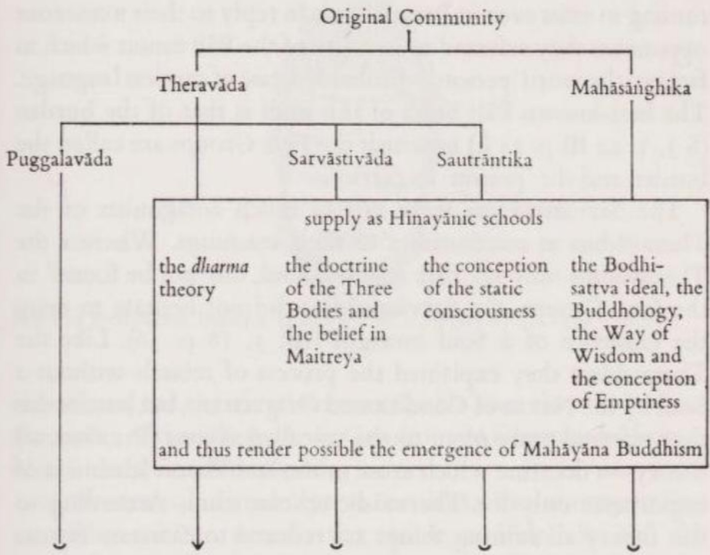

*Trường phái Puggalavāda (tiếng Phạn: Pudgalavāda / Độc Tử bộ), Sarvāstivāda (tiếng Phạn / Nhất Thiết Hữu bộ) và Sautrāntika (tiếng Phạn / Kinh Lượng bộ) đều bắt nguồn từ Theravāda. Sarvāstivāda và Sautrāntika sở hữu hệ thống kinh điển riêng bằng tiếng Phạn, các tác phẩm chính của chúng được bảo tồn qua các bản dịch tiếng Hán và tiếng Tây Tạng. Cuốn sách quan trọng nhất của Sarvāstivāda là Abhidharmakośa (A-tì-đạt-ma Câu-xá luận) của Vasubandhu (Thế Thân) (thế kỉ thứ 5 sau Công nguyên); phiên bản tiếng Phạn của nó đã được tìm thấy lại vào những năm 1950.*

Trong số các trường phái Hīnayāna, Puggalavāda là trường phái đi chệch xa nhất khỏi truyền thống chính thống. Họ diễn giải các bài giảng của Đức Phật theo cách cho rằng, rốt cuộc thì vẫn có một cái gì đó thường hằng trong vòng luân hồi, đó chính là 'con người' (person / puggala / bổ-đặc-già-la). Con người này không đồng nhất với Năm Nhóm (ngũ uẩn) cấu thành nên cá nhân, nhưng cũng không khác biệt với chúng. Giống như phái Theravāda, phái Puggalavāda về mặt lí thuyết phủ nhận khả năng tìm thấy một Linh hồn trong Năm Nhóm, nhưng trong thực tế lại gán cho *puggala* tất cả các thuộc tính vốn dĩ thuộc về một Linh hồn. *Puggala* được quan niệm là người hưởng lợi từ *kamma* tốt và chịu đựng *kamma* xấu, đồng thời tiếp tục tồn tại ngay cả trong Parinibbāna. Để đáp trả vô số đối thủ của mình, họ viện dẫn các đoạn trong kinh điển Pāli mà trên thực tế có sử dụng từ 'con người' — có lẽ đây là một trường hợp sử dụng ngôn ngữ thiếu cẩn trọng. Bài Kinh Pāli nổi tiếng nhất thuộc loại này là bài kinh về gánh nặng ([SN 3, 1, 22 III p. 25 f.](/link?q=SN-3.1)), trong đó Năm Nhóm được gọi là gánh nặng và 'con người' là kẻ mang vác nó.

Phái Sarvāstivāda không hẳn là những người đối lập với phái Theravāda mà đúng hơn là những người tiếp nối giáo lí của họ. Trong khi phái Theravāda chỉ nói rằng một Bản ngã, một Linh hồn, 'không thể được tìm thấy' trong Năm Nhóm, thì phái Sarvāstivāda không ngần ngại phủ nhận hoàn toàn sự tồn tại của một Linh hồn (Ak 3, 18 p. 56). Giống như phái Theravāda, họ giải thích quá trình tái sinh không có Linh hồn bằng Chuỗi Duyên khởi, nhưng bên cạnh đó, họ thường xuyên viện dẫn lí thuyết gọi là *dharma* (Pāli: *dhamma* / pháp) — một học thuyết nảy sinh ở thời kì Theravāda muộn nhưng chỉ có tầm quan trọng đối với triết học kinh viện của Theravāda. Theo lí thuyết này, tất cả những sự vật hiện hữu đều được tối giản thành các *dharma*, tức là 'các yếu tố tồn tại', theo nghĩa là những nguyên lí cuối cùng hoặc những thực tại cơ bản.

Ngay từ đầu, người ta phải tách biệt hai nhóm Dharma (Pháp). Nhóm nhỏ bao gồm các Dharma Không-điều-kiện (*asaṃskṛta* / vô vi pháp), cấu thành nên trạng thái giải thoát. Chúng là vĩnh cửu, tức là không bị tạo ra bởi các nguyên nhân nghiệp lực (karmic causes), và không chịu sự chi phối của sức mạnh định hình từ *karman* (nghiệp). Trong Theravāda, chỉ có Nirvāṇa (Pāli: *nibbāna* / Niết-bàn) mới được coi là một Dharma Không-điều-kiện. Sarvāstivāda tính ra có ba Dharma Không-điều-kiện, các trường phái khác tính lên đến chín. Chúng không tham gia vào quá trình dharma, tức là không tham gia vào việc tạo ra thế giới đau khổ này.

Đối lập với số ít các Dharma Không-điều-kiện này là tất cả các Dharma Có-điều-kiện (*saṃskṛta* / hữu vi pháp). Những Dharma Có-điều-kiện này là gì, quá trình dharma hoạt động ra sao và những thế lực nào thúc đẩy nó?

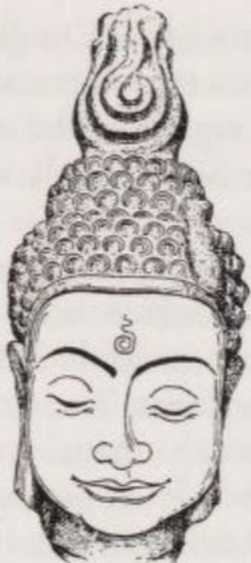

*Đầu của Đức Phật đang thiền định. (Dựa theo một tác phẩm điêu khắc Thái Lan thế kỉ 13.)*

Các trường phái Phật giáo đã dành rất nhiều công sức để đếm và phân loại các Dharma (nghĩa đen là 'những thứ mang vác' / bearers). Trong khi số lượng các Dharma — được liệt kê là 75, 84 hoặc 100 — không quan trọng, thì các cách phân loại lại có giá trị vì chúng làm rõ bản chất của các Dharma. Các Dharma Có-điều-kiện (= các yếu tố tồn tại) được hiểu là:

1. các năng lực cảm giác hoặc nhận thức, các vùng giác quan tương ứng, cụ thể là cái có thể nhìn thấy, có thể nghe thấy, v.v. và các nội dung của nhận thức;
2. ý thức và hoạt động tư duy;
3. những khả năng và tài năng bẩm sinh của một cá nhân cũng như tâm trạng, cảm xúc, thôi thúc và sở thích của người đó — nói tóm lại là các quá trình tâm lí;
4. các mối quan hệ và quá trình phi vật chất như việc đạt được, không đạt được, sinh lực, sự lão hóa, sự biến hoại (vô thường), v.v.

Theo như lí thuyết dharma ngụ ý, mọi sinh thể thực nghiệm và tất cả những gì phản chiếu trong họ dưới dạng thế giới bên ngoài, chỉ là những hiện tượng được hình thành bởi các Dharma Có-điều-kiện. Các Dharma là những yếu tố cấu trúc của sự tồn tại thực nghiệm mà không thể bị chia cắt hay tối giản thêm được nữa. Bị gây ra và bị lèo lái bởi *karman* (nghiệp), chúng kết hợp với nhau theo những tỉ lệ nhất định và từ đó tạo ra những hiện tượng mà chúng ta trải nghiệm như chính bản thân mình và như thế giới. Toàn bộ thực tại đều cạn kiệt trong các hiện tượng được cấu thành bởi các Dharma Có-điều-kiện. Không có nền tảng cốt lõi (substratum), không có 'thực tại đích thực' hay 'bản chất' nào đằng sau hay vượt ra ngoài chúng.

Đặc điểm đặc biệt của các Dharma Có-điều-kiện, điều duy nhất đủ điều kiện để chúng đóng vai trò trong quá trình dharma, là sự ngắn ngủi trong hoạt động của chúng. Liên quan đến bản chất của các Dharma, hai trường phái Theravāda và Sarvāstivāda giữ những quan điểm khác nhau.

Phái Theravāda xem các Dharma Có-điều-kiện là tồn tại ngắn ngủi. Các Dharma phát sinh, kết hợp với các Dharma khác thành các nhóm dharma hoặc các hiện tượng, rồi biến mất để nhường chỗ cho các Dharma mới và các hiện tượng mới. Các Dharma Có-điều-kiện theo cách hiểu của phái Theravāda có thể so sánh với từng âm thanh riêng lẻ của một giai điệu. Không có âm thanh nào tồn tại lâu hơn một phần nhỏ của giây mà nó có thể được nghe thấy, nhưng chính điều này lại khiến cho các âm thanh có thể thay thế nhau liên tiếp một cách nhanh chóng và từ đó tạo ra sự xuất hiện của một giai điệu. — Chủ yếu dưới hình thức này, lí thuyết dharma đã được Mahāyāna (Đại Thừa) tiếp thu.

Phái Sarvāstivāda nhìn nhận bản chất của các Dharma Có-điều-kiện theo cách khác. Theo họ, các Dharma cũng chỉ có tác dụng trong một thời gian ngắn; tuy nhiên, chúng không phải mới được sinh ra, mà đã tồn tại từ thời xa xưa vô thủy vô chung: chúng chỉ đơn thuần chuyển từ trạng thái tiềm ẩn sang trạng thái hoạt động. Quá trình này gợi sự so sánh với một cuộn phim. Mặc dù các bức ảnh trên dải phim là vĩnh viễn, nhưng chúng chỉ hoạt động trong khoảnh khắc được chiếu lên. Chuỗi các tia sáng hoạt động của những bức ảnh khác nhau tạo nên thứ mà người ta trải nghiệm như hành động trong cuộc sống.

Bản thân phái Sarvāstivāda giải thích sự hoạt động của các Dharma bằng ví dụ về một hòn đá trên đỉnh núi. Trong một thời gian dài, hòn đá nằm đó không có tác dụng gì. Một ngày nọ, nó bắt đầu rơi xuống, trở nên có tác dụng, cho đến khi nó dừng lại dưới thung lũng và một lần nữa trượt trở lại trạng thái vô tác dụng. — Hòn đá trên đỉnh núi có thể so sánh với một Dharma của tương lai, khi đang rơi nó giống như một Dharma của hiện tại, khi dừng lại nó là một Dharma của quá khứ. Trong hòn đá — cũng như trong các Dharma — ba thời điểm này không hề chết: quá khứ, hiện tại và tương lai cùng tồn tại trong chúng. 'Tất cả (những gì đã từng là và sẽ là) đều đang tồn tại' (*sarvam asti* / nhất thiết hữu) — đó là tiên đề của phái Sarvāstivāda, mà từ đó trường phái này lấy tên của mình.

Sẽ dễ hiểu hơn nếu phân biệt giữa quá trình dharma cá nhân và quá trình dharma siêu cá nhân (super-individual).

Quá trình dharma cá nhân giải thích nhịp đập của sự sống trong con người, sự thay đổi không ngừng trong ý thức của anh ta và sự biến động trong các nội dung suy nghĩ của anh ta. Các Dharma, qua những sự kết hợp biến ảo như kính vạn hoa để tạo nên tư duy, có thời lượng ngắn nhất — các học giả đo lường chúng bằng phần nghìn của một cái chớp mắt. Vì Đức Phật hiểu 'thế giới' là những gì được phản chiếu như thế trong ý thức con người, nên quá trình dharma cũng đủ để giải thích thế giới cá nhân, bởi vì thế giới trông như thế nào đối với chúng ta phụ thuộc vào sự kết tụ dharma cấu thành nên tâm trí chúng ta. Quá trình dharma cá nhân là một lí thuyết tâm lí học mang một phần chức năng bản thể học.

Quá trình dharma siêu cá nhân cung cấp nền tảng lí thuyết cho sự tái sinh mà không cần Linh hồn. Các Dharma ra đời do những điều kiện tiền đề về nghiệp lực và chính nhờ *karman* này mà chúng liên kết lại để cấu thành một cá nhân. Khi các Dharma, thứ ngày nay cấu thành nên Peter, tan rã vào lúc anh ta chết, thì những ý định hành động mà Peter đã nuôi dưỡng khi còn sống sẽ quyết định những Dharma mới nào sẽ liên kết lại trong hình thức tồn tại mới của 'anh ta' — mà có lẽ sẽ được gọi là Paul. Paul hoàn toàn không đồng nhất với Peter, nhưng nhờ Peter mà anh ta mới có được như ngày nay, và nếu không có Peter thì anh ta sẽ không bao giờ bước vào cuộc đời. Đối với các Dharma, *karman* vừa là nguyên nhân gây ra vừa là sức mạnh định hình. *(Ghi chú: Nghiệp đóng vai trò như từ trường, sắp xếp các pháp/dharma thành hình tướng con người).* Liên quan đến sức mạnh định hình, người ta liên tưởng đến thí nghiệm ở trường học với mạt sắt, trong một từ trường, chúng được sắp xếp một cách bí ẩn thành một mô hình.

Gần như không có yếu tố tư tưởng nào khác của Phật giáo lại thích hợp để nhổ tận gốc rễ niềm tin vào một Linh hồn, một Bản ngã hay Cái Tôi vĩnh cửu bằng việc diễn giải nhân cách như một dòng chảy năng động của các Dharma Có-điều-kiện. Những cách diễn đạt như 'sự khổ', 'karman' (nghiệp), và 'sự giải thoát' vốn được sử dụng rất thường xuyên trong Phật giáo, thực sự có liên quan đến một chủ thể, nhưng đây chỉ là một chủ thể mang tính thực nghiệm: một sự kết hợp của các dharma, chứ không phải là một thực thể cốt lõi. Học giả Pāli Buddhaghosa (Phật Âm) (thế kỉ thứ 5 sau Công nguyên) minh họa điều này bằng một vài khổ thơ mà ông giả vờ trích dẫn, nhưng có lẽ do chính ông sáng tác:

> Có sự khổ nhưng không có người chịu khổ,\
> có hành động, nhưng không có người làm ra nó,\
> có sự dập tắt (tịch diệt), nhưng không có ai bị dập tắt,\
> không có người bước đi, mà chỉ có Con đường.

(Vism 16 II p. 513)

> Không có người tạo ra kamma (nghiệp)\
> và không có ai gặt hái quả của nó:\
> Thứ chuyển động chỉ là các Dhamma (Pháp)—\
> (người nào) thấu hiểu đúng đắn (sẽ biết) như vậy.

(Vism 19 II p. 602)

Phái Sarvāstivāda đã đóng góp cho Mahāyāna (Đại Thừa) một hình thức ban đầu của học thuyết Ba Thân (Three Bodies / Tam thân), mà ý tưởng cơ bản của nó họ đã tiếp thu từ phái Mahāsāṅghika. Họ cũng đưa vào niềm tin về vị Phật tương lai Maitreya (Pāli: Metteya / Di-lặc), vốn dĩ trong Theravāda chỉ có ý nghĩa phụ, nhưng trong Sarvāstivāda lại có ý nghĩa lớn hơn.

Phái Sautrāntika mang tên đó vì họ bác bỏ phần Abhidharma (A-tì-đạt-ma / Luận) của kinh điển tiếng Phạn và chỉ dựa hoàn toàn vào phần Sūtra (Kinh) của nó (sūtrānta). Giống như phái Theravāda, họ cho rằng các Dharma Có-điều-kiện chỉ tồn tại chừng nào chúng còn hoạt động, nhưng đằng sau chuỗi các Dharma, họ giả định có một nền tảng cốt lõi (āśraya / sở y), cụ thể là một ý thức hoạt động như một thể liên tục (santāna, santati / tương tục). Ý thức phi thời gian này, có thể nói, tạo thành một đường ray cho Năm Nhóm cấu thành nên con người. Theo phái Sautrāntika, Năm Nhóm này tiếp tục tồn tại sau khi chết dưới dạng vi tế và di chuyển dọc theo đường ray của ý thức đến lần tái sinh tiếp theo. Bằng cách phát triển ý tưởng về một ý thức tĩnh, phái Sautrāntika đã cung cấp khái niệm trung tâm cho chủ nghĩa duy tâm nhất nguyên của hệ thống Yogācāra (Du-già hành phái).