# III MAHĀYĀNA — PHẬT GIÁO NHẤT NGUYÊN VỀ SỰ GIẢI THOÁT NHỜ VÀO THA LỰC [19](/giaolyvatongphai/notes#19){.note}

***Những điểm khác biệt và tương đồng giữa Hīnayāna (Tiểu thừa) và Mahāyāna (Đại thừa)***

Khoảng 400 năm sau khi Đức Phật qua đời, một hình thức Phật giáo mới xuất hiện ở Ấn Độ, tự xưng là Mahāyāna (Cỗ xe lớn / Đại thừa - giúp vượt qua biển khổ). Nó vạch ra những con đường mới để đi đến sự giải thoát (emancipation), giúp mục tiêu tối thượng này trở nên dễ tiếp cận với nhiều kiểu người hơn so với Phật giáo thời kỳ đầu. Chính vì thế, cái tên mang ý nghĩa chê bai là Hīnayāna (Cỗ xe nhỏ / Tiểu thừa) bắt đầu được dùng để gọi Phật giáo nguyên thủy. Những người theo Đại thừa (Mahāyānins) lập luận rằng Tiểu thừa chỉ là phần giới thiệu cho giáo lý của Đức Phật cho những người 'có năng lực thấp': do thính chúng khi xưa thiếu sự tập trung nên họ chỉ tiếp thu được một phần nhỏ của giáo pháp (SP 3 tr. 47). Ngược lại, những người theo Tiểu thừa (Hīnayānins) lại gọi Đại thừa là sự xuyên tạc những gì Đức Phật Thích Ca (Gautama) đã dạy.

Khi đi sâu vào chi tiết, có vẻ như hầu hết các yếu tố được coi là 'đặc trưng của Đại thừa' thực chất đều đã có mầm từ trong Tiểu thừa. Những điểm khác biệt nổi bật nhất giữa hai nhánh Phật giáo này là:

(1) Về tính chân thực của thế giới, Tiểu thừa theo thực hành tâm lý hiện thực (psychological realism/ cái gì diễn ra ở tâm lý cái đó là hiện thực), trong khi Đại thừa theo chủ nghĩa duy tâm (idealism/ mọi thứ do tâm lý tạo ra, không phải hiện thực). Do đó, Tiểu thừa coi đau khổ là có thật, còn Đại thừa coi đau khổ chỉ là ảo ảnh (illusion) (tuy nhiên, chỉ có bậc thánh nhân mới nhận ra được ảo ảnh này).

(2) Trái với Tiểu thừa, vốn phủ nhận có một 'thực thể chân thật' (true being) ở tầng cuối cùng đằng sau các hiện tượng và tránh đưa ra các tuyên bố mang tính siêu hình, Đại thừa giảng về một Cái Tuyệt Đối Vĩnh Cửu (Eternal Absolute) dưới rất nhiều tên gọi khác nhau. Cái Tuyệt Đối này không nằm ngoài thế giới (transcendent) mà hiện hữu ngay bên trong vòng luân hồi (Saṃsāra). Thậm chí ngay trong các pháp (dharmas) — vốn bị Tiểu thừa xem là các hiện tượng thuần túy — Đại thừa vẫn nhìn thấy Cái Tuyệt Đối: đó là ở tính Không (emptiness) của chúng.

Tương tự như vậy, Mahāyāna nhìn các chúng sinh trong mọi hình thức tái sinh là giống nhau (chúng sinh bình đẳng) ở cốt lõi với Cái Tuyệt Đối (và do đó cũng giống nhau với nhau). Đại thừa mang tính nhất nguyên (monistic/ vạn vật là một), và đặc điểm nổi bật của nó là luôn nhấn mạnh vào tính bất nhị (non-duality - không có sự phân biệt giữa người ta và người, tất cả có chung một bản thể).

(3) Trong Đại thừa, vị Phật lịch sử Thích Ca (Gautama) được hiểu là một hình ảnh phóng chiếu (projection) của Cái Tuyệt Đối. Về bản chất, ngài đồng nhất với Nguyên lý Tối hậu (Last Principle), nhưng lại là một ảo ảnh khi mang trong mình lớp vỏ phàm nhân yếu ớt. Trong Tiểu thừa, ngài được xem là một con người bằng xương bằng thịt và là một bậc đạo sư, hay là một người siêu phàm.

(4) Trái ngược với quan điểm của Tiểu thừa cho rằng giải thoát **chỉ có thể** đạt được bằng nỗ lực của chính bản thân, Đại thừa cho rằng sự trợ giúp từ bên ngoài là hoàn toàn có thể; Đại thừa chấp nhận việc được cứu rỗi nhờ vào 'sức mạnh của người khác' (other-power / tha lực).

(5) Đại thừa dạy về việc hồi hướng (transference) công đức (karmic merit) cho người khác, qua đó phá vỡ quy luật nhân quả về nghiệp (karman / *Pali: kamma*), vốn cho rằng bất cứ ai muốn có kiếp sau tốt đẹp hơn đều phải tự mình nỗ lực để đạt được điều đó. Tuy nhiên, ở điểm này, Đại thừa và Tiểu thừa thực chất chỉ khác nhau trên văn bản. Trong thực tế tôn giáo ở Đông Nam Á, truyền thống Nam Tông (Theravāda) cũng công nhận việc hồi hướng công đức (transference of karmic merit / *Pali: pattidāna*).

(6) Những người theo Tiểu thừa, ngoại trừ phái Đại chúng bộ (Mahāsāṅghikas), coi mục tiêu trước mắt của họ là đạt được sự tĩnh diệt của cái tôi cá nhân: vào niết bàn (nirvāṇa / *Pali: nibbāna*). Ngược lại, Đại thừa lại đặt ra mục tiêu trung gian là đạt được quả vị Bồ tát (Bodhisattva-hood) để dẫn dắt tất cả chúng sinh đến sự giải thoát. Đối với họ, sự tĩnh diệt và giải thoát của cá nhân mình chỉ là thứ yếu.

(7) Niết bàn — trong Tiểu thừa được hiểu là chiến thắng vòng luân hồi và vĩnh viễn thoát khỏi thế gian — thì trong Đại thừa lại được coi là việc ý thức được tính tuyệt đối của chính mình (= sự giải thoát). Đó là một trạng thái tâm trí siêu việt, vượt lên trên thế gian nhưng vẫn nằm ngay trong thế gian, và đồng thời tích cực nỗ lực vì sự giải thoát của những chúng sinh khác. Người theo Tiểu thừa phải tự mình tìm đến Niết bàn, còn người theo Đại thừa về bản chất đã được giải thoát ngay từ thuở ban đầu. Trong Cái Tuyệt Đối mà người đó linh cảm thấy bên trong mình, họ đã sở hữu sẵn Phật tính (Buddhahood) và chỉ cần nhận thức được sự thật này thông qua sự thực chứng (experience).

(8) Hơn nữa, Tiểu thừa (Hīnayāna) và Đại thừa (Mahāyāna) còn khác nhau ở thái độ cơ bản đối với cuộc sống. Tiểu thừa muốn vượt thoát khỏi thế gian bằng cách phân tích các yếu tố của nó và sử dụng những hiểu biết thu được để định hướng hành trình cá nhân. Ngược lại, Đại thừa muốn giúp đỡ trước thế gian: họ rèn luyện những người theo đạo nỗ lực vô ngã vì người khác và cho phép họ (người đại thừa) nương tựa vào các sức mạnh siêu việt. Suy nghĩ theo Tiểu thừa dựa vào các khái niệm tự nhiên, trong khi Đại thừa từ bỏ điều đó để ủng hộ việc trải nghiệm khái niệm siêu nhiên. Nếu Tiểu thừa có thái độ xem trọng lý trí (rational/ dùng lý lẽ, lý trí), thì Đại thừa lại có thái độ xem trọng siêu lý trí (meta-rational/ vượt ra ngoài lý lẽ thuần túy, tâm linh siêu việt); *sự suy luận sánh đôi với tính nghịch lý, lý trí (reason) sánh đôi cho trí tuệ (wisdom)* - *(Ghi chú: Để hiểu Đại thừa, người học phải bẻ gẫy lý lẽ thường, ví dụ 'tiếng vỗ tay của một bàn tay')*.

Những khác biệt về chất này giữa hai nhánh Phật giáo tạo ra một sự tương phản về bầu không khí vô hình, một điều dễ cảm nhận hơn là miêu tả bằng lời. Tiểu thừa thu hút bằng cách tiếp cận thực tế, bằng sự tỉnh táo và lối tư duy thực tại; trong khi Đại thừa lôi cuốn, ấm áp đầy cảm xúc trong đạo đức và sự phong phú, rực rỡ của thế giới tâm linh. Người theo Tiểu thừa giống như một thanh niên tràn đầy quyết tâm, dù mệt mỏi trong một chuyến đi dài, vẫn sải bước dưới ánh nắng chói chang để hướng tới một mục tiêu xa mà anh ta muốn đến. Còn người theo Đại thừa lại giống như một người đàn ông trưởng thành, thong thả đi lại trong ngôi nhà rộng lớn của mình, nơi những bức chân dung mang tông màu trầm trên tường cùng những cuốn sách cổ tạo nên một bầu không khí huyền bí. Ai muốn đồng hành với chàng thanh niên kia sẽ phải sải bước dài và không được lãng phí thời gian. Nhưng ai muốn làm bạn với người đàn ông Đại thừa, thì sẽ được ông ấy mời lại để cùng bàn luận về sứ mệnh làm người — và uống một tách trà.

Cho đến nay, chúng ta đã bàn về sự khác biệt giữa Tiểu thừa và Đại thừa. Nhưng hai nhánh Phật giáo này có điểm gì chung, điều gì gắn kết chúng lại với nhau dưới cái tên 'Phật giáo'?

Những đặc điểm tiêu biểu của tất cả các trường phái Phật giáo là:\ 
(1) Đánh giá sự tồn tại cá nhân là đau khổ và do đó cần được giải thoát.\
(2) Niềm tin vào sự tái sinh.\
(3) Giả định về một quy luật tự nhiên mang tính đạo đức chi phối quá trình nghiệp (*karman*) và tái sinh; quy luật này không do một vị thần nào tạo ra cũng không bị vị thần nào giám sát.\
(4) Quan điểm cho rằng thế giới hiện tượng không có thực thể cố định và luôn trong trạng thái biến đổi không ngừng (constant flux).\
Tương tự như vậy, (5) con người thực tại được coi là vô ngã (without Self) và chỉ là một tập hợp các yếu tố mà không có một linh hồn, từ đó (6) dẫn đến mục tiêu logic là dập tắt cái bản ngã đầy đau khổ này. 
Những đặc điểm khác bao gồm (7) niềm tin vững chắc rằng giải thoát chỉ có thể đạt được thông qua việc tận diệt tham, sân, si và bằng cách đạt được sự giác ngộ (= trí tuệ), và cuối cùng là (8) niềm tin tưởng trung thành vào chư Phật, dù các ngài được coi là những bậc đạo sư phàm nhân, siêu nhân hay những đấng siêu việt. 

Bất kỳ học thuyết nào sở hữu *tất cả* những đặc điểm này đều phải được gọi là Phật giáo.

## Văn học tiếng Phạn của Đại thừa (The Sanskrit Literature of the Mahayana)

Các cuốn sách thánh của Đại thừa được gọi là Sūtras (Kinh điển), nghĩa là 'những kim chỉ nam'. Khác với các Suttas (Kinh) bằng tiếng Pāli của Tiểu thừa vốn là 'những bài giảng' hiếm khi dài quá hai mươi trang in, nhiều bộ Kinh Đại thừa (Mahāyānasūtras) dài tới hàng trăm trang. Tác giả của chúng đều là những người ẩn danh.

Nếu các Kinh của Tiểu thừa chỉ được coi trọng vì nội dung, thì các Kinh Đại thừa còn sở hữu thêm một giá trị 'ma thuật' (sức mạnh vô hình). Chúng là những điểm hội tụ của sức mạnh siêu việt, bởi lẽ mọi chân lý, bất kể sức nặng nội dung của nó ra sao, đều mang lại hiệu quả. [20](/giaolyvatongphai/notes#20){.note} Vậy thì một cuốn sách chứa đựng toàn bộ chân lý trong giáo pháp của Đức Phật sẽ còn quyền năng đến mức nào! Từ quan điểm này, một số sách Đại thừa có những ẩn ý rằng tác phẩm sẽ bảo vệ người nào thấu hiểu nó trong tâm trí khỏi những cuộc tấn công, chữa lành bệnh tật cho họ hoặc giúp họ thành tựu ước nguyện — trớ trêu thay, đôi khi lại chính là những ước nguyện mà sự vô giá trị của chúng đã được phơi bày ngay trong văn bản. Người ta có thể gạt bỏ việc sử dụng Kinh điển cho là mang sức mạnh vô hình như một sự mê tín, nhưng ý tưởng đằng sau nó lại rất thực dụng: đây là chân lý, với tư cách là một nguyên lý tâm linh, sẽ luôn luôn chiến thắng mọi thứ.

Dựa trên các tiêu chí nội dung, có thể chia văn học Kinh điển thành hai nhóm chính:

1. **Nhóm sùng đạo (devotional texts):** Trung tâm tâm linh của chúng nằm ở Phật học (Buddhology) và giáo lý Bồ tát. Chúng đòi hỏi người đọc phải có lòng thành kính và niềm tin tưởng sâu sắc vào chư Phật, và bắt nguồn từ vùng Bắc Ấn Độ. 
2. **Nhóm triết học (philosophical Sūtras):** Chúng chủ yếu bàn về Cái Tuyệt Đối (the Absolute), vốn là bản thể của tất cả chư Phật và chúng sinh. Nơi xuất phát của nhóm này là các khu vực phía Đông của Nam và Trung Ấn Độ.

Về niên đại của các bộ Kinh, các học giả cho rằng chúng được hình thành trong khoảng từ thế kỷ 1 TCN đến thế kỷ 6 SCN. Vì tất cả các văn bản quan trọng đều được dịch sang tiếng Hán và/hoặc tiếng Tây Tạng vào những mốc thời gian được ghi chép cẩn thận, nên với hầu hết các tác phẩm, ta có thể dự đoán được thời điểm muộn nhất mà chúng chắc chắn đã tồn tại.

Danh sách sau đây liệt kê các bộ Kinh Đại thừa quan trọng hiện còn tồn tại dưới dạng tiếng Phạn thuần túy hoặc tiếng Phạn lai và có sẵn trong các bản in:

- Daśabhūmika (= Daśabhūmiśvara) [21](/giaolyvatongphai/notes#21){.note}
- Gaṇḍavyūha [21](/giaolyvatongphai/notes#21){.note}
- Guṇakāraṇḍavyūha
- Kāraṇḍavyūha
- Karuṇāpuṇḍarīka
- Kāśyapaparivarta [22](/giaolyvatongphai/notes#22){.note}
- Laṅkāvatāra
- Prajñāpāramitā
- Rāṣṭrapāla (pariṟṟcchā) [22](/giaolyvatongphai/notes#22){.note}
- Saddharmapuṇḍarīka
- Śālistamba
- Samādhirāja (= Candrapradīpa)
- Sukhāvatīvyūha (có 2 bản)
- Suvarṇaprabhāsa (uttama)

Kinh Bát Nhã Ba La Mật Đa (Prajñāpāramitāsūtra) bao gồm khoảng bốn mươi cuốn sách hoặc các bộ Kinh riêng lẻ, trong đó những bộ sau được lưu truyền bằng tiếng Phạn:

- Adhyardhaśatikā (bản thiếu)
- Aṣṭādaśasāhasrikā
- Aṣṭasāhasrikā
- Hṛdaya (có 2 bản)
- Kauśikā
- Mañjuśrīparivarta (= Saptaśatikā)
- Pañcaviṃṣatisāhasrikā
- Ratnaguṇasamcayagāthā (= bản thơ tóm tắt của Aṣṭasāhasrikā)
- Śatasāhasrikā
- Suvikrāntavikrāmīparipṛcchā (= Sārdhadvisāhasrikā)
- Svalpākṣara
- Vajrachedikā (= Triśatikā).

Có những dấu hiệu cho thấy Aṣṭasāhasrikā (Bát thiên tụng Bát-nhã), được sáng tác vào thế kỷ 1 TCN, là tác phẩm Bát Nhã Ba La Mật Đa lâu đời nhất và là khởi nguồn cho tất cả các bản Bát Nhã khác. Nhiều nhà sư Đại thừa còn tôn kính các cuốn sách Bát Nhã Ba La Mật Đa hơn cả Đức Phật, bởi theo giáo lý của những kinh điển này, Sự hoàn thiện (Perfection / *pāramitā*) của Trí tuệ (Wisdom / *prajñā*) chính là nền tảng và nội dung của Phật tính (Buddhahood).

Các Sūtras triết học đã thúc đẩy sự hình thành của các trường phái triết học, và do đó, được các trường phái này coi là thẩm quyền tối hậu. Trường phái Trung Quán (Madhyamaka) do Long Thọ (Nāgārjuna) củng cố dựa trên Kinh Bát Nhã Ba La Mật Đa và Kinh Diệu Pháp Liên Hoa (Saddharma-puṇḍarīka-Sūtras); trường phái Du Già Hành (Yogācāra) do Di Lặc (Maitreya/Maitreyanātha) và Vô Trước (Asaṅga) sáng lập dựa trên các Kinh Lăng Già (Laṅkāvatāra), Hoa Nghiêm (Avatamsaka) và Giải Thâm Mật (Sandhinirmocana). Từ cả hai cộng đồng này đã xuất hiện những nhà tư tưởng mà các bài luận thuyết của họ, gọi là Śāstras hay 'sách giáo khoa/luận', phần lớn vẫn còn lưu lại đến ngày nay. Tất cả các bộ Luận (Śāstras) của Phật giáo đều được viết trong khoảng từ thế kỷ thứ 2 đến thế kỷ thứ 10 SCN.

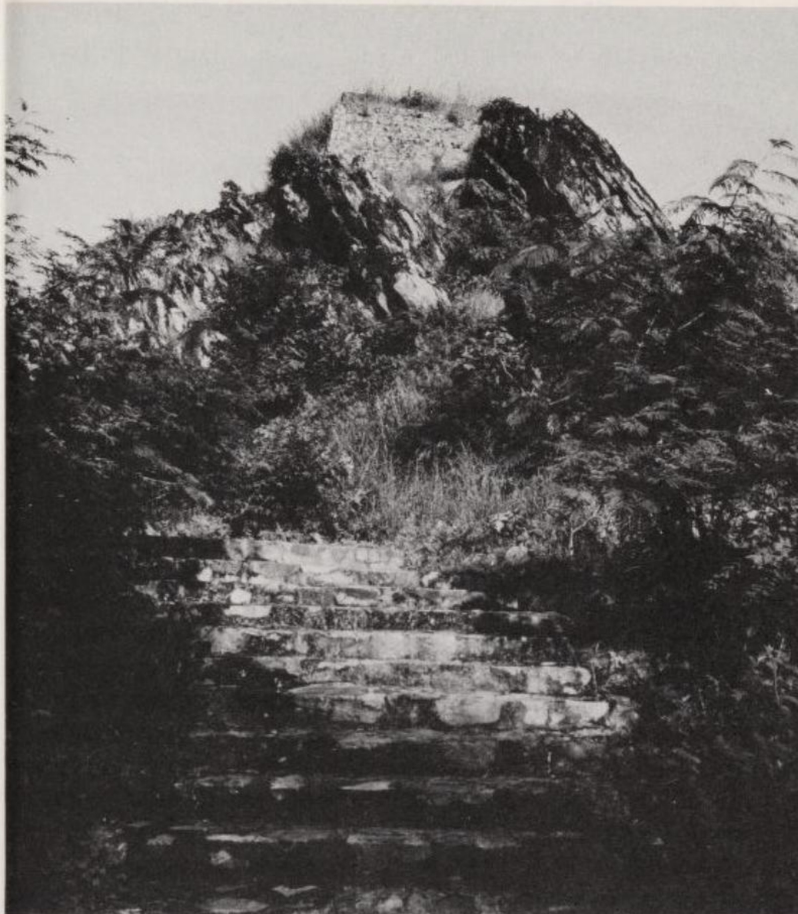

*'Đỉnh Núi Thứu' (Vulture Peak) ở Rājagaha (Vương Xá). Vì lý do chiến lược, Rājagaha, thủ đô của vương quốc Magadha (Ma-kiệt-đà) cổ đại, được xây dựng giữa vùng đồi núi. Do đó, vào mùa hè Ấn Độ, nơi này nóng bức ngột ngạt, còn vào mùa gió mùa thì ẩm ướt và bức bí. Vì vậy, Đức Phật Thích Ca (Gotama) rất thích dành thời gian trên Đỉnh Núi Thứu. Tại đây ngài đã thuyết giảng hàng chục bài pháp. Nền phẳng trên đỉnh tảng đá là công trình được xây dựng sau này.*

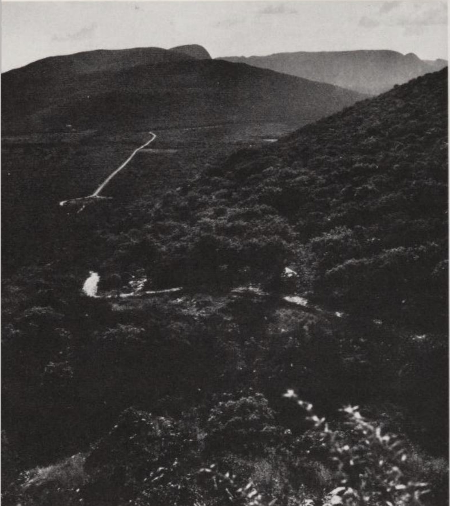

*Từ Đỉnh Núi Thứu, phóng tầm mắt nhìn lại thung lũng Rājagaha nay đã không còn người ở. Thị trấn Rājgir hiện đại nằm bên ngoài thung lũng. Đường lên Đỉnh Núi Thứu bắt đầu từ tàn tích của tu viện mà Jīvaka — ngự y của vua Bimbisāra (Tần-bà-sa-la) nước Magadha và theo lệnh vua cũng là y sĩ cho tăng đoàn — đã cúng dường cho Đức Phật. Lên cao hơn trên con đường này, có lẽ ở đoạn đường trong ảnh, ta sẽ đi qua nơi Devadatta (Đề-bà-đạt-đa) từng mưu toan giết thầy mình bằng cách lăn một tảng đá lớn xuống nhưng thất bại.*
*Sau khi Đức Phật nhập diệt (483 TCN), Đại hội Kết tập Kinh điển lần thứ nhất đã diễn ra trong một hang động tại một trong những ngọn núi quanh Rājagaha.*

## Những Giáo Lý Cơ Bản Của Đại Thừa

### 1. PHẬT HỌC (THE BUDDHOLOGY)

Khi giàn thiêu xác Đức Phật vào năm 483 TCN nguội đi, ký ức về người đã khuất bắt đầu tách rời khỏi các sự kiện lịch sử; nhiều thập kỷ sau, trong tâm trí của nhiều Phật tử, nó đã được chuyển hóa thành huyền thoại. Liệu một người trần mắt thịt bình thường có thể khám phá ra những quy luật vũ trụ được đúc kết trong Giáo pháp? Liệu một con người có thể mang lại sự giải thoát cho biết bao nhiêu người? Phải chăng Thích Ca (Gotama) thực chất là một siêu nhân? — Tại Đại hội Kết tập lần thứ hai (khoảng năm 383 TCN), khi cộng đồng ban đầu chia tách thành Thượng Tọa Bộ (Theravādins) và Đại Chúng Bộ (Mahāsāṅghikas), nhóm thứ hai đã tán thành quan điểm này. Trong *Mahāvastu* (Đại Sự), một cuốn 'tiểu sử' đồ sộ về Đức Phật, nơi Gotama xuất hiện như một vị anh hùng làm phép màu, họ đã thể hiện khái niệm của mình về bản chất của bậc đạo sư dưới hình thức văn học.

Một tác phẩm thứ hai, ra đời sau đó với tựa đề *Lalitavistara* (Kinh Phổ Diệu) và xuất phát từ trường phái Nhất Thiết Hữu Bộ (Sarvāstivāda), đã đẩy sự lý tưởng hóa này đi xa hơn và diễn giải cuộc đời của Gotama như một 'vở kịch' (play / *lalita*) của một vị Phật mang bản chất siêu thế. *Lalitavistara* đánh dấu điểm chuyển tiếp từ Tiểu thừa sang Đại thừa.

Trong Kinh Diệu Pháp Liên Hoa (*Saddharmapuṇḍarīkasūtra*), được sáng tác vào thế kỷ 1 SCN và có kết hợp các chất liệu cũ hơn, cuối cùng chúng ta bắt gặp Đức Phật trong một khái niệm đặc trưng của Đại thừa: đấng cứu thế vũ trụ và người ban phát sự giải thoát.

> Giống như một đám mây, ... vươn lên bầu trời và che phủ tất cả, bao trùm khắp mặt đất, (5)
>
> giống như đám mây lớn ấy, ngậm đầy nước và điểm xuyết những tia chớp, vang lên tiếng sấm và làm hoan hỉ mọi sinh linh (6)
>
> giống như thế, (đám mây) tuôn trào một khối nước khổng lồ (và), đổ mưa khắp nơi, tưới mát trái đất này (8)
>
> — cũng vậy, Đức Phật xuất hiện trên thế gian như một đám mây và sau khi ngài, Bậc Đạo Sư của Thế Gian, xuất hiện, ngài chỉ bày cho (tất cả) chúng sinh Đạo Hạnh Chân Chính. (16)
>
> Và bậc đại tiên được (cả) thế gian cùng chư thiên tôn thờ tuyên bố như sau: 'Ta là Đấng Hoàn Thiện (Như Lai), người bậc nhất trong nhân loại, đấng chiến thắng, xuất hiện trên thế gian như một đám mây. (17)
>
> Ta muốn tưới mát mọi chúng sinh đang héo mòn thân xác (và) những ai còn bám víu vào sự tồn tại ở ba cõi (trong ba tầng thế giới). Những kẻ đang héo mòn trong đau khổ, ta sẽ dẫn dắt đến hạnh phúc; ta sẽ (đáp ứng) những ước nguyện của họ và ban cho họ sự bình yên (peace / *nirvṛti*). (18) Hãy lắng nghe ta, hỡi đám đông chư thiên và nhân loại, hãy đến gần hơn để chiêm ngưỡng ta! Ta là Đấng Hoàn Thiện, đấng tôn quý, đấng tối cao; ta sinh ra trên thế gian này là vì sự giải thoát (của muôn loài).' (19) (SP 5 tr. 61 f.)

Với tư cách là một đấng siêu việt, Đức Phật làm chủ cả không gian và thời gian. Ngài nói về chính mình:

> Hàng ngàn triệu kiếp sống không thể nghĩ bàn với độ dài không bao giờ đo đếm được đã trôi qua kể từ khi ta lần đầu tiên đạt được giác ngộ; (từ đó) ta liên tục giảng dạy giáo pháp. (1)
> 
> Ta dùng (giáo pháp) để nắm bắt vô số Bồ tát và chuyển hóa họ vào trí tuệ của Phật. Trong nhiều triệu kiếp sống, ta đã giúp nhiều triệu vạn chúng sinh chín muồi (để đạt đến giác ngộ). (2)
> 
> Ta tạo ảo giác (cho chúng sinh thấy) cảnh giới Niết bàn. Đây là một phương tiện để rèn luyện (đạo đức) khi ta nói với chúng sinh (về điều đó). Tuy nhiên, ta không hề diệt độ; ta vẫn ở đây (trên thế gian) và hiển lộ giáo pháp. (3)
> 
> Khi họ (tức là con người) coi ta như đã hoàn toàn tĩnh diệt (perfectly extinct / *pari-nirvṛta*), họ dâng đủ loại cúng dường lên xá lợi. Vì không nhìn thấy ta (nên) họ nảy sinh lòng khao khát (hướng về ta). Nhờ đó mà tâm trí họ trở nên ngay thẳng, trong sạch. (5)
> 
> Khi chúng sinh trở nên ngay thẳng, hiền hòa, nhẫn nhục và thoát khỏi lòng tham, thì ta sẽ triệu tập một hội chúng các đệ tử và hiện thân (trước họ) trên Đỉnh Núi Thứu. (6)
> 
> Và rồi ta nói với họ thế này: 'Này các tỳ kheo, ta không hề diệt độ ở đây (trong thế giới này). (Sự diệt độ bề ngoài của ta) chỉ là một kỹ xảo khéo léo của ta (để khích lệ chúng sinh). Ta lại liên tục sinh ra trong thế giới của các sinh linh.' (7) (SP 15 tr. 211 f.)
 
Theo đó, cuộc đời trần thế của Đức Phật Thích Ca và sự nhập niết bàn của ngài chỉ là những ảo ảnh mà vị Phật vượt thời gian và siêu việt đã phóng chiếu xuống thế gian để dẫn dắt nhân loại đến với tri thức và hành vi đạo đức.

Trong việc truyền giảng giáo pháp, Đức Phật hoàn toàn không thiên vị:

> Bằng một giọng điệu (duy nhất) ta tuyên thuyết giáo pháp (cho tất cả mọi người) và luôn nhấn mạnh giác ngộ là mục tiêu cuối cùng. Bởi vì điều này là giống nhau (đối với tất cả chúng sinh), (trong ta) không có sự thiên vị; ta không có cảm tình riêng cũng chẳng có ác cảm (với ai) (21).
>
> Ta tưới mát toàn bộ thế giới này như một đám mây đổ mưa đều đặn (lên tất cả mọi người). Sự giác ngộ là như nhau đối với kẻ cao quý lẫn người thấp hèn, cho kẻ ác cũng như người thiện. (24) (SP 5 tr. 62 f.)

Tuy nhiên, không phải ai cũng có thể nhìn thấy Đức Phật. Một người có thể nhìn thấy ngài hay không còn phụ thuộc vào hành động (nghiệp / *karman*) của người đó. Về những kẻ đã tự gánh lấy ác nghiệp (unwholesome karman), ngài nói:

> Trong nhiều triệu kiếp sống, khi sinh ra, họ không được nghe tên ta cũng không nghe tên (của những) Đấng Hoàn Thiện (nào khác), không được nghe tên giáo pháp cũng như tên cộng đồng (tỳ kheo) của ta. Đó là quả báo của hành động xấu. (15)
>
> Nhưng khi những chúng sinh hiền hòa và nhẫn nhục sinh ra ở thế giới loài người này, nhờ những hành động tốt đẹp của mình, họ sẽ thấy ta đang hiển lộ giáo pháp ngay khi vừa chào đời. (16) (SP 15 tr. 213)

Những hành động tốt (*karman*) hay nói chính xác hơn là những ý định hành động tốt (action-intentions / *saṃskāra*) sẽ mở mắt con người để thấy Phật và mở tai để nghe giáo pháp của ngài.

Tất cả các đoạn trích dẫn từ nãy đến giờ chỉ nói về một vị Phật duy nhất. Vậy Thích Ca có phải là vị Phật duy nhất từng xuất hiện trên thế gian không? Tất cả các nguồn tài liệu Phật giáo, cả Tiểu thừa và Đại thừa, đều phủ nhận điều này bằng cách kể tên những vị Phật khác bên cạnh Thích Ca. Theo niềm tin của Đại thừa, số lượng chư Phật nhiều như cát trên bờ sông Hằng. Trong mọi hệ thống thế giới, mọi khu vực của thế giới và trong mọi thời đại, các Đấng Hoàn Thiện đều xuất hiện để chỉ cho chúng sinh thấy cỗ xe Phật (buddha-vehicle / *buddhayāna* = Đại thừa) dẫn đến sự toàn tri (SP 2 tr. 31 f.).

### 2. HỌC THUYẾT VỀ BA THÂN (THE DOCTRINE OF THE THREE BODIES)

Thượng Tọa Bộ coi chư Phật là con người, Đại Chúng Bộ coi họ là siêu nhân, Nhất Thiết Hữu Bộ coi họ là những sinh thể cõi trời. Để hài hòa những khác biệt này, Nhất Thiết Hữu Bộ đã đưa ra hệ thống Ba Thân (Three Bodies / *trikāya*), sau này được Đại thừa tiếp nhận và điều chỉnh cho phù hợp với khái niệm Phật siêu việt của mình. Theo học thuyết này, bên trên các vị Phật Trần Thế mang thân xác vật chất thô trược, còn có những vị Phật mang bản chất siêu phàm với thân xác vi tế. Trên tầng này lại là nguyên lý pháp (dharma-principle), tức Cái Tuyệt Đối phi vật chất hiện hữu trong vạn vật. Pháp thân (dharma body) này là điểm chung của tất cả chư Phật.

Học thuyết Ba Thân tạo nên bộ khung tâm linh của Phật học Đại thừa. Trong các Kinh điển cũ, nó xuất hiện dưới dạng sơ khai. Chính các triết gia của trường phái Du Già Hành (Yogācāra) mới là những người tạo ra hình hài cuối cùng cho nó. [^ND-7]

#### I. Pháp thân (Dharmakāya)

Ý nghĩa của thuật ngữ *dharma* (pháp) thay đổi tùy theo ngữ cảnh. Từ này chỉ:

(a) Trật tự vũ trụ, quy luật tự nhiên chi phối thế giới của chúng ta, nguyên lý vận hành cơ học-tâm trí của sự tồn tại mà mọi thứ phải tuân theo để có thể hiện hữu. Theo nghĩa này, *dharma* là cái điều kiện hóa mọi hiện tượng.

(b) Giáo pháp của Đức Phật, trong đó quy luật tự nhiên này được hiển lộ và diễn đạt thành lời. Vì sự đồng nhất giữa đối tượng và lời miêu tả là tiêu chuẩn của chân lý, và Phật giáo giả định có sự thống nhất hoàn toàn giữa quy luật tự nhiên và cách diễn đạt nó bằng lời trong giáo pháp của Phật, nên *dharma* với nghĩa 'giáo pháp' bao hàm cả 'chân lý' và 'thực tại'.

(c) Hơn nữa, *dharma* còn được gọi là các quy tắc ứng xử mà Thích Ca rút ra từ quy luật tự nhiên, và việc tuân thủ chúng sẽ dẫn đến sự tái sinh tốt đẹp hơn. Tóm lại, *dharma* ở đây là tên gọi cho những hành động thiện lành về mặt nghiệp quả.

(d) Ngoài ra, *dharma* còn là những biểu hiện từng phần của quy luật tự nhiên, cụ thể là 'các sự kiện' hoặc 'sự vật', dù được hiểu trực tiếp hay

(e) như những hình ảnh phản chiếu trong tâm trí của người quan sát. Trong ý nghĩa thứ hai này, *dharma* phải được dịch là 'nội dung tư tưởng', 'đối tượng tâm trí' hoặc 'ý tưởng'.

(f) Cuối cùng, *dharma* là thuật ngữ chuyên môn chỉ 'các yếu tố của sự tồn tại' (factors of existence). Từ thời kỳ Tiểu thừa hậu kỳ, chúng được coi là những yếu tố cấu thành nên con người kinh nghiệm (empirical person) và thế giới chủ quan của người đó. Theo nghĩa này, từ *dharma* thường xuất hiện ở dạng số nhiều.

Trong từ ghép *dharmakāya* (pháp thân), *dharma* chủ yếu được hiểu theo các nghĩa (a) và (b), nhưng nội dung của nó còn vượt xa hơn thế. Dharmakāya là chân lý hoặc thực tại tự quy tâm (self-centred), vừa nội tại vừa siêu việt của mọi chúng sinh và vạn vật: đó là Cái Tuyệt Đối vĩnh cửu, không thể bị phá hủy, là bản chất duy nhất bên trong và đằng sau tất cả những gì đã, đang và sẽ tồn tại. Nó là thể mang (bearer) và là đối tượng của sự giác ngộ hay Phật tính.

Các văn bản Đại thừa phân biệt rõ liệu Dharmakāya trong một đoạn văn cụ thể đang chỉ (i) bản chất của chúng sinh trần tục hay (ii) bản chất của chư Phật.

(i) Theo nghĩa thứ nhất, Dharmakāya còn được gọi là thực tại (reality / *dharmatā*), cốt lõi của thực tại (core of reality / *dharmadhātu* - pháp giới), chân như (thusness / *tathatā*), chân như của sự tồn tại (thusness of existence / *bhūtatathatā*), bản thể thân (essential body / *svabhāvakāya*), tính không (emptiness / *śūnyatā* - không tính) và tàng thức (base-consciousness / *ālayavijñāna* - a lại da thức). Trong một chúng sinh, nếu Dharmakāya càng dễ nhận biết thì chúng sinh đó càng có thứ bậc cao trong hệ thống phân cấp tâm linh.

(ii) Khi Dharmakāya được xem là bản chất nội tại của chư Phật, nó được gọi là Phật tính (Buddhaness / *buddhatā*), bản tính Phật (Buddha nature / *buddhasvabhāva*) và Thai tạng của các Đấng Hoàn Thiện (Matrix of the Perfect Ones / *tathāgatagarbha* - Như Lai tạng).

Dharmakāya là Thân duy nhất trong Ba Thân mà tất cả chư Phật đều có chung. [23](/giaolyvatongphai/notes#23){.note} Dù đã và đang có vô số chư Phật Trần Thế và vô lượng chư Phật Siêu Việt, nhưng chỉ có một Dharmakāya duy nhất. Những chúng sinh ở trình độ nhận thức thấp hơn sẽ thấy một sự đa dạng của chư Phật và thấy sự đối lập giữa chư Phật và thế giới hiện tượng. Tuy nhiên, những ai đã đạt đến giác ngộ và trí tuệ siêu việt sẽ trải nghiệm trong Dharmakāya sự đồng nhất và hợp nhất về mặt bản chất, không chỉ giữa chư Phật với nhau, mà còn giữa chư Phật với chúng sinh của thế giới. Chính quan điểm này đã đóng dấu Đại thừa là một hệ thống nhất nguyên.

Mọi nỗ lực nhằm diễn đạt nhiều hơn về Dharmakāya đều chắc chắn thất bại ngay từ đầu. Dharmakāya không có bất kỳ dấu hiệu nhận biết nào để có thể miêu tả nó. Thậm chí không thể giải thích nó bằng phương pháp phủ định. Cách làm đó sẽ buộc phải đặt nó đối lập với một thứ khác và coi nó như một cực trong hệ nhị nguyên. Tuy nhiên, Dharmakāya là thực tại tuyệt đối, ngoài nó ra không có một thực tại nào khác. Cho dù giáo lý của các trường phái Đại thừa có phân kỳ đến đâu, tất cả đều đồng nhất Cái Tuyệt Đối với Dharmakāya.

Dù vậy, không có sự nhất trí về bản chất của Dharmakāya. Khác với phần lớn các Kinh điển vốn quan niệm nó là một thứ phi nhân cách (impersonal), như một thực thể trung tính, một số văn bản lại hiểu nó mang tính nhân cách và gán cho nó các phẩm hạnh, đặc biệt là lòng từ bi. Ví dụ, Kinh Lăng Già (*Laṅkāvatārasūtra*) gọi Dharmakāya là Phật của Pháp (Buddha of the Law / *dharma(tā)buddha*), Phật mang Trí tuệ của Đấng Hoàn Thiện (Buddha with the Knowledge of a Perfect One / *tathāgatajñānabuddha*) hoặc là Đấng Hoàn Thiện làm Cội Nguồn (Perfect One who is the Root / *mūlatathāgata*). Một số trường phái Mật thừa (Tantrayāna) thờ phụng Dharmakāya như vị Phật Nguyên Thủy (Primordial Buddha / *ādibuddha*) hoặc Đại Phật (Great Buddha / *mahābuddha*) và khắc họa ngài trong điêu khắc và hội họa. Tùy thuộc vào những thuộc tính nào được họ coi là quan trọng nhất ở vị Phật Nguyên Thủy, họ sẽ trao địa vị của ngài cho Vajrasattva (Kim Cang Tát Đỏa) = Vajradhara (Kim Cang Trì), Vairocana (Đại Nhật Như Lai), hoặc Akṣobhya (A Súc Bệ Như Lai).

Mặc dù Dharmakāya, vốn thoát khỏi mọi yếu tố ngẫu nhiên (accidentals), chỉ có thể được thấu hiểu bởi những bậc giác ngộ, nhưng ngay cả những chúng sinh chưa hoàn thiện cũng có thể trải nghiệm nó. Tùy thuộc vào mức độ hoàn thiện của họ, họ nhận thức nó dưới hình thức vi tế là Báo thân (Sambhogakāya) hoặc dưới biểu hiện thô trược là Hóa thân (Nirmāṇakāya). Các Kinh điển gộp hai Thân này lại dưới thuật ngữ sắc thân (form-body / *rūpakāya*).

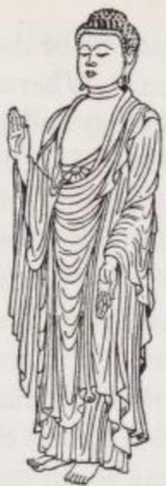

*Amitābha, tiếng Nhật: Amida (A Di Đà) (theo một bức điêu khắc Nhật Bản thế kỷ 13). Tay phải ngài giơ lên trong thủ ấn ban sự bảo vệ, tay trái hạ xuống trong thủ ấn ban phước. Ngón trỏ gập lại biểu thị phần nỗ lực tự thân còn lại mà tín đồ cần có. Phong cách nghệ thuật Phật giáo Nhật Bản cho thấy những ảnh hưởng từ nghệ thuật Phật giáo Hy Lạp.*

#### II. Báo thân (Sambhogakāya)

Dưới tên gọi 'Sambhogakāya', 'Thân Hỉ Lạc' (Báo thân) — một thuật ngữ chưa bao giờ được giải thích một cách thỏa đáng — Đại thừa tóm lược về chư Phật Siêu Việt. 'Siêu việt' nghĩa là họ không thể được nhận thức bằng các giác quan, mà chỉ có thể được trải nghiệm về mặt tâm linh. Vì điều này đòi hỏi người tìm cầu giải thoát phải phát triển những sức mạnh tâm trí cần thiết, nên những người phàm tục không thể nhìn thấy họ, mà chỉ có các vị Bồ tát bậc cao mới chiêm ngưỡng được họ bằng con mắt tâm linh dưới dạng những thực thể tỏa sáng.

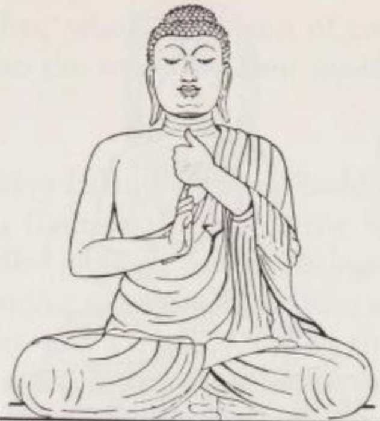

*Vairocana (Đại Nhật Như Lai) (theo một bức điêu khắc Hàn Quốc thế kỷ 7/8). Ngón trỏ của bàn tay phải tượng trưng cho Cái Tuyệt Đối duy nhất, được bao bọc bởi số nhiều (các ngón của bàn tay trái). Nghệ thuật Hàn Quốc cũng chịu ảnh hưởng của nghệ thuật Gandhāra.*

Những người theo Đại thừa có thiên hướng trí thức thường hiểu các vị Phật Sambhogakāya theo khía cạnh tâm lý học như là những sáng tạo của tâm trí, những ý niệm (ideations) của các Bồ tát: đối với Bồ tát, lý tưởng của ngài trở nên vô cùng sống động và chân thực đến mức nó thành hình như một thực tại chủ quan. Được tạo ra trong trải nghiệm về Cái Tuyệt Đối, chư Phật Siêu Việt được coi là những biểu hiện của Cái Tuyệt Đối và do đó có mức độ thực tại cao hơn các vật thể của thế giới vật chất.

Một số Kinh điển thực sự có chứa những đoạn văn gợi ý cách giải thích này; trong Mật thừa (Tantrayāna), nó thậm chí còn trở thành quan điểm chuẩn mực. Tuy nhiên, không nghi ngờ gì khi phần lớn tín đồ Đại thừa ở châu Á coi chư Phật Siêu Việt là những sinh thể tồn tại khách quan, siêu phàm và vi tế. Tín ngưỡng dân gian xem các ngài như những đấng thiêng liêng ở cõi trời mà người ta có thể cầu nguyện để được tái sinh vào một cõi tịnh độ (paradise).

Tương tự, các ý kiến cũng phân kỳ về quá khứ của những vị Phật này. Trong các Kinh điển, đôi khi họ được xem là những sinh thể vĩnh cửu luôn luôn tồn tại và chưa bao giờ phải leo lên nấc thang giải thoát. Tuy nhiên, phổ biến hơn — và hợp lý hơn trong hệ thống Phật giáo — là quan điểm cho rằng trong quá khứ xa xôi, họ đã phải tự mình tu tập để đạt đến Phật tính. Một số tiểu sử tiền kiếp của chư Phật Siêu Việt được ghi lại trong các Kinh điển.

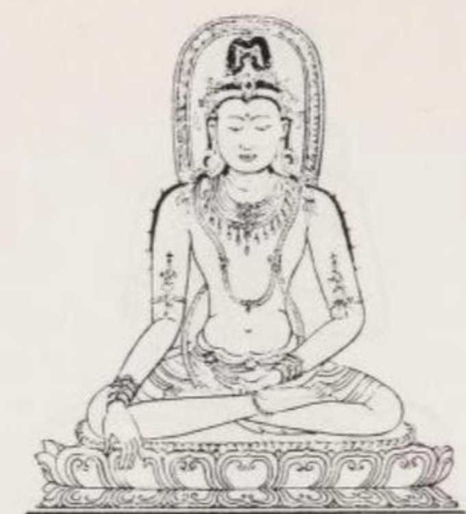

*Ratnasambhava (Bảo Sinh Như Lai) (theo một bức tranh cuộn treo của Nepal). Tay phải đang trong thủ ấn ban phước, tay trái trong thủ ấn thiền định. Tay trái cầm viên ngọc như ý Cintāmaṇi, viên ngọc này vô hình do đặc tính trong suốt của nó.*

Vị Phật Siêu Việt phổ biến nhất cho đến nay là Amitābha (Đấng Vô Lượng Quang / A Di Đà Phật), người còn được gọi là Amitāyus (Đấng Vô Lượng Thọ) và ở Đông Á là Amida. Trong một kiếp quá khứ, ngài được cho là đã lập bốn mươi sáu lời thề nguyện, qua đó ngài tự ràng buộc mình phải dẫn dắt tất cả những chúng sinh nào từng nhớ đến ngài như một vị Phật, được tái sinh vào 'Tịnh Độ' Sukhāvatī (Cực Lạc). Những vị Phật Siêu Việt khác rất được tôn kính là Vairocana (Đấng Tỏa Sáng Như Mặt Trời / Đại Nhật Như Lai), Akṣobhya (Đấng Không Thể Lay Chuyển / A Súc Bệ), Ratnasambhava (Đấng Sinh Ra Từ Viên Ngọc / Bảo Sinh Như Lai), Amoghasiddhi (Đấng Có Phép Thuật Không Bao Giờ Thất Bại / Bất Không Thành Tựu Như Lai) và Vajrasattva (Đấng Có Bản Chất Là Kim Cang / Kim Cang Tát Đỏa) hoặc Vajradhara (Người Giữ Kim Cang / Kim Cang Trì). Các Kinh điển đề cập đến một số lượng lớn chư Phật Siêu Việt, riêng Kinh Diệu Pháp Liên Hoa đã liệt kê hai mươi ba vị. Về mặt lý thuyết, số lượng của họ nhiều như 'cát trên bờ sông Hằng'.

Chư Phật Siêu Việt hỗ trợ sự giải thoát của chúng sinh theo ba cách:
Thứ nhất, họ là những bậc đạo sư của các Bồ tát. Thỉnh thoảng, họ tập hợp các Bồ tát và đệ tử xung quanh mình, rồi giảng giải cho họ về sự đồng nhất cơ bản giữa Luân hồi (Saṃsāra) và Niết bàn (Nirvāṇa). 
Thứ hai, họ là chủ nhân của các cõi tịnh độ khác nhau, nơi nhiều tín đồ khao khát được tái sinh vào. Lộng lẫy nhất trong số này là cõi tịnh độ của Phật Amitābha. 
Và thứ ba, họ là những người cha tâm linh của các Hóa thân (Nirmāṇakāya) tức chư Phật Trần Thế, những người mà vì lòng từ bi với mọi chúng sinh, đã được họ phóng chiếu vào thế giới thông qua thiền định (meditation / *dhyāna*). [24](/giaolyvatongphai/notes#24){.note}

#### III. Hóa thân (Nirmāṇakāya)

Hóa thân là tất cả những vị Phật nào là người bằng xương thịt, giống như vị Phật lịch sử Thích Ca (Gautama), xuất hiện trên thế gian dưới hình hài con người. Họ được gọi là *nirmāṇa* - 'những sinh thể hiển lộ' (manifest beings), vì bản chất thô trược của họ. Theo một cách giải thích khác, *nirmāṇa* có nghĩa là 'sự sáng tạo (bằng phép màu)' và thể hiện rằng trong Đại thừa, chư Phật Trần Thế được coi là những hình ảnh phóng chiếu từ thiền định của chư Phật Siêu Việt. Kinh Lăng Già (*Laṅkāvatāra-sūtra*) cũng ngụ ý điều tương tự khi nói về họ như 'thân thể được tạo ra từ tâm ý' (body consisting of thought / *manomayakāya* - ý sinh thân).

Là những con người bằng xương bằng thịt, chư Phật Nirmāṇakāya cũng phải chịu đựng nỗi khổ của tuổi già, bệnh tật và cái chết như bao chúng sinh bình thường khác. Tuy nhiên, họ khác biệt với người thường ở ba mươi hai tướng tốt trên cơ thể và một số khả năng siêu nhiên, trong đó có Thiên Nhãn và Thiên Nhĩ, giúp họ có thể nhận thức được những gì bị che khuất.

Chức năng của chư Phật Trần Thế là giảng giải Đạo pháp (Dharma), tức chân lý đã được hệ thống hóa, cho thế gian. Họ là những bậc thầy, những biển chỉ đường dẫn đến sự giải thoát nhưng không có quyền năng rút ngắn con đường của người tìm kiếm. Hơn nữa, vì họ sẽ bị tĩnh diệt với tư cách cá nhân khi qua đời, việc cầu nguyện họ là vô ích, ngoại trừ việc nghĩ về họ sẽ giúp thanh lọc trái tim và tạo ra một khuynh hướng nội tâm thiện lành.

-----

Một số tên thường xuyên được nhắc đến trong các **Sūtra** lại không xuất hiện trong hệ thống này; trong khi đó, một số tên có mặt trong hệ thống lại chỉ giữ vị trí phụ trong các văn bản kinh điển. Hơn nữa, việc chỉ gán một Bồ-tát cho mỗi vị trong Năm vị Phật là điều không thật thuyết phục, bởi số lượng Bồ-tát là vô hạn.

Tuy vậy, bất chấp những điểm có thể phản đối này, hệ thống vẫn hữu ích vì nó giúp làm sáng tỏ cấu trúc của học thuyết **Ba Thân**. Không hiểu cấu trúc này thì không thể thực sự tiếp cận Đại thừa, bởi chính hệ thống này cho phép các văn bản mô tả các vị Phật vừa **đang hoạt động**, vừa **xa rời hoạt động** — tùy theo đoạn văn đang nói đến các **Đức Phật Trần gian** hay các **Đức Phật Siêu Việt**.

Việc chuyển qua lại giữa các tầng cấp này cho phép các văn bản đưa ra những phát biểu mà, xét trên bề mặt, có vẻ nghịch lý và khó hiểu đối với người chưa được làm quen với hệ thống này.

-----
Trong lịch sử Đại thừa, đã có nhiều nỗ lực nhằm hệ thống hóa học thuyết **Ba Thân** bằng cách đưa các tên gọi cụ thể vào trong hệ thống đó. Hệ thống tên gọi được nhắc đến thường xuyên nhất được hình thành vào khoảng thế kỷ thứ ba hoặc thứ tư CN trong **Vajrayāna** (Kim Cương thừa), một nhánh thuộc **Tantrayāna** của Phật giáo. Trong hệ thống này, đến khoảng năm 750 CN đã được Đại thừa nói chung công nhận rộng rãi, **một Dharmakāya duy nhất**, tức Pháp thân chung cho tất cả chúng sinh, được đặt ở vị trí cao nhất. Bên dưới Pháp thân là **Năm vị Phật Siêu Việt** (Five Transcendent Buddhas). Mỗi vị trong năm vị này được gắn với một **Đức Phật Trần gian**, và với một **Bồ-tát Siêu Việt** có vai trò như một người trợ giúp thế giới khi thế giới cần đến họ

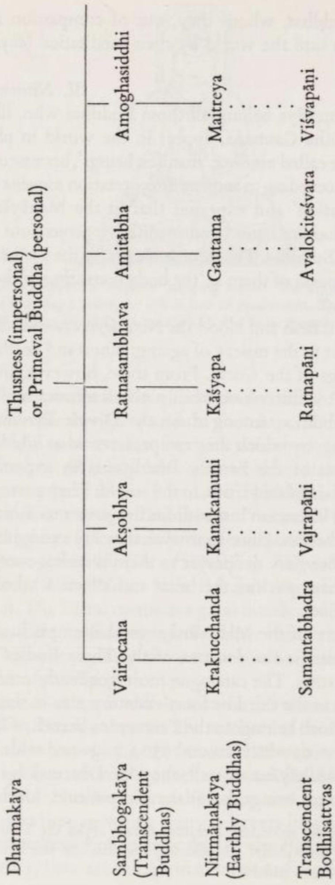
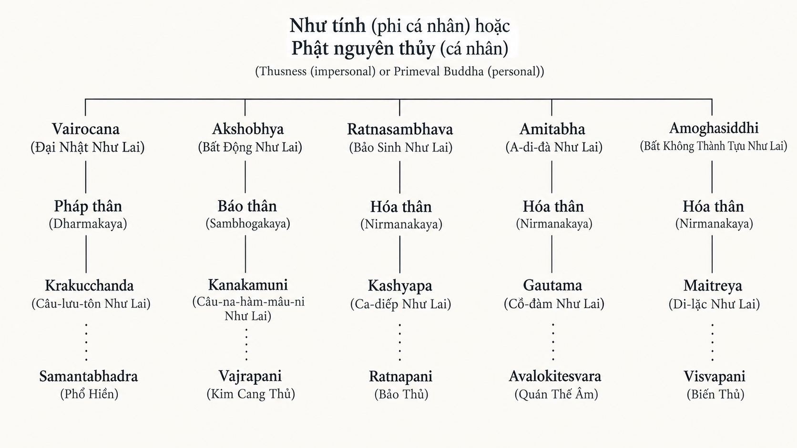

Một số tên gọi thường được nhắc đến trong các Kinh điển lại vắng mặt trong hệ thống này; một số tên khác xuất hiện trong hệ thống thì lại giữ vị trí phụ trong các văn bản. Hơn nữa, việc chỉ phân công một Bồ tát cho mỗi vị trong Năm Vị Phật là không thuyết phục vì số lượng Bồ tát là vô hạn. Tuy nhiên, bất chấp những điểm chưa hợp lý này, hệ thống vẫn hữu ích vì nó làm sáng tỏ cấu trúc của học thuyết Ba Thân. Nếu không hiểu được điều này, người ta sẽ không thể tiếp cận được Đại thừa, bởi chính hệ thống này cho phép các văn bản miêu tả chư Phật vừa năng động lại vừa tách biệt khỏi hành động — tùy thuộc vào việc đoạn văn đang nói về chư Phật Trần Thế hay chư Phật Siêu Việt. Việc nhảy qua nhảy lại giữa các cấp độ này tạo ra những tuyên bố mà với sự nghịch lý (bề ngoài) của chúng, những người chưa được khai tâm sẽ không thể hiểu nổi.

Phật giáo Thiền tông (Zen / tiếng Hán: Ch'an) (từ thế kỷ 6 SCN trở đi ở Trung Quốc) đã diễn giải lại học thuyết Ba Thân theo một cách thú vị. Nó cho rằng tất cả chúng sinh đều dự phần vào cả Ba Thân. Bất cứ ai cũng là Hóa thân (Nirmāṇakāya) chừng nào họ còn sở hữu một cơ thể, là Báo thân (Sambhogakāya) chừng nào họ đã giải phóng mình khỏi những gông cùm trần tục, và là Pháp thân (Dharmakāya) chừng nào họ đồng nhất với Cái Tuyệt Đối.

### 3. CÁC VỊ BỒ TÁT (THE BODHISATTVAS)

'Bồ tát' (Bodhisattva) là cái tên mà Đại thừa dùng để chỉ những chúng sinh (beings / *sattva*) đang nỗ lực có hệ thống để đạt được giác ngộ (enlightenment / *bodhi*), tức là Phật tính (Buddhahood) [25](/giaolyvatongphai/notes#25){.note}, hoặc những người đã đạt được nó nhưng trì hoãn việc nhập Niết bàn Tĩnh (Static Nirvāṇa) tức Niết bàn sau khi chết (Post-mortal Nirvāṇa / *parinirvāṇa*) cho đến khi tất cả chúng sinh được giải thoát. Các Bồ tát sống hoàn toàn vì người khác. Thái độ của họ được định hướng bởi lòng thương xót hay từ bi (compassion / *karuṇā*), mong muốn mang lại hạnh phúc cho người khác mà không màng đến lợi ích cá nhân:

> Không có hành động nào là phù hợp với các Bồ tát nếu nó không (mang lại lợi ích) cho người khác, ... điều này được trình bày chi tiết trong Kinh Pháp Tập (Dharma-saṅgītisūtra) cao quý. Bất cứ việc gì các Bồ tát (thực hiện, dù là) bằng thân, khẩu (hay) ý, tất cả những gì họ làm vì (lợi ích của) người khác, (chỉ duy nhất) được dẫn dắt bởi Đại Bi Tâm dành cho mọi chúng sinh; (tất cả điều này) đều có nguyên nhân là việc hiện thực hóa phúc lợi cho chúng sinh và bắt nguồn từ ước nguyện tha thiết mong muốn sự an lành và hạnh phúc cho tất cả muôn loài. (Śs 5 tr. 66)

Niềm tin sâu sắc nhất của một Bồ tát là không có sự khác biệt về bản chất giữa ngài và tất cả những người khác. Chính qua niềm tin vào sự đồng nhất về bản chất của mọi chúng sinh (essential identity of all beings / *sattvasamatā*) và qua lòng từ bi mà người ta có thể nhận ra một vị Bồ tát.

Trong khi chư Phật Trần Thế, với nhiệm vụ truyền giảng Đạo pháp trên thế gian, chỉ có thể giúp đỡ những người chưa giải thoát bằng cách ban cho họ những lời chỉ dạy, thì các Bồ tát lại chủ động can thiệp vào thế gian và sẵn sàng gánh lấy nỗi khổ của mọi chúng sinh lên đôi vai mình. Bồ tát long trọng thề nguyện:

> Ta tự gánh lấy gánh nặng đau khổ, ta quyết tâm (làm điều đó), ta chịu đựng nó ... Và tại sao? Bằng mọi giá ta phải (cất đi) gánh nặng (đau khổ) của tất cả chúng sinh. Lý do (cho quyết tâm này) không phải vì ta tìm thấy niềm vui trong đó. (Đúng hơn là) ta đã (nghe thấy) lời cầu xin cứu rỗi của tất cả chúng sinh ... Ta quyết tâm lưu lại trong mọi cảnh giới khổ đau trong vô số chục triệu kiếp sống ... Thà rằng một mình ta (gánh chịu) đau khổ còn hơn là để tất cả những chúng sinh này rơi vào các cõi khổ đau. (Śs 16 tr. 148)

Cùng với mức độ tự nguyện gánh chịu đau khổ của thế gian, Bồ tát sẵn sàng hy sinh thân thể, vật chất và cả những công đức nghiệp của mình nếu làm vậy có thể giúp một chúng sinh tiến gần hơn đến sự giải thoát:

> Thân thể ta (trong mọi kiếp tái sinh) cũng như mọi tài sản và niềm vui mà ta đã (và sẽ) có được trong Ba Thời (quá khứ, hiện tại và tương lai), ta thản nhiên cho đi vì phúc lợi của tất cả chúng sinh. (3, 10)
> 
> Niết bàn là sự buông bỏ tất cả, và Niết bàn là mục tiêu trong tâm trí ta. Vì đằng nào ta cũng phải buông bỏ tất cả, nên tốt hơn hết là trao nó cho chúng sinh. (3, 11)
> 
> Những điều tốt đẹp (về mặt nghiệp) (sinh ra) cho ta từ việc suy ngẫm về (cách để làm cho tất cả chúng sinh) bước vào Con Đường Giác Ngộ, thông qua (những thiện nghiệp) này, nguyện cho tất cả chúng sinh (có được) món đồ trang sức của Con Đường Giác Ngộ. (10, 1)
> 
> Bao nhiêu (chúng sinh) ở khắp các vùng thế giới đang phải chịu đựng bệnh tật về thể xác và tinh thần, nguyện cho (tất cả) họ đạt được những đại dương hạnh phúc và niềm vui thông qua công đức của ta. (10, 2)
> 
> Bất cứ nỗi khổ nào trên thế gian, nguyện cho nó chín muồi trong ta. Nguyện cho thế gian trở nên hạnh phúc thông qua tất cả những điều tốt đẹp (về mặt nghiệp) của các Bồ tát. (10, 56) (Bca tr. 17; 131; 138)

Quan điểm cho rằng công đức nghiệp có thể được hồi hướng (transferable) cho người khác chính là điểm phân biệt giữa văn bản Đại thừa và Tiểu thừa.

Đặc điểm hồi hướng công đức (chuyển điều tốt cho người khác) của Liệu Bồ tát  (dedicating / *pariṇāmanā*) liệu có nguy cơ đánh mất vị trí Bồ tát của mình không? Câu trả lời là không, bởi vì việc trao đi vô tư, đầy lòng từ bi những kho tàng nghiệp quả cho những người cần nó lại đồng thời mang lại cho ngài thiện nghiệp, mặc dù ngài không hề nhắm tới điều này. Do đó, kho tàng công đức của ngài là vô tận.

Tuy nhiên, Bồ tát phải kiểm soát sự hy sinh của mình. Ám chỉ đến những câu chuyện trong Kinh điển miêu tả sự sẵn sàng hy sinh bản thân của Bồ tát vượt quá giới hạn hợp lý, Tịch Thiên (Śāntideva) nói (Śs 2 V 5 tr. 23) rằng một vị Bồ tát phải là ân nhân của tất cả mọi người và do đó không được hy sinh thân thể và sinh mạng của mình vì một nguyên nhân không đáng kể. Các văn bản Bát Nhã Ba La Mật Đa nhấn mạnh rằng Bồ tát phải kiểm soát lòng từ bi của mình bằng trí tuệ (wisdom / *prajñā*). Lòng từ bi điều chỉnh mối quan hệ của ngài với chúng sinh, còn trí tuệ điều chỉnh mối quan hệ của ngài với Cái Tuyệt Đối.

Mức độ cần thiết của trí tuệ đối với một Bồ tát còn được thể hiện qua việc ngài phải quyết định xem một chúng sinh cần loại giúp đỡ nào. Phương thuốc mà bệnh nhân yêu cầu không phải lúc nào cũng là phương thuốc đúng đắn. Do đó, sự giúp đỡ thực sự đôi khi phải mang hình thức nghiêm khắc.

Một vị Bồ tát nên phản ứng thế nào nếu có người mong đợi sự hỗ trợ của ngài thông qua một hành động sai trái về mặt đạo đức? Ngài nên từ chối giúp đỡ hay nên phạm lỗi?

Kinh Phương Tiện Thiện Xảo (*Upāyakauśalyasūtra*), được Śāntideva trích dẫn, chọn giải pháp thứ hai:

> Khi một Bồ tát gieo trồng căn lành (root of merit) vào một chúng sinh theo cách khiến ngài (tự mình) rơi vào bất hạnh ... (và) sẽ bị thiêu đốt trong địa ngục suốt một trăm ngàn kiếp, (trong trường hợp này) ... Bồ tát phải kiên nhẫn gánh lấy bất hạnh và những cực hình của địa ngục đó (nhưng) không được vứt bỏ điều tốt đẹp (về mặt nghiệp) của một chúng sinh kia. (Śs 8 tr. 93)

Vì quan niệm này rất dễ bị lợi dụng để biện minh cho những hành động đáng lên án, nên không phải tất cả những người theo Đại thừa đều chia sẻ nó. Tuy nhiên, nó cho thấy lý tưởng Đại thừa đề cao từ bi hơn mức đạo đức hình thức đơn thuần đến nhường nào.

Có thể phân biệt hai kiểu Bồ tát: Bồ tát Trần Thế và Bồ tát Siêu Việt. Nhóm thứ nhất là những con người như hàng triệu người khác, chỉ có thể nhận ra họ là Bồ tát thông qua lòng từ bi bao la và quyết tâm đặt sự cứu rỗi của người khác lên hàng đầu mà không nghĩ đến lợi ích của bản thân. Bất cứ ai bạn gặp đều có thể là một vị Bồ tát. Không oán thán, kiên nhẫn và sẵn sàng cho mọi sự hy sinh, các Bồ tát Trần Thế chấp nhận tái sinh hết kiếp này đến kiếp khác, vì điều này cho phép họ ở gần những chúng sinh đang chịu đau khổ.

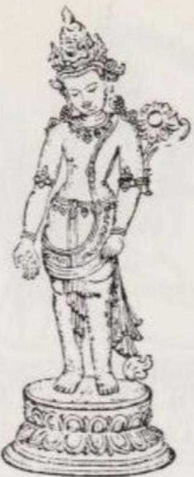

*Avalokiteśvara (Quán Thế Âm), với hai tay dưới hình tướng Padmapāṇi (Người cầm hoa sen). Đồ trang sức và chiếc vương miện năm cánh đánh dấu ngài là một sinh thể siêu việt. Tay phải của ngài hạ xuống trong thủ ấn ban điều ước và ban tặng, tay trái cầm cuống hoa sen (bị cánh tay che khuất). (Theo một bức tượng đồng Nepal thế kỷ 13/14.)*

Bồ tát Siêu Việt là những người thông qua việc thực hành Sáu Ba La Mật (Six Perfections / *pāramitā* / Sáu đức hạnh hoàn thiện) (bố thí; giữ giới; kham nhẫn; tinh tấn; thiền định; trí tuệ) đã đạt được trí tuệ giải thoát (liberating wisdom / *prajñā*) và do đó đạt đến quả vị thánh không còn thoái chuyển. Vào khoảnh khắc qua đời, họ từ chối đi vào Niết Bàn Tĩnh (apratiṣṭhita/ Static Nirvāṇa) sau khi chết, điều sẽ khiến họ không còn tác dụng gì với thế gian, mà thay vào đó, họ chấp nhận 'Niết bàn không dừng lại' (Nirvāṇa without Standstill) hay 'Niết bàn Năng động' (Active Nirvāṇa / Vô trụ xứ Niết bàn), một trạng thái giải thoát mà từ đó, với lòng từ bi, họ có thể tiếp tục làm việc vì lợi ích của thế gian. Họ không còn có thể được nhận thức bằng các giác quan; vì những yếu tố ngẫu nhiên thô trược phần lớn đã rụng khỏi họ nên chỉ có thể nhìn thấy họ bằng con mắt tâm linh. Họ vẫn hành động trong phạm vi của Luân hồi (Saṃsāra); tuy nhiên, các quy luật luân hồi lại dội ngược lại, không thể tác động đến họ. Thuật ngữ chuyên môn trong các văn bản dành cho các Bồ tát Siêu Việt là 'Đại Nhân/Đại Sĩ' (Great Beings / *mahāsattva*). Để thể hiện sự vượt trội của họ so với thế giới luân hồi, nghệ thuật Phật giáo khắc họa họ đeo trang sức của vương giả và đội vương miện năm cánh.

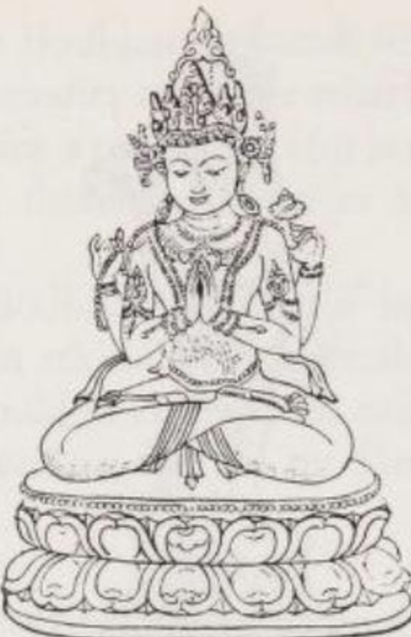

*Avalokiteśvara, hình tướng bốn tay. Đôi tay bên trong chắp lại giữ viên ngọc như ý Cintāmaṇi, đôi tay bên ngoài cầm chuỗi hạt gồm 108 hạt và một bông hoa sen. (Theo một bức tượng đồng Tây Tạng, có lẽ thuộc thế kỷ 17.)*

Xét về khả năng thúc đẩy sự giải thoát cho người khác, các Bồ tát Siêu Việt vượt xa các Bồ tát Trần Thế. Khác với Bồ tát Trần Thế, họ không còn phải chịu sự đày đọa của tái sinh mà có thể, theo quyết định tự do của mình, khoác lấy bất kỳ hình tướng và diện mạo cơ thể nào phù hợp với sự giúp đỡ mà họ định ban cho:

> Trong một khoảnh khắc, các vị Bồ tát thông tuệ hiện ra dưới hình hài của mọi chúng sinh và phát ra những giọng nói, âm thanh giống như họ.
> 
> Họ trở nên già cả và ốm yếu (hoặc) hiện ra như đã chết (khi hoàn cảnh yêu cầu); để làm cho chúng sinh chín muồi (để giác ngộ), họ diễn (vở kịch) thực tại ảo ảnh này (illusory reality / *māyādharma*).
> 
> Đã cân nhắc kỹ lưỡng, họ hóa thành những kỹ nữ để thu hút đàn ông. Sau khi đã dùng lưỡi câu dục vọng để dụ dỗ họ, họ thiết lập (trong những người đàn ông đó) tri thức của Phật.
> 
> Để mang lại lợi ích cho chúng sinh, họ liên tục hóa thân thành dân làng, người dẫn đầu đoàn buôn, tu sĩ, tể tướng và các quan lại. (Śs 18 tr. 172 + 3)

Trong số rất nhiều Bồ tát Siêu Việt của các Kinh điển, một số vị được cá nhân hóa qua ngoại hình, tính cách, nhiệm vụ và được những người theo Đại thừa đặc biệt tôn kính.

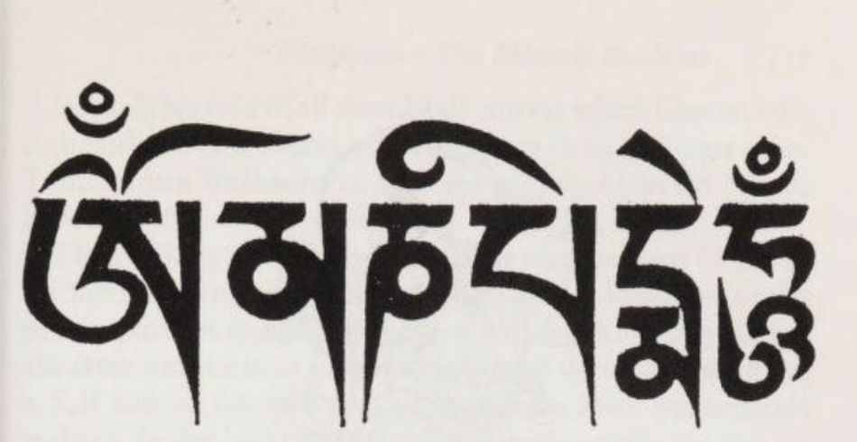
ॐ — Oṃ मणि — maṇi पद्मे — padme हूँ — hūṃ

*Om manipadme hūm — được tái tạo ở đây bằng chữ Tây Tạng — là câu thần chú (mantra) của Avalokiteśvara.*

Vị quan trọng nhất trong số họ là Avalokiteśvara (Vị Chúa tể (đầy từ bi) nhìn xuống / Quán Thế Âm), Padmapāṇi (Người cầm Hoa Sen) hoặc Lokeśvara (Chúa tể Thế gian). Có hơn 130 hình tượng đồ tượng học của ngài được biết đến, khác nhau ở số lượng đầu, cánh tay, các pháp khí và tư thế. Trên mũ đội đầu, ngài thường đeo một bức tượng nhỏ của vị Phật Siêu Việt Amitābha (A Di Đà), người mà ngài được phân công đi kèm trong hệ thống Ba Thân. Một số người theo Đại thừa coi ngài là một sáng tạo tâm trí của Amitābha — một quan điểm khó mà tương thích với khẳng định rằng các Bồ tát Siêu Việt đạt được địa vị của mình thông qua việc thực hành Sáu Ba La Mật.

Đặc điểm nổi bật nhất của Avalokiteśvara là đức từ bi. Để cứu vớt chúng sinh khỏi đau khổ, ngài được cho là đã đi xuống tận tầng địa ngục sâu nhất. Ngài được cầu khẩn bằng câu thần chú nổi tiếng *Om manipadme hūm* — 'Om. Viên ngọc trong Hoa sen! Hūm' — ám chỉ Cái Tuyệt Đối chứa đựng trong vạn vật, hoặc ám chỉ viên ngọc như ý mà Avalokiteśvara giữ trong lòng hai bàn tay chắp lại giống hình một nụ hoa sen.

Mañjuśrī (Đấng mang vẻ đẹp ngọt ngào / Văn Thù Sư Lợi) hoặc Mañjughosa (Đấng có giọng nói ngọt ngào) là tên của vị Bồ tát có nhiệm vụ đặc biệt là tiêu diệt vô minh và đánh thức tri thức. Biểu tượng cho chức năng của ngài là một thanh gươm rực lửa ở tay phải và cuốn sách Trí tuệ Siêu việt ở bên trái. Ngài là chúa tể của trí tuệ và là vị Bồ tát bảo trợ cho các học giả.

Vajrapāṇi (Người cầm Kim Cang / Kim Cang Thủ) được coi là kẻ tiêu diệt cái ác. Bằng thanh Vajra hay quyền trượng sấm sét của mình, ngài thiêu rụi thành tro mọi cám dỗ cản trở con đường của những người có đức tin.

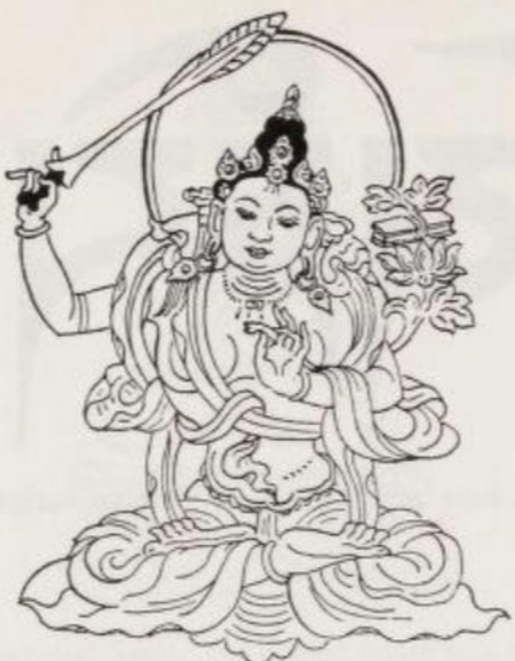

*Mañjuśrī (Văn Thù Sư Lợi). Với thanh gươm đồng thời cũng là một ngọn đuốc, ngài tiêu diệt vô minh và mang lại tri thức. Cuốn sách lá cọ trên bông hoa sen là Kinh Bát Nhã Ba La Mật Đa. (Theo một bức tranh cuộn Tây Tạng.)*

Kṣitigarbha (Người lấy đất làm Thai tạng / Địa Tạng Vương) là vị Bồ tát cai quản các cõi địa ngục. Ngài liên tục nỗ lực để xoa dịu những chúng sinh ở đó khỏi hậu quả của ác nghiệp mà họ đã gây ra.

Bồ tát Mahāsthāmaprāpta (Người đã đạt được Sức mạnh to lớn / Đại Thế Chí) là người mở mắt cho con người thấy sự cần thiết của việc giải thoát. Ở Đông Á, ngài thường được khắc họa cùng với Avalokiteśvara đứng hai bên Amitābha. Khi đó, Avalokiteśvara tượng trưng cho lòng từ bi của Amitābha và Mahāsthāmaprāpta tượng trưng cho trí tuệ của ngài.

Người bảo vệ những ai thuyết giảng giáo pháp của Đức Phật là Samantabhadra (Người mang lại hạnh phúc trọn vẹn / Phổ Hiền).

Maitreya (Đấng Nhân từ / Di Lặc) là vị Bồ tát hiện đang ở cõi trời Tuṣita (Đâu Suất) để chuẩn bị cho vai trò là vị Phật tương lai mà chúng ta chưa biết. Trong những ngày sắp tới, ngài sẽ thiết lập trên trái đất một vương quốc không có đau khổ và khôi phục lại vẻ huy hoàng cội nguồn của giáo pháp Đức Phật, thứ mà đến lúc đó có thể đã bị ô uế. Ngài giữ sẵn trong một cái chai nhỏ phương thuốc trường sinh bất tử (tức là Niết bàn). Với tư cách là vị cứu tinh tương lai, ngài có một hệ thống thờ phụng riêng ở một số nhóm Đại thừa.

Có rất nhiều truyền thuyết kể về tất cả những vị Bồ tát này nhằm minh họa cho lòng từ bi và sự sẵn sàng của những vị cứu tinh này. Một số Bồ tát Siêu Việt khác được nhắc đến trong các Kinh điển không có chức vụ hay vai trò cụ thể.

Tư duy của một vị Bồ tát diễn ra trên hai cấp độ. Trong lòng từ bi vô hạn của mình, ngài đứng lên bảo vệ chúng sinh — qua đó chứng tỏ ngài coi họ là có thật và cần được giúp đỡ. Nhưng đồng thời, với tư cách là một bậc hiền triết, ngài ý thức được sự không tồn tại của cái Ngã (Self) và thực tế là mọi chúng sinh chỉ là những thực thể hiện tượng mang tính bề ngoài. Theo nghĩa tối cao nhất, không hề có đau khổ cũng chẳng có chúng sinh nào cần được giải thoát. Một vị Bồ tát phải nuôi dưỡng suy nghĩ:

> Ta phải dẫn dắt tất cả chúng sinh (theo nghĩa kinh nghiệm) đến cõi Niết bàn sau khi chết, đến Sự Tĩnh Diệt Hoàn Toàn. Và rồi, sau khi chúng sinh đã được dẫn dắt đến Sự Tĩnh Diệt Hoàn Toàn, (theo nghĩa tuyệt đối) không có một chúng sinh nào bị tĩnh diệt hoàn toàn cả. (VP 17a tr. 47 ≈ VP 3)

*(Ghi chú: Nghĩa là về mặt hiện tượng thế gian, Bồ tát thấy chúng sinh khổ và cần cứu độ; nhưng về mặt chân lý tuyệt đối, ngài thấu hiểu rằng mọi chúng sinh vốn dĩ trống rỗng, không có một "cái tôi" thực sự nào đang tồn tại hay bị tiêu diệt.)*

Dù sự khổ đau mà Bồ-tát tự mình gánh chịu để giúp người khác không phải là thực thể thật sự, điều đó cũng không làm giảm lòng biết ơn của người được giúp. Đối với một người vẫn còn bị trói buộc bởi ý niệm về cái tôi và xem thế giới mình đang sống là có thật, thì khổ đau đối với họ vẫn là khổ đau thực sự. Vì vậy, Bồ-tát đã gánh lấy khổ đau ấy thay cho họ vẫn xứng đáng nhận được lòng biết ơn.

## Các Con Đường Dẫn Đến Giải Thoát Và Niết Bàn Của Đại Thừa (The Mahāyānic Ways to Liberation and Nirvāṇa)

### 1. MỌI SỰ TỒN TẠI ĐỀU LÀ ĐAU KHỔ (ALL EXISTENCE IS SUFFERING)

Giống như Tiểu thừa, Đại thừa cũng coi sự tồn tại là buồn khổ. Trong mọi hình thức tồn tại (forms of being) đều có sự đau buồn, tiếc nuối, khao khát và thất vọng. Cuộc sống có thể đôi lúc trông có vẻ hạnh phúc, và những thứ ta gắn bó dường như sẽ tồn tại mãi mãi, nhưng rồi những gì ta yêu thương cũng sẽ biến hoại (vô thường / perish), và chính người yêu thương những thứ đó cũng vậy. Sự chia ly và đau khổ là điều không thể tránh khỏi.

Sự tồn tại cũng là khổ (*duḥkha*) theo nghĩa nên tảng của từ này. Mọi sự sống và tồn tại đều nằm trong vòng tái sinh (*saṃsāra*), tức là trong tình trạng chưa được giải thoát; tuy nhiên, phần lớn con người không nhận ra điều đó. Do vô minh, họ cảm thấy quá quen thuộc và thoải mái với sự tồn tại tạm thời của mình đến mức không có ý định tìm kiếm bản chất đích thực của chính mình, tức Pháp thân (*Dharmakāya*), được xem là Tuyệt đối và không còn khổ đau. Không nhận ra rằng về bản chất mình vốn đã được giải thoát, họ vẫn tiếp tục bị ràng buộc trong *saṃsāra*.

Tình cảnh của họ giống như chàng thanh niên trong một câu chuyện được kể lại ở một bộ Kinh chữ Hán. Khi đang đi xa nhà, do thiếu hiểu biết, anh ta lâm vào cảnh bần cùng kiệt quệ. Anh ta không hề hay biết rằng, để phòng hờ lúc nguy cấp, cha mẹ đã khâu sẵn một viên ngọc quý vào gấu áo của anh — chỉ là họ quên chưa nói cho anh biết. *(Ghi chú: Câu chuyện này ngụ ý rằng mỗi người đều mang sẵn khả năng giải thoát bên trong mình như viên ngọc quý, nhưng vì vô minh nên không nhận ra và phải chịu cảnh đau khổ luân hồi).*

Theo quan điểm của Đại thừa, vô minh (ignorance / *avidyā*, *ajñāna*) và khao khát/ái dục (craving / *trṣṇā*) cũng chính là những nguyên nhân gây ra sự tái sinh. Chúng là những lực đẩy khiến con người sau khi chết phải tái sinh vào một hình thức tồn tại mới, và từ đó dẫn đến những đau khổ mới:

> (Chúng sinh) ... bị mắc kẹt trong lưới của ái dục, bị trói buộc bởi gông cùm của vô minh, bị ách vào khao khát được tồn tại (craving for becoming / hữu ái), hướng đến sự hủy diệt, bị ném vào lồng giam của đau khổ, (và) đang đi thẳng vào nhà tù (của cuộc sống trần tục). (Śs 16 tr. 148)

Nếu như Tiểu thừa chỉ biết đến một Con Đường duy nhất để giải thoát, đó là tự kỷ luật (self-discipline / tự lực tu tập), thì Đại thừa còn dạy thêm những cách khác: giải thoát thông qua Trí tuệ (Wisdom); thông qua sự giúp đỡ của các vị Bồ tát (Bodhisattvas); thông qua sự hỗ trợ của chư Phật Siêu Việt (Transcendent Buddhas); và thông qua các nghi thức thờ cúng (cult). Phương pháp tự giải thoát của Tiểu thừa khi sang Đại thừa đã được bổ sung thêm phương pháp 'được cứu rỗi nhờ sự trợ giúp từ bên ngoài', hay còn gọi là 'giải thoát nhờ tha lực' (liberation through other-power). *(Ghi chú: Có lẽ tác giả nhầm lẫn vì có 7 loại giải thoát trong kinh Nikaya [MN 65.11](/link?q=MN-65.11))*

### 2. CON ĐƯỜNG TỰ KỶ LUẬT (THE WAY OF SELF-DISCIPLINE)

Con đường giải thoát bằng cách tự kỷ luật tương ứng với Bát Chính Đạo (Eightfold Way) của Tiểu thừa, bao gồm:

- (1) Cái nhìn đúng (Right View / chánh kiến / *samyag-dṛṣṭi*)
- (2) Quyết tâm đúng (Right Resolve / chánh tư duy / *samyak-saṃkalpa*)
- (3) Lời nói đúng (Right Speech / chánh ngữ / *samyag-vāc*)
- (4) Hành vi đúng (Right Conduct / chánh nghiệp / *samyak-karmānta*)
- (5) Cách sống đúng (Right Livelihood / chánh mạng / *samyag-ājīva*)
- (6) Nỗ lực đúng (Right Effort / chánh tinh tấn / *samyag-vyāyāma*)
- (7) Nhận thức đúng (Right Awareness / chánh niệm / *samyak-smṛti*)
- (8) Thiền định đúng (Right Meditation / chánh định / *samyak-samādhi*).

Bát Chính Đạo mang lại hiệu quả giải thoát nhờ vào việc vận dụng quy luật Nghiệp (law of Karman). Mỗi chúng sinh sẽ nhận được hình thức tái sinh tương xứng với những ý định hành động (action-intentions) của mình trong kiếp hiện tại. Những ý định hành động tốt lành — tức là những hành động tuân theo Bát Chính Đạo — sẽ dẫn đến một kiếp tái sinh gần với sự giải thoát hơn; ngược lại, những ý định hành động xấu sẽ đẩy ta ra xa khỏi sự giải thoát. Cơ hội vươn lên từ hình thức tồn tại khốn khổ nhất đến hình thức tồn tại cao nhất (dù hình thức cao nhất này vẫn chưa hoàn toàn thoát khỏi đau khổ) nằm trong tay của mỗi người. Đến một lúc nào đó, người ta sẽ có được một kiếp tái sinh đủ tốt để có thể đi trọn vẹn Bát Chính Đạo, vượt qua vô minh và khao khát, để thực sự đạt được trạng thái thoát khỏi đau khổ — Niết bàn (Nirvāṇa).

Mặc dù tất cả các trường phái Đại thừa đều tỏ ra công nhận Bát Chính Đạo, nhưng thực chất họ có những hoài nghi đáng kể về nó. Họ cho rằng chỉ những người có tư chất đặc biệt mới có thể đi theo con đường này, còn với đa số mọi người thì nó quá dốc và khó khăn. Hơn nữa, họ coi đây là con đường dành cho những kẻ ích kỷ, chỉ lo cho sự giải thoát của riêng mình mà nhắm mắt làm ngơ trước nỗi đau của người khác. Cuối cùng, họ phản đối tính mục đích (purposiveness) mà người ta thường mang theo khi thực hành Bát Chính Đạo. Kỷ luật đạo đức thực sự phải là vô cầu (unintentional / không có chủ đích), chứ không phải được thực hành chỉ để kiếm chác công đức (karmic merit).

> Một Bồ tát không nên bố thí ... nếu mang theo một mục đích (khi cho đi). ... (Nhưng) người nào ... bố thí mà không vì mục đích gì cả, thì kho tàng công đức của người đó sẽ không thể nào đo đếm được. (VP 4 tr. 29)

Sự vô cầu (không có ý định mong muốn/unintentionalness) — tức là không còn khao khát có được công đức — chính là điều kiện tiên quyết của sự giải thoát. Bởi lẽ, bản chất của giải thoát đơn giản chính là thoát khỏi sự khao khát và sự trói buộc của nghiệp.

Các trường phái triết học của Đại thừa còn đi sâu hơn trong việc phê phán. Lập luận phản đối của họ dựa trên niềm tin rằng: đau khổ chỉ thuộc về cõi hiện tượng (phenomenal realm), và mọi chúng sinh — xét ở khía cạnh họ đồng nhất với Cái Tuyệt Đối — vốn dĩ luôn luôn tự do, chỉ là họ không biết điều đó mà thôi. Do đó, giải thoát phải đạt được bằng cách xóa bỏ sự vô minh này và nhận thức được Cái Tuyệt Đối. Người ta không thể đạt được sự giải thoát chỉ bằng những hành động đạo đức đơn thuần, bởi vì những tác động nghiệp (karmic effects) của các hành động đó vẫn chỉ quẩn quanh trong thế giới ảo ảnh (illusory world). Giống như các nhà tư tưởng Đại thừa khác, Bhāvaviveka (Thanh Biện) — một nhà sư sống vào khoảng năm 600 CN và theo trường phái Trung Quán (Madhyamaka) — không còn hiểu Tám Giới (Eight Precepts / Bát Chính Đạo) theo nghĩa đen nữa, mà coi chúng như những từ khóa chỉ dẫn đến những nhận thức mang tính giải thoát (emancipating insights):
*(Ghi chú: Thay vì coi Bát Chính Đạo là những quy tắc hành xử thực tế cần tuân thủ, các triết gia Đại thừa diễn giải chúng thành các nguyên lý triết học để phá vỡ sự bám chấp vào thực tại ảo ảnh).*

- (1) Cái nhìn đúng (Right View) là sự thấu hiểu sâu sắc (insight) về Pháp thân (Dharmakāya) của Đấng Hoàn Thiện (Đức Phật).
- (2) Quyết tâm đúng (Right Resolve) là sự dập tắt mọi ảo tưởng do tâm trí vẽ ra.
- (3) Lời nói đúng (Right Speech) là nhận ra rằng ngôn ngữ sẽ trở nên bất lực và câm lặng khi đối diện với các Pháp (Dharmas / bản chất thực tại).
- (4) Hành vi đúng (Right Conduct) là không thực hiện bất kỳ hành động nào (nhằm mục đích kiếm chác công đức).
- (5) Cách sống đúng (Right Livelihood) bao gồm việc thấu hiểu rằng tất cả các Pháp đều không có sinh ra cũng không có diệt đi (giống như trong giáo lý của trường phái Nhất Thiết Hữu Bộ / Sarvāstivāda).
- (6) Nỗ lực đúng (Right Effort) nghĩa là từ bỏ việc dùng Sức Lực và Phương Pháp (để mong đạt được giải thoát; nói cách khác là trở nên vô cầu), dựa trên sự hiểu biết rằng không có một Pháp Vô vi (Non-conditioned Dharmas - thứ cấu thành nên trạng thái giải thoát) nào lại sinh ra từ hành động.
- (7) Nhận thức đúng (Right Awareness) nghĩa là ngừng trăn trở, suy nghĩ về việc tồn tại (being) hay không tồn tại (non-being).
- (8) Thiền định đúng (Right Meditation) nghĩa là giải phóng bản thân khỏi các quan điểm bằng cách không bám víu vào các Pháp (ở đây hiểu là các ý tưởng / ideas).

'Nếu một người nhìn nhận điều đó theo đúng cách này,' Bhāvaviveka viết trong cuốn Luận Chưởng Trân (*Śāstra Karatalaratna*, tr. 98), 'thì người đó đang thực hành Bát Chính Đạo.'

### 3. CON ĐƯỜNG TRÍ TUỆ (THE WAY OF WISDOM)

Trong Đại thừa, tri thức (knowledge / *jñāna* - sự hiểu biết) được hiểu là việc nắm rõ các nội dung giáo lý của Tiểu thừa. Cốt lõi của những giáo lý này là: phủ nhận sự tồn tại của một Bản ngã (Self / *ātman*) trong Năm Uẩn (Five Groups / *skandha* - năm yếu tố kết hợp tạo nên con người kinh nghiệm), và lý thuyết về sự tái sinh dựa trên tính chất của nghiệp (karman) mà không có một Linh hồn nào di chuyển từ kiếp này sang kiếp khác. Tâm thức (consciousness) của một người đang hấp hối sẽ kích hoạt sự hình thành của một con người kinh nghiệm mới trong bụng mẹ, nhưng tâm thức đó không hề "nhập" vào người mới này. Lực đẩy khiến tâm thức làm được điều đó chính là sự khao khát (craving) và vô minh (ignorance). Việc triệt tiêu hai lực đẩy này sẽ dẫn đến Niết bàn (Nirvāṇa).

Nền tảng của học thuyết Đại thừa về sự tái sinh là lý thuyết về các pháp (dharma theory). Lý thuyết này được tiếp thu từ thời kỳ sau của Tiểu thừa và trong nhiều văn bản Đại thừa, tác giả mặc định là người đọc đã biết về nó.

Lý thuyết này khẳng định có hai loại Pháp (Dharmas): Pháp Vô vi (Non-conditioned / *asaṃskṛta*) và Pháp Hữu vi (Conditioned / *saṃskṛta*). Pháp Vô vi không phụ thuộc vào bất cứ điều gì, không bị ảnh hưởng bởi nghiệp (karman) và không có sự biến hoại (vô thường / impermanence). Chúng cấu thành nên Niết bàn.

Nhóm Pháp Hữu vi có số lượng lớn hơn rất nhiều. Các Pháp Hữu vi khi kết hợp với nhau sẽ tạo nên con người trải nghiệm (empirical person). Chúng bắt nguồn có điều kiện từ một tổ hợp Pháp trước đó (tức là một cá nhân trước đó), và nhờ vào nghiệp của cá nhân này, chúng hợp nhất lại để tạo thành một con người mới. Con người mới này — sau khi con người cũ tan rã — sẽ bước vào cuộc đời như là kiếp tái sinh của người cũ. Tất cả các Pháp Hữu vi đều mang tính tạm thời và không có một nền tảng thực thể cố định (without substratum); nếu không, chúng sẽ không thể đóng vai trò gì trong quá trình biến đổi này. Không hề có một "vật mang" (bearer) hay "chủ thể" nào chứa đựng các Pháp này cả, bởi vì bất cứ thứ gì được coi là chủ thể thì bản thân nó cũng lại được cấu thành từ các Pháp mà thôi.

Ngay cả trong suốt cuộc đời của một chúng sinh, các Pháp của người đó cũng không tồn tại vĩnh viễn mà luôn trong quá trình liên tục tan rã, đổi mới và sắp xếp lại. Điều này giải thích cho các quá trình sống luôn đập nhịp nhàng, cũng như sự thay đổi không ngừng của các nội dung trong tâm trí. Trong tất cả các Pháp Hữu vi, những Pháp cấu thành nên tâm thức và tư duy có tuổi thọ ngắn nhất. Chúng chỉ tồn tại trong một tích tắc trước khi nhường chỗ cho các Pháp mới. Và vì các Pháp cấu thành nên tâm trí chúng ta cũng mang tính quyết định đối với cách chúng ta hình dung về thế giới, nên lý thuyết về Pháp cũng đồng thời là một lời giải thích cho vũ trụ. **Chính chúng ta và môi trường xung quanh không phải là những thực thể "đang tồn tại" (are not) cố định, mà là những sự kiện "đang diễn ra" (happen)**. Cả hai đều là những quá trình được tạo thành từ các Pháp luôn luôn biến động.

Con người có thể được ví như một giai điệu. Không một âm thanh hay hợp âm đơn lẻ nào có độ dài vô tận hay mang lại giá trị cảm xúc trọn vẹn, nhưng sự nối tiếp liên tục của các âm thanh lại tạo ra hiện tượng gọi là "giai điệu". Và giống như một nốt tạp âm chói tai trong giai điệu không nhất thiết báo hiệu bản nhạc đã kết thúc, cái chết của một chúng sinh cũng không nhất thiết là điểm kết thúc của chuỗi Pháp Hữu vi. Trong hầu hết các trường hợp, Mạng lưới Duyên khởi (Nexus of Conditioned Origination) sẽ tiếp tục vận hành sau cái chết của một người. Bản thân cái chết chỉ là một Pháp trong chuỗi đó — hệt như nốt tạp âm cũng chỉ là một yếu tố của giai điệu.

Phép so sánh này còn giải thích thêm một điều nữa. Khán giả chỉ bị giai điệu mê hoặc chừng nào họ còn cảm nhận nó như một chuỗi âm thanh có linh hồn. Ngay khoảnh khắc họ nhận thức được từng nốt nhạc rời rạc cấu thành nên nó, sự mê hoặc sẽ tan vỡ. Tương tự như vậy, con người chỉ bị thế giới gây ấn tượng chừng nào họ còn coi nó là một thứ gì đó có bản chất thực sự (essential). Đến một ngày, khi họ nhìn thấu chính mình và thế giới kinh nghiệm này chỉ là những hiện tượng do các Pháp Hữu vi tạo ra, họ sẽ chợt nhận ra rằng: từ bao đời nay, họ đã tự làm mình sợ hãi bởi một thứ ảo ảnh. Chính sự nhận ra (realisation) này là bước chuyển từ tri thức (knowledge) sang trí tuệ (wisdom):

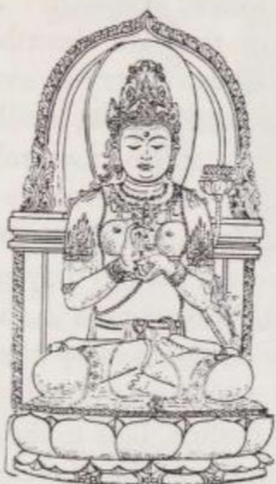

*Bát Nhã Ba La Mật Đa (Prajñāpāramitā), vị (Nữ) Bồ tát của Trí tuệ Siêu việt (theo một tác phẩm điêu khắc ở Java thế kỷ 13). Hai tay bà giơ lên trong thủ ấn thuyết pháp; trên bông hoa sen bên trái bà là cuốn kinh Bát Nhã Ba La Mật Đa. Vì Trí tuệ Siêu việt tạo nên Đức Phật, nên bà thường được ca tụng là 'mẹ của tất cả chư Phật'.*

> Nhờ vào việc nhận thức rõ tất cả các Pháp ... mà Niết bàn bất diệt được nhận ra. (SP 5, 64 tr. 100)

Trong khi tri thức (knowledge / *jñāna*) chỉ di chuyển trong cái hữu hạn và bị giới hạn trong phạm vi của các hiện tượng, thì trí tuệ (wisdom / *prajñā*) lại vươn xa hơn thế, đi vào cái vô hạn và bản chất cốt lõi. Đối tượng của trí tuệ là Thực tại Tuyệt đối (= Chân như / Thusness = Phật tính / Buddhahood). Vì Thực tại này là vô biên, nên không thể thấu hiểu nó bằng trí năng (intellect): tư duy không có đường để tiếp cận trí tuệ (AP 8 tr. 96). Tri thức chỉ là vấn đề của trí năng đơn thuần, vốn chỉ có thể nắm bắt những mảnh vỡ của thực tại; mặt khác, trí tuệ là sự đồng nhất mang tính trực giác (intuitive identification) với thực tại của mọi sự tồn tại và sinh thể — một sự chứng nghiệm (experience) được thực hiện bằng toàn bộ con người, sau khi tất cả những giới hạn của lý trí, các quan điểm và giáo điều đã bị vứt bỏ. Trí tuệ được định nghĩa là 'sự toàn tri' (omniscience / *sarvajñatā* - nhất thiết trí/ biết một cách toàn thể) và trong Đại thừa, nó đồng nghĩa với 'sự giác ngộ' (enlightenment / *bodhi*).

Sự khác biệt giữa tri thức và trí tuệ trở nên rõ ràng trong các kinh điển Bát Nhã Ba La Mật Đa (*Prajñāpāramitā*), tức 'Trí tuệ Siêu việt' hay 'Sự hoàn thiện của Trí tuệ'. Những khẳng định (assertions) chỉ có thể được đưa ra đối với những thứ có thể miêu tả bằng lời; tuy nhiên, các Kinh Bát Nhã lại cố gắng khơi gợi một cảm nhận về Cái Tuyệt Đối. Do đó, ngôn ngữ của chúng dao động liên tục giữa khẳng định và phủ định. Những lời khẳng định là để nói về phạm vi kinh nghiệm, bởi mọi thứ chúng ta nhận thức đều tồn tại về mặt thực nghiệm. Những lời phủ định lại nhắm vào chính những thứ đó khi đem so sánh với Cái Tuyệt Đối, bởi nếu lấy Cái Tuyệt Đối làm thước đo, thì chúng chỉ là ảo ảnh (*māyā*) và trống rỗng (void). Khi các văn bản Bát Nhã vừa khẳng định vừa phủ định một sự vật trong cùng một khoảng khắc, mục đích của chúng không phải là để miêu tả sự vật đó, mà là để truyền đạt cho người đọc hoặc người nghe một tri thức mang tính giải thoát về Cái Ảo Ảnh và Cái Tuyệt Đối. Do phương pháp sư phạm này, những văn bản trên trở nên khá khó hiểu đối với những học trò chưa có sự chuẩn bị.

Vậy giáo lý của Bát Nhã Ba La Mật Đa là gì? Họ hiểu Trí tuệ (Wisdom) nghĩa là sao?

Điểm xuất phát triết học của họ là học thuyết về tính vô ngã (non-selfness) của con người — một điểm chung của tất cả các trường phái Phật giáo. Thay vì dùng từ "vô ngã", họ đưa ra một thuật ngữ dễ thao tác hơn là 'tính không' (emptiness / *śūnyatā*). Chính tính chất nước đôi (ambivalence) của từ này đã mở đường cho tất cả các lập luận sau đó. Việc không có Bản ngã (Self) hay Linh hồn (Soul) — nói cách khác là 'trống rỗng' (empty) — không chỉ áp dụng cho các chúng sinh mà còn cho cả các Pháp Hữu vi (Conditioned Dharmas) hay các yếu tố tồn tại, những thứ mà thông qua sự kết hợp luôn thay đổi của chúng đã tạo nên chúng sinh và thế giới của họ. Bản chất của các Pháp Hữu vi chính là tính Không.

Điều tương tự cũng đúng với các Pháp Vô vi (Non-conditioned Dharmas) đại diện cho sự giải thoát, tức là Niết bàn. Chúng cũng không có Bản ngã và về bản chất cũng là trống rỗng (empty).

Từ thực tế là tính Không (emptiness) là đặc điểm chung của cả Pháp Hữu vi và Pháp Vô vi, trường phái trí tuệ (wisdom-school) rút ra hai kết luận có ý nghĩa vô cùng to lớn đối với Đại thừa:

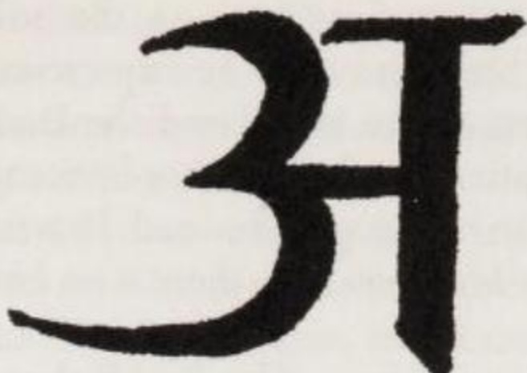

*Không chỉ dẫn đầu trong số các tôn giáo trên thế giới về khối lượng kinh sách thánh, Phật giáo còn vô địch về sự súc tích trong một số văn bản của mình. Hình ảnh được tái hiện ở đây (bằng chữ devanāgarī của Ấn Độ) là 'Bát Nhã Ba La Mật Đa chỉ trong một Chữ cái', đó là chữ a.*

*Chữ A không chỉ là âm đầu tiên trong bảng chữ cái Ấn Độ, và xét theo khía cạnh này là khởi nguồn của mọi tri thức nói và viết; trong tiếng Pāli và tiếng Phạn, nó còn là một tiền tố dùng để phủ định các khái niệm khẳng định — những khái niệm mà theo các văn bản Bát Nhã, chỉ là những từ ngữ dùng để gọi những thứ ảo ảnh. Bằng cách phủ định tính bản chất của các hiện tượng, bản thân chữ A trở thành biểu tượng của cốt lõi, của tính Không tuyệt đối.*

1. Tính Không, với tư cách là phẩm chất chung trong mọi cặp đối lập, chính là thực tại cuối cùng của chúng: Cái Tuyệt Đối (The Absolute).
2. Giữa Luân hồi (Saṃsāra) và Niết bàn (Nirvāṇa) chỉ có sự khác biệt trong phạm vi của cái ảo ảnh, chứ không có sự khác biệt về bản chất.

(1) Việc tính Không chính là Cái Tuyệt Đối được chứng minh bằng thực tế là nó sở hữu tất cả các đặc điểm của Cái Tuyệt Đối. Nó không được sinh ra, không phụ thuộc vào các điều kiện, không thể thay đổi, không thể bị phá hủy và bao trùm tất cả. Nó không phải là "không tồn tại" (non-being) — vì nếu vậy nó sẽ vô tác dụng; nó cũng không phải là "đang tồn tại" (being) — vì như vậy nó có thể bị hủy diệt. Sẽ là sai lầm nếu hiểu nó như một khái niệm mang tính khẳng định: như các văn bản đã tuyên bố, bản thân tính Không cũng là trống rỗng. Người ta không thể đạt được nó cũng không thể từ bỏ nó, nhưng chắc chắn có thể chứng nghiệm (experience) được nó. Nó nằm ngoài các phạm trù tư duy của chúng ta, thuộc về cảnh giới của sự chứng nghiệm trí tuệ (wisdom-experience). Trí tuệ bao trùm vạn vật chính là chìa khóa mở ra tính Không, và nếu không có tính Không, trí tuệ sẽ trở nên rỗng tuếch và không tồn tại.

Tùy thuộc vào việc một người đang đứng ở cấp độ tâm linh nào, họ sẽ gán cho tính Không một giá trị tích cực hoặc tiêu cực. Một người còn bám víu vào thế gian sẽ trải nghiệm tính Không như một nguồn cơn đau khổ thường trực, bởi sự trống rỗng (emptiness) của vạn vật chính là nguyên nhân dẫn đến sự biến hoại (impermanence / vô thường) của chúng. Đối với người đó, giải thoát, nói một cách dễ nghe nhất, là một thiên đường nơi không có sự phù du cũng chẳng có đau khổ.

(2) Bậc thánh nhân lại nhìn nhận tính Không theo một cách khác. Nhận ra rằng mọi thứ tồn tại chỉ là sản phẩm của các Pháp (Dharmas) và do đó chỉ là ảo ảnh — mặc dù nó là thật về mặt thực nghiệm với tư cách là một hiện tượng ảo ảnh — ngài coi tính Không là thực tại duy nhất nằm trong mọi hiện tượng. Đồng thời, ngài chứng nghiệm nó đồng nhất với Chân như (Thusness) của thế giới và Phật tính (Buddhahood) của chư Phật. Trong tính Không — với tư cách là bản chất của chúng — ngài nhận ra rằng chúng sinh và chư Phật là một và đều đã được giải thoát. Từ đó ngài chợt hiểu ra: giữa một vị Phật và một kẻ phàm phu tục tử, không có sự khác biệt nào về mặt bản chất (essential difference).

Chỉ có một vị Phật mới ý thức được Phật tính của mình; ngài *biết* mình là Phật. Ngược lại, kẻ phàm phu sống trong sự vô minh, không biết về bản tính Phật (Buddha-nature) bẩm sinh của mình, phải chịu đau khổ vì gán ý nghĩa quan trọng cho những hiện tượng ảo ảnh, và do đó tự cho rằng mình chưa được giải thoát.

Việc nhận thức được tính Không bằng trí tuệ (wisdom-realisation) sẽ làm thay đổi tận gốc rễ thái độ của một người. Người đó không chỉ nhìn thấu nỗi khổ luân hồi chỉ là ảo ảnh và giấc mộng, mà thậm chí ngay cả Phật tính và Niết bàn cũng mất đi ý nghĩa đối với họ. Chúng chỉ là những lý tưởng ảo ảnh, được dựng lên và chỉ có ích cho những người tìm kiếm đang không nhận thức được bản chất vốn đã giải thoát của mình. Chính vì vậy, nhà sư Subhūti (Tu-bồ-đề) đã chỉ ra cho chư thiên thấy:

> *Subhūti*: Giống như một ảo ảnh (*māyā*) ... là (tất cả) chúng sinh, ... như một giấc mộng. Vì ảo ảnh và chúng sinh là một, không khác biệt; giấc mộng và chúng sinh là một, không khác biệt. Tất cả các Pháp đều ... giống như một ảo ảnh, như một giấc mộng. Ngay cả bậc Nhập lưu (Thất lai / Stream-Entrant) ... , bậc Nhất lai (Once-Returner) ... , bậc Bất lai (Non-Returner) ... , bậc Thánh nhân (A-la-hán) ... , bậc Độc giác Phật (Private Buddha) ... , bậc Toàn giác (Perfect Buddha) [26](/giaolyvatongphai/notes#26){.note} ... , (tất cả họ) đều như một ảo ảnh, như một giấc mộng ...
> 
> *Chư thiên*: Thưa ngài Subhūti cao quý, như lời ngài nói, liệu Đấng Toàn giác cũng giống như một ảo ảnh, một giấc mộng sao? ...
> 
> *Subhūti*: Tôi tuyên bố rằng, ngay cả Niết bàn ... cũng giống như một ảo ảnh, như một giấc mộng; huống hồ là bất kỳ pháp nào khác!
> 
> *Chư thiên*: Thưa ngài Subhūti cao quý, như lời ngài nói, liệu Niết bàn cũng giống như một ảo ảnh, như một giấc mộng sao?
> 
> *Subhūti*: Nếu có một pháp nào còn cao siêu hơn cả Niết bàn, tôi cũng sẽ nói rằng nó giống như một ảo ảnh, như một giấc mộng. Bởi vì ảo ảnh và Niết bàn là một, không khác biệt. (AP 2 tr. 20)

Vậy thì làm thế nào người đi theo con đường Trí tuệ có thể giải phóng bản thân khỏi những thuộc tính luân hồi (saṃsāric attributes), khỏi mọi thứ ảo ảnh?

Bằng cách phát triển trí tuệ, bởi vì trí tuệ sẽ tiêu diệt khao khát (craving) và vô minh (ignorance) — hai nguyên nhân gây ra đau khổ. Vì sự khao khát được nuôi dưỡng bởi những tiếp xúc của giác quan (sense-contacts), nên nó sẽ héo mòn khi ta nhìn thấu các đối tượng của giác quan (sense-objects) chỉ là những hiện tượng của Pháp (Dharma-phenomena) và mang tính ảo ảnh; còn vô minh sẽ tan biến ngay khi Cái Tuyệt Đối (tức là tính Không) được nhận thức. Người nào đã nhổ tận gốc cả hai nguyên nhân của đau khổ này sẽ không còn bị đe dọa bởi sự tái sinh trong tương lai nữa.

### 4. CON ĐƯỜNG BỒ TÁT (THE BODHISATTVA WAY)

Con đường Tự kỷ luật và con đường Trí tuệ đòi hỏi người tu tập phải có sự kiềm chế bản thân, trí thông minh và sức mạnh tập trung — những khả năng mà theo kinh nghiệm của Phật giáo, chỉ một phần nhỏ nhân loại mới có được. Do đó, đối với phần đông những người không có năng khiếu đi theo những con đường này, Đại thừa chỉ dạy thêm ba phương pháp giải thoát nữa: Con đường Bồ tát (the Bodhisattva Way), Con đường Đức tin (the Way of Faith) và Con đường Thờ cúng (the Cultic Way).

Trên Con đường Bồ tát, người tìm kiếm sự giải thoát nương tựa vào Tâm Đại Bi (Great Compassion / *mahākaruṇā* - lòng từ bi to lớn) của các vị Bồ tát. Để nhận được sự trợ giúp của một vị Bồ tát, chỉ cần tha thiết cầu khẩn ngài — một Bồ tát không bao giờ từ chối giúp đỡ. Dựa vào sự hoàn thiện nội tâm và kho tàng công đức (karmic merit) tích lũy qua những việc làm thiện lành trong vô số kiếp, các Bồ tát Siêu Việt (Transcendent Bodhisattvas) có khả năng xóa bỏ ác nghiệp (unwholesome Karman) cho những người đang cần giúp đỡ, từ đó giúp họ giải thoát nhanh chóng hơn. Lòng từ bi của các ngài còn mạnh mẽ hơn cả những nghiệp chướng đang cản trở người tìm cầu sự cứu rỗi.

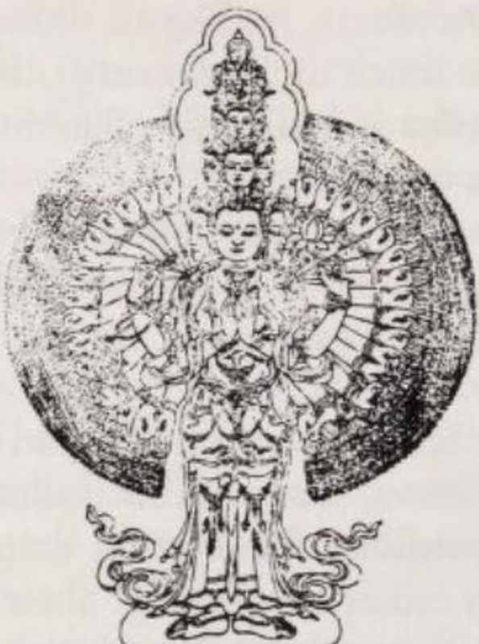

*Avalokiteśvara (Quán Thế Âm) với mười một đầu và nghìn tay. Truyền thuyết kể rằng khi nhìn thấy nỗi khổ đau trong các tầng địa ngục, đầu của ngài đã vỡ vụn thành mười mảnh vì quá kinh hãi. Vị Phật Siêu Việt Amitābha (A Di Đà), người cha tâm linh của ngài, sau đó đã biến mỗi mảnh vỡ thành một chiếc đầu hoàn chỉnh và đặt hình ảnh đầu của chính mình lên trên cùng.*

*Mỗi bàn tay trong số một nghìn bàn tay của Avalokiteśvara đều có một con mắt trong lòng bàn tay để vị Bồ tát có thể luôn quan sát khắp các phương của vũ trụ và ngay lập tức lao đến cứu giúp khi được cầu khẩn. Đôi tay ở giữa giữ viên ngọc đáp ứng mọi ước nguyện. Những bàn tay khác cầm hoa sen (= sự thanh khiết), cung và tên (để chống lại những cám dỗ), chiếc bình chứa mật hoa bất tử (= Niết bàn), bánh xe giáo pháp, và chuỗi tràng hạt 108 viên. Các bàn tay còn lại mở ra hướng ra ngoài trong thủ ấn ban điều ước. (Bản khắc gỗ Tây Tạng.)*

Một vị Bồ tát Siêu Việt đặc biệt nổi tiếng với vai trò người cứu rỗi là Avalokiteśvara (Quan Thế Âm). Ngài thường được cầu khẩn trong những khoảnh khắc vô cùng nguy hiểm, chẳng hạn như khi gặp bão trên biển hay khi băng qua một sa mạc hiểm nghèo, nhưng ngài cũng có thể dẫn dắt người ta đến Niết bàn:

> Hãy lắng nghe, hỡi những người con của các gia đình cao quý. Bồ tát Đại sĩ Avalokiteśvara là ngọn đèn cho người mù, là chiếc ô che cho những kẻ đang bị ngọn lửa mặt trời thiêu đốt, là dòng sông cho những người đang khát khao; ngài mang lại sự an toàn cho những ai đang sống trong sợ hãi và kinh hoàng; ngài là thầy thuốc cho những kẻ đang bị bệnh tật hành hạ; đối với những sinh linh bất hạnh, ngài là cha là mẹ; đối với những kẻ dưới địa ngục, ngài chỉ cho họ thấy Niết bàn... Hạnh phúc thay cho những chúng sinh trên thế gian này, những ai nhớ đến tên ngài: họ là những người đầu tiên thoát khỏi nỗi khổ luân hồi. (Kv 1 16 tr. 282)

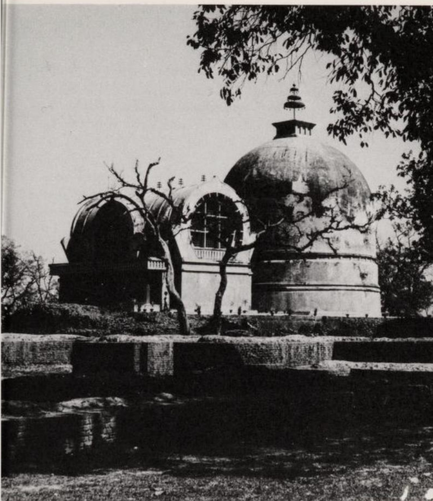

*Bảo tháp Parinibbāna (Niết bàn) tại Kusināra (Câu-thi-na / ngày nay là Kasia). Ở tuổi tám mươi, Đức Phật đã nhập Diệt độ (Postmortal Extinction / Niết bàn sau khi chết) tại đây. Tàn tích của các tu viện có niên đại từ thế kỷ thứ 3 đến thế kỷ 12. Vào thế kỷ thứ 4, các tòa nhà này dường như đã bị thiêu rụi tạm thời: Các lữ khách Trung Quốc là Pháp Hiển (Fa-hsien / thế kỷ 5) và Huyền Trang (Hsuan-tsang / thế kỷ 7) đã thấy chúng bị bỏ hoang. Bảo tháp và ngôi đền hiện tại, nơi lưu giữ một bức tượng Phật nằm, là những công trình được phục dựng vào thế kỷ 20 trên nền tàn tích của thời kỳ Gupta.*

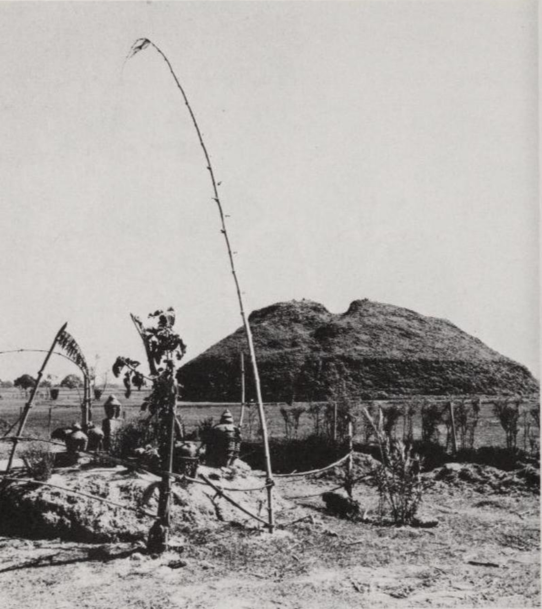

*Bảo tháp hỏa táng nằm cách tháp Parinibbāna khoảng một km rưỡi, đánh dấu nơi hỏa táng Đức Phật Thích Ca (Gotama). Đây cũng là nơi diễn ra việc phân chia xá lợi. Những kẻ săn kho báu đã làm phần trên của bảo tháp bị sụp xuống.*
*Ở nền cảnh phía trước là một nơi thờ cúng tín ngưỡng vạn vật hữu linh (animistic) thời hiện đại.*

Chỉ cần nghe thấy tên của Avalokiteśvara thôi cũng đủ mang lại sự giải thoát:

> Biết bao nhiêu trăm ngàn triệu tỷ chúng sinh ở đây (trên thế gian) đang phải chịu đựng đau khổ — khi họ nghe thấy tên của Bồ tát Đại sĩ Avalokiteśvara, tất cả đều tìm thấy sự giải thoát khỏi khối đau khổ khổng lồ đó. (SP 24 tr. 289)

Việc tìm kiếm sự giúp đỡ lúc khốn cùng và xin được giải thoát khỏi đau khổ thông qua sự trợ giúp của các Bồ tát là một phương pháp đơn giản, nhưng nó lại đặt người tìm kiếm vào một nghĩa vụ. Bởi lẽ, việc nhận sự phục vụ của các Bồ tát mà không sẵn lòng giúp đỡ các ngài trong công cuộc giải thoát những chúng sinh khác, chẳng phải là biểu hiện của sự ích kỷ và vô ơn sao? Tự *bản thân mình* trở thành một Bồ tát, tự *bản thân mình* giúp đỡ những chúng sinh đang chịu đau khổ, đó mới là cách đúng đắn nhất để cảm tạ sự giúp đỡ của các Bồ tát! Được giải thoát (to be liberated) là mục tiêu cuối cùng, nhưng đi giải thoát cho người khác (to liberate) mới là mục tiêu cấp bách và cao cả hơn.

> Còn có cách nào để đền đáp ân tình với những người bạn thực sự (của chúng ta) (tức các Bồ tát) — những người đã ban cho (ta) sự giúp đỡ vô lượng — tốt hơn là việc phụng sự tất cả chúng sinh? (119)
> 
> Khi một người làm được (điều gì đó) cho những người mà vì lợi ích của họ, (các Bồ tát) đã phải bầm dập thân xác và đi vào tầng địa ngục sâu nhất, thì thực sự, người đó đã làm được một việc tốt. Do đó, người ta phải luôn luôn tử tế ngay cả với những kẻ đại ác. (120)
> 
> Vì lợi ích (của những kẻ đại ác đó), ngay cả các chủ nhân của tôi (chư vị Bồ tát) cũng tự nguyện tàn nhẫn với chính bản thân mình. Làm sao tôi có thể kiêu ngạo trước các chủ nhân (của tôi) (và) tất cả những người (được các ngài bảo trợ) mà không cam tâm làm người phục vụ cho họ? (121) (Bca 6 tr. 58)

Con đường Bồ tát tuy dễ đi ở khía cạnh thụ động (tức là cầu xin sự giúp đỡ), nhưng ở khía cạnh chủ động, nó lại là con đường giải thoát khó khăn nhất mà Phật giáo đưa ra. Nó đòi hỏi một sự vị tha phi thường để có thể lập lời thề Bồ tát và cống hiến hoàn toàn bản thân cho việc giúp đỡ người khác mà không màng đến sự giải thoát của chính mình. Bất cứ điều gì Bồ tát nghĩ và làm đều được quyết định bởi lòng từ bi (*karuṇā*):

> Bồ tát ... không cần phải rèn luyện cho mình quá nhiều phẩm hạnh (virtues / *dharma*). (Tuy nhiên) có một phẩm hạnh ... mà Bồ tát phải cống hiến hết mình, ngài phải tôn vinh nó (bởi vì) thông qua nó, tất cả các phẩm hạnh của Phật sẽ trở nên hiển lộ. Phẩm hạnh duy nhất đó là gì? Đó là Đại Bi Tâm (Great Compassion). (Śs 16 tr. 151)

Không chỉ các nhà sư mà cả những tín đồ tại gia cũng có thể trở thành Bồ tát, và ở khía cạnh này, nam giới cũng như nữ giới đều bình đẳng. Con đường này có mười giai đoạn hay mười "địa" (stages / *bhūmi* - bậc). Ở mỗi giai đoạn, Bồ tát sẽ phát triển một trong những cái gọi là sự hoàn thiện phẩm hạnh (virtue-perfections / *pāramitā* - ba la mật) cho đến khi, ở giai đoạn thứ bảy, ngài trở thành một Bồ tát Siêu Việt, và ở giai đoạn thứ mười, trở thành một Bồ tát cõi trời (Heavenly Bodhisattva).

Ở điểm khởi đầu của Con đường Bồ tát mười giai đoạn, nhưng vẫn chưa nằm trong lộ trình đó, là 'tư tưởng hướng đến sự giác ngộ' hay tâm Bồ đề (thought directed to enlightenment / *bodhicitta*). Đây là điều kiện tiên quyết để bước vào Con đường này, và từ đó, Bồ tát lấy được lòng can đảm cho nhiệm vụ trước mắt.

Mười Giai đoạn này được miêu tả khác nhau trong một số văn bản, từ đó dàn ý sau đây được biên soạn lại:

(1) Hoan hỉ địa (The Joyful / *pramuditā*). Tín đồ lập lời thề Bồ tát để dâng hiến trọn vẹn bản thân cho sự giải thoát của người khác, và trì hoãn sự tĩnh diệt hoàn toàn của chính mình cho đến khi tất cả chúng sinh thoát khỏi đau khổ. Ngay cả sau khi chết, người đó vẫn có thể làm việc vì sự cứu rỗi của những chúng sinh khác, bởi lời thề Bồ tát là một lực lượng nghiệp (karmic force) đảm bảo cho người đó được tái sinh vào một hình thức tồn tại cho phép họ tiếp tục những nỗ lực của mình.
Ngập tràn niềm vui vì đang được đi trên con đường này, vị Bồ tát trẻ tuổi đặc biệt tu tập sự hoàn thiện phẩm hạnh về tính rộng lượng/bố thí (open-handedness / *dāna*). Không có những động cơ ích kỷ giấu giếm, ngài đem của cải của mình phân phát cho những người cần nó.

(2) Ly cấu địa (The Immaculate / *vimalā*). Ngài hoàn thiện tính tự kỷ luật (trì giới) của mình (*śīla*).

(3) Phát quang địa (The Radiating / *prabhākārī*). Bồ tát đạt được cái nhìn sâu sắc về bản chất phù du của thế giới và phát triển phẩm hạnh nhẫn nhục (patience / *kṣānti*). 'Nhẫn nhục' ở đây có nghĩa là sẵn lòng chịu đựng những nghịch cảnh và kiên trì trong những nỗ lực vì sự giải thoát của thế gian.

(4) Diệm huệ địa (The Blazing / *arciṣmati*). Giống như những ngọn lửa, Bồ tát thiêu rụi tàn dư của những tư tưởng sai lầm. Ngài trau dồi sức mạnh ý chí (tinh tấn) (will-power / *vīrya*), thứ ngài cần để giành chiến thắng trong cuộc đấu tranh vì sự giải thoát của mọi chúng sinh.

(5) Nan thắng địa (The Extremely Difficult to Conquer / *sudurjayā*). Ngài tự hoàn thiện mình trong thiền định (*dhyāna*) để có thể dùng trực giác nắm bắt được bản chất chân thực của sự tồn tại.

(6) Hiện tiền địa (The stage Facing Wisdom / *abhimukhi*). Bồ tát thấu hiểu sâu sắc về Duyên khởi (Conditioned Origination), vốn là nguyên nhân gây ra sự tồn tại đau khổ của cá nhân. Trí tuệ (*prajñā*) hay sự toàn tri (*sarvajñatā*) của ngài trở nên hoàn hảo khi ngài nhận ra tính Không của mọi chúng sinh và vạn vật, đồng thời nhận thức được nó chính là Cái Tuyệt Đối. Trong khi trí tuệ nói cho ngài biết rằng bản thân ngài chẳng qua chỉ là một sinh thể ảo ảnh trong một thế giới hiện tượng thuần túy, đang cố gắng giải phóng những bóng ma khỏi những đau khổ ảo ảnh; thì lòng từ bi lại nhắc nhở ngài không được chểnh mảng trong nỗ lực giải cứu những chúng sinh đang tin rằng mình đang phải chịu đau khổ.
Từ giai đoạn thứ sáu, khi đã đạt được trí tuệ (= sự giác ngộ) và trở thành một bậc thánh, Bồ tát có khả năng đi vào Niết bàn Tĩnh (Static Nirvāṇa / *pratiṣṭhita*) sau khi chết, tức là trở nên tĩnh diệt đối với thế gian. Tuy nhiên, nếu nắm lấy cơ hội này, ngài sẽ không xứng đáng với danh hiệu Bồ tát. Vì lòng từ bi với muôn loài, ngài chỉ đi vào Niết bàn Năng động (Active Nirvāṇa / Vô trụ xứ Niết Bàn / *apratiṣṭhita*), một trạng thái giải thoát giúp ngài thoát khỏi sự cưỡng ép của luân hồi nhưng vẫn cho phép ngài ở lại trong thế giới luân hồi để tiếp tục thúc đẩy sự giải thoát cho chúng sinh.

(7) Viễn hành địa (The Far-going / *dūraṅgamā*). Bồ tát chuyển sang một phương thức tồn tại mới. Ngài trở thành một Bồ tát Siêu Việt, nghĩa là ngài không còn bị trói buộc vào một cơ thể vật lý nữa. Tùy thuộc vào sự giúp đỡ mà ngài muốn ban cho, ngài có thể tự do hóa thân thành bất kỳ hình dáng nào có thể tưởng tượng được, nếu cần thiết có thể hóa ra nhiều hình dáng cùng một lúc. Lúc này, ngài sở hữu trọn vẹn phương pháp đúng đắn (phương tiện / *upāya*), có 'sự khéo léo trong các phương tiện' (skill in means / phương tiện thiện xảo). Ngài biết cách làm thế nào để dẫn dắt từng chúng sinh bước lên con đường giải thoát, dựa trên năng lực nhận thức và căn cơ của họ.

(8) Bất động địa (The Immovable / *acalā*). Ngài có được khả năng hồi hướng (transferring / *parināmanā*) công đức của mình cho những chúng sinh chưa được giải thoát. Sự an lành của họ chính là lời thề nguyện (vow / *pranidhāna*) của ngài.

(9) Thiện huệ địa (The Good-Thoughts / *sādhumati*). Bằng sức mạnh (*bala*), ngài cống hiến hết mình cho nhiệm vụ thực hiện lời thề nguyện dẫn dắt tất cả chúng sinh đến sự cứu rỗi. Một ví dụ về Bồ tát ở giai đoạn thứ chín là Avalokiteśvara (Quán Thế Âm).

(10) Pháp vân địa (The Cloud of the Doctrine / *dharmamegha*). Bồ tát đã hiện thực hóa được mọi tri thức (*jñāna*). Cơ thể ngài bắt đầu tỏa sáng và chiếu rọi khắp vũ trụ. Giữa các vị Bồ tát của Mười Phương, ngài ngồi trên một bông hoa sen ở cõi trời Tuṣita (Đâu Suất). Chỉ cần một lần thay đổi hình thức tồn tại nữa (một kiếp nữa), ngài sẽ đạt được Phật tính. Maitreya (Di Lặc) là một Bồ tát ở tầng hoàn thiện thứ mười này.

Sáu hoặc Mười Sự hoàn thiện (Ba la mật) — tên gọi các phẩm hạnh của Bồ tát — cũng đóng một vai trò quan trọng bên ngoài sự nghiệp Bồ tát mười giai đoạn và do đó được liệt kê lại ở đây. Chúng bao gồm:

- sự rộng lượng/bố thí (open-handedness / *dāna*),
- sự kỷ luật/trì giới (discipline / *śīla*),
- sự nhẫn nhục (patience / *kṣānti*),
- sức mạnh ý chí/tinh tấn (will-power / *vīrya*),
- thiền định (meditation / *dhyāna*), và
- trí tuệ (wisdom / *prajñā*).

Sáu Sự hoàn thiện này được cho là (AP 22 tr. 197) những người bạn thực sự của Bồ tát và là nguyên nhân dẫn đến sự toàn tri (omniscience) của ngài.

Bốn Sự hoàn thiện còn lại là:
- phương pháp (đúng đắn)/phương tiện (method / *upāya*),
- lời thề nguyện (vow / *pranidhāna*),
- sức mạnh (strength / *bala*), và
- tri thức (knowledge / *jñāna*).

Chúng được bổ sung vào những thời kỳ gần đây hơn nhằm mục đích phân bổ mỗi Sự hoàn thiện (Ba la mật) cho từng giai đoạn trong Mười Giai đoạn của sự nghiệp Bồ tát. Việc chắp vá danh sách này giải thích cho những điểm kỳ lạ trong thứ tự nối tiếp của các Sự hoàn thiện.

### 5. CON ĐƯỜNG ĐỨC TIN (THE WAY OF FAITH)

Mặc dù Con đường Bồ tát (Bodhisattva Way) — ở khía cạnh thụ động của nó (tức là cầu xin Bồ tát) — là một con đường dễ dàng để dẫn đến sự giải thoát; nhưng nghĩa vụ đạo đức yêu cầu người cầu xin phải đền đáp các vị Bồ tát bằng cách *tự bản thân mình cũng phải trở thành Bồ tát*, đã khiến nhiều người chùn bước không dám dấn thân. Đại đa số quần chúng cần những con đường giải thoát thoải mái hơn, những con đường không đòi hỏi nỗ lực nhọc nhằn và không đặt họ vào bất kỳ nghĩa vụ nào. Đối với những người thuộc kiểu này, Đại thừa chỉ dạy Con đường Đức tin (the Way of Faith) và Con đường Thờ cúng (the Cultic Way).

Từ 'đức tin' (faith) chưa đủ để chuyển tải trọn vẹn ý nghĩa của thuật ngữ *śraddhā* (tín). Bởi lẽ *śraddhā* không có nghĩa là sự chấp nhận một điều gì đó là đúng dựa trên lý trí (rational accepting-as-true), mà là một niềm tin tưởng trung thành, sâu sắc (faithful confidence). Từ này gần như đồng nghĩa với thuật ngữ *bhakti*, tức 'sự sùng đạo/sự tận tâm' (devotion), vốn thường được sử dụng trong các văn bản hậu kỳ của trường phái Đức tin.

Đối với những người đi theo Con đường này, đức tin là phẩm hạnh trung tâm, từ đó mọi phẩm hạnh khác sẽ tự động phát triển, và nó chắc chắn dẫn đến sự tái sinh trong một cõi tịnh độ (paradise) của Phật:

> Đức tin là người dẫn đường, là mẹ, là người khởi tạo, người bảo vệ, người làm tăng trưởng mọi phẩm hạnh, là kẻ xua tan những nghi ngờ, người cứu vớt khỏi dòng lũ luân hồi. Đức tin là biển chỉ đường dẫn đến thành phố an toàn (của cõi tịnh độ Phật).
> 
> Đức tin tạo ra sự ham thích trong việc từ bỏ (những thú vui trần tục), đức tin tạo ra sự hoan hỉ trong giáo pháp của những đấng chiến thắng (tức là chư Phật), đức tin tạo ra sự xuất sắc trong việc thấu hiểu các phẩm hạnh; nó dẫn dắt theo hướng tiến về mục tiêu của Phật. (Śs 1 tr. 4 f.)

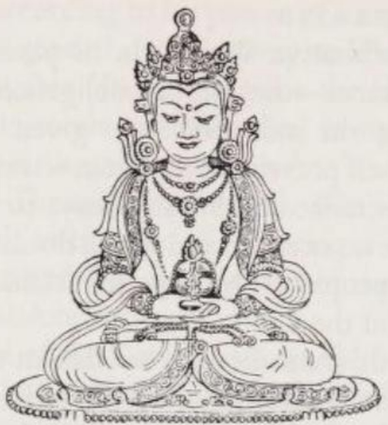

*Amitāyus (Vô Lượng Thọ), một hình tướng của Amitābha (A Di Đà) và là chủ nhân của cõi tịnh độ Sukhāvatī (Cực Lạc). Chiếc bình trên tay ngài, được đặt chồng lên nhau trong thủ ấn thiền định, chứa mật hoa bất tử. (Theo một bức tượng đồng Tây Tạng.)*

Theo cách hiểu của Đại thừa, niềm tin tưởng trung thành mang lại hiệu quả kép. Một mặt, nó tạo ra công đức (karmic merit / *puṇya*); và thông qua kết quả 'không thể nghĩ bàn' (*acintya*) của mình, nó vượt trội hơn hẳn so với những đạo đức thông thường (*śīla* / giới), vốn chỉ có tác dụng hữu hạn và bị giới hạn trong phạm vi của Luân hồi (Saṃsāra). Mặt khác, vì đức tin hướng đến một vị Bồ tát hay vị Phật Siêu Việt, nên nó là phương tiện để khơi dậy lòng từ bi và sự giúp đỡ của các ngài. Những điều mà chỉ làm việc thiện thôi không bao giờ có thể đạt được — cụ thể là nhận được sự trợ giúp của một đấng siêu việt — lại có thể được mang lại bằng cách nghe tên ngài, nghĩ về ngài với lòng tin tưởng và cầu khẩn ngài.

*Śraddhā* (Đức tin) chủ yếu hướng đến hai đấng siêu việt: Bồ tát Avalokiteśvara (Quán Thế Âm) và Phật Amitābha (A Di Đà) hoặc Amitāyus (Vô Lượng Thọ), ở Đông Á gọi là Amida. Tín đồ thường thích cầu cứu vị đầu tiên khi gặp cảnh khốn cùng cấp bách; tuy nhiên, Amitābha lại thiên về vai trò người cứu rỗi dẫn đến giải thoát hơn. Người ta kể rằng trong một tiền kiếp xa xôi khi còn là nhà sư Dharmākara (Pháp Tạng), ngài đã thề nguyện sẽ trở thành một vị Phật, với điều kiện là thông qua công đức của mình, ngài có thể tạo ra một Cõi Tịnh Độ thuần khiết của Phật mang tên Sukhāvatī (Cực Lạc), nghĩa là 'Vùng đất Hạnh phúc'. Trong 46 lời thề nguyện (*praṇidhāna*) trước Đức Phật Lokeśvararāja (Thế Tự Tại Vương), được ghi lại trong Kinh Vô Lượng Thọ bản dài (*Longer Sukhāvatīvyūhasūtra*), ngài đã tuyên bố những hành động mà ngài cam kết thực hiện vì mọi chúng sinh. Những lời thề nguyện quan trọng nhất của Dharmākara (tức Amitābha) là (trong bản tiếng Phạn của Kinh, có khác biệt so với bản chữ Hán) lời thề số 18 và 19, trong đó nêu rõ các phương pháp cầu xin sự trợ giúp của Amitābha vào khoảnh khắc lâm chung và để được tái sinh vào cõi tịnh độ của ngài.

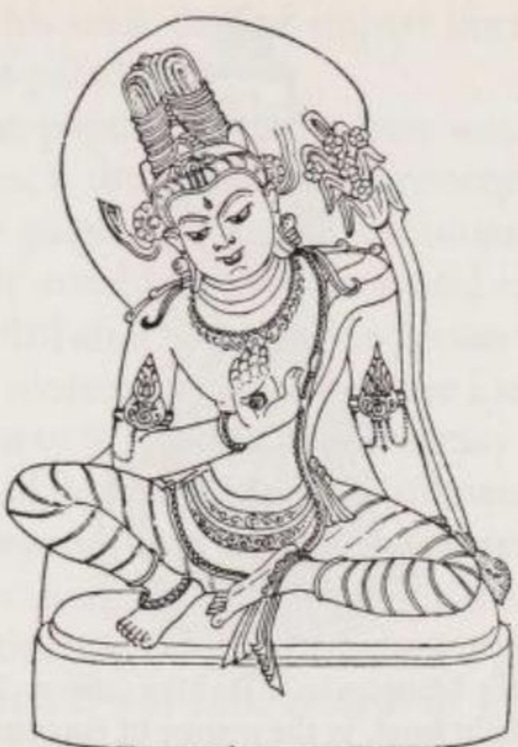

*Maitreya (Di Lặc) trong hình tướng Bồ tát ở cõi trời Tuṣita (Đâu Suất) (theo một bức điêu khắc thế kỷ 12 từ Viṣṇupur). Bông hoa Campa (hoa sứ) bên trái và bảo tháp nhỏ trên mái tóc búi cao của ngài là những dấu hiệu giúp nhận dạng. Tay phải ngài đang trong thủ ấn thuyết pháp, đánh dấu việc ngài đang giảng Đạo pháp (Dharma) cho chư thiên.*

> (18) Thưa Thế Tôn, sau khi con đã đạt được giác ngộ, nếu có những chúng sinh ở các hệ thống thế giới khác, thông qua việc nghe tên con mà phát khởi tâm hướng đến Sự Giác Ngộ Hoàn Hảo tối cao và nhớ đến con với một tâm trí trong sáng — nếu vào khoảnh khắc họ lâm chung, sau khi con, bao quanh bởi hội chúng tỳ kheo, đã đến bên họ, mà con lại không đứng trước mặt họ với tư cách là Đấng Được Tôn Kính để bảo vệ tâm trí họ khỏi sự sợ hãi — thì nguyện cho con không đạt được Sự Giác Ngộ Hoàn Hảo tối cao.
> 
> (19) Thưa Thế Tôn, sau khi con đã đạt được giác ngộ, nếu có những chúng sinh ở vô lượng, vô số cõi Phật, thông qua việc nghe tên con mà hướng tâm nguyện tái sinh vào cõi Phật (của con) (*Sukhāvatī*) và nhờ đó làm chín muồi những căn lành công đức — nếu họ không được tái sinh vào cõi Phật (của con) đó, dù họ chỉ mới hướng tâm (đến con và cõi tịnh độ của con) mười lần ... — thì nguyện cho con không đạt được Sự Giác Ngộ Hoàn Hảo tối cao. (SvL 8 tr. 227)

Được trút bỏ ác nghiệp và giải thoát khỏi đau khổ (SvL 18), tín đồ được tái sinh vào cõi tịnh độ *Sukhāvatī* (Cực Lạc), tại đây họ sẽ trưởng thành để đạt đến trí tuệ (38) và *Niết bàn* (24).

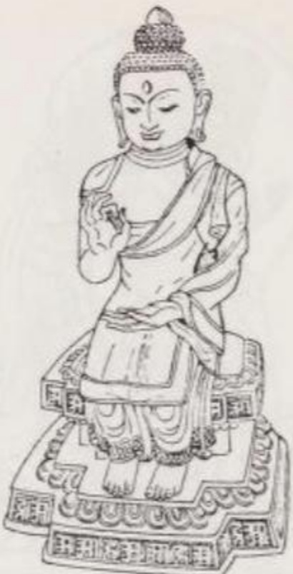

*Một viễn cảnh tương lai: Maitreya (Di Lặc) trong hình tướng một vị Phật (theo một bức tượng đồng Tây Tạng). Các ngón tay của bàn tay phải đang giơ lên trong thủ ấn thuyết pháp, tạo thành hình bánh xe giáo pháp, tay trái ngài đặt trong thủ ấn thiền định.*

Theo các kinh điển khác, tín đồ (*bhakta*) có thể được tái sinh vào cõi tịnh độ Sukhāvatī nằm ở phương Tây, cũng như cõi tịnh độ Abhirati (Diệu Hỷ) ở phương Đông của Phật Akṣobhya (A Súc Bệ), cõi tịnh độ phương Nam của Phật Ratnaketu (Bảo Tướng), hoặc cõi tịnh độ phương Bắc của Phật Dundubhīśvara (Cổ Âm Vương). Trong một tương lai xa xôi, một cõi tịnh độ nữa sẽ được thiết lập ngay trên trái đất bởi Phật Maitreya (Di Lặc), người hiện vẫn đang là Bồ tát ở cõi trời Tuṣita (Đâu Suất). Khác với vị Phật lịch sử Thích Ca (Gautama) vốn xuất thân từ giai cấp chiến binh (*kṣatriya* / sát-đế-lỵ), Phật Maitreya sẽ sinh ra như một tu sĩ Bà-la-môn (brahmin).

Trong các văn bản, vô số cõi tịnh độ của Phật được chia thành hai nhóm. Nhóm thứ nhất không có tên gọi chung đặc biệt, nhưng nhóm thứ hai được gọi là 'Tịnh Độ' (Pure Lands). Các cõi tịnh độ thông thường nằm trong vũ trụ của chúng ta và ít nhiều giống với thế giới của chúng ta, nhưng không có ác ý và bạo lực. Mặt khác, các Cõi Tịnh Độ (Pure Lands) lại mang tính siêu việt, và cư dân của chúng không được sinh ra ở đó nhờ vào công đức cá nhân, mà là nhờ ân sủng của một vị Phật Siêu Việt. Đó là những cõi tịnh độ rực rỡ và tràn ngập niềm hạnh phúc tuyệt vời. Cõi tịnh độ Sukhāvatī của Amitābha là nguyên mẫu của một Cõi Tịnh Độ. Mỗi vùng đất (*kṣetra* / cõi) này đều dưới sự cai quản và chăm sóc của một vị Phật Siêu Việt, người coi nhiệm vụ chính của mình là truyền đạt trí tuệ giải thoát cho chúng sinh trong cõi tịnh độ của ngài.

Trái ngược với quan niệm dân gian coi các cõi tịnh độ này là những thực thể vật chất có thật, quan niệm triết học lại cho rằng chúng là những sáng tạo tâm trí mang tính chủ quan. Một người còn bám chấp nghiệp quả mạnh mẽ vào thế giới của chúng ta sẽ tự tâm trí vẽ ra một cõi tịnh độ được mô phỏng theo thế giới này; tuy nhiên, một người tự do hơn về mặt nghiệp sẽ tự vẽ ra một Cõi Tịnh Độ thuần khiết.

Dù cõi tịnh độ của Phật Đại Thừa được hình dung theo cách nào đi nữa, không có một bộ Kinh nào giải thích, và cũng không có một tín đồ am hiểu nào lại coi đó là mục tiêu cứu rỗi cuối cùng. Nó chỉ là một trạm dừng chân trung gian trên con đường đi đến sự giải thoát, và ngay cả với Trường phái Đức tin, sự giải thoát cuối cùng vẫn phải bao gồm sự tĩnh diệt (nirvāṇa) của con người kinh nghiệm. Khi một tín đồ đã được tái sinh vào cõi tịnh độ của Phật Đại Thừa, đức tin từng dẫn họ đến đó sẽ không thể giúp họ đi xa hơn nữa: Niết bàn chỉ có thể được hiện thực hóa thông qua Trí tuệ (Wisdom) hay Sự thấu hiểu sâu sắc (Insight). Nhưng để phát triển được những điều này, việc tái sinh vào cõi Phật Đại Thừa mang lại một điểm xuất phát tốt nhất.

Giáo lý của Con đường Đức tin đã làm dấy lên câu hỏi: liệu một kẻ ác cũng có thể được tái sinh vào cõi tịnh độ của Phật hay không? Một số trường phái Đại thừa phủ nhận điều này. Những trường phái khác lại cho rằng không một người nào có niềm tin tưởng sâu sắc vào một vị Phật lại có thể là một kẻ ác. Một nhóm thứ ba — tiêu biểu nhất là Phật giáo Amida (= Amitābha / Tịnh Độ Tông) ở Đông Á — trả lời câu hỏi này là có. Họ lập luận rằng, lòng từ bi của Amida bao trùm tất cả chúng sinh, ngay cả những kẻ hèn hạ nhất. Thậm chí, những kẻ này còn gần với sự cứu rỗi hơn, bởi họ không ấp ủ cái ảo tưởng kiêu ngạo rằng mình có thể đạt được sự cứu rỗi bằng chính sức lực của mình. *(Ghi chú: Đây là một quan điểm rất nổi tiếng của Tịnh Độ Chân Tông Nhật Bản: "Người tốt còn được vãng sanh, huống hồ là kẻ ác" - ý nói kẻ ác khi biết hối cải và hoàn toàn phó thác vào tha lực của Phật A Di Đà thì càng dễ buông bỏ sự ngã mạn tự kiêu).*

### 6. CON ĐƯỜNG THỜ CÚNG (THE CULTIC WAY)

Không một tín đồ Đại thừa nào — nếu luôn hướng đến sự thuần khiết của tôn giáo mình — lại muốn thừa nhận rằng Đại thừa (chắc chắn là một sự nhượng bộ đối với quần chúng mộ đạo) cũng chấp thuận việc thờ cúng (cult) như một con đường dẫn đến giải thoát. Trên thực tế, Con đường Thờ cúng là hình thức khiêm tốn nhất của Phật giáo. Tuy nhiên, không thể phủ nhận sự tồn tại của nó. Các thực hành tôn giáo ở các quốc gia theo Đại thừa cũng như các tài liệu văn bản đều chứng minh cho sự tồn tại của con đường này.

Trong khi Tịch Thiên (Śāntideva) (thế kỷ 7 SCN) trong tuyển tập Tập Bồ Tát Học (*Śikṣāsamuccaya*) (17 tr. 156 f.) chỉ trích dẫn các đoạn Kinh coi việc thực hành nghi lễ là công cụ để có kiếp tái sinh tốt đẹp hơn; thì Kinh Diệu Pháp Liên Hoa (*Saddharmapuṇḍarīkasūtra*) (2, 78–94) lại đặc tả việc thờ cúng xá lợi, xây dựng Tháp (Stūpas), tạo tượng Phật, dâng hoa và hương, và tấu nhạc tại các đền thờ chính là con đường dẫn đến Giác ngộ. Văn bản này tiếp tục:

> Những ai đã thể hiện sự tôn kính (của mình) tại một Tháp (Stūpa) (bằng cách chắp tay lại, dù là) theo cách hoàn hảo hay (chỉ) bằng một tay, (và những ai) đã cúi đầu và thân mình một lần duy nhất trong một khoảnh khắc, (95)
> 
> —(hơn nữa, những người) đã nói 'Đảnh lễ Đức Phật!' một lần duy nhất tại những nơi lưu giữ xá lợi (tức là các bảo tháp), dù chỉ với một tâm trí xao nhãng, tất cả đều đã đạt được Sự Giác Ngộ Tối Cao (*agrabodhi*). (96) (SP 2, 95 f. tr. 39)

Điều này có nghĩa là thái độ tâm trí không đóng vai trò gì trong Con đường Thờ cúng: ngay cả khi được thực hiện 'với một tâm trí xao nhãng', nghi lễ vẫn dẫn đến sự giải thoát. Mặc dù quan điểm này mâu thuẫn với niềm tin của tất cả các Con đường giải thoát Phật giáo khác (vốn đều nhấn mạnh sự cần thiết của một khuynh hướng nội tâm đúng đắn), nhưng dù sao nó cũng thắp lên hy vọng giải thoát cho những người có ý chí yếu đuối.

### 7. MỤC TIÊU: NIẾT BÀN (THE GOAL: NIRVĀNA)

Đối với những người theo Con đường Bồ-tát và Con đường Đức tin, Niết-bàn đã lùi xuống vị trí thứ yếu. Mỗi con đường trong hai con đường này đều đặt ra cho mình một mục tiêu trước mắt: lần lượt là giải thoát thế giới và được tái sinh vào một cõi Phật. Tuy vậy, đối với cả hai trường phái này, sự diệt tận hoàn toàn — điều mà tất cả các trường phái Phật giáo đều hướng tới — vẫn là mục tiêu tối hậu.

Nếu như trong Tiểu thừa, giải thoát chỉ có thể đạt được thông qua Sự Giác ngộ (*bodhi*), thì trong Đại thừa, nó chỉ có thể đạt được thông qua Sự Giác ngộ qua Trí tuệ (*prajñā*). Trên Con đường Trí tuệ, điều này đã được tuyên bố rõ ràng; nhưng trên Con đường Bồ tát và Con đường Đức tin cũng không kém phần quan trọng: Trí tuệ chính là điều kiện tiên quyết để đạt được Niết bàn. Quả vị Bồ tát Siêu Việt đạt được thông qua phẩm hạnh hoàn thiện Trí tuệ (Wisdom-perfection); và Con đường Đức tin tuy không trực tiếp mang lại sự giải thoát, nhưng nó dẫn đến việc tái sinh vào một cõi tịnh độ của Phật, nơi tín đồ sau đó sẽ trưởng thành để đạt đến Trí tuệ (= sự giải thoát). Giác ngộ cũng là mục tiêu của Con đường Thờ cúng. *(Ghi chú: Có lẽ Schumann nhấn mạnh khía cạnh'trí tuệ' trong giác ngộ của Đại thừa, Tiểu thừa không giải thoát nhờ trí tuệ. Trong kinh Nikāya có thuật ngữ paññā-vimutti = 'giải thoát bằng trí tuệ')[MN 65.11](/link?q=MN-65.11).)*

Tuy nhiên, xét về nội dung của sự thấu hiểu mang tính giải thoát (liberating insight), Tiểu thừa và Đại thừa có sự khác biệt. Sự Giác ngộ của Tiểu thừa lấy nhận thức ra Tứ Diệu Đế (Four Noble Truths) về khổ, nguồn gốc của khổ, sự chấm dứt khổ và con đường đưa đến sự chấm dứt khổ. Mặt khác, Trí tuệ theo nghĩa của Đại thừa lại là sự nhận thức rằng Luân hồi (Saṃsāra) và Niết bàn (Nirvāṇa), chúng sinh trần tục và chư Phật, chỉ là những mặt đối lập trên bề mặt, còn về bản chất, chúng đồng nhất (are one) với Cái Tuyệt Đối (the Absolute). Điều phân biệt Đức Phật với kẻ phàm phu chính là thái độ của ngài đối với sự tồn tại. Kẻ phàm phu tin rằng mình bị tách biệt khỏi bản tính Phật (Buddha nature); họ coi quá trình luân hồi là một thứ gì đó có bản chất thực sự (essential) và do đó phải chịu đau khổ dưới những nghịch cảnh của nó. Ngược lại, Bậc Giải thoát sống trong ý thức về bản tính Phật vốn có của mình (= sự giải thoát đã có sẵn), và nhận ra đau khổ chỉ là sự tương tác của các pháp (dharmas) và chỉ là ảo ảnh đơn thuần. Ngài đã 'trở về nhà' tại tâm điểm lý tưởng bất động của bánh xe Luân hồi đang quay cuồng. Bốn Đặc điểm của Niết bàn (Tứ đức của Niết bàn) là: thường (sự vĩnh cửu của Cái Tuyệt Đối), lạc (niềm hạnh phúc khi nhận thức được sự đồng nhất của mình với nó), ngã (sự tự do, thoát khỏi sự trói buộc vào những thứ đau khổ), và tịnh (sự thanh khiết của cảm xúc và những khao khát) (Thường - Lạc - Ngã - Tịnh). [^ND-8]

Sự khác biệt thứ hai giữa quan niệm của Tiểu thừa và Đại thừa về Niết bàn liên quan đến việc chia trạng thái giải thoát thành hai 'cảnh giới'. Tiểu thừa phân biệt giữa (i) Niết bàn trước khi chết (Pre-mortal / Hữu dư y Niết bàn) và (ii) Niết bàn sau khi chết (Post-mortal / Vô dư y Niết bàn); trong khi một số Kinh Đại thừa lại phân biệt giữa (a) Niết bàn Năng động (Active / Vô trụ xứ Niết bàn) và (b) Niết bàn Tĩnh (Static).

(a) 'Không dừng lại' (*apratiṣṭhita*) hay 'năng động' (active) là trạng thái vị tha của Niết bàn, trong đó Bậc Giải thoát đã đạt đến quả vị thánh, nhưng thay vì trở nên tĩnh diệt khi qua đời, ngài tiếp tục sống dưới hình tướng một Bồ tát Siêu Việt để giúp đỡ mọi chúng sinh. Một Bậc Giải thoát trong Niết bàn Năng động hoàn toàn thoát khỏi mọi trói buộc nghiệp quả, khỏi tham, sân, si, và hành động mà không bị cuốn trở lại vào vòng Luân hồi bởi những hành động của mình. Các quy luật tự nhiên không còn trói buộc ngài nữa; ngài có thể tùy ý xuất hiện ở bất cứ nơi nào và dưới bất kỳ hình dáng nào có thể tưởng tượng được.

(b) Trong Niết bàn Tĩnh (Static / *pratiṣṭhita*), trạng thái có thể được đánh đồng với (ii) Niết bàn sau khi chết, Bậc Giải thoát sẽ mất đi mọi đặc điểm cá nhân vào khoảnh khắc qua đời và do đó trở nên không thể truy dấu. Ngài đã trút bỏ mọi thứ không phải là Cái Tuyệt Đối thuần khiết. Vì các khái niệm về tính cá nhân không còn có thể áp dụng cho ngài nữa, nên người ta không thể khẳng định bất cứ điều gì về 'ngài'. Nói về Bậc Giải thoát trong Niết bàn Tĩnh cũng chính là nói về Cái Tuyệt Đối. Nhưng việc cố gắng nói về Cái Tuyệt Đối cũng giống như việc cố gắng dùng tay không để bắt lấy một mùi hương vậy.