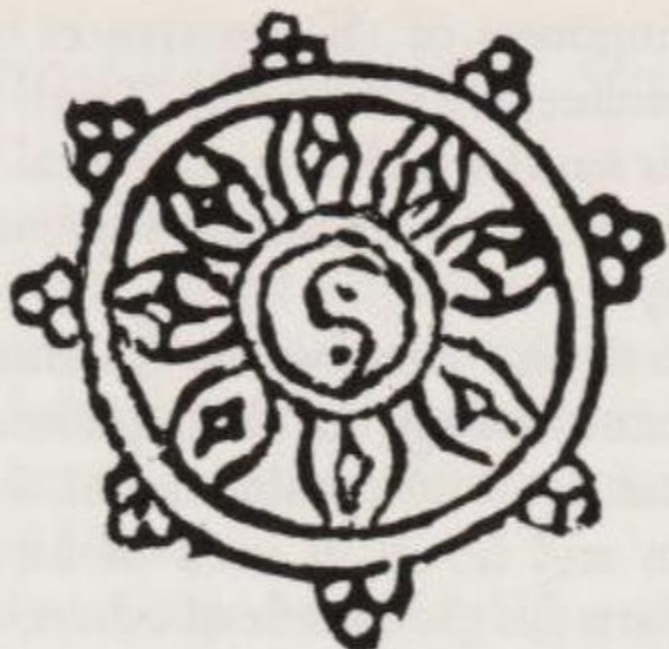
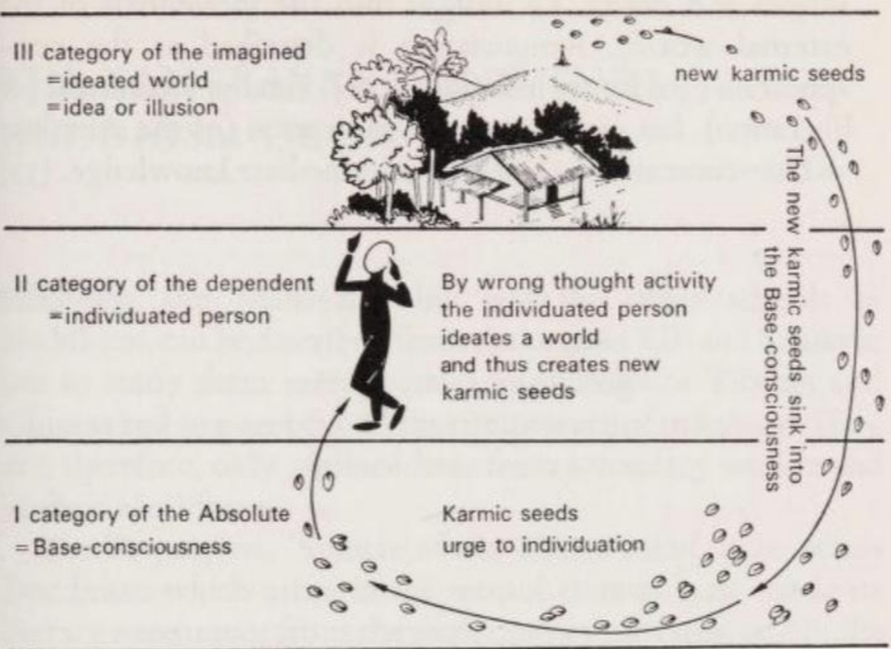
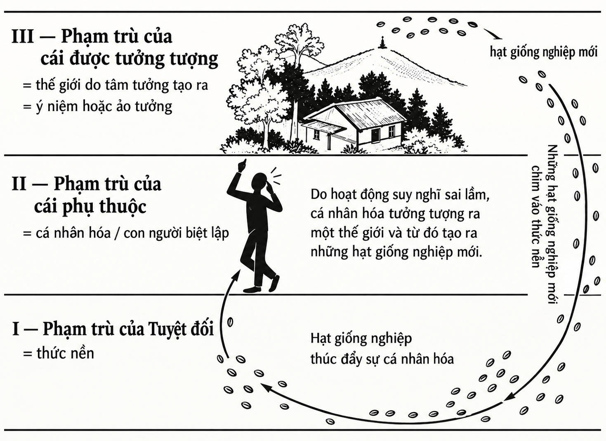

# IV. CÁC TRƯỜNG PHÁI TRIẾT HỌC ĐẠI THỪA

Các trường phái triết học Đại thừa (Mahāyāna) phát triển từ các trường phái mang tính tôn giáo thông qua việc hệ thống hóa và khai triển các giáo lý trong Kinh điển (Sūtras). Về sau, khi các bộ kinh mới được biên soạn, nhiều khái niệm do các nhà tư tưởng Đại thừa định nghĩa đã được đưa vào những cuốn sách mới này. Do đó, ngày nay những khái niệm này được xem là kiến thức chung của Đại thừa. Các triết gia Đại thừa không phải là những người khởi xướng đầu tiên; trên hết, họ là những người diễn giải và củng cố các ý tưởng đã có từ trước. Thành tựu lớn nhất của họ là đưa ra một góc nhìn mới, từ đó sắp xếp lại các ý tưởng trong những văn bản cổ thành các hệ thống riêng biệt, đồng thời kiến tạo nên một hệ thống logic triết học.

Triết học Đại thừa tập trung vào một vấn đề cốt lõi: mối quan hệ giữa cái Nhiều (the Many) và cái Một (the One). Một bên là sự đa dạng của các hiện tượng cấu thành nên thế giới; bên kia là tính hợp nhất của nguyên lý nội tại được cảm nhận trong các hiện tượng ấy như là Cái Tuyệt Đối (the Absolute) – điều mà mỗi người phải tự thân chứng nghiệm. Đây chính là hai thái cực làm nên không gian tư tưởng của Đại thừa.

## Hệ thống Trung quán (Madhyamaka / Śūnyatāvāda)

### 1. CÁC NHÀ TƯ TƯỞNG VÀ LUẬN ĐIỂN (ŚĀSTRAS)

Có hai bộ Kinh (Sūtras) làm nền tảng cho các quan điểm của trường phái Trung quán (Madhyamaka) hay Không tông (Śūnyatāvāda): kinh *Bát-nhã ba-la-mật-đa (Prajñāpāramitā)* và kinh *Diệu Pháp Liên Hoa (Saddharmapuṇḍarīka)*. Ngoài ra, còn có một số Luận điển (Śāstras) hay các văn bản học thuật do những nhà tư tưởng có tên tuổi biên soạn.

Long Thọ (Nāgārjuna), người sáng lập trường phái Trung quán, có thể sống vào đầu thế kỷ thứ hai sau Công nguyên. Sinh ra trong một gia đình Bà-la-môn ở miền Trung Ấn Độ, tương truyền ông đến với Phật giáo nhờ một lời nguyện. Ông dành một khoảng thời gian trong đời sống tại Amarāvatī; sau đó ông cư trú tại hoặc gần vùng Nāgārjunakoṇḍa. Người ta cho rằng ông qua đời tại đây, rất có thể là bị ám sát theo lệnh của một vị hoàng tử triều đại Śātavāhana. Nhận định cho rằng ông từng làm viện trưởng đại học Phật giáo Nālandā là hoàn toàn sai sự thật, bởi đại học Nālandā mãi đến thế kỷ thứ ba mới được thành lập.

Các tác phẩm sau đây của Long Thọ hiện vẫn được lưu giữ bằng tiếng Phạn (Sanskrit): *Trung quán luận (Madhyamakāśāstra)*, *Hồi tránh luận (Vigrahavyāvartanī)*, *Bảo hành vương chính luận (Ratnāvalī)*, *Tứ tán ca (Catuḥstava)*, *Đại thừa nhị thập tụng (Mahāyānaviṃśikā)*, [27](/giaolyvatongphai/notes#27){.note} *Pháp tập danh số kinh (Dharmasaṅgraha)*, [27](/giaolyvatongphai/notes#27){.note} và *Khuyến giới vương tụng (Suhṛllekha)*. [27](/giaolyvatongphai/notes#27){.note} 

Các nhà tư tưởng khác của phái Trung quán bao gồm Thánh Thiên (Āryadeva - thế kỷ 2/3), một đệ tử trực tiếp của Long Thọ; Phật Hộ (Buddhapālita - thế kỷ 5), Thanh Biện (Bhāvaviveka hay Bhāvya - thế kỷ 6/7), Nguyệt Xứng (Candrakīrti), Tịch Thiên (Śāntideva - thế kỷ 7), Tịch Hộ (Śāntarakṣita) và Liên Hoa Giới (Kamalaśīla - thế kỷ 8). Tác phẩm của những vị này cũng được truyền lại cho chúng ta bằng tiếng Phạn. Tịch Hộ và người học trò Liên Hoa Giới - những người đã nỗ lực tổng hợp hệ thống Trung quán với hệ thống Du-già hành phái (Yogācāra) - đã đóng vai trò quyết định trong việc đưa Phật giáo vào Tây Tạng. Chính Tịch Hộ là người đầu tiên truyền giới xuất gia cho người Tây Tạng trở thành tu sĩ Phật giáo, qua đó củng cố tầm ảnh hưởng lâu dài của phái Trung quán tại Vùng Đất Tuyết.

### 2. GIÁO LÝ

*(Ghi chú: Hiểu Long Thọ thì bạn cần hiểu 2 điều sau: (1) tự tính (svabhāvatā) = 'tự sinh, tự tồn tại độc lập';  (2) mọi thứ, mọi pháp đều  do duyên mà sinh khởi, không có cái gì tự sinh, tự tồn tại độc lập ngay cả: 'Niết Bàn', 'Pháp vô vi', 'tính không', ... hay chẳng điều gì có 'svabhāvatā')*

Các tác phẩm của Long Thọ hầu như không có thêm bất kỳ khẳng định mang tính xác định (positive statements) nào so với các văn bản của kinh *Bát-nhã (Prajñāpāramitā)* - nơi chứa đựng những ý tưởng mà ông đã hệ thống hóa.

Mối bận tâm lớn nhất của ông là chứng minh sự vô lý của bất kỳ một sự khẳng định nào, đồng thời chỉ ra sự mâu thuẫn nội tại của mọi hệ thống triết học có thể tồn tại. Để làm điều này, ông sử dụng một lối tư duy logic táo bạo, dù có những điểm sai sót, [28](/giaolyvatongphai/notes#28){.note} nhưng chính sự liều lĩnh trong cách lập luận đã mang lại sức mạnh cho tư tưởng của ông và góp phần làm lan tỏa trường phái Trung quán.

Tên gọi Trung quán (Madhyamaka) bắt nguồn từ Con Đường Ở Giữa (*Trung đạo / madhyamā pratipad*) mà Long Thọ giảng dạy khi bàn về sự tồn tại (hữu / being) hay không tồn tại (vô / non-being) của vạn vật:

> 'Nó tồn tại' — đây là sự quan điểm về vĩnh hằng (*thường kiến / eternity*); 'Nó không tồn tại' — đây là quan điểm về triệt tiêu (*đoạn kiến / annihilation*).
>> 
> Do đó, một người trí tuệ không giữ vào cả sự tồn tại lẫn sự không tồn tại. (Mś 15, [10](/giaolyvatongphai/notes#10){.note})

Nhưng nếu thế giới không phải là tồn tại, cũng không phải là không tồn tại, thì nó hiện hữu như thế nào? Nó hiện hữu giống như một ảo ảnh: với tư cách một hiện tượng đánh lừa, nó là thật, nhưng cái mà nó gợi ra là huyễn (māyā)::

> Sự sinh ra, tồn tại và hoại diệt (của vạn vật) đã được giải thích giống như một ảo giác, giống như một giấc mơ, hay một lâu đài trên không trung. (7, 34)

Một nhận định như vậy đòi hỏi phải có một thứ để xác định đâu là ảo và đâu là thực. Long Thọ xem thước đo để xác định này chính là 'sự tự tồn tại' (*tự tính / svabhāvatā*) hay 'Tự Tính' (essentiality). 'Tự Tính' có nghĩa là một thứ không do nguyên nhân sinh ra (15, 1), không phụ thuộc vào bất cứ điều gì để tồn tại (15, 2) và do đó nó vĩnh hằng (15, 11). Những đặc tính này không thể tìm thấy trong thế giới mà ta quan sát được (thế giới hiện tượng-empirical world), bởi thế giới này hoàn toàn vắng bóng 'Tự Tính' (24, 38), nghĩa là nó 'tính không' (*không / empty*). 

Mặc dù Long Thọ sử dụng các tính-từ 'không có Tự Tính' (*vô tự tính / asvabhāva*) và 'tính không' (*không / śūnya*) như những từ đồng nghĩa, nhưng ông lại không coi các danh-từ 'trạng thái không có Tự Tính' (*vô tự tính / asvabhāvatā* hoặc *niḥsvabhāvatā*) và 'Sự tính không' (*Tính Không / śūnyatā*) là đồng nghĩa với nhau.

Khẳng định một sự vật 'không có Tự Tính' là một khẳng định phủ định;  khẳng định nó mang 'Tính Không' lại là một khẳng định mang hai mặt ý nghĩa (ambivalent judgement). Một mặt, 'Tính Không' biểu thị sự không tồn tại của một Linh hồn hay Bản ngã độc lập (*vô ngã*); mặt khác, nó lại mang ý nghĩa là sự tự do giải thoát về mặt bản thể. Bởi vì chính nhờ việc không có Linh hồn (Bản ngã) mà chỉ có Tính Không, nên về bản chất, mọi sinh thể đều đã được giải thoát. Tính Không của mỗi sinh thể hoàn toàn đồng nhất với Tính Không của mọi sinh thể khác, và nó sở hữu mọi đặc tính của bản thể. Nhận thức được Tính Không trong bản chất của chính mình cũng chính là đạt được sự giải thoát. Trong hệ thống Trung quán cũng như trong các văn bản Bát-nhã, Tính Không chính là Cái Tuyệt Đối (the Absolute).

Trong quá trình tồn tại cũng như trong quá trình giải thoát, 'trạng thái không có Tự Tính' hay 'Tính Không' vận hành theo ba cách. Chúng là điều kiện tiên quyết cho (1) sự hình thành của mọi sinh thể và (2) sự hình thành của khổ đau, nhưng chúng cũng tạo khả năng cho (3) sự giải thoát khỏi vòng luân hồi (Saṃsāra) – tức là sự dập tắt hoàn toàn (*niết-bàn / extinction*).

(1) Thế giới, cá nhân và chuỗi tái sinh chẳng qua chỉ là những hiện tượng được tạo ra bởi Sự Sinh Ra Có Điều Kiện (*Duyên khởi / Conditioned Origination*) với sự biến đổi nhanh chóng của các Yếu Tố Bị Ràng Buộc (*Hữu vi pháp / Conditioned Dharmas*). Quá trình biến đổi liên tục này sẽ không thể xảy ra nếu các Yếu Tố (Dharmas) cấu thành nên nó mang 'Tự Tính', tức là những thực thể vĩnh cửu: chỉ có 'sự không có Tự Tính' hay Tính Không mới làm cho chúng phù hợp để trở thành các nhân tố tạo nên sự tồn tại. Do đó, 'sự không có Tự Tính' (= Tính Không) chính là điều kiện tiên quyết để khổ đau phát sinh (24, 22).

Các đối thủ của Long Thọ đã diễn dịch điều này theo hướng: ông coi Tính Không là nguyên nhân của khổ đau hoặc là yếu tố sinh ra khổ đau. Đây là một sự hiểu lầm. Long Thọ cũng khẳng định rằng Tính Không không bao giờ sinh ra bất cứ thứ gì. Tuy nhiên, quá trình Duyên khởi – bị thúc đẩy bởi sự khao khát (*ái / craving*) và sự thiếu hiểu biết (*vô minh / ignorance*) – lại diễn ra bên trong Tính Không và sẽ không thể hình dung nổi nếu thiếu đi Tính Không. Tính Không không phải là nền tảng khởi thủy hay nguyên nhân, nhưng lại là điều kiện tiên quyết của vòng luân hồi (Saṃsāra) — nó là cái bất biến trong mọi sự đổi thay.

(2) Vì mọi Yếu Tố (Dharmas/Các pháp) đều sinh ra từ các điều kiện nên chúng có 'tính không' (24, 19), do đó thế giới hiện tượng do chúng tạo thành cũng mang tính tạm thời (*biến hoại / vô thường*). Tuy nhiên, sự tạm thời (*transitoriness*) chính là khổ đau (24, 21).

(3) Nếu khổ đau là một thứ có bản thể (một thực thể cố định), thì sẽ không bao giờ có thể tiêu diệt được nó (24, 23). Chính Tính Không đã khiến cho việc chấm dứt khổ đau trở nên khả thi (24, 39).

Trước câu hỏi Tính Không thực chất có nghĩa là gì, Long Thọ trả lời: Tính Không chính là Sự Sinh Ra Có Điều Kiện (*Duyên khởi / pratītyasamutpāda* — 24, 18), bởi vì

> Vì không có Yếu Tố (Pháp) nào mà không sinh ra từ các điều kiện,
>>
> Nên không có Yếu Tố (Pháp) nào là không có 'tính không' (*không mang Tính Không*). (24, 19)

Câu trả lời này không chỉ chưa định nghĩa được Tính Không mà mới chỉ mô tả nó như một thuộc tính của các Pháp, mà nó còn chưa trọn vẹn. Như Long Thọ biết rất rõ, 'Tính Không' còn chỉ một thái độ tinh thần: sự không bám chấp vào các học thuyết (*kiến chấp / theorems*) (13, 8). Tính Không – với tư cách là Cái Tuyệt Đối và sự tự do – được chứng nghiệm thông qua một thái độ mang Tính Không. Khi tâm trí được gột sạch khỏi sự đồng tình hay phủ nhận, nó sẽ hòa vào Cái Tuyệt Đối (*Chân như / tattva*). Các đặc tính của Cái Tuyệt Đối là: không thể nhận thức được thông qua sự trợ giúp của người khác, tĩnh lặng, không bị đa nguyên hóa bởi sự đa dạng, không có tính đối lập (phân cực) và hoàn toàn đồng nhất/rõ ràng (unequivocal) (18, 9). Nguyệt Xứng (Candrakīrti) viết (trong phần bình chú cho Mś 18, 5 trang 150): Tính Không chính là Niết-bàn (Nirvāna).

Sẽ là một sai lầm nếu nâng Tính Không – vốn là sự phá bỏ mọi lý thuyết – lên thành một lý thuyết rồi bám chấp vào nó (13, 8). Nguyệt Xứng bình luận rằng, kẻ nào làm như vậy thì cũng giống như một người được người lái buôn báo rằng ông ta không có gì để bán, thế là người đó lại hy vọng có thể mua cái "không có gì" ấy và mang về nhà. Trong cùng bối cảnh đó, Nguyệt Xứng trích dẫn một phép so sánh từ kinh *Bảo Tích (Ratnakūṭasūtra)*: Tính Không giống như thuốc xổ; nó dùng để tẩy ruột, nhưng bệnh nhân chỉ thực sự khỏi bệnh khi chính bản thân thứ thuốc đó cũng đã bị tống ra ngoài.

Điều này dễ dẫn đến việc người ta đem Tính Không (cái Một) đặt đối lập với sự đa dạng của các Yếu Tố Bị Ràng Buộc (*Hữu vi pháp*), và coi Tính Không là 'Cái Hoàn Toàn Khác Biệt' (the Wholly-Different). Tuy nhiên, một sự tách biệt như vậy là sai lầm. Các Pháp (Dharmas) không hề cô lập với nhau, cũng không hề cô lập trong mối quan hệ của chúng với Cái Tuyệt Đối. Bởi vì tất cả chúng đều tính không và không có sự sai biệt (25, 22), và sự tính không (Tính Không) của chúng chính là Cái Tuyệt Đối, nên về bản chất, không có sự khác biệt nào giữa các hiện tượng (Pháp) và Cái Tuyệt Đối (= Niết-bàn):

> Không có sự khác biệt giữa Luân hồi (Saṃsāra) và Niết-bàn (Nirvāṇa); không có sự khác biệt giữa Niết-bàn và Luân hồi.
>>
> Cảnh giới của Niết-bàn cũng chính là cảnh giới của Luân hồi.
>>
> Giữa hai điều này không có lấy một chút khác biệt nhỏ nhất nào. (25, 19-20)

Hạnh phúc và khổ đau, Ta và Ngươi — mọi cặp đối lập chỉ là đối lập dưới dạng vẻ bề ngoài, đối lập trong thế giới hiện tượng. Còn về bản chất, chúng hoàn toàn đồng nhất, đó chính là Tính Không – thứ không cần phải được giải thoát vì bản thân nó đã là sự giải thoát.

Định nghĩa của Long Thọ về Niết-bàn cũng khó nắm bắt y như định nghĩa của ông về Tính Không. Niết-bàn không phải là thứ để đạt được hay từ bỏ, không bị gián đoạn cũng không vĩnh hằng, không bị tiêu diệt cũng không được sinh ra (25, 3). Nó không phải là sự tồn tại, cũng không phải là sự không tồn tại (25, 10). Trong Niết-bàn, mọi sự nhận thức (tri giác) đều dừng lại, thế giới của sự đa dạng phức tạp (*hý luận / prapañca*) được lắng dịu và nơi đó ngự trị niềm hỷ lạc (25, 24).

Niết-bàn được chứng nghiệm thông qua Tính Không:

> Người theo thuyết Tính Không (*Không tông / śūnyatāvādin*) không bị mê hoặc bởi các Pháp của thế gian, vì người đó không nương tựa vào chúng. Khi được thứ gì, người đó không tự mãn; khi không được thứ gì, người đó không thất vọng. Danh tiếng không làm người đó kiêu hãnh, sự vô danh không làm người đó chán nản; người đó không suy sụp vì bị khiển trách, cũng không bay bổng vì được ngợi khen; người đó không vui vì vận may, cũng không buồn vì hoạn nạn. . . . Đối với người theo thuyết Tính Không, do đó, không có sự yêu thích (thiện cảm) hay sự ghét bỏ (ác cảm). (Śs trang 264)

*Bánh xe pháp, phiên bản Đại thừa. Tám nan hoa tượng trưng cho các quy tắc của Bát Chánh Đạo dẫn đến sự dập tắt khổ đau; biểu tượng ở trung tâm được mượn từ Trung Quốc (Thái Cực), đại diện cho sự đan xen hòa quyện giữa khổ đau và giải thoát. (Tranh khắc gỗ Tây Tạng.)*

Theo chính lời của Long Thọ:

> Sự giải thoát (*mokṣa*) đến từ việc tiêu diệt Hành động (*Nghiệp / Karman*) và các phiền não (*kleśa*). Nghiệp và phiền não sinh ra từ các ý niệm.
>>
> Các ý niệm lại sinh ra từ sự đa dạng phức tạp (*hý luận / multiplicity*). Tuy nhiên, sự đa dạng phức tạp này lại bị triệt tiêu trong Tính Không. (MŚ 18, 5)

Nói cách khác: việc chứng ngộ Tính Không sẽ phá hủy sự thôi thúc phải tái sinh. Vì giải thoát khỏi vòng tái sinh chính là mục tiêu trong giáo lý của Đức Phật, nên đạt được điều này nghĩa là một người đã hoàn mãn trọn vẹn lời dạy của Ngài.

Các quan điểm của Long Thọ không phải là không vấp phải sự tranh cãi. Các đối thủ của ông lập luận: Nếu mọi thứ đều là tính không, thì làm gì có Tứ Diệu Đế của Đức Phật, cũng chẳng có quả báo (*karmic reward*) cho các hành động; hệ quả là mọi kỷ luật đạo đức đều trở nên vô nghĩa (MŚ 24, 1–4).

Lời phản bác này đã đi chệch trọng tâm. Mặc dù Long Thọ coi mọi thứ, bao gồm cả giáo lý của Đức Phật, đều là tính không (*mang Tính Không*), ông không hề phủ nhận sự tồn tại chân thực của chúng dưới dạng các hiện tượng bề ngoài. Thế giới này giống như một giấc mơ: nó chân thực đến mức ngột ngạt chừng nào người ta chưa tỉnh giấc.

Ông giải thích rằng, Chân lý bao gồm hai mặt hay hai cấp độ (24, 8). Trong đời sống thực tế, chúng ta áp dụng Chân lý Tương đối (nghĩa đen là Chân lý 'che phủ' / *Tục đế / saṃvṛti satya*). Chân lý này sử dụng các thuật ngữ mang tính quy ước như 'Nghiệp' và 'Giải thoát', đồng thời tận dụng các lập luận logic. Lý do là vì hầu hết mọi người không có khả năng tư duy về những gì vượt ra ngoài thế giới hiện tượng, nên họ chỉ hiểu được loại ngôn ngữ này. Tuy nhiên, nếu Tính Không của mọi hiện tượng được chỉ ra và thể hiện như là Cái Tuyệt Đối, chúng ta phải áp dụng 'Chân lý ở Nghĩa Tối Cao' (*Chân đế / paramārtha satya*) – một chân lý vượt lên trên mọi logic thông thường. Chân lý Tương đối nói về sự khác biệt giữa các sự vật, còn Chân lý Tối Cao nói về sự đồng nhất trong bản chất của chúng.

Chân lý Tương đối cũng được Bồ tát (Bodhisattva) sử dụng trong nỗ lực giải thoát mọi sinh thể. Bởi vì dù về cơ bản, các sinh thể đều mang Tính Không và đã được tự do từ vô thủy, nhưng họ không nhận thức được sự tự do của chính mình, do đó họ cần đến sự giúp đỡ của Bồ tát. Vừa không ngừng nỗ lực vì lợi ích của người khác, Bồ tát vừa tự tư duy trên cả hai cấp độ:

> Có bao nhiêu sinh thể . . . tồn tại . . . , tất cả đều phải được ta dẫn dắt đến sự dập tắt hoàn toàn (*niết-bàn / perfect extinction*). Thế nhưng, mặc dù vô số sinh thể đã được dẫn dắt đến sự dập tắt hoàn toàn như vậy, thực chất lại không có bất kỳ sinh thể nào được dẫn dắt đến đó cả. Vì sao vậy? Nếu . . . một vị Bồ tát còn giữ ý niệm về 'sinh thể', thì ngài không thể được gọi là Bồ tát. Vì sao vậy? Không thể gọi là Bồ tát nếu người đó còn giữ ý niệm về 'Bản ngã' (*ngã / ātman*), hay ý niệm về 'sinh thể' (*chúng sinh / being*), hay ý niệm về 'Linh hồn' (*thọ giả / jīva*), hay ý niệm về 'con người' (*nhân / pudgala*). (VP 3 trang 28 f.)
*(Ghi chú: Đoạn trích này phản ánh tư tưởng cốt lõi của Kinh Kim Cương, giải thích cách Bồ tát hành động độ sinh trong thế giới hiện tượng nhưng tâm không dính mắc vào khái niệm người độ và kẻ được độ).*

Người theo phái Trung quán (Mādhyamika) phải học cách sống trong tính tương đối. Họ trao đi những món quà một cách từ bi và xuất phát từ trái tim, nhưng luôn đi kèm với Ba Sự Hiểu Biết (*Tam luân thể không / Threefold Knowledge*): nhìn thấu được bản chất chỉ là hiện tượng (Tính Không) của món quà, của người cho và của người nhận.

## Hệ thống Du-già hành phái (Yogācāra) hay Duy thức tông (Vijñānavāda)

### 1. CÁC NHÀ TƯ TƯỞNG VÀ LUẬN ĐIỂN (ŚĀSTRAS)

Các văn bản nền tảng của trường phái Du-già (Yogācāra) hay Duy thức tông (Vijñānavāda) là các kinh *Lăng-già (Laṅkāvatāra-Sūtra)*, *Hoa Nghiêm (Avatamsaka-Sūtra)* và *Giải thâm mật (Sandhinirmocana-Sūtra)*. Tuy nhiên, trong số này chỉ có kinh *Lăng-già* là còn được lưu giữ bằng tiếng Phạn (Sanskrit). Ngoài ra, còn có một số Luận điển (Śāstras) làm nhiệm vụ hệ thống hóa giáo lý của những bộ kinh này.

Có ba nhân vật đã để lại dấu ấn cá nhân sâu đậm lên phái Du-già: Di-lặc hay Di-lặc-ná-tha (Maitreya hoặc Maitreyanātha - thế kỷ 3/4), Vô Trước (Asaṅga), và Thế Thân (Vasubandhu - thế kỷ 4/5). Tính xác thực về mặt lịch sử của Di-lặc-(ná-tha) từng bị một số người đặt dấu hỏi, nhưng các học giả hiện đại có xu hướng coi ông là một nhân vật có thật. Ông được cho là thầy của Vô Trước. Trong số các tác phẩm của ông, những bộ luận sau đây vẫn còn bản tiếng Phạn: *Du-già sư địa luận (Yogācārabhūmiśāstra)*, *Biện trung biên luận (Madhyāntavibhāga)*, *Đại thừa trang nghiêm kinh luận (Mahāyānasūtrālaṅkāra)*, *Hiện quán trang nghiêm luận (Abhisamayālaṅkāra)* và *Bảo tính luận (Ratnagotravibhāga)*. 

Vô Trước (Asaṅga) và Thế Thân (Vasubandhu) là hai anh em xuất thân từ một gia đình Bà-la-môn ở Puruṣapura (nay là Peshawar thuộc Pakistan). Trước khi chuyển sang Đại thừa (Mahāyāna), họ được cho là những tín đồ của phái Thuyết Nhất Thiết Hữu Bộ (*Sarvāstivāda*).

Vô Trước là tác giả của *Pháp pháp tính phân biệt luận (Dharmatāvibhaṅga)* và *Đại thừa A-tì-đạt-ma tập luận (Abhidharmasamuccaya)*. Các tác phẩm khác của ông chỉ được truyền lại qua các bản dịch.

Tương truyền, Thế Thân (Vasubandhu) được anh trai là Vô Trước thuyết phục chuyển sang Đại thừa, sau khi ông (với tư cách là một tín đồ Tiểu thừa) đã viết một vài cuốn sách, trong đó có bộ *A-tì-đạt-ma câu-xá luận (Abhidharmakośa)*. Tuy nhiên, các nghiên cứu gần đây chỉ ra rằng Thế Thân - tác giả của bộ *Câu-xá luận* - và Thế Thân của phái Du-già rất có thể không phải là cùng một người. Những tác phẩm mang tính nền tảng nhất của vị Thế Thân theo phái Du-già là *Tam tự tính luận (Trisvabhāvanirdeśa)* và *Thành duy thức luận (Vijñaptimātratāsiddhi)*. Bộ *Thành duy thức* bao gồm hai luận văn triết học là *Nhị thập tụng (Viṃśatikā)* và *Tam thập tụng (Triṃśikā)*.

Sự khác biệt trong cách Vô Trước và Thế Thân đặt trọng tâm cho trường phái của mình được thể hiện rõ qua việc họ gọi nó bằng những cái tên khác nhau. Là một người thực hành tôn giáo, Vô Trước đặc biệt nhấn mạnh vào thiền định. Xem con đường đi đến sự giải thoát như một hình thức Yoga đặc biệt, ông gọi hệ thống này là *Yogācāra* (Du-già hành phái), nghĩa là 'sự thực hành Yoga'. Mặt khác, Thế Thân, với thiên hướng là một nhà lý luận và tư tưởng, đã gọi hệ thống này là *Vijñānavāda* (Duy thức tông) - 'học thuyết về tâm thức', bởi nó giải thích mọi thứ tồn tại đều chỉ là tâm thức (*consciousness/mind*).

Các triết gia khác của phái Du-già đáng được nhắc đến bao gồm: Trần-na (Dignāga hay Dinnāga - thế kỷ 5/6), An Huệ (Sthiramati) và Hộ Pháp (Dharmapāla - thế kỷ 6), Nguyệt Quan (Candragomin), Pháp Xứng (Dharmakīrti - thế kỷ 7), Pháp Thượng (Dharmottara - thế kỷ 9) và Sư Tử Hiền (Haribhadra - thế kỷ 10). Các tác phẩm của họ chủ yếu giải quyết các vấn đề về nhận thức luận (*epistemology*) và logic học.

### 2. GIÁO LÝ

*(Ghi chú: Khái niệm về Duy Tâm: mọi thứ có trong đầu của ta ví như cái bàn đều là những phản ánh thần kinh: hạt ánh sáng đi từ cái bàn đập vào võng mạc mắt, tạo ra xung điện thần kinh dẫn lên đến não, não dựng tạo ra cái bàn từ các tín hiện thần kinh này - và cái bàn mà ta 'thấy' là cái bàn do não tạo ra từ các xung điện thần kinh - không bao giờ ta có thể đến được cái bàn thật. Tương tự cho những khái niệm vô hình như 'tự do', 'hạnh phúc'... họ đặt tên cho phát hiện này là 'duy tâm' = mọi thứ mà ông 'thấy' đều là mô hình hóa của não, không bao giờ là thật)*

Theo phái Du-già, mọi thứ ta nhận thức xung quanh đều là tâm thức (*duy tâm / cittamātra*):

> Không có (những thứ) hữu hình, thế giới bên ngoài chính là tâm thức (*tâm / citta*),
>>
> chỉ có tâm thức là được nhìn thấy; cơ thể, tài sản và môi trường xung quanh, ta gọi đó không gì khác ngoài tâm thức. (LS 3, 33 trang 154)

Những câu như 'Thế giới chỉ là tâm thức' (LS 2, 136 trang 73) và 'Ba cõi (tam giới) chính là tâm thức' có thể được tìm thấy nhan nhản trong kinh *Lăng-già (Laṅkāvatārasūtra)*.

Tuy nhiên, các hành động nhận thức (*acts of perception*) không hề đưa các vật thể đang tồn tại bên ngoài vào trong tâm trí. Thứ mà chúng ta thường gọi là 'nhận thức' thực chất là một quá trình tưởng tượng (*imagination*), tự tạo ra trong chúng ta hình ảnh về các vật thể được giả định là có thật đó. Những thứ mà chúng ta tin rằng mình đang nhìn thấy, cầm nắm, nếm thử, v.v., trên thực tế chỉ là những ý niệm do tâm trí tạo ra (*sự tạo tác ý niệm / ideations*). Nếu như phái Trung quán (Madhyamaka) nhìn nhận vạn vật như các Yếu tố cấu thành (*Pháp / Dharmas*), thì phái Du-già (Yogācāra) chỉ nhìn thấy những tia chớp của tâm thức, và chính sự nối tiếp không ngừng của những tia chớp tâm thức này đã ảo hóa ra trong ta ấn tượng về một thế giới. 

Việc những người khác nhau cùng 'nhận thức' về một thế giới giống nhau được giải thích là do họ bị tác động bởi những Hành động (*Nghiệp / Karman*) tương tự nhau, dẫn đến việc họ có những ý niệm tương tự nhau. Việc chúng ta không thể tùy ý thay đổi thế giới do chính mình ý niệm ra được quy cho việc chúng ta đang bị trói buộc bởi Nghiệp của chính mình. Nếu không có sức mạnh đánh lừa của những Nghiệp xấu (bất thiện) từ quá khứ, mọi người đều sẽ nhận ra rằng nỗi khổ của mình chỉ là nỗi khổ do tâm trí vẽ ra, và việc chấm dứt nỗi khổ đó hoàn toàn nằm ở chính bản thân mình.

Để phản bác lại các trường phái triết học coi thế giới hiện tượng (empirical world) là có thật, các nhà Du-già hành phái chứng minh cho chủ nghĩa duy tâm (*idealism*) của mình theo cách sau: Họ lập luận rằng sự vật chỉ tồn tại khi chúng là nội dung bên trong tâm thức của chúng ta; nếu không có tâm thức nhận biết về chúng, chúng hoàn toàn không tồn tại. Do đó, vì ý niệm của chúng ta về các sự vật là bằng chứng duy nhất cho sự tồn tại của chúng — chẳng phải sẽ là suy đoán suông sao, nếu từ bức tranh tâm trí đó ta lại kết luận rằng các sự vật tồn tại độc lập với tâm trí? Sự vật *chính là* tâm thức, *chính là* tâm trí, đó là lời khẳng định an toàn duy nhất mà ta có thể đưa ra về chúng.

Lý thuyết này thậm chí còn được đẩy đi xa hơn:

> Tất cả những thứ này không gì khác ngoài tâm thức. Tâm thức hiển lộ theo hai cách: Dưới dạng (khách thể) bị nắm bắt và dưới dạng kẻ nắm bắt (tức là chủ thể). Chẳng hề có một Bản ngã (*Self*) nào, cũng chẳng có gì mang bản chất của một Bản ngã. (LS 3, 121, trang 209)

Do đó, không chỉ các khách thể (đối tượng nhận thức) mới là ‘tâm thức’ – tức là những sản phẩm sáng tạo hay ý niệm của tâm trí – mà cả chủ thể cũng vậy. Con người bằng xương bằng thịt (*the empirical person*) cũng chẳng có chút tồn tại độc lập nào với tâm trí, y như thế giới vậy; bản thân con người cũng chỉ là một ý niệm (*ideation*). Nhưng tâm trí nào là kẻ tạo ra ý niệm đó?

Những người Du-già cho là: là tâm trí (*citta*) sinh ra chủ thể không phải là tâm trí của chính cá nhân đó và cá nhân đó không thể tự tạo ra ý niệm về chính mình. Theo họ ở đây, 'tâm trí' nên được hiểu là một thứ gì đó nằm ngoài cá nhân bằng xương bằng thịt, một thứ tồn tại trước cá nhân hoặc siêu việt khỏi cá nhân. Trong các kinh sách của mình, ‘tâm thức/tâm trí’ trong hệ thống Du-già hành phái là một tên gọi khác của Cái Tuyệt Đối (the Absolute). Tính Như (*Chân như / Thusness*), Tính Không (*Emptiness*), Niết-bàn (*Nirvāṇa*), Bản thể của Thực tại (*Pháp giới / Essence of Reality*) và Tâm thức (*Mind*) đều là **một** (LS 3, 31 trang 154). Đôi khi, Cái Tuyệt Đối này được khái niệm hóa thành Pháp Tính Phật (*Dharmatābuddha*) hoặc Pháp Thân Phật (*Dharmabuddha*) (ví dụ: LSsag 382).

Việc Tâm Thức Tuyệt Đối (Absolute Mind) làm thế nào có thể tự cá thể hóa thành một con người bằng xương bằng thịt được phái Du-già giải thích bằng một lý thuyết. Lý thuyết về sự cá thể hóa (*theory of individuation*) này không giải thích về từ đầu khởi thủy về nguồn gốc vũ trụ (*cosmogonic doctrine*), nó giả định rằng 'không biết từ đâu' đã có sẵn những Nghiệp (Karman) từ quá khứ tồn tại rồi. Việc tìm kiếm điểm khởi thủy đầu tiên chưa bao giờ là vấn đề mà tư tưởng Phật giáo này bận tâm.

Lý thuyết mô tả về hai tầng của tâm thức (*tâm / citta*): Thức tàng trữ hay Thức nền tảng (*A-lại-da thức / ālayavijñāna* – Storehouse/Base-consciousness) và Thức cá nhân hay Thức suy nghĩ (*Mạt-na thức / manovijñāna* hay *manas* – Individual/Thought-consciousnesses). Cả hai về bản chất là đồng nhất và chỉ khác nhau ở chức năng hoạt động.

'Thức nền tảng' (Base-consciousness) là phần của tâm thức (*citta*) luôn an trú vĩnh hằng trong chính nó. Với tư cách là Cái Tuyệt Đối, tự hữu và bất biến, nó thường được ví như đại dương. Giống như đại dương là một thể thống nhất và mọi nguồn nước trên thế giới đều bắt nguồn từ nó, Thức nền tảng cũng là một đại dương mà từ đó vạn vật nảy sinh. Về bản chất, nó thoát khỏi sự vô thường và ác ý, không tự nhận mình là một Bản ngã, và hoàn toàn thanh tịnh (LS 6 trang 220 f.). 

Và cũng giống như đại dương là ngôi nhà cho vô số sinh vật như cá và rong biển, Thức nền tảng cũng vậy. Nó là kho chứa (*tàng / ālaya*) của các dấu ấn nghiệp (*tập khí / vāsanā*) hay các hạt giống nghiệp (*chủng tử nghiệp / karman-seeds*) do các cá nhân trong quá khứ tạo ra và để lại. Các hạt giống này trôi nổi trong Thức nền tảng như thể các mầm sống nằm trong môi trường dung dịch dinh dưỡng, những hạt giống nghiệp này chín muồi và phát triển thành sự suy tư (*mạt-na / manas*) hay các Thức suy nghĩ (*ý thức / manovijñāna*). Mỗi thức này đều tự nhìn nhận nó là một Bản ngã, một con người thực thể: Chúng tự cá thể hóa chính mình. Sau đó, những cá thể này hình thành ra (tạo tác ý niệm) cho riêng mình những thế giới riêng biệt — có thể thấy chỉ là những 'ảo ảnh', nhưng chính trong những ảo ảnh đó, chúng lại tạo ra những hạt giống nghiệp mới, và những hạt giống này lại chìm vào Thức nền tảng. Trong vòng tuần hoàn này — không phải là một quá trình tuần hoàn vật lý mà là một chuỗi của tâm thức, các ý niệm bên trong Thức nền tảng — phái Du-già nhìn thấy chính là bánh xe luân hồi (wheel of rebirths). *(Ghi chú:  Ta nhìn vào cơ chế não hoạt động: ta có thể thấy chúng là những nơ-ron thần kinh được cấu trúc hóa tạo ra khái niệm, chính là _nhận thức_ của chúng ta về thế giới, nên ở đây gọi là 'ảo ảnh' cũng đúng)* 

Kinh *Lăng-già (Laṅkāvatārasūtra)* phác thảo vòng tuần hoàn này như sau:

> Thức suy nghĩ (*ý thức / manovijñāna*), bằng việc chủ động thông qua sự thôi thúc muốn quan sát thế giới giác quan (do chính nó tạo tác ra), đã thâm nhập vào Thức nền tảng (*A-lại-da thức / ālayavijñāna*) bằng các dấu ấn nghiệp (*tập khí / vāsanā*). (Trong Thức nền tảng, từ những dấu ấn nghiệp này) phát triển thành sự suy tư (*mạt-na / manas*), mang theo khuynh hướng bám víu vào một Bản ngã (được giả định) và những thứ mang bản chất của Bản ngã. . . . (Tuy nhiên) nó không có đặc tính của một cơ thể vật lý (và) phụ thuộc vào Thức nền tảng như là nguyên nhân sinh ra nó. (LS 2 trang 126 f.)

Cùng bộ kinh này mô tả phương pháp để giải thoát khỏi vòng tuần hoàn đó:

> ... (Những người) tìm kiếm Niết-bàn (vì họ) lo sợ trước nỗi khổ (phát sinh) từ sự phân biệt đối xử (cho rằng) Luân hồi (Saṃsāra) (là tách biệt với Cái Tuyệt Đối), họ không biết [29](/giaolyvatongphai/notes#29){.note} rằng Luân hồi và Niết-bàn là một. Vì (những thứ tưởng chừng như) có thật do sự phân biệt tạo ra (trên thực tế) lại không hề có thật, nên họ nghĩ rằng Niết-bàn (chỉ được chứng ngộ) thông qua việc từ bỏ các giác quan và các lĩnh vực của giác quan trong tương lai ... (Họ) không (biết rằng Niết-bàn) chính là Thức tàng trữ (*vijñānālaya*), thứ mà, sau khi một sự đảo chiều (chuyển y) diễn ra (bên trong con người), sẽ lấy chính nó làm mục tiêu tối hậu. Do đó ... những kẻ u mê là những người bám chấp vào thuyết ba cỗ xe (Phật) [30](/giaolyvatongphai/notes#30){.note} (*tam thừa / trinity of vehicles*) (chứ) không bám sát vào chân lý: '(Mọi thứ) chỉ là Tâm thức (*Duy tâm*)', một chân lý không hề có thần tượng. Do đó ... những ai chưa hiểu được giáo lý của các bậc Toàn giác trong quá khứ, hiện tại và tương lai — rằng mọi Khách thể đều chính là Tâm thức — và những ai vẫn ôm giữ quan điểm cho rằng các khách thể là thứ gì đó nằm ngoài Tâm thức — (do đó họ) sẽ lại đi vào bánh xe Luân hồi (tưởng tượng). (LS 2 trang 61 f.)

Về bản chất, Luân hồi (Saṃsāra) và Niết-bàn (Nirvāṇa) là một, vì cả hai đều là Tâm thức: Luân hồi là sự cá thể hóa [nhìn thấy mình tách biệt] và suy nghĩ theo cái nhìn đó, còn Niết-bàn là Thức nền tảng. Niết-bàn đạt được thông qua sự 'đảo chiều' (*chuyển y / parāvṛtti*): quay lưng lại với thế giới do ý niệm tạo ra và sự cá thể hóa, đồng thời quay trở về với Thức nền tảng với tư cách là Cái Tuyệt Đối.

Đó là những nét chính về kinh *Lăng-già (Laṅkāvatārasūtra)*.

Các Luận điển (Śāstras) nhìn chung thống nhất với Kinh, nhưng có khác biệt ở một vài chi tiết. Phần trình bày của chúng tôi dưới đây bám theo cuốn *Thành duy thức luận - Tam thập tụng (Vijñaptimātratāsiddhi-Triṃśikā)* và cuốn *Tam tự tính luận (Trisvabhāvanirdeśa)* của Thế Thân (Vasubandhu). Khó khăn trong việc đọc hiểu các văn bản này chủ yếu đến từ sự thiếu nhất quán trong thuật ngữ của chúng.

Tương tự như học thuyết về Ba Thân (Tam thân)[^ND-7], Thế Thân đã phân biệt — giống như kinh *Lăng-già* đã làm trước ông — ba phương thức tồn tại (*tự tính / svabhāva*), ba 'Phạm trù', hay ba cấp độ của sự hiện hữu. Ông gọi chúng là: (a) Cái Tuyệt Đối (*Viên thành thật tính*), (b) sự tưởng tượng (*Y tha khởi tính*) và (c) cái được tưởng tượng ra (*Biến kế sở chấp tính*). Cả ba không là gì khác ngoài tâm thức (*thức / vijñāna*), nhưng ở các trạng thái phát sinh (emanation) khác nhau và với các mức độ chân thực khác nhau.

(a) Cái Tuyệt Đối (*Viên thành thật tính / parinispanna*) đồng nhất với Thức nền tảng hay Thức gốc (*Căn bản thức / mūlavijñāna* [T 15] hoặc *mūlacitta* [Tsv 29]), thứ cũng được gọi là Thức tàng trữ (*A-lại-da thức* - T 2) vì nó chứa đựng mọi hạt giống nghiệp (T 18). Mặc dù các bộ Kinh và bản thân Thế Thân đồng nhất Thức nền tảng với thực tại tối cao và Tính Như (*Chân như* - T 25), qua đó coi nó là không được tạo ra và vĩnh cửu; nhưng một câu kệ khác trong *Tam thập tụng (Triṃsikā)* (19) lại mô tả nó như là sản phẩm của các Nghiệp trong quá khứ. Vì lý do này, nó còn được gọi là sự chín muồi của nghiệp (*Dị thục / karmic ripening* - T 2).

Do các hạt giống nghiệp hay dấu ấn nghiệp được lưu trữ trong Thức nền tảng và đang muốn chín muồi, nên bên trong Thức nền tảng đã nảy sinh ra các dạng thô lậu hơn (coarsenings - T 29), đó là các phạm trù về (b) cái phụ thuộc hay sự tưởng tượng (T 21), và (c) cái được tưởng tượng ra (T 20).

(b) Phạm trù về cái phụ thuộc hay sự tưởng tượng (*Y tha khởi tính / vikalpa*) — còn được gọi là sự suy tư (*mạt-na / manas*; T 5) — hình thành nên thứ mà người ta trải nghiệm như là cái tôi của mình, cụ thể là con người cá nhân. Nó là chủ thể thực hiện quá trình tưởng tượng, bởi lẽ nó dùng hoạt động suy nghĩ (*tư duy / manana*; T 5) để tạo tác ra một thế giới bao gồm các khách thể.

(c) Thế giới các khách thể do ý niệm tạo ra cấu thành nên cấp độ hiện hữu thứ ba: cấp độ của cái được tưởng tượng ra (*Biến kế sở chấp tính / kalpita* [Tsv 1] hay *parikalpita* [T 20]). Cái được tưởng tượng ra không gì khác ngoài một ý niệm sai lầm (Tsv 4) và sự lừa dối (Tsv 12); nó có tồn tại dưới dạng một vẻ bề ngoài, nhưng không hề tồn tại đúng như những gì nó có vẻ đại diện (Tsv 12).

Cách mà cái tôi tưởng tượng và thế giới của nó nảy sinh từ Thức nền tảng có thể được mô tả bằng sơ đồ sau:

Cuốn *Tam tự tính luận (Trisvabhāvanirdeśa)* có chứa một phép so sánh nhằm làm sáng tỏ bản chất của ba phương thức hiện hữu và mối quan hệ nội tại giữa chúng:

> Ví dụ, bằng cách đọc lập đi lập lại một câu thần chú, một vật thể không thật như (ví dụ) một con voi, xuất hiện từ một thứ gì đó (chẳng hạn như một khúc củi), thì đây chỉ đơn thuần là một hiện tượng (*tướng / ākāra*); không hề có dấu vết của một con voi (thật). (27)
>>
> Phạm trù của cái được tưởng tượng ra chính là con voi (c - *Biến kế sở chấp*). Cái phụ thuộc (*Y tha khởi*) chính là hiện tượng [đọc thần chú sinh ra ảo giác] (*ākṛti*) (b). 'con voi không tồn tại' được mô tả là Cái Tuyệt Đối (*Viên thành thật*) (a). (28)

Trong *Tam tự tính luận*, Thế Thân cũng đề cập đến con đường đi đến sự giải thoát – điều mà ông không chú ý tới trong cuốn *Tam thập tụng (Triṃśika)*:

> Để thấu triệt được Bản Tính Chân Thực (của vạn vật, người ta phải quán chiếu về) Ba Phạm Trù cùng một lúc. Kế tiếp đó, (người ta sẽ dần phát triển được) sự hiểu biết, sự từ bỏ, và sự chứng đắc. (31)

Sự hiểu biết là việc không còn nhận thức (về bất kỳ sự phân biệt nào giữa 'mình' và 'gã đàn ông đang ngồi đằng kia', tức là nhìn thấu được bản chất do suy nghĩ tạo ra cả 'mình và thế giới bên ngoài'). Sự từ bỏ được mô tả là sự không xuất hiện nhận thức phân biệt. Cuối cùng, sự chứng đắc (giải thoát) có nguyên nhân từ việc nhận thức được (Cái Tuyệt Đối = Thức nền tảng), đây chính là sự hiểu biết trực tiếp (immediate knowledge). (32)