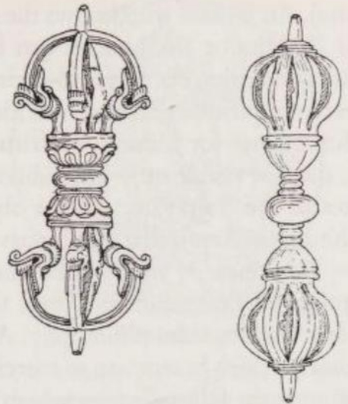
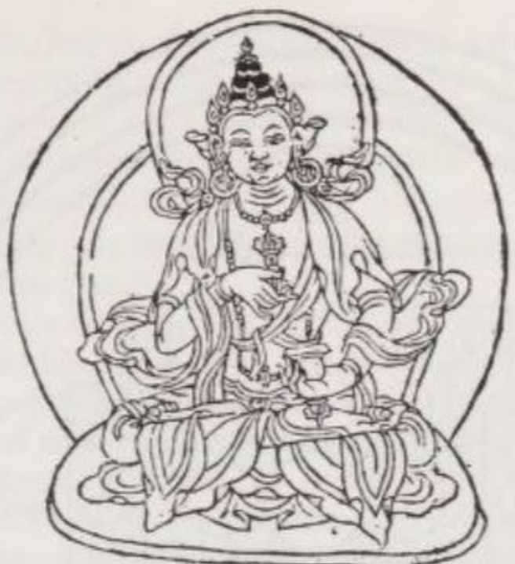
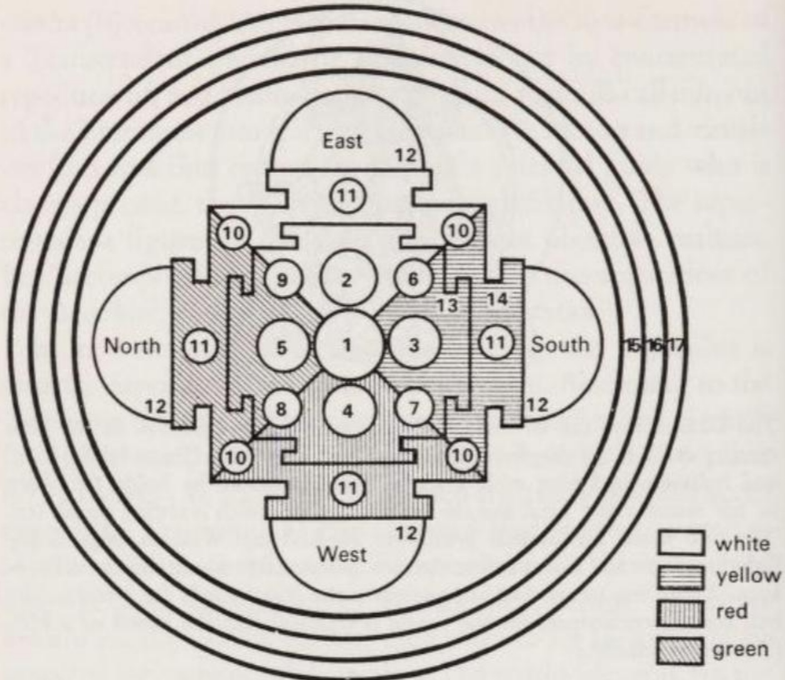
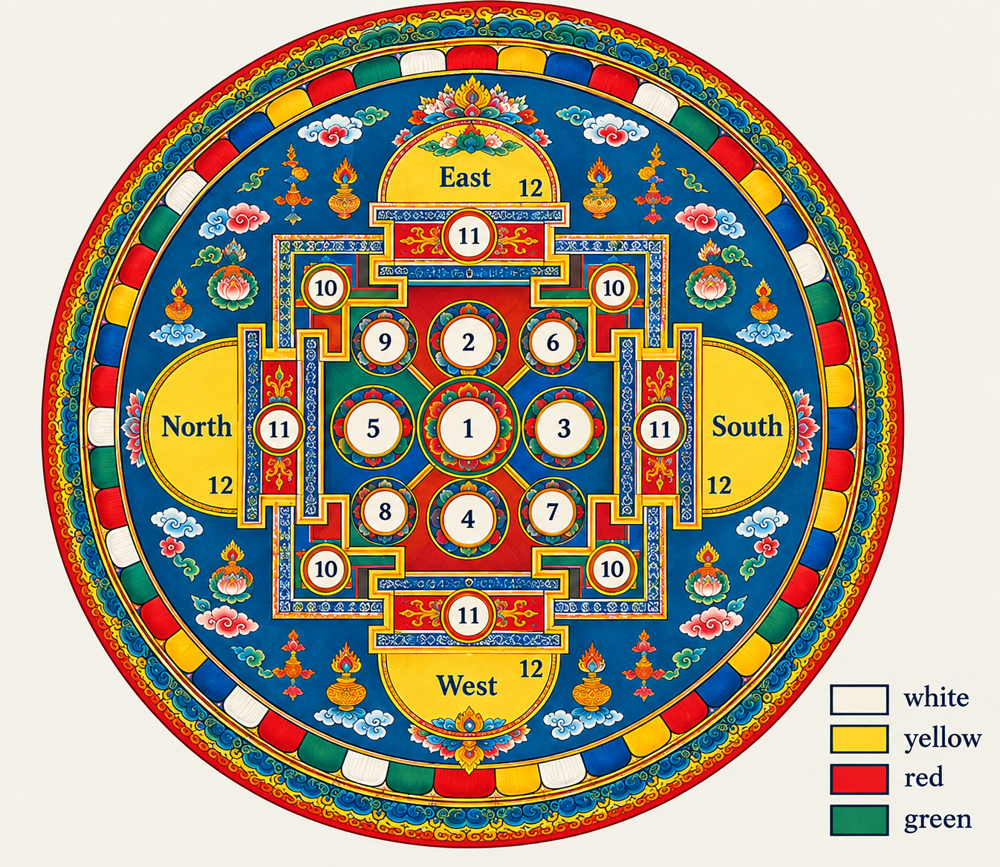

# V: MẬT TÔNG VÀ PHẬT GIÁO ĐÔNG Á

Tiểu thừa (Hīnayāna) và Đại thừa (Mahāyāna) có thể được mô tả qua các văn bản tiếng Pāli và tiếng Phạn (Sanskrit). Tuy nhiên, các tông phái Phật giáo khác thì không như vậy. Để nghiên cứu chúng, ta cần biết tiếng Tây Tạng và tiếng Trung Quốc, điều này vượt quá thẩm quyền của ngành Ấn Độ học (Indology). Do đó, trong phần này, chúng chỉ được phác thảo dựa trên các tài liệu thứ cấp và được trình bày dưới dạng lý tưởng hóa.

Mật tông (Tantrayāna - *Cỗ xe của các văn bản Tantra*) là một hình thức Phật giáo mang tính huyền bí (occult Buddhism). Phái này xuất hiện vào thế kỷ thứ 2 sau Công nguyên, bắt đầu có các văn bản ghi chép từ thế kỷ thứ 6 trở đi, và đến thế kỷ thứ 8 thì chính thức được đưa vào giảng dạy tại các trường đại học Phật giáo như một môn học. Hiện nay, chỉ còn một vài cuốn sách thiêng của tông phái này – có lẽ là những cuốn cổ nhất – còn giữ được bản gốc tiếng Phạn, phần lớn còn lại chỉ tồn tại dưới dạng các bản dịch tiếng Tây Tạng. Các tài liệu Mật tông cho đến nay vẫn chưa được khám phá nhiều. Một nguyên nhân lớn là vì chúng được viết bằng "ngôn ngữ chạng vạng" (twilight language / *sandhyā-bhāṣā* - *ngôn ngữ mang tính ẩn ngữ, mập mờ*), một kiểu ngôn ngữ nằm giữa ánh sáng và bóng tối, nửa khẳng định nửa che giấu, và sử dụng những biểu tượng rất khó hiểu.

Về mặt triết học, Mật tông được xây dựng dựa trên nền tảng của Đại thừa nhưng có sửa đổi hoặc mở rộng các giáo lý cốt lõi theo nhiều cách:
1. Biến học thuyết Ba Thân (Three Bodies / *Trikāya*) thành học thuyết Bốn Thân bằng cách giả định thêm một thân nữa vượt lên trên cả Pháp thân (Dharmakāya).
2. Chia các Thân khác, cũng như khái niệm Tính Không (Emptiness / *Śūnyatā*), thành các nhóm nhỏ hoặc các khía cạnh khác nhau.
3. Đưa ra rất nhiều thuật ngữ tâm lý học mới. Những từ này gần như không thể dịch sang bất kỳ ngôn ngữ phương Tây nào, bởi vì để hiểu chúng, người ta buộc phải có kinh nghiệm thiền định và phải tư duy theo những hệ quy chiếu hoàn toàn khác với cách tư duy thông thường của người phương Tây.

Trong Mật tông, cần phân biệt rõ bốn trường phái hoặc bốn phương pháp giải thoát: Chân ngôn tông (Mantrayāna), Kim cương thừa (Vajrayāna), Câu sinh thừa (Sahajayāna), và Thời luân thừa (Kālacakrayāna). Bốn trường phái này tạo thành sự phân chia theo *chiều dọc* của Mật tông. Đồng thời, theo *chiều ngang*, chúng lại được chia thành bốn cấp độ chứng ngộ.

*(Ghi chú: sự phân chia *chiều dọc*/ *chiều ngang* của Schumann)*
```
          	Mantrayāna	Vajrayāna	Sahajayāna	Kālacakrayāna
Chứng ngộ 1				
Chứng ngộ 2				
Chứng ngộ 3				
Chứng ngộ 4				

```

**(1) Chân ngôn tông (Mantrayāna)**, cũng giống như mọi trường phái Mật tông khác, đều dựa trên nền tảng nhất nguyên luận (monism - *triết lý cho rằng mọi thứ thực chất chỉ là Một*) của Đại thừa. Tuy nhiên, ta cần phải phân biệt rõ giữa Chân ngôn tông cổ điển và Chân ngôn tông bình dân.

Chân ngôn tông bình dân diễn giải rằng: vì bản chất của mọi chúng sinh đều đồng nhất với Cái Tuyệt Đối (the Absolute), nên vũ trụ này có sự liên kết chặt chẽ với nhau — không có chuyện gì xảy ra mà lại không tác động đến những thứ khác. Sai lầm của quan niệm này nằm ở chỗ: họ nhầm lẫn rằng 'sự liên kết chặt chẽ với nhau' này chỉ tồn tại ở tầng mức bản thể (the essential/ tầng 1) **lại cũng** hiện diện ở tầng mức thế giới ảo ảnh (the illusory, tầng 1). Điều này dẫn đến các ma thuật. Người ta cho rằng vì vạn vật liên kết với nhau, nên ta có thể tạo ra bất kỳ kết quả nào mong muốn thông qua các câu thần chú (mantras - *chân ngôn*). Những người tu Mật tông hiểu biết đều bác bỏ cách diễn giải này.

Nếu hiểu cho đúng, chân ngôn (mantras) là những âm tiết hoặc những câu nói — thường là không có ý nghĩa cụ thể — được một vị đạo sư (guru) truyền lại trong một buổi điểm đạo bí mật cho đệ tử sau một thời gian dài chuẩn bị. Chân ngôn đóng vai trò như một chiếc chìa khóa giúp hành giả (sādhaka / adept) tự mở ra cánh cửa tiến vào Cái Tuyệt Đối, và từ đó đạt được sự giải thoát. Chân ngôn không hề tạo ra phép màu nào ra thế giới bên ngoài. Chúng giống như một liều thuốc tâm lý tác động vào bên trong, dẫn dắt hành giả tự trải nghiệm trạng thái giải thoát vốn có sẵn ở bản thể của mình.
Tất nhiên, chân ngôn chỉ phát huy tác dụng khi đi kèm với sự tập trung, một thái độ tinh thần đúng đắn và tính kỷ luật tự giác. Bởi vì bản thân chân ngôn không thể xóa bỏ được những hành động trong quá khứ (Karman/Nghiệp) đang cản trở con đường đi đến cái nhìn thấu suốt để giải thoát. Chân ngôn hoàn toàn không phải là những câu thần chú ma thuật để cầu xin phép màu cứu rỗi.

Công cụ thứ hai của Chân ngôn tông là các cử chỉ nghi lễ của bàn tay và ngón tay (mudrā - *ấn quyết*). Những cử chỉ này giúp khuếch đại sức mạnh của chân ngôn. Lý do là vì: giống như mọi cảm xúc đều biểu hiện ra ngoài thành một phản ứng cụ thể của cơ thể, thì theo chiều ngược lại, việc chủ động tạo ra một tư thế cơ thể hoặc tư thế tay nhất định cũng có thể tạo ra trạng thái tâm lý tương ứng.



*Hai loại chày kim cương của Tây Tạng (Tây Tạng: dorje), lần lượt có bốn và tám ngạnh bên ngoài, cộng thêm phần trục giữa. Quả cầu dẹt ở trung tâm tượng trưng cho Tính Không (Emptiness). Loại bốn ngạnh phổ biến hơn, tượng trưng cho Năm Vị Phật Siêu Việt (được biểu thị bằng bốn ngạnh và phần trục) vươn lên từ Tính Không xuyên qua hoa sen (= sự thanh khiết) và hội tụ tại đỉnh. Khi nhìn từ trên xuống, chày kim cương tạo thành một mạn-đà-la (maṇḍala - vòng tròn không gian thiêng).*

*Tính biểu tượng của loại tám ngạnh cũng tương tự, nhưng được mô phỏng theo một mạn-đà-la khác, đó là mạn-đà-la của Chín Vị Phật Siêu Việt. Nằm giữa quả cầu ở trung tâm và các bông hoa sen (trên mẫu vật được vẽ ở đây) là ba phần phình ra, tượng trưng cho ba cõi thế giới được sinh ra từ Tính Không.*

**(2) Kim cương thừa (Vajrayāna)** (có khi dịch là 'kim cang thừa') lấy tên từ biểu tượng phổ biến nhất trong Mật tông: *vajra* (tiếng Tây Tạng: Dorje - *chày kim cương*). Ban đầu, đây là tên gọi vương trượng sấm sét của thần mưa bão Indra trong kinh Vệ Đà. Tuy nhiên, các văn bản Đại thừa hiểu *vajra* là một loại vật chất siêu nhiên, cứng như kim cương, trong suốt như không gian trống rỗng và không thể bị phá hủy.
Kim cương thừa dùng từ này để chỉ ba điều:

- (i) Sự giác ngộ: trạng thái mà con người thấu hiểu được Tính Không (= Phật tính) của chính mình.
- (ii) Bản thân Tính Không Tuyệt Đối: thứ cũng không thể lay chuyển, không thể chia cắt, không thể xuyên thủng, không thể đốt cháy và không thể phá hủy.
- (iii) Tên của chiếc vương trượng nghi lễ của các tu sĩ Kim cương thừa: thứ vũ khí được ví như tia sét của thần Indra, dùng để phá tan bóng tối (của sự vô minh).

Phương pháp giải thoát của Kim cương thừa xuất phát từ một niềm tin: đối với mỗi chúng sinh, thế giới hiện tượng được hiển lộ từ Tuyệt đối như từ một “hạt giống” (bīja). Chính vì sự thiếu hiểu biết, con người tưởng tượng ra rằng có hai thứ tách biệt — thế giới hiện tượng và sự giải thoát — trong khi thực tại chỉ có Một, đó là Cái Tuyệt Đối.

Mặc dù cốt lõi của mọi chúng sinh đều đồng nhất với Cái Tuyệt Đối, mỗi người vẫn mang một bản tính cá nhân riêng biệt, có thể được biểu đạt qua một câu thần chú hạt giống bí mật (bījamantra - *chủng tử tự*). Một người đã được điểm đạo, nếu biết được câu thần chú hạt giống của một vị Phật hay Bồ Tát Siêu Việt, có thể tập trung tụng niệm và thiền định về câu chú đó để gọi ngài từ Tính Không bước vào sự tồn tại mang tính tâm linh. Hành giả sẽ hình dung và quán tưởng ra vị Phật/Bồ Tát đó, từ đó tự tạo ra cho mình một vị đạo sư tâm linh luôn luôn hiện diện, dù chỉ có thể nhìn thấy trong thiền định.
*(Ghi chú: Các hình tượng siêu việt trong Kim cương thừa không phải là những thực thể có thật ở bên ngoài khách quan. Chúng là những "sự thành tựu" (sādhana - sự kết tinh từ quá trình tu tập), tức là những ảo ảnh chủ quan do tâm trí tạo ra để đại diện cho Cái Tuyệt Đối = Tính Không = chày kim cương = sự giải thoát.)*

Trong cách nhìn về các thực thể Siêu Việt, Kim cương thừa chịu ảnh hưởng trực tiếp từ triết học Duy thức tông (Yogācāra). Theo Duy thức tông, cái thế giới đang bủa vây con người một cách tàn nhẫn thực chất chỉ là một sản phẩm do tâm trí con người tạo ra, giống hệt như cách họ tin rằng mình đang "nhìn thấy" những người xung quanh. Từ tư tưởng này, Kim cương thừa tiến thêm một bước nhỏ: coi các vị Phật và Bồ Tát Siêu Việt cũng chỉ là những hình ảnh do tâm trí tạo ra (ideations - *sự ý niệm hóa*).
Chỉ có một điểm khác biệt giữa việc tâm trí tạo ra thế giới và việc tâm trí tạo ra các vị Phật Siêu Việt. Các vị Phật không dễ dàng nhìn thấy được, mà ta phải rèn luyện qua thực hành tâm linh mới có khả năng nhìn thấy các ngài. Ngược lại, thế giới do tâm trí tạo ra là hậu quả của những hành động trong quá khứ (nghiệp cũ), và nó tự động ép buộc tất cả mọi người phải nhìn thấy.

Đối với người phương Tây, những tư tưởng này không dễ tiếp thu vì họ có thói quen chỉ coi những gì có thể chứng minh khách quan mới là thật. Họ sẽ gạt bỏ đi, coi đó chỉ là ảo tưởng nếu một thực thể chỉ tồn tại mang tính chủ quan và chỉ hiển hiện với người tạo ra nó (chỉ hiện ra riêng cho người đó). Tuy nhiên, người tu theo Kim cương thừa lại nghĩ khác. Đối với họ, thực tại là bất cứ thứ gì mang lại "hiệu quả" hay "tác động", dù là tác động vào bên trong tâm trí hay ra bên ngoài, tác động cho một người hay nhiều người.
Đối với người tu theo giáo phái này, vị Phật Siêu Việt do mình quán tưởng ra cũng chân thực y như một vị bác sĩ đối với bệnh nhân vậy, và vị Phật ấy thực hiện chức năng chữa lành tương tự nhưng ở một tầm mức cao hơn. Nguồn gốc của những lời chỉ dẫn giải thoát đến từ đâu có quan trọng gì, dù là từ một đạo sư bằng xương bằng thịt hay từ một vị Bồ Tát Siêu Việt do tâm trí tạo ra? Ngược lại, vị Bồ Tát đó còn hiện thân cho Cái Tuyệt Đối một cách thuần khiết hơn nhiều so với một người thầy trần tục vẫn còn bị ràng buộc bởi những yếu tố ngẫu nhiên của vòng luân hồi (saṃsāra). Do đó, lời chỉ dẫn của Bồ Tát mang một mức độ chân lý cao hơn, hay nói đúng hơn, đó là chân lý tuyệt đối.



*Pháp thân (Dharmakāya) có thể được hình dung dưới dạng vô nhân xưng hoặc có nhân xưng. Vào thế kỷ thứ 10, các hành giả Kim cương thừa đã đưa ra khái niệm 'Phật Bản Sơ' (Primeval Buddha) và cá nhân hóa ngài bằng một cái tên. Dưới hình tướng Vajrasattva (Kim Cương Tát Đỏa), ngài cầm chày Kim cương ở tay phải giơ lên cao và cầm chuông ở tay trái đặt trên đùi. Hai pháp khí này lần lượt tượng trưng cho Phương tiện và Trí tuệ, hay Giác ngộ và Từ bi — hai điều kiện không thể thiếu để đạt được sự giải thoát. Theo một cách giải thích khác, chày Kim cương đại diện cho sự vĩnh cửu, còn tiếng chuông đại diện cho tính biến hoại (vô thường), vì thế gian này mỏng manh chóng vánh như âm thanh của một tiếng chuông. (Tranh khắc gỗ Tây Tạng.)*

Tất nhiên, hành giả và vị Phật hay Bồ Tát Siêu Việt do người đó tạo ra không đối diện với nhau như những kẻ xa lạ. Nhận thức được rằng vị Phật hoàn hảo kia chính là một "sự thành tựu" do tâm trí mình tạo ra và do đó là một phần của chính mình, hành giả thực hiện quá trình "tạo lập hòa vào" (I-making / *ahaṅkāra*), hay còn gọi là "sự đồng nhất". Người đó trải nghiệm sự hòa nhập với vị Phật một cách sống động đến mức dung nạp luôn các phẩm chất của vị Phật ấy vào mình. Nhờ vậy, sự đồng nhất với Cái Tuyệt Đối — thứ chưa bao giờ thực sự bị đứt đoạn — một lần nữa sống lại trong tâm thức cốt lõi của hành giả.
Trong nghệ thuật Kim cương thừa, Cái Tuyệt Đối và thế giới hiện tượng được biểu tượng hóa bằng hình ảnh nam và nữ. Hình ảnh một cặp nam nữ trong tư thế giao hoan đại diện cho sự Hợp nhất Huyền bí (Unio Mystica), qua đó hành giả trải nghiệm sự đồng nhất của vạn vật.

<div style="display: flex; overflow-x: auto; white-space: nowrap; gap: 10px; padding-bottom: 10px;">
  
  
</div>

*Mạn-đà-la đóng vai trò như công cụ hỗ trợ thiền định và có hai ý nghĩa: (a) là bản đồ cấu trúc của thế giới tâm linh và (b) là bức tranh mô tả con đường tiến tới sự giải thoát của Đại thừa.*

*Ở Ấn Độ, ý nghĩa (a) chiếm ưu thế. Đó là lý do tại sao — theo quan điểm của các nhà địa lý bản địa — hướng Đông được đặt ở trên cùng của mạn-đà-la: người xem đang quay mặt về phía mặt trời mọc. Trái lại, nhiều nghệ nhân vẽ mạn-đà-la ở Tây Tạng lại coi trọng ý nghĩa (b) hơn; họ đặt hướng Đông ở dưới cùng: Trên con đường tìm kiếm sự giải thoát, tín đồ đi theo quỹ đạo của mặt trời.*

*Các thực thể xuất hiện trong mạn-đà-la có thể được vẽ ra chi tiết, hoặc chỉ được biểu thị bằng các biểu tượng, hoặc các âm tiết hạt giống của họ. Trong số hàng trăm mạn-đà-la khác nhau, mạn-đà-la Kim cương giới (vajradhātumaṇḍala) đã được chọn ở đây (dưới dạng đơn giản hóa) để giải thích các nguyên lý cơ bản.*

*(a) Ở trung tâm thế giới là hiện thân của Pháp thân: Phật Bản Sơ (1), trong ví dụ này là Vajrasattva. Từ ngài, bốn cõi tịnh độ (paradises), được phân biệt bằng màu sắc, mở rộng ra bốn hướng. Cõi Tịnh độ phương Đông (màu trắng) do vị Phật Siêu Việt Akṣobhya (A Súc Bệ) (2) cai quản, Tịnh độ phương Nam (màu vàng) do Ratnasambhava (Bảo Sinh) (3) cai quản, Tịnh độ phương Tây 'Sukhāvatī' (Cực Lạc - màu đỏ) do Amitābha (A Di Đà) (4) cai quản, và Tịnh độ phương Bắc (màu xanh lá) do Amoghasiddhi (Bất Không Thành Tựu) (5) cai quản. Bên cạnh các vị Phật này là các Bồ Tát Siêu Việt được phân công hỗ trợ họ, cụ thể là Vajrapāṇi (Kim Cương Thủ) (6), Ratnapāṇi (Bảo Thủ) (7), Avalokiteśvara (Quán Thế Âm) (8), và Viśvapāṇi (Phổ Hiền) (9). Tất cả các thực thể này – trên các bức tranh cuộn Tây Tạng thường được bao quanh bởi "gia quyến" huyền bí của họ – sống trong khu vực thánh địa được giới hạn bởi đường viền bên trong (13), mô phỏng theo sơ đồ mặt bằng của một ngôi đền. Bên ngoài thánh địa, trong khu vực 'cung điện' (14) là nơi cư ngụ của các vị Phật trần thế (Human Buddhas) (10) và các vị thần hộ pháp (11). Các vị hộ pháp này thường là những vị thần trong tín ngưỡng dân gian được đưa vào Phật giáo.*

*(b) Khi đóng vai trò mô tả con đường giải thoát, mạn-đà-la phải được 'đọc' từ ngoài rìa vào trung tâm.*

*Bị thu hút bởi giọng nói của một vị Phật trần thế (10) vang ra từ cung điện, mở ra con đường giải thoát, người tìm đạo trước tiên phải vượt qua vòng lửa (17) tượng trưng cho sự thanh tẩy, rồi đến vòng Kim cương (16) tượng trưng cho sự điểm đạo. Sự tái sinh tâm linh của người đó được biểu thị bằng vòng hoa sen (15).*

*Lúc này, người đó bước đến trước một trong những cổng vòm (12), nơi họ phải giải trình về lối sống của mình với một vị hộ pháp (11). Nếu vẫn còn sót lại những nghiệp chướng (Karman) cản bước, Bồ Tát (6-9) sẽ gỡ bỏ gánh nặng đó cho họ. Tiếp theo, vị Phật Siêu Việt (2-5) sẽ chào đón họ vào cõi tịnh độ của mình. Không còn bị ảnh hưởng bởi những nhiễu nhương trần thế, người tìm đạo ở đây sẽ trưởng thành để đạt tới sự giác ngộ, trí tuệ và nhận thức được Cái Tuyệt Đối. Thông qua sự hợp nhất huyền bí (unio mystica) với Phật Bản Sơ (1), cuối cùng họ đạt được Niết bàn.*

Sự phong phú của các thực thể siêu việt trong Kim cương thừa có thể đã trở nên hỗn loạn nếu các vị Phật và Bồ Tát quan trọng nhất không được chuẩn hóa và đưa vào một hệ thống bài bản. Vào thế kỷ 3-4, hệ thống Năm Vị Phật Siêu Việt đã được tạo ra. Tùy thuộc vào sở thích của từng tông phái, một trong năm vị Phật này sẽ được tôn lên vị trí cao nhất, được coi là hiện thân của Pháp thân (= Kim cương = Cái Tuyệt Đối), và được đặt ở trung tâm của mạn-đà-la. Đôi khi vị đó là Akṣobhya (A Súc Bệ), thường xuyên hơn là Vairocana (Đại Nhật), nhưng phổ biến nhất là Vajrasattva (Kim Cương Tát Đỏa - *Bản tính là Kim cương*) hoặc Vajradhara (Kim Cương Trì - *Người cầm chày Kim cương*) được đặt ở vị trí tối cao. Trong trường hợp này, ngài sẽ thay thế vị trí của Vairocana.
Từ thế kỷ thứ 10 trở đi, danh xưng 'Phật Bản Sơ' (Primeval Buddha / *ādi-buddha*) trở thành thuật ngữ quen thuộc để chỉ Pháp thân được cá nhân hóa. Khái niệm về Phật Bản Sơ được cho là bắt nguồn từ trường đại học Phật giáo Nālandā, rất có thể được mô phỏng theo thuyết độc thần của Hồi giáo.

Một khi hệ thống phân cấp các vị trợ giúp giải thoát siêu việt đã được thiết lập, việc vẽ ra mối quan hệ giữa họ chỉ là hệ quả tất yếu. Các tu sĩ kiêm họa sĩ bắt đầu thiết kế các mạn-đà-la (maṇḍala - nghĩa đen là 'vòng tròn'): đây là những bản đồ của thế giới siêu việt, trong đó các vị Phật, Bồ Tát và các vị thần phụ tá được phân bổ vào bốn phương hướng chính của la bàn cùng với các cõi tịnh độ tương ứng của họ. Đương nhiên, Phật Bản Sơ, với tư cách là hiện thân của Cái Tuyệt Đối, sẽ ngự ở vị trí trung tâm. Mạn-đà-la đóng vai trò là công cụ hỗ trợ thiền định, đặc biệt phổ biến trong các tu viện ở Tây Tạng.

**(3) Câu sinh thừa (Sahajayāna)**, dường như phát triển vào thế kỷ thứ 8, có khá nhiều điểm tương đồng với Thiền tông (Zen-Buddhism) – một tông phái tình cờ cũng có những người theo học tại Tây Tạng vào cùng thế kỷ đó. Văn bản quan trọng nhất của trường phái này là *Dohākośa* (Đạo ca) của Saraha(pāda) (thế kỷ 8/9). Đây là một tuyển tập gồm 280 khổ thơ hiện còn được lưu giữ bằng tiếng Tây Tạng và một phần (không trọn vẹn) bằng tiếng Apabhraṃśa. Phần tóm lược dưới đây được dựa trên một bản dịch của tuyển tập này [31](/giaolyvatongphai/notes#31){.note}.

Saraha cất cao tiếng hát rằng: Chân ngôn, văn bản Tantra, thiền định hay sự tập trung, rốt cuộc chỉ dẫn đến sự tự lừa dối bản thân (23); mọi trường phái tư tưởng chỉ gây thêm sự hoang mang (35). Dù có chuyên tâm thực hành Tính Không (70), hay bám víu vào khái niệm này (75), hay từ bỏ thế gian (10-16), thì cũng chẳng đi đến đâu. Giải thoát là điều hoàn toàn có thể đạt được ngay cả khi đã lập gia đình và làm người chủ hộ (19), bởi vì chính cơ thể ta đã là một ngôi đền linh thiêng (48). Đức Phật (68) và Đấng Tối Cao đều nằm ngay bên trong chính mình (60). Vậy thì cớ sao phải chối bỏ những thú vui nhục dục? Miễn là ta không bị mắc kẹt vào sự dính mắc với các giác quan (71), thì chúng chẳng hề cản trở con đường giải thoát (19;24). Một hành giả (yogin) thấu hiểu gốc rễ của vạn vật vẫn có thể tận hưởng thế giới vật chất, nhưng không bao giờ trở thành nô lệ của nó (64).

Tuy nhiên, ta không thể tìm thấy con đường đúng đắn nếu thiếu đi sự chỉ dẫn. Chỉ khi ngồi dưới chân một vị đạo sư (guru), ta mới có thể đạt được sự hiểu biết về Cái Tuyệt Đối (17). Vì vậy, phải đặt trọn niềm tin vào lời dạy của ngài (33).

Thật sai lầm khi coi sự tồn tại đầy đau khổ và sự giải thoát là hai thứ khác biệt về bản chất. Luân hồi (Saṃsāra) và Niết bàn (Nirvāṇa) thực chất là một (102). Chúng là *sahaja*, tức là ‘sinh ra cùng nhau’ (twinned - *cặp bài trùng*), và chúng không tồn tại song song bên cạnh nhau, mà tồn tại lồng vào nhau. Không hẳn là chính nó nhưng cũng không hẳn là một thứ gì khác, Cặp Bài Trùng này không tồn tại nhưng cũng không phải là không tồn tại (20). Mọi sự khác biệt trên đời đều là do tư duy vẽ vời ra (thought-constructions) (37); trong thực tại, Pháp (Dharma) cũng giống hệt như Phi Pháp (Non-Dharma) (3), bởi vì vạn vật quy về một (26); mọi thứ đều là Phật (106).

Xét về mặt đạo đức hình thức, con đường giải thoát của Câu sinh thừa mang đặc trưng của sự tự do, không gò bó. Hành giả phải cống hiến hết mình vì lợi ích của người khác (112) và nuôi dưỡng lòng từ bi đối với muôn loài (107-110). Người đó phải tránh xa những cuộc tranh luận vô bổ (55), bởi vì chỉ khi nào thoát khỏi sự trói buộc của ngôn từ, ta mới thực sự hiểu được ngôn từ (88). Ở những khía cạnh khác, hành giả có thể sống theo ý mình thích (55); để đạt được sự giải thoát, không cần thiết phải tuân theo các kỷ luật khuôn phép bên ngoài. Cái bản thể cốt lõi khiến con người sinh ra, sống và chết đi, cũng chính là thứ dẫn dắt ta đến với niềm hỷ lạc tột cùng (21). Sự giải thoát được nhận ra trong chính trải nghiệm của bản thân (76).

Tuy nhiên, Câu sinh thừa đòi hỏi sự nỗ lực rất lớn trong kỷ luật nội tâm. Kỷ luật này dựa trên sự thấu hiểu rằng: mọi sự khác biệt trên đời đều xuất phát từ tư duy, chúng chỉ là những hình thái của suy nghĩ (37). Về bản chất, tư duy vốn thuần khiết (23), nhưng do tác động của các hành động trong quá khứ (nghiệp/karmic effects), tư duy đã tự vẽ ra một thế giới mang đậm bản chất của chính người tạo ra nó (72). Sự giải phóng tư duy và việc chứng ngộ Niết bàn nằm ở chỗ thoát khỏi Nghiệp (Karman) (40).

Kỷ luật nội tâm của Câu sinh thừa có thể được tóm gọn trong một câu: hãy thấu hiểu tâm trí, hãy thấu hiểu suy nghĩ của chính mình (32). Mọi sự đa dạng trên đời (37), dù là Luân hồi hay Niết bàn, đều nảy sinh từ tâm trí (41). Chỉ những ai nhận ra được tính chất "cùng sinh ra" (*sahaja* của Luân hồi và Niết bàn) mới có thể nắm bắt được chân lý tuyệt đối (13). Hành giả phải giữ vững nhận thức về tính chất "cùng sinh ra" này (44), và coi mọi thứ (về bản chất) đều giống nhau (75). Thế giới này đang bị suy nghĩ biến thành nô lệ (78); chỉ khi nào tâm trí không còn là tâm trí nữa, thì bản chất thực sự của sự Cùng-Sinh-Ra mới tỏa sáng (77; 83). Ta phải từ bỏ suy nghĩ và hướng đến sự đồng nhất (55). Hành giả phải thoát khỏi những suy nghĩ miên man và trở nên thanh thuần như một đứa trẻ (57). Khi đã đạt được sự giác ngộ, thì hỏi đâu là Luân hồi, đâu là Niết bàn? (103; 27). Các giác quan của một Bậc Giải Thoát đã dừng hoạt động, khái niệm về một cái 'Tôi' của ngài đã bị phá hủy (29). Tâm trí được giải thoát là tâm trí tĩnh lặng (43); với một tâm trí không xao động, ta sẽ thoát khỏi những nhọc nhằn của sự tồn tại (59).

Giống như các trường phái Mật tông khác, Câu sinh thừa biểu tượng hóa hai điều kiện tiên quyết để giải thoát là Trí tuệ và Phương pháp thông qua hình ảnh chày kim cương (nam) và hoa sen (nữ). Trong sự hợp nhất của cả hai chứa đựng niềm hỷ lạc (94-95). Nam hành giả (yogin) và nữ hành giả (yoginī) phải hợp nhất với nhau, nhưng chỉ người nào thấu hiểu rằng vạn vật đều cùng chung bản tính với chính mình thì mới có thể đạt được niềm hỷ lạc vĩ đại trong khoảnh khắc giao hoan (91).

**(4) Thời luân thừa (Kālacakrayāna)**, một trường phái cho đến nay vẫn chưa được nghiên cứu nhiều, ra đời vào thế kỷ thứ 10. Đây vốn là một hệ thống chiêm tinh học mà các yếu tố của nó đã được nâng tầm thành một tôn giáo. Con người được quan niệm là một bản sao thu nhỏ của vũ trụ; các chức năng thể chất và tinh thần của con người vận hành song song với các tiến trình của vũ trụ. Sự hiểu biết về những mối liên hệ nội tại bí mật giữa con người và vũ trụ sẽ dẫn dắt người được điểm đạo đi đến sự giải thoát.

Từ Kālacakra, nghĩa là 'Bánh xe thời gian', dường như ban đầu được dùng để chỉ vòng cung hoàng đạo. Tuy nhiên, Thời luân thừa lại hiểu thuật ngữ này là danh xưng của vị Phật Bản Sơ — người giám sát tiến trình vận mệnh của cả đất và trời. Vị Phật Bản Sơ Kālacakra là trung tâm tâm linh của hệ thống này và là trục quay của vô số mạn-đà-la. Bằng cách hợp nhất huyền bí với ngài, tín đồ sẽ được tiết lộ mọi kiến thức cần thiết để đạt tới đích đến cuối cùng.

Xuyên suốt bốn trường phái của Mật tông là sự phân chia theo chiều ngang thành bốn cấp độ chứng ngộ:
1. Thấp nhất là **Kriyātantra (Sở tác tantra - 'thực hành nghi lễ')**: dành cho những người coi các nghi thức cúng tế là yếu tố quyết định.
2. Cao hơn là **Caryātantra (Hành động tantra - 'thực hành lối sống')**: dành cho những người điều chỉnh cuộc sống hàng ngày theo quy tắc của Mật tông, nhưng chỉ hiểu lờ mờ về ý nghĩa sâu xa của nó.
3. Tiếp theo là **Yogatantra (Du-già tantra - 'thực hành nỗ lực tâm trí')**: ở cấp độ này, hành giả nỗ lực hướng tới các nội dung tâm linh cốt lõi của văn bản Tantra.
4. Đỉnh cao của hệ thống là **Anuttarayogatantra (Vô thượng du-già tantra - 'thực hành sự hợp nhất tối cao')**: Hành giả thấu hiểu toàn bộ ý nghĩa của Mật tông và tự mình trải nghiệm Cái Tuyệt Đối.

Các văn bản Tây Tạng so sánh bốn giai đoạn này với quá trình tán tỉnh giữa nam và nữ. Bắt đầu bằng những ánh mắt đong đưa, tiếp đến là nụ cười, nắm tay và cuối cùng là hành vi ân ái trọn vẹn. Phép so sánh này càng đưa thêm nhiều biểu tượng tính dục vào trong Mật tông.

Sự lan rộng của Mật tông vào thế kỷ thứ 6 và thứ 7 diễn ra cùng lúc với sự suy tàn của Phật giáo tại Ấn Độ. Từ thế kỷ 11 trở đi, Phật giáo Ấn Độ sống thoi thóp trong bóng tối; và đến thế kỷ 13, nó gần như tuyệt diệt ngay trên chính quê hương của mình. Sự lụi tàn này đến từ cả nguyên nhân chủ quan lẫn khách quan.

Về mặt nội bộ, mặc dù Mật tông ấp ủ những lý tưởng rất cao đẹp, nhưng nhiều người cảm thấy ác cảm trước những hành vi thái quá thường xuyên của các tín đồ phái này, cũng như hệ thống biểu tượng sử dụng nhiều hình ảnh so sánh mang tính dục. Coi Mật tông là một tôn giáo suy đồi, người ta dần chuyển sự ác cảm đó sang cả Tiểu thừa và Đại thừa.
Đến thế kỷ thứ 9, Ấn Độ giáo (Hinduism) đã tung ra một cuộc phản công. Các tư tưởng của Phật giáo bị cố tình sáp nhập vào Ấn Độ giáo, và nhân vật Phật lịch sử bị tuyên bố chỉ là một hóa thân của thần Viṣṇu. Những gì từng làm nên sức hút của Phật giáo giờ đây cũng có thể dễ dàng tìm thấy ở Ấn Độ giáo.

Nhát dao chí mạng kết liễu Phật giáo Ấn Độ đến từ Hồi giáo. Vì giáo lý của Thích Ca Mâu Ni phụ thuộc nhiều vào chế độ tu viện và giới tu sĩ, nó không thể sống sót qua cuộc tàn phá bạo lực nhắm vào các tịnh xá (vihāras) cùng các thư viện tại Ấn Độ, cũng như cuộc thảm sát hàng ngàn tu sĩ quy hàng không vũ trang trong khoảng thời gian từ năm 712 đến 1250. Số phận của Phật giáo chính thức bị định đoạt cùng với sự sụp đổ của vương triều Pāla ở Bengal, khi nó mất đi nguồn bảo trợ cuối cùng từ hoàng gia.
Trong số 570 triệu người dân Ấn Độ (vào thời điểm tác giả viết sách), chỉ có một số lượng nhỏ khoảng bốn triệu người là tín đồ của Phật giáo. Phần lớn trong số họ là những người từng thuộc tầng lớp bần cùng (Harijans) ở các bang Mahārāshtra và Madhya Pradesh, được nhà cải cách xã hội - Tiến sĩ B. R. Ambedkar (1893–1956) cùng phong trào của ông thu hút về với đạo Phật. Phần còn lại là những người theo Đại thừa và Mật tông ở các vùng núi Himālaya thuộc Ấn Độ, nơi chịu ảnh hưởng của văn hóa Tây Tạng. Ngày nay, một người muốn nghiên cứu Phật giáo Nguyên thủy (Theravāda) chính thống buộc phải đến Sri Lanka (Ceylon) và Đông Nam Á.

Trong số các biến thể của Phật giáo ở Đông Á, có hai trường phái đặc biệt đáng chú ý:
Thứ nhất là **Phật giáo A Di Đà (Amida Buddhism / Skt. Amitābha)** — bắt rễ tại Trung Quốc từ thế kỷ thứ 4 — giảng dạy con đường giải thoát nhờ ân sủng của Phật A Di Đà. Trường phái này được củng cố thành một tông phái rõ ràng nhờ các vị thiền sư Nhật Bản là Honen-Shonin (Pháp Nhiên Thượng Nhân, 1133–1212) và Shinran-Shonin (Thân Loan Thượng Nhân, 1173–1262).
Thứ hai là **Thiền tông (Zen trong tiếng Nhật; Ch'an trong tiếng Trung; Thien trong tiếng Việt)**. Thiền tông dựa trên các giáo lý của Duy thức tông (Yogācāra), nhưng diễn giải chúng theo hướng huyền bí và kết hợp thêm các tư tưởng của Đạo giáo (Taoist ideas). Thiền tông được nhà sư người Ấn Độ Bồ Đề Đạt Ma (Bodhidharma) sáng lập tại Trung Quốc vào khoảng năm 520 và trải qua thời kỳ hoàng kim từ thế kỷ thứ 8 đến thế kỷ 13. Vào khoảng năm 1200, trường phái này cũng du nhập vào Nhật Bản.

Thiền tông quay lưng lại với chủ nghĩa sùng đạo và các phong tục tôn giáo truyền thống. Nó vứt bỏ mọi sự lý luận trí óc và mọi sự bám víu vào các giáo điều Phật giáo để làm trống rỗng tâm trí, dọn đường cho sự giác ngộ (satori trong tiếng Nhật; wu/ngộ trong tiếng Trung). Trong khoảnh khắc giác ngộ đó, con người thức tỉnh và nhìn thấu được "Phật tâm" (Buddha-heart), tức là bản chất đồng nhất của vạn vật. Mọi thứ tồn tại thực chất chỉ là Tâm (Mind-only = Phật).
Về câu hỏi liệu trải nghiệm giác ngộ này xảy ra đột ngột như một tia chớp hay chín dần từ từ như một trái cây, hai tông phái quan trọng nhất trong số năm phái Thiền tông (phái Rinzai/Lâm Tế và phái Soto/Tào Động của Nhật Bản) lại có những quan điểm khác nhau.

Để đạt được giác ngộ, Thiền tông dạy phương pháp thiền định sâu rộng (zen trong tiếng Nhật; dhyāna trong tiếng Phạn). Hơn thế nữa, phái Rinzai (Lâm Tế) còn sử dụng các công án (koans). Đây là những câu hỏi hoặc mẩu chuyện nhằm hướng người tìm đạo đến với Cái Không Thể Nói Bằng Lời (the Unspeakable).
Trong một công án, có đệ tử hỏi thiền sư Trung Quốc Hui Hai (Huệ Hải, thế kỷ 8/9) rằng: "Người ta nói Tâm chính là Phật, nhưng rốt cuộc cái nào mới thực sự là Phật?". Vị thiền sư đáp: "Thế con nghĩ cái gì không phải là Phật? Chỉ ra cho ta xem!". Vì người đệ tử chưa đủ tu tập Thiền để trả lời câu hỏi này, vị thiền sư nói tiếp: "Nếu con thấu hiểu được (Tâm Tuyệt Đối), thì con sẽ thấy Phật hiện diện ở khắp mọi nơi; nhưng nếu con không thức tỉnh để nhận ra điều đó, con sẽ mãi lạc lối và xa rời ngài."
Truyền thống Trung-Nhật ghi nhận khoảng 1700 công án như vậy. Những công án cổ xưa nhất có thể được thấu hiểu bằng trực giác, nhưng những công án ra đời sau này thì hoàn toàn không thể hiểu nổi theo bất kỳ nghĩa logic nào. Tính phi logic của chúng thực chất là một công cụ sư phạm. Việc suy ngẫm và thiền định về những công án này sẽ làm phá vỡ và biến đổi tư duy của thiền sinh đến mức câu hỏi đó không còn làm họ bận tâm hay bị khiêu khích nữa, và khi đó, công án được xem như đã "giải" xong.

Quá trình rèn luyện Thiền tông dẫn dắt thiền sinh thoát khỏi sự vô minh, thông qua việc đặt câu hỏi về mọi thứ để đạt tới cái nhìn thấu suốt về tính "như thị" (thus-ness - *bản chất thực sự của sự vật như nó vốn là*). Giống như lời của thiền sư Ch'ing-Yüan (Thanh Nguyên, thế kỷ thứ 8):

*Trước khi tu Thiền, thấy núi là núi, thấy sông là sông. Trong khi tu Thiền, thấy núi không còn là núi, sông không còn là sông. Khi đã đạt được giác ngộ, lại thấy núi là núi, sông là sông.*

Đích đến cuối cùng của Thiền tông là một trạng thái tự nhiên ở tầm mức cao hơn, nơi con người nhận thức trọn vẹn sự đồng nhất của vạn vật.