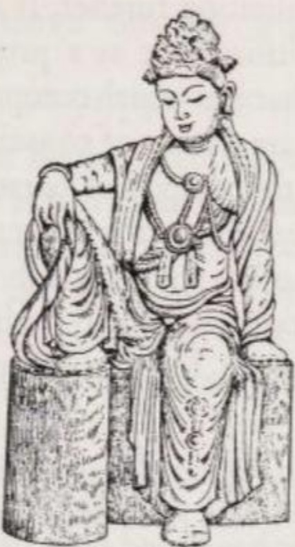

# VI. MỘT CÁI NHÌN TỔNG QUAN VỀ VĂN HÓA - LỊCH SỬ

Đức Phật không phải là một nhà tiên tri, mà là một bậc hiền triết và một người thầy, và đó cũng chính là cách ngài tự nhìn nhận về bản thân. Ở ngài không có biểu hiện nào của việc bị một thế lực siêu nhiên chiếm hữu để nói lời tiên tri, và ngài cũng chưa từng nói điều gì cho thấy ngài tin mình là người phát ngôn của một đấng tối cao. Ngài không bị ám ảnh bởi một động lực mãnh liệt nào thôi thúc phải thay đổi thế giới. Ngài chỉ coi mình như một biển báo chỉ đường dẫn đến sự giải thoát (deliverance), khơi gợi trí tuệ của con người và khuyên họ nên thuận theo các quy luật tự nhiên của sự tồn tại. Giáo lý của ngài hướng đến từng cá nhân chứ không phải một nhóm sắc tộc hay chủng tộc nào. Do đó, trái ngược với Ấn Độ giáo vốn mang tính dân tộc, đạo Phật có thể thu hút được tín đồ ở bên ngoài Ấn Độ và trở thành một tôn giáo toàn cầu.

Tuy nhiên, việc hòa mình vào vòng tuần hoàn vũ trụ không có nghĩa là chấp nhận đau khổ của cuộc đời. Ý tưởng cho rằng đau khổ là một thử thách phải trải qua hoàn toàn xa lạ với đạo Phật. Ngược lại, mục tiêu của đạo Phật là chiến thắng đau khổ. Vì đạo Phật không tin rằng có thể làm được điều này bằng cách thay đổi hoàn cảnh bên ngoài, nên nó dạy con người cách giải thoát khỏi khổ đau thông qua thái độ tinh thần đúng đắn. Giống như mọi hình thức tôn giáo khác, đạo Phật hướng nội, và con đường cứu độ của nó mang tính tâm lý.

Quan niệm này bắt nguồn từ một góc nhìn đặc thù về con người. Con người không hề xấu xa, mà chỉ bị mê muội bởi sự ích kỷ; chính sự thiếu hiểu biết (vô minh), chứ không phải sự đồi bại, đã kéo con người vào đau khổ. Con người vật lộn trong thế giới này giống như một cậu bé phải uống dầu gan cá đắng nghét. Cậu bé chịu uống chỉ vì cứ mỗi thìa dầu, mẹ cậu lại bỏ một đồng xu vào ống heo. Đến khi uống hết dầu, ống heo được mở ra và số tiền đó lại được dùng để mua một chai dầu mới! 

Khác với các tôn giáo bắt nguồn từ Trung Đông, ý tưởng về một vị thần toàn năng không có vai trò gì trong đạo Phật. Đối tượng của tư tưởng Phật giáo không phải là thần hay các vị thần (mặc dù sự tồn tại của họ được thừa nhận), mà chính là con người. Mặc dù các trường phái Phật giáo sau này tin rằng có thể có sự trợ giúp từ bên ngoài nhất định, nhưng bước cuối cùng để đạt đến sự giải phóng (liberation / giải thoát) thì mỗi người phải tự mình bước đi. Xét đến cùng, việc đạo Phật coi ai cũng có khả năng tự mình làm được điều này mang lại cho nó một khuynh hướng lạc quan.

### I

Theo lời Phật dạy, mọi thứ tồn tại đều có Ba Dấu Ấn (Three Marks / Tam Pháp Ấn): (a) sự biến hoại (impermanence / vô thường), (b) buồn (sorrowfulness / khổ), và (c) tính không có một thực thể đứng sau (non-selfness / vô ngã). Chỉ những gì không mang ba đặc điểm này mới được coi là có giá trị đích thực. Do đó, chỉ có sự giải thoát, tức là trạng thái niết-bàn - nibbāna (nghĩa đen: trạng thái dập tắt hoàn toàn đau khổ) mới là hạnh phúc thực sự.

(a) Toàn bộ vũ trụ luôn ở trong trạng thái tuôn chảy, biến đổi không ngừng. Sự diệt đi làm điều kiện cho sự sinh ra mới, sự sinh ra lại dẫn đến biến đổi và rồi lại diệt đi. Không có một sự tồn tại tĩnh tại mãi mãi, mà chỉ có quá trình đang biến đổi 'trở-thành' (becoming); không có gì "đang là", mọi thứ đều "đang diễn ra". Nếu sự tồn tại là một trạng thái cố định vĩnh viễn, thì đó không còn là sự sống.

Sự thay đổi không ngừng này được nhận thấy rõ ràng nhất trong chính tiến trình cuộc đời của mỗi người. Sinh, lão, bệnh, tử là các giai đoạn của nó. Đối với một người bám víu tham lam vào vạn vật và vào cái "Tôi" giả định của mình, sự biến hoại (vô thường) chỉ mang lại đau khổ. Tuy nhiên, một người quan sát thấu đáo sẽ nhận ra rằng chính sự biến hoại cũng mở ra con đường đi tới sự ngừng-trở-thành (dis-becoming), đi tới sự giải phóng.

(b) Từ 'Đau khổ' (suffering / dukkha - khổ) trong cách dùng của Phật giáo không chỉ chỉ sự buồn bã và nỗi đau; thuật ngữ này còn bao hàm cả việc phải hứng chịu một môi trường bất lợi, bị đe dọa bởi sự mất mát, sự chóng vánh và tính bấp bênh của những niềm vui nhất thời. Chính vì tính mỏng manh dễ vỡ mà ngay cả những cảm giác dễ chịu và niềm vui cũng mang tính chất buồn khổ. 'Đau khổ' là một thuật ngữ bao trùm, mang tính triết học, bao trùm mọi thứ chịu sự chi phối của vòng lặp sinh ra và tàn lụi (cycle of becoming and decay / luân hồi - saṃsāra); tính từ 'buồn khổ' ở đây mang nghĩa là chưa được giải thoát (unliberated).

(c) Đức Phật quan tâm đến thế giới ở khía cạnh nó được phản chiếu như thế nào trong tâm trí của người quan sát. Ngài coi thế giới chỉ là một hiện tượng bề ngoài (appearance) và không thuộc nhóm những người tin vào một "thực thể chân thật" hay một cái Tuyệt Đối (Absolute) ẩn sau nó. Cả các đối tượng được quan sát lẫn người quan sát đều không phải là một Linh Hồn (Soul) vĩnh cửu, cũng không sở hữu nó. Việc nói về một cái tôi (ego), một Linh Hồn hay một Tự Ngã (Self) đơn thuần chỉ là một quy ước ngôn ngữ chứ không hề chỉ đến một thực thể khách quan nào. Các yếu tố cấu thành nên con người và nhân cách thực nghiệm của chúng ta có thể được phân loại thành Năm Nhóm (Five Groups / Ngũ uẩn - khandha). Cái chết, tức là sự tan rã của các Nhóm này, không hề giải phóng cho bất kỳ một Linh Hồn phía sau nào.

Đó là những tiên đề triết học của Đức Phật. Các đặc điểm còn lại trong giáo lý của ngài mang bản chất tôn giáo.

Đức Phật nói tiếp, tính chất chóng vánh của sự tồn tại lẽ ra là một điều đáng mừng nếu như đau khổ thực sự chấm dứt cùng với cái chết. Nhưng thực tế không phải vậy. Sự khao khát (craving / ái) và sự thiếu hiểu biết (ignorance / vô minh) không cho phép con người bị tan biến hoàn toàn khi chết: chúng tạo ra "một lực" đi tái sinh (rebirth). Chừng nào "lực đó" còn, chưa dập tắt được những yếu tố "tạo lực" (defilements / phiền não/ ô nhiễm) này, thì còn một con người vẫn sẽ tiếp tục lang thang trong vòng Luân Hồi (Saṃsāra).

Vì đạo Phật phủ nhận sự tồn tại của Linh Hồn, nên trong trường hợp này, nói về sự luân hồi của Linh Hồn (Soul transmigration) là sai. Tuy nhiên, điều đạo Phật thực sự giảng dạy là sự tái sinh (rebirth). Hãy tưởng tượng một bàn bida với các quả bóng trên đó. Khi bạn đánh vào quả bóng đầu tiên, xung lực động học được truyền sang quả bóng thứ hai và thứ ba mà không hề có bất kỳ vật chất nào di chuyển từ quả bóng thứ nhất sang quả bóng thứ ba. Tương tự như vậy, mỗi dạng tồn tại đóng vai trò làm điều kiện cho dạng tồn tại tiếp theo, và dạng tiếp theo đó được coi là sự tái sinh của nó. Tuy nhiên, không có một Linh Hồn nào di chuyển xuyên suốt qua chuỗi tái sinh này. Giữa người A và hiện thân tái sinh B của họ không hề có sự đồng nhất nào, dù chỉ là một phần; giữa họ chỉ có mối quan hệ của Sự Sinh Ra Phụ Thuộc Vào Điều Kiện (Conditioned Origination / Duyên khởi ). Người B phát sinh dựa trên người A, chỉ có vậy thôi.

Việc sự tồn tại B sẽ thuận lợi hơn hay kém thuận lợi hơn cho sự giải thoát không phải là chuyện tình cờ. Ở đây, Sự Sinh Ra Phụ Thuộc Vào Điều Kiện (Duyên khởi) cũng đang hoạt động. Chính những hành động (deeds / kamma / nghiệp), được thực hiện một cách có ý thức và có chủ ý, sẽ quyết định chất lượng của hình thái tồn tại tiếp theo. Những ý định hành động (action-intentions / saṅkhāra hoặc cetanā / hành hoặc tư) lành mạnh sẽ dẫn đến một sự tái sinh tốt lành, còn những ý định hành động độc hại sẽ dẫn đến một sự tái sinh tồi tệ. Việc nhào nặn những kiếp tái sinh tương lai của mình là tùy thuộc vào mỗi người. Nếu trong suốt cuộc đời, một người chủ yếu nuôi dưỡng những ý định hành động tốt, thì sau khi chết, điều này sẽ mang lại cho "người đó" một hiện thân tốt đẹp, có thể là một vị thần. Tất nhiên, sự tồn tại dưới dạng một vị thần không giống với sự giải thoát, vì các vị thần cũng sẽ phải rời khỏi vị trí của mình ngay khi những việc tốt (nhờ đó họ đạt được ngôi vị thần thánh) đã cạn kiệt tác dụng. Thông thường, có năm cõi tái sinh được phân biệt. Tái sinh vào thế giới con người được coi là thuận lợi nhất vì nó mang lại những triển vọng tốt nhất cho việc giải thoát.

Nếu hành động chắc chắn dẫn đến tái sinh, và ngay cả dạng tồn tại thuận lợi nhất cũng không phải là sự giải phóng, vậy thì làm việc tốt có ích lợi gì?

Như Đức Phật đã chỉ ra, một dạng tồn tại tốt đẹp sẽ cung cấp cơ hội tốt hơn để nhổ tận gốc những yếu tố 'tăng lực' (ô nhiễm) vốn đang giữ cho vòng luân hồi tiếp tục vận hành, cụ thể là sự khao khát (ái) và sự thiếu hiểu biết (vô minh). Những hành động được thực hiện mà không có lòng tham, sự thù ghét và sự ảo tưởng (greed, hatred and delusion / tham, sân, si) sẽ không tạo ra quả báo tái sinh. Khi vòng Luân hồi của một người dừng lại, sự dập tắt của cá thể thực nghiệm buồn khổ (tức là sự giải phóng) sẽ diễn ra.

Từ những điều quan sát này, Đức Phật đưa ra hành động cho giáo pháp của mình. Làm sinh ra nhiều: Cái tốt, hay sự lành mạnh (wholesome / thiện), làm suy yếu sự thèm muốn, thù ghét và thiếu hiểu biết:

> Tránh làm mọi điều ác,\
> Nuôi dưỡng những điều lành,\
> Thanh lọc tâm trí mình—\
> Đó là lời chư Phật dạy. (Kinh Pháp Cú - Dhp 183)

Theo quan điểm truyền thống, bất kỳ ai đi theo Con Đường Tám Phần (Eightfold Way / Bát Chánh Đạo) để đến sự giải thoát đều là đệ tử của Đức Phật, bất kể người đó có hiểu phần lý thuyết của giáo lý hay không.

Sau khi vị thầy qua đời, các triết gia tu viện đã trau chuốt lại học thuyết về Sự Sinh Ra Phụ Thuộc Vào Điều Kiện (Duyên khởi) và phát triển nó thành một lý thuyết rành mạch. Theo lý thuyết này, mọi sinh vật đều được cấu tạo từ Các Yếu Tố Tồn Tại Có Điều Kiện (Conditioned Factors of Existence / pháp - dhamma trong tiếng Pāli; dharma trong tiếng Phạn) tồn tại trong thời gian rất ngắn. Đó là các thực thể thuộc nhiều phạm trù tư duy khác nhau, thông qua sức mạnh định hình của Hành động (Nghiệp), liên kết lại với nhau trong một không gian, thời gian để tạo thành những cấu trúc mà chúng ta trải nghiệm như là cái 'Tôi' và thế giới. Chẳng bao lâu sau, chúng lại tan rã để nhường chỗ cho các Pháp (Dhamma) mới và các khối kết tụ Pháp mới. Quá trình này diễn ra ở một quy mô nhỏ, qua đó đưa ra lời giải thích cho dòng chảy liên tục của ý thức chúng ta, sự thay đổi đa dạng của các nội dung trong tâm trí, và các quá trình sống của chúng ta. Đồng thời, ở một quy mô lớn hơn, nó dùng để giải thích cho quá trình tái sinh mà không cần có một Linh Hồn. Theo thời gian, lý thuyết về Pháp (Dhamma) đã trở thành một giáo lý cốt lõi của đạo Phật.

> Pháp sinh từ nguyên nhân\
> Như Lai đã nói rõ.\
> Cũng nguyên nhân mà diệt\
> Dã được Phật dạy vậy— (Mahāvagga 1, 23, 5 I trang 40)

Đó là cách tu sĩ Assaji (Ác-bệ) định nghĩa về Giáo lý của thầy mình. Khổ thơ này được chấp nhận như một tín điều trên khắp thế giới Phật giáo.

### II

Đối với Phật giáo Tiểu thừa (Hīnayāna), thế giới chỉ là hiện tượng bề ngoài (appearance), và trường phái này phủ nhận việc có một "vật-tự-thân" (thing-in-itself) - một bản chất cốt lõi nằm đằng sau các hiện tượng. Theo cách hiểu của Đức Phật, 'thế giới' là những gì được phản chiếu một cách tự nhiên trong tâm thức của con người. Việc các giác quan có trình bày một bức tranh chân thực về thế giới bên ngoài hay không chưa bao giờ là điều ngài quan tâm.

Phật giáo Đại thừa (Mahāyāna), xuất hiện vào khoảng thế kỷ thứ nhất trước Công nguyên, đã rút ra những kết luận sâu xa từ quan niệm này.

Họ lập luận rằng: Nếu thế giới kinh nghiệm chỉ đơn thuần là một hiện tượng mà chúng ta không bao giờ có thể chắc chắn nhận được một hình ảnh trung thực thông qua các giác quan của mình, thì chúng ta hoàn toàn có quyền coi nó thẳng thừng là ảo ảnh (illusion). Và điều hiển nhiên: cái gì là ảo ảnh và không có một cái tôi cá nhân hay Linh hồn, nói cách khác, đều là trống rỗng (empty / śūnya / không). Do đó, Tính Trống Rỗng (Emptiness / śūnyatā / Tánh Không) chính là bản chất của thế giới hiện tượng: Nó là Cái Tuyệt Đối (Absolute) không có thuộc tính của tất cả các chúng sinh và sự vật trong thế giới kinh nghiệm. Việc khẳng định có một Cái Tuyệt Đối — của Đại thừa có lẽ đã giống mô hình từ giáo lý về đại ngã (brahman) của kinh Upanishad mà Đức Phật từng bác bỏ — đã đưa Phật giáo Đại thừa vào thế đối lập về mặt quan niệm gốc với Tiểu thừa.

Tuy nhiên, Cái Ảo Ảnh và Cái Tuyệt Đối không tách rời nhau mà đan xen vào nhau, điều mà sau này Phật giáo Mật thừa (Tantrayāna) gọi bằng thuật ngữ 'song sinh' (twinned / sahaja / câu sinh). Cái Tuyệt Đối vốn nằm sẵn trong 'thực tại' ảo ảnh; Vòng luân hồi (Saṃsāra) và Niết-bàn (Nirvāṇa) về cơ bản là một. Trong bình diện ảo ảnh, các chúng sinh khác biệt và tách biệt nhau; nhưng trong Tính Trống Rỗng của chúng (với tư cách là Cái Tuyệt Đối), chúng lại đồng nhất. Và vì Cái Tuyệt Đối chính là sự giải thoát, nên về bản chất, các chúng sinh cũng đã tự do — một sự thật mà phần lớn mọi người không nhận ra. Để nhận ra sự giải thoát, người ta chỉ cần thay đổi thái độ tinh thần. Người nào đã nhìn thấu tính chất ảo ảnh của đau khổ và ý thức được rằng Tính Trống Rỗng của chính mình đồng nhất với Cái Tuyệt Đối (tức là sự giải thoát), thì sẽ không còn bị bối rối bởi những rủi ro của sự tồn tại nữa. Là một bậc hiền triết, tách biệt về mặt tinh thần khỏi thế gian, người đó sống trong sự tự do và thanh thản nội tâm hướng tới Sự Dập Tắt Hoàn Toàn (Perfect Extinction / Vô dư Niết bàn).

Việc hạ thấp giá trị của thế giới kinh nghiệm coi nó như ảo ảnh cũng mang lại hệ quả cho các Con Đường sùng đạo của Đại thừa. Bởi vì các quy luật được tuân thủ trong phạm vi của cái ảo ảnh giờ đây cũng bị coi là ảo ảnh. Bất cứ lúc nào chúng cũng có thể bị lật đổ bởi những thực tại cao hơn, nơi Cái Tuyệt Đối ít bị che khuất bởi những yếu tố ngẫu nhiên. Việc tái sinh do hành động (nghiệp) quyết định — vốn được Tiểu thừa coi là một quy luật tự nhiên sắt đá — đã trở nên mềm dẻo hơn trong Đại thừa, và do đó mở ra khả năng giả định rằng các vị Bồ Tát (Bodhisattvas) và Chư Phật Siêu Việt có thể hỗ trợ từ bên ngoài cho người đang tìm kiếm sự giải thoát. Sự công nhận những thực thể siêu việt như vậy là đặc điểm rõ ràng nhất để phân biệt giữa Đại thừa và Tiểu thừa.

*Kuanyin (= tiếng Trung; tiếng Nhật: Kannon / Quan Âm), hình tượng ở Đông Á của Avalokiteśvara (Quán Thế Âm). Dù về bản chất là nam giới, ngài có thể—giống như tất cả các vị Bồ Tát Siêu Việt—hóa thân thành nữ giới nhằm mục đích ban phát sự cứu giúp. Do đó, nghệ thuật Đông Á thường khắc họa ngài như một vị thánh mẫu (madonna). (Theo một tác phẩm điêu khắc gỗ của Trung Quốc thời Tống [960-1279].)*

Trong hệ thống Đại thừa, thuật ngữ 'Bồ Tát' (Bodhisattva) chỉ những người đã đạt được sự giải thoát thông qua việc chấm dứt tham, sân, si, nhưng vì lòng từ bi đối với những chúng sinh chưa được giải thoát, họ chỉ chấp nhận Niết-bàn Động (Active Nirvāṇa / Vô trụ xứ Niết-bàn). Đây là trạng thái giải thoát cho phép họ tiếp tục làm việc vì lợi ích của thế gian. Chỉ khi nào tất cả mọi chúng sinh đều được giải thoát khỏi đau khổ thì họ mới bước vào Niết-bàn Tĩnh (Static Nirvāṇa) tức Niết bàn sau khi chết (Post-mortal Nirvāṇa / *parinirvāṇa*) - trạng thái khiến họ không còn tác động gì đến thế gian nữa. Họ không "siêu việt" theo kiểu hoàn toàn nằm ngoài mọi trải nghiệm; họ chỉ đơn giản là khuất tầm nhìn đối với người phàm tục. Những người tìm kiếm sự giải thoát ở bậc cao có thể nhận thức được họ. Bất cứ khi nào có tiếng kêu cứu vang lên, dù là trong lúc hoạn nạn hay xuất phát từ khao khát được giải thoát, các vị Bồ Tát Siêu Việt - những người không còn bị ràng buộc bởi các quy luật tự nhiên - sẽ vội vã đến giúp đỡ. Một số trường phái Đại thừa coi các vị Bồ Tát Siêu Việt là những hình ảnh ý niệm do chính tâm thức của người tu tạo ra: họ là những người trợ giúp thuộc về thực tại chủ quan nhưng lại có thể mang lại hiệu quả vật lý.

Cùng bản chất với những vị Bồ Tát này là các vị Phật Siêu Việt (Transcendent Buddhas). Thông qua việc tiêu diệt các yếu tố gây ra đau khổ, họ đã nỗ lực vươn lên vị trí hiện tại. Tuy nhiên, họ không tham gia vào các công việc thế gian mà chủ yếu đóng vai trò là những người cai quản các cõi thiên đường — những cõi không có đau khổ. Những người có niềm tin thành kính thu hút được ân sủng của một vị Phật Siêu Việt sẽ được tái sinh vào các cõi này. Việc lưu trú tại một cõi thiên đường như vậy — nổi tiếng nhất là cõi Tịnh Độ của Phật A-di-đà (Amitābha) nằm ở phương Tây — không đồng nghĩa với sự giải thoát. Đúng hơn, tại đó, người tín đồ sẽ trưởng thành về trí tuệ và kiến thức cần thiết để đạt tới Niết-bàn. Đối với một số tín đồ Đại thừa, các vị Phật Siêu Việt và thiên đường của họ cũng không có gì khác ngoài những hình ảnh do tâm thức tạo ra (ideations).

Đại thừa không dừng lại ở việc tuyên bố thế giới là ảo ảnh. Vào thế kỷ thứ tư, trường phái Du Già Hành Tông (Yogācāra) ra đời, đẩy quá trình lý tưởng hóa này đi xa hơn nữa. Trường phái này đánh giá thế giới kinh nghiệm không chỉ là ảo ảnh mà còn là sự phóng chiếu của chính tâm thức mỗi người. Các Pháp (Dharmas) cấu thành nên nhân cách và thế giới kinh nghiệm của chúng ta chỉ là những tia chớp của tâm thức. Thế giới này hoàn toàn do tâm thức tạo ra (ideated) và nhân cách kinh nghiệm chẳng qua chỉ là một ý niệm bị quy định bởi nghiệp quả nằm trong Tâm Thức Nền Tảng của vũ trụ (Base-consciousness / ālayavijñāna / A-lại-da thức). Ai nhìn thấu được điều này thì người đó được giải thoát, bởi vì trong khoảnh khắc nhận thức được sự thật đó, đối với người ấy, thế giới cùng với những đau khổ kinh nghiệm và cái gọi là Bản ngã (Self) đều tan biến.

### III

Mật thừa (Tantrayāna) có lẽ bắt nguồn từ thế kỷ thứ hai sau Công nguyên. Về mặt triết học, nó không đóng góp thêm nhiều cho đạo Phật; đóng góp thực sự của nó nằm ở lĩnh vực tâm lý học.

Trong công cuộc tìm kiếm sự giải phóng, Mantra-yāna (Chân ngôn thừa) và Vajrayāna (Kim cương thừa) sử dụng ngôn ngữ dưới dạng những âm tiết vô nghĩa, được gọi là các câu thần chú (mantras / chân ngôn). Các câu thần chú là một liều thuốc tác động lên tâm lý nhằm chống lại cảm giác cô lập (vốn là cội nguồn của mọi đau khổ): đó là một niềm tin sai lầm cho rằng ý thức cá nhân và Ý-thức-nền-tảng (= sự giải thoát) là tách biệt và khác nhau. Mà không làm xáo trộn trí năng, các câu thần chú tháo gỡ sự ức chế của 'tâm lý', dọn đường cho việc trải nghiệm sự Hợp-Nhất của vũ trụ trong cái Bản Chất (Essential). Vì mỗi câu thần chú chỉ có tác dụng tốt (wholesome) đối với một người hoặc một kiểu người nhất định và lại gây nguy hiểm cho những người khác, nên chúng được giữ bí mật.

Khi được dùng với liều lượng gấp đôi, cụ thể là dưới dạng các công thức-hạt-giống (seed-formulas / chủng tử tự - bīja-mantra), chúng dẫn dắt tâm trí hình dung ra những vị cứu tinh siêu việt mang tính chủ quan. Người hành trì cảm thấy mình hòa làm một một cách sống động với vị Bồ Tát hoặc vị Phật mà họ đã hình dung và mường tượng ra, đến mức họ tiếp nhận luôn trạng thái giải thoát của vị Bồ Tát đó về mặt cảm xúc. Bằng cách này, họ trải nghiệm một cách rõ nét điều vốn đã tồn tại ngay từ đầu: sự đồng nhất về bản chất giữa chính họ và cái Tuyệt Đối, giữa ý thức cá nhân và Ý-thức-nền-tảng, giữa Luân hồi và Niết-bàn.

Sahajayāna (Câu sanh thừa) là một phản ứng trước việc lạm dụng thần chú thường xuyên xảy ra. Nó bác bỏ phương pháp dùng thần chú và cố gắng đạt được trải nghiệm về tính 'song sinh' (twinship) của đau khổ và giải thoát chỉ thông qua sự thấu hiểu (insight / tuệ giác). Việc nó không màng đến các nghi thức bên ngoài và lối tư duy phân tích có hệ thống đã mang lại cho nó một đặc điểm mang tính trực giác.

### IV

Trong khi lịch sử tư tưởng Phật giáo hiện lên trong mắt các nhà quan sát triết học như một quá trình lý tưởng hóa dần dần thế giới thực nghiệm, thì ngành tôn giáo học so sánh lại nhìn nhận nó như một chuỗi các nỗ lực nhằm đạt tới Niết-bàn bằng những con đường khác nhau (Niết-bàn vẫn luôn là mục tiêu giải thoát của mọi trường phái Phật giáo). Bốn trong số bảy con đường dẫn đến sự giải thoát đã có thể được chứng minh trong các văn bản của Tiểu thừa.

(1) Con đường Kỷ luật Tự giác (Self-discipline / Giới) là con đường lâu đời nhất. Nó có hiệu quả trong việc giải thoát vì nó tiêu diệt các yếu tố ô nhiễm cơ bản (phiền não), cụ thể là sự khao khát (ái) và thiếu hiểu biết (vô minh), sự thù ghét (sân) và ảo tưởng (si)—những thứ gây ra sự trói buộc của nghiệp lực vào vòng Luân hồi. Một số trường phái Đại thừa lên tiếng phản đối Con đường này. Họ cho rằng đi theo con đường này đòi hỏi quá nhiều ở một con người bình thường, và đó là một phương pháp cứu rỗi chậm chạp và ích kỷ. Mật thừa, đặc biệt là dưới hình thức Câu sanh thừa (Sahajayāna), hiểu kỷ luật tự giác là một thứ kỷ luật nội tâm và coi đây là yếu tố duy nhất mang tính quyết định. Họ cho rằng kỷ luật bên ngoài ít có tầm quan trọng.

(2) Thiền định (Meditation / Định) theo nhiều phương pháp khác nhau được mô tả rất chi tiết trong các văn bản tiếng Pāli. Ban đầu, thiền định chỉ là một công cụ hỗ trợ để tiêu diệt tham, sân, si, nhưng sau này nó đã phát triển thành một Con đường độc lập dẫn đến giải thoát. Trong một số trường phái thiền dựa trên triết học kinh viện Pāli và trong Thiền tông (Zen), đây là công cụ giải phóng duy nhất.

(3) Giá trị của trí tuệ (wisdom / tuệ) được nhấn mạnh hàng chục lần trong kinh điển Pāli. Điều này hoàn toàn có lý do, bởi Trí tuệ là sự đối lập với sự thiếu hiểu biết (vô minh) vốn là nguyên nhân của đau khổ. Tuy nhiên, một Con đường Trí tuệ thực sự chỉ có thể được nhắc đến sau sự xuất hiện của triết học kinh viện Tiểu thừa (dù trường phái này rất hay coi Trí tuệ là việc học thuộc lòng càng nhiều văn bản và các công thức Vi Diệu Pháp - Abhidhamma càng tốt). Con đường Trí tuệ thực sự có tầm quan trọng tối cao trong hệ thống văn học *Bát-nhã Ba-la-mật-đa* (*Prajñāpāramitā*) của Đại thừa, và trong trường phái Madhyamaka (Trung quán tông) vốn được xây dựng dựa trên hệ thống văn học đó. Trường phái này—nhờ vào nhãn quan nhất nguyên của nó—đã trao cho Trí tuệ một ý nghĩa mới: đó là nhận thức về sự đồng nhất của bản thân với cái Tuyệt Đối và về trạng thái vốn đã được giải thoát của chính mình.

(4) Con đường Bồ Tát (The Bodhisattva Way), tức là niềm tin vào việc các vị Bồ Tát luôn sẵn sàng giúp đỡ người tìm đạo đạt được sự cứu rỗi, đòi hỏi một niềm tin vốn hoàn toàn xa lạ với các văn bản Pāli: đó là niềm tin rằng công đức (karmic merit) có thể chuyển giao được. Việc chấp nhận sự trợ giúp của các vị Bồ Tát đặt người tìm đạo vào một nghĩa vụ đạo đức là phải tự mình phấn đấu để đạt được quả vị Bồ Tát (Bodhisattvahood), nhằm giúp giải phóng các sinh vật khác khỏi đau khổ. Việc coi quả vị Bồ Tát là mục tiêu tôn giáo là một nét đặc trưng của Đại thừa đến mức trong các văn bản của mình, trường phái này thường tự gọi mình là Cỗ xe của các Bồ Tát (Bồ Tát Thừa).

(5) Về mặt lịch sử, Con đường của Sự Sùng Bái hay Niềm Tin (Way of Devotion or Faith / Tín tâm) bắt đầu vào thời kỳ giữa của Tiểu thừa, nhưng phải đến thời Đại thừa, nó mới được chính thức hóa thành lòng sùng kính trung thành đối với chư Phật Siêu Việt. Những vị Phật đầy ân sủng này không thể dẫn dắt tín đồ đi thẳng đến sự giải thoát, mà chỉ đưa họ tái sinh vào một cõi thiên đường, nơi tín đồ đó sẽ trưởng thành để tiến tới Niết-bàn.

(6) Con đường Tế tự (The Cultic Way)—một sự nhượng bộ trước lòng mộ đạo của quần chúng—bắt nguồn từ việc thờ cúng xá lợi, bảo tháp (stupas) và (sau này là) các bức tượng Phật, và được nhắc đến lần đầu tiên trong kinh Mahāvastu (Đại Sự). Tuy nhiên, quan điểm cho rằng nghi lễ, ngay cả khi được thực hiện một cách vô tâm, vẫn tự động dẫn đến sự giác ngộ (= sự giải thoát), là một quan điểm độc quyền của Đại thừa và là một sự sai lệch so với niềm tin cơ bản của tất cả các con đường giải thoát khác.

(7) Mật thừa (Tantrayāna) bổ sung thêm vào danh sách này Con đường Thần chú (Way of Mantras), cho phép người hành trì trải nghiệm và nhận ra tính đồng nhất của vạn vật (all-identity).

### V

Trong hai nghìn rưỡi năm lịch sử, Giáo lý của Đức Phật đã đi một chặng đường dài. Từ Afghanistan đến Nhật Bản, từ Mông Cổ đến Ceylon (Sri Lanka) và Java, con người đã tin theo giáo lý ấy, và phần lớn vẫn tiếp tục cho đến tận ngày nay. Bất kể tiếp xúc với nền văn hóa nào, sức ảnh hưởng của đạo Phật luôn mang tính thăng hoa, hướng thiện. Hàng ngàn tu viện, đền đài và Bảo tháp, dù ngày nay có nơi đã phần nào trở thành phế tích, bị cát vùi lấp hay rừng rậm nuốt chửng, vẫn đang kể lại câu chuyện về chiến thắng hòa bình của nó. Bánh xe Pháp (the wheel of the Dharma / Pháp luân) vẫn tiếp tục quay, dù có phần cọt kẹt dưới sức nặng của nền văn minh công nghiệp hướng ngoại và sự tác động của các học thuyết duy vật, nhưng nó vẫn quay. Liệu nó có đi đến chỗ dừng lại?

Phong cách sống của chúng ta đã thay đổi trong những thập kỷ qua, nhưng trái tim con người thì vẫn vậy. Mong mỏi được đưa mắt nhìn vượt ra ngoài để hướng về cõi phi thời gian cũng mãnh liệt không kém gì khao khát về sự thịnh vượng, niềm vui và sự tiến bộ. Hiện tại càng đè nặng lên con người, họ càng lắng nghe tiếng nói của sự tĩnh lặng. Và vì thế, sẽ luôn có ít nhất một vài người nghe và hiểu được lời của Đức Phật: về Con Đường dẫn đến sự chấm dứt đau khổ.

Bất chấp mọi kiến thức mà chúng ta sở hữu và chỉ có thể làm chủ nhờ sự trợ giúp của máy móc, chúng ta vẫn không thể đối phó được với sự già nua, cái chết và tính chất chóng vánh của cuộc đời. Kiến thức và hành động của chúng ta chỉ di chuyển trong cõi hữu hạn. Liệu chúng ta có thể phớt lờ cái Vô hạn—thứ có thể được tiên cảm qua Giáo lý của một bậc hiền triết đầy lòng từ bi hay không?