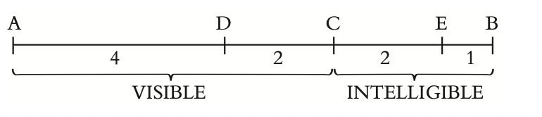

[1]: See 479d3–5 for what happens to conventions not established in this way.

[2]: See 539e2–540c2, 581c10–583a11.

[3]: See 474b3–c3.

[4]: See Glossary of Terms s.v. being.

[5]: See 474d3–475b2.

[6]: See Phaedo 64c10–67c3.

[7]: Eikos: also, likeness.

[8]: See Glossary of Terms s.v. captain.

[9]: An intoxicant.

[10]: Aristotle, Rhetoric 1391a7–12, says that when Simonides was asked whether it was
better to be rich or wise, he replied:“Rich—because the wise spend their time at the
doors of the rich.”

[11]: 487d10.

[12]: 485c3.

[13]: Autou ho estin hekastou tês phuseôs: literally, “the what it is of the nature of each
thing itself.” See Glossary of Terms s.v. what it is.

[14]: See 611e1–612a6.

[15]: See Homer, Iliad 24.367.

[16]: I.e., rivals in the craft of teaching virtue. See Apology 24c–25c, Protagoras 317e–
328d, and Glossary of Terms s.v. sophist.

[17]: Chronou tribê: On the distinction between a craft (technê) and an experience-based
knack (tribê, empeiria), see Gorgias 462b–465a.

[18]: An inescapable compulsion.The origin of the phrase is uncertain.

[19]: Plato seems to have had Alcibiades in mind here and in what follows. See Alcibiades
104a–c, 105b–c, Symposium 215d–216d. Alcibiades’ extraordinary career is described
in Thucydides, Books 6–8.

[20]: The trial of Socrates in 399 BCE is the obvious case in point.

[21]: See 485d.

[22]: See Plato, Apology 31c–32a, where Socrates explains that his daimonion has kept
him out of politics.

[23]: See 412a–b, which gives a hint of this need.

[24]: I.e., dialectic.

[25]: Heraclitus’ sun was extinguished at night but rekindled the next morning.

[26]: See 614b ff.

[27]: Plato is mocking the rhetoricians who were fond of forced rhyme. His own words
ou gar pôpote eidon genomenon to nun legomenon—“they’ve never seen anything come
into existence that matches our account”—exhibit the phenomenon he is mocking.

[28]: See, e.g., Iliad 1.131.

[29]: At 412b–414a.The conviction referred to is identified at 412e6.

[30]: 434d–444e.

[31]: 435d.

[32]: See 532a–534d.

[33]: Throughout, Socrates is punning on the word tokos, which means either a child or
the interest on capital.

[34]: See 596b5–10.

[35]: See Glossary of Terms s.v. what it is.

[37]: Socrates’ claim ends with the words dunamei huperechontas (“superior in . . .
power”), Glaucon responds with the punning daimonias huperbolês. Hence the joke.

[38]: The play seems to be on the similarity of sound between orano (“heaven”) and
orato (“visible”).

[39]: 

[40]: Autos ho logos.
